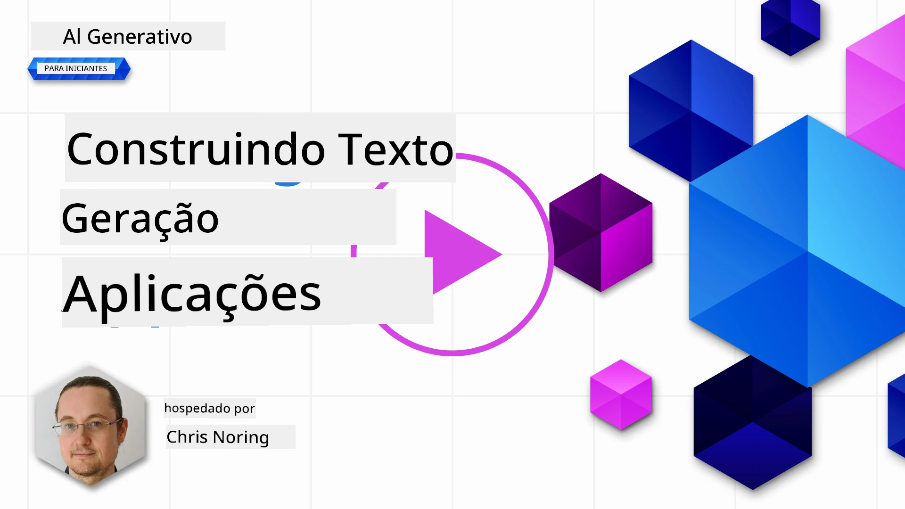

# Construindo Aplicações de Geração de Texto

[](https://youtu.be/0Y5Luf5sRQA?si=t_xVg0clnAI4oUFZ)

> _(Clique na imagem acima para assistir ao vídeo desta lição)_

Você viu até agora neste currículo que há conceitos fundamentais como prompts e até uma disciplina toda chamada "engenharia de prompts". Muitas ferramentas com as quais você pode interagir, como ChatGPT, Office 365, Microsoft Power Platform e outras, suportam o uso de prompts para realizar alguma tarefa.

Para você adicionar essa experiência a um app, precisa entender conceitos como prompts, completions e escolher uma biblioteca para trabalhar. É exatamente isso que você aprenderá neste capítulo.

## Introdução

Neste capítulo, você irá:

- Aprender sobre a biblioteca openai e seus conceitos principais.
- Construir um aplicativo de geração de texto usando openai.
- Entender como usar conceitos como prompt, temperatura e tokens para construir um app de geração de texto.

## Objetivos de aprendizado

Ao final desta lição, você será capaz de:

- Explicar o que é um app de geração de texto.
- Construir um app de geração de texto usando openai.
- Configurar seu app para usar mais ou menos tokens e também alterar a temperatura, para obter saídas variadas.

## O que é um app de geração de texto?

Normalmente, ao construir um app, ele tem algum tipo de interface como a seguinte:

- Baseada em comandos. Apps de console são típicos apps onde você digita um comando e ele realiza uma tarefa. Por exemplo, `git` é um app baseado em comandos.
- Interface de usuário (UI). Alguns apps têm interfaces gráficas (GUIs) onde você clica em botões, insere texto, seleciona opções e mais.

### Apps de console e UI são limitados

Compare com um app baseado em comando onde você digita um comando:

- **É limitado**. Você não pode digitar qualquer comando, apenas aqueles que o app suporta.
- **Específico para linguagem**. Alguns apps suportam muitas linguagens, mas por padrão o app é construído para uma linguagem específica, mesmo que você possa adicionar suporte para mais línguas.

### Benefícios de apps de geração de texto

Então, como um app de geração de texto é diferente?

Em um app de geração de texto, você tem mais flexibilidade, não está limitado a um conjunto de comandos ou a uma linguagem de entrada específica. Em vez disso, você pode usar linguagem natural para interagir com o app. Outro benefício é que você já está interagindo com uma fonte de dados treinada em um vasto corpus de informações, enquanto um app tradicional pode ser limitado ao que está em um banco de dados.

### O que posso construir com um app de geração de texto?

Existem muitas coisas que você pode construir. Por exemplo:

- **Um chatbot**. Um chatbot respondendo perguntas sobre tópicos, como sua empresa e seus produtos, pode ser uma boa combinação.
- **Assistente**. LLMs são ótimos em coisas como resumir textos, obter insights, produzir textos como currículos e muito mais.
- **Assistente de código**. Dependendo do modelo de linguagem que você usar, você pode construir um assistente de código que ajuda a escrever código. Por exemplo, pode usar produtos como GitHub Copilot ou ChatGPT para ajudar a escrever código.

## Como posso começar?

Bem, você precisa encontrar uma maneira de integrar com um LLM, o que geralmente envolve duas abordagens:

- Usar uma API. Aqui você constrói requisições web com seu prompt e recebe texto gerado de volta.
- Usar uma biblioteca. Bibliotecas ajudam a encapsular as chamadas de API e tornam o uso mais fácil.

## Bibliotecas/SDKs

Existem algumas bibliotecas bem conhecidas para trabalhar com LLMs como:

- **openai**, esta biblioteca facilita a conexão com seu modelo e o envio de prompts.

Depois há bibliotecas que operam em nível mais alto como:

- **Langchain**. Langchain é bem conhecida e suporta Python.
- **Semantic Kernel**. Semantic Kernel é uma biblioteca da Microsoft que suporta as linguagens C#, Python e Java.

## Primeiro app usando openai

Vamos ver como construir nosso primeiro app, quais bibliotecas precisamos, quanto é necessário e assim por diante.

### Instalar openai

Existem muitas bibliotecas para interagir com OpenAI ou Azure OpenAI. É possível usar várias linguagens de programação como C#, Python, JavaScript, Java e mais. Escolhemos usar a biblioteca `openai` para Python, então usaremos `pip` para instalá-la.

```bash
pip install openai
```

### Criar um recurso

Você precisa seguir os seguintes passos:

- Criar uma conta no Azure [https://azure.microsoft.com/free/](https://azure.microsoft.com/free/?WT.mc_id=academic-105485-koreyst).
- Obter acesso ao Azure OpenAI. Vá para [https://learn.microsoft.com/azure/ai-foundry/openai/overview#how-do-i-get-access-to-azure-openai](https://learn.microsoft.com/azure/ai-foundry/openai/overview#how-do-i-get-access-to-azure-openai?WT.mc_id=academic-105485-koreyst) e solicite acesso.

  > [!NOTE]
  > No momento da escrita, é necessário solicitar acesso ao Azure OpenAI.

- Instale Python <https://www.python.org/>
- Crie um recurso do serviço Azure OpenAI. Veja este guia para como [criar um recurso](https://learn.microsoft.com/azure/ai-foundry/openai/how-to/create-resource?pivots=web-portal?WT.mc_id=academic-105485-koreyst).

### Localizar chave e endpoint da API

Neste ponto, você precisa dizer para a biblioteca `openai` qual chave API usar. Para encontrar sua chave API, vá para a seção "Chaves e Endpoint" do seu recurso Azure OpenAI e copie o valor da "Chave 1".


Agora que você copiou essa informação, vamos instruir as bibliotecas a usá-la.

> [!NOTE]
> Vale a pena separar sua chave da API do código. Você pode fazer isso usando variáveis de ambiente.
>
> - Defina a variável de ambiente `OPENAI_API_KEY` com sua chave API.
>   `export OPENAI_API_KEY='sk-...'`

### Configuração para Azure

Se você está usando Azure OpenAI (agora parte do Microsoft Foundry), veja como configurar. Usamos o cliente padrão `OpenAI` apontado para o endpoint do Azure OpenAI `/openai/v1/`, que funciona com a Responses API e não precisa de `api_version`:

```python
import os
from openai import OpenAI

client = OpenAI(
    api_key=os.environ["AZURE_OPENAI_API_KEY"],
    base_url=f"{os.environ['AZURE_OPENAI_ENDPOINT'].rstrip('/')}/openai/v1/",
)
```

Acima estamos definindo o seguinte:

- `api_key`, essa é sua chave encontrada no Portal Azure ou no portal Microsoft Foundry.
- `base_url`, este é o endpoint do seu recurso Foundry com `/openai/v1/` adicionado. O endpoint estável v1 funciona tanto com OpenAI quanto com Azure OpenAI, sem necessidade de gerenciar `api_version`.

> [!NOTE] > `os.environ` lê variáveis de ambiente. Você pode usá-lo para ler variáveis como `AZURE_OPENAI_API_KEY` e `AZURE_OPENAI_ENDPOINT`. Defina essas variáveis em seu terminal ou usando uma biblioteca como `dotenv`.

## Gerar texto

A forma de gerar texto é usar a Responses API através do método `responses.create`. Veja um exemplo:

```python
prompt = "Complete the following: Once upon a time there was a"

response = client.responses.create(
    model="gpt-5-mini",  # este é o nome do seu deployment do modelo
    input=prompt,
    store=False,
)
print(response.output_text)
```

No código acima, criamos uma resposta e passamos o modelo que queremos usar e o prompt. Depois imprimimos o texto gerado via `response.output_text`.

### Conversas multi-turno

A Responses API é bem adequada tanto para geração de texto de único turno quanto para chatbots multi-turno - você fornece uma lista de mensagens em `input` para construir a conversa:

```python
from openai import OpenAI

client = OpenAI(api_key="sk-...")

response = client.responses.create(model="gpt-5-mini", input="Hello world", store=False)
print(response.output_text)
```

Mais sobre essa funcionalidade em um capítulo futuro.

## Exercício - seu primeiro app de geração de texto

Agora que aprendemos como configurar e usar openai, é hora de construir seu primeiro app de geração de texto. Para construir seu app, siga estes passos:

1. Crie um ambiente virtual e instale openai:

   ```bash
   python -m venv venv
   source venv/bin/activate
   pip install openai
   ```

   > [!NOTE]
   > Se você usar Windows, digite `venv\Scripts\activate` em vez de `source venv/bin/activate`.

   > [!NOTE]
   > Localize sua chave Azure OpenAI indo para [https://portal.azure.com/](https://portal.azure.com/?WT.mc_id=academic-105485-koreyst), procure por `Open AI`, selecione o recurso `Open AI` e depois selecione `Chaves e Endpoint` e copie o valor de `Chave 1`.

1. Crie um arquivo _app.py_ e coloque o seguinte código:

   ```python
   import os
   from openai import OpenAI

   client = OpenAI(
       api_key="<replace this value with your Azure OpenAI key>",
       base_url="<endpoint found in Azure Portal>/openai/v1/",
   )
   deployment_name = "<deployment name>"

   # adicione seu código de conclusão
   prompt = "Complete the following: Once upon a time there was a"

   # faça uma solicitação usando a API de Respostas
   response = client.responses.create(model=deployment_name, input=prompt, store=False)

   # imprima a resposta
   print(response.output_text)
   ```

   > [!NOTE]
   > Se você está usando o OpenAI puro (não Azure), use `client = OpenAI(api_key="<substitua este valor pela sua chave OpenAI>")` (sem `base_url`) e passe um nome de modelo como `gpt-5-mini` ao invés de um nome de implantação.

   Você deve ver uma saída assim:

   ```output
    very unhappy _____.

   Once upon a time there was a very unhappy mermaid.
   ```

## Diferentes tipos de prompts, para diferentes coisas

Agora você viu como gerar texto usando um prompt. Você até tem um programa rodando que pode modificar para gerar diferentes tipos de texto.

Prompts podem ser usados para todo tipo de tarefa. Por exemplo:

- **Gerar um tipo de texto**. Por exemplo, criar um poema, perguntas para um quiz etc.
- **Buscar informações**. Pode usar prompts para procurar informações, como no exemplo 'O que significa CORS em desenvolvimento web?'.
- **Gerar código**. Pode usar prompts para gerar códigos, por exemplo, desenvolver uma expressão regular para validar emails ou até gerar um programa completo, como um app web.

## Um caso de uso mais prático: um gerador de receitas

Imagine que você tem ingredientes em casa e quer cozinhar algo. Para isso, precisa de uma receita. Uma forma de encontrar receitas é usar um mecanismo de busca ou um LLM para isso.

Você poderia escrever um prompt assim:

> "Mostre-me 5 receitas para um prato com os seguintes ingredientes: frango, batatas e cenouras. Para cada receita, liste todos os ingredientes usados"

Dado o prompt acima, você pode obter uma resposta semelhante a:

```output
1. Roasted Chicken and Vegetables:
Ingredients:
- 4 chicken thighs
- 2 potatoes, cut into cubes
- 2 carrots, cut into cubes
- 2 tablespoons olive oil
- 2 cloves garlic, minced
- 1 teaspoon dried thyme
- 1 teaspoon dried oregano
- Salt and pepper, to taste

2. Chicken and Potato Stew:
Ingredients:
- 2 tablespoons olive oil
- 1 onion, diced
- 2 cloves garlic, minced
- 2 chicken breasts, cut into cubes
- 2 potatoes, cut into cubes
- 2 carrots, cut into cubes
- 1 teaspoon dried oregano
- 1 teaspoon dried thyme
- 1 cup chicken broth
- Salt and pepper, to taste

3. Chicken and Potato Bake:
Ingredients:
- 2 tablespoons olive oil
- 2 chicken breasts, cut into cubes
- 2 potatoes, cut into cubes
- 2 carrots, cut into cubes
- 1 onion, diced
- 2 cloves garlic, minced
- 1 teaspoon dried oregano
- 1 teaspoon dried thyme
- 1 cup chicken broth
- Salt and pepper, to taste

4. Chicken and Potato Soup:
Ingredients:
- 2 tablespoons olive oil
- 1 onion, diced
- 2 cloves garlic, minced
- 2 chicken breasts, cut into cubes
- 2 potatoes, cut into cubes
- 2 carrots, cut into cubes
- 1 teaspoon dried oregano
- 1 teaspoon dried thyme
- 4 cups chicken broth
- Salt and pepper, to taste

5. Chicken and Potato Hash:
Ingredients:
- 2 tablespoons olive oil
- 2 chicken breasts, cut into cubes
- 2 potatoes, cut into cubes
- 2 carrots, cut into cubes
- 1 onion, diced
- 2 cloves garlic, minced
- 1 teaspoon dried oregano
```

Esse resultado é ótimo, sei o que cozinhar. Neste ponto, melhorias úteis poderiam ser:

- Filtrar os ingredientes que não gosto ou sou alérgico.
- Gerar uma lista de compras, caso eu não tenha todos os ingredientes em casa.

Para os casos acima, vamos adicionar um prompt adicional:

> "Por favor, remova receitas com alho, pois sou alérgico, e substitua por outro ingrediente. Além disso, produza uma lista de compras para as receitas, considerando que já tenho frango, batatas e cenouras em casa."

Agora você tem um novo resultado, a saber:

```output
1. Roasted Chicken and Vegetables:
Ingredients:
- 4 chicken thighs
- 2 potatoes, cut into cubes
- 2 carrots, cut into cubes
- 2 tablespoons olive oil
- 1 teaspoon dried thyme
- 1 teaspoon dried oregano
- Salt and pepper, to taste

2. Chicken and Potato Stew:
Ingredients:
- 2 tablespoons olive oil
- 1 onion, diced
- 2 chicken breasts, cut into cubes
- 2 potatoes, cut into cubes
- 2 carrots, cut into cubes
- 1 teaspoon dried oregano
- 1 teaspoon dried thyme
- 1 cup chicken broth
- Salt and pepper, to taste

3. Chicken and Potato Bake:
Ingredients:
- 2 tablespoons olive oil
- 2 chicken breasts, cut into cubes
- 2 potatoes, cut into cubes
- 2 carrots, cut into cubes
- 1 onion, diced
- 1 teaspoon dried oregano
- 1 teaspoon dried thyme
- 1 cup chicken broth
- Salt and pepper, to taste

4. Chicken and Potato Soup:
Ingredients:
- 2 tablespoons olive oil
- 1 onion, diced
- 2 chicken breasts, cut into cubes
- 2 potatoes, cut into cubes
- 2 carrots, cut into cubes
- 1 teaspoon dried oregano
- 1 teaspoon dried thyme
- 4 cups chicken broth
- Salt and pepper, to taste

5. Chicken and Potato Hash:
Ingredients:
- 2 tablespoons olive oil
- 2 chicken breasts, cut into cubes
- 2 potatoes, cut into cubes
- 2 carrots, cut into cubes
- 1 onion, diced
- 1 teaspoon dried oregano

Shopping List:
- Olive oil
- Onion
- Thyme
- Oregano
- Salt
- Pepper
```

Essas são suas cinco receitas, sem alho mencionado, e você também tem uma lista de compras considerando o que já tem em casa.

## Exercício - construa um gerador de receitas

Agora que dramatizamos um cenário, vamos escrever o código para corresponder ao cenário demonstrado. Para isso, siga estes passos:

1. Use o arquivo _app.py_ existente como ponto de partida
1. Localize a variável `prompt` e altere seu código para o seguinte:

   ```python
   prompt = "Show me 5 recipes for a dish with the following ingredients: chicken, potatoes, and carrots. Per recipe, list all the ingredients used"
   ```

   Se você rodar o código agora, deverá ver uma saída semelhante a:

   ```output
   -Chicken Stew with Potatoes and Carrots: 3 tablespoons oil, 1 onion, chopped, 2 cloves garlic, minced, 1 carrot, peeled and chopped, 1 potato, peeled and chopped, 1 bay leaf, 1 thyme sprig, 1/2 teaspoon salt, 1/4 teaspoon black pepper, 1 1/2 cups chicken broth, 1/2 cup dry white wine, 2 tablespoons chopped fresh parsley, 2 tablespoons unsalted butter, 1 1/2 pounds boneless, skinless chicken thighs, cut into 1-inch pieces
   -Oven-Roasted Chicken with Potatoes and Carrots: 3 tablespoons extra-virgin olive oil, 1 tablespoon Dijon mustard, 1 tablespoon chopped fresh rosemary, 1 tablespoon chopped fresh thyme, 4 cloves garlic, minced, 1 1/2 pounds small red potatoes, quartered, 1 1/2 pounds carrots, quartered lengthwise, 1/2 teaspoon salt, 1/4 teaspoon black pepper, 1 (4-pound) whole chicken
   -Chicken, Potato, and Carrot Casserole: cooking spray, 1 large onion, chopped, 2 cloves garlic, minced, 1 carrot, peeled and shredded, 1 potato, peeled and shredded, 1/2 teaspoon dried thyme leaves, 1/4 teaspoon salt, 1/4 teaspoon black pepper, 2 cups fat-free, low-sodium chicken broth, 1 cup frozen peas, 1/4 cup all-purpose flour, 1 cup 2% reduced-fat milk, 1/4 cup grated Parmesan cheese

   -One Pot Chicken and Potato Dinner: 2 tablespoons olive oil, 1 pound boneless, skinless chicken thighs, cut into 1-inch pieces, 1 large onion, chopped, 3 cloves garlic, minced, 1 carrot, peeled and chopped, 1 potato, peeled and chopped, 1 bay leaf, 1 thyme sprig, 1/2 teaspoon salt, 1/4 teaspoon black pepper, 2 cups chicken broth, 1/2 cup dry white wine

   -Chicken, Potato, and Carrot Curry: 1 tablespoon vegetable oil, 1 large onion, chopped, 2 cloves garlic, minced, 1 carrot, peeled and chopped, 1 potato, peeled and chopped, 1 teaspoon ground coriander, 1 teaspoon ground cumin, 1/2 teaspoon ground turmeric, 1/2 teaspoon ground ginger, 1/4 teaspoon cayenne pepper, 2 cups chicken broth, 1/2 cup dry white wine, 1 (15-ounce) can chickpeas, drained and rinsed, 1/2 cup raisins, 1/2 cup chopped fresh cilantro
   ```

   > NOTA, seu LLM é não-determinístico, então você pode obter resultados diferentes cada vez que rodar o programa.

   Ótimo, vamos ver como podemos melhorar as coisas. Para melhorar, queremos garantir que o código seja flexível, para que ingredientes e número de receitas possam ser alterados facilmente.

1. Vamos alterar o código da seguinte forma:

   ```python
   no_recipes = input("No of recipes (for example, 5): ")

   ingredients = input("List of ingredients (for example, chicken, potatoes, and carrots): ")

   # interpolar o número de receitas no prompt e ingredientes
   prompt = f"Show me {no_recipes} recipes for a dish with the following ingredients: {ingredients}. Per recipe, list all the ingredients used"
   ```

   Um código para um teste de execução poderia ser assim:

   ```output
   No of recipes (for example, 5): 3
   List of ingredients (for example, chicken, potatoes, and carrots): milk,strawberries

   -Strawberry milk shake: milk, strawberries, sugar, vanilla extract, ice cubes
   -Strawberry shortcake: milk, flour, baking powder, sugar, salt, unsalted butter, strawberries, whipped cream
   -Strawberry milk: milk, strawberries, sugar, vanilla extract
   ```

### Melhore adicionando filtro e lista de compras

Agora temos um app funcional capaz de produzir receitas e é flexível pois depende das entradas do usuário, tanto no número de receitas quanto nos ingredientes usados.

Para melhorar ainda mais, queremos adicionar o seguinte:

- **Filtrar ingredientes**. Queremos poder filtrar ingredientes que não gostamos ou somos alérgicos. Para essa mudança, podemos editar nosso prompt existente e adicionar uma condição de filtro no final, assim:

  ```python
  filter = input("Filter (for example, vegetarian, vegan, or gluten-free): ")

  prompt = f"Show me {no_recipes} recipes for a dish with the following ingredients: {ingredients}. Per recipe, list all the ingredients used, no {filter}"
  ```

  Acima, adicionamos `{filter}` no final do prompt e também capturamos o valor do filtro do usuário.

  Um input de exemplo rodando o programa agora poderia ser assim:

  ```output
  No of recipes (for example, 5): 3
  List of ingredients (for example, chicken, potatoes, and carrots): onion,milk
  Filter (for example, vegetarian, vegan, or gluten-free): no milk

  1. French Onion Soup

  Ingredients:

  -1 large onion, sliced
  -3 cups beef broth
  -1 cup milk
  -6 slices french bread
  -1/4 cup shredded Parmesan cheese
  -1 tablespoon butter
  -1 teaspoon dried thyme
  -1/4 teaspoon salt
  -1/4 teaspoon black pepper

  Instructions:

  1. In a large pot, sauté onions in butter until golden brown.
  2. Add beef broth, milk, thyme, salt, and pepper. Bring to a boil.
  3. Reduce heat and simmer for 10 minutes.
  4. Place french bread slices on soup bowls.
  5. Ladle soup over bread.
  6. Sprinkle with Parmesan cheese.

  2. Onion and Potato Soup

  Ingredients:

  -1 large onion, chopped
  -2 cups potatoes, diced
  -3 cups vegetable broth
  -1 cup milk
  -1/4 teaspoon black pepper

  Instructions:

  1. In a large pot, sauté onions in butter until golden brown.
  2. Add potatoes, vegetable broth, milk, and pepper. Bring to a boil.
  3. Reduce heat and simmer for 10 minutes.
  4. Serve hot.

  3. Creamy Onion Soup

  Ingredients:

  -1 large onion, chopped
  -3 cups vegetable broth
  -1 cup milk
  -1/4 teaspoon black pepper
  -1/4 cup all-purpose flour
  -1/2 cup shredded Parmesan cheese

  Instructions:

  1. In a large pot, sauté onions in butter until golden brown.
  2. Add vegetable broth, milk, and pepper. Bring to a boil.
  3. Reduce heat and simmer for 10 minutes.
  4. In a small bowl, whisk together flour and Parmesan cheese until smooth.
  5. Add to soup and simmer for an additional 5 minutes, or until soup has thickened.
  ```

  Como pode ver, quaisquer receitas com leite foram filtradas. Mas, se você é intolerante à lactose, talvez queira filtrar receitas com queijo também, então é importante ser específico.


- **Produza uma lista de compras**. Queremos produzir uma lista de compras, considerando o que já temos em casa.

  Para essa funcionalidade, poderíamos tentar resolver tudo em um único prompt ou dividir em dois prompts. Vamos tentar a segunda abordagem. Aqui estamos sugerindo adicionar um prompt adicional, mas para isso funcionar, precisamos adicionar o resultado do primeiro prompt como contexto para o segundo prompt.

  Localize a parte no código que imprime o resultado do primeiro prompt e adicione o seguinte código abaixo:

  ```python
  old_prompt_result = response.output_text
  prompt = "Produce a shopping list for the generated recipes and please don't include ingredients that I already have."

  new_prompt = f"{old_prompt_result} {prompt}"
  response = client.responses.create(model=deployment_name, input=new_prompt, max_output_tokens=1200, store=False)

  # imprimir resposta
  print("Shopping list:")
  print(response.output_text)
  ```

  Note o seguinte:

  1. Estamos construindo um novo prompt adicionando o resultado do primeiro prompt ao novo prompt:

     ```python
     new_prompt = f"{old_prompt_result} {prompt}"
     ```

  1. Fazemos uma nova requisição, também considerando o número de tokens que pedimos no primeiro prompt, então dessa vez dizemos que `max_output_tokens` é 1200.

     ```python
     response = client.responses.create(model=deployment_name, input=new_prompt, max_output_tokens=1200, store=False)
     ```

     Testando este código, agora chegamos à seguinte saída:

     ```output
     No of recipes (for example, 5): 2
     List of ingredients (for example, chicken, potatoes, and carrots): apple,flour
     Filter (for example, vegetarian, vegan, or gluten-free): sugar


     -Apple and flour pancakes: 1 cup flour, 1/2 tsp baking powder, 1/2 tsp baking soda, 1/4 tsp salt, 1 tbsp sugar, 1 egg, 1 cup buttermilk or sour milk, 1/4 cup melted butter, 1 Granny Smith apple, peeled and grated
     -Apple fritters: 1-1/2 cups flour, 1 tsp baking powder, 1/4 tsp salt, 1/4 tsp baking soda, 1/4 tsp nutmeg, 1/4 tsp cinnamon, 1/4 tsp allspice, 1/4 cup sugar, 1/4 cup vegetable shortening, 1/4 cup milk, 1 egg, 2 cups shredded, peeled apples
     Shopping list:
     -Flour, baking powder, baking soda, salt, sugar, egg, buttermilk, butter, apple, nutmeg, cinnamon, allspice
     ```

## Melhore sua configuração

O que temos até agora é um código que funciona, mas há alguns ajustes que devemos fazer para melhorar ainda mais. Algumas coisas que devemos fazer são:

- **Separe segredos do código**, como a chave da API. Segredos não pertencem ao código e devem ser armazenados em local seguro. Para separar segredos do código, podemos usar variáveis de ambiente e bibliotecas como `python-dotenv` para carregá-las de um arquivo. Veja como isso ficaria no código:

  1. Crie um arquivo `.env` com o seguinte conteúdo:

     ```bash
     OPENAI_API_KEY=sk-...
     ```

     > Nota, para Azure OpenAI no Microsoft Foundry, é necessário definir as seguintes variáveis de ambiente em vez disso:

     ```bash
     AZURE_OPENAI_API_KEY=<replace>
     AZURE_OPENAI_ENDPOINT=<replace>
     AZURE_OPENAI_API_VERSION=2024-10-21
     ```

     No código, você carregaria as variáveis de ambiente assim:

     ```python
     import os
     from dotenv import load_dotenv
     from openai import OpenAI

     load_dotenv()

     client = OpenAI(api_key=os.environ["OPENAI_API_KEY"])
     ```

- **Uma palavra sobre o comprimento dos tokens**. Devemos considerar quantos tokens precisamos para gerar o texto que queremos. Tokens custam dinheiro, então sempre que possível, devemos ser econômicos com a quantidade de tokens usados. Por exemplo, podemos reformular o prompt para usar menos tokens?

  Para alterar o número de tokens usados, você pode usar o parâmetro `max_output_tokens`. Por exemplo, se quiser usar 100 tokens, você faria:

  ```python
  response = client.responses.create(model=deployment, input=prompt, max_output_tokens=100, store=False)
  ```

- **Experimentando com a temperatura**. Temperatura é algo que não mencionamos até agora, mas é um contexto importante para o desempenho do nosso programa. Quanto maior o valor da temperatura, mais aleatória será a saída. Por outro lado, quanto menor o valor da temperatura, mais previsível será a saída. Considere se deseja variação na sua saída ou não.

  Para alterar a temperatura, você pode usar o parâmetro `temperature`. Por exemplo, se quiser usar uma temperatura de 0,5, você faria:

  ```python
  response = client.responses.create(model=deployment, input=prompt, temperature=0.5, store=False)
  ```

  > Nota, quanto mais próximo de 1.0, mais variada será a saída.

- **Modelos de raciocínio não usam `temperature`**. Esta é uma mudança importante para 2026. Os modelos atuais, não obsoletos, disponíveis no Microsoft Foundry são **modelos de raciocínio** (a família GPT-5, série o) - e eles **não suportam `temperature` ou `top_p`** (nem `max_tokens`; use `max_output_tokens`). Se você enviar `temperature` para o `gpt-5-mini`, receberá um erro de "parâmetro não suportado". Então, para tentar o exemplo de temperatura acima, aponte para um modelo que ainda suporta controles de amostragem - por exemplo, um modelo aberto **Llama** como o `Llama-3.3-70B-Instruct` do [catálogo de modelos do Microsoft Foundry](https://ai.azure.com/catalog/models?WT.mc_id=academic-105485-koreyst), chamado via endpoint Foundry Models / Azure AI Inference (da mesma forma que os exemplos `githubmodels-*`). Para modelos de raciocínio como GPT-5, você direciona a saída de forma diferente:
  - **Engenharia de prompt** - instruções claras, exemplos e saída estruturada (veja a lição [04 - Prompt Engineering](../04-prompt-engineering-fundamentals/README.md?WT.mc_id=academic-105485-koreyst)) fazem o trabalho que os controles de amostragem faziam.
  - **Controles de raciocínio** - parâmetros como esforço de raciocínio/verbosidade equilibram a profundidade do raciocínio contra latência e custo.

  Em resumo: `temperature`/`top_p` ainda são válidos em muitos modelos (Llama, Mistral, Phi e a família GPT-4.x - embora GPT-4.x esteja sendo descontinuado), mas a direção é engenharia de prompt + controles de raciocínio em modelos de raciocínio como GPT-5.

## Tarefa

Para esta tarefa, você pode escolher o que construir.

Aqui estão algumas sugestões:

- Ajuste o aplicativo gerador de receitas para melhorá-lo ainda mais. Brinque com valores de temperatura e prompts para ver o que consegue criar.
- Construa um "companheiro de estudo". Este aplicativo deve ser capaz de responder perguntas sobre um assunto, por exemplo Python, você poderia ter prompts como "O que é um certo tópico em Python?", ou poderia ter um prompt que diz, mostre-me código para um determinado tópico etc.
- Bot de história, faça a história ganhar vida, instrua o bot a interpretar um certo personagem histórico e pergunte sobre sua vida e época.

## Solução

### Companheiro de estudo

Abaixo está um prompt inicial, veja como você pode usá-lo e ajustá-lo ao seu gosto.

```text
- "You're an expert on the Python language

    Suggest a beginner lesson for Python in the following format:

    Format:
    - concepts:
    - brief explanation of the lesson:
    - exercise in code with solutions"
```

### Bot de história

Aqui estão alguns prompts que você poderia usar:

```text
- "You are Abe Lincoln, tell me about yourself in 3 sentences, and respond using grammar and words like Abe would have used"
- "You are Abe Lincoln, respond using grammar and words like Abe would have used:

   Tell me about your greatest accomplishments, in 300 words"
```

## Verificação de conhecimento

O que o conceito de temperatura faz?

1. Controla quão aleatória é a saída.
1. Controla o tamanho da resposta.
1. Controla quantos tokens são usados.

## 🚀 Desafio

Ao trabalhar na tarefa, tente variar a temperatura, configurando-a para 0, 0,5 e 1. Lembre-se que 0 é o menos variado e 1 é o mais variado. Qual valor funciona melhor para seu aplicativo?

## Ótimo trabalho! Continue aprendendo

Após completar esta lição, confira nossa [coleção de aprendizado de IA Generativa](https://aka.ms/genai-collection?WT.mc_id=academic-105485-koreyst) para continuar aprimorando seu conhecimento em IA Generativa!

Vá para a Lição 7 onde veremos como [construir aplicativos de chat](../07-building-chat-applications/README.md?WT.mc_id=academic-105485-koreyst)!

---

<!-- CO-OP TRANSLATOR DISCLAIMER START -->
**Aviso Legal**:
Este documento foi traduzido usando o serviço de tradução por IA [Co-op Translator](https://github.com/Azure/co-op-translator). Embora nos esforcemos pela precisão, por favor, esteja ciente de que traduções automatizadas podem conter erros ou imprecisões. O documento original em seu idioma nativo deve ser considerado a fonte autorizada. Para informações críticas, recomenda-se tradução profissional humana. Não nos responsabilizamos por quaisquer mal-entendidos ou interpretações incorretas decorrentes do uso desta tradução.
<!-- CO-OP TRANSLATOR DISCLAIMER END -->