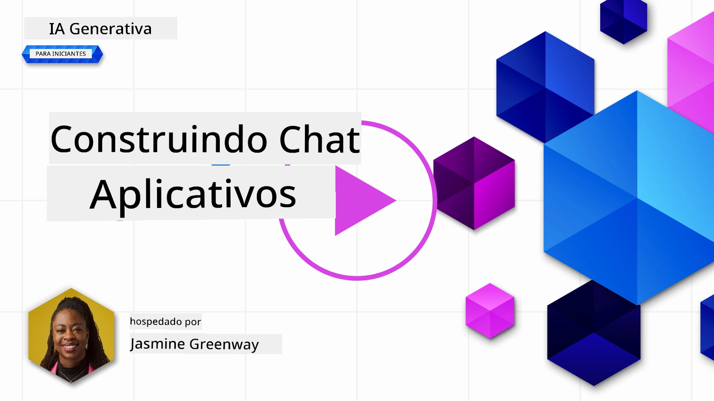
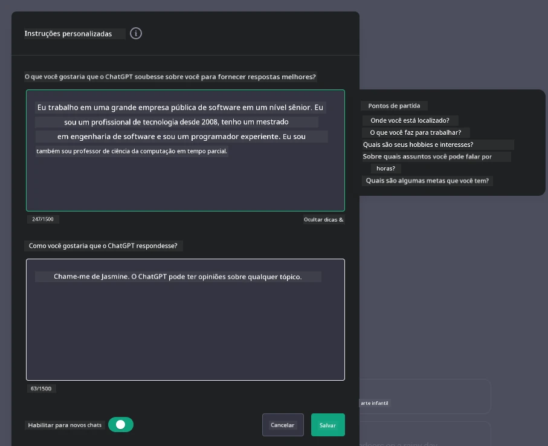

# Construindo Aplicações de Chat com IA Generativa

[](https://youtu.be/R9V0ZY1BEQo?si=IHuU-fS9YWT8s4sA)

> _(Clique na imagem acima para assistir ao vídeo desta lição)_

Agora que vimos como podemos construir aplicativos de geração de texto, vamos analisar as aplicações de chat.

Aplicações de chat tornaram-se parte integrada das nossas vidas diárias, oferecendo mais do que apenas um meio de conversa casual. Elas são partes integrais do atendimento ao cliente, suporte técnico e até sistemas sofisticados de aconselhamento. É provável que você tenha recebido ajuda de um aplicativo de chat não faz muito tempo. À medida que integramos tecnologias mais avançadas como IA generativa nessas plataformas, a complexidade aumenta e também os desafios.

Algumas perguntas que precisamos responder são:

- **Construção do aplicativo**. Como construir eficientemente e integrar perfeitamente essas aplicações com IA para casos de uso específicos?
- **Monitoramento**. Uma vez implantadas, como podemos monitorar e garantir que as aplicações operem no mais alto nível de qualidade, tanto em funcionalidade quanto em conformidade com os [seis princípios de IA responsável](https://www.microsoft.com/ai/responsible-ai?WT.mc_id=academic-105485-koreyst)?

À medida que avançamos para uma era definida pela automação e interações humanas-máquina sem atrito, entender como a IA generativa transforma o escopo, profundidade e adaptabilidade das aplicações de chat torna-se essencial. Esta lição investigará os aspectos da arquitetura que suportam esses sistemas intrincados, explorará as metodologias para ajustá-los para tarefas específicas de domínio e avaliará as métricas e considerações relevantes para garantir a implantação responsável da IA.

## Introdução

Esta lição aborda:

- Técnicas para construir e integrar aplicações de chat efficientemente.
- Como aplicar personalização e ajuste fino nas aplicações.
- Estratégias e considerações para monitorar aplicações de chat de forma eficaz.

## Objetivos de Aprendizagem

Ao final desta lição, você será capaz de:

- Descrever considerações para construir e integrar aplicações de chat em sistemas existentes.
- Personalizar aplicações de chat para casos de uso específicos.
- Identificar métricas chaves e considerações para monitorar e manter a qualidade de aplicações de chat com IA.
- Garantir que as aplicações de chat usem IA de forma responsável.

## Integrando IA Generativa em Aplicações de Chat

Elevar aplicações de chat por meio da IA generativa não se resume apenas a torná-las mais inteligentes; trata-se de otimizar sua arquitetura, desempenho e interface de usuário para entregar uma experiência de alta qualidade. Isso envolve investigar fundamentos arquiteturais, integrações via API e considerações de interface de usuário. Esta seção tem como objetivo oferecer um roteiro abrangente para navegar por esses cenários complexos, seja plugando-os em sistemas existentes ou construindo-os como plataformas independentes.

Ao final desta seção, você estará equipado com a expertise necessária para construir e incorporar aplicações de chat eficientemente.

### Chatbot ou Aplicação de Chat?

Antes de nos aprofundarmos em construir aplicações de chat, vamos comparar "chatbots" com "aplicações de chat com IA", que possuem papéis e funcionalidades distintas. O principal propósito de um chatbot é automatizar tarefas conversacionais específicas, como responder perguntas frequentes ou rastrear um pacote. Geralmente é governado por lógica baseada em regras ou algoritmos complexos de IA. Diferentemente, uma aplicação de chat com IA é um ambiente muito mais amplo, projetado para facilitar várias formas de comunicação digital, como chats de texto, voz e vídeo entre usuários humanos. Sua característica definidora é a integração de um modelo de IA generativa que simula conversas humanas detalhadas, gerando respostas baseadas numa ampla variedade de entradas e pistas contextuais. Uma aplicação de chat com IA generativa pode engajar discussões de domínio aberto, adaptar-se a contextos conversacionais em evolução e até produzir diálogos criativos ou complexos.

A tabela abaixo destaca as principais diferenças e semelhanças para ajudar a entender seus papéis únicos na comunicação digital.

| Chatbot                               | Aplicação de Chat com IA Generativa   |
| ------------------------------------- | -------------------------------------- |
| Focado em tarefas e baseado em regras  | Sensível ao contexto                    |
| Frequentemente integrado a sistemas maiores | Pode hospedar um ou múltiplos chatbots |
| Limitado a funções programadas          | Incorpora modelos de IA generativa     |
| Interações especializadas e estruturadas | Capaz de discussões em domínio aberto  |

### Aproveitando funcionalidades pré-construídas com SDKs e APIs

Ao construir uma aplicação de chat, um ótimo primeiro passo é avaliar o que já existe disponível. Usar SDKs e APIs para construir aplicações de chat é uma estratégia vantajosa por diversas razões. Ao integrar SDKs e APIs bem documentados, você está posicionando sua aplicação estrategicamente para sucesso a longo prazo, abordando preocupações de escalabilidade e manutenção.

- **Agiliza o processo de desenvolvimento e reduz custos**: Confiar em funcionalidades pré-construídas em vez do processo caro de construí-las você mesmo permite que você foque em outros aspectos da aplicação que possam ser mais importantes, como a lógica de negócios.
- **Melhor desempenho**: Ao construir funcionalidades do zero, você eventualmente se perguntará "Como isso escala? Esta aplicação é capaz de lidar com um aumento repentino de usuários?" SDKs e APIs bem mantidos geralmente possuem soluções embutidas para essas preocupações.
- **Manutenção facilitada**: Atualizações e melhorias são mais fáceis de administrar, pois a maioria das APIs e SDKs apenas requer atualização de uma biblioteca quando uma nova versão é lançada.
- **Acesso a tecnologia de ponta**: Aproveitar modelos que foram ajustados e treinados em grandes conjuntos de dados oferece à sua aplicação capacidades avançadas de processamento de linguagem natural.

Acessar funcionalidades de um SDK ou API normalmente envolve obter permissão para usar os serviços fornecidos, frequentemente por meio do uso de uma chave única ou token de autenticação. Usaremos a Biblioteca Python da OpenAI para explorar como isso funciona. Você também pode experimentar por conta própria no seguinte [notebook para OpenAI](./python/oai-assignment.ipynb?WT.mc_id=academic-105485-koreyst) ou no [notebook para Azure OpenAI Services](./python/aoai-assignment.ipynb?WT.mc_id=academic-105485-koreys) desta lição.

```python
import os
from openai import OpenAI

API_KEY = os.getenv("OPENAI_API_KEY","")

client = OpenAI(
    api_key=API_KEY
    )

response = client.responses.create(model="gpt-5-mini", input="Suggest two titles for an instructional lesson on chat applications for generative AI.", store=False)
print(response.output_text)
```

O exemplo acima usa o modelo GPT-5 mini com a API de Respostas para completar a pergunta, mas note que a chave da API é configurada previamente. Você receberia um erro se não definisse a chave.

## Experiência do Usuário (UX)

Princípios gerais de UX se aplicam a aplicações de chat, mas aqui estão algumas considerações adicionais que se tornam particularmente importantes devido aos componentes de aprendizado de máquina envolvidos.

- **Mecanismo para tratar ambiguidade**: Modelos de IA generativa ocasionalmente geram respostas ambíguas. Um recurso que permita aos usuários pedir esclarecimentos pode ser útil caso encontrem esse problema.
- **Retenção de contexto**: Modelos avançados de IA generativa têm a capacidade de lembrar contexto dentro de uma conversa, o que pode ser um ativo necessário para a experiência do usuário. Dar aos usuários a capacidade de controlar e gerenciar o contexto melhora a experiência, mas introduz o risco de reter informações sensíveis. Considerações sobre por quanto tempo essa informação é armazenada, como a introdução de uma política de retenção, podem equilibrar a necessidade de contexto com a privacidade.
- **Personalização**: Com a habilidade de aprender e se adaptar, modelos de IA oferecem uma experiência individualizada ao usuário. Adaptar a experiência do usuário via recursos como perfis de usuário não só faz o usuário se sentir compreendido, como também ajuda na busca de respostas específicas, criando uma interação mais eficiente e satisfatória.

Um exemplo de personalização são as configurações de "Instruções personalizadas" no ChatGPT da OpenAI. Elas permitem que você forneça informações sobre si mesmo que possam ser um contexto importante para seus prompts. Aqui está um exemplo de instrução personalizada.



Este "perfil" induz o ChatGPT a criar um plano de aula sobre listas encadeadas. Perceba que o ChatGPT considera que o usuário pode querer um plano de aula mais aprofundado baseado na sua experiência.


### Framework de Mensagens do Sistema da Microsoft para Modelos de Linguagem Grandes

[A Microsoft forneceu orientações](https://learn.microsoft.com/azure/ai-foundry/openai/concepts/system-message#define-the-models-output-format?WT.mc_id=academic-105485-koreyst) para escrever mensagens de sistema eficazes ao gerar respostas de LLMs divididas em 4 áreas:

1. Definir para quem o modelo é destinado, bem como suas capacidades e limitações.
2. Definir o formato de saída do modelo.
3. Fornecer exemplos específicos que demonstrem o comportamento esperado do modelo.
4. Fornecer diretrizes adicionais de comportamento.

### Acessibilidade

Seja o usuário com deficiências visuais, auditivas, motoras ou cognitivas, uma aplicação de chat bem projetada deve ser utilizável por todos. A lista a seguir detalha recursos específicos destinados a aprimorar a acessibilidade para várias deficiências de usuários.

- **Recursos para deficiência visual**: Temas de alto contraste e texto redimensionável, compatibilidade com leitores de tela.
- **Recursos para deficiência auditiva**: Funções de texto para fala e fala para texto, alertas visuais para notificações de áudio.
- **Recursos para deficiência motora**: Suporte para navegação por teclado, comandos de voz.
- **Recursos para deficiência cognitiva**: Opções de linguagem simplificada.

## Personalização e Ajuste fino para Modelos de Linguagem Específicos de Domínio

Imagine uma aplicação de chat que entende o jargão da sua empresa e antecipa as dúvidas específicas comuns dos seus usuários. Existem algumas abordagens que vale a pena mencionar:

- **Aproveitar modelos DSL**. DSL significa linguagem específica de domínio. Você pode aproveitar um chamado modelo DSL treinado em um domínio específico para entender seus conceitos e cenários.
- **Aplicar ajuste fino**. Ajuste fino é o processo de treinar seu modelo ainda mais com dados específicos.

## Personalização: Usando um DSL

Aproveitar modelos de linguagem específicos de domínio (Modelos DSL) pode melhorar o engajamento do usuário ao fornecer interações especializadas e contextualmente relevantes. É um modelo treinado ou ajustado para entender e gerar texto relacionado a um campo, indústria ou assunto específico. As opções para usar um modelo DSL podem variar desde treinar um do zero até usar modelos preexistentes via SDKs e APIs. Outra opção é o ajuste fino, que envolve pegar um modelo pré-treinado existente e adaptá-lo para um domínio específico.

## Personalização: Aplicar ajuste fino

Ajuste fino é frequentemente considerado quando um modelo pré-treinado não é suficiente em um domínio especializado ou tarefa específica.

Por exemplo, consultas médicas são complexas e requerem muito contexto. Quando um profissional médico diagnostica um paciente, baseia-se numa variedade de fatores como estilo de vida ou condições preexistentes, podendo até contar com jornais médicos recentes para validar o diagnóstico. Em cenários tão nuançados, uma aplicação de IA de uso geral não pode ser uma fonte confiável.

### Cenário: uma aplicação médica

Considere uma aplicação de chat projetada para ajudar profissionais de medicina fornecendo referências rápidas a diretrizes de tratamento, interações medicamentosas ou achados de pesquisas recentes.

Um modelo de uso geral pode ser adequado para responder perguntas médicas básicas ou fornecer aconselhamento geral, mas pode enfrentar dificuldades nas seguintes situações:

- **Casos altamente específicos ou complexos**. Por exemplo, um neurologista pode perguntar à aplicação: "Quais são as melhores práticas atuais para gerenciar epilepsia resistente a medicamentos em pacientes pediátricos?"
- **Falta de avanços recentes**. Um modelo de uso geral pode ter dificuldades para fornecer uma resposta atualizada que incorpore os avanços mais recentes em neurologia e farmacologia.

Em casos como esses, ajustar o modelo com um conjunto de dados médicos especializado pode melhorar significativamente sua capacidade de lidar com consultas médicas complexas de forma mais precisa e confiável. Isso requer acesso a um grande conjunto de dados relevante que represente os desafios e perguntas específicas do domínio.

## Considerações para uma Experiência de Chat com IA de Alta Qualidade

Esta seção delineia os critérios para aplicações de chat de "alta qualidade", que incluem a captura de métricas acionáveis e a aderência a um framework que utiliza IA de forma responsável.

### Métricas Chave

Para manter o alto desempenho de uma aplicação, é essencial acompanhar métricas e considerações chaves. Estas medições não apenas garantem a funcionalidade da aplicação, mas também avaliam a qualidade do modelo de IA e a experiência do usuário. Abaixo está uma lista cobrindo métricas básicas, de IA e de experiência do usuário a considerar.

| Métrica                       | Definição                                                                                                            | Considerações para o Desenvolvedor de Chat                         |
| ----------------------------- | --------------------------------------------------------------------------------------------------------------------- | ------------------------------------------------------------------ |
| **Tempo de Atividade (Uptime)**| Mede o tempo que a aplicação está operacional e acessível pelos usuários.                                           | Como você minimizará o tempo de inatividade?                      |
| **Tempo de Resposta**          | O tempo que a aplicação leva para responder a uma consulta do usuário.                                               | Como otimizará o processamento das consultas para melhorar o tempo de resposta? |
| **Precisão**                  | A razão entre predições verdadeiras positivas e o total de predições positivas.                                      | Como você validará a precisão do seu modelo?                      |
| **Revocação (Sensibilidade)**  | A razão entre predições verdadeiras positivas e o número real de positivos.                                         | Como medirá e melhorará a revocação?                             |
| **Pontuação F1**              | A média harmônica entre precisão e revocação, que equilibra o trade-off entre ambas.                                | Qual é sua meta de Pontuação F1? Como equilibrará precisão e revocação? |
| **Perplexidade**              | Mede quão bem a distribuição de probabilidade prevista pelo modelo está alinhada com a distribuição real dos dados. | Como minimizará a perplexidade?                                  |
| **Métricas de Satisfação do Usuário** | Mede a percepção do usuário sobre a aplicação. Frequentemente coletadas por meio de pesquisas.                    | Com que frequência coletará feedback dos usuários? Como adaptará com base nele? |
| **Taxa de Erro**              | A taxa com que o modelo comete erros de compreensão ou saída.                                                       | Quais estratégias você tem para reduzir taxas de erro?           |
| **Ciclos de Re-treinamento** | A frequência com que o modelo é atualizado para incorporar novos dados e insights.                                  | Com que frequência você re-treinará o modelo? O que desencadeia um ciclo de re-treinamento? |

| **Detecção de Anomalias**   | Ferramentas e técnicas para identificar padrões incomuns que não estão de acordo com o comportamento esperado.           | Como você responderá às anomalias?                                           |

### Implementando Práticas de IA Responsável em Aplicativos de Chat

A abordagem da Microsoft para IA Responsável identificou seis princípios que devem guiar o desenvolvimento e uso da IA. Abaixo estão os princípios, sua definição e aspectos que um desenvolvedor de chat deve considerar e por que deve levar isso a sério.

| Princípios            | Definição da Microsoft                                  | Considerações para Desenvolvedor de Chat                                 | Por que é Importante                                                                  |
| --------------------- | ------------------------------------------------------- | ---------------------------------------------------------------------- | ------------------------------------------------------------------------------------ |
| Equidade              | Sistemas de IA devem tratar todas as pessoas com justiça.| Assegurar que o aplicativo de chat não faça discriminação baseada em dados do usuário. | Para construir confiança e inclusão entre os usuários; evita implicações legais.      |
| Confiabilidade e Segurança | Sistemas de IA devem operar de forma confiável e segura.  | Implementar testes e mecanismos de segurança para minimizar erros e riscos.         | Garante satisfação do usuário e previne possíveis danos.                              |
| Privacidade e Segurança | Sistemas de IA devem ser seguros e respeitar a privacidade. | Implementar criptografia forte e medidas de proteção de dados.                      | Para proteger dados sensíveis dos usuários e cumprir leis de privacidade.             |
| Inclusividade         | Sistemas de IA devem capacitar e engajar todas as pessoas. | Projetar UI/UX acessível e fácil de usar para públicos diversos.                    | Garante que um público mais amplo possa usar o aplicativo efetivamente.              |
| Transparência         | Sistemas de IA devem ser compreensíveis.                | Fornecer documentação clara e justificativas para respostas da IA.                  | Usuários tendem a confiar mais em um sistema se entenderem como decisões são tomadas.|
| Responsabilidade      | As pessoas devem ser responsáveis pelos sistemas de IA. | Estabelecer um processo claro para auditoria e aprimoramento das decisões da IA.    | Permite melhoria contínua e medidas corretivas em caso de erros.                     |

## Tarefa

Veja [assignment](../../../07-building-chat-applications/python). Ele irá guiá-lo através de uma série de exercícios desde executar seus primeiros prompts de chat, até classificar e resumir textos e mais. Repare que as tarefas estão disponíveis em diferentes linguagens de programação!

## Ótimo Trabalho! Continue a Jornada

Após completar esta lição, confira nossa [coleção de Aprendizado em IA Generativa](https://aka.ms/genai-collection?WT.mc_id=academic-105485-koreyst) para continuar aprimorando seu conhecimento em IA Generativa!

Vá para a Lição 8 para ver como você pode começar a [construir aplicações de busca](../08-building-search-applications/README.md?WT.mc_id=academic-105485-koreyst)!

---

<!-- CO-OP TRANSLATOR DISCLAIMER START -->
**Aviso Legal**:
Este documento foi traduzido usando o serviço de tradução por IA [Co-op Translator](https://github.com/Azure/co-op-translator). Embora nos esforcemos pela precisão, por favor, esteja ciente de que traduções automatizadas podem conter erros ou imprecisões. O documento original em seu idioma nativo deve ser considerado a fonte autorizada. Para informações críticas, recomenda-se tradução profissional humana. Não nos responsabilizamos por quaisquer mal-entendidos ou interpretações incorretas decorrentes do uso desta tradução.
<!-- CO-OP TRANSLATOR DISCLAIMER END -->