# Construindo Aplicações de IA Low Code

[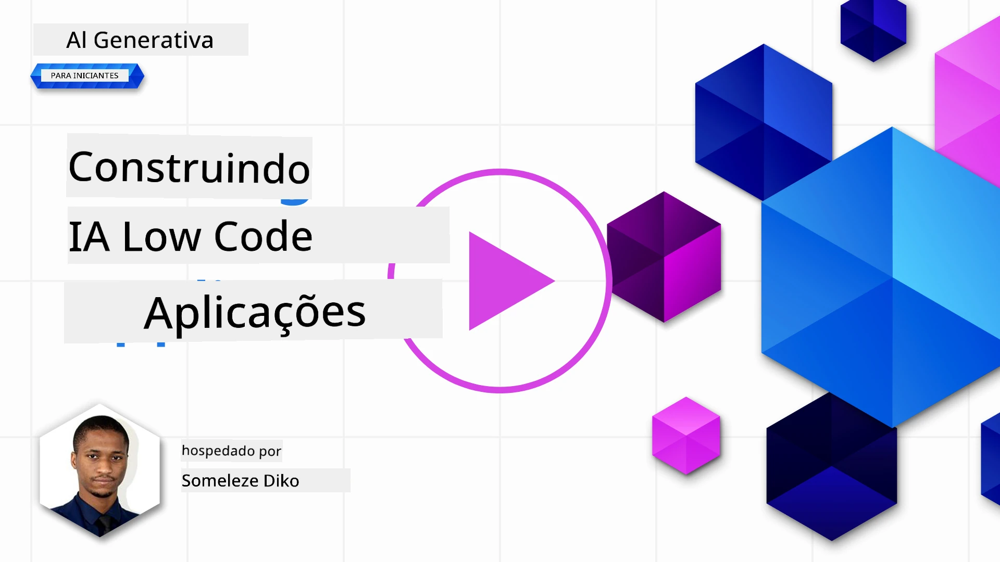](https://youtu.be/1vzq3Nd8GBA?si=h6LHWJXdmqf6mhDg)

> _(Clique na imagem acima para ver o vídeo desta lição)_

## Introdução

Agora que aprendemos como construir aplicações geradoras de imagens, vamos falar sobre low code. A IA generativa pode ser usada para várias áreas diferentes, incluindo low code, mas o que é low code e como podemos adicionar IA a ele?

Construir aplicativos e soluções ficou mais fácil para desenvolvedores tradicionais e não desenvolvedores através do uso de Plataformas de Desenvolvimento Low Code. Plataformas de Desenvolvimento Low Code permitem que você construa aplicativos e soluções com pouco ou nenhum código. Isso é alcançado ao fornecer um ambiente de desenvolvimento visual que permite arrastar e soltar componentes para construir aplicativos e soluções. Isso permite que você construa aplicativos e soluções mais rápido e com menos recursos. Nesta lição, mergulharemos fundo em como usar Low Code e como aprimorar o desenvolvimento low code com IA usando o Power Platform.

O Power Platform oferece às organizações a oportunidade de capacitar suas equipes a construir suas próprias soluções por meio de um ambiente intuitivo de low-code ou no-code. Esse ambiente ajuda a simplificar o processo de construção de soluções. Com o Power Platform, soluções podem ser construídas em dias ou semanas em vez de meses ou anos. O Power Platform é composto por cinco produtos principais: Power Apps, Power Automate, Power BI, Power Pages e Copilot Studio.

Esta lição cobre:

- Introdução à IA Generativa no Power Platform
- Introdução ao Copilot e como usá-lo
- Usando IA Generativa para construir apps e fluxos no Power Platform
- Entendendo os Modelos de IA no Power Platform com AI Builder
- Construindo agentes inteligentes com Microsoft Copilot Studio

## Objetivos de Aprendizagem

Ao final desta lição, você será capaz de:

- Entender como o Copilot funciona no Power Platform.

- Construir um Aplicativo de Rastreamento de Tarefas Estudantis para nossa startup educacional.

- Construir um Fluxo de Processamento de Faturas que usa IA para extrair informações das faturas.

- Aplicar as melhores práticas ao usar o Modelo de IA Criar Texto com GPT.

- Entender o que é o Microsoft Copilot Studio e como construir agentes inteligentes com ele.

As ferramentas e tecnologias que você usará nesta lição são:

- **Power Apps**, para o aplicativo de Rastreamento de Tarefas Estudantis, que oferece um ambiente de desenvolvimento low-code para construir apps que rastreiam, gerenciam e interagem com dados.

- **Dataverse**, para armazenar os dados do aplicativo de Rastreamento de Tarefas Estudantis, onde o Dataverse fornecerá uma plataforma de dados low-code para armazenar os dados do app.

- **Power Automate**, para o fluxo de Processamento de Faturas onde você terá um ambiente de desenvolvimento low-code para construir fluxos de trabalho para automatizar o processo de Processamento de Faturas.

- **AI Builder**, para o Modelo de IA do Processamento de Faturas onde você usará modelos de IA pré-construídos para processar as faturas da nossa startup.

## IA Generativa no Power Platform

Aprimorar o desenvolvimento low-code e a aplicação com IA generativa é uma área chave de foco para o Power Platform. O objetivo é permitir que todos construam apps, sites, dashboards com IA e automatizem processos com IA, _sem exigir qualquer expertise em ciência de dados_. Esse objetivo é alcançado integrando IA generativa na experiência de desenvolvimento low-code do Power Platform na forma do Copilot e AI Builder.

### Como isso funciona?

O Copilot é um assistente de IA que permite construir soluções no Power Platform descrevendo seus requisitos em uma série de etapas conversacionais usando linguagem natural. Você pode, por exemplo, instruir seu assistente de IA a informar quais campos seu aplicativo usará e ele criará tanto o app quanto o modelo de dados subjacente ou você pode especificar como configurar um fluxo no Power Automate.

Você pode usar funcionalidades movidas pelo Copilot como recurso nas telas do seu app para permitir que usuários descubram insights por meio de interações conversacionais.

O AI Builder é uma capacidade de IA low-code disponível no Power Platform que permite usar Modelos de IA para ajudar a automatizar processos e prever resultados. Com o AI Builder você pode trazer IA para seus apps e fluxos que se conectam aos seus dados no Dataverse ou em várias fontes de dados na nuvem, como SharePoint, OneDrive ou Azure.

O Copilot está disponível em todos os produtos do Power Platform: Power Apps, Power Automate, Power BI, Power Pages e Copilot Studio (anteriormente Power Virtual Agents). O AI Builder está disponível no Power Apps e Power Automate. Nesta lição, focaremos em como usar o Copilot e o AI Builder no Power Apps e Power Automate para construir uma solução para nossa startup educacional.

### Copilot no Power Apps

Como parte do Power Platform, o Power Apps fornece um ambiente de desenvolvimento low-code para construção de apps para rastrear, gerenciar e interagir com dados. É um conjunto de serviços de desenvolvimento de aplicativos com uma plataforma de dados escalável e a capacidade de se conectar a serviços na nuvem e dados locais. O Power Apps permite construir apps que rodam em navegadores, tablets e telefones, e que podem ser compartilhados com colegas de trabalho. O Power Apps facilita a entrada dos usuários no desenvolvimento de apps com uma interface simples, para que todo usuário de negócio ou desenvolvedor profissional possa construir apps personalizados. A experiência de desenvolvimento do app também é aprimorada com IA Generativa através do Copilot.

O recurso de assistente de IA Copilot no Power Apps permite que você descreva que tipo de app precisa e quais informações quer que seu app rastreie, colete ou mostre. O Copilot então gera um app Canvas responsivo baseado na sua descrição. Você pode então customizar o app para atender suas necessidades. O Copilot IA também gera e sugere uma Tabela no Dataverse com os campos necessários para armazenar os dados que você quer rastrear e alguns dados de exemplo. Vamos ver o que é o Dataverse e como você pode usá-lo no Power Apps nesta lição mais adiante. Você pode customizar a tabela para atender suas necessidades usando o recurso assistente de AI Copilot por meio de etapas conversacionais. Esse recurso está prontamente disponível na tela inicial do Power Apps.

### Copilot no Power Automate

Como parte do Power Platform, o Power Automate permite aos usuários criar fluxos de trabalho automatizados entre aplicativos e serviços. Ele ajuda a automatizar processos de negócios repetitivos, como comunicação, coleta de dados e aprovação de decisões. Sua interface simples permite que usuários com qualquer nível técnico (de iniciantes a desenvolvedores experientes) automatizem tarefas de trabalho. A experiência de desenvolvimento do fluxo de trabalho também é aprimorada com IA Generativa através do Copilot.

O recurso de assistente de IA Copilot no Power Automate permite que você descreva que tipo de fluxo precisa e quais ações quer que seu fluxo realize. O Copilot gera um fluxo baseado na sua descrição. Você pode então customizar o fluxo para atender suas necessidades. O Copilot IA também gera e sugere as ações necessárias para realizar a tarefa que você quer automatizar. Vamos ver o que são fluxos e como usá-los no Power Automate nesta lição mais adiante. Você poderá customizar as ações para atender suas necessidades usando o recurso assistente de IA Copilot por meio de etapas conversacionais. Esse recurso está prontamente disponível na tela inicial do Power Automate.

## Construindo Agentes Inteligentes com Microsoft Copilot Studio

[Microsoft Copilot Studio](https://learn.microsoft.com/microsoft-copilot-studio/fundamentals-what-is-copilot-studio?WT.mc_id=academic-105485-koreyst) (anteriormente Power Virtual Agents) é o membro low-code do Power Platform para construir **agentes de IA** — copilotos conversacionais que podem responder perguntas, tomar ações e automatizar tarefas em nome dos seus usuários. Assim como o resto do Power Platform, você constrói esses agentes numa experiência visual focada em linguagem natural: você descreve o que quer que o agente faça, e o Copilot Studio ajuda a estruturar suas instruções, conhecimento e ações.

Para nossa startup educacional, você poderia construir um agente que responde perguntas dos estudantes sobre cursos, verifica prazos de tarefas e até envia e-mails a um instrutor — tudo isso sem escrever código.

Aqui estão algumas das capacidades mais recentes que tornam o Copilot Studio poderoso:

- **Respostas generativas a partir do seu conhecimento**. Em vez de criar cada conversa manualmente, você pode conectar **fontes de conhecimento** — sites públicos, SharePoint, OneDrive, Dataverse, arquivos enviados ou dados corporativos via conectores — e o agente gera respostas fundamentadas a partir delas.

- **Orquestração generativa**. Em vez de depender de frases disparadoras rígidas, o agente usa IA para entender um pedido e decidir dinamicamente quais conhecimentos, tópicos e ações combinar para atendê-lo, incluindo encadear vários passos juntos.

- **Ações e conectores**. Agentes podem *fazer* coisas, não apenas conversar. Você pode dar a um agente ações suportadas pelos mais de 1.500 conectores predefinidos do Power Platform, fluxos do Power Automate, APIs REST personalizadas, prompts, ou servidores **Model Context Protocol (MCP)**.

- **Agentes autônomos**. Agentes não estão limitados a responder numa janela de chat. Você pode construir **agentes autônomos** que são acionados por eventos — como um novo e-mail, um novo registro no Dataverse ou um arquivo sendo enviado — e então agem em segundo plano para completar uma tarefa.

- **Orquestração multiagente**. Agentes podem chamar outros agentes. Um agente do Copilot Studio pode transferir para, ou ser estendido por, outros agentes, incluindo agentes publicados para Microsoft 365 Copilot e agentes construídos no Microsoft Foundry.

- **Escolha de modelo**. Além dos modelos integrados, você pode trazer modelos do catálogo de modelos Microsoft Foundry para ajustar como seu agente raciocina e responde.

- **Publicar em qualquer lugar**. Uma vez construído, um agente pode ser publicado em vários canais — Microsoft Teams, Microsoft 365 Copilot, um site ou app personalizado e mais — com segurança, autenticação e análises gerenciadas via experiência administrativa do Power Platform.

Você pode começar a construir seu primeiro agente em [copilotstudio.microsoft.com](https://copilotstudio.microsoft.com?WT.mc_id=academic-105485-koreyst) e aprender mais na [documentação do Microsoft Copilot Studio](https://learn.microsoft.com/microsoft-copilot-studio/?WT.mc_id=academic-105485-koreyst).

## Tarefa: Gerenciar tarefas estudantis e faturas para nossa startup, usando Copilot

Nossa startup oferece cursos online para estudantes. A startup cresceu rapidamente e agora está tendo dificuldades para acompanhar a demanda por seus cursos. Eles contrataram você como desenvolvedor do Power Platform para ajudá-los a construir uma solução low code para gerenciar as tarefas estudantis e as faturas. A solução deve ajudar a rastrear e gerenciar tarefas estudantis por meio de um app e automatizar o processo de processamento de faturas por meio de um fluxo de trabalho. Foi solicitado que você use IA Generativa para desenvolver a solução.

Ao começar a usar o Copilot, você pode usar a [Biblioteca de Prompts do Power Platform Copilot](https://github.com/pnp/powerplatform-prompts?WT.mc_id=academic-109639-somelezediko) para iniciar com os prompts. Essa biblioteca contém uma lista de prompts que você pode usar para construir apps e fluxos com Copilot. Você também pode usar os prompts da biblioteca para ter uma ideia de como descrever seus requisitos para o Copilot.

### Construir um Aplicativo de Rastreamento de Tarefas Estudantis para Nossa Startup

Os educadores da nossa startup têm tido dificuldades para acompanhar as tarefas estudantis. Eles têm usado uma planilha para rastrear as tarefas, mas isso ficou difícil de gerenciar com o aumento do número de estudantes. Eles solicitaram que você construa um app que ajude a rastrear e gerenciar as tarefas estudantis. O app deve permitir adicionar novas tarefas, visualizar tarefas, atualizar tarefas e excluir tarefas. O app também deve permitir que educadores e estudantes visualizem as tarefas que foram avaliadas e aquelas que não foram avaliadas.

Você construirá o app usando o Copilot no Power Apps seguindo os passos abaixo:

1. Navegue até a tela inicial do [Power Apps](https://make.powerapps.com?WT.mc_id=academic-105485-koreyst).

1. Use a área de texto na tela inicial para descrever o app que deseja construir. Por exemplo, **_Quero construir um app para rastrear e gerenciar tarefas estudantis_**. Clique no botão **Enviar** para enviar o prompt ao Copilot IA.

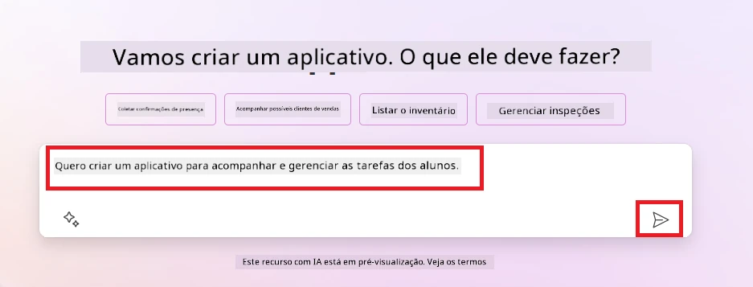

1. O Copilot IA sugerirá uma Tabela no Dataverse com os campos necessários para armazenar os dados que você quer rastrear e alguns dados de exemplo. Você pode customizar a tabela para atender suas necessidades usando o recurso assistente de IA Copilot por meio de etapas conversacionais.

   > **Importante**: O Dataverse é a plataforma de dados subjacente do Power Platform. É uma plataforma de dados low-code para armazenar os dados do app. É um serviço totalmente gerenciado que armazena dados com segurança na nuvem da Microsoft e é provisionado dentro do seu ambiente do Power Platform. Vem com capacidades integradas de governança de dados, como classificação de dados, linhagem de dados, controle de acesso granular e mais. Você pode aprender mais sobre o Dataverse [aqui](https://learn.microsoft.com/power-apps/maker/data-platform/data-platform-intro?WT.mc_id=academic-109639-somelezediko).

   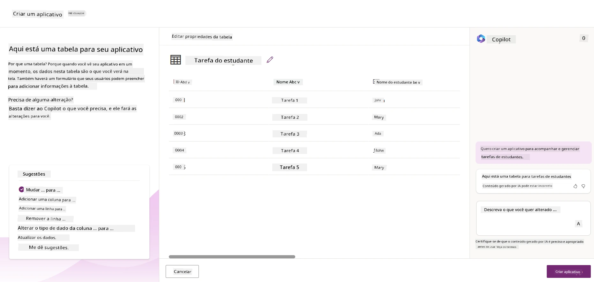

1. Os educadores querem enviar e-mails aos estudantes que entregaram suas tarefas para mantê-los atualizados sobre o progresso das tarefas. Você pode usar o Copilot para adicionar um novo campo à tabela para armazenar o e-mail do estudante. Por exemplo, você pode usar o seguinte prompt para adicionar uma nova coluna à tabela: **_Quero adicionar uma coluna para armazenar o e-mail do estudante_**. Clique no botão **Enviar** para enviar o prompt ao Copilot IA.

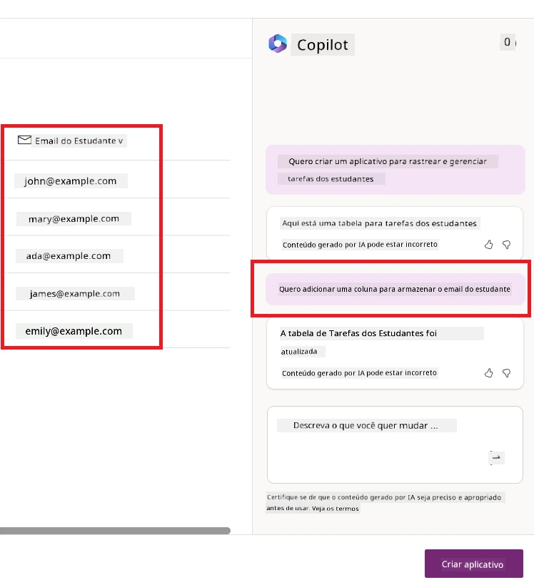

1. O Copilot IA gerará um novo campo e você poderá customizar o campo para atender suas necessidades.

1. Quando terminar com a tabela, clique no botão **Criar app** para criar o app.

1. O Copilot de IA gerará um app Canvas responsivo com base na sua descrição. Você poderá então personalizar o app para atender às suas necessidades.

1. Para educadores enviarem e-mails para os alunos, você pode usar o Copilot para adicionar uma nova tela ao app. Por exemplo, você pode usar o seguinte comando para adicionar uma nova tela ao app: **_Quero adicionar uma tela para enviar e-mails para os alunos_**. Clique no botão **Enviar** para enviar o comando ao Copilot de IA.

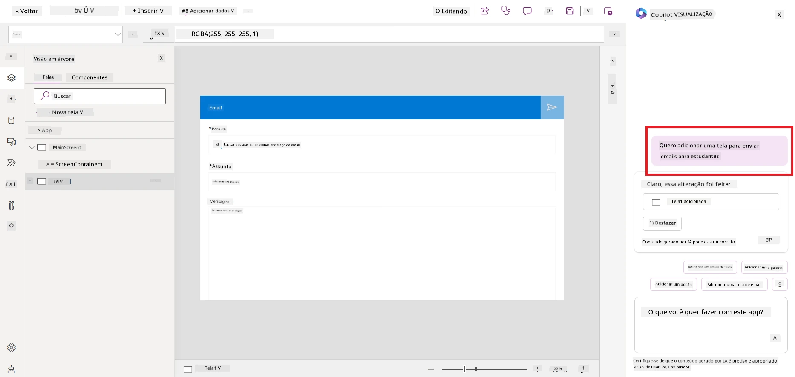

1. O Copilot de IA gerará uma nova tela e você poderá personalizar a tela para atender às suas necessidades.

1. Quando terminar com o app, clique no botão **Salvar** para salvar o app.

1. Para compartilhar o app com os educadores, clique no botão **Compartilhar** e depois clique novamente no botão **Compartilhar**. Você poderá então compartilhar o app com os educadores inserindo seus endereços de e-mail.

> **Sua tarefa de casa**: O app que você acabou de construir é um bom começo, mas pode ser aprimorado. Com o recurso de e-mail, os educadores só podem enviar e-mails para os alunos manualmente, digitando seus e-mails. Você pode usar o Copilot para construir uma automação que permita aos educadores enviar e-mails para os alunos automaticamente quando eles entregarem as tarefas? Sua dica é que com o prompt correto você pode usar o Copilot no Power Automate para construir isso.

### Construir uma Tabela de Informações de Faturas para Nossa Startup

A equipe financeira da nossa startup tem enfrentado dificuldades para controlar as faturas. Eles têm usado uma planilha para acompanhar as faturas, mas isso ficou difícil de gerenciar conforme o número de faturas aumentou. Eles pediram para você construir uma tabela que ajude a armazenar, acompanhar e gerenciar as informações das faturas recebidas. A tabela deve ser usada para construir uma automação que extraia todas as informações da fatura e as armazene na tabela. A tabela também deve permitir que a equipe financeira visualize as faturas que foram pagas e as que não foram pagas.

A Power Platform tem uma plataforma de dados subjacente chamada Dataverse que permite armazenar os dados para seus apps e soluções. O Dataverse fornece uma plataforma de dados com pouco código para armazenar os dados do app. É um serviço totalmente gerenciado que armazena dados com segurança na Microsoft Cloud e é provisionado dentro do seu ambiente Power Platform. Ele vem com recursos embutidos de governança de dados, como classificação de dados, linhagem de dados, controle de acesso detalhado, e mais. Você pode saber mais [sobre o Dataverse aqui](https://learn.microsoft.com/power-apps/maker/data-platform/data-platform-intro?WT.mc_id=academic-109639-somelezediko).

Por que devemos usar o Dataverse para nossa startup? As tabelas padrão e personalizadas dentro do Dataverse oferecem uma opção de armazenamento segura e baseada na nuvem para seus dados. As tabelas permitem armazenar diferentes tipos de dados, semelhante a como você poderia usar várias planilhas em uma única pasta de trabalho do Excel. Você pode usar tabelas para armazenar dados específicos da sua organização ou necessidades de negócios. Alguns dos benefícios que nossa startup obterá usando o Dataverse incluem, mas não estão limitados a:

- **Fácil de gerenciar**: Tanto os metadados quanto os dados são armazenados na nuvem, então você não precisa se preocupar com os detalhes de como são armazenados ou gerenciados. Você pode focar na construção dos seus apps e soluções.

- **Seguro**: O Dataverse oferece uma opção de armazenamento segura e baseada na nuvem para seus dados. Você pode controlar quem tem acesso aos dados nas suas tabelas e como eles podem acessá-los usando segurança baseada em função.

- **Metadados ricos**: Tipos de dados e relacionamentos são usados diretamente no Power Apps

- **Lógica e validação**: Você pode usar regras de negócios, campos calculados e regras de validação para aplicar lógica empresarial e manter a precisão dos dados.

Agora que você sabe o que é o Dataverse e por que deve usá-lo, vamos ver como você pode usar o Copilot para criar uma tabela no Dataverse que atenda aos requisitos da nossa equipe financeira.

> **Nota** : Você usará esta tabela na próxima seção para construir uma automação que extrairá todas as informações da fatura e as armazenará na tabela.

Para criar uma tabela no Dataverse usando o Copilot, siga os passos abaixo:

1. Navegue até a tela inicial do [Power Apps](https://make.powerapps.com?WT.mc_id=academic-105485-koreyst).

2. Na barra de navegação à esquerda, selecione **Tabelas** e depois clique em **Descrever a nova tabela**.

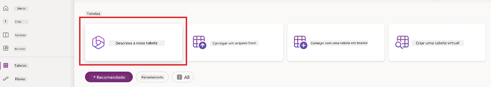

1. Na tela **Descrever a nova tabela**, use a área de texto para descrever a tabela que deseja criar. Por exemplo, **_Quero criar uma tabela para armazenar informações de faturas_**. Clique no botão **Enviar** para enviar o comando ao Copilot de IA.

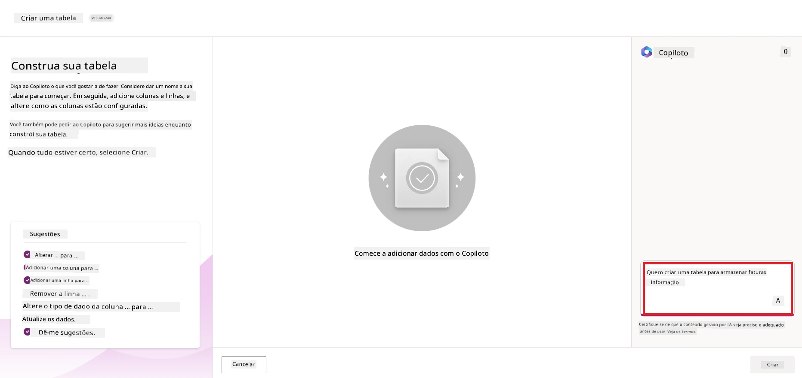

1. O Copilot de IA sugerirá uma tabela do Dataverse com os campos necessários para armazenar os dados que você deseja acompanhar e alguns dados de exemplo. Você poderá então personalizar a tabela para atender às suas necessidades usando o recurso assistente do Copilot de IA por meio de etapas conversacionais.

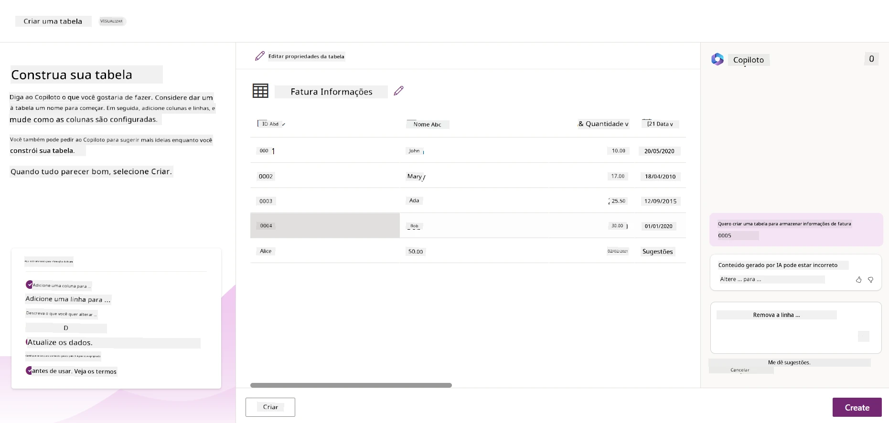

1. A equipe financeira quer enviar um e-mail para o fornecedor para atualizá-lo com o status atual da fatura. Você pode usar o Copilot para adicionar um novo campo à tabela para armazenar o e-mail do fornecedor. Por exemplo, você pode usar o seguinte comando para adicionar um novo campo à tabela: **_Quero adicionar uma coluna para armazenar o e-mail do fornecedor_**. Clique no botão **Enviar** para enviar o comando ao Copilot de IA.

1. O Copilot de IA gerará um novo campo e você poderá personalizar o campo para atender às suas necessidades.

1. Quando terminar com a tabela, clique no botão **Criar** para criar a tabela.

## Modelos de IA no Power Platform com AI Builder

O AI Builder é uma capacidade de IA com pouco código disponível no Power Platform que permite usar Modelos de IA para ajudar a automatizar processos e prever resultados. Com o AI Builder você pode trazer IA para seus apps e fluxos que se conectam aos seus dados no Dataverse ou em várias fontes de dados na nuvem, como SharePoint, OneDrive ou Azure.

## Modelos de IA Pré-construídos vs Modelos de IA Personalizados

O AI Builder oferece dois tipos de Modelos de IA: Modelos de IA Pré-construídos e Modelos de IA Personalizados. Modelos de IA Pré-construídos são modelos prontos para uso que são treinados pela Microsoft e disponíveis no Power Platform. Eles ajudam a adicionar inteligência aos seus apps e fluxos sem precisar reunir dados e depois construir, treinar e publicar seus próprios modelos. Você pode usar esses modelos para automatizar processos e prever resultados.

Alguns dos Modelos de IA Pré-construídos disponíveis no Power Platform incluem:

- **Extração de Frases-Chave**: Este modelo extrai frases-chave do texto.
- **Detecção de Idioma**: Este modelo detecta o idioma de um texto.
- **Análise de Sentimento**: Este modelo detecta sentimento positivo, negativo, neutro ou misto em texto.
- **Leitor de Cartão de Visita**: Este modelo extrai informações de cartões de visita.
- **Reconhecimento de Texto**: Este modelo extrai texto de imagens.
- **Detecção de Objetos**: Este modelo detecta e extrai objetos de imagens.
- **Processamento de Documentos**: Este modelo extrai informações de formulários.
- **Processamento de Faturas**: Este modelo extrai informações de faturas.

Com Modelos de IA Personalizados você pode trazer seu próprio modelo para o AI Builder para que ele funcione como qualquer modelo personalizado do AI Builder, permitindo que você treine o modelo usando seus próprios dados. Você pode usar esses modelos para automatizar processos e prever resultados tanto no Power Apps quanto no Power Automate. Ao usar seu próprio modelo existem limitações que se aplicam. Leia mais sobre essas [limitações](https://learn.microsoft.com/ai-builder/byo-model#limitations?WT.mc_id=academic-105485-koreyst).

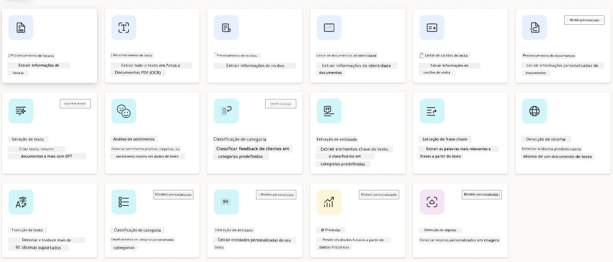

## Tarefa #2 - Construir um Fluxo de Processamento de Faturas para Nossa Startup

A equipe financeira tem enfrentado dificuldades para processar faturas. Eles têm usado uma planilha para acompanhar as faturas, mas isso ficou difícil de gerenciar conforme o número de faturas aumentou. Eles pediram para você construir um fluxo de trabalho que os ajude a processar faturas usando IA. O fluxo de trabalho deve permitir extrair informações das faturas e armazenar as informações em uma tabela do Dataverse. O fluxo de trabalho também deve permitir o envio de um e-mail para a equipe financeira com as informações extraídas.

Agora que você sabe o que é o AI Builder e por que deve usá-lo, vamos ver como usar o Modelo de Processamento de Faturas no AI Builder, que cobrimos anteriormente, para construir um fluxo de trabalho que ajude a equipe financeira a processar faturas.

Para construir um fluxo de trabalho que ajude a equipe financeira a processar faturas usando o Modelo de Processamento de Faturas no AI Builder, siga os passos abaixo:

1. Navegue até a tela inicial do [Power Automate](https://make.powerautomate.com?WT.mc_id=academic-105485-koreyst).

2. Use a área de texto na tela inicial para descrever o fluxo de trabalho que deseja construir. Por exemplo, **_Processar uma fatura quando ela chegar na minha caixa de entrada_**. Clique no botão **Enviar** para enviar o comando ao Copilot de IA.

   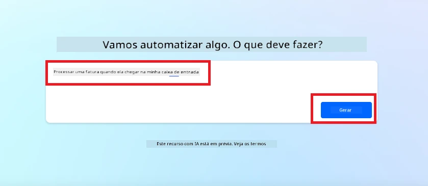

3. O Copilot de IA sugerirá as ações necessárias para realizar a tarefa que você deseja automatizar. Você pode clicar no botão **Próximo** para passar às próximas etapas.

4. Na próxima etapa, o Power Automate solicitará que você configure as conexões necessárias para o fluxo. Quando terminar, clique no botão **Criar fluxo** para criar o fluxo.

5. O Copilot de IA gerará um fluxo e você poderá personalizar o fluxo para atender às suas necessidades.

6. Atualize o gatilho do fluxo e defina a **Pasta** para a pasta onde as faturas serão armazenadas. Por exemplo, você pode definir a pasta como **Caixa de Entrada**. Clique em **Mostrar opções avançadas** e defina **Apenas com anexos** como **Sim**. Isso garantirá que o fluxo só seja executado quando um e-mail com anexo for recebido na pasta.

7. Remova as seguintes ações do fluxo: **HTML para texto**, **Compor**, **Compor 2**, **Compor 3** e **Compor 4**, pois você não irá usá-las.

8. Remova a ação **Condição** do fluxo porque você não irá usá-la. Deve ficar parecido com a captura de tela a seguir:

   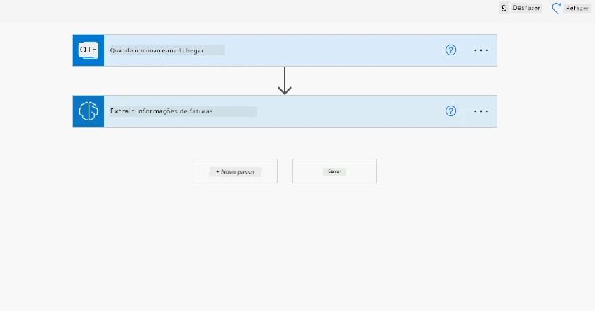

9. Clique no botão **Adicionar uma ação** e pesquise por **Dataverse**. Selecione a ação **Adicionar uma nova linha**.

10. Na ação **Extrair Informações das faturas**, atualize o **Arquivo da Fatura** para apontar para o **Conteúdo do Anexo** do e-mail. Isso garantirá que o fluxo extraia informações do anexo da fatura.

11. Selecione a **Tabela** que você criou anteriormente. Por exemplo, você pode selecionar a tabela **Informações da Fatura**. Escolha o conteúdo dinâmico da ação anterior para preencher os seguintes campos:

    - ID
    - Valor
    - Data
    - Nome
    - Status - Defina o **Status** como **Pendente**.
    - E-mail do Fornecedor - Use o conteúdo dinâmico **De** do gatilho **Quando um novo e-mail chega**.

    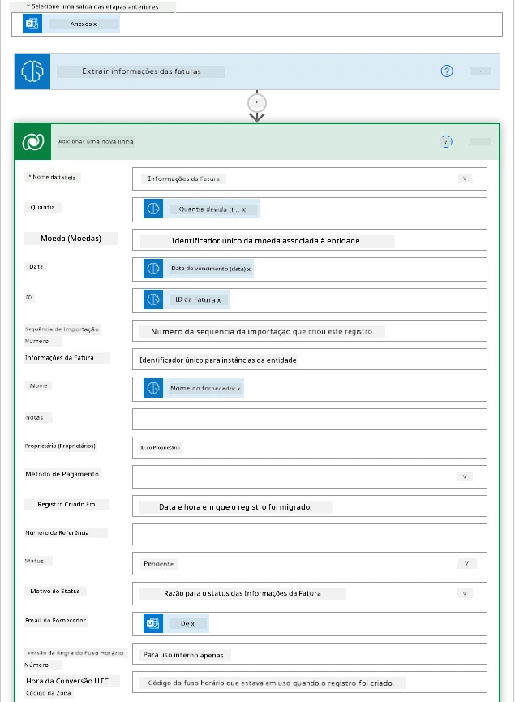

12. Quando terminar com o fluxo, clique no botão **Salvar** para salvar o fluxo. Você poderá testar o fluxo enviando um e-mail com uma fatura para a pasta que especificou no gatilho.

> **Sua tarefa de casa**: O fluxo que você acabou de construir é um bom começo, agora você precisa pensar em como construir uma automação que permita à nossa equipe financeira enviar um e-mail para o fornecedor para atualizá-lo com o status atual da fatura. Sua dica: o fluxo deve ser executado quando o status da fatura mudar.

## Usar um Modelo de IA de Geração de Texto no Power Automate

O Modelo de IA Criar Texto com GPT no AI Builder permite gerar texto baseado em um prompt e é alimentado pelo Microsoft Azure OpenAI Service. Com essa capacidade, você pode incorporar a tecnologia GPT (Generative Pre-Trained Transformer) em seus apps e fluxos para construir uma variedade de fluxos automatizados e aplicações informativas.

Modelos GPT passam por extenso treinamento com vastas quantidades de dados, permitindo que produzam texto que se assemelha muito à linguagem humana quando recebem um prompt. Quando integrados à automação de fluxos de trabalho, modelos de IA como GPT podem ser usados para simplificar e automatizar uma ampla gama de tarefas.

Por exemplo, você pode construir fluxos para gerar texto automaticamente para vários casos de uso, como: rascunhos de e-mails, descrições de produtos, e mais. Você também pode usar o modelo para gerar texto para vários apps, como chatbots e apps de atendimento ao cliente que permitem aos agentes de atendimento responder de forma eficaz e eficiente às consultas dos clientes.

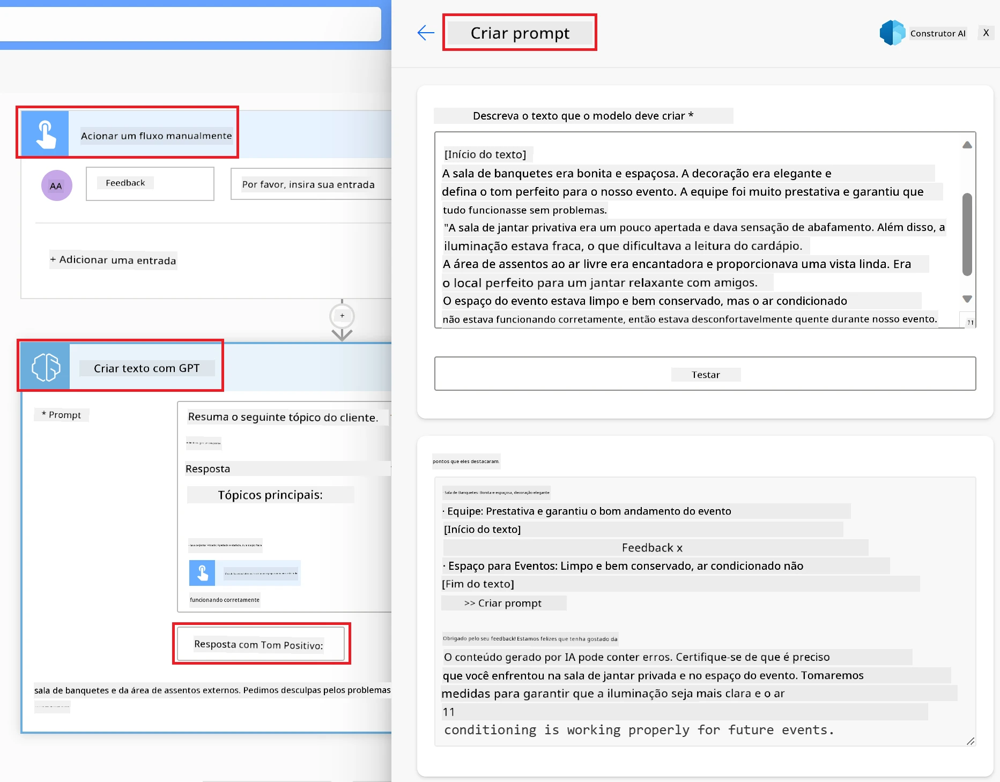

Para aprender como usar este Modelo de IA no Power Automate, consulte o módulo [Adicionar inteligência com AI Builder e GPT](https://learn.microsoft.com/training/modules/ai-builder-text-generation/?WT.mc_id=academic-109639-somelezediko).

## Ótimo trabalho! Continue seu aprendizado

Após concluir esta lição, confira nossa [coleção de Aprendizado de IA Generativa](https://aka.ms/genai-collection?WT.mc_id=academic-105485-koreyst) para continuar aprimorando seu conhecimento em IA Generativa!

Quer personalizar e aproveitar ainda mais o Copilot? Explore o [Awesome Copilot](https://github.com/github/awesome-copilot?WT.mc_id=academic-105485-koreyst) — uma coleção colaborativa da comunidade de instruções, agentes, habilidades e configurações para ajudar você a tirar o máximo proveito do GitHub Copilot.

Vá para a Lição 11, onde veremos como [integrar IA Generativa com Chamada de Funções](../11-integrating-with-function-calling/README.md?WT.mc_id=academic-105485-koreyst)!

---

<!-- CO-OP TRANSLATOR DISCLAIMER START -->
**Aviso Legal**:
Este documento foi traduzido usando o serviço de tradução por IA [Co-op Translator](https://github.com/Azure/co-op-translator). Embora nos esforcemos pela precisão, por favor, esteja ciente de que traduções automatizadas podem conter erros ou imprecisões. O documento original em seu idioma nativo deve ser considerado a fonte autorizada. Para informações críticas, recomenda-se tradução profissional humana. Não nos responsabilizamos por quaisquer mal-entendidos ou interpretações incorretas decorrentes do uso desta tradução.
<!-- CO-OP TRANSLATOR DISCLAIMER END -->