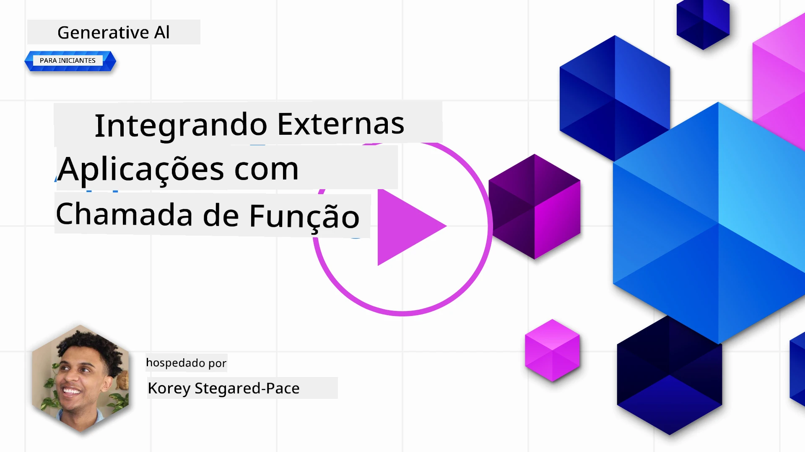
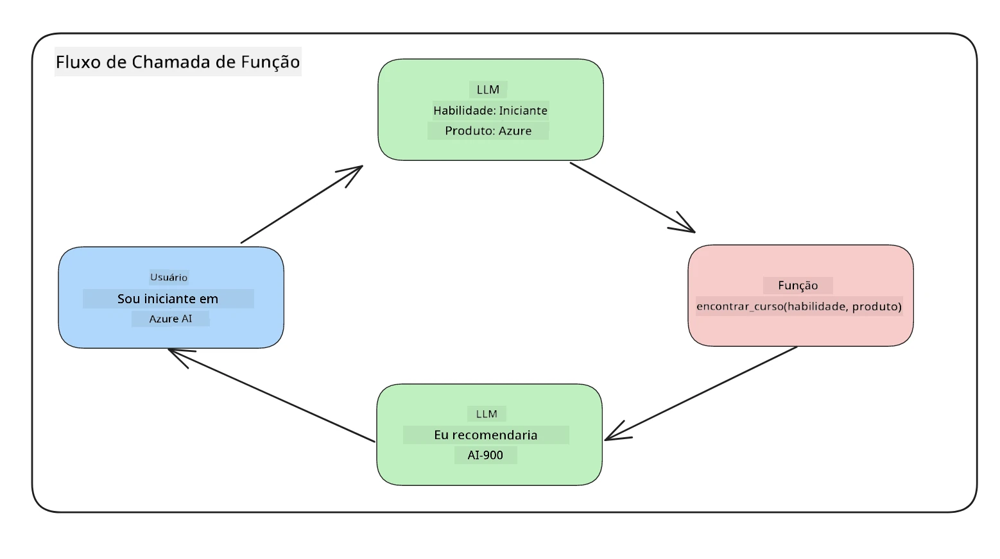
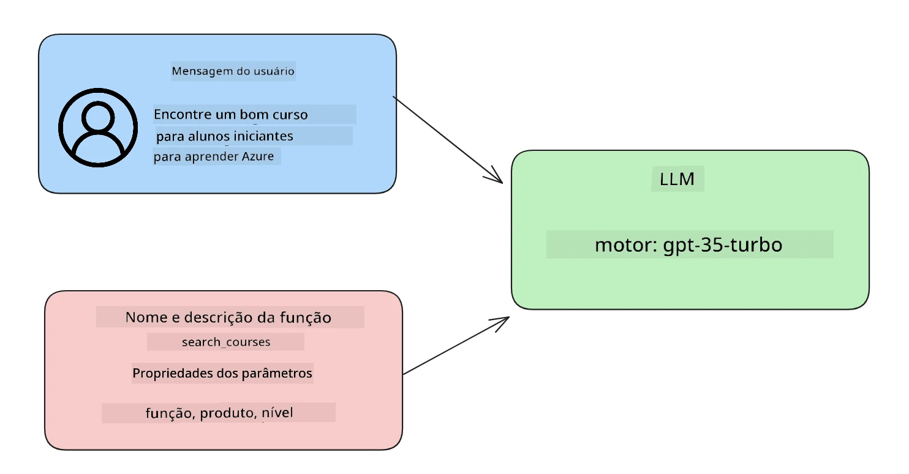

# Integração com chamada de função

[](https://youtu.be/DgUdCLX8qYQ?si=f1ouQU5HQx6F8Gl2)

Você aprendeu bastante até agora nas lições anteriores. No entanto, podemos melhorar ainda mais. Algumas coisas que podemos abordar são como obter um formato de resposta mais consistente para facilitar o trabalho com a resposta posteriormente. Além disso, talvez queiramos adicionar dados de outras fontes para enriquecer ainda mais nossa aplicação.

Os problemas mencionados acima são o que este capítulo pretende resolver.

## Introdução

Esta lição cobrirá:

- Explicação do que é chamada de função e seus casos de uso.
- Criação de uma chamada de função usando Azure OpenAI.
- Como integrar uma chamada de função em uma aplicação.

## Objetivos de aprendizagem

Ao final desta lição, você será capaz de:

- Explicar o propósito do uso de chamadas de função.
- Configurar uma Chamada de Função usando o Serviço Azure OpenAI.
- Projetar chamadas de função eficazes para o caso de uso da sua aplicação.

## Cenário: Melhorando nosso chatbot com funções

Para esta lição, queremos construir um recurso para nossa startup educacional que permita aos usuários usar um chatbot para encontrar cursos técnicos. Recomendaremos cursos que se adequem ao nível de habilidade, ao cargo atual e à tecnologia de interesse deles.

Para completar este cenário, usaremos uma combinação de:

- `Azure OpenAI` para criar uma experiência de chat para o usuário.
- `Microsoft Learn Catalog API` para ajudar os usuários a encontrar cursos com base na solicitação do usuário.
- `Chamada de Função` para pegar a consulta do usuário e enviá-la a uma função para fazer a requisição à API.

Para começar, vamos ver por que gostaríamos de usar chamada de função:

## Por que Chamada de Função

Antes da chamada de função, as respostas de um LLM eram desestruturadas e inconsistentes. Desenvolvedores precisavam escrever códigos complexos de validação para garantir que conseguiam lidar com cada variação de resposta. Usuários não podiam obter respostas como "Qual é o clima atual em Estocolmo?". Isso porque os modelos eram limitados ao tempo em que os dados foram treinados.

Chamada de Função é um recurso do Serviço Azure OpenAI para superar as seguintes limitações:

- **Formato de resposta consistente**. Se pudermos controlar melhor o formato da resposta, podemos integrar mais facilmente a resposta a outros sistemas posteriormente.
- **Dados externos**. Capacidade de usar dados de outras fontes de uma aplicação em um contexto de chat.

## Ilustrando o problema através de um cenário

> Recomendamos que use o [notebook incluído](./python/aoai-assignment.ipynb?WT.mc_id=academic-105485-koreyst) se quiser executar o cenário abaixo. Você também pode apenas acompanhar a leitura enquanto tentamos ilustrar um problema onde funções podem ajudar a resolvê-lo.

Vamos olhar o exemplo que ilustra o problema do formato da resposta:

Vamos supor que queremos criar um banco de dados de dados de estudantes para poder sugerir o curso certo para eles. Abaixo temos duas descrições de estudantes que são muito similares nos dados que contêm.

1. Crie uma conexão com nosso recurso Azure OpenAI:

   ```python
   import os
   import json
   from openai import OpenAI
   from dotenv import load_dotenv
   load_dotenv()

   # A API de Respostas é fornecida pelo Azure OpenAI (Microsoft Foundry) v1
   # endpoint, então apontamos o cliente OpenAI para <seu-endpoint>/openai/v1/.
   endpoint = os.environ['AZURE_OPENAI_ENDPOINT']
   client = OpenAI(
   api_key=os.environ['AZURE_OPENAI_API_KEY'],
   base_url=f"{endpoint.rstrip('/')}/openai/v1/",
   )

   deployment=os.environ['AZURE_OPENAI_DEPLOYMENT']
   ```

   Abaixo está um código Python para configurar nossa conexão com o Azure OpenAI. Como usamos o endpoint v1, só precisamos definir `api_key` e `base_url` (não é necessário `api_version`).

1. Criando duas descrições de estudantes usando as variáveis `student_1_description` e `student_2_description`.

   ```python
   student_1_description="Emily Johnson is a sophomore majoring in computer science at Duke University. She has a 3.7 GPA. Emily is an active member of the university's Chess Club and Debate Team. She hopes to pursue a career in software engineering after graduating."

   student_2_description = "Michael Lee is a sophomore majoring in computer science at Stanford University. He has a 3.8 GPA. Michael is known for his programming skills and is an active member of the university's Robotics Club. He hopes to pursue a career in artificial intelligence after finishing his studies."
   ```

   Queremos enviar as descrições dos estudantes acima para um LLM para analisar os dados. Esses dados podem ser usados posteriormente em nossa aplicação e enviados para uma API ou armazenados em um banco de dados.

1. Vamos criar dois prompts idênticos nos quais instruímos o LLM sobre quais informações estamos interessados:

   ```python
   prompt1 = f'''
   Please extract the following information from the given text and return it as a JSON object:

   name
   major
   school
   grades
   club

   This is the body of text to extract the information from:
   {student_1_description}
   '''

   prompt2 = f'''
   Please extract the following information from the given text and return it as a JSON object:

   name
   major
   school
   grades
   club

   This is the body of text to extract the information from:
   {student_2_description}
   '''
   ```

   Os prompts acima instruem o LLM a extrair informações e retornar a resposta no formato JSON.

1. Depois de configurar os prompts e a conexão com o Azure OpenAI, agora enviamos os prompts para o LLM usando `client.responses.create`. Armazenamos o prompt na variável `input` e atribuímos o papel `user`. Isso é para simular uma mensagem escrita por um usuário para um chatbot.

   ```python
   # resposta do prompt um
   openai_response1 = client.responses.create(
   model=deployment,
   input = [{'role': 'user', 'content': prompt1}],
   store=False,
   )
   openai_response1.output_text

   # resposta do prompt dois
   openai_response2 = client.responses.create(
   model=deployment,
   input = [{'role': 'user', 'content': prompt2}],
   store=False,
   )
   openai_response2.output_text
   ```

Agora podemos enviar ambas as requisições para o LLM e examinar a resposta que recebemos encontrando-a assim `openai_response1.output_text`.

1. Por fim, podemos converter a resposta para o formato JSON chamando `json.loads`:

   ```python
   # Carregando a resposta como um objeto JSON
   json_response1 = json.loads(openai_response1.output_text)
   json_response1
   ```

   Resposta 1:

   ```json
   {
     "name": "Emily Johnson",
     "major": "computer science",
     "school": "Duke University",
     "grades": "3.7",
     "club": "Chess Club"
   }
   ```

   Resposta 2:

   ```json
   {
     "name": "Michael Lee",
     "major": "computer science",
     "school": "Stanford University",
     "grades": "3.8 GPA",
     "club": "Robotics Club"
   }
   ```

   Mesmo que os prompts sejam os mesmos e as descrições similares, vemos valores da propriedade `Grades` formatados de maneira diferente, pois às vezes recebemos o formato `3.7` ou `3.7 GPA`, por exemplo.

   Esse resultado ocorre porque o LLM recebe dados não estruturados na forma do prompt escrito e retorna também dados não estruturados. Precisamos ter um formato estruturado para saber o que esperar ao armazenar ou usar esses dados.

Então, como resolvemos o problema de formatação? Usando chamada funcional, podemos garantir que recebamos dados estruturados de volta. Quando usamos chamada de função, o LLM não chama ou executa realmente nenhuma função. Em vez disso, criamos uma estrutura para o LLM seguir em suas respostas. Usamos então essas respostas estruturadas para saber qual função executar em nossas aplicações.



Podemos então pegar o que foi retornado da função e enviar isso de volta para o LLM. O LLM então responderá usando linguagem natural para responder a consulta do usuário.

## Casos de uso para o uso de chamadas de função

Existem muitos casos de uso diferentes onde chamadas de função podem melhorar seu app, como:

- **Chamar Ferramentas Externas**. Chatbots são excelentes em fornecer respostas a perguntas dos usuários. Usando chamada de função, os chatbots podem usar mensagens dos usuários para completar certas tarefas. Por exemplo, um estudante pode pedir ao chatbot “Enviar um e-mail para meu instrutor dizendo que preciso de mais ajuda com este assunto”. Isso pode fazer uma chamada de função para `send_email(to: string, body: string)`

- **Criar Consultas à API ou Banco de Dados**. Usuários podem encontrar informações usando linguagem natural que é convertida em uma consulta formatada ou requisição API. Um exemplo disso pode ser um professor que pergunta “Quem são os estudantes que completaram o último trabalho” que pode chamar uma função nomeada `get_completed(student_name: string, assignment: int, current_status: string)`

- **Criar Dados Estruturados**. Usuários podem pegar um bloco de texto ou CSV e usar o LLM para extrair informações importantes dele. Por exemplo, um estudante pode converter um artigo da Wikipédia sobre acordos de paz para criar flashcards de IA. Isso pode ser feito usando uma função chamada `get_important_facts(agreement_name: string, date_signed: string, parties_involved: list)`

## Criando sua primeira chamada de função

O processo de criação de uma chamada de função inclui 3 passos principais:

1. **Chamar** a API de Respostas com uma lista de suas funções (ferramentas) e uma mensagem de usuário.
2. **Ler** a resposta do modelo para executar uma ação, ou seja, executar uma função ou chamada API.
3. **Fazer** outra chamada para a API de Respostas com a resposta da sua função para usar essa informação para criar uma resposta ao usuário.



### Passo 1 - criando mensagens

O primeiro passo é criar uma mensagem do usuário. Isso pode ser atribuído dinamicamente pegando o valor de uma entrada de texto ou você pode atribuir um valor aqui. Se esta for sua primeira vez trabalhando com a API de Respostas, precisamos definir o `role` e o `content` da mensagem.

O `role` pode ser `system` (criando regras), `assistant` (o modelo) ou `user` (o usuário final). Para a chamada de função, atribuíremos como `user` e um exemplo de pergunta.

```python
messages= [ {"role": "user", "content": "Find me a good course for a beginner student to learn Azure."} ]
```

Atribuindo diferentes papéis, fica claro para o LLM se é o sistema falando algo ou o usuário, o que ajuda a construir um histórico de conversa que o LLM pode usar.

### Passo 2 - criando funções

Em seguida, definiremos uma função e os parâmetros dessa função. Usaremos apenas uma função aqui chamada `search_courses`, mas você pode criar várias funções.

> **Importante**: Funções são incluídas na mensagem do sistema para o LLM e serão contabilizadas no número de tokens disponíveis.

Abaixo, criamos as funções como um array de itens. Cada item é uma ferramenta no formato plano da API de Respostas, com as propriedades `type`, `name`, `description` e `parameters`:

```python
functions = [
   {
      "type":"function",
      "name":"search_courses",
      "description":"Retrieves courses from the search index based on the parameters provided",
      "parameters":{
         "type":"object",
         "properties":{
            "role":{
               "type":"string",
               "description":"The role of the learner (i.e. developer, data scientist, student, etc.)"
            },
            "product":{
               "type":"string",
               "description":"The product that the lesson is covering (i.e. Azure, Power BI, etc.)"
            },
            "level":{
               "type":"string",
               "description":"The level of experience the learner has prior to taking the course (i.e. beginner, intermediate, advanced)"
            }
         },
         "required":[
            "role"
         ]
      }
   }
]
```

Vamos descrever cada instância de função com mais detalhes abaixo:

- `name` - O nome da função que queremos que seja chamada.
- `description` - Esta é a descrição de como a função funciona. Aqui é importante ser específico e claro.
- `parameters` - Uma lista de valores e formato que você deseja que o modelo produza em sua resposta. O array de parâmetros consiste em itens onde os itens têm as seguintes propriedades:
  1.  `type` - O tipo de dado em que as propriedades serão armazenadas.
  1.  `properties` - Lista dos valores específicos que o modelo usará na sua resposta.
      1. `name` - A chave é o nome da propriedade que o modelo usará na sua resposta formatada, por exemplo, `product`.
      1. `type` - O tipo de dado dessa propriedade, por exemplo, `string`.
      1. `description` - Descrição da propriedade específica.

Também há uma propriedade opcional `required` - propriedade necessária para que a chamada de função seja concluída.

### Passo 3 - Fazendo a chamada da função

Depois de definir uma função, agora precisamos incluí-la na chamada para a API de Respostas. Fazemos isso adicionando `tools` à requisição. Neste caso `tools=functions`.

Há também a opção de definir `tool_choice` como `auto`. Isso significa que deixaremos o LLM decidir qual função deve ser chamada com base na mensagem do usuário em vez de atribuirmos nós mesmos.

Abaixo está um código onde chamamos `client.responses.create`, note como definimos `tools=functions` e `tool_choice="auto"`, dando assim ao LLM a escolha de quando chamar as funções que fornecemos:

```python
response = client.responses.create(model=deployment,
                                        input=messages,
                                        tools=functions,
                                        tool_choice="auto",
                                        store=False)

print(response.output)
```

A resposta que volta agora inclui um item `function_call` em `response.output` que se parece com isto:

```json
{
  "type": "function_call",
  "name": "search_courses",
  "call_id": "call_abc123",
  "arguments": "{\n  \"role\": \"student\",\n  \"product\": \"Azure\",\n  \"level\": \"beginner\"\n}"
}
```

Aqui podemos ver como a função `search_courses` foi chamada e com quais argumentos, conforme listado na propriedade `arguments` na resposta JSON.

A conclusão é que o LLM foi capaz de encontrar os dados para preencher os argumentos da função ao extraí-los do valor fornecido ao parâmetro `input` na chamada da API de Respostas. Abaixo está um lembrete do valor `messages`:

```python
messages= [ {"role": "user", "content": "Find me a good course for a beginner student to learn Azure."} ]
```

Como você pode ver, `student`, `Azure` e `beginner` foram extraídos de `messages` e definidos como entrada para a função. Usar funções dessa forma é uma ótima maneira de extrair informações de um prompt, mas também de fornecer estrutura para o LLM e ter funcionalidades reutilizáveis.

A seguir, precisamos ver como podemos usar isso em nosso app.

## Integrando chamadas de função em uma aplicação

Depois de testarmos a resposta formatada do LLM, agora podemos integrar isso em uma aplicação.

### Gerenciando o fluxo

Para integrar isso em nossa aplicação, vamos seguir os passos a seguir:

1. Primeiro, vamos fazer a chamada aos serviços OpenAI e extrair os itens de chamada de função da resposta `output`.

   ```python
   response_items = response.output
   tool_calls = [item for item in response_items if item.type == "function_call"]
   ```

1. Agora definiremos a função que chamará a Microsoft Learn API para obter uma lista de cursos:

   ```python
   import requests

   def search_courses(role, product, level):
     url = "https://learn.microsoft.com/api/catalog/"
     params = {
        "role": role,
        "product": product,
        "level": level
     }
     response = requests.get(url, params=params)
     modules = response.json()["modules"]
     results = []
     for module in modules[:5]:
        title = module["title"]
        url = module["url"]
        results.append({"title": title, "url": url})
     return str(results)
   ```

   Note como agora criamos uma função Python real que mapeia para os nomes de função introduzidos na variável `functions`. Também estamos fazendo chamadas reais a APIs externas para buscar os dados que precisamos. Neste caso, acessamos a API Microsoft Learn para buscar módulos de treinamento.

Ok, criamos a variável `functions` e uma função Python correspondente, como dizemos ao LLM como mapear essas duas para que a nossa função Python seja chamada?

1. Para ver se precisamos chamar uma função Python, precisamos olhar na resposta do LLM e verificar se um item `function_call` faz parte dela e chamar a função indicada. Veja como fazer essa verificação abaixo:

   ```python
   # Verifique se o modelo deseja chamar uma função
   if tool_calls:
    for tool_call in tool_calls:
     print("Recommended Function call:")
     print(tool_call.name)
     print()

     # Chame a função.
     function_name = tool_call.name

     available_functions = {
             "search_courses": search_courses,
     }
     function_to_call = available_functions[function_name]

     function_args = json.loads(tool_call.arguments)
     function_response = function_to_call(**function_args)

     print("Output of function call:")
     print(function_response)
     print(type(function_response))

     # Adicione a chamada da função e seu resultado de volta à conversa.
     # O item function_call do modelo deve ser anexado antes da sua saída.
     messages.append(tool_call)  # o item function_call do assistente
     messages.append( # o resultado da função
         {
             "type": "function_call_output",
             "call_id": tool_call.call_id,
             "output": function_response,
         }
     )
   ```

   Essas três linhas garantem que extraímos o nome da função, os argumentos e fazemos a chamada:

   ```python
   function_to_call = available_functions[function_name]

   function_args = json.loads(tool_call.arguments)
   function_response = function_to_call(**function_args)
   ```

   Abaixo está a saída ao executar nosso código:

   **Saída**

   ```Recommended Function call:
   {
     "name": "search_courses",
     "arguments": "{\n  \"role\": \"student\",\n  \"product\": \"Azure\",\n  \"level\": \"beginner\"\n}"
   }

   Output of function call:
   [{'title': 'Describe concepts of cryptography', 'url': 'https://learn.microsoft.com/training/modules/describe-concepts-of-cryptography/?
   WT.mc_id=api_CatalogApi'}, {'title': 'Introduction to audio classification with TensorFlow', 'url': 'https://learn.microsoft.com/en-
   us/training/modules/intro-audio-classification-tensorflow/?WT.mc_id=api_CatalogApi'}, {'title': 'Design a Performant Data Model in Azure SQL
   Database with Azure Data Studio', 'url': 'https://learn.microsoft.com/training/modules/design-a-data-model-with-ads/?
   WT.mc_id=api_CatalogApi'}, {'title': 'Getting started with the Microsoft Cloud Adoption Framework for Azure', 'url':
   'https://learn.microsoft.com/training/modules/cloud-adoption-framework-getting-started/?WT.mc_id=api_CatalogApi'}, {'title': 'Set up the
   Rust development environment', 'url': 'https://learn.microsoft.com/training/modules/rust-set-up-environment/?WT.mc_id=api_CatalogApi'}]
   <class 'str'>
   ```

1. Agora enviaremos a mensagem atualizada, `messages` ao LLM para que possamos receber uma resposta em linguagem natural em vez de uma resposta em JSON formatado pela API.

   ```python
   print("Messages in next request:")
   print(messages)
   print()

   second_response = client.responses.create(
      input=messages,
      model=deployment,
      tool_choice="auto",
      tools=functions,
      temperature=0,
      store=False,
         )  # obtenha uma nova resposta do modelo onde ele possa ver a resposta da função


   print(second_response.output_text)
   ```

   **Saída**

   ```text
   I found some good courses for beginner students to learn Azure:

   1. [Describe concepts of cryptography](https://learn.microsoft.com/training/modules/describe-concepts-of-cryptography/?WT.mc_id=api_CatalogApi)
   2. [Introduction to audio classification with TensorFlow](https://learn.microsoft.com/training/modules/intro-audio-classification-tensorflow/?WT.mc_id=api_CatalogApi)
   3. [Design a Performant Data Model in Azure SQL Database with Azure Data Studio](https://learn.microsoft.com/training/modules/design-a-data-model-with-ads/?WT.mc_id=api_CatalogApi)
   4. [Getting started with the Microsoft Cloud Adoption Framework for Azure](https://learn.microsoft.com/training/modules/cloud-adoption-framework-getting-started/?WT.mc_id=api_CatalogApi)
   5. [Set up the Rust development environment](https://learn.microsoft.com/training/modules/rust-set-up-environment/?WT.mc_id=api_CatalogApi)

   You can click on the links to access the courses.
   ```

## Exercício

Para continuar seu aprendizado sobre Chamada de Função no Azure OpenAI, você pode criar:

- Mais parâmetros da função que possam ajudar os alunos a encontrar mais cursos.

- Crie outra chamada de função que receba mais informações do aprendiz, como seu idioma nativo
- Crie tratamento de erros para quando a chamada da função e/ou chamada da API não retornar cursos adequados

Dica: Siga a página da [documentação de referência da API Learn](https://learn.microsoft.com/training/support/catalog-api-developer-reference?WT.mc_id=academic-105485-koreyst) para ver como e onde esses dados estão disponíveis.

## Excelente trabalho! Continue a jornada

Após concluir esta lição, confira nossa [coleção de Aprendizado de IA Generativa](https://aka.ms/genai-collection?WT.mc_id=academic-105485-koreyst) para continuar aprimorando seu conhecimento em IA Generativa!

Vá para a Lição 12, onde veremos como [projetar UX para aplicações de IA](../12-designing-ux-for-ai-applications/README.md?WT.mc_id=academic-105485-koreyst)!

---

<!-- CO-OP TRANSLATOR DISCLAIMER START -->
**Aviso Legal**:
Este documento foi traduzido usando o serviço de tradução por IA [Co-op Translator](https://github.com/Azure/co-op-translator). Embora nos esforcemos pela precisão, por favor, esteja ciente de que traduções automatizadas podem conter erros ou imprecisões. O documento original em seu idioma nativo deve ser considerado a fonte autorizada. Para informações críticas, recomenda-se tradução profissional humana. Não nos responsabilizamos por quaisquer mal-entendidos ou interpretações incorretas decorrentes do uso desta tradução.
<!-- CO-OP TRANSLATOR DISCLAIMER END -->