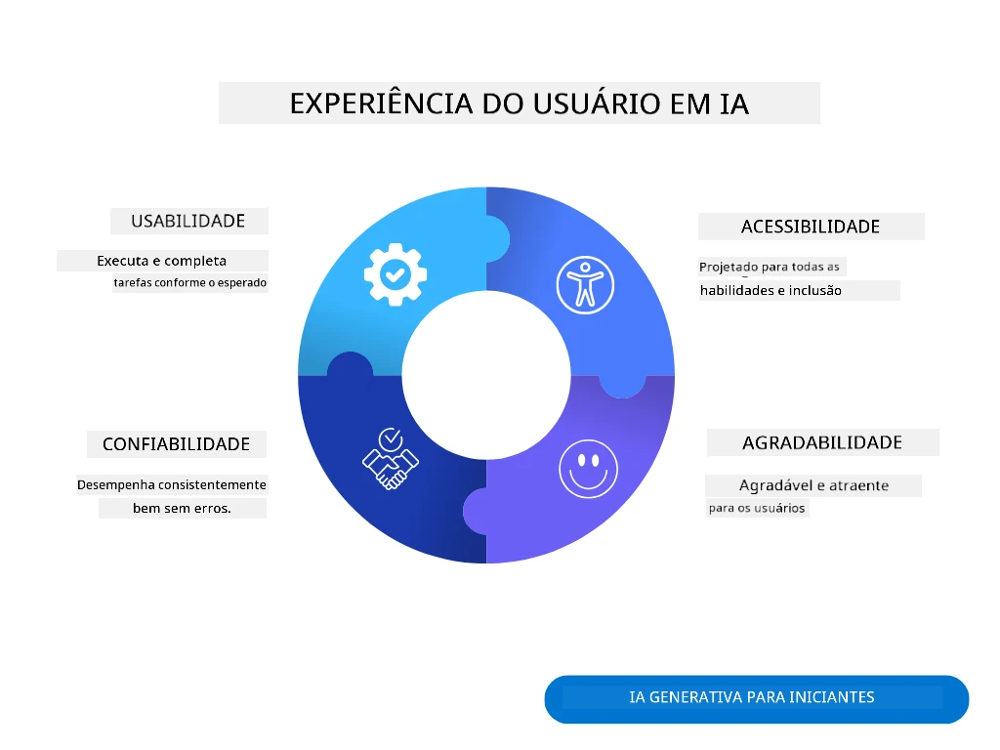
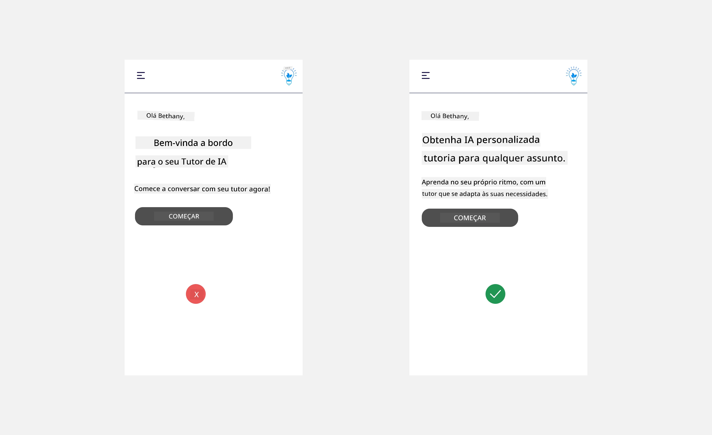
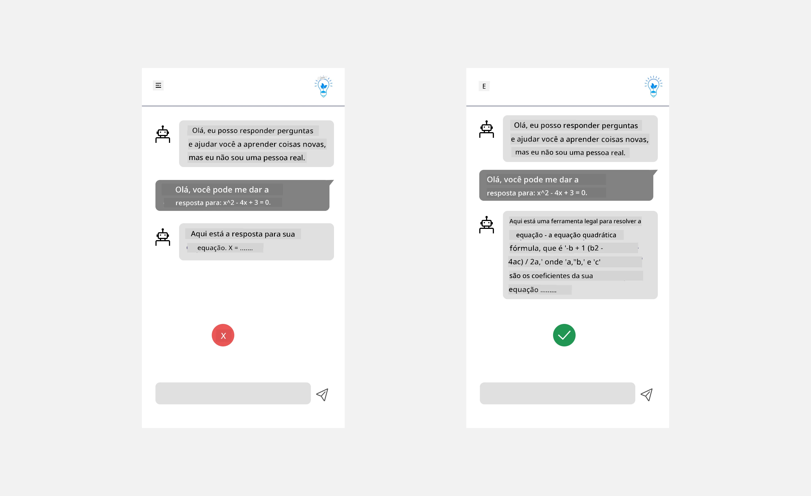
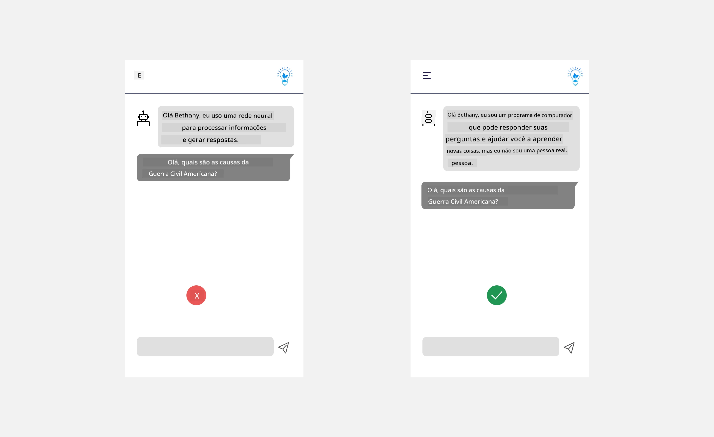
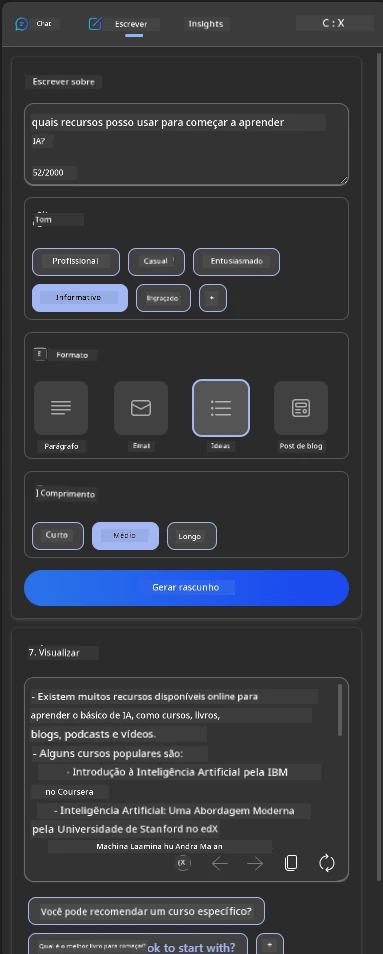
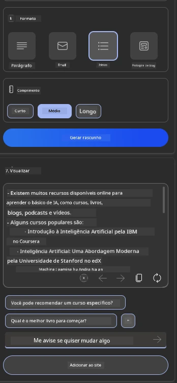
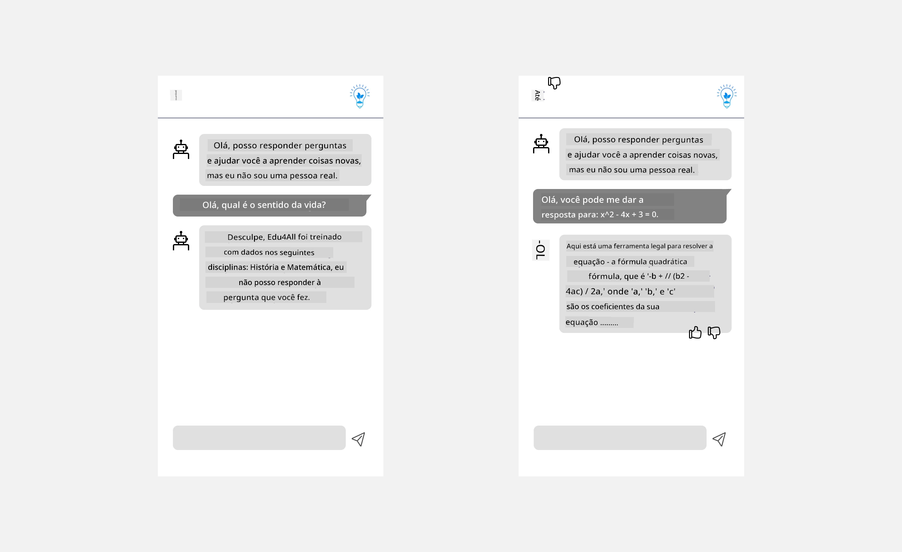

# Projetando UX para Aplicações de IA

> _(Clique na imagem acima para assistir ao vídeo desta lição)_

A experiência do usuário é um aspecto muito importante na construção de aplicativos. Os usuários precisam ser capazes de usar seu aplicativo de forma eficiente para realizar tarefas. Ser eficiente é uma coisa, mas você também precisa projetar aplicativos para que possam ser usados por todos, tornando-os _acessíveis_. Este capítulo se concentrará nessa área para que você, esperançosamente, acabe projetando um aplicativo que as pessoas possam e queiram usar.

## Introdução

A experiência do usuário é como um usuário interage com e utiliza um produto ou serviço específico, seja um sistema, ferramenta ou design. Ao desenvolver aplicações de IA, os desenvolvedores não focam apenas em garantir que a experiência do usuário seja eficaz, mas também ética. Nesta lição, abordamos como construir aplicações de Inteligência Artificial (IA) que atendam às necessidades do usuário.

A lição abordará as seguintes áreas:

- Introdução à Experiência do Usuário e Compreensão das Necessidades do Usuário
- Projetando Aplicações de IA para Confiança e Transparência
- Projetando Aplicações de IA para Colaboração e Feedback

## Objetivos de aprendizado

Após fazer esta lição, você será capaz de:

- Entender como construir aplicações de IA que atendam às necessidades do usuário.
- Projetar aplicações de IA que promovam confiança e colaboração.

### Pré-requisito

Reserve um tempo para ler mais sobre [experiência do usuário e design thinking.](https://learn.microsoft.com/training/modules/ux-design?WT.mc_id=academic-105485-koreyst)

## Introdução à Experiência do Usuário e Compreensão das Necessidades do Usuário

Em nossa startup fictícia de educação, temos dois usuários principais, professores e estudantes. Cada um dos dois usuários tem necessidades únicas. Um design centrado no usuário prioriza o usuário garantindo que os produtos sejam relevantes e benéficos para aqueles a quem se destinam.

O aplicativo deve ser **útil, confiável, acessível e agradável** para proporcionar uma boa experiência do usuário.

### Usabilidade

Ser útil significa que o aplicativo possui funcionalidades que correspondem ao seu propósito pretendido, como automatizar o processo de avaliação ou gerar flashcards para revisão. Um aplicativo que automatiza o processo de avaliação deve ser capaz de atribuir notas aos trabalhos dos alunos com precisão e eficiência com base em critérios predefinidos. Da mesma forma, um aplicativo que gera flashcards para revisão deve ser capaz de criar perguntas relevantes e diversas com base em seus dados.

### Confiabilidade

Ser confiável significa que o aplicativo pode executar sua tarefa de forma consistente e sem erros. No entanto, IA, assim como humanos, não é perfeita e pode estar sujeita a erros. As aplicações podem encontrar erros ou situações inesperadas que requerem intervenção ou correção humana. Como você lida com erros? Na última seção desta lição, abordaremos como sistemas e aplicações de IA são projetados para colaboração e feedback.

### Acessibilidade

Ser acessível significa estender a experiência do usuário para usuários com diversas habilidades, incluindo aqueles com deficiências, garantindo que ninguém seja excluído. Ao seguir diretrizes e princípios de acessibilidade, as soluções de IA tornam-se mais inclusivas, utilizáveis e benéficas para todos os usuários.

### Agradável

Ser agradável significa que o aplicativo é prazeroso de usar. Uma experiência do usuário atraente pode ter um impacto positivo no usuário, incentivando-o a retornar ao aplicativo e aumentando a receita do negócio.

Nem todo desafio pode ser resolvido com IA. A IA surge para aumentar sua experiência de usuário, seja automatizando tarefas manuais ou personalizando experiências do usuário.

## Projetando Aplicações de IA para Confiança e Transparência

Construir confiança é fundamental ao projetar aplicações de IA. A confiança garante que o usuário esteja confiante de que o aplicativo fará o trabalho, entregará resultados consistentemente e que os resultados são o que o usuário precisa. Um risco nessa área é a desconfiança e a confiança excessiva. A desconfiança ocorre quando um usuário tem pouca ou nenhuma confiança em um sistema de IA, o que leva o usuário a rejeitar seu aplicativo. A confiança excessiva ocorre quando um usuário superestima a capacidade de um sistema de IA, levando os usuários a confiarem excessivamente no sistema de IA. Por exemplo, um sistema de avaliação automatizado no caso de confiança excessiva pode levar o professor a não revisar alguns dos trabalhos para garantir que o sistema de avaliação funcione bem. Isso poderia resultar em notas injustas ou imprecisas para os alunos ou em oportunidades perdidas para feedback e melhoria.

Duas maneiras de garantir que a confiança esteja colocada no centro do design são explicabilidade e controle.

### Explicabilidade

Quando a IA ajuda a informar decisões, como transmitir conhecimento para as futuras gerações, é fundamental que professores e pais entendam como as decisões da IA são tomadas. Esta é a explicabilidade – entender como as aplicações de IA tomam decisões. Projetar para explicabilidade inclui adicionar detalhes que destacam como a IA chegou ao resultado. O público deve estar ciente de que o resultado é gerado por IA e não por um humano. Por exemplo, ao invés de dizer "Comece a conversar com seu tutor agora", diga "Use um tutor de IA que se adapta às suas necessidades e ajuda você a aprender no seu ritmo."

Outro exemplo é como a IA usa dados do usuário e pessoais. Por exemplo, um usuário com a persona estudante pode ter limitações baseadas em sua persona. A IA pode não ser capaz de revelar respostas para perguntas, mas pode ajudar a guiar o usuário a pensar em como ele pode resolver um problema.

Uma última parte chave da explicabilidade é a simplificação das explicações. Estudantes e professores podem não ser especialistas em IA, portanto as explicações do que o aplicativo pode ou não pode fazer devem ser simplificadas e fáceis de entender.

### Controle

A IA generativa cria uma colaboração entre a IA e o usuário, onde por exemplo o usuário pode modificar prompts para obter diferentes resultados. Além disso, uma vez que um resultado é gerado, os usuários devem poder modificar os resultados dando-lhes uma sensação de controle. Por exemplo, ao usar o Microsoft Copilot (antes Bing Chat), você pode ajustar seu prompt com base em formato, tom e comprimento. Além disso, você pode adicionar mudanças ao seu resultado e modificar o resultado conforme mostrado abaixo:

Outro recurso no Microsoft Copilot que permite ao usuário ter controle sobre o aplicativo é a capacidade de optar por participar ou não dos dados que a IA usa. Para um aplicativo escolar, um estudante pode querer usar suas anotações bem como os recursos dos professores como material de revisão.

> Ao projetar aplicações de IA, a intencionalidade é fundamental para garantir que os usuários não confiem excessivamente, estabelecendo expectativas irreais sobre suas capacidades. Uma maneira de fazer isso é criando atrito entre os prompts e os resultados. Lembrando o usuário de que isso é IA e não um ser humano.

## Projetando Aplicações de IA para Colaboração e Feedback

Como mencionado anteriormente, a IA generativa cria uma colaboração entre o usuário e a IA. A maioria dos engajamentos é com um usuário inserindo um prompt e a IA gerando um resultado. E se o resultado estiver incorreto? Como o aplicativo lida com erros se eles ocorrerem? A IA culpa o usuário ou leva tempo para explicar o erro?

Aplicações de IA devem ser construídas para receber e fornecer feedback. Isso não só ajuda o sistema de IA a melhorar mas também constrói confiança com os usuários. Um ciclo de feedback deve ser incluído no design, um exemplo pode ser um simples polegar para cima ou para baixo no resultado.

Outra maneira de lidar com isso é comunicar claramente as capacidades e limitações do sistema. Quando um usuário comete um erro solicitando algo além das capacidades da IA, também deve haver uma forma de lidar com isso, conforme mostrado abaixo.

Erros de sistema são comuns em aplicativos onde o usuário pode precisar de assistência com informações fora do escopo da IA ou o aplicativo pode ter um limite sobre quantas perguntas/assuntos um usuário pode gerar resumos. Por exemplo, um aplicativo de IA treinado com dados sobre assuntos limitados, por exemplo, História e Matemática, talvez não consiga responder perguntas sobre Geografia. Para mitigar isso, o sistema de IA pode dar uma resposta como: "Desculpe, nosso produto foi treinado com dados nos seguintes assuntos....., não posso responder à pergunta que você fez."

Aplicações de IA não são perfeitas, portanto, estão sujeitas a cometer erros. Ao projetar suas aplicações, você deve garantir que crie espaço para feedback dos usuários e tratamento de erros de maneira simples e facilmente explicável.

## Tarefa

Pegue qualquer aplicativo de IA que você tenha construído até agora, considere implementar os passos abaixo em seu aplicativo:

- **Agradável:** Considere como você pode tornar seu aplicativo mais agradável. Você está adicionando explicações em todos os lugares? Está incentivando o usuário a explorar? Como você redige suas mensagens de erro?

- **Usabilidade:** Construindo um aplicativo web. Certifique-se de que seu aplicativo seja navegável tanto por mouse quanto por teclado.

- **Confiança e transparência:** Não confie completamente na IA e na saída dela, considere como você adicionaria um humano ao processo para verificar a saída. Além disso, considere e implemente outras formas de alcançar confiança e transparência.

- **Controle:** Dê ao usuário controle sobre os dados que ele fornece ao aplicativo. Implemente uma forma para que o usuário possa optar por participar e desistir da coleta de dados na aplicação de IA.

<!-- ## [Quiz pós-aula](../../../12-designing-ux-for-ai-applications/quiz-url) -->

## Continue seu Aprendizado!

Após concluir esta lição, confira nossa [coleção de Aprendizagem sobre IA Generativa](https://aka.ms/genai-collection?WT.mc_id=academic-105485-koreyst) para continuar aprimorando seu conhecimento em IA Generativa!

Vá para a Lição 13, onde veremos como [proteger aplicações de IA](../13-securing-ai-applications/README.md?WT.mc_id=academic-105485-koreyst)!

---

<!-- CO-OP TRANSLATOR DISCLAIMER START -->
**Aviso Legal**:
Este documento foi traduzido usando o serviço de tradução por IA [Co-op Translator](https://github.com/Azure/co-op-translator). Embora nos esforcemos pela precisão, por favor, esteja ciente de que traduções automatizadas podem conter erros ou imprecisões. O documento original em seu idioma nativo deve ser considerado a fonte autorizada. Para informações críticas, recomenda-se tradução profissional humana. Não nos responsabilizamos por quaisquer mal-entendidos ou interpretações incorretas decorrentes do uso desta tradução.
<!-- CO-OP TRANSLATOR DISCLAIMER END -->