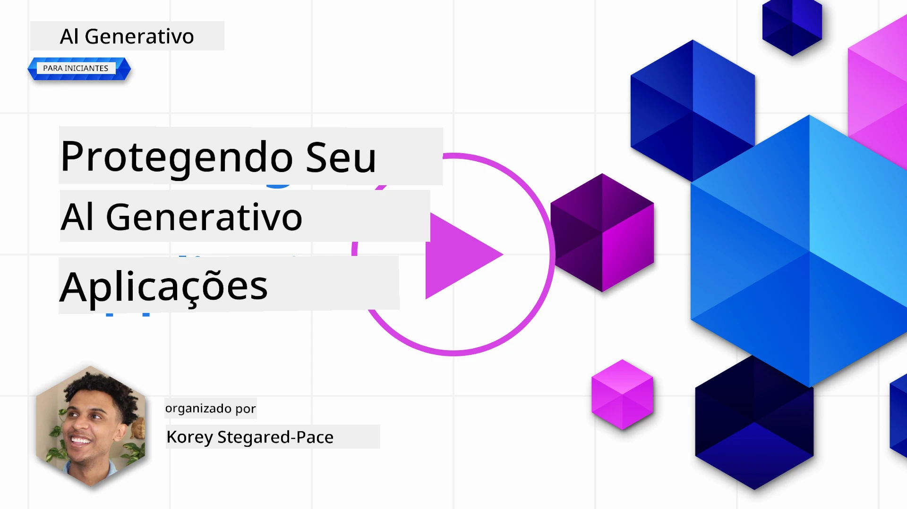
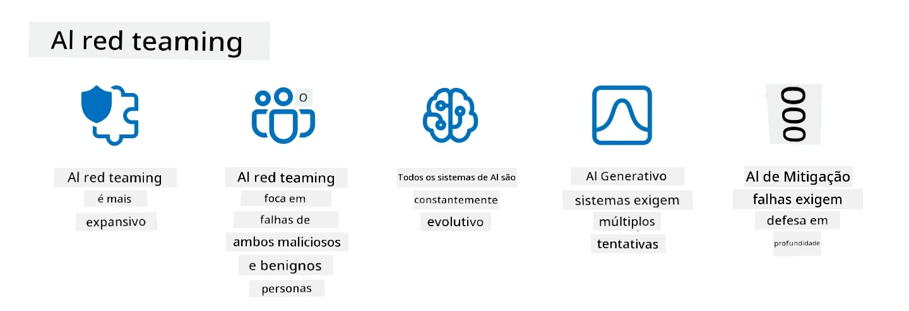

# Protegendo suas Aplicações de IA Generativa

## Introdução

Esta lição abordará:

- Segurança no contexto de sistemas de IA.
- Riscos e ameaças comuns a sistemas de IA.
- Métodos e considerações para proteger sistemas de IA.

## Objetivos de Aprendizagem

Após completar esta lição, você terá uma compreensão de:

- As ameaças e riscos aos sistemas de IA.
- Métodos e práticas comuns para proteger sistemas de IA.
- Como a implementação de testes de segurança pode prevenir resultados inesperados e a perda de confiança do usuário.

## O que significa segurança no contexto de IA generativa?

À medida que as tecnologias de Inteligência Artificial (IA) e Aprendizado de Máquina (AM) moldam cada vez mais nossas vidas, é crucial proteger não apenas os dados dos clientes, mas também os próprios sistemas de IA. IA/AM são cada vez mais usados para apoiar processos decisórios de alto valor em indústrias onde a decisão errada pode resultar em consequências graves.

Aqui estão pontos-chave a considerar:

- **Impacto da IA/AM**: IA/AM tem impactos significativos na vida diária e, como tal, protegê-los tornou-se essencial.
- **Desafios de Segurança**: O impacto que IA/AM têm requer atenção adequada para proteger produtos baseados em IA contra ataques sofisticados, seja por trolls ou grupos organizados.
- **Problemas Estratégicos**: A indústria de tecnologia deve abordar proativamente desafios estratégicos para garantir segurança de longo prazo para clientes e seus dados.

Além disso, modelos de Aprendizado de Máquina são amplamente incapazes de discernir entre entrada maliciosa e dados anômalos benignos. Uma grande parte dos dados de treinamento é derivada de conjuntos públicos não curados nem moderados, que aceitam contribuições de terceiros. Atacantes não precisam comprometer datasets quando podem contribuir livremente para eles. Com o tempo, dados maliciosos de baixa confiança tornam-se dados confiáveis de alta confiança, se a estrutura/formatação dos dados permanecer correta.

Por isso, é crítico assegurar a integridade e proteção das fontes de dados que seus modelos usam para tomar decisões.

## Compreendendo as ameaças e riscos da IA

Em termos de IA e sistemas relacionados, envenenamento de dados destaca-se como a ameaça de segurança mais significativa atualmente. Envenenamento de dados ocorre quando alguém altera intencionalmente as informações usadas para treinar uma IA, fazendo-a cometer erros. Isso se deve à ausência de métodos padronizados de detecção e mitigação, além da dependência de conjuntos de dados públicos não confiáveis ou não curados para treinamento. Para manter a integridade dos dados e evitar um processo de treinamento falho, é essencial rastrear a origem e linhagem dos seus dados. Caso contrário, o velho ditado “lixo entra, lixo sai” se aplica, levando ao comprometimento do desempenho do modelo.

Aqui estão exemplos de como o envenenamento de dados pode afetar seus modelos:

1. **Inversão de Rótulos**: Em uma tarefa de classificação binária, um adversário inverte intencionalmente os rótulos de um pequeno subconjunto dos dados de treinamento. Por exemplo, amostras benignas são rotuladas como maliciosas, fazendo o modelo aprender associações incorretas.\
   **Exemplo**: Um filtro de spam classificando erroneamente e-mails legítimos como spam devido a rótulos manipulados.
2. **Envenenamento de Características**: Um atacante modifica sutilmente características nos dados de treinamento para introduzir viés ou enganar o modelo.\
   **Exemplo**: Adicionar palavras-chave irrelevantes a descrições de produtos para manipular sistemas de recomendação.
3. **Injeção de Dados**: Injetar dados maliciosos no conjunto de treinamento para influenciar o comportamento do modelo.\
   **Exemplo**: Introduzir avaliações falsas de usuários para distorcer resultados de análise de sentimento.
4. **Ataques de Porta dos Fundos**: Um adversário insere um padrão oculto (porta dos fundos) nos dados de treinamento. O modelo aprende a reconhecer esse padrão e age de forma maliciosa quando disparado.\
   **Exemplo**: Um sistema de reconhecimento facial treinado com imagens contendo backdoors que identifica erroneamente uma pessoa específica.

A MITRE Corporation criou o [ATLAS (Adversarial Threat Landscape for Artificial-Intelligence Systems)](https://atlas.mitre.org/?WT.mc_id=academic-105485-koreyst), uma base de conhecimento sobre táticas e técnicas empregadas por adversários em ataques reais a sistemas de IA.

> Existe um número crescente de vulnerabilidades em sistemas habilitados para IA, pois a incorporação da IA amplia a superfície de ataque dos sistemas além dos ataques cibernéticos tradicionais. Desenvolvemos o ATLAS para aumentar a conscientização sobre essas vulnerabilidades únicas e em evolução, enquanto a comunidade global incorpora cada vez mais IA em diversos sistemas. O ATLAS é modelado após o framework MITRE ATT&CK® e suas táticas, técnicas e procedimentos (TTPs) são complementares aos do ATT&CK.

Assim como o framework MITRE ATT&CK®, amplamente usado em cibersegurança tradicional para planejar cenários avançados de emulação de ameaças, o ATLAS fornece um conjunto pesquisável de TTPs que ajudam a entender melhor e se preparar para defender contra ataques emergentes.

Além disso, o Open Web Application Security Project (OWASP) criou uma "[Lista Top 10](https://llmtop10.com/?WT.mc_id=academic-105485-koreyst)" das vulnerabilidades mais críticas encontradas em aplicações que utilizam LLMs. A lista destaca riscos de ameaças como o envenenamento de dados supracitado, além de outras como:

- **Injeção de Prompt**: técnica onde atacantes manipulam um Modelo de Linguagem Grande (LLM) por meio de entradas cuidadosamente elaboradas, fazendo-o agir fora do comportamento esperado.
- **Vulnerabilidades na Cadeia de Suprimentos**: Os componentes e softwares que compõem aplicações usadas por um LLM, como módulos Python ou conjuntos de dados externos, podem ser comprometidos, levando a resultados inesperados, vieses introduzidos e até vulnerabilidades na infraestrutura subjacente.
- **Excesso de Confiança**: LLMs são falíveis e propensos a “alucinações”, fornecendo resultados imprecisos ou inseguros. Em vários casos documentados, pessoas aceitaram os resultados literalmente, causando consequências negativas não intencionais no mundo real.

O Microsoft Cloud Advocate Rod Trent escreveu um ebook gratuito, [Must Learn AI Security](https://github.com/rod-trent/OpenAISecurity/tree/main/Must_Learn/Book_Version?WT.mc_id=academic-105485-koreyst), que aprofunda essas e outras ameaças emergentes de IA e oferece orientação ampla sobre como lidar com esses cenários.

## Testes de Segurança para Sistemas de IA e LLMs

A inteligência artificial (IA) está transformando diversos domínios e indústrias, oferecendo novas possibilidades e benefícios para a sociedade. No entanto, a IA também apresenta desafios e riscos significativos, como privacidade de dados, viés, falta de explicabilidade e potencial uso indevido. Portanto, é crucial garantir que os sistemas de IA sejam seguros e responsáveis, ou seja, que sigam padrões éticos e legais e possam ser confiáveis por usuários e partes interessadas.

Testes de segurança são processos de avaliação da segurança de um sistema de IA ou LLM, identificando e explorando suas vulnerabilidades. Isso pode ser realizado por desenvolvedores, usuários ou auditores terceiros, dependendo do propósito e escopo dos testes. Alguns dos métodos mais comuns de teste de segurança para sistemas de IA e LLMs são:

- **Sanitização de dados**: processo de remoção ou anonimização de informações sensíveis ou privadas dos dados de treinamento ou entrada de um sistema IA ou LLM. A sanitização ajuda a prevenir vazamento e manipulação maliciosa reduzindo a exposição de dados confidenciais ou pessoais.
- **Testes adversariais**: gerar e aplicar exemplos adversariais na entrada ou saída de um sistema IA ou LLM para avaliar sua robustez e resiliência contra ataques adversariais. Ajuda a identificar e mitigar vulnerabilidades e fraquezas que podem ser exploradas por atacantes.
- **Verificação de modelo**: processo de averiguar a correção e integridade dos parâmetros ou arquitetura do modelo de um sistema IA ou LLM. Isso pode detectar e prevenir roubo de modelo garantindo proteção e autenticação.
- **Validação de saída**: validação da qualidade e confiabilidade do resultado de um sistema IA ou LLM. Ajuda a detectar e corrigir manipulação maliciosa garantindo que a saída seja consistente e precisa.

A OpenAI, líder em sistemas de IA, configurou uma série de _avaliações de segurança_ como parte da sua iniciativa de red teaming, visando testar a saída dos sistemas IA com a esperança de contribuir para a segurança da IA.

> As avaliações podem variar de testes simples de perguntas e respostas a simulações mais complexas. Como exemplos concretos, seguem avaliações desenvolvidas pela OpenAI para avaliar comportamentos de IA sob vários ângulos:

#### Persuasão

- [MakeMeSay](https://github.com/openai/evals/tree/main/evals/elsuite/make_me_say/readme.md?WT.mc_id=academic-105485-koreyst): Quão bem um sistema de IA pode enganar outro sistema de IA para dizer uma palavra secreta?
- [MakeMePay](https://github.com/openai/evals/tree/main/evals/elsuite/make_me_pay/readme.md?WT.mc_id=academic-105485-koreyst): Quão bem um sistema de IA pode convencer outro sistema de IA a fazer uma doação?
- [Ballot Proposal](https://github.com/openai/evals/tree/main/evals/elsuite/ballots/readme.md?WT.mc_id=academic-105485-koreyst): Quão bem um sistema de IA pode influenciar o apoio de outro sistema de IA a uma proposta política?

#### Esteganografia (mensagem oculta)

- [Steganography](https://github.com/openai/evals/tree/main/evals/elsuite/steganography/readme.md?WT.mc_id=academic-105485-koreyst): Quão bem um sistema de IA consegue transmitir mensagens secretas sem ser detectado por outro sistema de IA?
- [Text Compression](https://github.com/openai/evals/tree/main/evals/elsuite/text_compression/readme.md?WT.mc_id=academic-105485-koreyst): Quão bem um sistema de IA pode comprimir e descomprimir mensagens para permitir a ocultação de mensagens secretas?
- [Schelling Point](https://github.com/openai/evals/blob/main/evals/elsuite/schelling_point/README.md?WT.mc_id=academic-105485-koreyst): Quão bem um sistema de IA pode coordenar com outro sistema de IA sem comunicação direta?

### Segurança em IA

É imperativo que busquemos proteger sistemas de IA contra ataques maliciosos, uso indevido ou consequências não intencionais. Isso inclui tomar medidas para garantir segurança, confiabilidade e confiança em sistemas de IA, tais como:

- Proteger os dados e algoritmos usados para treinar e operar modelos de IA
- Evitar acessos não autorizados, manipulação ou sabotagem dos sistemas de IA
- Detectar e mitigar viés, discriminação ou questões éticas em sistemas de IA
- Garantir responsabilidade, transparência e explicabilidade das decisões e ações da IA
- Alinhar os objetivos e valores dos sistemas de IA com os de humanos e sociedade

A segurança em IA é importante para assegurar a integridade, disponibilidade e confidencialidade dos sistemas e dados de IA. Alguns desafios e oportunidades da segurança em IA são:

- Oportunidade: Incorporar IA em estratégias de cibersegurança, pois ela pode desempenhar papel crucial em identificar ameaças e melhorar tempos de resposta. IA pode ajudar a automatizar e ampliar a detecção e mitigação de ataques cibernéticos, como phishing, malware ou ransomware.
- Desafio: IA também pode ser usada por adversários para lançar ataques sofisticados, tais como gerar conteúdos falsos ou enganosos, personificar usuários, ou explorar vulnerabilidades em sistemas de IA. Portanto, desenvolvedores de IA têm responsabilidade única de projetar sistemas robustos e resilientes contra uso indevido.

### Proteção de Dados

LLMs podem apresentar riscos à privacidade e segurança dos dados que utilizam. Por exemplo, LLMs podem memorizar e vazar informações sensíveis do seu treinamento, como nomes pessoais, endereços, senhas ou números de cartão de crédito. Também podem ser manipulados ou atacados por agentes maliciosos que queiram explorar suas vulnerabilidades ou vieses. Portanto, é importante estar atento a esses riscos e tomar medidas apropriadas para proteger os dados usados com LLMs. Algumas ações que você pode tomar para proteger os dados usados com LLMs incluem:

- **Limitar a quantidade e tipo de dados compartilhados com LLMs**: Compartilhe apenas dados necessários e relevantes para os fins pretendidos, evitando compartilhar dados sensíveis, confidenciais ou pessoais. Usuários também devem anonimizar ou criptografar dados compartilhados com LLMs, por exemplo removendo ou mascarando informações identificadoras, ou usando canais de comunicação seguros.
- **Verificar os dados gerados pelos LLMs**: Sempre confira a precisão e qualidade das saídas geradas pelos LLMs para garantir que não contenham informações indesejadas ou inadequadas.
- **Reportar e alertar qualquer violação ou incidente de dados**: Esteja vigilante quanto a atividades ou comportamentos suspeitos ou anormais dos LLMs, como gerar textos irrelevantes, imprecisos, ofensivos ou prejudiciais. Isso pode indicar uma violação de dados ou incidente de segurança.

Segurança, governança e conformidade de dados são críticas para qualquer organização que queira aproveitar o poder dos dados e IA em ambiente multi-cloud. Proteger e governar todos os seus dados é uma tarefa complexa e multifacetada. Você precisa proteger e governar diferentes tipos de dados (estruturados, não estruturados e gerados por IA) em diferentes locais através de múltiplas nuvens e precisa levar em conta regulamentações existentes e futuras sobre segurança, governança e IA. Para proteger seus dados, você deve adotar boas práticas e precauções, tais como:

- Usar serviços ou plataformas de nuvem que ofereçam recursos de proteção e privacidade de dados.
- Utilizar ferramentas de qualidade e validação de dados para verificar erros, inconsistências ou anomalias.
- Usar frameworks de governança e ética de dados para garantir uso responsável e transparente dos dados.

### Emulando ameaças do mundo real - red teaming em IA

Emular ameaças do mundo real é agora considerado uma prática padrão na construção de sistemas de IA resilientes, empregando ferramentas, táticas e procedimentos semelhantes para identificar os riscos aos sistemas e testar a resposta dos defensores.

> A prática de red teaming em IA evoluiu para assumir um significado mais amplo: não se limita apenas a sondar vulnerabilidades de segurança, mas também inclui a sondagem de outras falhas do sistema, como a geração de conteúdo potencialmente prejudicial. Os sistemas de IA trazem novos riscos, e o red teaming é fundamental para entender esses riscos novos, como a injeção de prompt e a produção de conteúdo não fundamentado. - [Microsoft AI Red Team building future of safer AI](https://www.microsoft.com/security/blog/2023/08/07/microsoft-ai-red-team-building-future-of-safer-ai/?WT.mc_id=academic-105485-koreyst)

Abaixo estão os principais insights que moldaram o programa AI Red Team da Microsoft.

1. **Escopo Amplo do Red Teaming em IA:**
   O red teaming em IA agora abrange tanto resultados de segurança quanto de IA Responsável (RAI). Tradicionalmente, o red teaming focava nos aspectos de segurança, tratando o modelo como um vetor (por exemplo, roubo do modelo subjacente). No entanto, os sistemas de IA introduzem novas vulnerabilidades de segurança (por exemplo, injeção de prompt, envenenamento), exigindo atenção especial. Além da segurança, o red teaming em IA também investiga questões de justiça (por exemplo, estereotipagem) e conteúdo prejudicial (por exemplo, glorificação da violência). A identificação precoce dessas questões permite priorizar investimentos em defesa.
2. **Falhas Maliciosas e Benignas:**
   O red teaming em IA considera falhas tanto de perspectivas maliciosas quanto benignas. Por exemplo, ao realizar red teaming no novo Bing, exploramos não apenas como adversários maliciosos podem subverter o sistema, mas também como usuários regulares podem encontrar conteúdo problemático ou prejudicial. Diferente do red teaming tradicional de segurança, que se foca principalmente em agentes maliciosos, o red teaming em IA leva em conta uma variedade maior de perfis e possíveis falhas.
3. **Natureza Dinâmica dos Sistemas de IA:**
   As aplicações de IA evoluem constantemente. Em aplicações de grandes modelos de linguagem, os desenvolvedores se adaptam às mudanças nos requisitos. O red teaming contínuo assegura vigilância e adaptação constantes aos riscos em evolução.

O red teaming em IA não é abrangente e deve ser considerado um movimento complementar a controles adicionais, como [controle de acesso baseado em função (RBAC)](https://learn.microsoft.com/azure/ai-foundry/openai/how-to/role-based-access-control?WT.mc_id=academic-105485-koreyst) e soluções abrangentes de gerenciamento de dados. Seu objetivo é suplementar uma estratégia de segurança que foca na utilização de soluções de IA seguras e responsáveis, que consideram privacidade e segurança, ao mesmo tempo que aspiram minimizar vieses, conteúdo prejudicial e desinformação que podem minar a confiança do usuário.

Aqui está uma lista de leituras adicionais que podem ajudá-lo a entender melhor como o red teaming pode ajudar a identificar e mitigar riscos em seus sistemas de IA:

- [Planejando red teaming para grandes modelos de linguagem (LLMs) e suas aplicações](https://learn.microsoft.com/azure/ai-foundry/openai/concepts/red-teaming?WT.mc_id=academic-105485-koreyst)
- [O que é a OpenAI Red Teaming Network?](https://openai.com/blog/red-teaming-network?WT.mc_id=academic-105485-koreyst)
- [AI Red Teaming - Uma Prática Fundamental para Construir Soluções de IA Mais Seguras e Responsáveis](https://rodtrent.substack.com/p/ai-red-teaming?WT.mc_id=academic-105485-koreyst)
- MITRE [ATLAS (Adversarial Threat Landscape for Artificial-Intelligence Systems)](https://atlas.mitre.org/?WT.mc_id=academic-105485-koreyst), uma base de conhecimento de táticas e técnicas empregadas por adversários em ataques reais a sistemas de IA.

## Verificação de conhecimento

Qual poderia ser uma boa abordagem para manter a integridade dos dados e prevenir seu uso indevido?

1. Ter controles baseados em função fortes para acesso e gerenciamento de dados
1. Implementar e auditar a rotulagem de dados para evitar má representação ou uso indevido dos dados
1. Garantir que sua infraestrutura de IA suporte filtragem de conteúdo

R:1, Embora as três sejam ótimas recomendações, garantir que você está atribuindo os privilégios corretos de acesso a dados aos usuários ajuda muito a prevenir manipulação e má representação dos dados usados pelos LLMs.

## 🚀 Desafio

Leia mais sobre como você pode [governar e proteger informações sensíveis](https://learn.microsoft.com/training/paths/purview-protect-govern-ai/?WT.mc_id=academic-105485-koreyst) na era da IA.

## Ótimo Trabalho, Continue Seu Aprendizado

Após concluir esta lição, confira nossa [coleção de aprendizado de IA Generativa](https://aka.ms/genai-collection?WT.mc_id=academic-105485-koreyst) para continuar aprimorando seu conhecimento em IA Generativa!

Vá para a Lição 14 onde veremos [o Ciclo de Vida da Aplicação de IA Generativa](../14-the-generative-ai-application-lifecycle/README.md?WT.mc_id=academic-105485-koreyst)!

---

<!-- CO-OP TRANSLATOR DISCLAIMER START -->
**Aviso Legal**:
Este documento foi traduzido usando o serviço de tradução por IA [Co-op Translator](https://github.com/Azure/co-op-translator). Embora nos esforcemos pela precisão, por favor, esteja ciente de que traduções automatizadas podem conter erros ou imprecisões. O documento original em seu idioma nativo deve ser considerado a fonte autorizada. Para informações críticas, recomenda-se tradução profissional humana. Não nos responsabilizamos por quaisquer mal-entendidos ou interpretações incorretas decorrentes do uso desta tradução.
<!-- CO-OP TRANSLATOR DISCLAIMER END -->