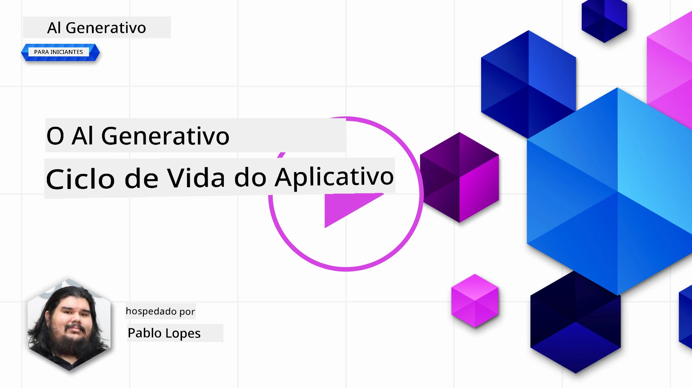
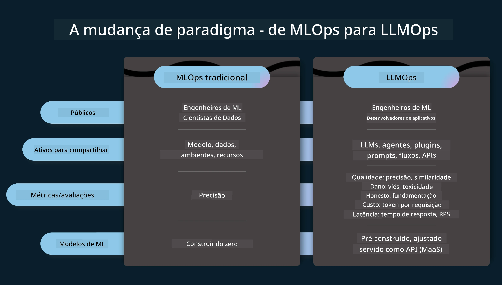
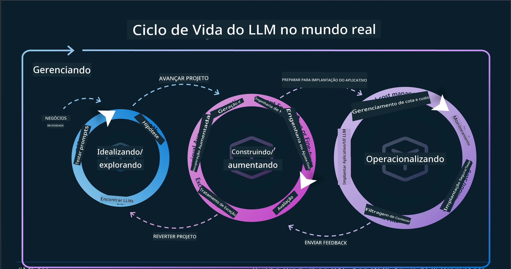
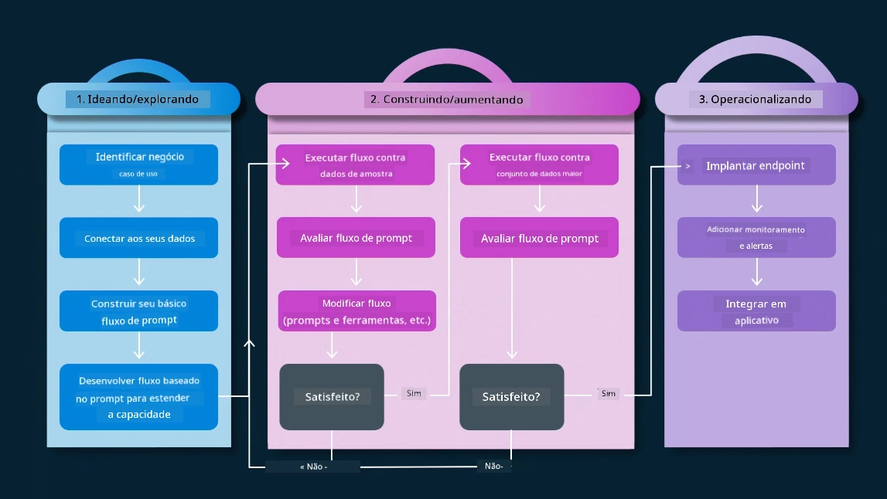
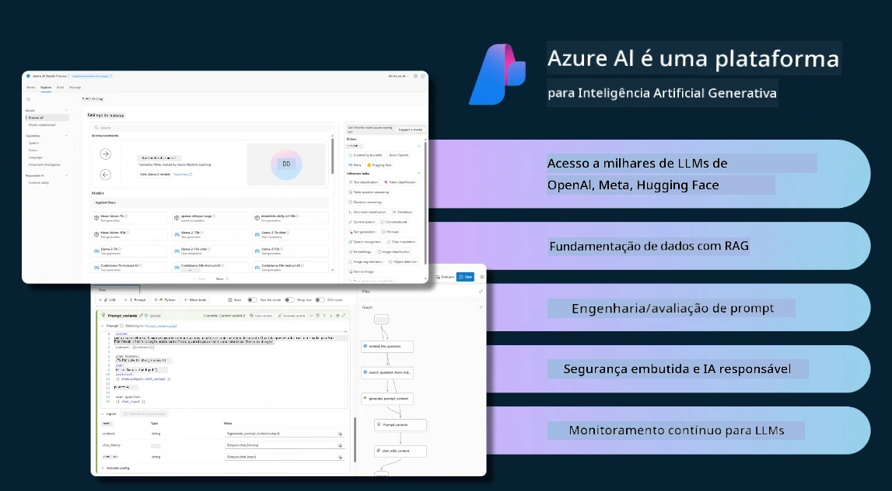
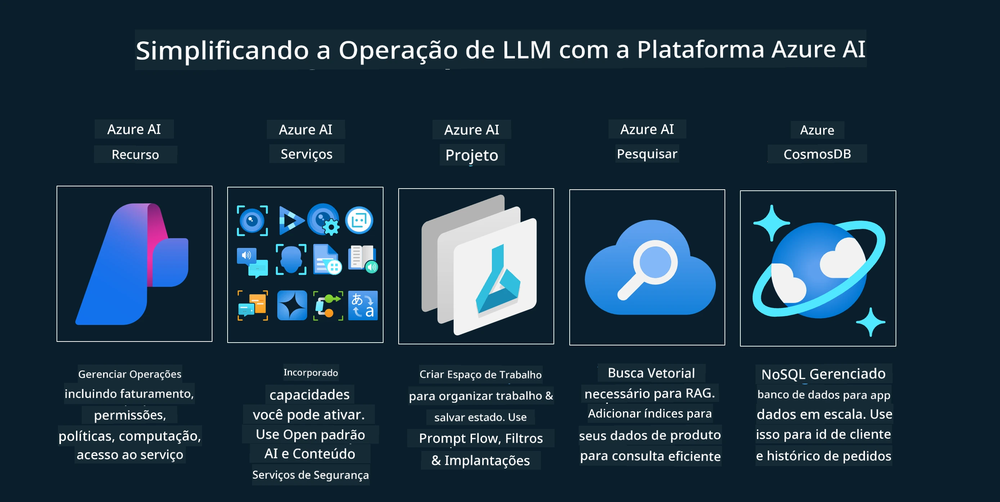
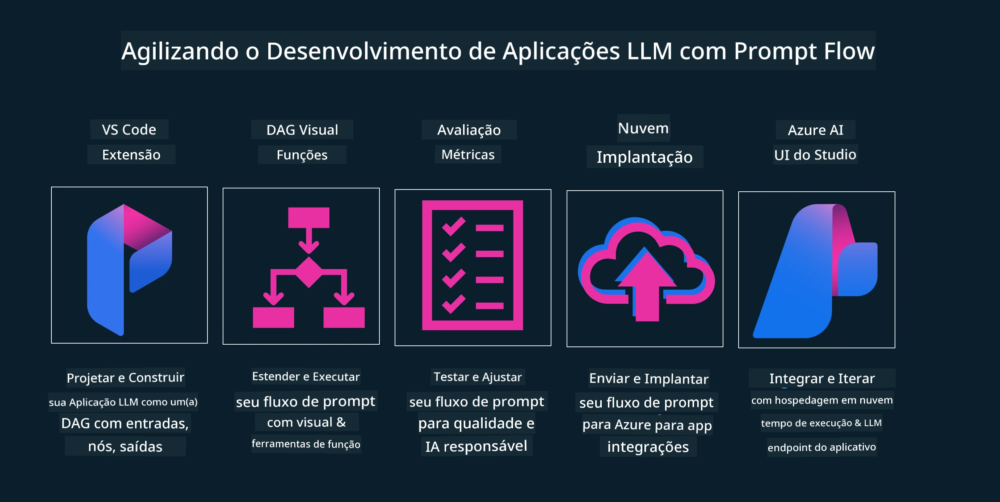

# O Ciclo de Vida de Aplicações de IA Generativa

Uma questão importante para todas as aplicações de IA é a relevância dos recursos de IA, já que a IA é um campo em rápida evolução; para garantir que sua aplicação permaneça relevante, confiável e robusta, você precisa monitorá-la, avaliá-la e melhorá-la continuamente. É aqui que o ciclo de vida da IA generativa entra em ação.

O ciclo de vida da IA generativa é uma estrutura que orienta você pelas etapas de desenvolvimento, implantação e manutenção de uma aplicação de IA generativa. Ele ajuda a definir seus objetivos, medir seu desempenho, identificar seus desafios e implementar suas soluções. Também auxilia na adequação da aplicação aos padrões éticos e legais do seu domínio e de seus stakeholders. Ao seguir o ciclo de vida da IA generativa, você pode garantir que sua aplicação está sempre entregando valor e satisfazendo seus usuários.

## Introdução

Neste capítulo, você irá:

- Compreender a Mudança de Paradigma de MLOps para LLMOps
- O Ciclo de Vida do LLM
- Ferramentas para o Ciclo de Vida
- Métricas e Avaliação do Ciclo de Vida

## Compreender a Mudança de Paradigma de MLOps para LLMOps

LLMs são uma nova ferramenta no arsenal da Inteligência Artificial, são incrivelmente poderosos em tarefas de análise e geração para aplicações, no entanto, esse poder traz algumas consequências para como otimizamos tarefas de IA e Aprendizado de Máquina Clássico.

Por isso, precisamos de um novo paradigma para adaptar essa ferramenta de forma dinâmica e com os incentivos corretos. Podemos categorizar aplicações antigas de IA como "Aplicações de ML" e aplicações mais recentes como "Aplicações de GenAI" ou simplesmente "Aplicações de IA", refletindo a tecnologia e as técnicas predominantes na época. Isso altera nossa narrativa de várias formas; veja a comparação a seguir.

Note que em LLMOps, focamos mais nos Desenvolvedores de Aplicações, usando integrações como ponto chave, adotando "Modelos como Serviço" e considerando os seguintes pontos para métricas.

- Qualidade: Qualidade da resposta
- Danos: IA responsável
- Honestidade: Fundamentação da resposta (Faz sentido? Está correto?)
- Custo: Orçamento da solução
- Latência: Tempo médio para resposta dos tokens

## O Ciclo de Vida do LLM

Primeiro, para entender o ciclo de vida e as modificações, observe o próximo infográfico.

Como você pode notar, isso é diferente dos Ciclos de Vida habituais do MLOps. LLMs têm muitos requisitos novos, como Prompting, técnicas diferentes para melhorar a qualidade (Fine-Tuning, RAG, Meta-Prompts), avaliação e responsabilidade com IA responsável, além de novas métricas de avaliação (Qualidade, Danos, Honestidade, Custo e Latência).

Por exemplo, veja como nós idealizamos. Usamos engenharia de prompts para experimentar com vários LLMs para explorar possibilidades e testar se suas hipóteses podem estar corretas.

Note que isso não é linear, mas sim loops integrados, iterativos e com um ciclo abrangente.

Como poderíamos explorar essas etapas? Vamos detalhar como construir um ciclo de vida.

Isso pode parecer um pouco complicado; vamos focar primeiro nas três grandes etapas.

1. Idealizar/Explorar: Exploração, aqui podemos explorar conforme as necessidades do negócio. Prototipar, criar um [PromptFlow](https://microsoft.github.io/promptflow/index.html?WT.mc_id=academic-105485-koreyst) e testar se é eficiente o suficiente para nossas hipóteses.
1. Construir/Aumentar: Implementação, agora, começamos a avaliar para conjuntos de dados maiores, implementando técnicas como Fine-tuning e RAG, para verificar a robustez da solução. Caso não funcione, reimplementar, adicionar novos passos no fluxo ou reestruturar os dados pode ajudar. Após testar o fluxo e a escala, se tudo funcionar e as métricas estiverem boas, estará pronto para a próxima etapa.
1. Operacionalizar: Integração, agora adicionando sistemas de monitoramento e alerta ao sistema, implantação e integração da aplicação.

Em seguida, temos o ciclo abrangente de Gestão, focado em segurança, conformidade e governança.

Parabéns, agora sua aplicação de IA está pronta e operacional. Para uma experiência prática, veja o [Contoso Chat Demo.](https://nitya.github.io/contoso-chat/?WT.mc_id=academic-105485-koreyst)

Agora, que ferramentas podemos usar?

## Ferramentas para o Ciclo de Vida

Para ferramentas, a Microsoft oferece a [Azure AI Platform](https://azure.microsoft.com/solutions/ai/?WT.mc_id=academic-105485-koreyst) e o [PromptFlow](https://microsoft.github.io/promptflow/index.html?WT.mc_id=academic-105485-koreyst) que facilitam e tornam seu ciclo fácil de implementar e pronto para usar.

A [Azure AI Platform](https://azure.microsoft.com/solutions/ai/?WT.mc_id=academic-105485-koreyst) permite usar o [Microsoft Foundry](https://ai.azure.com/?WT.mc_id=academic-105485-koreyst). Microsoft Foundry (antigo Azure AI Studio) é um portal web que permite explorar modelos, exemplos e ferramentas, gerenciar seus recursos e usar fluxos de desenvolvimento UI, além de opções SDK/CLI para desenvolvimento orientado a código.

Azure AI permite usar múltiplos recursos para gerenciar operações, serviços, projetos, buscas vetoriais e necessidades de banco de dados.

Construa, de Provas de Conceito (POC) até aplicações em grande escala com PromptFlow:

- Projete e construa aplicativos a partir do VS Code, com ferramentas visuais e funcionais
- Teste e ajuste seus aplicativos para uma IA de qualidade, com facilidade.
- Use o Microsoft Foundry para integrar e iterar com a nuvem, fazer push e implantar para integração rápida.

## Ótimo! Continue seu aprendizado!

Incrível, agora aprenda mais sobre como estruturamos uma aplicação para usar os conceitos com o [Contoso Chat App](https://nitya.github.io/contoso-chat/?WT.mc_id=academic-105485-koreyst), para ver como a Advocacia em Nuvem aplica esses conceitos em demonstrações. Para mais conteúdo, confira nossa [sessão de breakout do Ignite!
](https://www.youtube.com/watch?v=DdOylyrTOWg)

Agora, confira a Aula 15, para entender como [Retrieval Augmented Generation e Bancos de Dados Vetoriais](../15-rag-and-vector-databases/README.md?WT.mc_id=academic-105485-koreyst) impactam a IA Generativa e criam aplicações mais envolventes!

---

<!-- CO-OP TRANSLATOR DISCLAIMER START -->
**Aviso Legal**:
Este documento foi traduzido usando o serviço de tradução por IA [Co-op Translator](https://github.com/Azure/co-op-translator). Embora nos esforcemos pela precisão, por favor, esteja ciente de que traduções automatizadas podem conter erros ou imprecisões. O documento original em seu idioma nativo deve ser considerado a fonte autorizada. Para informações críticas, recomenda-se tradução profissional humana. Não nos responsabilizamos por quaisquer mal-entendidos ou interpretações incorretas decorrentes do uso desta tradução.
<!-- CO-OP TRANSLATOR DISCLAIMER END -->