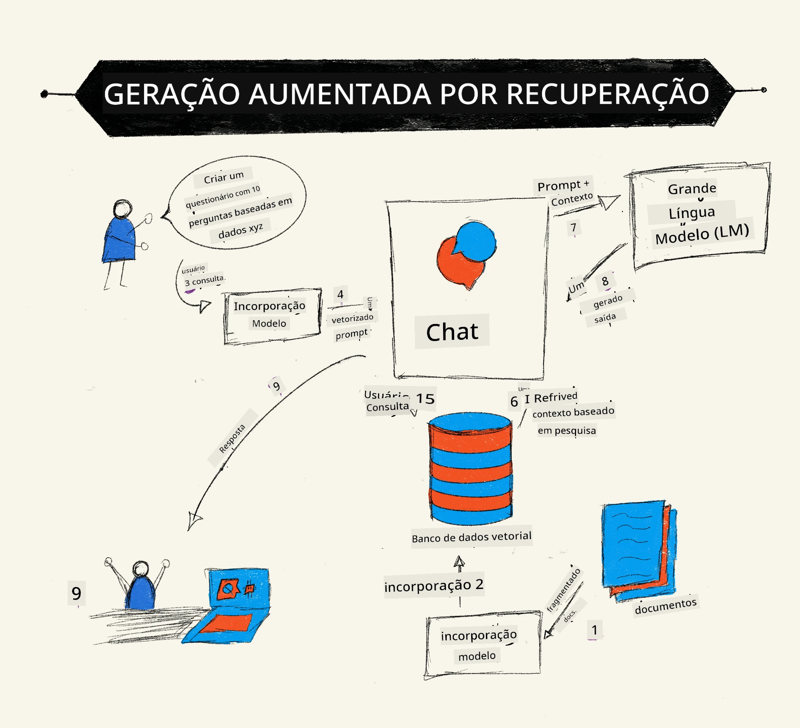

# Geração Aumentada por Recuperação (RAG) e Bancos de Dados Vetoriais

[](https://youtu.be/4l8zhHUBeyI?si=BmvDmL1fnHtgQYkL)

Na lição de aplicações de busca, aprendemos brevemente como integrar seus próprios dados em Grandes Modelos de Linguagem (LLMs). Nesta lição, exploraremos mais a fundo os conceitos de fundamentação dos seus dados na aplicação LLM, a mecânica do processo e os métodos para armazenamento de dados, incluindo tanto embeddings quanto texto.

> **Vídeo em Breve**

## Introdução

Nesta lição, abordaremos o seguinte:

- Uma introdução ao RAG, o que é e por que é usado em IA (inteligência artificial).

- Compreensão do que são bancos de dados vetoriais e criação de um para nossa aplicação.

- Um exemplo prático de como integrar RAG em uma aplicação.

## Objetivos de Aprendizagem

Após concluir esta lição, você será capaz de:

- Explicar a importância do RAG na recuperação e processamento de dados.

- Configurar a aplicação RAG e fundamentar seus dados em um LLM.

- Integrar efetivamente RAG e Bancos de Dados Vetoriais em aplicações LLM.

## Nosso Cenário: aprimorando nossos LLMs com nossos próprios dados

Para esta lição, queremos adicionar nossas próprias notas na startup educacional, permitindo que o chatbot obtenha mais informações sobre os diferentes assuntos. Usando as notas que temos, os alunos poderão estudar melhor e entender os diferentes tópicos, facilitando a revisão para seus exames. Para criar nosso cenário, usaremos:

- `Azure OpenAI:` o LLM que usaremos para criar nosso chatbot

- `Lição AI para iniciantes sobre Redes Neurais:` esses serão os dados nos quais fundamentaremos nosso LLM

- `Azure AI Search` e `Azure Cosmos DB:` banco de dados vetorial para armazenar nossos dados e criar um índice de pesquisa

Os usuários poderão criar quizzes de prática a partir de suas notas, cartões de revisão e resumi-los em visões concisas. Para começar, vamos entender o que é RAG e como funciona:

## Geração Aumentada por Recuperação (RAG)

Um chatbot movido por LLM processa prompts dos usuários para gerar respostas. Ele é projetado para ser interativo e engajar-se com usuários em uma ampla variedade de tópicos. Contudo, suas respostas são limitadas ao contexto fornecido e aos seus dados de treinamento base. Por exemplo, o corte de conhecimento do GPT-4 é setembro de 2021, o que significa que ele não possui conhecimento de eventos ocorridos após esse período. Além disso, os dados usados para treinar LLMs excluem informações confidenciais, como notas pessoais ou o manual de produto de uma empresa.

### Como funcionam os RAGs (Geração Aumentada por Recuperação)



Suponha que você queira implantar um chatbot que cria quizzes a partir de suas notas, será necessária uma conexão à base de conhecimento. É aí que o RAG entra em ação. Os RAGs operam da seguinte forma:

- **Base de conhecimento:** Antes da recuperação, esses documentos precisam ser ingeridos e pré-processados, tipicamente dividindo grandes documentos em pedaços menores, transformando-os em embeddings de texto e armazenando-os em um banco de dados.

- **Consulta do usuário:** o usuário faz uma pergunta

- **Recuperação:** Quando um usuário faz uma pergunta, o modelo de embedding recupera informações relevantes da nossa base de conhecimento para fornecer mais contexto que será incorporado ao prompt.

- **Geração Aumentada:** o LLM aprimora sua resposta com base nos dados recuperados. Isso permite que a resposta gerada não seja apenas baseada em dados pré-treinados, mas também em informações relevantes do contexto adicionado. Os dados recuperados são usados para aumentar as respostas do LLM. O LLM então retorna uma resposta à pergunta do usuário.


A arquitetura para RAGs é implementada usando transformers consistindo em duas partes: um codificador e um decodificador. Por exemplo, quando um usuário faz uma pergunta, o texto de entrada é 'codificado' em vetores que capturam o significado das palavras e os vetores são 'decodificados' em nosso índice de documentos e geram um novo texto baseado na consulta do usuário. O LLM usa tanto um modelo codificador-decodificador para gerar a saída.

Duas abordagens ao implementar RAG segundo o artigo proposto: [Retrieval-Augmented Generation for Knowledge intensive NLP (natural language processing software) Tasks](https://arxiv.org/pdf/2005.11401.pdf?WT.mc_id=academic-105485-koreyst) são:

- **_RAG-Sequence_** usando documentos recuperados para prever a melhor resposta possível a uma consulta do usuário

- **RAG-Token** usando documentos para gerar o próximo token, depois recuperá-los para responder à consulta do usuário

### Por que usar RAGs?

- **Riqueza de informação:** garante que as respostas em texto estejam atualizadas e atuais. Portanto, melhora o desempenho em tarefas específicas de domínio ao acessar a base de conhecimento interna.

- Reduz a fabricação usando **dados verificáveis** na base de conhecimento para fornecer contexto às consultas dos usuários.

- É **econômico** pois são mais acessíveis comparados ao ajuste fino de um LLM.

## Criando uma base de conhecimento

Nossa aplicação é baseada em nossos dados pessoais, ou seja, a lição de Redes Neurais no currículo AI para Iniciantes.

### Bancos de Dados Vetoriais

Um banco de dados vetorial, diferente dos bancos tradicionais, é um banco especializado projetado para armazenar, gerenciar e buscar vetores embutidos (embeddings). Ele armazena representações numéricas dos documentos. Dividir os dados em embeddings numéricos torna mais fácil para nosso sistema de IA entender e processar os dados.

Armazenamos nossos embeddings em bancos de dados vetoriais, pois os LLMs têm um limite do número de tokens que aceitam como entrada. Como não é possível enviar o embedding inteiro para um LLM, precisamos dividi-los em pedaços e quando um usuário faz uma pergunta, os embeddings mais relacionados à pergunta serão retornados junto com o prompt. A divisão em pedaços também reduz custos relacionados ao número de tokens enviados ao LLM.

Alguns bancos de dados vetoriais populares incluem Azure Cosmos DB, Clarifyai, Pinecone, Chromadb, ScaNN, Qdrant e DeepLake. Você pode criar um modelo Azure Cosmos DB usando Azure CLI com o seguinte comando:

```bash
az login
az group create -n <resource-group-name> -l <location>
az cosmosdb create -n <cosmos-db-name> -r <resource-group-name>
az cosmosdb list-keys -n <cosmos-db-name> -g <resource-group-name>
```

### De texto para embeddings

Antes de armazenar nossos dados, precisaremos convertê-los para embeddings vetoriais antes de armazená-los no banco de dados. Se você estiver trabalhando com documentos grandes ou textos longos, pode dividi-los com base em consultas esperadas. A divisão pode ser feita ao nível de sentença ou de parágrafo. Como a divisão deriva significados das palavras ao redor, você pode adicionar algum outro contexto a um pedaço, por exemplo, adicionando o título do documento ou incluindo algum texto antes ou depois do pedaço. Você pode dividir os dados como segue:

```python
def split_text(text, max_length, min_length):
    words = text.split()
    chunks = []
    current_chunk = []

    for word in words:
        current_chunk.append(word)
        if len(' '.join(current_chunk)) < max_length and len(' '.join(current_chunk)) > min_length:
            chunks.append(' '.join(current_chunk))
            current_chunk = []

    # Se o último pedaço não atingiu o comprimento mínimo, adicione-o mesmo assim
    if current_chunk:
        chunks.append(' '.join(current_chunk))

    return chunks
```

Uma vez divididos, podemos então embutir nosso texto usando diferentes modelos de embedding. Alguns modelos que você pode usar incluem: word2vec, ada-002 da OpenAI, Azure Computer Vision e muitos outros. A escolha do modelo dependerá das línguas usadas, do tipo de conteúdo codificado (texto/imagens/áudio), do tamanho da entrada codificável e do comprimento da saída do embedding.

Um exemplo de texto embutido usando o modelo `text-embedding-ada-002` da OpenAI é:


## Recuperação e Busca Vetorial

Quando um usuário faz uma pergunta, o recuperador a transforma em um vetor usando o codificador da consulta, em seguida, ele busca em nosso índice de busca de documentos por vetores relevantes relacionados à entrada. Feito isso, converte o vetor de entrada e os vetores do documento em texto e os passa pelo LLM.

### Recuperação

A recuperação ocorre quando o sistema tenta rapidamente encontrar os documentos do índice que satisfaçam os critérios de busca. O objetivo do recuperador é obter documentos que serão usados para fornecer contexto e fundamentar o LLM em seus dados.

Existem várias formas de realizar buscas dentro do nosso banco de dados, tais como:

- **Busca por palavra-chave** - usada para buscas em texto

- **Busca vetorial** - converte documentos de texto para representações vetoriais usando modelos de embedding, permitindo uma **busca semântica** baseada no significado das palavras. A recuperação será feita consultando os documentos cujas representações vetoriais estão mais próximas da pergunta do usuário.

- **Híbrida** - uma combinação de busca por palavra-chave e vetorial.

Um desafio na recuperação ocorre quando não há uma resposta semelhante à consulta no banco de dados; o sistema então retorna a melhor informação disponível. Contudo, você pode usar táticas como definir a distância máxima para relevância ou usar busca híbrida que combina palavra-chave e busca vetorial. Nesta lição usaremos busca híbrida, uma combinação de busca vetorial e por palavra-chave. Armazenaremos nossos dados em um dataframe com colunas contendo os pedaços (chunks) bem como os embeddings.

### Similaridade Vetorial

O recuperador buscará pela base de conhecimento embeddings que estejam próximos, o vizinho mais próximo, pois são textos similares. No cenário em que um usuário faz uma consulta, primeiro ela é embutida e então comparada com embeddings similares. A métrica comum usada para encontrar quão similares são os vetores é a similaridade de cosseno, que se baseia no ângulo entre dois vetores.

Podemos medir similaridade usando outras alternativas, como distância Euclidiana, que é a linha reta entre os pontos finais dos vetores, e produto escalar, que mede a soma dos produtos dos elementos correspondentes de dois vetores.

### Índice de busca

Ao fazer recuperações, precisaremos construir um índice de busca para nossa base de conhecimento antes de realizar a consulta. Um índice armazenará nossos embeddings e poderá recuperar rapidamente os pedaços mais similares mesmo em um banco de dados grande. Podemos criar nosso índice localmente usando:

```python
from sklearn.neighbors import NearestNeighbors

embeddings = flattened_df['embeddings'].to_list()

# Criar o índice de busca
nbrs = NearestNeighbors(n_neighbors=5, algorithm='ball_tree').fit(embeddings)

# Para consultar o índice, você pode usar o método kneighbors
distances, indices = nbrs.kneighbors(embeddings)
```

### Reordenação

Depois de ter consultado o banco de dados, você pode precisar ordenar os resultados do mais relevante para o menos relevante. Um LLM de reordenação utiliza Machine Learning para melhorar a relevância dos resultados de busca ordenando-os do mais relevante. Usando Azure AI Search, a reordenação é feita automaticamente para você usando um reordenador semântico. Um exemplo de como a reordenação funciona usando vizinhos mais próximos:

```python
# Encontrar os documentos mais semelhantes
distances, indices = nbrs.kneighbors([query_vector])

index = []
# Imprimir os documentos mais semelhantes
for i in range(3):
    index = indices[0][i]
    for index in indices[0]:
        print(flattened_df['chunks'].iloc[index])
        print(flattened_df['path'].iloc[index])
        print(flattened_df['distances'].iloc[index])
    else:
        print(f"Index {index} not found in DataFrame")
```

## Juntando tudo

A última etapa é adicionar nosso LLM para conseguir respostas fundamentadas em nossos dados. Podemos implementar assim:

```python
user_input = "what is a perceptron?"

def chatbot(user_input):
    # Converter a pergunta em um vetor de consulta
    query_vector = create_embeddings(user_input)

    # Encontrar os documentos mais semelhantes
    distances, indices = nbrs.kneighbors([query_vector])

    # adicionar documentos à consulta para fornecer contexto
    history = []
    for index in indices[0]:
        history.append(flattened_df['chunks'].iloc[index])

    # combinar o histórico e a entrada do usuário
    history.append(user_input)

    # criar um objeto de mensagem
    messages=[
        {"role": "system", "content": "You are an AI assistant that helps with AI questions."},
        {"role": "user", "content": "\n\n".join(history) }
    ]

    # usar o complemento de chat para gerar uma resposta
    response = openai.chat.completions.create(
        model="gpt-4",
        temperature=0.7,
        max_tokens=800,
        messages=messages
    )

    return response.choices[0].message

chatbot(user_input)
```

## Avaliando nossa aplicação

### Métricas de Avaliação

- Qualidade das respostas fornecidas, garantindo que soem naturais, fluentes e humanas

- Fundamentação dos dados: avaliando se a resposta veio dos documentos fornecidos

- Relevância: verificando se a resposta corresponde e está relacionada à pergunta feita

- Fluência - se a resposta faz sentido gramaticalmente

## Casos de Uso para utilizar RAG (Geração Aumentada por Recuperação) e bancos de dados vetoriais

Existem muitos casos de uso onde chamadas de função podem melhorar sua aplicação, como:

- Perguntas e Respostas: fundamentando os dados da sua empresa em um chat que possa ser usado por funcionários para fazer perguntas.

- Sistemas de Recomendação: onde você pode criar um sistema que combina os valores mais similares, por exemplo, filmes, restaurantes e muito mais.

- Serviços de Chatbot: você pode armazenar histórico de conversas e personalizar o diálogo com base nos dados do usuário.

- Busca de imagens baseada em embeddings vetoriais, útil para reconhecimento de imagem e detecção de anomalias.

## Resumo

Cobrimos as áreas fundamentais do RAG desde a adição dos nossos dados na aplicação, a consulta do usuário até a saída. Para simplificar a criação do RAG, você pode usar frameworks como Semanti Kernel, Langchain ou Autogen.

## Tarefa

Para continuar seu aprendizado sobre Geração Aumentada por Recuperação (RAG) você pode construir:

- Criar uma interface para a aplicação usando o framework de sua escolha

- Utilizar um framework, seja LangChain ou Semantic Kernel, e recriar sua aplicação.

Parabéns por concluir a lição 👏.

## O aprendizado não para aqui, continue a jornada

Após concluir esta lição, confira nossa [coleção de Aprendizagem de IA Generativa](https://aka.ms/genai-collection?WT.mc_id=academic-105485-koreyst) para continuar elevando seu conhecimento em IA Generativa!

---

<!-- CO-OP TRANSLATOR DISCLAIMER START -->
**Aviso Legal**:  
Este documento foi traduzido utilizando o serviço de tradução por IA [Co-op Translator](https://github.com/Azure/co-op-translator). Embora nos esforcemos para garantir a precisão, esteja ciente de que traduções automáticas podem conter erros ou imprecisões. O documento original no idioma nativo deve ser considerado a fonte autorizada. Para informações críticas, recomenda-se tradução profissional realizada por um humano. Não nos responsabilizamos por quaisquer mal-entendidos ou interpretações incorretas decorrentes do uso desta tradução.
<!-- CO-OP TRANSLATOR DISCLAIMER END -->