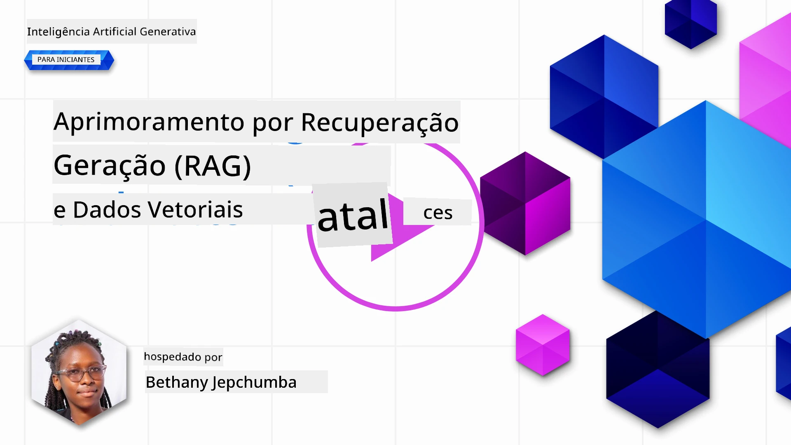
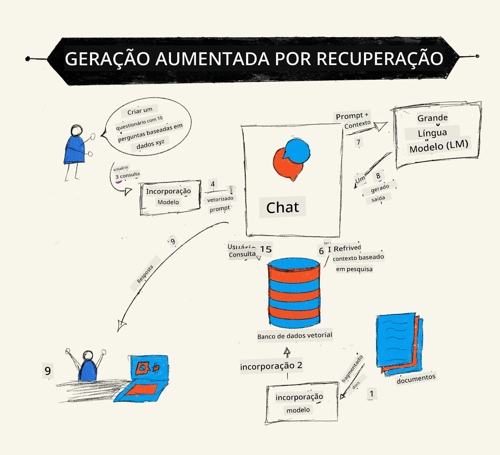
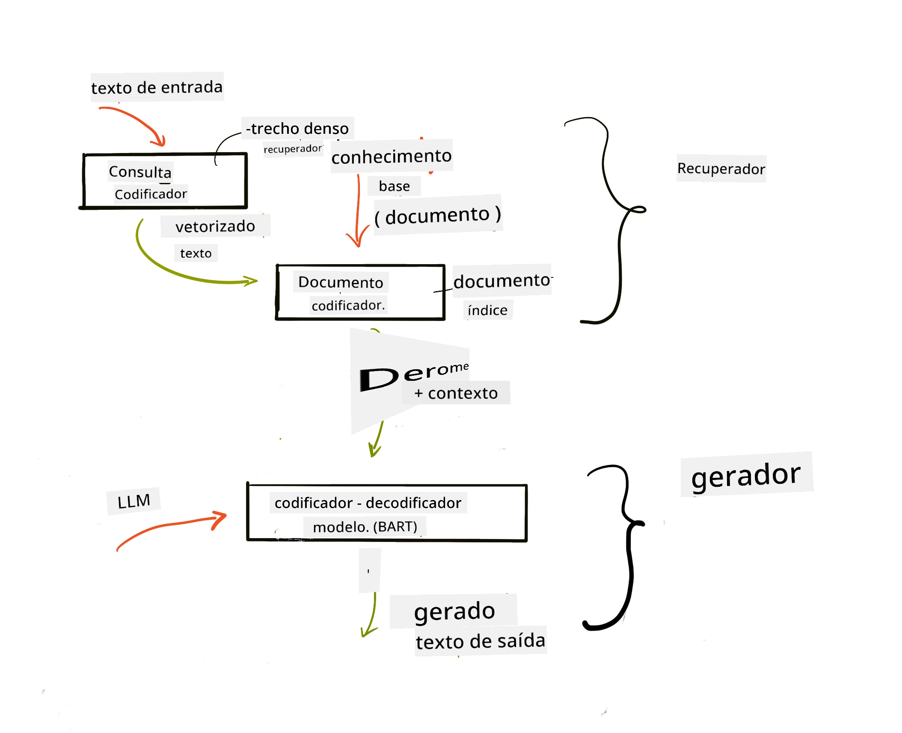
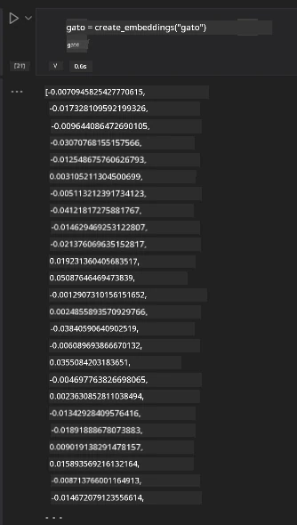

# Geração Aumentada por Recuperação (RAG) e Bancos de Dados Vetoriais

[](https://youtu.be/4l8zhHUBeyI?si=BmvDmL1fnHtgQYkL)

Na lição de aplicações de busca, aprendemos brevemente como integrar seus próprios dados em Modelos de Linguagem Grande (LLMs). Nesta lição, aprofundaremos os conceitos de fundamentar seus dados em sua aplicação LLM, a mecânica do processo e os métodos para armazenar dados, incluindo tanto embeddings quanto texto.

> **Vídeo em breve**

## Introdução

Nesta lição, abordaremos o seguinte:

- Uma introdução ao RAG, o que é e por que é usado em IA (inteligência artificial).

- Entendendo o que são bancos de dados vetoriais e criando um para nossa aplicação.

- Um exemplo prático de como integrar RAG em uma aplicação.

## Objetivos de Aprendizagem

Após completar esta lição, você será capaz de:

- Explicar a importância do RAG na recuperação e processamento de dados.

- Configurar aplicação RAG e fundamentar seus dados em um LLM

- Integração eficaz de RAG e Bancos de Dados Vetoriais em Aplicações LLM.

## Nosso Cenário: aprimorando nossos LLMs com nossos próprios dados

Para esta lição, queremos adicionar nossas próprias anotações na startup educacional, o que permite que o chatbot obtenha mais informações sobre os diferentes assuntos. Usando as anotações que temos, os alunos poderão estudar melhor e entender os diferentes tópicos, facilitando a revisão para seus exames. Para criar nosso cenário, usaremos:

- `Azure OpenAI:` o LLM que usaremos para criar nosso chatbot

- `Lição AI para iniciantes sobre Redes Neurais`: estes serão os dados nos quais fundamentaremos nosso LLM

- `Azure AI Search` e `Azure Cosmos DB:` banco de dados vetorial para armazenar nossos dados e criar um índice de busca

Os usuários poderão criar questionários práticos a partir de suas anotações, cartões de revisão e resumi-los em visões concisas. Para começar, vamos ver o que é RAG e como funciona:

## Geração Aumentada por Recuperação (RAG)

Um chatbot alimentado por LLM processa as solicitações dos usuários para gerar respostas. É projetado para ser interativo e engaja com os usuários em uma ampla variedade de tópicos. No entanto, suas respostas são limitadas ao contexto fornecido e seus dados de treinamento fundamentais. Por exemplo, o corte de conhecimento do GPT-4 é setembro de 2021, significando que ele não possui conhecimento de eventos que ocorreram após esse período. Além disso, os dados usados para treinar LLMs excluem informações confidenciais, como anotações pessoais ou o manual de produtos de uma empresa.

### Como os RAGs (Geração Aumentada por Recuperação) funcionam



Suponha que você queira implantar um chatbot que cria questionários a partir de suas anotações, você precisará de uma conexão com a base de conhecimento. É aí que o RAG entra em ação. Os RAGs operam da seguinte maneira:

- **Base de conhecimento:** Antes da recuperação, esses documentos precisam ser ingeridos e pré-processados, tipicamente dividindo documentos grandes em pedaços menores, transformando-os em embeddings de texto e armazenando-os em um banco de dados.

- **Consulta do usuário:** o usuário faz uma pergunta

- **Recuperação:** Quando um usuário faz uma pergunta, o modelo de embeddings recupera informações relevantes da nossa base de conhecimento para fornecer mais contexto que será incorporado na solicitação.

- **Geração Aumentada:** o LLM aprimora sua resposta com base nos dados recuperados. Isso permite que a resposta gerada não seja apenas baseada em dados pré-treinados, mas também em informações relevantes do contexto adicionado. Os dados recuperados são usados para aumentar as respostas do LLM. O LLM então retorna uma resposta à pergunta do usuário.



A arquitetura dos RAGs é implementada usando transformers consistindo em duas partes: um codificador e um decodificador. Por exemplo, quando um usuário faz uma pergunta, o texto de entrada é 'codificado' em vetores que capturam o significado das palavras e os vetores são 'decodificados' em nosso índice de documentos e geram novo texto com base na consulta do usuário. O LLM usa um modelo codificador-decodificador para gerar a saída.

Duas abordagens para implementar RAG de acordo com o artigo proposto: [Retrieval-Augmented Generation for Knowledge intensive NLP (natural language processing software) Tasks](https://arxiv.org/pdf/2005.11401.pdf?WT.mc_id=academic-105485-koreyst) são:

- **_RAG-Sequence_** usando documentos recuperados para prever a melhor resposta possível para uma consulta do usuário

- **RAG-Token** usando documentos para gerar o próximo token, então recuperá-los para responder à consulta do usuário

### Por que usar RAGs?

- **Riqueza de informações:** garante que as respostas de texto estejam atualizadas e atuais. Isso melhora o desempenho em tarefas específicas do domínio, acessando a base de conhecimento interna.

- Reduz a fabricação utilizando **dados verificáveis** na base de conhecimento para fornecer contexto às consultas dos usuários.

- É **econômico**, pois são mais baratos comparados ao ajuste fino de um LLM

## Criando uma base de conhecimento

Nossa aplicação é baseada em nossos dados pessoais, ou seja, a lição de Redes Neurais do currículo AI Para Iniciantes.

### Bancos de Dados Vetoriais

Um banco de dados vetorial, diferente de bancos de dados tradicionais, é um banco especializado em armazenar, gerenciar e buscar vetores embutidos. Ele armazena representações numéricas dos documentos. Quebrar os dados em embeddings numéricos facilita para nosso sistema de IA entender e processar os dados.

Armazenamos nossos embeddings em bancos de dados vetoriais porque LLMs têm limite no número de tokens que aceitam como entrada. Como você não pode passar todos os embeddings para um LLM, precisaremos dividi-los em pedaços e, quando um usuário faz uma pergunta, os embeddings mais semelhantes à pergunta serão retornados junto com a solicitação. A divisão em pedaços também reduz custos no número de tokens passados por um LLM.

Alguns bancos de dados vetoriais populares incluem Azure Cosmos DB, Clarifyai, Pinecone, Chromadb, ScaNN, Qdrant e DeepLake. Você pode criar um modelo Azure Cosmos DB usando o Azure CLI com o seguinte comando:

```bash
az login
az group create -n <resource-group-name> -l <location>
az cosmosdb create -n <cosmos-db-name> -r <resource-group-name>
az cosmosdb list-keys -n <cosmos-db-name> -g <resource-group-name>
```

### De texto para embeddings

Antes de armazenarmos nossos dados, precisaremos convertê-los em embeddings vetoriais antes de armazená-los no banco de dados. Se você estiver trabalhando com documentos grandes ou textos longos, pode dividi-los com base nas consultas que espera. A divisão pode ser feita no nível da frase ou parágrafo. Como a divisão obtém significado das palavras ao redor, você pode adicionar outro contexto a um pedaço, por exemplo, adicionando o título do documento ou incluindo algum texto antes ou depois do pedaço. Você pode dividir os dados da seguinte forma:

```python
def split_text(text, max_length, min_length):
    words = text.split()
    chunks = []
    current_chunk = []

    for word in words:
        current_chunk.append(word)
        if len(' '.join(current_chunk)) < max_length and len(' '.join(current_chunk)) > min_length:
            chunks.append(' '.join(current_chunk))
            current_chunk = []

    # Se o último pedaço não atingiu o comprimento mínimo, adicione-o mesmo assim
    if current_chunk:
        chunks.append(' '.join(current_chunk))

    return chunks
```

Depois de divididos, podemos então incorporar nosso texto usando diferentes modelos de embeddings. Alguns modelos que você pode usar incluem: word2vec, ada-002 da OpenAI, Azure Computer Vision e muitos mais. A seleção do modelo dependerá dos idiomas que você está usando, do tipo de conteúdo codificado (texto/imagens/áudio), o tamanho da entrada que pode codificar e o comprimento da saída do embedding.

Um exemplo de texto incorporado usando o modelo `text-embedding-ada-002` da OpenAI é:


## Recuperação e Busca Vetorial

Quando um usuário faz uma pergunta, o recuperador a transforma em um vetor usando o codificador de consulta, então busca no nosso índice de busca de documentos vetores relevantes no documento relacionados à entrada. Depois disso, converte tanto o vetor de entrada quanto os vetores do documento em texto e os passa pelo LLM.

### Recuperação

A recuperação acontece quando o sistema tenta encontrar rapidamente os documentos do índice que satisfazem o critério de busca. O objetivo do recuperador é obter documentos que serão usados para fornecer contexto e fundamentar o LLM em seus dados.

Existem várias formas de realizar buscas em nosso banco de dados, tais como:

- **Busca por palavra-chave** - usado para buscas textuais

- **Busca vetorial** - converte documentos de texto em representações vetoriais usando modelos de embeddings, permitindo uma **busca semântica** usando o significado das palavras. A recuperação será feita consultando os documentos cujas representações vetoriais são mais próximas da pergunta do usuário.

- **Híbrido** - uma combinação de busca por palavra-chave e busca vetorial.

Um desafio na recuperação ocorre quando não há resposta semelhante à consulta no banco de dados; o sistema então retorna a melhor informação que puder, contudo, você pode usar táticas como configurar a distância máxima para relevância ou usar busca híbrida que combina palavra-chave e busca vetorial. Nesta lição usaremos busca híbrida, uma combinação de busca vetorial e palavra-chave. Armazenaremos nossos dados em um dataframe com colunas contendo os pedaços e embeddings.

### Similaridade Vetorial

O recuperador buscará na base de conhecimento embeddings que estejam próximos, os vizinhos mais próximos, pois são textos similares. No cenário em que o usuário faz uma consulta, esta é primeiro embutida e então comparada com embeddings semelhantes. A medida comum usada para encontrar o quão similares dois vetores são é a similaridade do cosseno, que é baseada no ângulo entre dois vetores.

Podemos medir similaridade usando outras alternativas, como distância Euclidiana, que é a linha reta entre os pontos finais dos vetores, e produto escalar, que mede a soma dos produtos dos elementos correspondentes de dois vetores.

### Índice de busca

Ao fazer a recuperação, precisaremos construir um índice de busca para a nossa base de conhecimento antes de realizar a busca. Um índice armazenará nossos embeddings e pode recuperar rapidamente os pedaços mais similares mesmo em um banco de dados grande. Podemos criar nosso índice localmente usando:

```python
from sklearn.neighbors import NearestNeighbors

embeddings = flattened_df['embeddings'].to_list()

# Criar o índice de busca
nbrs = NearestNeighbors(n_neighbors=5, algorithm='ball_tree').fit(embeddings)

# Para consultar o índice, você pode usar o método kneighbors
distances, indices = nbrs.kneighbors(embeddings)
```

### Reordenação (Re-ranking)

Depois de consultar o banco de dados, você pode precisar ordenar os resultados do mais relevante ao menos relevante. Um LLM para reordenação utiliza aprendizado de máquina para melhorar a relevância dos resultados da busca, ordenando-os dos mais relevantes. Usando Azure AI Search, a reordenação é feita automaticamente para você usando um reordenador semântico. Um exemplo de como funciona a reordenação usando vizinhos mais próximos:

```python
# Encontre os documentos mais semelhantes
distances, indices = nbrs.kneighbors([query_vector])

index = []
# Imprima os documentos mais semelhantes
for i in range(3):
    index = indices[0][i]
    for index in indices[0]:
        print(flattened_df['chunks'].iloc[index])
        print(flattened_df['path'].iloc[index])
        print(flattened_df['distances'].iloc[index])
    else:
        print(f"Index {index} not found in DataFrame")
```

## Colocando tudo junto

O último passo é adicionar nosso LLM à mistura para poder obter respostas fundamentadas em nossos dados. Podemos implementá-lo da seguinte forma:

```python
user_input = "what is a perceptron?"

def chatbot(user_input):
    # Converter a pergunta em um vetor de consulta
    query_vector = create_embeddings(user_input)

    # Encontrar os documentos mais semelhantes
    distances, indices = nbrs.kneighbors([query_vector])

    # adicionar documentos à consulta para fornecer contexto
    history = []
    for index in indices[0]:
        history.append(flattened_df['chunks'].iloc[index])

    # combinar o histórico e a entrada do usuário
    history.append(user_input)

    # criar um objeto de mensagem
    messages=[
        {"role": "system", "content": "You are an AI assistant that helps with AI questions."},
        {"role": "user", "content": "\n\n".join(history) }
    ]

    # usar a API de Respostas para gerar uma resposta
    response = client.responses.create(
        model="gpt-4o-mini",
        temperature=0.7,
        max_output_tokens=800,
        input=messages,
        store=False,
    )

    return response.output_text

chatbot(user_input)
```

## Avaliando nossa aplicação

### Métricas de Avaliação

- Qualidade das respostas fornecidas, garantindo que soem naturais, fluentes e humanas

- Fundamentação dos dados: avaliando se a resposta veio dos documentos fornecidos

- Relevância: avaliando se a resposta corresponde e está relacionada à pergunta feita

- Fluência - se a resposta faz sentido gramaticalmente

## Casos de Uso para usar RAG (Geração Aumentada por Recuperação) e bancos de dados vetoriais

Existem muitos casos de uso onde chamadas de função podem melhorar seu app como:

- Perguntas e Respostas: fundamentar os dados da sua empresa em um chat que pode ser usado por funcionários para fazer perguntas.

- Sistemas de Recomendação: onde você pode criar um sistema que combina os valores mais similares, por exemplo, filmes, restaurantes e muitos mais.

- Serviços de chatbot: você pode armazenar histórico de chat e personalizar a conversa com base nos dados do usuário.

- Busca por imagem com base em embeddings vetoriais, útil para reconhecimento de imagem e detecção de anomalias.

## Resumo

Cobrimos as áreas fundamentais do RAG, desde adicionar nossos dados à aplicação, a consulta do usuário e a saída. Para simplificar a criação de RAG, você pode usar frameworks como Semanti Kernel, Langchain ou Autogen.

## Tarefa

Para continuar seu aprendizado sobre Geração Aumentada por Recuperação (RAG), você pode construir:

- Construa uma interface front-end para a aplicação usando o framework de sua escolha

- Utilize um framework, seja LangChain ou Semantic Kernel, e recrie sua aplicação.

Parabéns por completar a lição 👏.

## O aprendizado não para aqui, continue a Jornada

Após completar esta lição, confira nossa [coleção de Aprendizado em IA Generativa](https://aka.ms/genai-collection?WT.mc_id=academic-105485-koreyst) para continuar aprimorando seu conhecimento em IA Generativa!

---

<!-- CO-OP TRANSLATOR DISCLAIMER START -->
**Aviso Legal**:
Este documento foi traduzido usando o serviço de tradução por IA [Co-op Translator](https://github.com/Azure/co-op-translator). Embora nos esforcemos pela precisão, por favor, esteja ciente de que traduções automatizadas podem conter erros ou imprecisões. O documento original em seu idioma nativo deve ser considerado a fonte autorizada. Para informações críticas, recomenda-se tradução profissional humana. Não nos responsabilizamos por quaisquer mal-entendidos ou interpretações incorretas decorrentes do uso desta tradução.
<!-- CO-OP TRANSLATOR DISCLAIMER END -->