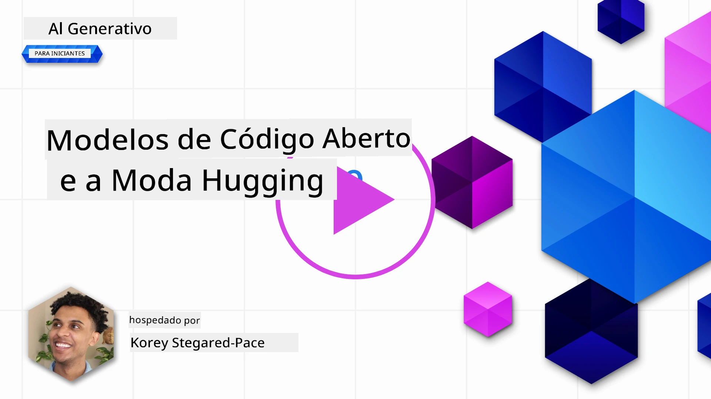
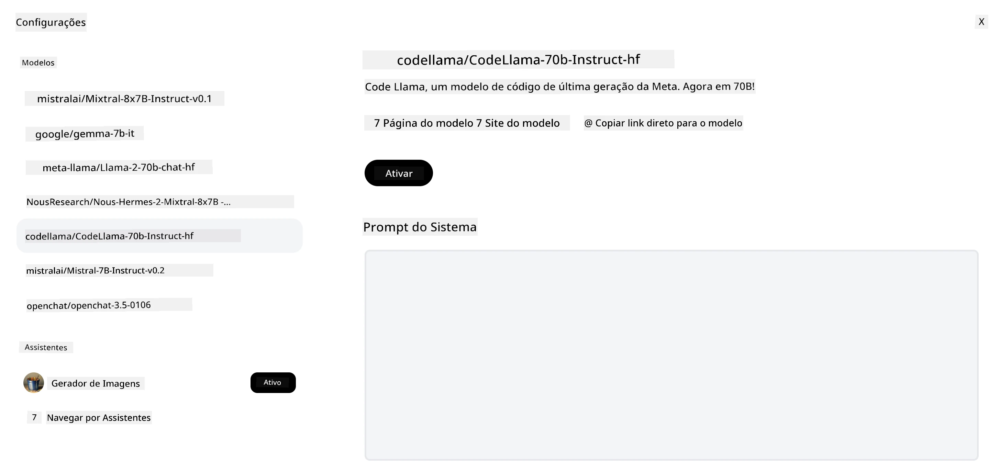
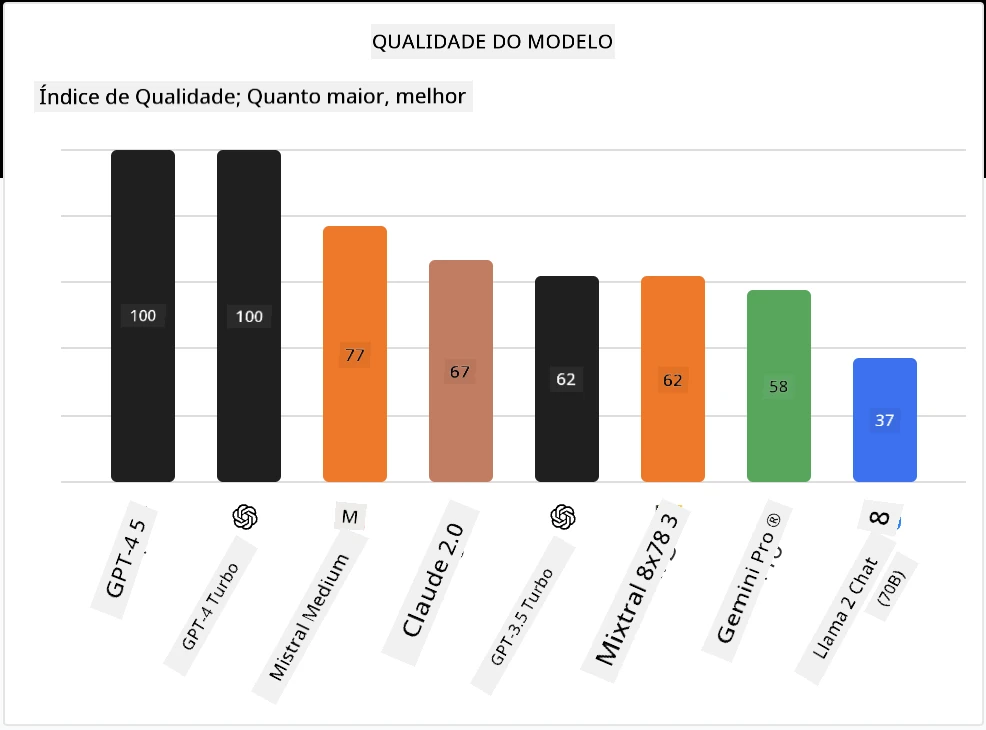

## Introdução

O mundo dos LLMs open source é empolgante e está em constante evolução. Esta lição tem como objetivo fornecer uma visão detalhada sobre modelos open source. Se você está procurando informações sobre como modelos proprietários se comparam aos modelos open source, vá para a [lição "Explorando e Comparando Diferentes LLMs"](../02-exploring-and-comparing-different-llms/README.md?WT.mc_id=academic-105485-koreyst). Esta lição também abordará o tema do fine-tuning, mas uma explicação mais detalhada pode ser encontrada na [lição "Fine-Tuning LLMs"](../18-fine-tuning/README.md?WT.mc_id=academic-105485-koreyst).

## Objetivos de aprendizagem

- Obter uma compreensão dos Modelos open source
- Entender os benefícios de trabalhar com Modelos open source
- Explorar os modelos open disponíveis no Hugging Face e no catálogo de modelos Microsoft Foundry

## O que são Modelos Open Source?

O software open source desempenhou um papel crucial no crescimento da tecnologia em vários campos. A Open Source Initiative (OSI) definiu [10 critérios para software](https://web.archive.org/web/20241126001143/https://opensource.org/osd?WT.mc_id=academic-105485-koreyst) ser classificado como open source. O código-fonte deve ser compartilhado abertamente sob uma licença aprovada pela OSI.

Embora o desenvolvimento de LLMs tenha elementos similares ao desenvolvimento de software, o processo não é exatamente o mesmo. Isso gerou muita discussão na comunidade sobre a definição de open source no contexto dos LLMs. Para que um modelo esteja alinhado com a definição tradicional de open source, as seguintes informações devem estar publicamente disponíveis:

- Conjuntos de dados usados para treinar o modelo.
- Pesos completos do modelo como parte do treinamento.
- O código de avaliação.
- O código de fine-tuning.
- Pesos completos do modelo e métricas de treinamento.

Atualmente, existem apenas alguns modelos que atendem a esses critérios. O [modelo OLMo criado pelo Allen Institute for Artificial Intelligence (AllenAI)](https://huggingface.co/allenai/OLMo-7B?WT.mc_id=academic-105485-koreyst) é um que se encaixa nessa categoria.

Para esta lição, nos referiremos aos modelos como "modelos abertos" daqui pra frente, pois eles podem não atender aos critérios acima no momento da escrita.

## Benefícios dos Modelos Abertos

**Altamente Personalizáveis** - Como modelos abertos são lançados com informações detalhadas de treinamento, pesquisadores e desenvolvedores podem modificar os internos do modelo. Isso permite a criação de modelos altamente especializados que são ajustados para uma tarefa ou área de estudo específica. Alguns exemplos disso são geração de código, operações matemáticas e biologia.

**Custo** - O custo por token para usar e implantar esses modelos é menor do que o de modelos proprietários. Ao construir aplicações de IA Generativa, é importante avaliar a relação desempenho versus preço ao trabalhar com esses modelos no seu caso de uso.

Fonte: Artificial Analysis

**Flexibilidade** - Trabalhar com modelos abertos permite que você seja flexível em termos de usar diferentes modelos ou combiná-los. Um exemplo disso são os [Assistentes HuggingChat](https://huggingface.co/chat?WT.mc_id=academic-105485-koreyst), onde o usuário pode selecionar o modelo sendo usado diretamente na interface do usuário:

## Explorando Diferentes Modelos Abertos

### Llama 2

[LLama2](https://huggingface.co/meta-llama?WT.mc_id=academic-105485-koreyst), desenvolvido pela Meta, é um modelo aberto otimizado para aplicações baseadas em chat. Isso se deve ao seu método de fine-tuning, que incluiu uma grande quantidade de diálogos e feedback humano. Com esse método, o modelo produz mais resultados alinhados às expectativas humanas, proporcionando uma melhor experiência ao usuário.

Alguns exemplos de versões afinadas do Llama incluem o [Japanese Llama](https://huggingface.co/elyza/ELYZA-japanese-Llama-2-7b?WT.mc_id=academic-105485-koreyst), que é especializado em japonês, e o [Llama Pro](https://huggingface.co/TencentARC/LLaMA-Pro-8B?WT.mc_id=academic-105485-koreyst), que é uma versão aprimorada do modelo base.

### Mistral

[Mistral](https://huggingface.co/mistralai?WT.mc_id=academic-105485-koreyst) é um modelo aberto com forte foco em alto desempenho e eficiência. Ele usa a abordagem Mixture-of-Experts que combina um grupo de modelos especialistas especializados em um sistema onde, dependendo da entrada, certos modelos são selecionados para uso. Isso torna o cálculo mais eficaz, pois os modelos lidam apenas com as entradas em que são especializados.

Alguns exemplos de versões afinadas do Mistral incluem o [BioMistral](https://huggingface.co/BioMistral/BioMistral-7B?text=Mon+nom+est+Thomas+et+mon+principal?WT.mc_id=academic-105485-koreyst), focado no domínio médico, e o [OpenMath Mistral](https://huggingface.co/nvidia/OpenMath-Mistral-7B-v0.1-hf?WT.mc_id=academic-105485-koreyst), que realiza cálculos matemáticos.

### Falcon

[Falcon](https://huggingface.co/tiiuae?WT.mc_id=academic-105485-koreyst) é um LLM criado pelo Technology Innovation Institute (**TII**). O Falcon-40B foi treinado com 40 bilhões de parâmetros, mostrando desempenho melhor que o GPT-3 com menor orçamento de computação. Isso se deve ao uso do algoritmo FlashAttention e atenção multiquery, que reduzem os requisitos de memória na inferência. Com esse tempo de inferência reduzido, o Falcon-40B é adequado para aplicações de chat.

Alguns exemplos de versões afinadas do Falcon são o [OpenAssistant](https://huggingface.co/OpenAssistant/falcon-40b-sft-top1-560?WT.mc_id=academic-105485-koreyst), um assistente construído com modelos abertos, e o [GPT4ALL](https://huggingface.co/nomic-ai/gpt4all-falcon?WT.mc_id=academic-105485-koreyst), que oferece desempenho superior ao modelo base.

## Como Escolher

Não há uma única resposta para escolher um modelo aberto. Um bom ponto de partida é usar o recurso filtrar por tarefa no catálogo de modelos Microsoft Foundry. Isso ajudará a entender para quais tipos de tarefas o modelo foi treinado. O Hugging Face também mantém um Ranking LLM que mostra os modelos com melhor desempenho baseado em certas métricas.

Ao buscar comparar LLMs dos diferentes tipos, [Artificial Analysis](https://artificialanalysis.ai/?WT.mc_id=academic-105485-koreyst) é outro ótimo recurso:

Fonte: Artificial Analysis

Se estiver trabalhando em um caso de uso específico, buscar versões afinadas que estejam focadas na mesma área pode ser eficaz. Experimentar múltiplos modelos abertos para ver como eles se desempenham de acordo com suas expectativas e as dos seus usuários é outra boa prática.

## Próximos Passos

A melhor parte dos modelos abertos é que você pode começar a trabalhar com eles rapidamente. Confira o [catálogo de modelos Microsoft Foundry](https://ai.azure.com?WT.mc_id=academic-105485-koreyst), que apresenta uma coleção específica do Hugging Face com esses modelos que discutimos aqui.

## O aprendizado não para aqui, continue a Jornada

Após completar esta lição, confira nossa [coleção de Aprendizado de IA Generativa](https://aka.ms/genai-collection?WT.mc_id=academic-105485-koreyst) para continuar aprimorando seu conhecimento em IA Generativa!

---

<!-- CO-OP TRANSLATOR DISCLAIMER START -->
**Aviso Legal**:
Este documento foi traduzido usando o serviço de tradução por IA [Co-op Translator](https://github.com/Azure/co-op-translator). Embora nos esforcemos pela precisão, por favor, esteja ciente de que traduções automatizadas podem conter erros ou imprecisões. O documento original em seu idioma nativo deve ser considerado a fonte autorizada. Para informações críticas, recomenda-se tradução profissional humana. Não nos responsabilizamos por quaisquer mal-entendidos ou interpretações incorretas decorrentes do uso desta tradução.
<!-- CO-OP TRANSLATOR DISCLAIMER END -->