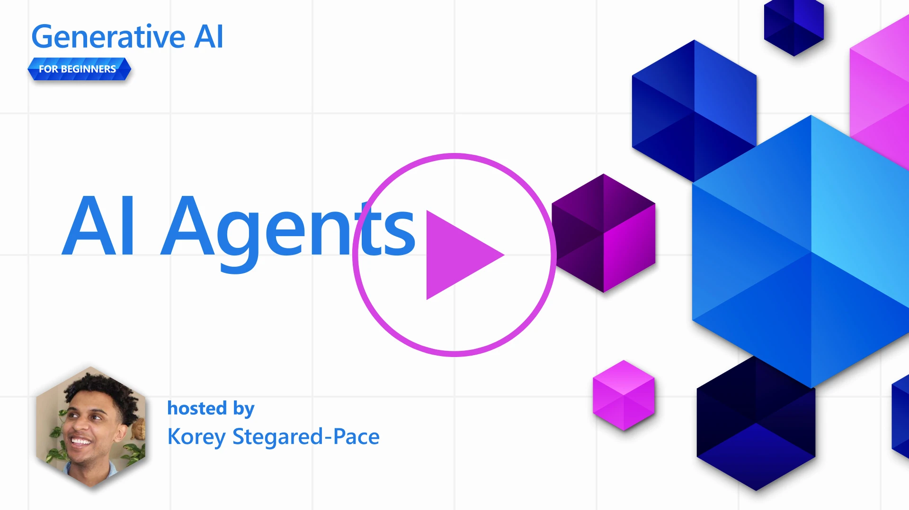
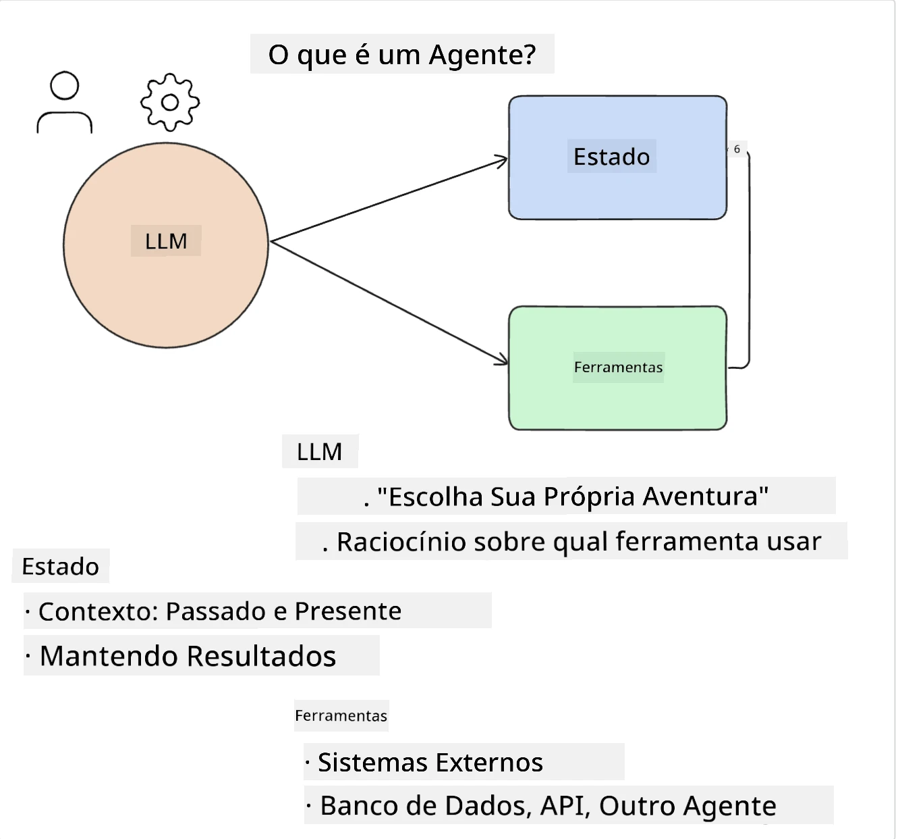
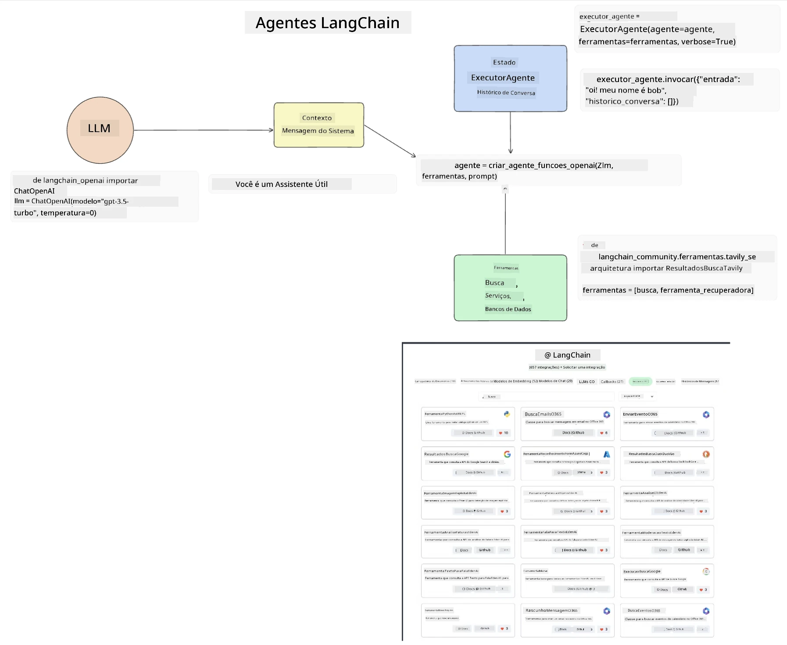
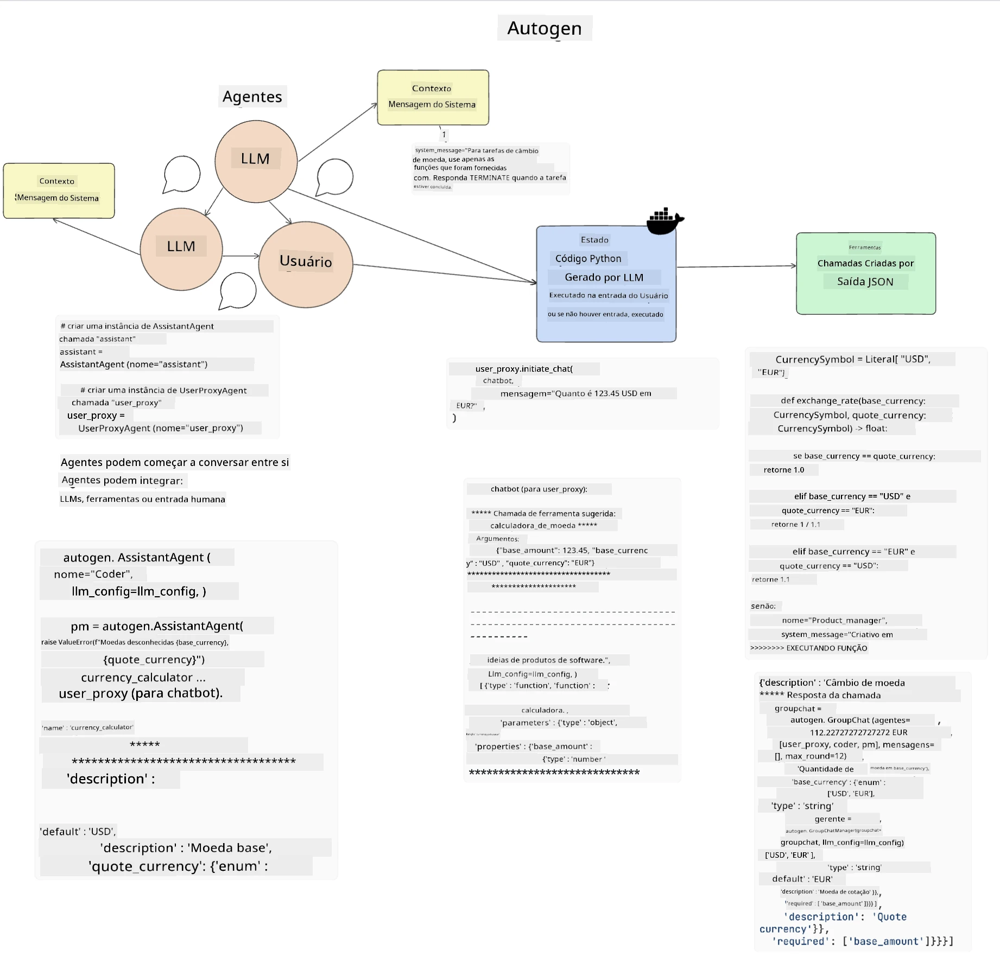
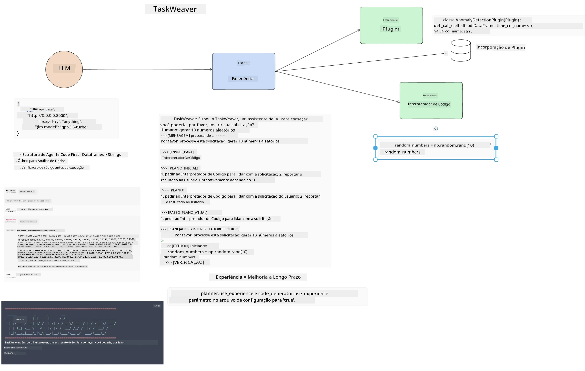
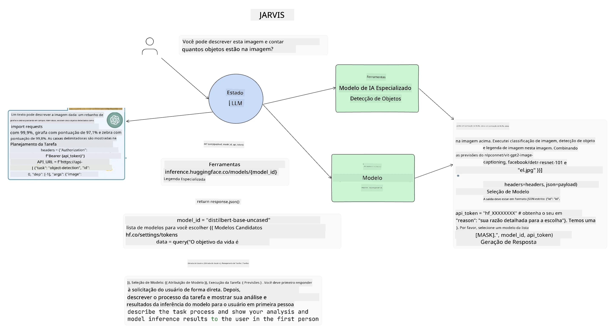

[](https://youtu.be/yAXVW-lUINc?si=bOtW9nL6jc3XJgOM)

## Introdução

Agentes de IA representam um desenvolvimento empolgante na IA Generativa, permitindo que Grandes Modelos de Linguagem (LLMs) evoluam de assistentes para agentes capazes de tomar ações. Frameworks de Agentes de IA permitem que desenvolvedores criem aplicações que dão aos LLMs acesso a ferramentas e gerenciamento de estado. Esses frameworks também aumentam a visibilidade, permitindo que usuários e desenvolvedores monitorem as ações planejadas pelos LLMs, melhorando assim o gerenciamento da experiência.

A lição cobrirá as seguintes áreas:

- Entendendo o que é um Agente de IA - O que exatamente é um Agente de IA?
- Explorando quatro diferentes Frameworks de Agentes de IA - O que os torna únicos?
- Aplicando esses Agentes de IA a diferentes casos de uso - Quando devemos usar Agentes de IA?

## Objetivos de aprendizado

Após esta lição, você poderá:

- Explicar o que são Agentes de IA e como eles podem ser usados.
- Ter uma compreensão das diferenças entre alguns dos Frameworks populares de Agentes de IA, e como eles diferem.
- Entender como Agentes de IA funcionam para construir aplicações com eles.

## O que são Agentes de IA?

Agentes de IA são um campo muito empolgante no mundo da IA Generativa. Com essa empolgação, às vezes surge uma confusão quanto aos termos e suas aplicações. Para simplificar e incluir a maioria das ferramentas que se referem a Agentes de IA, vamos usar esta definição:

Agentes de IA permitem que Grandes Modelos de Linguagem (LLMs) realizem tarefas dando-lhes acesso a um **estado** e **ferramentas**.



Vamos definir esses termos:

**Grandes Modelos de Linguagem** - São os modelos referidos ao longo deste curso, como GPT-3.5, GPT-4, Llama-2, etc.

**Estado** - Refere-se ao contexto no qual o LLM está trabalhando. O LLM usa o contexto de suas ações passadas e o contexto atual, orientando sua tomada de decisão para ações subsequentes. Frameworks de Agentes de IA permitem aos desenvolvedores manter esse contexto mais facilmente.

**Ferramentas** - Para completar a tarefa solicitada pelo usuário e que o LLM planejou, o LLM precisa de acesso a ferramentas. Alguns exemplos de ferramentas podem ser um banco de dados, uma API, uma aplicação externa ou até outro LLM!

Essas definições deverão lhe dar uma boa base daqui para frente ao olharmos como eles são implementados. Vamos explorar alguns frameworks diferentes de Agentes de IA:

## Agentes LangChain

[Agentes LangChain](https://python.langchain.com/docs/how_to/#agents?WT.mc_id=academic-105485-koreyst) é uma implementação das definições que fornecemos acima.

Para gerenciar o **estado**, ele usa uma função interna chamada `AgentExecutor`. Esta aceita o `agent` definido e as `tools` que estão disponíveis a ele.

O `Agent Executor` também armazena o histórico do chat para fornecer o contexto da conversa.



LangChain oferece um [catálogo de ferramentas](https://integrations.langchain.com/tools?WT.mc_id=academic-105485-koreyst) que podem ser importadas para sua aplicação e às quais o LLM pode acessar. Essas ferramentas são feitas pela comunidade e pela equipe LangChain.

Você então pode definir essas ferramentas e passá-las para o `Agent Executor`.

Visibilidade é outro aspecto importante ao falar de Agentes de IA. É importante que os desenvolvedores de aplicações entendam qual ferramenta o LLM está usando e por quê... Para isso, a equipe da LangChain desenvolveu o LangSmith.

## AutoGen

O próximo framework de Agente de IA que vamos discutir é o [AutoGen](https://microsoft.github.io/autogen/?WT.mc_id=academic-105485-koreyst). O foco principal do AutoGen é a conversação. Agentes são tanto **conversáveis** quanto **personalizáveis**.

**Conversável -** LLMs podem iniciar e continuar uma conversa com outro LLM para completar uma tarefa. Isso é feito criando `AssistantAgents` e dando a eles uma mensagem de sistema específica.

```python

autogen.AssistantAgent( name="Coder", llm_config=llm_config, ) pm = autogen.AssistantAgent( name="Product_manager", system_message="Creative in software product ideas.", llm_config=llm_config, )

```

**Personalizável** - Agentes podem ser definidos não apenas como LLMs, mas também como um usuário ou uma ferramenta. Como desenvolvedor, você pode definir um `UserProxyAgent` que é responsável por interagir com o usuário para feedback no cumprimento de uma tarefa. Esse feedback pode continuar a execução da tarefa ou pará-la.

```python
user_proxy = UserProxyAgent(name="user_proxy")
```

### Estado e Ferramentas

Para alterar e gerenciar o estado, um Agente assistente gera código Python para completar a tarefa.

Aqui está um exemplo do processo:



#### LLM Definido com uma Mensagem de Sistema

```python
system_message="For weather related tasks, only use the functions you have been provided with. Reply TERMINATE when the task is done."
```

Essa mensagem do sistema direciona este LLM específico para quais funções são relevantes para sua tarefa. Lembre-se, com o AutoGen você pode ter múltiplos AssistantAgents definidos com diferentes mensagens de sistema.

#### O Chat é Iniciado pelo Usuário

```python
user_proxy.initiate_chat( chatbot, message="I am planning a trip to NYC next week, can you help me pick out what to wear? ", )

```

Essa mensagem do user_proxy (Humano) é o que iniciará o processo do Agente para explorar as possíveis funções que ele deve executar.

#### Função é Executada

```bash
chatbot (to user_proxy):

***** Suggested tool Call: get_weather ***** Arguments: {"location":"New York City, NY","time_periond:"7","temperature_unit":"Celsius"} ******************************************************** --------------------------------------------------------------------------------

>>>>>>>> EXECUTING FUNCTION get_weather... user_proxy (to chatbot): ***** Response from calling function "get_weather" ***** 112.22727272727272 EUR ****************************************************************

```

Uma vez que o chat inicial é processado, o Agente irá enviar a sugestão de ferramenta para chamar. Neste caso, é uma função chamada `get_weather`. Dependendo da sua configuração, essa função pode ser executada automaticamente e lida pelo Agente ou pode ser executada com base na entrada do usuário.

Você pode encontrar uma lista de [exemplos de código do AutoGen](https://microsoft.github.io/autogen/docs/Examples/?WT.mc_id=academic-105485-koreyst) para explorar ainda mais como começar a construir.

## Taskweaver

O próximo framework de agente que vamos explorar é o [Taskweaver](https://microsoft.github.io/TaskWeaver/?WT.mc_id=academic-105485-koreyst). É conhecido como um agente "code-first" porque ao invés de trabalhar estritamente com `strings`, ele pode trabalhar com DataFrames em Python. Isso se torna extremamente útil para tarefas de análise e geração de dados. Isso pode ser coisas como criar gráficos e tabelas ou gerar números aleatórios.

### Estado e Ferramentas

Para gerenciar o estado da conversa, TaskWeaver usa o conceito de um `Planner`. O `Planner` é um LLM que recebe a solicitação dos usuários e mapeia as tarefas que precisam ser completadas para cumprir essa solicitação.

Para completar as tarefas, o `Planner` tem acesso a uma coleção de ferramentas chamadas `Plugins`. Isso pode ser classes Python ou um interpretador geral de código. Esses plugins são armazenados como embeddings para que o LLM possa buscar melhor o plugin correto.



Aqui está um exemplo de um plugin para lidar com detecção de anomalias:

```python
class AnomalyDetectionPlugin(Plugin): def __call__(self, df: pd.DataFrame, time_col_name: str, value_col_name: str):
```

O código é verificado antes da execução. Outra funcionalidade para gerenciar contexto no Taskweaver é a `experience`. Experiência permite que o contexto de uma conversa seja armazenado a longo prazo em um arquivo YAML. Isso pode ser configurado para que o LLM melhore ao longo do tempo em certas tarefas desde que esteja exposto a conversas anteriores.

## JARVIS

O último framework de agente que exploraremos é o [JARVIS](https://github.com/microsoft/JARVIS?tab=readme-ov-file&WT.mc_id=academic-105485-koreyst). O que torna o JARVIS único é que ele utiliza um LLM para gerir o `estado` da conversa e as `ferramentas` são outros modelos de IA. Cada um dos modelos de IA são modelos especializados que realizam certas tarefas como detecção de objetos, transcrição ou legenda de imagens.



O LLM, sendo um modelo de uso geral, recebe a solicitação do usuário e identifica a tarefa específica e quaisquer argumentos/dados necessários para completar a tarefa.

```python
[{"task": "object-detection", "id": 0, "dep": [-1], "args": {"image": "e1.jpg" }}]
```

O LLM então formata a solicitação de uma maneira que o modelo de IA especializado possa interpretar, como JSON. Uma vez que o modelo de IA retornou sua previsão baseada na tarefa, o LLM recebe a resposta.

Se múltiplos modelos forem necessários para completar a tarefa, ele também interpretará a resposta desses modelos antes de juntá-las para gerar a resposta ao usuário.

O exemplo abaixo mostra como isso funcionaria quando um usuário está solicitando uma descrição e contagem dos objetos em uma imagem:

## Tarefa

Para continuar seu aprendizado sobre Agentes de IA você pode construir com o AutoGen:

- Uma aplicação que simula uma reunião de negócios com diferentes departamentos de uma startup de educação.
- Criar mensagens de sistema que guiem os LLMs na compreensão de diferentes personas e prioridades, e permitir que o usuário apresente uma nova ideia de produto.
- O LLM deve então gerar perguntas de acompanhamento de cada departamento para refinar e melhorar a apresentação e a ideia do produto.

## O aprendizado não para aqui, continue a Jornada

Após completar esta lição, confira nossa [coleção de aprendizado em IA Generativa](https://aka.ms/genai-collection?WT.mc_id=academic-105485-koreyst) para continuar aprimorando seu conhecimento em IA Generativa!

---

<!-- CO-OP TRANSLATOR DISCLAIMER START -->
**Aviso Legal**:  
Este documento foi traduzido utilizando o serviço de tradução por IA [Co-op Translator](https://github.com/Azure/co-op-translator). Embora nos esforcemos para garantir a precisão, esteja ciente de que traduções automáticas podem conter erros ou imprecisões. O documento original em seu idioma nativo deve ser considerado a fonte autorizada. Para informações críticas, recomenda-se a tradução profissional realizada por humanos. Não nos responsabilizamos por quaisquer mal-entendidos ou interpretações incorretas decorrentes do uso desta tradução.
<!-- CO-OP TRANSLATOR DISCLAIMER END -->