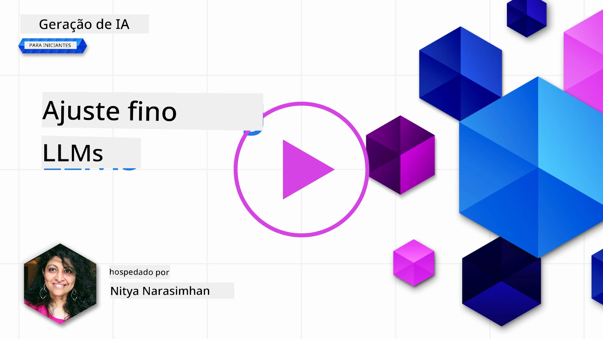
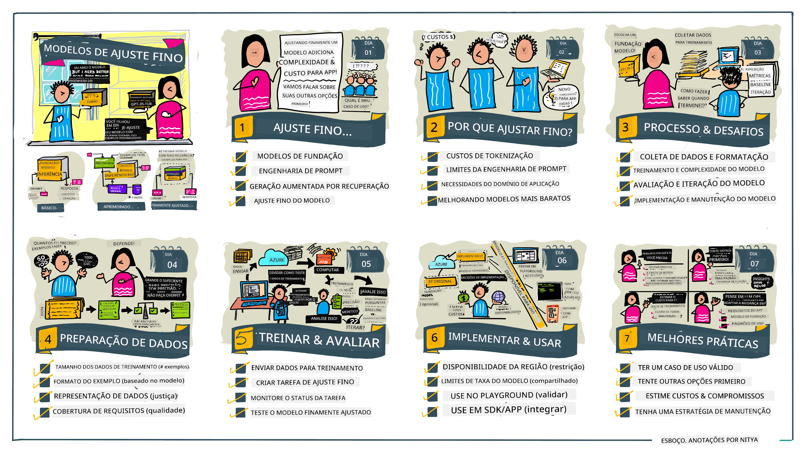

# Ajustando Seu LLM

Usar grandes modelos de linguagem para construir aplicações de IA generativa traz novos desafios. Uma questão chave é garantir a qualidade da resposta (precisão e relevância) no conteúdo gerado pelo modelo para uma solicitação do usuário. Em lições anteriores, discutimos técnicas como engenharia de prompt e geração aumentada por recuperação que tentam resolver o problema _modificando o prompt de entrada_ para o modelo existente.

Na lição de hoje, discutimos uma terceira técnica, **ajuste fino**, que tenta enfrentar o desafio _re-treinando o próprio modelo_ com dados adicionais. Vamos mergulhar nos detalhes.

## Objetivos de Aprendizagem

Esta lição introduz o conceito de ajuste fino para modelos de linguagem pré-treinados, explora os benefícios e desafios dessa abordagem e fornece orientações sobre quando e como usar o ajuste fino para melhorar o desempenho dos seus modelos de IA generativa.

Ao final desta lição, você deverá ser capaz de responder às seguintes perguntas:

- O que é ajuste fino para modelos de linguagem?
- Quando e por que o ajuste fino é útil?
- Como posso ajustar um modelo pré-treinado?
- Quais são as limitações do ajuste fino?

Pronto? Vamos começar.

## Guia Ilustrado

Quer obter uma visão geral do que vamos cobrir antes de mergulhar? Confira este guia ilustrado que descreve a jornada de aprendizagem para esta lição - desde aprender os conceitos principais e a motivação para o ajuste fino, até entender o processo e as melhores práticas para executar a tarefa de ajuste fino. Este é um tópico fascinante para explorar, então não se esqueça de visitar a página de [Recursos](./RESOURCES.md?WT.mc_id=academic-105485-koreyst) para links adicionais que apoiam sua jornada de aprendizado autoguiado!

## O que é ajuste fino para modelos de linguagem?

Por definição, grandes modelos de linguagem são _pré-treinados_ com grandes quantidades de texto provenientes de diversas fontes, incluindo a internet. Como aprendemos em lições anteriores, precisamos de técnicas como _engenharia de prompt_ e _geração aumentada por recuperação_ para melhorar a qualidade das respostas do modelo às perguntas do usuário ("prompts").

Uma técnica popular de engenharia de prompt envolve dar ao modelo mais orientação sobre o que se espera na resposta, seja fornecendo _instruções_ (orientação explícita) ou _dando alguns exemplos_ (orientação implícita). Isso é referido como _aprendizado few-shot_ mas possui duas limitações:

- Os limites de tokens do modelo podem restringir o número de exemplos que você pode fornecer, limitando a eficácia.
- Os custos de tokens do modelo podem tornar caro adicionar exemplos a cada prompt, limitando a flexibilidade.

Ajuste fino é uma prática comum em sistemas de aprendizado de máquina onde pegamos um modelo pré-treinado e o re-treinamos com novos dados para melhorar seu desempenho em uma tarefa específica. No contexto de modelos de linguagem, podemos ajustar o modelo pré-treinado _com um conjunto selecionado de exemplos para uma tarefa ou domínio específico_ para criar um **modelo personalizado** que pode ser mais preciso e relevante para essa tarefa ou domínio específico. Um benefício adicional do ajuste fino é que ele também pode reduzir o número de exemplos necessários para aprendizado few-shot - reduzindo o uso de tokens e custos relacionados.

## Quando e por que devemos ajustar modelos?

Neste _contexto_, quando falamos de ajuste fino, estamos nos referindo ao ajuste fino **supervisionado**, onde o re-treinamento é feito **adicionando novos dados** que não faziam parte do conjunto original de treinamento. Isso é diferente de uma abordagem não supervisionada, onde o modelo é re-treinado nos dados originais, porém com diferentes hiperparâmetros.

O ponto chave a lembrar é que o ajuste fino é uma técnica avançada que requer um certo nível de expertise para obter os resultados desejados. Se feito incorretamente, pode não trazer as melhorias esperadas, e até prejudicar o desempenho do modelo para seu domínio alvo.

Portanto, antes de aprender "como" ajustar modelos de linguagem, você precisa saber "por que" seguir esse caminho, e "quando" iniciar o processo de ajuste fino. Comece fazendo a si mesmo estas perguntas:

- **Caso de Uso**: Qual é seu _caso de uso_ para o ajuste fino? Qual aspecto do modelo pré-treinado atual você deseja melhorar?
- **Alternativas**: Você já tentou _outras técnicas_ para alcançar os resultados desejados? Use-as para criar uma linha de base para comparação.
  - Engenharia de prompt: Experimente técnicas como few-shot prompting com exemplos de respostas relevantes. Avalie a qualidade das respostas.
  - Geração Aumentada por Recuperação: Tente aumentar os prompts com resultados de busca da sua base de dados. Avalie a qualidade das respostas.
- **Custos**: Você identificou os custos para ajuste fino?
  - Possibilidade de ajuste - o modelo pré-treinado está disponível para ajuste fino?
  - Esforço - para preparar dados de treinamento, avaliar e refinar o modelo.
  - Computação - para executar jobs de ajuste fino e implantar o modelo ajustado.
  - Dados - acesso a exemplos de qualidade suficiente para impacto do ajuste fino.
- **Benefícios**: Você confirmou os benefícios do ajuste fino?
  - Qualidade - o modelo ajustado superou a linha de base?
  - Custo - ele reduz o uso de tokens simplificando prompts?
  - Extensibilidade - você pode reutilizar o modelo base para novos domínios?

Respondendo a essas perguntas, você deve ser capaz de decidir se o ajuste fino é a abordagem correta para seu caso de uso. Idealmente, a abordagem é válida apenas se os benefícios superarem os custos. Uma vez decidido seguir, é hora de pensar _como_ ajustar o modelo pré-treinado.

Quer mais insights sobre o processo de decisão? Assista [To fine-tune or not to fine-tune](https://www.youtube.com/watch?v=0Jo-z-MFxJs)

## Como podemos ajustar um modelo pré-treinado?

Para ajustar um modelo pré-treinado, você precisa ter:

- um modelo pré-treinado para ajustar
- um conjunto de dados para usar no ajuste fino
- um ambiente de treinamento para executar o trabalho de ajuste fino
- um ambiente de hospedagem para implantar o modelo ajustado

## Ajuste Fino em Ação

Os recursos a seguir oferecem tutoriais passo a passo para guiá-lo em um exemplo real usando um modelo selecionado com um conjunto de dados curado. Para executar esses tutoriais, você precisa de uma conta no provedor específico, junto com acesso ao modelo e aos conjuntos de dados relevantes.

| Provedor    | Tutorial                                                                                                                                                                     | Descrição                                                                                                                                                                                                                                                                                                                                                                                                                         |
| ----------- | ---------------------------------------------------------------------------------------------------------------------------------------------------------------------------- | --------------------------------------------------------------------------------------------------------------------------------------------------------------------------------------------------------------------------------------------------------------------------------------------------------------------------------------------------------------------------------------------------------------------------------- |
| OpenAI      | [Como ajustar modelos de chat](https://github.com/openai/openai-cookbook/blob/main/examples/How_to_finetune_chat_models.ipynb?WT.mc_id=academic-105485-koreyst)               | Aprenda a ajustar um `gpt-35-turbo` para um domínio específico ("assistente de receitas") preparando dados de treinamento, executando o trabalho de ajuste fino e usando o modelo ajustado para inferência.                                                                                                                                                                                                                        |
| Azure OpenAI| [Tutorial de ajuste fino GPT 3.5 Turbo](https://learn.microsoft.com/azure/ai-services/openai/tutorials/fine-tune?tabs=python-new%2Ccommand-line&WT.mc_id=academic-105485-koreyst) | Aprenda a ajustar um modelo `gpt-35-turbo-0613` **no Azure** seguindo os passos para criar e enviar dados de treinamento, executar o trabalho de ajuste fino. Implantar e usar o novo modelo.                                                                                                                                                                                                                                     |
| Hugging Face| [Ajustando LLMs com Hugging Face](https://www.philschmid.de/fine-tune-llms-in-2024-with-trl?WT.mc_id=academic-105485-koreyst)                                               | Este post no blog ensina a ajustar um _LLM aberto_ (ex: `CodeLlama 7B`) usando a biblioteca [transformers](https://huggingface.co/docs/transformers/index?WT.mc_id=academic-105485-koreyst) & [Transformer Reinforcement Learning (TRL)](https://huggingface.co/docs/trl/index?WT.mc_id=academic-105485-koreyst) com [datasets](https://huggingface.co/docs/datasets/index?WT.mc_id=academic-105485-koreyst) abertos no Hugging Face. |
|             |                                                                                                                                                                              |                                                                                                                                                                                                                                                                                                                                                                                                                                   |
| 🤗 AutoTrain| [Ajustando LLMs com AutoTrain](https://github.com/huggingface/autotrain-advanced/?WT.mc_id=academic-105485-koreyst)                                                         | AutoTrain (ou AutoTrain Advanced) é uma biblioteca python desenvolvida pela Hugging Face que permite ajuste fino para diversas tarefas incluindo ajuste de LLMs. AutoTrain é uma solução sem código e o ajuste pode ser feito na sua própria nuvem, em Hugging Face Spaces ou localmente. Suporta tanto GUI web, CLI e treinamento via arquivos de configuração yaml.                                                                                             |
|             |                                                                                                                                                                              |                                                                                                                                                                                                                                                                                                                                                                                                                                   |
| 🦥 Unsloth  | [Ajustando LLMs com Unsloth](https://github.com/unslothai/unsloth)                                                                                                         | Unsloth é um framework open-source que suporta ajuste fino de LLM e aprendizado por reforço (RL). O Unsloth facilita o treinamento local, avaliação e implantação com [notebooks](https://github.com/unslothai/notebooks) prontos para uso. Também suporta texto para fala (TTS), BERT e modelos multimodais. Para começar, leia seu guia passo a passo [Fine-tuning LLMs Guide](https://docs.unsloth.ai/get-started/fine-tuning-llms-guide).                                                                           |
|             |                                                                                                                                                                              |                                                                                                                                                                                                                                                                                                                                                                                                                                   |
## Exercício

Selecione um dos tutoriais acima e acompanhe-o. _Podemos replicar uma versão desses tutoriais em Jupyter Notebooks neste repositório apenas para referência. Por favor, use diretamente as fontes originais para obter as versões mais recentes_.

## Excelente trabalho! Continue seu aprendizado.

Após concluir esta lição, confira nossa [coleção de aprendizado de IA Generativa](https://aka.ms/genai-collection?WT.mc_id=academic-105485-koreyst) para continuar aprimorando seu conhecimento em IA Generativa!

Parabéns!! Você completou a lição final da série v2 deste curso! Não pare de aprender e construir. \*\*Confira a página [RECURSOS](RESOURCES.md?WT.mc_id=academic-105485-koreyst) para uma lista de sugestões adicionais somente para este tópico.

Nossa série de lições v1 também foi atualizada com mais exercícios e conceitos. Então tire um minuto para atualizar seu conhecimento - e por favor [compartilhe suas perguntas e feedback](https://github.com/microsoft/generative-ai-for-beginners/issues?WT.mc_id=academic-105485-koreyst) para nos ajudar a aprimorar essas lições para a comunidade.

---

<!-- CO-OP TRANSLATOR DISCLAIMER START -->
**Aviso Legal**:
Este documento foi traduzido utilizando o serviço de tradução por IA [Co-op Translator](https://github.com/Azure/co-op-translator). Embora nos esforcemos para garantir a precisão, esteja ciente de que traduções automáticas podem conter erros ou imprecisões. O documento original em seu idioma nativo deve ser considerado a fonte autorizada. Para informações críticas, recomenda-se a tradução profissional realizada por um humano. Não nos responsabilizamos por quaisquer mal-entendidos ou interpretações errôneas decorrentes do uso desta tradução.
<!-- CO-OP TRANSLATOR DISCLAIMER END -->