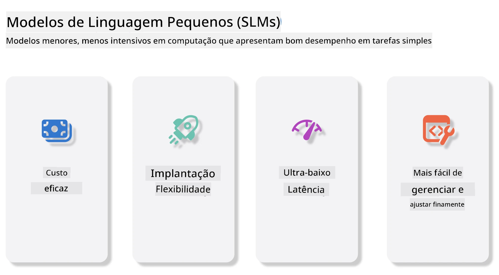
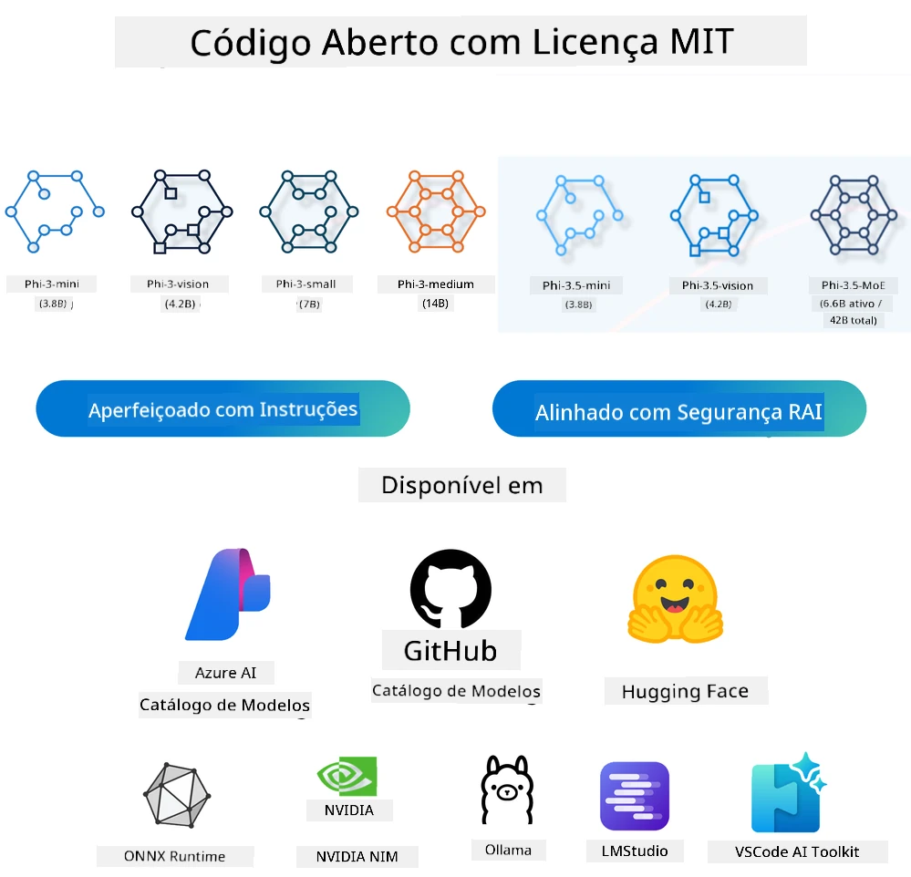
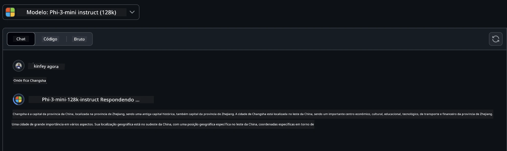
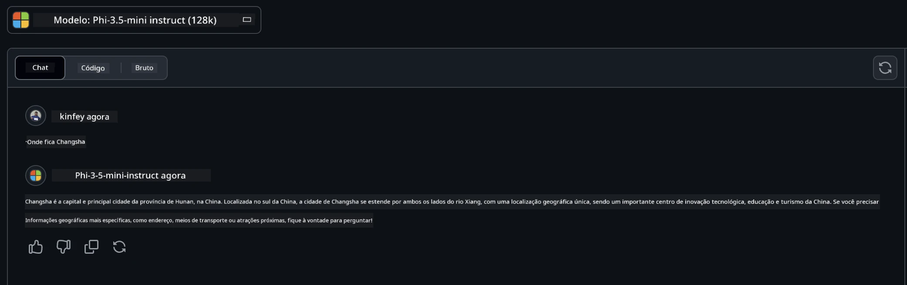

# Introdução aos Pequenos Modelos de Linguagem para IA Generativa para Iniciantes
IA generativa é um campo fascinante da inteligência artificial que se concentra em criar sistemas capazes de gerar novos conteúdos. Esse conteúdo pode variar desde textos e imagens até música e até mesmo ambientes virtuais inteiros. Uma das aplicações mais empolgantes da IA generativa está no domínio dos modelos de linguagem.

## O que são Pequenos Modelos de Linguagem?

Um Pequeno Modelo de Linguagem (SLM) representa uma variante reduzida de um grande modelo de linguagem (LLM), aproveitando muitos dos princípios arquitetônicos e técnicas dos LLMs, enquanto exibe uma pegada computacional significativamente menor.

SLMs são um subconjunto de modelos de linguagem projetados para gerar texto semelhante ao humano. Ao contrário de seus equivalentes maiores, como o GPT-4, os SLMs são mais compactos e eficientes, tornando-os ideais para aplicações onde os recursos computacionais são limitados. Apesar de seu tamanho menor, eles ainda podem executar uma variedade de tarefas. Tipicamente, os SLMs são construídos comprimindo ou destilando LLMs, visando reter uma porção substancial da funcionalidade e das capacidades linguísticas do modelo original. Essa redução no tamanho do modelo diminui a complexidade geral, tornando os SLMs mais eficientes em termos tanto de uso de memória quanto de requisitos computacionais. Apesar dessas otimizações, os SLMs ainda podem realizar uma ampla gama de tarefas de processamento de linguagem natural (PNL):

- Geração de Texto: Criar frases ou parágrafos coerentes e contextualmente relevantes.
- Completação de Texto: Prever e completar sentenças com base em um prompt dado.
- Tradução: Converter texto de uma língua para outra.
- Resumo: Condensar textos longos em resumos mais curtos e digestíveis.

Embora com alguns compromissos em desempenho ou profundidade de compreensão comparados aos seus equivalentes maiores.

## Como funcionam os Pequenos Modelos de Linguagem?
Os SLMs são treinados em vastas quantidades de dados textuais. Durante o treinamento, eles aprendem os padrões e estruturas da linguagem, permitindo que gerem textos que sejam gramaticalmente corretos e contextualmente apropriados. O processo de treinamento envolve:

- Coleta de Dados: Reunir grandes conjuntos de dados textuais de várias fontes.
- Pré-processamento: Limpar e organizar os dados para torná-los adequados ao treinamento.
- Treinamento: Usar algoritmos de aprendizado de máquina para ensinar o modelo a entender e gerar texto.
- Ajuste Fino: Ajustar o modelo para melhorar seu desempenho em tarefas específicas.

O desenvolvimento dos SLMs está alinhado com a crescente necessidade de modelos que possam ser implantados em ambientes com recursos limitados, como dispositivos móveis ou plataformas de computação de borda, onde LLMs em escala total podem ser impraticáveis devido às suas demandas pesadas de recursos. Ao focar na eficiência, os SLMs equilibram desempenho com acessibilidade, permitindo aplicação mais ampla em vários domínios.



## Objetivos de Aprendizagem

Nesta lição, esperamos introduzir o conhecimento sobre SLM e combiná-lo com o Microsoft Phi-3 para aprender diferentes cenários em conteúdo textual, visão e MoE.

Ao final desta lição, você deverá ser capaz de responder às seguintes perguntas:

- O que é SLM?
- Qual a diferença entre SLM e LLM?
- O que é a Família Microsoft Phi-3/3.5?
- Como executar inferência com a Família Microsoft Phi-3/3.5?

Pronto? Vamos começar.

## As distinções entre Grandes Modelos de Linguagem (LLMs) e Pequenos Modelos de Linguagem (SLMs)

Tanto LLMs quanto SLMs são baseados em princípios fundamentais de aprendizado de máquina probabilístico, seguindo abordagens semelhantes em seu design arquitetural, metodologias de treinamento, processos de geração de dados e técnicas de avaliação do modelo. No entanto, vários fatores-chave diferenciam esses dois tipos de modelos.

## Aplicações dos Pequenos Modelos de Linguagem

Os SLMs possuem uma ampla gama de aplicações, incluindo:

- Chatbots: Fornecer suporte ao cliente e interagir com usuários de forma conversacional.
- Criação de Conteúdo: Auxiliar escritores gerando ideias ou até mesmo redigindo artigos inteiros.
- Educação: Ajudar estudantes em tarefas de escrita ou no aprendizado de novos idiomas.
- Acessibilidade: Criar ferramentas para pessoas com deficiências, como sistemas de texto para fala.

**Tamanho**

Uma distinção principal entre LLMs e SLMs está na escala dos modelos. LLMs, como o ChatGPT (GPT-4), podem ter aproximadamente 1,76 trilhão de parâmetros, enquanto SLMs open-source como o Mistral 7B são projetados com significativamente menos parâmetros — aproximadamente 7 bilhões. Essa disparidade deve-se principalmente a diferenças na arquitetura do modelo e nos processos de treinamento. Por exemplo, o ChatGPT emprega um mecanismo de autoatenção dentro de uma estrutura encoder-decoder, enquanto o Mistral 7B utiliza atenção em janela deslizante, o que permite um treinamento mais eficiente dentro de um modelo exclusivamente decoder. Essa variação arquitetônica tem implicações profundas na complexidade e desempenho desses modelos.

**Compreensão**

SLMs são tipicamente otimizados para desempenho em domínios específicos, tornando-os altamente especializados, porém potencialmente limitados na sua capacidade de fornecer uma compreensão contextual ampla através de diversos campos do conhecimento. Em contraste, LLMs visam simular a inteligência humana em um nível mais abrangente. Treinados em vastos e diversos conjuntos de dados, os LLMs são projetados para desempenhar bem em variados domínios, oferecendo maior versatilidade e adaptabilidade. Consequentemente, LLMs são mais adequados para uma gama maior de tarefas subsequentes, como processamento de linguagem natural e programação.

**Computação**

O treinamento e a implantação de LLMs são processos que demandam muitos recursos, frequentemente exigindo infraestrutura computacional significativa, incluindo grandes clusters de GPUs. Por exemplo, treinar um modelo como o ChatGPT do zero pode necessitar de milhares de GPUs por longos períodos. Em contraste, SLMs, com suas menores contagens de parâmetros, são mais acessíveis em termos de recursos computacionais. Modelos como o Mistral 7B podem ser treinados e executados em máquinas locais equipadas com GPUs moderadas, embora o treinamento ainda exija várias horas em múltiplas GPUs.

**Viés**

O viés é um problema conhecido nos LLMs, principalmente devido à natureza dos dados usados no treinamento. Esses modelos frequentemente dependem de dados brutos e disponíveis abertamente na internet, que podem sub-representar ou representar incorretamente certos grupos, introduzir rotulagens errôneas ou refletir vieses linguísticos influenciados por dialetos, variações geográficas e regras gramaticais. Além disso, a complexidade das arquiteturas LLM pode inadvertidamente exacerbar o viés, o que pode passar despercebido sem um delicado ajuste fino. Por outro lado, os SLMs, treinados em conjuntos de dados mais restritos e específicos de domínio, são inerentemente menos suscetíveis a tais vieses, embora não sejam imunes a eles.

**Inferência**

O tamanho reduzido dos SLMs lhes concede uma vantagem significativa em termos de velocidade de inferência, permitindo gerar saídas de forma eficiente em hardware local, sem a necessidade de processamento paralelo intenso. Em contraste, LLMs, devido ao seu tamanho e complexidade, frequentemente requerem recursos computacionais paralelos substanciais para alcançar tempos aceitáveis de inferência. A presença de múltiplos usuários concorrentes ainda desacelera os tempos de resposta dos LLMs, especialmente quando implantados em larga escala.

Em resumo, embora ambos LLMs e SLMs compartilhem uma base fundamental em aprendizado de máquina, eles diferem significativamente em termos de tamanho do modelo, requisitos de recursos, entendimento contextual, suscetibilidade a vieses e velocidade de inferência. Essas distinções refletem suas respectivas adequações para diferentes casos de uso, sendo que LLMs são mais versáteis porém demandam muitos recursos, e SLMs oferecem maior eficiência específica por domínio com menores demandas computacionais.

***Nota: Nesta lição, apresentaremos o SLM usando o Microsoft Phi-3 / 3.5 como exemplo.***

## Apresentando a Família Phi-3 / Phi-3.5

A Família Phi-3 / 3.5 tem como foco principal os cenários de aplicação em texto, visão e Agentes (MoE):

### Phi-3 / 3.5 Instruct

Principalmente para geração de texto, finalização de conversas e extração de informações de conteúdo, entre outros.

**Phi-3-mini**

O modelo de linguagem de 3,8 bilhões está disponível no Microsoft Azure AI Studio, Hugging Face e Ollama. Os modelos Phi-3 superam significativamente modelos de linguagem de tamanhos iguais e maiores em benchmarks chave (veja os números dos benchmarks abaixo, números maiores são melhores). O Phi-3-mini supera modelos com o dobro do seu tamanho, enquanto Phi-3-small e Phi-3-medium superam modelos maiores, incluindo GPT-3.5.

**Phi-3-small & medium**

Com apenas 7 bilhões de parâmetros, o Phi-3-small supera o GPT-3.5T em diversas provas de linguagem, raciocínio, codificação e matemática.

O Phi-3-medium com 14 bilhões de parâmetros continua essa tendência e supera o Gemini 1.0 Pro.

**Phi-3.5-mini**

Pode ser pensado como uma atualização do Phi-3-mini. Apesar dos parâmetros permanecerem inalterados, ele melhora a capacidade de suportar múltiplos idiomas (suporta mais de 20 idiomas: Árabe, Chinês, Tcheco, Dinamarquês, Holandês, Inglês, Finlandês, Francês, Alemão, Hebraico, Húngaro, Italiano, Japonês, Coreano, Norueguês, Polonês, Português, Russo, Espanhol, Sueco, Tailandês, Turco, Ucraniano) e adiciona suporte mais forte para contextos longos.

Phi-3.5-mini com 3,8 bilhões de parâmetros supera modelos de linguagem do mesmo tamanho e está no mesmo nível que modelos com o dobro do tamanho.

### Phi-3 / 3.5 Vision

Podemos pensar no modelo Instruct do Phi-3/3.5 como a capacidade do Phi de entender, e Vision é o que dá ao Phi "olhos" para entender o mundo.

**Phi-3-Vision**

O Phi-3-vision, com apenas 4,2 bilhões de parâmetros, continua essa tendência e supera modelos maiores como Claude-3 Haiku e Gemini 1.0 Pro V em tarefas gerais de raciocínio visual, OCR, e compreensão de tabelas e diagramas.

**Phi-3.5-Vision**

Phi-3.5-Vision é também uma atualização do Phi-3-Vision, adicionando suporte para múltiplas imagens. Pode-se pensar nisso como uma melhoria na visão, onde não se pode apenas ver imagens, mas também vídeos.

Phi-3.5-vision supera modelos maiores como Claude-3.5 Sonnet e Gemini 1.5 Flash em tarefas de OCR, entendimento de tabelas e gráficos, e está no mesmo nível em tarefas de raciocínio visual geral. Suporta entrada multi-frame, ou seja, realiza raciocínio com múltiplas imagens de entrada.

### Phi-3.5-MoE

***Mistura de Especialistas (MoE)*** permite que modelos sejam pré-treinados com muito menos computação, o que significa que você pode escalar dramaticamente o tamanho do modelo ou do conjunto de dados com o mesmo orçamento computacional que um modelo denso. Em particular, um modelo MoE deve alcançar a mesma qualidade que seu equivalente denso muito mais rapidamente durante o pré-treinamento.

Phi-3.5-MoE compreende 16x módulos especialistas de 3,8 bilhões cada. Phi-3.5-MoE, com apenas 6,6 bilhões de parâmetros ativos, alcança níveis similares de raciocínio, compreensão de linguagem e matemática comparáveis a modelos muito maiores.

Podemos usar os modelos da Família Phi-3/3.5 baseados em diferentes cenários. Diferentemente dos LLMs, você pode implantar Phi-3/3.5-mini ou Phi-3/3.5-Vision em dispositivos de borda.

## Como usar os modelos da Família Phi-3/3.5

Queremos usar Phi-3/3.5 em diferentes cenários. A seguir, usaremos Phi-3/3.5 com base nesses diferentes cenários.



### Inferência via APIs Cloud

**Modelos no GitHub**

Os Modelos no GitHub são a forma mais direta. Você pode acessar rapidamente o modelo Phi-3/3.5-Instruct através dos Modelos do GitHub. Combinando com o Azure AI Inference SDK / OpenAI SDK, você pode acessar a API via código para completar chamadas ao Phi-3/3.5-Instruct. Também é possível testar diferentes efeitos através do Playground.

- Demo: Comparação dos efeitos do Phi-3-mini e Phi-3.5-mini em cenários em chinês





**Azure AI Studio**

Ou, se quisermos usar os modelos de visão e MoE, você pode usar o Azure AI Studio para completar as chamadas. Se estiver interessado, você pode ler o Phi-3 Cookbook para aprender como chamar Phi-3/3.5 Instruct, Vision, MoE via Azure AI Studio [Clique neste link](https://github.com/microsoft/Phi-3CookBook/blob/main/md/02.QuickStart/AzureAIStudio_QuickStart.md?WT.mc_id=academic-105485-koreyst)

**NVIDIA NIM**

Além das soluções de Catálogo de Modelos baseadas em nuvem oferecidas pela Azure e GitHub, você também pode usar [NVIDIA NIM](https://developer.nvidia.com/nim?WT.mc_id=academic-105485-koreyst) para completar chamadas relacionadas. Você pode visitar o NVIDIA NIM para fazer chamadas API da Família Phi-3/3.5. NVIDIA NIM (NVIDIA Inference Microservices) é um conjunto de microsserviços de inferência acelerada projetado para ajudar desenvolvedores a implantar modelos de IA de maneira eficiente em vários ambientes, incluindo nuvens, data centers e estações de trabalho.

Aqui estão algumas características chave do NVIDIA NIM:
- **Facilidade de Implantação:** O NIM permite a implantação de modelos de IA com um único comando, tornando simples a integração em fluxos de trabalho existentes.
- **Desempenho Otimizado:** Ele utiliza os motores de inferência pré-otimizados da NVIDIA, como TensorRT e TensorRT-LLM, para garantir baixa latência e alta taxa de transferência.
- **Escalabilidade:** O NIM suporta autoscaling no Kubernetes, possibilitando lidar efetivamente com cargas de trabalho variadas.
- **Segurança e Controle:** Organizações podem manter controle sobre seus dados e aplicações hospedando os microsserviços do NIM em sua própria infraestrutura gerenciada.
- **APIs Padrão:** O NIM fornece APIs padrão da indústria, facilitando a construção e integração de aplicações de IA como chatbots, assistentes de IA e mais.

O NIM faz parte do NVIDIA AI Enterprise, que visa simplificar a implantação e operacionalização de modelos de IA, garantindo que eles rodem de forma eficiente em GPUs NVIDIA.

- Demo: Usando NVIDIA NIM para chamar Phi-3.5-Vision-API  [[Clique neste link](./python/Phi-3-Vision-Nividia-NIM.ipynb?WT.mc_id=academic-105485-koreyst)]


### Executando Phi-3/3.5 Localmente
Inferência, em relação ao Phi-3 ou qualquer modelo de linguagem como GPT-3, refere-se ao processo de gerar respostas ou previsões com base na entrada recebida. Quando você fornece um prompt ou pergunta ao Phi-3, ele usa sua rede neural treinada para inferir a resposta mais provável e relevante, analisando padrões e relações nos dados nos quais foi treinado.

**Hugging Face Transformer**  
Hugging Face Transformers é uma biblioteca poderosa projetada para processamento de linguagem natural (NLP) e outras tarefas de aprendizado de máquina. Aqui estão alguns pontos-chave sobre ela:

1. **Modelos Pré-treinados**: Oferece milhares de modelos pré-treinados que podem ser usados para várias tarefas, como classificação de texto, reconhecimento de entidades nomeadas, perguntas e respostas, resumificação, tradução e geração de texto.

2. **Interoperabilidade de Frameworks**: A biblioteca suporta múltiplos frameworks de deep learning, incluindo PyTorch, TensorFlow e JAX. Isso permite treinar um modelo em um framework e usá-lo em outro.

3. **Capacidades Multimodais**: Além de NLP, Hugging Face Transformers também suporta tarefas em visão computacional (por exemplo, classificação de imagens, detecção de objetos) e processamento de áudio (por exemplo, reconhecimento de fala, classificação de áudio).

4. **Facilidade de Uso**: A biblioteca oferece APIs e ferramentas para baixar e ajustar modelos facilmente, tornando-a acessível para iniciantes e especialistas.

5. **Comunidade e Recursos**: Hugging Face tem uma comunidade vibrante e ampla documentação, tutoriais e guias para ajudar os usuários a começar e aproveitar ao máximo a biblioteca.  
[documentação oficial](https://huggingface.co/docs/transformers/index?WT.mc_id=academic-105485-koreyst) ou seu [repositório no GitHub](https://github.com/huggingface/transformers?WT.mc_id=academic-105485-koreyst).

Este é o método mais comumente usado, mas também requer aceleração por GPU. Afinal, cenários como Vision e MoE exigem muitos cálculos, que serão muito lentos em CPU caso não estejam quantizados.

- Demo: Usando Transformer para chamar Phi-3.5-Instruct [Clique neste link](./python/phi35-instruct-demo.ipynb?WT.mc_id=academic-105485-koreyst)

- Demo: Usando Transformer para chamar Phi-3.5-Vision [Clique neste link](./python/phi35-vision-demo.ipynb?WT.mc_id=academic-105485-koreyst)

- Demo: Usando Transformer para chamar Phi-3.5-MoE [Clique neste link](./python/phi35_moe_demo.ipynb?WT.mc_id=academic-105485-koreyst)

**Ollama**  
[Ollama](https://ollama.com/?WT.mc_id=academic-105485-koreyst) é uma plataforma projetada para facilitar a execução de grandes modelos de linguagem (LLMs) localmente em sua máquina. Ela suporta vários modelos como Llama 3.1, Phi 3, Mistral e Gemma 2, entre outros. A plataforma simplifica o processo agrupando pesos do modelo, configuração e dados em um único pacote, tornando mais acessível para usuários personalizar e criar seus próprios modelos. Ollama está disponível para macOS, Linux e Windows. É uma ótima ferramenta se você deseja experimentar ou implantar LLMs sem depender de serviços em nuvem. Ollama é o método mais direto, basta executar o comando a seguir.

```bash

ollama run phi3.5

```


**ONNX Runtime para GenAI**

[ONNX Runtime](https://github.com/microsoft/onnxruntime-genai?WT.mc_id=academic-105485-koreyst) é um acelerador de aprendizado de máquina para inferência e treinamento multiplataforma. ONNX Runtime para Inteligência Artificial Generativa (GENAI) é uma ferramenta poderosa que ajuda a executar modelos de IA generativa de forma eficiente em várias plataformas.

## O que é ONNX Runtime?
ONNX Runtime é um projeto open source que permite inferência de alto desempenho de modelos de machine learning. Ele suporta modelos no formato Open Neural Network Exchange (ONNX), um padrão para representar modelos de aprendizado de máquina. A inferência do ONNX Runtime pode possibilitar experiências mais rápidas para clientes e menores custos, suportando modelos de frameworks de deep learning como PyTorch e TensorFlow/Keras, bem como bibliotecas clássicas de machine learning como scikit-learn, LightGBM, XGBoost, etc. ONNX Runtime é compatível com diferentes hardwares, drivers e sistemas operacionais, e oferece desempenho ideal aproveitando aceleradores de hardware quando aplicável, além de otimizações e transformações de gráfico.

## O que é Inteligência Artificial Generativa?
IA generativa refere-se a sistemas de IA que podem gerar novos conteúdos, como texto, imagens ou música, baseados nos dados com que foram treinados. Exemplos incluem modelos de linguagem como GPT-3 e modelos de geração de imagens como Stable Diffusion. A biblioteca ONNX Runtime para GenAI fornece o ciclo de IA generativa para modelos ONNX, incluindo inferência com ONNX Runtime, processamento de logits, busca e amostragem, e gerenciamento de cache KV.

## ONNX Runtime para GENAI
ONNX Runtime para GENAI amplia as capacidades do ONNX Runtime para suportar modelos de IA generativa. Aqui estão algumas características principais:

- **Suporte Amplo a Plataformas:** Funciona em várias plataformas, incluindo Windows, Linux, macOS, Android e iOS.
- **Suporte a Modelos:** Suporta muitos modelos populares de IA generativa, como LLaMA, GPT-Neo, BLOOM e outros.
- **Otimização de Desempenho:** Inclui otimizações para diferentes aceleradores de hardware como GPUs NVIDIA, GPUs AMD, e outros.
- **Facilidade de Uso:** Fornece APIs para fácil integração em aplicações, permitindo gerar texto, imagens e outros conteúdos com código mínimo.
- Os usuários podem chamar um método de alto nível generate(), ou rodar cada iteração do modelo em um loop, gerando um token por vez, atualizando opcionalmente parâmetros de geração dentro do loop.
- O runtime ONNX também suporta busca gananciosa/beam search e amostragem TopP, TopK para gerar sequências de tokens, além de processamento de logits embutido como penalidades de repetição. Você também pode facilmente adicionar pontuação personalizada.

## Começando
Para começar com ONNX Runtime para GENAI, você pode seguir estes passos:

### Instalar ONNX Runtime:
```Python
pip install onnxruntime
```
### Instalar as Extensions para IA Generativa:
```Python
pip install onnxruntime-genai
```

### Rodar um Modelo: Aqui está um exemplo simples em Python:
```Python
import onnxruntime_genai as og

model = og.Model('path_to_your_model.onnx')

tokenizer = og.Tokenizer(model)

input_text = "Hello, how are you?"

input_tokens = tokenizer.encode(input_text)

output_tokens = model.generate(input_tokens)

output_text = tokenizer.decode(output_tokens)

print(output_text) 
```
### Demo: Usando ONNX Runtime GenAI para chamar Phi-3.5-Vision


```python

import onnxruntime_genai as og

model_path = './Your Phi-3.5-vision-instruct ONNX Path'

img_path = './Your Image Path'

model = og.Model(model_path)

processor = model.create_multimodal_processor()

tokenizer_stream = processor.create_stream()

text = "Your Prompt"

prompt = "<|user|>\n"

prompt += "<|image_1|>\n"

prompt += f"{text}<|end|>\n"

prompt += "<|assistant|>\n"

image = og.Images.open(img_path)

inputs = processor(prompt, images=image)

params = og.GeneratorParams(model)

params.set_inputs(inputs)

params.set_search_options(max_length=3072)

generator = og.Generator(model, params)

while not generator.is_done():

    generator.compute_logits()
    
    generator.generate_next_token()

    new_token = generator.get_next_tokens()[0]
    
    output = tokenizer_stream.decode(new_token)
    
    print(tokenizer_stream.decode(new_token), end='', flush=True)

```


**Outros**

Além do ONNX Runtime e métodos de referência Ollama, também podemos completar a referência de modelos quantitativos baseados nos métodos de referência de modelos fornecidos por diferentes fabricantes, como Apple MLX framework com Apple Metal, Qualcomm QNN com NPU, Intel OpenVINO com CPU/GPU, etc. Você também pode obter mais conteúdo no [Phi-3 Cookbook](https://github.com/microsoft/phi-3cookbook?WT.mc_id=academic-105485-koreyst)


## Mais

Aprendemos o básico da família Phi-3/3.5, mas para aprender mais sobre SLM precisamos de mais conhecimento. Você pode encontrar as respostas no Phi-3 Cookbook. Se quiser aprender mais, por favor visite o [Phi-3 Cookbook](https://github.com/microsoft/phi-3cookbook?WT.mc_id=academic-105485-koreyst).

---

<!-- CO-OP TRANSLATOR DISCLAIMER START -->
**Aviso Legal**:  
Este documento foi traduzido utilizando o serviço de tradução automática [Co-op Translator](https://github.com/Azure/co-op-translator). Embora nos esforcemos para garantir a precisão, esteja ciente de que traduções automáticas podem conter erros ou imprecisões. O documento original em sua língua nativa deve ser considerado a fonte autorizada. Para informações críticas, recomenda-se tradução profissional humana. Não nos responsabilizamos por quaisquer mal-entendidos ou interpretações equivocadas decorrentes do uso desta tradução.
<!-- CO-OP TRANSLATOR DISCLAIMER END -->