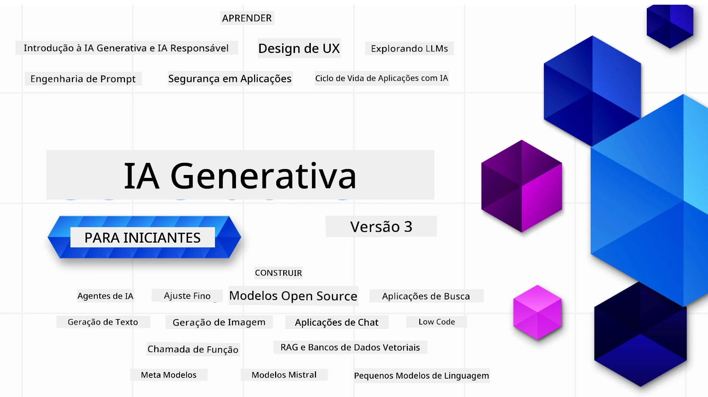

### 21 Lições ensinando tudo que você precisa saber para começar a construir aplicações de IA Generativa

[](https://github.com/microsoft/Generative-AI-For-Beginners/blob/master/LICENSE?WT.mc_id=academic-105485-koreyst)
[](https://GitHub.com/microsoft/Generative-AI-For-Beginners/graphs/contributors/?WT.mc_id=academic-105485-koreyst)
[](https://GitHub.com/microsoft/Generative-AI-For-Beginners/issues/?WT.mc_id=academic-105485-koreyst)
[](https://GitHub.com/microsoft/Generative-AI-For-Beginners/pulls/?WT.mc_id=academic-105485-koreyst)
[](http://makeapullrequest.com?WT.mc_id=academic-105485-koreyst)

[](https://GitHub.com/microsoft/Generative-AI-For-Beginners/watchers/?WT.mc_id=academic-105485-koreyst)
[](https://GitHub.com/microsoft/Generative-AI-For-Beginners/network/?WT.mc_id=academic-105485-koreyst)
[](https://GitHub.com/microsoft/Generative-AI-For-Beginners/stargazers/?WT.mc_id=academic-105485-koreyst)

[](https://discord.gg/nTYy5BXMWG)

### 🌐 Suporte Multilíngue

#### Suportado via GitHub Action (Automatizado e Sempre Atualizado)

<!-- CO-OP TRANSLATOR LANGUAGES TABLE START -->
[Arabic](../ar/README.md) | [Bengali](../bn/README.md) | [Bulgarian](../bg/README.md) | [Burmese (Myanmar)](../my/README.md) | [Chinese (Simplified)](../zh-CN/README.md) | [Chinese (Traditional, Hong Kong)](../zh-HK/README.md) | [Chinese (Traditional, Macau)](../zh-MO/README.md) | [Chinese (Traditional, Taiwan)](../zh-TW/README.md) | [Croatian](../hr/README.md) | [Czech](../cs/README.md) | [Danish](../da/README.md) | [Dutch](../nl/README.md) | [Estonian](../et/README.md) | [Finnish](../fi/README.md) | [French](../fr/README.md) | [German](../de/README.md) | [Greek](../el/README.md) | [Hebrew](../he/README.md) | [Hindi](../hi/README.md) | [Hungarian](../hu/README.md) | [Indonesian](../id/README.md) | [Italian](../it/README.md) | [Japanese](../ja/README.md) | [Kannada](../kn/README.md) | [Khmer](../km/README.md) | [Korean](../ko/README.md) | [Lithuanian](../lt/README.md) | [Malay](../ms/README.md) | [Malayalam](../ml/README.md) | [Marathi](../mr/README.md) | [Nepali](../ne/README.md) | [Nigerian Pidgin](../pcm/README.md) | [Norwegian](../no/README.md) | [Persian (Farsi)](../fa/README.md) | [Polish](../pl/README.md) | [Portuguese (Brazil)](./README.md) | [Portuguese (Portugal)](../pt-PT/README.md) | [Punjabi (Gurmukhi)](../pa/README.md) | [Romanian](../ro/README.md) | [Russian](../ru/README.md) | [Serbian (Cyrillic)](../sr/README.md) | [Slovak](../sk/README.md) | [Slovenian](../sl/README.md) | [Spanish](../es/README.md) | [Swahili](../sw/README.md) | [Swedish](../sv/README.md) | [Tagalog (Filipino)](../tl/README.md) | [Tamil](../ta/README.md) | [Telugu](../te/README.md) | [Thai](../th/README.md) | [Turkish](../tr/README.md) | [Ukrainian](../uk/README.md) | [Urdu](../ur/README.md) | [Vietnamese](../vi/README.md)

> **Prefere Clonar Localmente?**
>
> Este repositório inclui traduções para mais de 50 idiomas, o que aumenta significativamente o tamanho do download. Para clonar sem traduções, use checkout esparso:
>
> **Bash / macOS / Linux:**
> ```bash
> git clone --filter=blob:none --sparse https://github.com/microsoft/generative-ai-for-beginners.git
> cd generative-ai-for-beginners
> git sparse-checkout set --no-cone '/*' '!translations' '!translated_images'
> ```
>
> **CMD (Windows):**
> ```cmd
> git clone --filter=blob:none --sparse https://github.com/microsoft/generative-ai-for-beginners.git
> cd generative-ai-for-beginners
> git sparse-checkout set --no-cone "/*" "!translations" "!translated_images"
> ```
>
> Isso lhe dá tudo que você precisa para completar o curso com um download muito mais rápido.
<!-- CO-OP TRANSLATOR LANGUAGES TABLE END -->

# IA Generativa para Iniciantes (Versão 3) - Um Curso

Aprenda os fundamentos para construir aplicações de IA Generativa com nosso curso completo de 21 lições pelos Microsoft Cloud Advocates.

## 🌱 Começando

Este curso tem 21 lições. Cada lição cobre seu próprio tópico, então comece onde quiser!

As lições são rotuladas como lições "Aprender" que explicam um conceito de IA Generativa ou lições "Construir" que explicam um conceito e exemplos de código em **Python** e **TypeScript** quando possível.

Para desenvolvedores .NET confira [Generative AI for Beginners (.NET Edition)](https://github.com/microsoft/Generative-AI-for-beginners-dotnet?WT.mc_id=academic-105485-koreyst)!

Cada lição também inclui uma seção "Continue Aprendendo" com ferramentas adicionais de aprendizado.

## O Que Você Precisa
### Para rodar o código deste curso, você pode usar:
 - [Azure OpenAI Service](https://aka.ms/genai-beginners/azure-open-ai?WT.mc_id=academic-105485-koreyst) - **Lições:** "aoai-assignment"
 - [Microsoft Foundry Models](https://ai.azure.com/catalog/models?WT.mc_id=academic-105485-koreyst) - **Lições:** "githubmodels" (GitHub Models está sendo aposentado no fim de julho de 2026 - use Microsoft Foundry Models no lugar)
 - [OpenAI API](https://aka.ms/genai-beginners/open-ai?WT.mc_id=academic-105485-koreyst) - **Lições:** "oai-assignment" 
 - [Foundry Local](https://foundrylocal.ai?WT.mc_id=academic-105485-koreyst) - Rode modelos totalmente offline no seu próprio dispositivo, sem necessidade de assinatura na nuvem
   
- Conhecimento básico de Python ou TypeScript é útil - \*Para iniciantes absolutos confira estes cursos de [Python](https://aka.ms/genai-beginners/python?WT.mc_id=academic-105485-koreyst) e [TypeScript](https://aka.ms/genai-beginners/typescript?WT.mc_id=academic-105485-koreyst)
- Uma conta GitHub para [fazer fork de todo este repositório](https://aka.ms/genai-beginners/github?WT.mc_id=academic-105485-koreyst) para sua própria conta GitHub

Criamos uma lição de **[Configuração do Curso](./00-course-setup/README.md?WT.mc_id=academic-105485-koreyst)** para ajudar você a configurar seu ambiente de desenvolvimento.

Não esqueça de [dar estrela (🌟) a este repositório](https://docs.github.com/en/get-started/exploring-projects-on-github/saving-repositories-with-stars?WT.mc_id=academic-105485-koreyst) para encontrá-lo mais fácil depois.

## 🧠 Pronto para Implantar?

Se você busca exemplos de código mais avançados, confira nossa [coleção de Exemplos de Código de IA Generativa](https://aka.ms/genai-beg-code?WT.mc_id=academic-105485-koreyst) em **Python** e **TypeScript**.

## 🗣️ Conheça Outros Estudantes, Obtenha Suporte

Junte-se ao nosso [servidor oficial Microsoft Foundry Discord](https://aka.ms/genai-discord?WT.mc_id=academic-105485-koreyst) para conhecer e trocar ideias com outros estudantes que fazem este curso e obter suporte.

Faça perguntas ou compartilhe feedback do produto em nosso [Fórum de Desenvolvedores Microsoft Foundry](https://aka.ms/azureaifoundry/forum) no Github.

## 🚀 Construindo uma Startup?

Visite [Microsoft for Startups](https://www.microsoft.com/startups) para saber como começar a construir com créditos Azure hoje.

## 🙏 Quer ajudar?

Você tem sugestões ou encontrou erros de ortografia ou código? [Abra uma issue](https://github.com/microsoft/generative-ai-for-beginners/issues?WT.mc_id=academic-105485-koreyst) ou [Crie um pull request](https://github.com/microsoft/generative-ai-for-beginners/pulls?WT.mc_id=academic-105485-koreyst)

## 📂 Cada lição inclui:

- Uma breve introdução em vídeo ao tema
- Uma lição escrita localizada no README
- Exemplos de código em Python e TypeScript suportando Azure OpenAI e OpenAI API
- Links para recursos extras para continuar seu aprendizado

## 🗃️ Lições

| #   | **Link da Lição**                                                                                                                              | **Descrição**                                                                                 | **Vídeo**                                                                   | **Aprendizado Extra**                                                             |
| --- | -------------------------------------------------------------------------------------------------------------------------------------------- | ----------------------------------------------------------------------------------------------- | --------------------------------------------------------------------------- | ------------------------------------------------------------------------------ |
| 00  | [Configuração do Curso](./00-course-setup/README.md?WT.mc_id=academic-105485-koreyst)                                                                 | **Aprender:** Como Configurar seu Ambiente de Desenvolvimento                                            | Vídeo em Breve                                                                 | [Saiba Mais](https://aka.ms/genai-collection?WT.mc_id=academic-105485-koreyst) |
| 01  | [Introdução à IA Generativa e LLMs](./01-introduction-to-genai/README.md?WT.mc_id=academic-105485-koreyst)                              | **Aprender:** Entendendo o que é IA Generativa e como funcionam os Modelos de Linguagem Grande (LLMs).       | [Vídeo](https://aka.ms/gen-ai-lesson-1-gh?WT.mc_id=academic-105485-koreyst) | [Saiba Mais](https://aka.ms/genai-collection?WT.mc_id=academic-105485-koreyst) |
| 02  | [Explorando e comparando diferentes LLMs](./02-exploring-and-comparing-different-llms/README.md?WT.mc_id=academic-105485-koreyst)             | **Aprender:** Como selecionar o modelo certo para seu caso de uso                                      | [Vídeo](https://aka.ms/gen-ai-lesson2-gh?WT.mc_id=academic-105485-koreyst)  | [Saiba Mais](https://aka.ms/genai-collection?WT.mc_id=academic-105485-koreyst) |
| 03  | [Usando IA Generativa Responsavelmente](./03-using-generative-ai-responsibly/README.md?WT.mc_id=academic-105485-koreyst)                           | **Aprender:** Como construir Aplicações de IA Generativa de forma responsável                                  | [Vídeo](https://aka.ms/gen-ai-lesson3-gh?WT.mc_id=academic-105485-koreyst)  | [Saiba Mais](https://aka.ms/genai-collection?WT.mc_id=academic-105485-koreyst) |

| 04  | [Entendendo os Fundamentos da Engenharia de Prompt](./04-prompt-engineering-fundamentals/README.md?WT.mc_id=academic-105485-koreyst)           | **Aprenda:** Melhores Práticas Práticas de Engenharia de Prompt                                  | [Vídeo](https://aka.ms/gen-ai-lesson4-gh?WT.mc_id=academic-105485-koreyst)  | [Saiba Mais](https://aka.ms/genai-collection?WT.mc_id=academic-105485-koreyst) |
| 05  | [Criando Prompts Avançados](./05-advanced-prompts/README.md?WT.mc_id=academic-105485-koreyst)                                                  | **Aprenda:** Como aplicar técnicas de engenharia de prompt que melhoram o resultado dos seus prompts. | [Vídeo](https://aka.ms/gen-ai-lesson5-gh?WT.mc_id=academic-105485-koreyst)  | [Saiba Mais](https://aka.ms/genai-collection?WT.mc_id=academic-105485-koreyst) |
| 06  | [Construindo Aplicações de Geração de Texto](./06-text-generation-apps/README.md?WT.mc_id=academic-105485-koreyst)                              | **Construa:** Um aplicativo de geração de texto usando Azure OpenAI / OpenAI API                 | [Vídeo](https://aka.ms/gen-ai-lesson6-gh?WT.mc_id=academic-105485-koreyst)  | [Saiba Mais](https://aka.ms/genai-collection?WT.mc_id=academic-105485-koreyst) |
| 07  | [Construindo Aplicações de Chat](./07-building-chat-applications/README.md?WT.mc_id=academic-105485-koreyst)                                   | **Construa:** Técnicas para construir e integrar aplicativos de chat de forma eficiente.        | [Vídeo](https://aka.ms/gen-ai-lessons7-gh?WT.mc_id=academic-105485-koreyst) | [Saiba Mais](https://aka.ms/genai-collection?WT.mc_id=academic-105485-koreyst) |
| 08  | [Construindo Aplicações de Busca com Bancos de Dados Vetoriais](./08-building-search-applications/README.md?WT.mc_id=academic-105485-koreyst)    | **Construa:** Um aplicativo de busca que usa Embeddings para procurar dados.                     | [Vídeo](https://aka.ms/gen-ai-lesson8-gh?WT.mc_id=academic-105485-koreyst)  | [Saiba Mais](https://aka.ms/genai-collection?WT.mc_id=academic-105485-koreyst) |
| 09  | [Construindo Aplicações de Geração de Imagens](./09-building-image-applications/README.md?WT.mc_id=academic-105485-koreyst)                    | **Construa:** Um aplicativo de geração de imagens                                             | [Vídeo](https://aka.ms/gen-ai-lesson9-gh?WT.mc_id=academic-105485-koreyst)  | [Saiba Mais](https://aka.ms/genai-collection?WT.mc_id=academic-105485-koreyst) |
| 10  | [Construindo Aplicações de IA com Low Code](./10-building-low-code-ai-applications/README.md?WT.mc_id=academic-105485-koreyst)                  | **Construa:** Uma aplicação de IA Generativa usando ferramentas Low Code                        | [Vídeo](https://aka.ms/gen-ai-lesson10-gh?WT.mc_id=academic-105485-koreyst) | [Saiba Mais](https://aka.ms/genai-collection?WT.mc_id=academic-105485-koreyst) |
| 11  | [Integrando Aplicações Externas com Chamada de Função](./11-integrating-with-function-calling/README.md?WT.mc_id=academic-105485-koreyst)         | **Construa:** O que é chamada de função e seus casos de uso para aplicações                    | [Vídeo](https://aka.ms/gen-ai-lesson11-gh?WT.mc_id=academic-105485-koreyst) | [Saiba Mais](https://aka.ms/genai-collection?WT.mc_id=academic-105485-koreyst) |
| 12  | [Desenhando UX para Aplicações de IA](./12-designing-ux-for-ai-applications/README.md?WT.mc_id=academic-105485-koreyst)                         | **Aprenda:** Como aplicar princípios de design UX ao desenvolver aplicações de IA Generativa  | [Vídeo](https://aka.ms/gen-ai-lesson12-gh?WT.mc_id=academic-105485-koreyst) | [Saiba Mais](https://aka.ms/genai-collection?WT.mc_id=academic-105485-koreyst) |
| 13  | [Protegendo Suas Aplicações de IA Generativa](./13-securing-ai-applications/README.md?WT.mc_id=academic-105485-koreyst)                         | **Aprenda:** As ameaças e riscos aos sistemas de IA e métodos para proteger esses sistemas.    | [Vídeo](https://aka.ms/gen-ai-lesson13-gh?WT.mc_id=academic-105485-koreyst) | [Saiba Mais](https://aka.ms/genai-collection?WT.mc_id=academic-105485-koreyst) |
| 14  | [O Ciclo de Vida da Aplicação de IA Generativa](./14-the-generative-ai-application-lifecycle/README.md?WT.mc_id=academic-105485-koreyst)         | **Aprenda:** As ferramentas e métricas para gerenciar o Ciclo de Vida do LLM e LLMOps          | [Vídeo](https://aka.ms/gen-ai-lesson14-gh?WT.mc_id=academic-105485-koreyst) | [Saiba Mais](https://aka.ms/genai-collection?WT.mc_id=academic-105485-koreyst) |
| 15  | [Geração Aumentada por Recuperação (RAG) e Bancos de Dados Vetoriais](./15-rag-and-vector-databases/README.md?WT.mc_id=academic-105485-koreyst)  | **Construa:** Um aplicativo usando um Framework RAG para recuperar embeddings de um Banco de Dados Vetorial  | [Vídeo](https://aka.ms/gen-ai-lesson15-gh?WT.mc_id=academic-105485-koreyst) | [Saiba Mais](https://aka.ms/genai-collection?WT.mc_id=academic-105485-koreyst) |
| 16  | [Modelos Open Source e Hugging Face](./16-open-source-models/README.md?WT.mc_id=academic-105485-koreyst)                                        | **Construa:** Um aplicativo usando modelos open source disponíveis no Hugging Face              | [Vídeo](https://aka.ms/gen-ai-lesson16-gh?WT.mc_id=academic-105485-koreyst) | [Saiba Mais](https://aka.ms/genai-collection?WT.mc_id=academic-105485-koreyst) |
| 17  | [Agentes de IA](./17-ai-agents/README.md?WT.mc_id=academic-105485-koreyst)                                                                         | **Construa:** Um aplicativo usando um Framework de Agentes de IA                              | [Vídeo](https://aka.ms/gen-ai-lesson17-gh?WT.mc_id=academic-105485-koreyst) | [Saiba Mais](https://aka.ms/genai-collection?WT.mc_id=academic-105485-koreyst) |
| 18  | [Ajuste Fino de LLMs](./18-fine-tuning/README.md?WT.mc_id=academic-105485-koreyst)                                                                | **Aprenda:** O que, por que e como fazer ajuste fino em LLMs                                   | [Vídeo](https://aka.ms/gen-ai-lesson18-gh?WT.mc_id=academic-105485-koreyst) | [Saiba Mais](https://aka.ms/genai-collection?WT.mc_id=academic-105485-koreyst) |
| 19  | [Construindo com SLMs](./19-slm/README.md?WT.mc_id=academic-105485-koreyst)                                                                      | **Aprenda:** Os benefícios de construir com Pequenos Modelos de Linguagem                      | Vídeo Em Breve | [Saiba Mais](https://aka.ms/genai-collection?WT.mc_id=academic-105485-koreyst) |
| 20  | [Construindo com Modelos Mistral](./20-mistral/README.md?WT.mc_id=academic-105485-koreyst)                                                      | **Aprenda:** Os recursos e diferenças dos Modelos da Família Mistral                          | Vídeo Em Breve | [Saiba Mais](https://aka.ms/genai-collection?WT.mc_id=academic-105485-koreyst) |
| 21  | [Construindo com Modelos Meta](./21-meta/README.md?WT.mc_id=academic-105485-koreyst)                                                            | **Aprenda:** Os recursos e diferenças dos Modelos da Família Meta                            | Vídeo Em Breve | [Saiba Mais](https://aka.ms/genai-collection?WT.mc_id=academic-105485-koreyst) |

### 🌟 Agradecimentos especiais

Agradecimentos especiais a [**John Aziz**](https://www.linkedin.com/in/john0isaac/) por criar todas as Ações e fluxos de trabalho do GitHub

[**Bernhard Merkle**](https://www.linkedin.com/in/bernhard-merkle-738b73/) por fazer contribuições chave em cada lição para melhorar a experiência do aprendiz e do código.

## 🎒 Outros Cursos

Nossa equipe produz outros cursos! Confira:

<!-- CO-OP TRANSLATOR OTHER COURSES START -->
### LangChain
[](https://aka.ms/langchain4j-for-beginners)
[](https://aka.ms/langchainjs-for-beginners?WT.mc_id=m365-94501-dwahlin)
[](https://github.com/microsoft/langchain-for-beginners?WT.mc_id=m365-94501-dwahlin)
---

### Azure / Edge / MCP / Agentes
[](https://github.com/microsoft/AZD-for-beginners?WT.mc_id=academic-105485-koreyst)
[](https://github.com/microsoft/edgeai-for-beginners?WT.mc_id=academic-105485-koreyst)
[](https://github.com/microsoft/mcp-for-beginners?WT.mc_id=academic-105485-koreyst)
[](https://github.com/microsoft/ai-agents-for-beginners?WT.mc_id=academic-105485-koreyst)

---
 
### Série de IA Generativa
[](https://github.com/microsoft/generative-ai-for-beginners?WT.mc_id=academic-105485-koreyst)
[-9333EA?style=for-the-badge&labelColor=E5E7EB&color=9333EA)](https://github.com/microsoft/Generative-AI-for-beginners-dotnet?WT.mc_id=academic-105485-koreyst)
[-C084FC?style=for-the-badge&labelColor=E5E7EB&color=C084FC)](https://github.com/microsoft/generative-ai-for-beginners-java?WT.mc_id=academic-105485-koreyst)

[-E879F9?style=for-the-badge&labelColor=E5E7EB&color=E879F9)](https://github.com/microsoft/generative-ai-with-javascript?WT.mc_id=academic-105485-koreyst)

---
 
### Aprendizado Principal
[](https://aka.ms/ml-beginners?WT.mc_id=academic-105485-koreyst)
[](https://aka.ms/datascience-beginners?WT.mc_id=academic-105485-koreyst)
[](https://aka.ms/ai-beginners?WT.mc_id=academic-105485-koreyst)
[](https://github.com/microsoft/Security-101?WT.mc_id=academic-96948-sayoung)
[](https://aka.ms/webdev-beginners?WT.mc_id=academic-105485-koreyst)
[](https://aka.ms/iot-beginners?WT.mc_id=academic-105485-koreyst)
[](https://github.com/microsoft/xr-development-for-beginners?WT.mc_id=academic-105485-koreyst)

---
 
### Série Copilot
[](https://aka.ms/GitHubCopilotAI?WT.mc_id=academic-105485-koreyst)
[](https://github.com/microsoft/mastering-github-copilot-for-dotnet-csharp-developers?WT.mc_id=academic-105485-koreyst)
[](https://github.com/microsoft/CopilotAdventures?WT.mc_id=academic-105485-koreyst)
<!-- CO-OP TRANSLATOR OTHER COURSES END -->

## Obtendo Ajuda

Se você ficar preso ou tiver alguma dúvida sobre como construir aplicativos de IA. Participe de discussões com outros aprendizes e desenvolvedores experientes sobre MCP. É uma comunidade de apoio onde perguntas são bem-vindas e o conhecimento é compartilhado livremente.

[](https://discord.gg/nTYy5BXMWG)

Se você tiver feedback sobre o produto ou erros durante a construção, visite:

[](https://aka.ms/foundry/forum)

---

<!-- CO-OP TRANSLATOR DISCLAIMER START -->
**Aviso Legal**:
Este documento foi traduzido usando o serviço de tradução por IA [Co-op Translator](https://github.com/Azure/co-op-translator). Embora nos esforcemos pela precisão, por favor, esteja ciente de que traduções automatizadas podem conter erros ou imprecisões. O documento original em seu idioma nativo deve ser considerado a fonte autorizada. Para informações críticas, recomenda-se tradução profissional humana. Não nos responsabilizamos por quaisquer mal-entendidos ou interpretações incorretas decorrentes do uso desta tradução.
<!-- CO-OP TRANSLATOR DISCLAIMER END -->