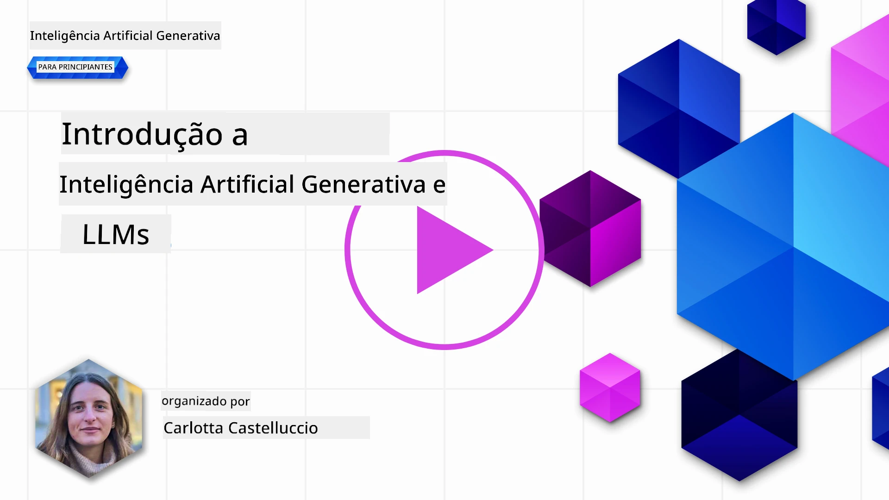
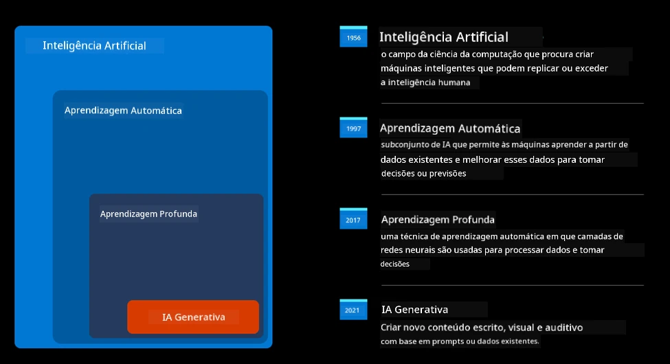
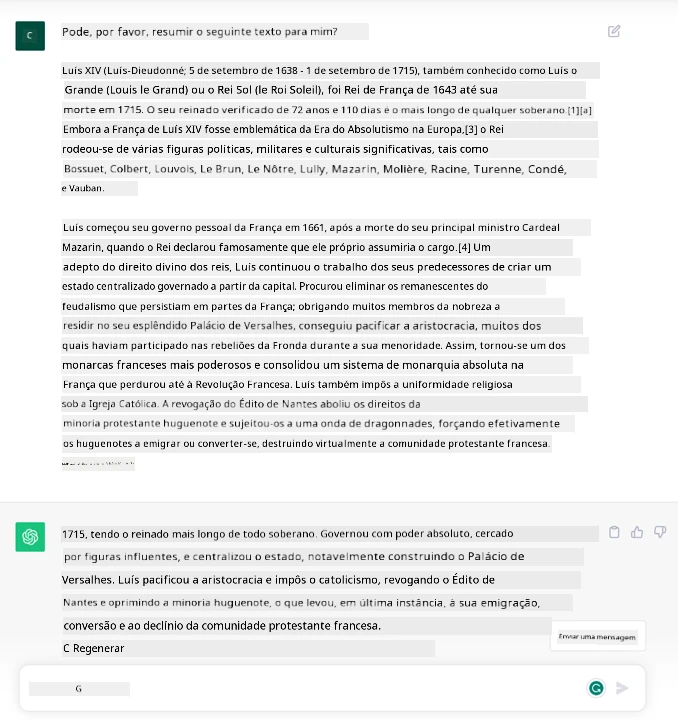
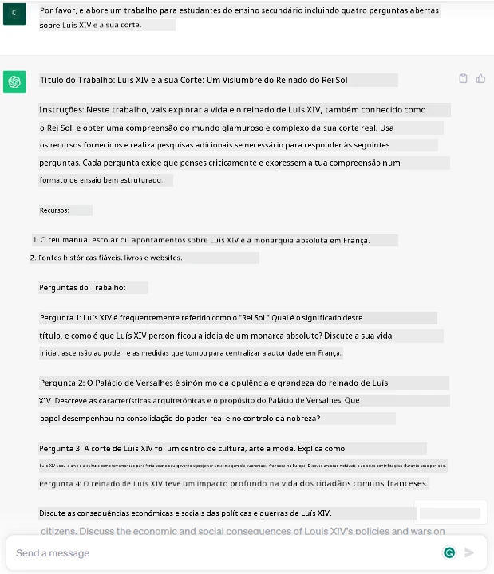
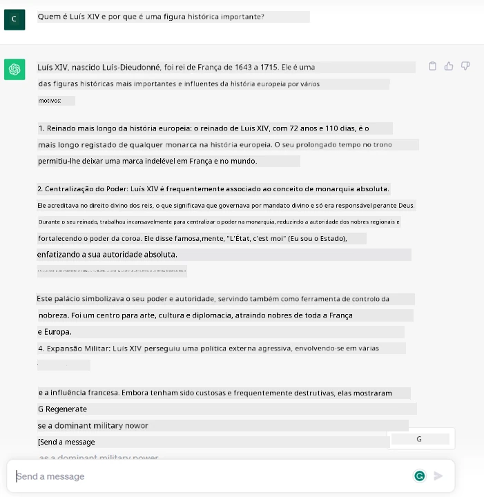
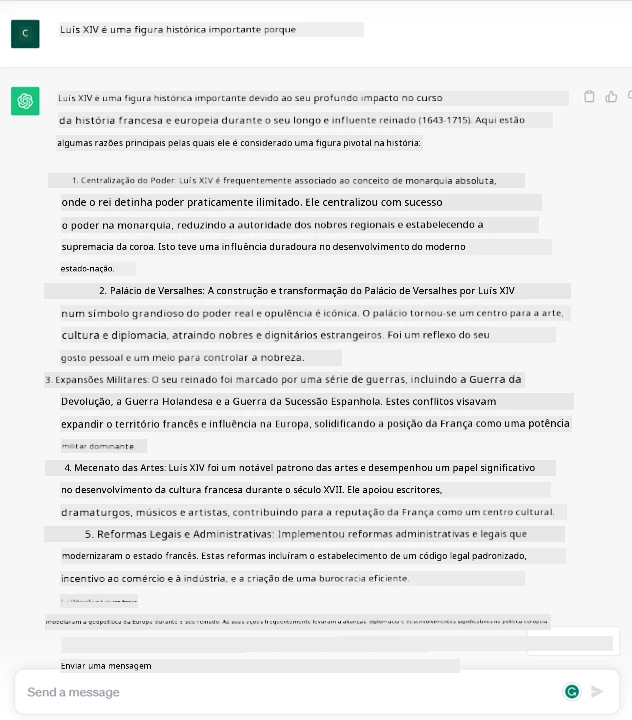
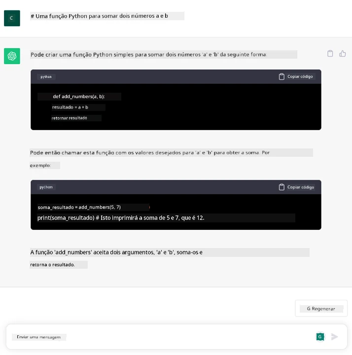

# Introdução à IA Generativa e Grandes Modelos de Linguagem

_(Clique na imagem acima para ver o vídeo desta lição)_

A IA generativa é uma inteligência artificial capaz de gerar texto, imagens e outros tipos de conteúdo. O que a torna uma tecnologia fantástica é que democratiza a IA, qualquer pessoa pode usá-la com apenas um prompt de texto, uma frase escrita numa linguagem natural. Não é necessário aprender uma linguagem como Java ou SQL para realizar algo valioso, tudo o que precisa é usar a sua linguagem, dizer o que quer e surge uma sugestão de um modelo de IA. As aplicações e o impacto disto são enormes: escreve ou entende relatórios, escreve aplicações e muito mais, tudo em segundos.

Neste currículo, exploraremos como a nossa startup utiliza a IA generativa para desbloquear novos cenários no mundo da educação e como abordamos os inevitáveis desafios associados às implicações sociais da sua aplicação e às limitações tecnológicas.

## Introdução

Esta lição irá cobrir:

- Introdução ao cenário de negócio: a nossa ideia e missão da startup.
- IA generativa e como chegámos à atual paisagem tecnológica.
- Funcionamento interno de um grande modelo de linguagem.
- Capacidades principais e casos de uso práticos dos Grandes Modelos de Linguagem.

## Objetivos de Aprendizagem

Após completar esta lição, irá compreender:

- O que é a IA generativa e como funcionam os Grandes Modelos de Linguagem.
- Como pode aproveitar grandes modelos de linguagem para diferentes casos de uso, com foco em cenários educativos.

## Cenário: a nossa startup educativa

A Inteligência Artificial Generativa (IA) representa o auge da tecnologia de IA, ultrapassando os limites do que antes se pensava impossível. Os modelos de IA generativa têm várias capacidades e aplicações, mas neste currículo vamos explorar como esta tecnologia está a revolucionar a educação através de uma startup fictícia. Referiremos esta startup como _a nossa startup_. A nossa startup atua no domínio da educação com a ambiciosa missão de

> _melhorar a acessibilidade na aprendizagem, em escala global, garantindo acesso equitativo à educação e proporcionando experiências de aprendizagem personalizadas a cada aluno, de acordo com as suas necessidades_.

A equipa da nossa startup está ciente de que não conseguiremos alcançar este objetivo sem aproveitar uma das ferramentas mais poderosas dos tempos modernos – os Grandes Modelos de Linguagem (LLMs).

Espera-se que a IA generativa revolucione a forma como aprendemos e ensinamos hoje, com os alunos a disporem de professores virtuais 24 horas por dia que fornecem grandes quantidades de informação e exemplos, e os professores a poderem usar ferramentas inovadoras para avaliar os seus alunos e dar feedback.

Para começar, vamos definir alguns conceitos básicos e terminologia que iremos utilizar ao longo do currículo.

## Como surgiu a IA Generativa?

Apesar do extraordinário _hype_ gerado recentemente pelo anúncio dos modelos de IA generativa, esta tecnologia está em desenvolvimento há décadas, com os primeiros esforços de investigação a remontar aos anos 60. Atualmente, a IA possui capacidades cognitivas humanas, como a conversação demonstrada, por exemplo, pelo [OpenAI ChatGPT](https://openai.com/chatgpt) ou pelo [Microsoft Copilot](https://copilot.microsoft.com/?WT.mc_id=academic-105485-koreyst), que também usa um modelo GPT para a sua experiência conversacional de pesquisas na web.

Recapitulando, os primeiros protótipos de IA consistiam em chatbots mecanografados, baseados numa base de conhecimento extraída de um grupo de especialistas e representada num computador. As respostas na base de conhecimento eram ativadas por palavras-chave presentes no texto de entrada.
Porém, rapidamente ficou claro que essa abordagem, usando chatbots mecanografados, não escalava bem.

### Uma abordagem estatística para a IA: Aprendizagem Automática

Um ponto de viragem chegou durante os anos 90, com a aplicação de uma abordagem estatística à análise de texto. Isto levou ao desenvolvimento de novos algoritmos – conhecidos como aprendizagem automática – capazes de aprender padrões a partir de dados sem serem explicitamente programados. Esta abordagem permite às máquinas simular a compreensão da linguagem humana: um modelo estatístico é treinado com pares de texto e etiqueta, permitindo que o modelo classifique texto desconhecido com uma etiqueta pré-definida que representa a intenção da mensagem.

### Redes neurais e assistentes virtuais modernos

Nos últimos anos, a evolução tecnológica do hardware, capaz de lidar com maiores quantidades de dados e cálculos mais complexos, incentivou a investigação em IA, levando ao desenvolvimento de algoritmos avançados de aprendizagem automática conhecidos como redes neurais ou algoritmos de aprendizagem profunda.

As redes neurais (e em particular as Redes Neurais Recorrentes – RNNs) melhoraram significativamente o processamento de linguagem natural, permitindo a representação do significado do texto de uma forma mais significativa, valorizando o contexto de uma palavra numa frase.

Esta tecnologia alimentou os assistentes virtuais nascidos na primeira década do novo século, muito proficientes em interpretar a linguagem humana, identificar uma necessidade e executar uma ação para a satisfazer – como responder com um script pré-definido ou consumir um serviço de terceiros.

### Atualidade, IA Generativa

Foi assim que chegámos à IA Generativa de hoje, que pode ser vista como um subgrupo da aprendizagem profunda.

Após décadas de investigação na área da IA, uma nova arquitetura de modelo – chamada _Transformer_ – ultrapassou os limites das RNNs, sendo capaz de receber sequências de texto muito mais longas como entrada. Os Transformers baseiam-se no mecanismo de atenção, permitindo que o modelo atribua diferentes pesos às entradas que recebe, ‘prestando mais atenção’ onde está concentrada a informação mais relevante, independentemente da sua ordem na sequência de texto.

A maioria dos modelos recentes de IA generativa – também conhecidos como Grandes Modelos de Linguagem (LLMs), visto que trabalham com entradas e saídas textuais – são de facto baseados nesta arquitetura. O interessante nestes modelos – treinados numa enorme quantidade de dados não etiquetados de fontes diversas como livros, artigos e sites – é que podem ser adaptados a uma grande variedade de tarefas e gerar texto gramaticalmente correto com um semblante de criatividade. Portanto, não só aumentaram de forma incrível a capacidade de uma máquina ‘compreender’ um texto de entrada, mas também permitiram a sua capacidade de gerar uma resposta original em linguagem humana.

## Como funcionam os grandes modelos de linguagem?

No capítulo seguinte, vamos explorar diferentes tipos de modelos de IA generativa, mas por agora vejamos como funcionam os grandes modelos de linguagem, com foco nos modelos OpenAI GPT (Generative Pre-trained Transformer).

- **Tokenizer, texto para números**: Os Grandes Modelos de Linguagem recebem um texto como entrada e geram um texto como saída. No entanto, sendo modelos estatísticos, funcionam muito melhor com números do que com sequências de texto. Por isso, cada entrada para o modelo é processada por um tokenizer, antes de ser usada pelo modelo principal. Um token é um fragmento de texto – consistindo num número variável de caracteres, pelo que a principal função do tokenizer é dividir a entrada numa matriz de tokens. Depois, cada token é mapeado com um índice de token, que é a codificação inteira do fragmento de texto original.

- **Predizer tokens de saída**: Dado n tokens como entrada (com máximo n variável de modelo para modelo), o modelo consegue prever um token como saída. Este token é então incorporado na entrada da próxima iteração, num padrão de janela que se expande, permitindo uma melhor experiência ao utilizador ao obter uma (ou várias) frase como resposta. Isto explica porque, se alguma vez brincou com o ChatGPT, poderá ter notado que às vezes parece que este para no meio de uma frase.

- **Processo de seleção, distribuição de probabilidade**: O token de saída é escolhido pelo modelo de acordo com a sua probabilidade de ocorrer após a sequência de texto atual. Isto porque o modelo prevê uma distribuição de probabilidade sobre todos os possíveis ‘tokens seguintes’, calculada com base no seu treino. No entanto, nem sempre é escolhido o token com a maior probabilidade da distribuição resultante. É adicionada uma componente de aleatoriedade a esta escolha, de forma que o modelo age de modo não determinístico – não obtemos exatamente a mesma saída para a mesma entrada. Esta aleatoriedade é adicionada para simular o processo de pensamento criativo e pode ser ajustada usando um parâmetro do modelo chamado temperatura.

## Como pode a nossa startup aproveitar os Grandes Modelos de Linguagem?

Agora que compreendemos melhor o funcionamento interno de um grande modelo de linguagem, vamos ver alguns exemplos práticos das tarefas mais comuns que eles desempenham muito bem, com um olhar para o nosso cenário de negócio.
Dissemos que a capacidade principal de um Grande Modelo de Linguagem é _gerar texto a partir do zero, começando de uma entrada textual, escrita em linguagem natural_.

Mas que tipo de entrada e saída textual?
A entrada de um grande modelo de linguagem é conhecida como prompt, enquanto a saída é conhecida como completion, termo que se refere ao mecanismo do modelo de gerar o próximo token para completar a entrada atual. Vamos aprofundar o que é um prompt e como o desenhar para obter o máximo do nosso modelo. Por agora, diremos que um prompt pode incluir:

- Uma **instrução** que especifica o tipo de saída que esperamos do modelo. Esta instrução por vezes pode conter alguns exemplos ou dados adicionais.

  1. Resumo de um artigo, livro, opiniões de produtos e mais, juntamente com extração de insights de dados não estruturados.
    
    
  
  2. Ideação criativa e design de um artigo, um ensaio, um trabalho ou mais.
      
     

- Uma **pergunta**, feita na forma de uma conversa com um agente.
  
  

- Um fragmento de **texto a completar**, que implicitamente é um pedido de assistência na escrita.
  
  

- Um fragmento de **código** acompanhado pelo pedido de explicação e documentação, ou um comentário pedindo para gerar um trecho de código que realize uma tarefa específica.
  
  

Os exemplos acima são bastante simples e não pretendem ser uma demonstração exaustiva das capacidades dos Grandes Modelos de Linguagem. Destinam-se a mostrar o potencial de usar IA generativa, em particular mas não apenas em contextos educativos.

Além disso, a saída de um modelo de IA generativa não é perfeita e, por vezes, a criatividade do modelo pode jogar contra ele, resultando numa saída que é uma combinação de palavras que o utilizador humano pode interpretar como uma mistificação da realidade, ou que pode ser ofensiva. IA generativa não é inteligente – pelo menos na definição mais abrangente de inteligência, que inclui raciocínio crítico e criativo ou inteligência emocional; não é determinística, e não é confiável, uma vez que podem ser combinadas invenções, como referências erradas, conteúdos e declarações, com informação correta, e apresentadas de forma persuasiva e confiante. Nas lições seguintes, iremos lidar com todas estas limitações e veremos o que podemos fazer para mitigá-las.

## Tarefa

A sua tarefa é ler mais sobre [ia generativa](https://en.wikipedia.org/wiki/Generative_artificial_intelligence?WT.mc_id=academic-105485-koreyst) e tentar identificar uma área onde adicionaria ia generativa hoje que ainda não a tem. Qual seria o impacto diferente de o fazer à "velha maneira", consegue fazer algo que não conseguia antes, ou é mais rápido? Escreva um resumo de 300 palavras sobre como seria a sua startup de IA de sonho e inclua cabeçalhos como "Problema", "Como usaria IA", "Impacto" e opcionalmente um plano de negócios.

Se fizer esta tarefa, poderá mesmo estar pronto para se candidatar à incubadora da Microsoft, [Microsoft for Startups Founders Hub](https://www.microsoft.com/startups?WT.mc_id=academic-105485-koreyst) onde oferecemos créditos para Azure, OpenAI, mentoring e muito mais, confira!

## Verificação de Conhecimento

O que é verdade sobre grandes modelos de linguagem?

1. Obtém a mesma resposta exata todas as vezes.
1. Faz as coisas perfeitamente, ótimo a somar números, gerar código funcional, etc.
1. A resposta pode variar apesar de usar o mesmo prompt. Também é ótimo para dar um rascunho inicial de algo, seja texto ou código. Mas é necessário melhorar os resultados.

A: 3, um LLM é não determinístico, a resposta varia, no entanto pode controlar a sua variação através do parâmetro temperatura. Também não deve esperar que faça as coisas perfeitamente, está aqui para fazer o trabalho pesado por si, o que muitas vezes significa que obtém uma boa primeira tentativa de algo que precisa de melhorar gradualmente.

## Ótimo Trabalho! Continue a Jornada

Após completar esta lição, consulte a nossa [coleção de Aprendizagem de IA Generativa](https://aka.ms/genai-collection?WT.mc_id=academic-105485-koreyst) para continuar a aumentar o seu conhecimento em IA Generativa!

Vá para a Aula 2 onde vamos ver como [explorar e comparar diferentes tipos de LLM](../02-exploring-and-comparing-different-llms/README.md?WT.mc_id=academic-105485-koreyst)!

---

<!-- CO-OP TRANSLATOR DISCLAIMER START -->
**Aviso Legal**:
Este documento foi traduzido utilizando o serviço de tradução automática [Co-op Translator](https://github.com/Azure/co-op-translator). Embora nos esforcemos pela precisão, esteja ciente de que traduções automáticas podem conter erros ou imprecisões. O documento original na sua língua nativa deve ser considerado a fonte autorizada. Para informações críticas, recomenda-se tradução profissional humana. Não nos responsabilizamos por quaisquer mal-entendidos ou interpretações incorretas resultantes da utilização desta tradução.
<!-- CO-OP TRANSLATOR DISCLAIMER END -->