# Explorar e comparar diferentes LLMs

[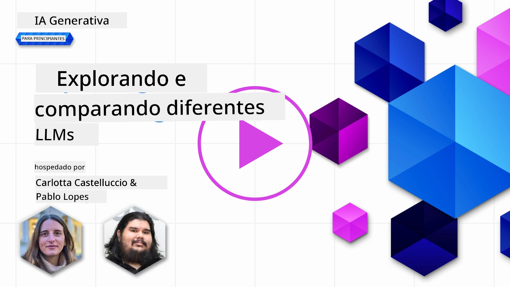](https://youtu.be/KIRUeDKscfI?si=8BHX1zvwzQBn-PlK)

> _Clique na imagem acima para ver o vídeo desta lição_

Com a lição anterior, vimos como a IA Generativa está a mudar o panorama tecnológico, como é que os Modelos de Linguagem de Grande Escala (LLMs) funcionam e como uma empresa – como a nossa startup – pode aplicá-los nos seus casos de uso e crescer! Neste capítulo, vamos comparar e contrastar diferentes tipos de grandes modelos de linguagem (LLMs) para entender as suas vantagens e desvantagens.

O próximo passo na jornada da nossa startup é explorar o panorama atual dos LLMs e perceber quais são adequados para o nosso caso de uso.

## Introdução

Esta lição irá cobrir:

- Diferentes tipos de LLMs no panorama atual.
- Testar, iterar e comparar diferentes modelos para o seu caso de uso no Azure.
- Como implementar um LLM.

## Objetivos de Aprendizagem

Após concluir esta lição, será capaz de:

- Selecionar o modelo certo para o seu caso de uso.
- Compreender como testar, iterar e melhorar o desempenho do seu modelo.
- Saber como as empresas implementam modelos.

## Compreender diferentes tipos de LLMs

Os LLMs podem ter múltiplas categorizações baseadas na sua arquitetura, dados de treino e caso de uso. Compreender estas diferenças ajudará a nossa startup a selecionar o modelo certo para o cenário, e a entender como testar, iterar e melhorar o desempenho.

Existem muitos tipos diferentes de modelos LLM, a escolha do seu modelo depende do que pretende usar, dos seus dados, do quanto está disposto a pagar e mais.

Dependendo se pretende usar os modelos para texto, áudio, vídeo, geração de imagens e assim por diante, poderá optar por um tipo diferente de modelo.

- **Reconhecimento de áudio e fala**. Modelos estilo Whisper ainda são úteis como modelos de reconhecimento de fala de uso geral, mas as opções de produção agora incluem também modelos mais recentes de fala para texto, como `gpt-4o-transcribe`, `gpt-4o-mini-transcribe`, e variantes de diarização. Avalie a cobertura linguística, diarização, suporte em tempo real, latência e custo para o seu cenário. Saiba mais na [documentação de fala para texto da OpenAI](https://platform.openai.com/docs/guides/speech-to-text?WT.mc_id=academic-105485-koreyst).

- **Geração de imagens**. DALL-E e Midjourney são opções bem conhecidas para geração de imagens, mas as atuais APIs de imagens da OpenAI centram-se em modelos de imagem GPT como `gpt-image-2`, enquanto Stable Diffusion, Imagen, Flux e outras famílias de modelos também são escolhas comuns. Compare a adesão ao prompt, suporte à edição, controlo de estilo, requisitos de segurança e licenciamento. Saiba mais no [guia de geração de imagens da OpenAI](https://platform.openai.com/docs/guides/images?WT.mc_id=academic-105485-koreyst) e no Capítulo 9 deste currículo.

- **Geração de texto**. Os modelos de texto agora abrangem modelos de ponta, modelos de raciocínio, modelos pequenos de baixa latência e modelos de código aberto. Exemplos atuais incluem os modelos OpenAI GPT-5.x, os modelos Anthropic Claude 4.x, os modelos Google Gemini 3.x, os modelos Meta Llama 4 e os modelos Mistral. Não escolha apenas pela data de lançamento ou preço; compare qualidade da tarefa, latência, janela de contexto, uso de ferramentas, comportamento de segurança, disponibilidade regional e custo total. O [catálogo de modelos Microsoft Foundry](https://ai.azure.com/catalog?WT.mc_id=academic-105485-koreyst) é um bom lugar para comparar modelos disponíveis no Azure.

- **Multi-modalidade**. Muitos modelos atuais conseguem processar mais do que texto. Alguns aceitam entradas de imagem, áudio ou vídeo; alguns podem chamar ferramentas; e modelos especializados podem gerar imagens, áudio ou vídeo. Por exemplo, os modelos atuais da OpenAI suportam entrada de texto e imagem, os modelos Gemini podem suportar texto, código, imagem, áudio e vídeo dependendo da variante, e o Llama 4 Scout e Maverick são modelos multimodais de peso aberto nativo. Verifique sempre cada ficha de modelo para as modalidades de entrada e saída suportadas antes de construir um fluxo de trabalho em torno dele.

Selecionar um modelo significa obter algumas capacidades básicas, que podem não ser suficientemente completas. Muitas vezes tem dados específicos da empresa que de algum modo precisa de informar o LLM. Existem algumas opções diferentes sobre como abordar isso, mais adiante nas próximas secções.

### Modelos Foundation versus LLMs

O termo Modelo Foundation foi [criado por investigadores de Stanford](https://arxiv.org/abs/2108.07258?WT.mc_id=academic-105485-koreyst) e definido como um modelo de IA que segue alguns critérios, tais como:

- **São treinados usando aprendizagem não supervisionada ou aprendizagem auto-supervisionada**, o que significa que são treinados com dados multimodais não rotulados, e não requerem anotação ou rotulagem humana dos dados para o seu processo de treino.
- **São modelos muito grandes**, baseados em redes neurais muito profundas treinadas com bilhões de parâmetros.
- **Normalmente destinam-se a servir como ‘fundação’ para outros modelos**, significando que podem ser usados como ponto de partida para construir outros modelos por cima, o que pode ser feito através de ajuste fino.

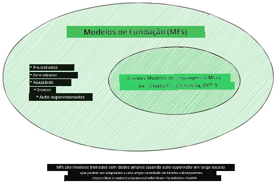

Fonte da imagem: [Essential Guide to Foundation Models and Large Language Models | por Babar M Bhatti | Medium
](https://thebabar.medium.com/essential-guide-to-foundation-models-and-large-language-models-27dab58f7404)

Para clarificar ainda mais esta distinção, tomemos o ChatGPT como exemplo histórico. As primeiras versões do ChatGPT usavam GPT-3.5 como modelo foundation. A OpenAI usou depois dados específicos para chat e técnicas de alinhamento para criar uma versão ajustada que teve melhor desempenho em cenários conversacionais, tais como chatbots. Serviços modernos de IA frequentemente alternam entre várias variantes de modelo, por isso o nome do serviço e o nome do modelo subjacente nem sempre são a mesma coisa.

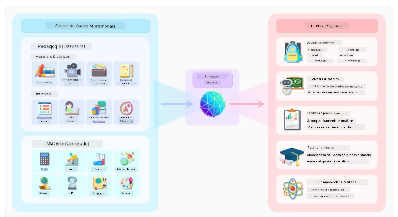

Fonte da imagem: [2108.07258.pdf (arxiv.org)](https://arxiv.org/pdf/2108.07258.pdf?WT.mc_id=academic-105485-koreyst)

### Modelos Open-Weight/Open-Source versus Proprietários

Outra forma de categorizar LLMs é se são open-weight, open-source, ou proprietários.

Modelos open-source e open-weight tornam artefactos do modelo disponíveis para inspeção, descarregamento, ou personalização, mas as suas licenças diferem. Alguns são completamente open source, enquanto outros são modelos open-weight com restrições de uso. Podem ser úteis quando uma empresa precisa de mais controlo sobre a implementação, localidade dos dados, custo, ou personalização. No entanto, as equipas ainda precisam de rever os termos da licença, custos de serviço, manutenção, atualizações de segurança, e qualidade da avaliação antes de os usar em produção. Exemplos incluem [Meta Llama 4](https://ai.meta.com/blog/llama-4-multimodal-intelligence/?WT.mc_id=academic-105485-koreyst), alguns [modelos Mistral](https://docs.mistral.ai/models/overview?WT.mc_id=academic-105485-koreyst), e muitos modelos alojados na [Hugging Face](https://huggingface.co/models?WT.mc_id=academic-105485-koreyst).

Modelos proprietários são propriedade de um fornecedor e hospedados por ele. Estes modelos são muitas vezes otimizados para uso gerido em produção e podem oferecer forte suporte, sistemas de segurança, integração de ferramentas e escala. No entanto, os clientes geralmente não conseguem inspecionar ou modificar os pesos do modelo, e têm que rever os termos do fornecedor para privacidade, retenção, conformidade e uso aceitável. Exemplos incluem [modelos OpenAI](https://platform.openai.com/docs/models?WT.mc_id=academic-105485-koreyst), [Google Gemini](https://deepmind.google/models/gemini/pro/?WT.mc_id=academic-105485-koreyst), e [Anthropic Claude](https://platform.claude.com/docs/en/about-claude/models/overview?WT.mc_id=academic-105485-koreyst).

### Embedding versus geração de imagens versus geração de texto e código

Os LLMs também podem ser categorizados pelo tipo de saída que geram.

Embeddings são um conjunto de modelos que podem converter texto numa forma numérica, chamada embedding, que é uma representação numérica do texto de entrada. Os embeddings facilitam o entendimento das relações entre palavras ou frases pelas máquinas e podem ser usados como entradas por outros modelos, como modelos de classificação ou modelos de clusterização que têm melhor desempenho sobre dados numéricos. Os modelos de embedding são frequentemente usados para transferência de aprendizagem, onde um modelo é construído para uma tarefa substituta para a qual existe abundância de dados, e depois os pesos do modelo (embeddings) são reutilizados para outras tarefas downstream. Um exemplo desta categoria são os [embeddings OpenAI](https://platform.openai.com/docs/models/embeddings?WT.mc_id=academic-105485-koreyst).

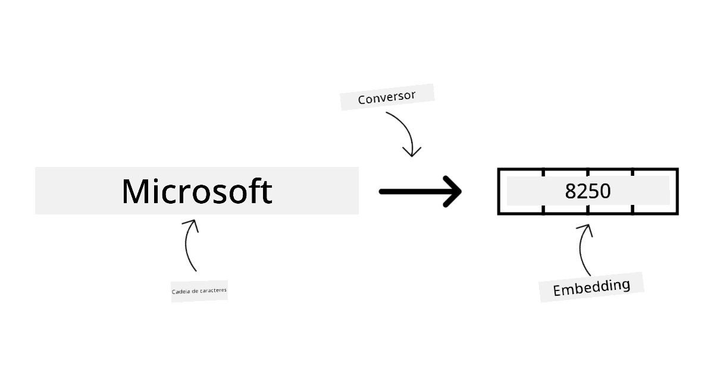

Modelos de geração de imagens são modelos que geram imagens. Estes modelos são frequentemente usados para edição de imagens, síntese de imagens e tradução de imagens. Modelos de geração de imagens são frequentemente treinados com grandes conjuntos de dados de imagens, como [LAION-5B](https://laion.ai/blog/laion-5b/?WT.mc_id=academic-105485-koreyst), e podem ser usados para gerar imagens novas ou para editar imagens existentes com técnicas de pintura digital, super-resolução e colorização. Exemplos incluem os [modelos GPT Image](https://platform.openai.com/docs/guides/images?WT.mc_id=academic-105485-koreyst), modelos [Stable Diffusion](https://github.com/Stability-AI/StableDiffusion?WT.mc_id=academic-105485-koreyst), e modelos Imagen.

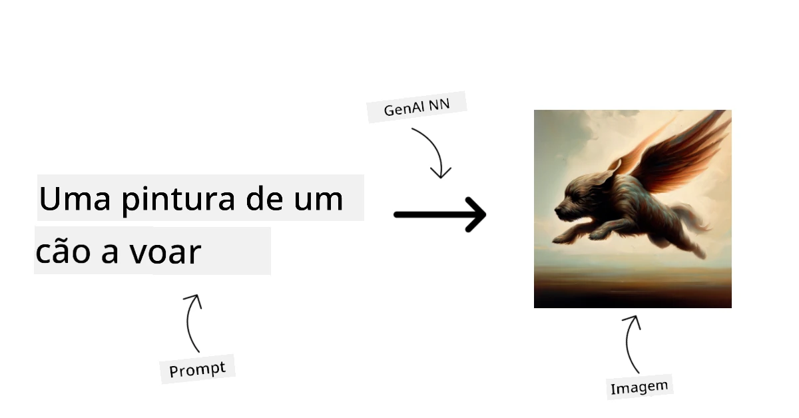

Modelos de geração de texto e código são modelos que geram texto ou código. Estes modelos são frequentemente usados para sumarização de texto, tradução e resposta a perguntas. Os modelos de geração de texto são frequentemente treinados com grandes conjuntos de dados de texto, como [BookCorpus](https://www.cv-foundation.org/openaccess/content_iccv_2015/html/Zhu_Aligning_Books_and_ICCV_2015_paper.html?WT.mc_id=academic-105485-koreyst), e podem ser usados para gerar texto novo ou para responder a perguntas. Modelos de geração de código, como [CodeParrot](https://huggingface.co/codeparrot?WT.mc_id=academic-105485-koreyst), são frequentemente treinados com grandes conjuntos de dados de código, como GitHub, e podem ser usados para gerar código novo ou para corrigir bugs em código existente.

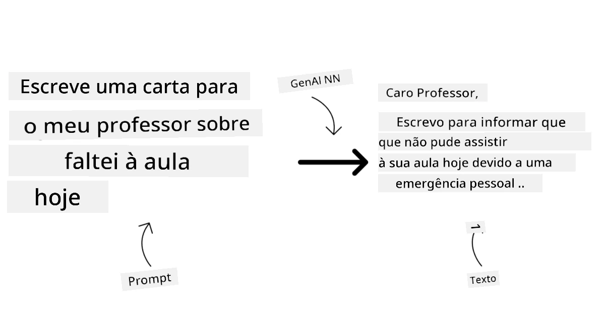

### Encoder-Decoder versus Somente decodificador

Para falar sobre os diferentes tipos de arquiteturas de LLMs, vamos usar uma analogia.

Imagine que o seu chefe lhe deu uma tarefa para escrever um questionário para os alunos. Tem dois colegas; um é responsável pela criação do conteúdo e o outro pela revisão.

O criador de conteúdo é como um modelo somente decodificador: pode olhar para o tema, ver o que já escreveu, e depois continuar a gerar conteúdo baseado nesse contexto. São muito bons a escrever conteúdo envolvente e informativo, mas nem sempre são a melhor escolha quando a tarefa é apenas classificar, recuperar ou codificar informação. Exemplos de famílias de modelos somente decodificador incluem os modelos GPT e Llama.

O revisor é como um modelo somente codificador, ele olha para o conteúdo escrito e as respostas, notando a relação entre elas e compreendendo o contexto, mas não é bom a gerar conteúdo. Um exemplo de modelo somente codificador seria o BERT.

Imagine que também podemos ter alguém que possa criar e rever o questionário, este é um modelo Encoder-Decoder. Alguns exemplos seriam BART e T5.

### Serviço versus Modelo

Agora, vamos falar sobre a diferença entre um serviço e um modelo. Um serviço é um produto oferecido por um Provedor de Serviço de Nuvem e muitas vezes é uma combinação de modelos, dados e outros componentes. Um modelo é o componente central de um serviço e é frequentemente um modelo foundation, como um LLM.

Os serviços são frequentemente otimizados para uso em produção e são geralmente mais fáceis de usar do que modelos, através de uma interface gráfica de utilizador. Contudo, os serviços nem sempre estão disponíveis gratuitamente e podem requerer uma subscrição ou pagamento para usar, em troca de utilizar o equipamento e recursos do proprietário do serviço, otimizando despesas e escalando facilmente. Um exemplo de serviço é o [Azure OpenAI Service](https://learn.microsoft.com/azure/ai-foundry/openai/overview?WT.mc_id=academic-105485-koreyst), que oferece um plano de tarifação pay-as-you-go, significando que os utilizadores são cobrados proporcionalmente ao uso do serviço. O Azure OpenAI Service oferece ainda segurança a nível empresarial e uma estrutura de IA responsável sobre as capacidades dos modelos.

Os modelos são os artefactos da rede neural: parâmetros, pesos, arquitetura, tokenizer e configuração de suporte. Executar um modelo localmente ou num ambiente privado requer hardware adequado, infraestrutura de serviço, monitorização e uma licença open-source/open-weight compatível ou uma licença comercial. Modelos open-weight como o Llama 4 ou modelos Mistral podem ser auto-hospedados, mas requerem ainda poder computacional e conhecimento operacional.

## Como testar e iterar com diferentes modelos para compreender o desempenho no Azure

Uma vez que a nossa equipa explorou o panorama atual dos LLMs e identificou alguns bons candidatos para os seus cenários, o próximo passo é testá-los com os seus dados e na sua carga de trabalho. Este é um processo iterativo, feito por experiências e medições.
A maioria dos modelos que mencionámos nos parágrafos anteriores (modelos OpenAI, modelos de peso aberto como Llama 4 e Mistral, e modelos Hugging Face) estão disponíveis no [Microsoft Foundry Models](https://learn.microsoft.com/azure/foundry/concepts/foundry-models-overview?WT.mc_id=academic-105485-koreyst).

[Microsoft Foundry](https://learn.microsoft.com/azure/foundry/what-is-foundry?WT.mc_id=academic-105485-koreyst), anteriormente Azure AI Studio/Azure AI Foundry, é uma plataforma Azure unificada para criar aplicações e agentes de IA. Ajuda os programadores a gerir o ciclo de vida desde a experimentação e avaliação até à implementação, monitorização e governação. O catálogo de modelos no Microsoft Foundry permite ao utilizador:

- Encontrar o modelo base de interesse no catálogo, incluindo modelos vendidos pela Azure e modelos de parceiros e fornecedores da comunidade. Os utilizadores podem filtrar por tarefa, fornecedor, licença, opção de implementação ou nome.

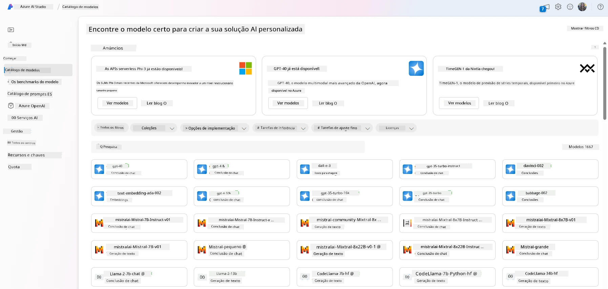

- Rever a ficha do modelo, incluindo uma descrição detalhada do uso pretendido e dados de treino, exemplos de código e resultados de avaliação na biblioteca interna de avaliações.

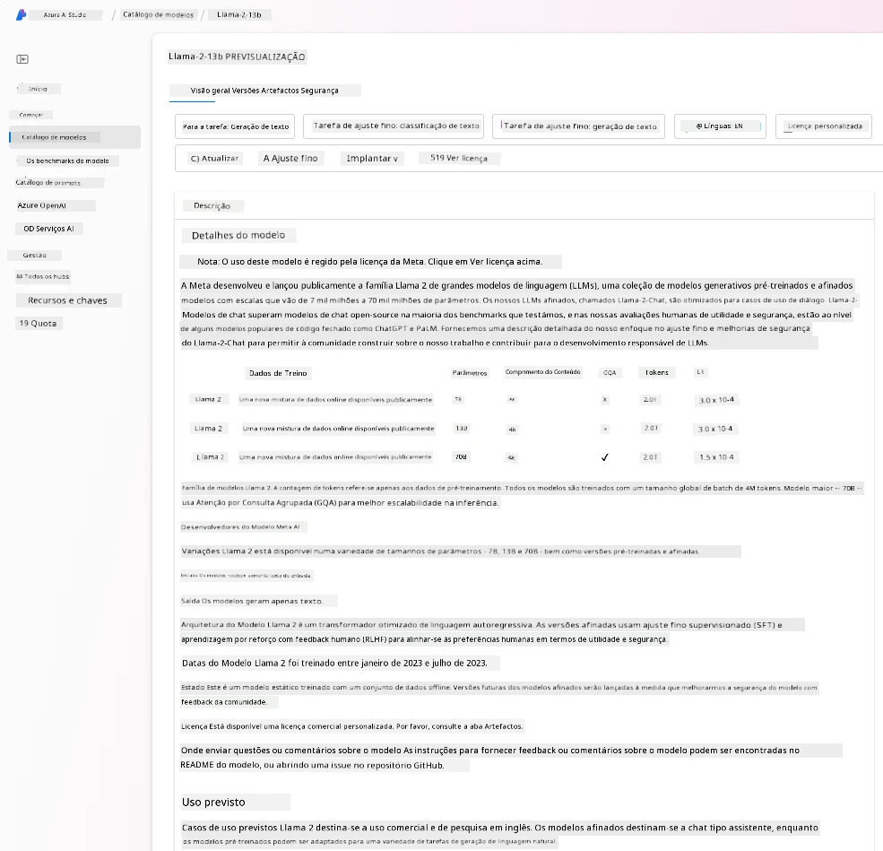

- Comparar benchmarks entre modelos e conjuntos de dados disponíveis na indústria para avaliar qual cumpre o cenário de negócio, através do painel [Model Benchmarks](https://learn.microsoft.com/azure/ai-foundry/concepts/model-benchmarks?WT.mc_id=academic-105485-koreyst).

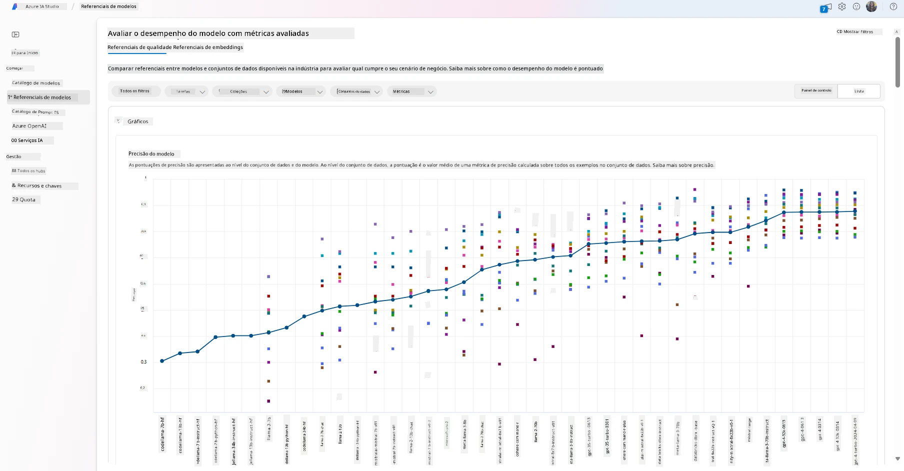

- Ajustar modelos suportados com dados de treino personalizados para melhorar o desempenho do modelo numa carga de trabalho específica, aproveitando as capacidades de experimentação e rastreamento do Microsoft Foundry.

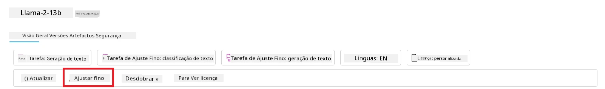

- Implementar o modelo pré-treinado original ou a versão ajustada num ponto final remoto de inferência em tempo real, usando opções de computação gerida ou implementação serverless, para permitir que as aplicações o consumam.

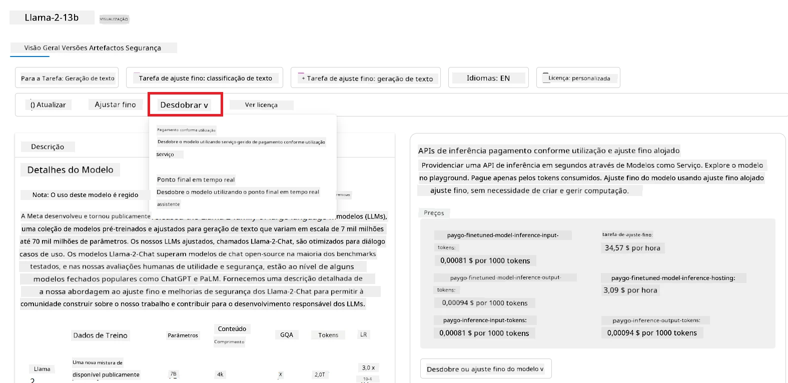

> [!NOTE]
> Nem todos os modelos no catálogo estão atualmente disponíveis para ajuste fino e/ou implementação pay-as-you-go. Consulte a ficha do modelo para detalhes sobre as capacidades e limitações do modelo.

## Melhorando os resultados dos LLM

A nossa equipa da startup explorou diferentes tipos de LLMs e uma plataforma cloud (Microsoft Foundry) que nos permite comparar diferentes modelos, avaliá-los com dados de teste, melhorar o desempenho e implementá-los em pontos finais de inferência.

Mas quando devem considerar ajustar um modelo em vez de usar um pré-treinado? Existem outras abordagens para melhorar o desempenho do modelo em cargas de trabalho específicas?

Existem várias abordagens que um negócio pode usar para obter os resultados de que precisa de um LLM. Pode selecionar diferentes tipos de modelos com diferentes graus de treino ao implementar um LLM em produção, com níveis variados de complexidade, custo e qualidade. Aqui estão algumas abordagens diferentes:

- **Engenharia de prompt com contexto**. A ideia é fornecer contexto suficiente quando pede para garantir que obtém as respostas que necessita.

- **Retrieval Augmented Generation, RAG**. Os seus dados podem existir numa base de dados ou ponto final web, por exemplo. Para garantir que estes dados, ou um subconjunto deles, estão incluídos no momento do prompt, pode buscar os dados relevantes e integrá-los no prompt do utilizador.

- **Modelo ajustado**. Aqui, treinou o modelo adicionalmente com os seus próprios dados, o que levou o modelo a ser mais exato e responsivo às suas necessidades, mas pode ser dispendioso.

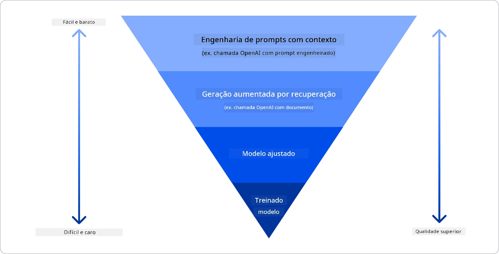

Fonte da imagem: [Four Ways that Enterprises Deploy LLMs | Fiddler AI Blog](https://www.fiddler.ai/blog/four-ways-that-enterprises-deploy-llms?WT.mc_id=academic-105485-koreyst)

### Engenharia de Prompt com Contexto

LLMs pré-treinados funcionam muito bem em tarefas de linguagem natural generalizadas, mesmo ao chamá-los com um prompt curto, como uma frase para completar ou uma pergunta – o chamado aprendizado “zero-shot”.

Contudo, quanto mais o utilizador conseguir enquadrar a sua pergunta, com um pedido detalhado e exemplos – o Contexto – mais precisa e próxima das expectativas do utilizador será a resposta. Neste caso, falamos de aprendizado “one-shot” se o prompt incluir apenas um exemplo e “few-shot learning” se incluir múltiplos exemplos.
A engenharia de prompt com contexto é a abordagem mais económica para começar.

### Retrieval Augmented Generation (RAG)

Os LLMs têm a limitação de que só podem usar os dados que foram usados durante o seu treino para gerar uma resposta. Isto significa que não sabem nada sobre factos que ocorreram após o seu processo de treino e não podem aceder a informação não pública (como dados da empresa).
Isto pode ser ultrapassado através do RAG, uma técnica que aumenta o prompt com dados externos sob a forma de pedaços de documentos, considerando os limites de comprimento do prompt. Isto é suportado por ferramentas de base de dados vetorial (como o [Azure Vector Search](https://learn.microsoft.com/azure/search/vector-search-overview?WT.mc_id=academic-105485-koreyst)) que recuperam os pedaços úteis de variadas fontes de dados pré-definidas e os adicionam ao Contexto do prompt.

Esta técnica é muito útil quando um negócio não tem dados suficientes, tempo suficiente ou recursos para ajustar um LLM, mas quer ainda melhorar o desempenho numa carga de trabalho específica e reduzir os riscos de respostas inventadas, desatualizadas ou sem suporte.

### Modelo ajustado

O ajuste fino é um processo que aproveita o transfer learning para ‘adaptar’ o modelo a uma tarefa específica ou para resolver um problema específico. Diferentemente do few-shot learning e do RAG, resulta na geração de um novo modelo, com pesos e vieses atualizados. Requer um conjunto de exemplos de treino consistindo num único input (o prompt) e a sua saída associada (a conclusão).
Esta seria a abordagem preferida se:

- **Usar modelos mais pequenos específicos para a tarefa**. Um negócio preferiria ajustar um modelo mais pequeno para uma tarefa estreita em vez de usar repetidamente um modelo avançado maior, o que resulta numa solução mais económica e rápida.

- **Considerar a latência**. A latência é importante para um caso específico, pelo que não é possível usar prompts muito longos ou o número de exemplos que o modelo deve aprender não se enquadra no limite de comprimento do prompt.

- **Adaptar comportamento estável**. Um negócio tem muitos exemplos de alta qualidade e quer que o modelo siga consistentemente um padrão de tarefa, formato de saída, tom ou estilo específico do domínio. Se o principal problema for factos recentes ou conhecimento privado que muda frequentemente, use RAG em vez de depender apenas do ajuste fino.

### Modelo treinado

Treinar um LLM do zero é sem dúvida a abordagem mais difícil e complexa de adotar, exigindo grandes quantidades de dados, recursos especializados e poder computacional apropriado. Esta opção deve ser considerada apenas num cenário onde um negócio tem um caso de uso específico de domínio e uma grande quantidade de dados centrados nesse domínio.

## Verificação de conhecimento

Qual poderia ser uma boa abordagem para melhorar os resultados de conclusão de um LLM?

1. Engenharia de prompt com contexto
1. RAG
1. Modelo ajustado

R: Os três podem ajudar. Comece com engenharia de prompt e contexto para melhorias rápidas, e use RAG quando o modelo precisar de factos atuais ou dados privados do negócio. Escolha ajuste fino quando tiver exemplos suficientes de alta qualidade e precisar que o modelo siga consistentemente uma tarefa, formato, tom ou padrão de domínio.

## 🚀 Desafio

Leia mais sobre como pode [usar RAG](https://learn.microsoft.com/azure/search/retrieval-augmented-generation-overview?WT.mc_id=academic-105485-koreyst) para o seu negócio.

## Excelente trabalho, continue a sua aprendizagem

Após completar esta lição, veja a nossa [coleção de aprendizagem de IA Generativa](https://aka.ms/genai-collection?WT.mc_id=academic-105485-koreyst) para continuar a desenvolver os seus conhecimentos em IA Generativa!

Vá para a Lição 3 onde vamos ver como [construir com IA Generativa de forma responsável](../03-using-generative-ai-responsibly/README.md?WT.mc_id=academic-105485-koreyst)!

---

<!-- CO-OP TRANSLATOR DISCLAIMER START -->
**Aviso Legal**:
Este documento foi traduzido utilizando o serviço de tradução automática [Co-op Translator](https://github.com/Azure/co-op-translator). Embora nos esforcemos pela precisão, esteja ciente de que traduções automáticas podem conter erros ou imprecisões. O documento original na sua língua nativa deve ser considerado a fonte autorizada. Para informações críticas, recomenda-se tradução profissional humana. Não nos responsabilizamos por quaisquer mal-entendidos ou interpretações incorretas resultantes da utilização desta tradução.
<!-- CO-OP TRANSLATOR DISCLAIMER END -->