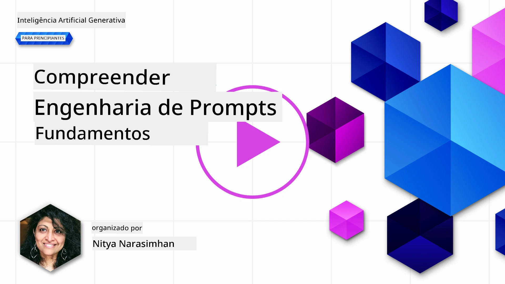
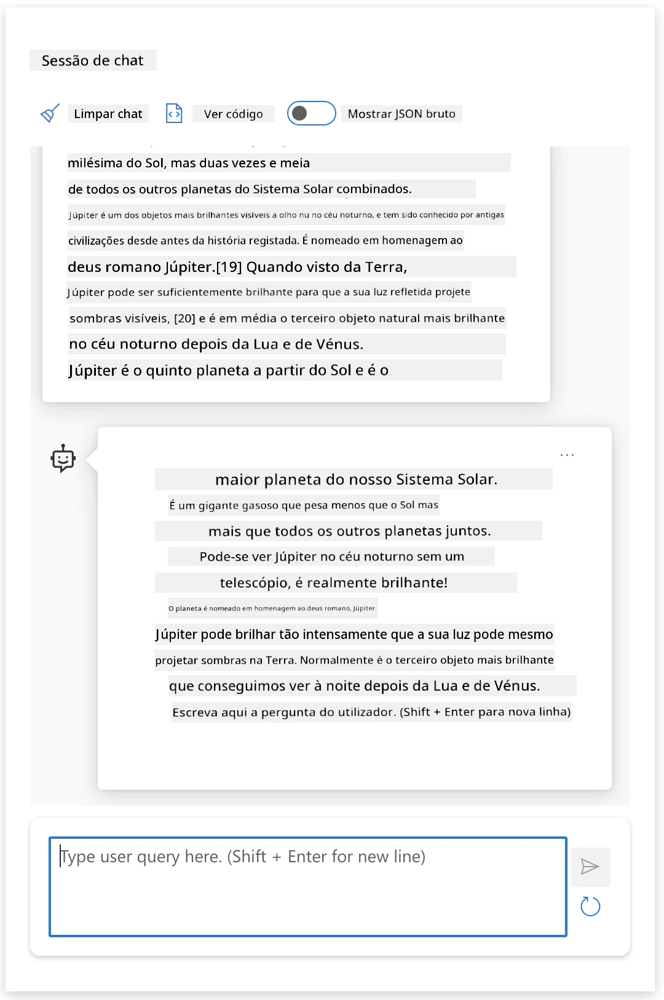
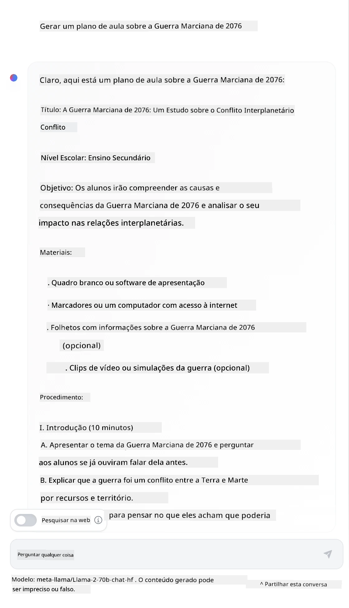

# Fundamentos de Engenharia de Prompts

[](https://youtu.be/GElCu2kUlRs?si=qrXsBvXnCW12epb8)

## Introdução
Este módulo aborda conceitos e técnicas essenciais para criar prompts eficazes em modelos generativos de IA. A forma como escreve o seu prompt para um LLM também é importante. Um prompt cuidadosamente elaborado pode alcançar uma melhor qualidade de resposta. Mas o que exatamente significam termos como _prompt_ e _engenharia de prompts_? E como posso melhorar a _entrada_ do prompt que envio ao LLM? Estas são as questões que tentaremos responder neste capítulo e no seguinte.

A _IA Generativa_ é capaz de criar novo conteúdo (ex., texto, imagens, áudio, código, etc.) em resposta a pedidos do utilizador. Isto é conseguido usando _Modelos de Linguagem de Grande Escala_ como a série GPT da OpenAI ("Generative Pre-trained Transformer"), que são treinados para usar linguagem natural e código.

Os utilizadores podem agora interagir com estes modelos usando paradigmas familiares como chat, sem necessidade de conhecimentos técnicos ou formação. Os modelos são _baseados em prompts_ - os utilizadores enviam uma entrada de texto (prompt) e recebem a resposta da IA (completamento). Podem então "conversar com a IA" iterativamente, em diálogos com múltiplas interações, refinando o prompt até que a resposta vá ao encontro das suas expectativas.

Os "prompts" passam a ser a principal _interface de programação_ para aplicações de IA generativa, indicando aos modelos o que fazer e influenciando a qualidade das respostas retornadas. A "Engenharia de Prompts" é um campo em rápido crescimento que se foca no _design e otimização_ dos prompts para entregar respostas consistentes e de qualidade em escala.

## Objetivos de Aprendizagem

Nesta lição, aprendemos o que é Engenharia de Prompts, por que é importante e como criar prompts mais eficazes para um dado modelo e objetivo de aplicação. Vamos compreender conceitos básicos e boas práticas de engenharia de prompts - e aprender sobre um ambiente interativo de Jupyter Notebooks "sandbox" onde podemos ver estes conceitos aplicados em exemplos reais.

No final desta lição seremos capazes de:

1. Explicar o que é engenharia de prompts e por que é importante.
2. Descrever os componentes de um prompt e como são usados.
3. Conhecer boas práticas e técnicas para engenharia de prompts.
4. Aplicar técnicas aprendidas em exemplos reais, usando um endpoint da OpenAI.

## Termos-chave

Engenharia de Prompts: A prática de desenhar e refinar entradas para guiar modelos de IA a produzir as saídas desejadas.  
Tokenização: O processo de converter texto em unidades menores, chamadas tokens, que um modelo pode entender e processar.  
LLMs Ajustados por Instruções: Modelos de Linguagem de Grande Escala que foram ajustados com instruções específicas para melhorar a precisão e relevância das suas respostas.

## Sandbox de Aprendizagem

A engenharia de prompts é atualmente mais uma arte do que uma ciência. A melhor forma de melhorar a nossa intuição é _praticar mais_ e adotar uma abordagem de tentativa e erro que combina experiência no domínio da aplicação com técnicas recomendadas e otimizações específicas do modelo.

O Jupyter Notebook que acompanha esta lição fornece um ambiente _sandbox_ onde pode experimentar o que aprende – à medida que avança ou como parte do desafio de código no final. Para executar os exercícios, vai precisar de:

1. **Uma chave da API Azure OpenAI** – o endpoint do serviço para um LLM implementado.  
2. **Um ambiente Python** – onde o Notebook pode ser executado.  
3. **Variáveis de Ambiente Locais** – _complete os passos do [CONFIGURAÇÃO](./../00-course-setup/02-setup-local.md?WT.mc_id=academic-105485-koreyst) agora para estar pronto_.

O notebook vem com exercícios _inicializadores_ - mas é incentivado a adicionar a sua própria secção de _Markdown_ (descrição) e de _Código_ (pedidos de prompts) para experimentar mais exemplos ou ideias - e desenvolver a sua intuição para o design de prompts.

## Guia Ilustrado

Quer perceber o panorama geral do que esta lição cobre antes de se aprofundar? Veja este guia ilustrado, que lhe dá uma noção dos tópicos principais abordados e dos pontos-chave para refletir em cada um. O roteiro da lição leva-o a entender os conceitos e desafios principais até resolvê-los com técnicas relevantes de engenharia de prompts e boas práticas. Note que a seção "Técnicas Avançadas" neste guia refere-se ao conteúdo do _próximo_ capítulo deste currículo.


## A Nossa Startup

Agora, vamos falar sobre como _este tema_ se relaciona com a missão da nossa startup de [trazer inovação em IA para a educação](https://educationblog.microsoft.com/2023/06/collaborating-to-bring-ai-innovation-to-education?WT.mc_id=academic-105485-koreyst). Queremos construir aplicações de IA focadas em _aprendizagem personalizada_ – por isso vamos pensar como diferentes utilizadores da nossa aplicação podem "desenhar" prompts:

- **Administradores** podem pedir à IA para _analisar dados curriculares para identificar lacunas na cobertura_. A IA pode resumir resultados ou visualizá-los com código.  
- **Educadores** podem pedir à IA para _gerar um plano de aula para um público-alvo e tema específicos_. A IA pode construir o plano personalizado num formato especificado.  
- **Estudantes** podem pedir à IA para _os ajudar numa disciplina difícil_. A IA pode agora guiar os estudantes com lições, dicas e exemplos adaptados ao seu nível.

Isto é só a ponta do iceberg. Veja [Prompts For Education](https://github.com/microsoft/prompts-for-edu/tree/main?WT.mc_id=academic-105485-koreyst) – uma biblioteca open source de prompts selecionada por especialistas em educação – para ter uma noção mais ampla das possibilidades! _Experimente executar alguns desses prompts no sandbox ou usar o OpenAI Playground para ver o que acontece!_

<!--
LESSON TEMPLATE:
This unit should cover core concept #1.
Reinforce the concept with examples and references.

CONCEPT #1:
Prompt Engineering.
Define it and explain why it is needed.
-->

## O que é Engenharia de Prompts?

Começámos esta lição definindo **Engenharia de Prompts** como o processo de _desenhar e otimizar_ entradas de texto (prompts) para entregar respostas consistentes e de qualidade (completamentos) para um dado objetivo de aplicação e modelo. Podemos pensar nisto como um processo de 2 etapas:

- _desenhar_ o prompt inicial para um dado modelo e objetivo  
- _refinar_ o prompt iterativamente para melhorar a qualidade da resposta

Este é necessariamente um processo de tentativa e erro que requer intuição e esforço do utilizador para obter resultados ótimos. Então, por que é isto importante? Para responder a essa pergunta, precisamos primeiro entender três conceitos:

- _Tokenização_ = como o modelo "vê" o prompt  
- _LLMs Base_ = como o modelo base "processa" um prompt  
- _LLMs Ajustados por Instruções_ = como o modelo consegue agora ver "tarefas"

### Tokenização

Um LLM vê os prompts como uma _sequência de tokens_ onde diferentes modelos (ou versões de um modelo) podem tokenizar o mesmo prompt de formas diferentes. Como os LLMs são treinados em tokens (e não em texto cru), a forma como os prompts são tokenizados tem impacto direto na qualidade da resposta gerada.

Para perceber como a tokenização funciona, experimente ferramentas como o [OpenAI Tokenizer](https://platform.openai.com/tokenizer?WT.mc_id=academic-105485-koreyst) mostrado abaixo. Copie o seu prompt – e veja como ele é convertido em tokens, prestando atenção a como são tratados os espaços e os sinais de pontuação. Note que este exemplo mostra um LLM mais antigo (GPT-3) - experimentar com um modelo mais recente pode produzir um resultado diferente.


### Conceito: Modelos Base

Depois de tokenizado, a função principal do ["LLM Base"](https://blog.gopenai.com/an-introduction-to-base-and-instruction-tuned-large-language-models-8de102c785a6?WT.mc_id=academic-105485-koreyst) (ou modelo base) é prever o token seguinte nessa sequência. Como os LLMs são treinados com datasets massivos de texto, têm uma boa noção das relações estatísticas entre tokens e conseguem fazer essa predição com alguma confiança. Note que eles não entendem o _significado_ das palavras no prompt ou token; apenas reconhecem um padrão que podem "completar" com a predição seguinte. Podem continuar a prever a sequência até serem interrompidos por intervenção do utilizador ou alguma condição pré-estabelecida.

Quer ver como funciona o completamento por prompt? Insira o prompt acima no Azure OpenAI Studio [_Chat Playground_](https://oai.azure.com/playground?WT.mc_id=academic-105485-koreyst) com as definições padrão. O sistema está configurado para tratar prompts como pedidos de informação – deverá ver um completamento que satisfaça este contexto.

Mas e se o utilizador quisesse algo específico que correspondesse a algum critério ou objetivo de tarefa? É aqui que os LLMs _ajustados por instruções_ entram em cena.


### Conceito: LLMs Ajustados por Instruções

Um [LLM Ajustado por Instruções](https://blog.gopenai.com/an-introduction-to-base-and-instruction-tuned-large-language-models-8de102c785a6?WT.mc_id=academic-105485-koreyst) parte do modelo base e é afinado com exemplos ou pares de entrada/saída (ex., "mensagens" com múltiplas interações) que podem conter instruções claras – e a resposta da IA tenta seguir essa instrução.

Isto usa técnicas como Aprendizagem por Reforço com Feedback Humano (RLHF) que podem treinar o modelo a _seguir instruções_ e _aprender com feedback_ para produzir respostas mais adequadas a aplicações práticas e mais relevantes para objetivos do utilizador.

Vamos experimentar – volte ao prompt acima, mas agora mude a _mensagem do sistema_ para fornecer a seguinte instrução como contexto:

> _Resuma o conteúdo que lhe for fornecido para um aluno do segundo ano. Mantenha o resultado num parágrafo com 3-5 pontos em formato de tópicos._

Veja como o resultado está agora afinado para refletir o objetivo e formato desejados? Um educador pode usar diretamente essa resposta nas suas apresentações para essa aula.



## Por que precisamos de Engenharia de Prompts?

Agora que sabemos como os prompts são processados pelos LLMs, vamos falar sobre _porquê_ precisamos de engenharia de prompts. A resposta está no facto de que os LLMs atuais apresentam vários desafios que tornam mais difícil obter _completamentos fiáveis e consistentes_ sem esforço na construção e otimização do prompt. Por exemplo:

1. **As respostas do modelo são estocásticas.** O _mesmo prompt_ provavelmente produzirá respostas diferentes com modelos ou versões de modelo diferentes. E pode mesmo produzir resultados diferentes com o _mesmo modelo_ em momentos distintos. _Técnicas de engenharia de prompts podem ajudar a minimizar estas variações fornecendo limites mais robustos_.

1. **Os modelos podem fabricar respostas.** Os modelos são pré-treinados com conjuntos de dados _grandes mas finitos_, o que significa que lhes falta conhecimento sobre conceitos fora do âmbito desse treino. Como resultado, podem produzir completamentos que são imprecisos, imaginários ou diretamente contraditórios com fatos conhecidos. _Técnicas de engenharia de prompts ajudam os utilizadores a identificar e mitigar essas fabricações, por exemplo, pedindo à IA citações ou raciocínios_.

1. **As capacidades dos modelos variam.** Modelos ou gerações mais recentes terão capacidades mais ricas, mas também apresentam peculiaridades únicas e trade-offs em custo e complexidade. _Engenharia de prompts pode ajudar a desenvolver boas práticas e fluxos de trabalho que abstragam diferenças e adaptem-se a requisitos específicos do modelo de forma escalável e fluida_.

Vamos ver isto em ação no OpenAI ou Azure OpenAI Playground:

- Use o mesmo prompt com diferentes implementações de LLM (ex., OpenAI, Azure OpenAI, Hugging Face) – viu variações?  
- Use o mesmo prompt repetidamente com a _mesma_ implementação de LLM (ex., Azure OpenAI playground) – como diferiram essas variações?

### Exemplo de Fabricações

Neste curso, usamos o termo **"fabricação"** para referir o fenómeno em que LLMs por vezes geram informação factualmente incorreta devido a limitações no seu treino ou outras restrições. Pode também ter ouvido este fenómeno referido como _"alucinações"_ em artigos populares ou papers de investigação. No entanto, recomendamos fortemente usar _"fabricação"_ para evitar antropomorfizar o comportamento ao atribuir traços humanos a um resultado gerado por máquina. Isto também reforça as [diretrizes de IA Responsável](https://www.microsoft.com/ai/responsible-ai?WT.mc_id=academic-105485-koreyst) do ponto de vista terminológico, eliminando termos que podem ser considerados ofensivos ou não inclusivos em alguns contextos.

Quer perceber como as fabricações funcionam? Pense num prompt que instrua a IA a gerar conteúdo para um tema inexistente (para garantir que não está no conjunto de treino). Por exemplo – experimentei este prompt:

> **Prompt:** gerar um plano de aula sobre a Guerra Marciana de 2076.
Uma pesquisa na web mostrou-me que existiam relatos fictícios (por exemplo, séries de televisão ou livros) sobre guerras marcianas - mas nenhum em 2076. O senso comum também nos diz que 2076 é _no futuro_ e, portanto, não pode ser associado a um evento real.

Então o que acontece quando executamos este prompt com diferentes fornecedores de LLM?

> **Resposta 1**: OpenAI Playground (GPT-35)


> **Resposta 2**: Azure OpenAI Playground (GPT-35)


> **Resposta 3**: : Hugging Face Chat Playground (LLama-2)



Como esperado, cada modelo (ou versão do modelo) produz respostas ligeiramente diferentes graças ao comportamento estocástico e às variações na capacidade do modelo. Por exemplo, um modelo dirige-se a um público de 8º ano enquanto o outro assume um estudante do ensino secundário. Mas os três modelos geraram respostas que poderiam convencer um utilizador desinformado de que o evento era real.

Técnicas de engenharia de prompts como _metaprompting_ e _configuração de temperatura_ podem reduzir as fabricações dos modelos até certo ponto. Novas _arquiteturas_ de engenharia de prompts também incorporam novas ferramentas e técnicas de forma fluida no fluxo do prompt, para mitigar ou reduzir alguns destes efeitos.

## Estudo de Caso: GitHub Copilot

Vamos concluir esta secção tendo uma noção de como a engenharia de prompts é usada em soluções do mundo real, olhando para um Estudo de Caso: [GitHub Copilot](https://github.com/features/copilot?WT.mc_id=academic-105485-koreyst).

O GitHub Copilot é o seu "Programador Assistente de IA" - converte prompts de texto em sugestões de código e está integrado no seu ambiente de desenvolvimento (por exemplo, Visual Studio Code) para uma experiência de utilizador fluida. Conforme documentado na série de blogs abaixo, a versão inicial foi baseada no modelo OpenAI Codex - com os engenheiros rapidamente a perceberem a necessidade de ajustar finamente o modelo e desenvolver melhores técnicas de engenharia de prompts para melhorar a qualidade do código. Em julho, eles [estrearam um modelo de IA melhorado que vai além do Codex](https://github.blog/2023-07-28-smarter-more-efficient-coding-github-copilot-goes-beyond-codex-with-improved-ai-model/?WT.mc_id=academic-105485-koreyst) para sugestões ainda mais rápidas.

Leia os posts por ordem, para seguir a sua jornada de aprendizagem.

- **Maio 2023** | [GitHub Copilot está a melhorar na compreensão do seu código](https://github.blog/2023-05-17-how-github-copilot-is-getting-better-at-understanding-your-code/?WT.mc_id=academic-105485-koreyst)
- **Maio 2023** | [Por dentro do GitHub: Trabalhar com os LLMs por trás do GitHub Copilot](https://github.blog/2023-05-17-inside-github-working-with-the-llms-behind-github-copilot/?WT.mc_id=academic-105485-koreyst).
- **Junho 2023** | [Como escrever melhores prompts para o GitHub Copilot](https://github.blog/2023-06-20-how-to-write-better-prompts-for-github-copilot/?WT.mc_id=academic-105485-koreyst).
- **Julho 2023** | [.. GitHub Copilot vai além do Codex com modelo de IA melhorado](https://github.blog/2023-07-28-smarter-more-efficient-coding-github-copilot-goes-beyond-codex-with-improved-ai-model/?WT.mc_id=academic-105485-koreyst)
- **Julho 2023** | [Guia do Programador para Engenharia de Prompts e LLMs](https://github.blog/2023-07-17-prompt-engineering-guide-generative-ai-llms/?WT.mc_id=academic-105485-koreyst)
- **Setembro 2023** | [Como construir uma aplicação empresarial com LLM: Lições do GitHub Copilot](https://github.blog/2023-09-06-how-to-build-an-enterprise-llm-application-lessons-from-github-copilot/?WT.mc_id=academic-105485-koreyst)

Pode também navegar no seu [blog de Engenharia](https://github.blog/category/engineering/?WT.mc_id=academic-105485-koreyst) para mais posts como [este](https://github.blog/2023-09-27-how-i-used-github-copilot-chat-to-build-a-reactjs-gallery-prototype/?WT.mc_id=academic-105485-koreyst) que mostram como estes modelos e técnicas são _aplicados_ no desenvolvimento de aplicações reais.

---

<!--
LESSON TEMPLATE:
This unit should cover core concept #2.
Reinforce the concept with examples and references.

CONCEPT #2:
Prompt Design.
Illustrated with examples.
-->

## Construção do Prompt

Já vimos por que a engenharia de prompts é importante - agora vamos perceber como os prompts são _construídos_ para podermos avaliar diferentes técnicas para uma criação de prompts mais eficaz.

### Prompt Básico

Vamos começar com o prompt básico: uma entrada de texto enviada ao modelo sem outro contexto. Aqui está um exemplo - quando enviamos as primeiras palavras do hino nacional dos EUA à OpenAI [Completion API](https://platform.openai.com/docs/api-reference/completions?WT.mc_id=academic-105485-koreyst) ela instantaneamente _completa_ a resposta com as linhas seguintes, ilustrando o comportamento básico de previsão.

| Prompt (Entrada)      | Complemento (Saída)                                                                                                                     |
| :------------------- | :------------------------------------------------------------------------------------------------------------------------------------- |
| Oh say can you see    | Parece que está a começar a letra de "The Star-Spangled Banner", o hino nacional dos Estados Unidos. A letra completa é ...            |

### Prompt Complexo

Agora vamos adicionar contexto e instruções a esse prompt básico. A [Chat Completion API](https://learn.microsoft.com/azure/ai-services/openai/how-to/chatgpt?WT.mc_id=academic-105485-koreyst) permite-nos construir um prompt complexo como uma coleção de _mensagens_ com:

- Pares de entrada/saída que refletem a entrada do _utilizador_ e a resposta do _assistente_.
- Mensagem do sistema definindo o contexto para o comportamento ou personalidade do assistente.

O pedido está agora na forma abaixo, onde a _tokenização_ captura eficazmente a informação relevante do contexto e da conversa. Agora, mudar o contexto do sistema pode ser tão impactante na qualidade das conclusões quanto as entradas do utilizador fornecidas.

```python
response = openai.chat.completions.create(
    model="gpt-3.5-turbo",
    messages=[
        {"role": "system", "content": "You are a helpful assistant."},
        {"role": "user", "content": "Who won the world series in 2020?"},
        {"role": "assistant", "content": "The Los Angeles Dodgers won the World Series in 2020."},
        {"role": "user", "content": "Where was it played?"}
    ]
)
```

### Prompt de Instrução

Nos exemplos acima, o prompt do utilizador era uma consulta simples que pode ser interpretada como um pedido de informação. Com prompts de _instrução_, podemos usar esse texto para especificar uma tarefa em mais detalhe, fornecendo uma melhor orientação à IA. Aqui está um exemplo:

| Prompt (Entrada)                                                                                                                                                                                                                         | Complemento (Saída)                                                                                                        | Tipo de Instrução   |
| :------------------------------------------------------------------------------------------------------------------------------------------------------------------------------------------------------------------------------------- | :------------------------------------------------------------------------------------------------------------------------- | :------------------ |
| Escreva uma descrição da Guerra Civil                                                                                                                                                                                                  | _deu uma simples frase_                                                                                                    | Simples             |
| Escreva uma descrição da Guerra Civil. Forneça datas e eventos importantes e descreva a sua importância                                                                                                                                | _deu uma frase seguida de uma lista de datas de eventos chave com descrições_                                              | Complexa            |
| Escreva uma descrição da Guerra Civil em 1 parágrafo. Forneça 3 pontos com datas importantes e a sua importância. Forneça mais 3 pontos com figuras históricas chave e as suas contribuições. Retorne a saída em formato JSON                      | _retorna detalhes mais extensos numa caixa de texto, formatados como JSON que pode copiar e colar num ficheiro e validar_   | Complexa. Formatada.|

## Conteúdo Principal

Nos exemplos acima, o prompt ainda era bastante aberto, permitindo que o LLM decidisse que parte do seu conjunto de dados pré-treinado era relevante. Com o padrão de design _conteúdo principal_, o texto de entrada é dividido em duas partes:

- uma instrução (ação)
- conteúdo relevante (que influencia a ação)

Aqui está um exemplo onde a instrução é "resuma isto em 2 frases".

| Prompt (Entrada)                                                                                                                                                                                                                                                                                                                                                                                                                                                                                                                                                                                                                                                                                      | Complemento (Saída)                                                                                                                                                                                                                                                                             |
| :-------------------------------------------------------------------------------------------------------------------------------------------------------------------------------------------------------------------------------------------------------------------------------------------------------------------------------------------------------------------------------------------------------------------------------------------------------------------------------------------------------------------------------------------------------------------------------------------------------------------------------------------------------------------------------------------------- | :---------------------------------------------------------------------------------------------------------------------------------------------------------------------------------------------------------------------------------------------------------------------------------------------- |
| Júpiter é o quinto planeta a partir do Sol e o maior do Sistema Solar. É um gigante gasoso com uma massa mil vezes inferior à do Sol, mas duas vezes e meia a de todos os outros planetas do Sistema Solar juntos. Júpiter é um dos objetos mais brilhantes visíveis a olho nu no céu noturno e é conhecido por civilizações antigas desde antes da história registada. É nomeado em homenagem ao deus romano Júpiter.[19] Quando visto da Terra, Júpiter pode ser suficientemente brilhante para a luz refletida para criar sombras visíveis,[20] e é em média o terceiro objeto natural mais brilhante no céu noturno depois da Lua e Vénus. <br/> **Resuma isto em 2 frases curtas** | Júpiter, o quinto planeta a partir do Sol, é o maior do Sistema Solar e conhecido por ser um dos objetos mais brilhantes no céu noturno. Nomeado em honra do deus romano Júpiter, é um gigante gasoso cuja massa é duas vezes e meia a de todos os outros planetas do Sistema Solar juntos. |

O segmento de conteúdo principal pode ser usado de várias formas para conduzir instruções mais eficazes:

- **Exemplos** - em vez de dizer ao modelo o que fazer com uma instrução explícita, dê-lhe exemplos do que fazer e deixe-o inferir o padrão.
- **Pistas** - siga a instrução com uma "pista" que prepare a conclusão, guiando o modelo para respostas mais relevantes.
- **Modelos** - são 'receitas' repetíveis para prompts com espaços reservados (variáveis) que podem ser personalizados com dados para casos de uso específicos.

Vamos explorar estes em ação.

### Usar Exemplos

Esta é uma abordagem onde se usa o conteúdo principal para "alimentar o modelo" com exemplos do resultado desejado para uma dada instrução, e deixá-lo inferir o padrão do resultado pretendido. Com base no número de exemplos fornecidos, podemos ter prompting zero-shot, one-shot, few-shot, etc.

O prompt consiste agora em três componentes:

- A descrição da tarefa
- Alguns exemplos do resultado desejado
- O início de um novo exemplo (que passa a ser uma descrição implícita da tarefa)

| Tipo de Aprendizagem | Prompt (Entrada)                                                                                                                                     | Complemento (Saída)          |
| :------------------- | :--------------------------------------------------------------------------------------------------------------------------------------------------- | :--------------------------- |
| Zero-shot            | "The Sun is Shining". Traduza para espanhol                                                                                                         | "El Sol está brillando".     |
| One-shot             | "The Sun is Shining" => ""El Sol está brillando". <br> "It's a Cold and Windy Day" =>                                                                 | "Es un día frío y ventoso".  |
| Few-shot             | The player ran the bases => Baseball <br/> The player hit an ace => Tennis <br/> The player hit a six => Cricket <br/> The player made a slam-dunk =>  | Basquetebol                 |
|                      |                                                                                                                                                      |                             |

Note como tivemos de dar uma instrução explícita ("Traduza para espanhol") no zero-shot prompting, mas esta é inferida no exemplo de one-shot prompting. O exemplo few-shot mostra como adicionar mais exemplos permite aos modelos fazer inferências mais precisas sem instruções adicionais.

### Pistas no Prompt

Outra técnica para usar conteúdo principal é fornecer _pistas_ em vez de exemplos. Neste caso, estamos a dar ao modelo uma indicação na direção certa ao _começá-lo_ com um excerto que reflete o formato desejado da resposta. O modelo então "aproveita a pista" para continuar nesse sentido.

| Número de Pistas | Prompt (Entrada)                                                                                                                                                                                                                                                                                                                                                                                                                                               | Complemento (Saída)                                                                                                                                                                                                                                                                                       |
| :--------------- | :----------------------------------------------------------------------------------------------------------------------------------------------------------------------------------------------------------------------------------------------------------------------------------------------------------------------------------------------------------------------------------------------------------------------------------------------------------- | :-------------------------------------------------------------------------------------------------------------------------------------------------------------------------------------------------------------------------------------------------------------------------------------------------------- |
| 0                | Júpiter é o quinto planeta a partir do Sol e o maior do Sistema Solar. É um gigante gasoso com uma massa mil vezes inferior à do Sol, mas duas vezes e meia a de todos os outros planetas do Sistema Solar juntos. Júpiter é um dos objetos mais brilhantes visíveis a olho nu no céu noturno e é conhecido por civilizações antigas desde antes da história registada. <br/>**Resuma Isto**                                       | Júpiter é o maior planeta do nosso Sistema Solar e o quinto a partir do Sol. É um gigante gasoso com uma massa 1/1000 da do Sol, mas é mais pesado do que todos os outros planetas juntos. Civilizações antigas conhecem Júpiter há muito tempo, e é facilmente visível no céu noturno. |
| 1              | Júpiter é o quinto planeta a partir do Sol e o maior do Sistema Solar. É um gigante gasoso com uma massa que é um milésimo da do Sol, mas duas vezes e meia a de todos os outros planetas do Sistema Solar juntos. Júpiter é um dos objetos mais brilhantes visíveis a olho nu no céu noturno, e tem sido conhecido pelas civilizações antigas desde antes da história registada. <br/>**Resuma Isto** <br/> O que aprendemos é que Júpiter | é o quinto planeta a partir do Sol e o maior do Sistema Solar. É um gigante gasoso com uma massa que é um milésimo da do Sol, mas duas vezes e meia a de todos os outros planetas juntos. É facilmente visível a olho nu e tem sido conhecido desde tempos antigos.                        |
| 2              | Júpiter é o quinto planeta a partir do Sol e o maior do Sistema Solar. É um gigante gasoso com uma massa que é um milésimo da do Sol, mas duas vezes e meia a de todos os outros planetas do Sistema Solar juntos. Júpiter é um dos objetos mais brilhantes visíveis a olho nu no céu noturno, e tem sido conhecido pelas civilizações antigas desde antes da história registada. <br/>**Resuma Isto** <br/> Top 3 Factos Que Aprendemos:         | 1. Júpiter é o quinto planeta a partir do Sol e o maior do Sistema Solar. <br/> 2. É um gigante gasoso com uma massa que é um milésimo da do Sol...<br/> 3. Júpiter tem sido visível a olho nu desde tempos antigos ...                                                                       |
|                |                                                                                                                                                                                                                                                                                                                                                                                                                                                              |                                                                                                                                                                                                                                                                                                           |

### Prompt Templates

Um modelo de prompt é uma _receita pré-definida para um prompt_ que pode ser armazenada e reutilizada conforme necessário, para promover experiências de utilizador mais consistentes em grande escala. Na sua forma mais simples, é simplesmente uma coleção de exemplos de prompt como [este da OpenAI](https://platform.openai.com/examples?WT.mc_id=academic-105485-koreyst) que fornece tanto os componentes interativos do prompt (mensagens de utilizador e sistema) como o formato de pedido orientado por API - para suporte à reutilização.

Na sua forma mais complexa, como [este exemplo da LangChain](https://python.langchain.com/docs/concepts/prompt_templates/?WT.mc_id=academic-105485-koreyst), contém _marcadores_ que podem ser substituídos por dados provenientes de várias fontes (input do utilizador, contexto do sistema, fontes de dados externas, etc.) para gerar um prompt dinamicamente. Isto permite criar uma biblioteca de prompts reutilizáveis que podem ser usados para proporcionar experiências de utilizador consistentes **programaticamente** em grande escala.

Finalmente, o verdadeiro valor dos modelos está na capacidade de criar e publicar _bibliotecas de prompts_ para domínios de aplicação verticais - onde o modelo de prompt é agora _otimizado_ para refletir o contexto ou exemplos específicos da aplicação que tornam as respostas mais relevantes e precisas para o público-alvo. O repositório [Prompts For Edu](https://github.com/microsoft/prompts-for-edu?WT.mc_id=academic-105485-koreyst) é um excelente exemplo desta abordagem, compilando uma biblioteca de prompts para o domínio da educação com ênfase em objetivos-chave como planeamento de aulas, design curricular, tutoria de alunos, etc.

## Supporting Content

Se pensarmos na construção de prompts como tendo uma instrução (tarefa) e um alvo (conteúdo primário), então _conteúdo secundário_ é como contexto adicional que fornecemos para **influenciar a saída de alguma forma**. Podem ser parâmetros de ajuste, instruções de formatação, taxonomias de tópicos, etc. que ajudam o modelo a _adaptar_ a sua resposta para melhor servir os objetivos ou expectativas do utilizador.

Por exemplo: Dado um catálogo de cursos com metadados extensos (nome, descrição, nível, etiquetas de metadados, instrutor, etc.) sobre todos os cursos disponíveis no currículo:

- podemos definir uma instrução para "resumir o catálogo de cursos para o Outono 2023"
- podemos usar o conteúdo primário para fornecer alguns exemplos da saída desejada
- podemos usar o conteúdo secundário para identificar as 5 principais "etiquetas" de interesse.

Agora, o modelo pode fornecer um resumo no formato mostrado pelos poucos exemplos - mas se um resultado tiver múltiplas etiquetas, pode priorizar as 5 etiquetas identificadas no conteúdo secundário.

---

<!--
LESSON TEMPLATE:
This unit should cover core concept #1.
Reinforce the concept with examples and references.

CONCEPT #3:
Prompt Engineering Techniques.
What are some basic techniques for prompt engineering?
Illustrate it with some exercises.
-->

## Prompting Best Practices

Agora que sabemos como os prompts podem ser _construídos_, podemos começar a pensar em como _projetá-los_ para refletir as melhores práticas. Podemos pensar nisso em duas partes - ter a _mentalidade_ certa e aplicar as _técnicas_ corretas.

### Prompt Engineering Mindset

A engenharia de prompts é um processo de tentativa e erro, por isso tenha em mente três fatores orientadores amplos:

1. **Compreensão do Domínio é Importante.** A precisão e relevância da resposta dependem do _domínio_ em que a aplicação ou utilizador opera. Aplique a sua intuição e especialização de domínio para **customizar as técnicas** ainda mais. Por exemplo, defina _personalidades específicas do domínio_ nos seus prompts de sistema, ou use _modelos específicos do domínio_ nos prompts de utilizador. Forneça conteúdo secundário que reflita contextos específicos do domínio, ou use _indícios e exemplos específicos do domínio_ para guiar o modelo para padrões de uso familiares.

2. **Compreensão do Modelo é Importante.** Sabemos que os modelos são estocásticos por natureza. Mas as implementações do modelo podem também variar em termos do conjunto de treino usado (conhecimento pré-treinado), das capacidades que fornecem (ex., via API ou SDK) e do tipo de conteúdo para o qual estão otimizados (ex., código vs. imagens vs. texto). Compreenda os pontos fortes e limitações do modelo que está a usar e use esse conhecimento para _priorizar tarefas_ ou construir _modelos personalizados_ otimizados para as capacidades do modelo.

3. **Iteração & Validação é Importante.** Os modelos estão a evoluir rapidamente, assim como as técnicas para engenharia de prompts. Como especialista no domínio, pode ter outros contextos ou critérios para _a sua_ aplicação específica, que podem não se aplicar à comunidade em geral. Use ferramentas e técnicas de engenharia de prompts para “dar um ponto de partida” à construção do prompt, depois itere e valide os resultados usando a sua própria intuição e experiência no domínio. Registe as suas perceções e crie uma **base de conhecimento** (ex., bibliotecas de prompts) que possam ser usadas como uma nova referência por outros, para iterações mais rápidas no futuro.

## Best Practices

Agora vejamos as práticas recomendadas comuns recomendadas por praticantes da [OpenAI](https://help.openai.com/en/articles/6654000-best-practices-for-prompt-engineering-with-openai-api?WT.mc_id=academic-105485-koreyst) e [Azure OpenAI](https://learn.microsoft.com/azure/ai-services/openai/concepts/prompt-engineering#best-practices?WT.mc_id=academic-105485-koreyst).

| O que                              | Porquê                                                                                                                                                                                                                                               |
| :-------------------------------- | :------------------------------------------------------------------------------------------------------------------------------------------------------------------------------------------------------------------------------------------------ |
| Avaliar os modelos mais recentes.       | Novas gerações de modelos provavelmente têm funcionalidades e qualidade melhoradas - mas podem também ter custos mais elevados. Avalie-os para impacto e depois tome decisões de migração.                                                                                |
| Separar instruções e contexto   | Verifique se o seu modelo/fornecedor define _delimitadores_ para distinguir claramente instruções, conteúdo primário e conteúdo secundário. Isto pode ajudar os modelos a atribuir pesos aos tokens com mais precisão.                                                         |
| Seja específico e claro             | Dê mais detalhes sobre o contexto desejado, resultado, comprimento, formato, estilo, etc. Isto melhorará tanto a qualidade como a consistência das respostas. Capture receitas em modelos reutilizáveis.                                                          |
| Seja descritivo, use exemplos      | Os modelos podem responder melhor a uma abordagem de "mostrar e contar". Comece com uma abordagem `zero-shot` onde dá uma instrução (mas sem exemplos) e depois experimente `few-shot` como refinamento, proporcionando alguns exemplos da saída desejada. Use analogias. |
| Use indícios para iniciar conclusões | Impulsione o modelo rumo a um resultado desejado dando-lhe algumas palavras ou frases iniciais que ele possa usar como ponto de partida para a resposta.                                                                                                               |
| Reforce                        | Às vezes pode precisar de repetir-se para o modelo. Dê instruções antes e depois do conteúdo primário, use uma instrução e um indício, etc. Itere e valide para ver o que funciona.                                                         |
| A ordem importa                     | A ordem em que apresenta a informação ao modelo pode impactar a saída, mesmo nos exemplos de aprendizagem, devido ao viés de recência. Experimente opções diferentes para descobrir qual funciona melhor.                                                               |
| Dê uma “saída” ao modelo           | Dê ao modelo uma resposta _de reserva_ que ele possa fornecer se não conseguir completar a tarefa por qualquer motivo. Isto pode reduzir as hipóteses de o modelo gerar respostas falsas ou fabricadas.                                                         |
|                                   |                                                                                                                                                                                                                                                   |

Como com qualquer boa prática, lembre-se que _os seus resultados podem variar_ consoante o modelo, a tarefa e o domínio. Use estas práticas como ponto de partida, e itere para encontrar o que funciona melhor para si. Reavalie constantemente o seu processo de engenharia de prompts conforme surjam novos modelos e ferramentas, com foco na escalabilidade do processo e qualidade da resposta.

<!--
LESSON TEMPLATE:
This unit should provide a code challenge if applicable

CHALLENGE:
Link to a Jupyter Notebook with only the code comments in the instructions (code sections are empty).

SOLUTION:
Link to a copy of that Notebook with the prompts filled in and run, showing what one example could be.
-->

## Assignment

Parabéns! Chegou ao fim da lição! É altura de pôr alguns desses conceitos e técnicas à prova com exemplos reais!

Para o nosso trabalho prático, vamos usar um Jupyter Notebook com exercícios que pode completar interativamente. Também pode estender o Notebook com as suas próprias células de Markdown e Código para explorar ideias e técnicas ao seu ritmo.

### Para começar, faça um fork do repositório e depois

- (Recomendado) Inicie GitHub Codespaces
- (Alternativamente) Clone o repositório para o seu dispositivo local e use-o com o Docker Desktop
- (Alternativamente) Abra o Notebook no seu ambiente preferido de execução de Notebooks.

### De seguida, configure as suas variáveis de ambiente

- Copie o ficheiro `.env.copy` na root do repositório para `.env` e preencha os valores `AZURE_OPENAI_API_KEY`, `AZURE_OPENAI_ENDPOINT` e `AZURE_OPENAI_DEPLOYMENT`. Volte à [secção Learning Sandbox](../../../04-prompt-engineering-fundamentals) para saber como.

### Depois, abra o Jupyter Notebook

- Selecione o kernel de execução. Se usar as opções 1 ou 2, basta selecionar o kernel Python 3.10.x predefinido fornecido pelo contentor de desenvolvimento.

Está tudo pronto para executar os exercícios. Note que não há respostas “certas” ou “erradas” aqui - apenas explorar opções por tentativa e erro e desenvolver intuição sobre o que funciona para um dado modelo e domínio de aplicação.

_Por esta razão não há segmentos de solução de código nesta lição. Em vez disso, o Notebook terá células Markdown intituladas "A Minha Solução:" que mostram um exemplo de saída para referência._

 <!--
LESSON TEMPLATE:
Wrap the section with a summary and resources for self-guided learning.
-->

## Knowledge check

Qual das seguintes é uma boa prompt seguindo algumas práticas recomendadas razoáveis?

1. Mostra-me uma imagem de um carro vermelho
2. Mostra-me uma imagem de um carro vermelho da marca Volvo e modelo XC90 estacionado junto a um penhasco com o sol a pôr-se
3. Mostra-me uma imagem de um carro vermelho da marca Volvo e modelo XC90

Resposta: 2, é o melhor prompt pois fornece detalhes sobre o "quê" e especifica (não é qualquer carro, mas uma marca e modelo específicos) e também descreve o cenário geral. O 3 é o segundo melhor pois também contém muita descrição.

## 🚀 Challenge

Veja se consegue usar a técnica do “indício” com o prompt: Complete a frase "Mostra-me uma imagem de um carro vermelho da marca Volvo e ". O que responde, e como melhoraria isso?

## Great Work! Continue Your Learning

Quer saber mais sobre diferentes conceitos de Engenharia de Prompts? Vá para a [página de aprendizagem contínua](https://aka.ms/genai-collection?WT.mc_id=academic-105485-koreyst) para encontrar outros excelentes recursos sobre este tema.

Dirija-se à Lição 5 onde vamos examinar [técnicas avançadas de prompting](../05-advanced-prompts/README.md?WT.mc_id=academic-105485-koreyst)!

---

<!-- CO-OP TRANSLATOR DISCLAIMER START -->
**Aviso Legal**:  
Este documento foi traduzido utilizando o serviço de tradução por IA [Co-op Translator](https://github.com/Azure/co-op-translator). Embora nos esforcemos pela precisão, tenha em conta que traduções automáticas podem conter erros ou imprecisões. O documento original na sua língua nativa deve ser considerado a fonte autoritativa. Para informações críticas, recomenda-se tradução profissional realizada por um humano. Não nos responsabilizamos por quaisquer mal-entendidos ou interpretações incorretas decorrentes do uso desta tradução.
<!-- CO-OP TRANSLATOR DISCLAIMER END -->