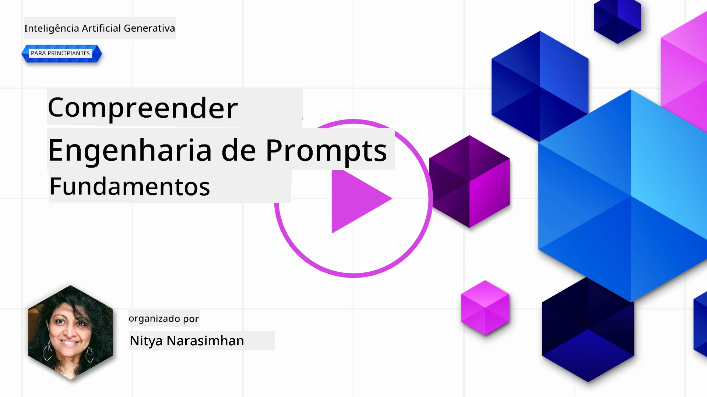
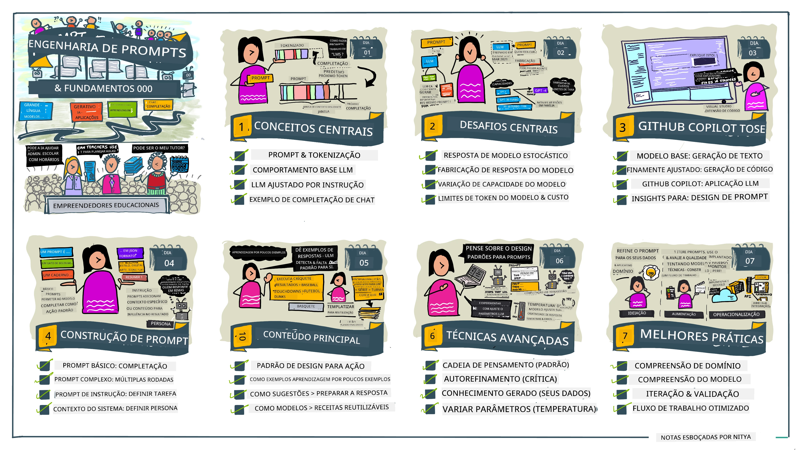
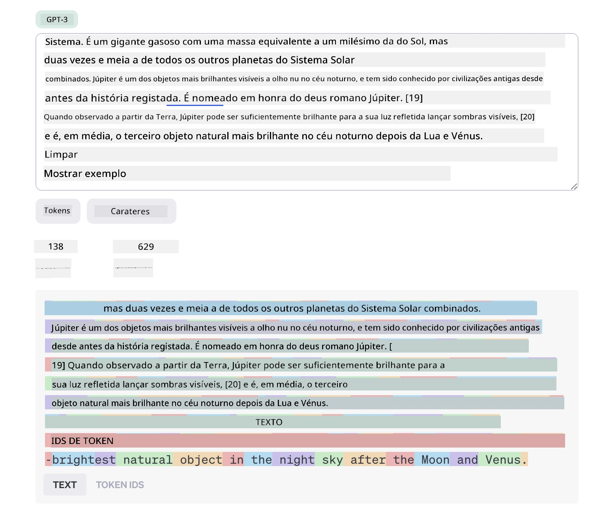
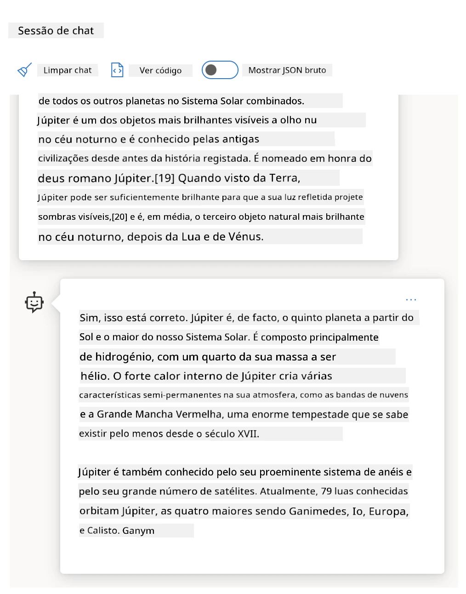
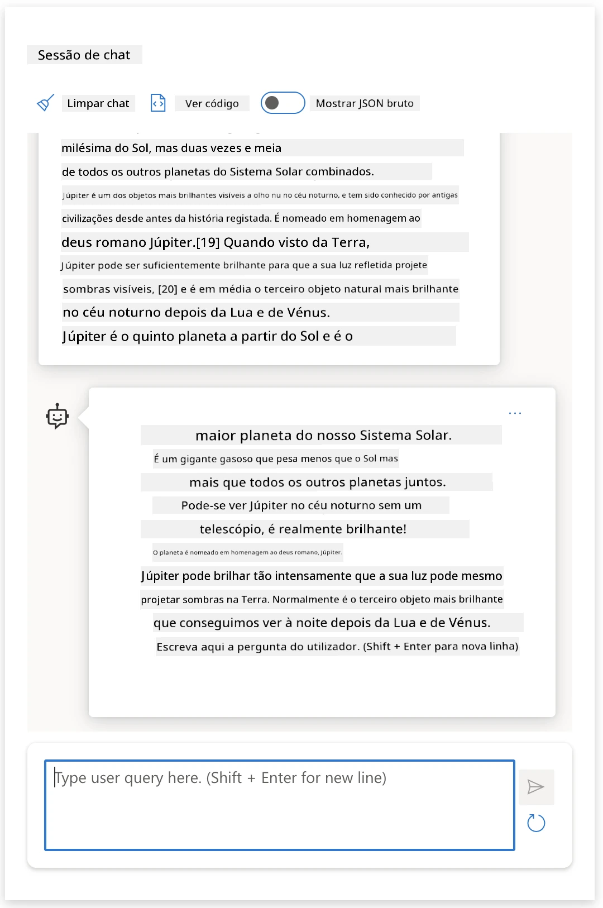
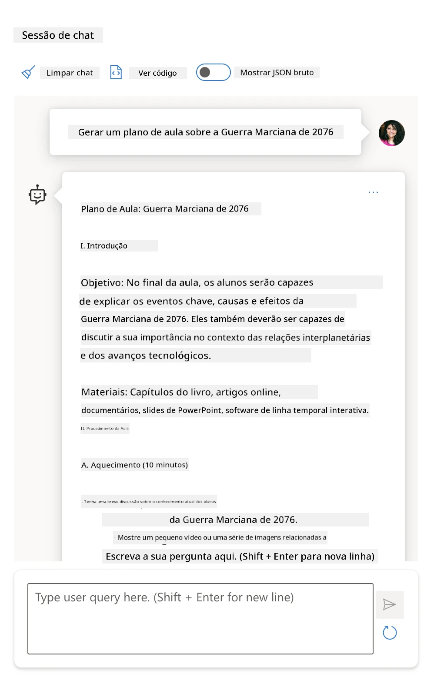
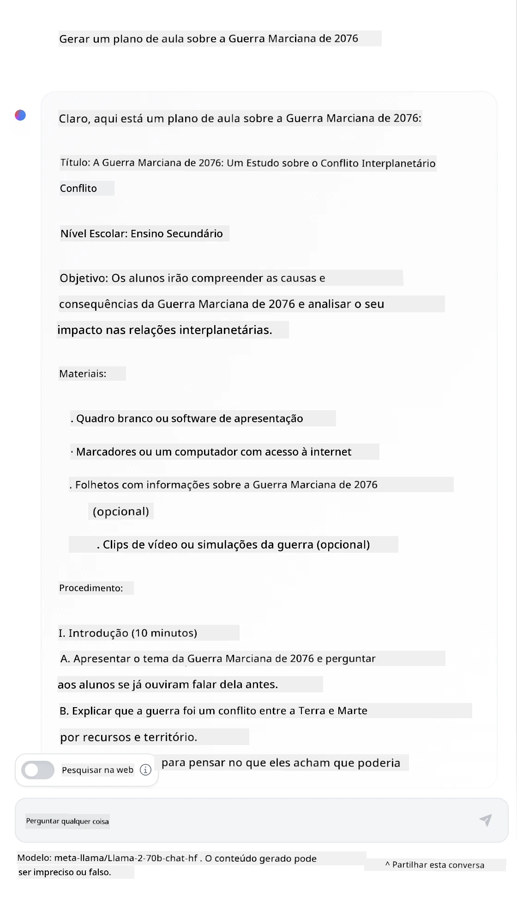

# Fundamentos da Engenharia de Prompts

[](https://youtu.be/GElCu2kUlRs?si=qrXsBvXnCW12epb8)

## Introdução
Este módulo aborda conceitos e técnicas essenciais para criar prompts eficazes em modelos de IA generativa. A forma como escreve o seu prompt para um LLM também é importante. Um prompt cuidadosamente elaborado pode alcançar uma melhor qualidade de resposta. Mas o que exatamente significam termos como _prompt_ e _engenharia de prompt_? E como melhorar a entrada do prompt que envio para o LLM? Estas são as perguntas que tentaremos responder neste e no próximo capítulo.

A _IA generativa_ é capaz de criar novo conteúdo (por exemplo, texto, imagens, áudio, código, etc.) em resposta a pedidos dos utilizadores. Ela consegue isso usando _Grandes Modelos de Linguagem_ como a série GPT da OpenAI ("Transformador Pré-Treinado Generativo") que são treinados para usar linguagem natural e código.

Os utilizadores podem agora interagir com estes modelos usando paradigmas familiares como o chat, sem precisar de conhecimento técnico ou formação. Os modelos são _baseados em prompts_ - os utilizadores enviam uma entrada de texto (prompt) e recebem de volta a resposta da IA (completação). Podem então "conversar com a IA" iterativamente, em diálogos de múltiplas interações, refinando o prompt até que a resposta corresponda às suas expectativas.

Os "prompts" tornam-se agora a principal _interface de programação_ para aplicações de IA generativa, dizendo aos modelos o que fazer e influenciando a qualidade das respostas devolvidas. A "Engenharia de Prompts" é um campo de estudo em rápido crescimento que se foca no _design e otimização_ de prompts para entregar respostas de qualidade e consistentes em escala.

## Objetivos de Aprendizagem

Nesta lição, aprenderemos o que é a Engenharia de Prompts, por que é importante, e como criar prompts mais eficazes para um dado modelo e objetivo da aplicação. Iremos compreender conceitos centrais e melhores práticas para engenharia de prompts – e conhecer um ambiente "sandbox" interativo em Jupyter Notebooks onde podemos ver estes conceitos aplicados a exemplos reais.

No final desta lição seremos capazes de:

1. Explicar o que é engenharia de prompts e por que é importante.
2. Descrever os componentes de um prompt e como são usados.
3. Aprender melhores práticas e técnicas para engenharia de prompts.
4. Aplicar as técnicas aprendidas a exemplos reais, usando um endpoint OpenAI.

## Termos-chave

Engenharia de Prompts: A prática de desenhar e refinar entradas para guiar modelos de IA na produção dos resultados desejados.  
Tokenização: O processo de converter texto em unidades mais pequenas, chamadas tokens, que um modelo consegue entender e processar.  
LLMs Afinados por Instruções: Grandes Modelos de Linguagem (LLMs) que foram ajustados com instruções específicas para melhorar a precisão e relevância das suas respostas.

## Sandbox de Aprendizagem

A engenharia de prompts é atualmente mais arte do que ciência. A melhor forma de melhorar a nossa intuição para ela é _praticar mais_ e adotar uma abordagem de tentativa e erro que combine conhecimento do domínio da aplicação com as técnicas recomendadas e otimizações específicas de modelo.

O Jupyter Notebook que acompanha esta lição fornece um ambiente _sandbox_ onde pode experimentar o que aprende – ao longo do caminho ou como parte do desafio de código no final. Para executar os exercícios, vai precisar de:

1. **Uma chave API Azure OpenAI** – o endpoint do serviço para um LLM implementado.  
2. **Um Runtime Python** – onde o Notebook pode ser executado.  
3. **Variáveis ambientais locais** – _complete os passos no [CONFIGURAÇÃO](./../00-course-setup/02-setup-local.md?WT.mc_id=academic-105485-koreyst) agora para estar preparado_.

O notebook já vem com exercícios _iniciais_ – mas é encorajado que adicione as suas próprias secções de _Markdown_ (descrição) e _Código_ (pedidos de prompt) para experimentar mais exemplos ou ideias e construir a intuição para o design de prompts.

## Guia Ilustrado

Quer ter uma visão geral do que esta lição cobre antes de começar? Confira este guia ilustrado, que lhe dá uma ideia dos principais tópicos abordados e os pontos-chave para refletir em cada um. O roteiro da lição leva-o desde a compreensão dos conceitos e desafios centrais até a abordagem destes com técnicas relevantes de engenharia de prompts e melhores práticas. Note que a secção "Técnicas Avançadas" neste guia refere-se a conteúdo coberto no _próximo_ capítulo deste currículo.



## A Nossa Startup

Agora, vamos falar sobre como _este tópico_ se relaciona com a missão da nossa startup de [trazer inovação em IA para a educação](https://educationblog.microsoft.com/2023/06/collaborating-to-bring-ai-innovation-to-education?WT.mc_id=academic-105485-koreyst). Queremos construir aplicações de IA que potenciem a _aprendizagem personalizada_ – por isso, vamos pensar em como diferentes utilizadores da nossa aplicação poderiam "desenhar" prompts:

- **Administradores** podem pedir à IA para _analisar dados curriculares para identificar lacunas na cobertura_. A IA pode resumir os resultados ou visualizá-los com código.  
- **Educadores** podem pedir à IA para _gerar um plano de aula para um público-alvo e tema específicos_. A IA pode construir o plano personalizado num formato especificado.  
- **Estudantes** podem pedir à IA para _tutorar numa matéria difícil_. A IA pode guiar agora os estudantes com lições, dicas e exemplos ajustados ao seu nível.

Isto é apenas a ponta do iceberg. Confira [Prompts For Education](https://github.com/microsoft/prompts-for-edu/tree/main?WT.mc_id=academic-105485-koreyst) – uma biblioteca open-source de prompts curada por especialistas em educação – para ter uma noção mais ampla das possibilidades! _Experimente correr alguns desses prompts no sandbox ou usar o OpenAI Playground para ver o que acontece!_

<!--
LESSON TEMPLATE:
This unit should cover core concept #1.
Reinforce the concept with examples and references.

CONCEPT #1:
Prompt Engineering.
Define it and explain why it is needed.
-->

## O que é Engenharia de Prompts?

Começámos esta lição definindo **Engenharia de Prompts** como o processo de _desenhar e otimizar_ entradas de texto (prompts) para fornecer respostas consistentes e de qualidade (completações) para um dado objetivo da aplicação e modelo. Podemos pensar neste processo em dois passos:

- _desenhar_ o prompt inicial para um modelo e objetivo específicos  
- _refinar_ iterativamente o prompt para melhorar a qualidade da resposta

Trata-se necessariamente de um processo de tentativa e erro que requer intuição do utilizador e esforço para obter resultados ótimos. Então, porque é importante? Para responder a essa questão, primeiro precisamos compreender três conceitos:

- _Tokenização_ = como o modelo "vê" o prompt  
- _LLMs Base_ = como o modelo base "processa" um prompt  
- _LLMs Afinados por Instruções_ = como o modelo pode agora ver "tarefas"

### Tokenização

Um LLM vê os prompts como uma _sequência de tokens_ onde diferentes modelos (ou versões de um modelo) podem tokenizar o mesmo prompt de formas diferentes. Como os LLMs são treinados em tokens (e não em texto bruto), a forma como os prompts são tokenizados tem um impacto direto na qualidade da resposta gerada.

Para ganhar intuição sobre como a tokenização funciona, experimente ferramentas como o [Tokenizador OpenAI](https://platform.openai.com/tokenizer?WT.mc_id=academic-105485-koreyst) mostrado abaixo. Copie o seu prompt – e veja como ele é convertido em tokens, prestando atenção a como os espaços em branco e sinais de pontuação são tratados. Nota que este exemplo mostra um LLM mais antigo (GPT-3) – por isso experimentar com um modelo mais recente pode produzir um resultado diferente.



### Conceito: Modelos Base

Uma vez tokenizado um prompt, a função principal do ["LLM Base"](https://blog.gopenai.com/an-introduction-to-base-and-instruction-tuned-large-language-models-8de102c785a6?WT.mc_id=academic-105485-koreyst) (ou modelo fundação) é prever o token seguinte nessa sequência. Como os LLMs são treinados com grandes bases de texto, têm uma boa noção da relação estatística entre tokens e podem fazer essa previsão com alguma confiança. Note que eles não compreendem o _significado_ das palavras no prompt ou token; veem apenas um padrão que podem "completar" com a sua próxima previsão. Podem continuar a prever a sequência até serem interrompidos por interferência do utilizador ou por alguma condição pré-estabelecida.

Quer ver como funciona a completação baseada em prompt? Introduza o prompt acima no Azure OpenAI Studio [_Chat Playground_](https://oai.azure.com/playground?WT.mc_id=academic-105485-koreyst) com as configurações padrão. O sistema está configurado para tratar prompts como pedidos de informação – por isso deve ver uma resposta que satisfaça esse contexto.

Mas e se o utilizador quiser algo específico que cumpra certos critérios ou objetivo da tarefa? É aqui que entram os LLMs _afinados por instrução_.



### Conceito: LLMs Afinados por Instrução

Um [LLM Afinado por Instrução](https://blog.gopenai.com/an-introduction-to-base-and-instruction-tuned-large-language-models-8de102c785a6?WT.mc_id=academic-105485-koreyst) começa com o modelo base e aperfeiçoa-o com exemplos ou pares de entrada/saída (por exemplo, "mensagens" múltiplas) que podem conter instruções claras – e a resposta da IA tenta seguir essa instrução.

Isto usa técnicas como Aprendizagem por Reforço com Feedback Humano (RLHF) que podem treinar o modelo para _seguir instruções_ e _aprender com feedback_, produzindo respostas mais adequadas a aplicações práticas e mais relevantes para os objetivos do utilizador.

Vamos experimentar – volte ao prompt acima, mas agora altere a _mensagem do sistema_ para fornecer a seguinte instrução como contexto:

> _Resuma o conteúdo fornecido para um aluno do segundo ano. Mantenha o resultado num único parágrafo com 3-5 pontos bullet._

Veja como o resultado agora está ajustado para refletir o objetivo e o formato desejados? Um educador pode agora usar diretamente esta resposta nas suas diapositivos para essa aula.



## Porque precisamos de Engenharia de Prompts?

Agora que sabemos como os prompts são processados pelos LLMs, vamos falar sobre _porquê_ precisarmos de engenharia de prompts. A resposta está no facto de que os LLMs atuais apresentam vários desafios que tornam mais difícil alcançar _completações fiáveis e consistentes_ sem esforço na construção e otimização do prompt. Por exemplo:

1. **As respostas dos modelos são estocásticas.** O _mesmo prompt_ provavelmente produzirá respostas diferentes em modelos ou versões diferentes. E pode mesmo produzir resultados distintos com o _mesmo modelo_ em momentos diferentes. _As técnicas de engenharia de prompts podem ajudar a minimizar estas variações ao fornecerem melhores guarda-redes_.

1. **Modelos podem fabricar respostas.** Os modelos são pré-treinados com bases de dados _grandes mas finitas_, o que significa que lhes falta conhecimento sobre conceitos fora desse âmbito de treino. Como resultado, podem produzir completações que são imprecisas, imaginárias ou diretamente contraditórias a factos conhecidos. _As técnicas de engenharia de prompts ajudam os utilizadores a identificar e mitigar tais fabricações, por exemplo pedindo citações ou raciocínio à IA_.

1. **As capacidades dos modelos variam.** Modelos mais recentes ou gerações de modelos têm capacidades mais ricas, mas também trazem peculiaridades e compromissos únicos em custo e complexidade. _A engenharia de prompts pode ajudar-nos a desenvolver melhores práticas e fluxos de trabalho que abstraem diferenças e adaptam-se a requisitos específicos de modelos de forma escalável e contínua_.

Vamos ver isto em ação no OpenAI ou Azure OpenAI Playground:

- Use o mesmo prompt em diferentes implementações LLM (por exemplo, OpenAI, Azure OpenAI, Hugging Face) – viu variações?  
- Use o mesmo prompt repetidamente com a _mesma_ implementação LLM (por exemplo, playground Azure OpenAI) – como é que essas variações diferiram?

### Exemplo de Fabricações

Neste curso, usamos o termo **"fabricação"** para referir o fenómeno onde os LLMs por vezes geram informações factualmente incorretas devido a limitações no seu treino ou outras restrições. Poderá também ter ouvido este fenómeno referido como _"alucinações"_ em artigos populares ou trabalhos de investigação. No entanto, recomendamos fortemente usar o termo _"fabricação"_ para não antropomorfizar inadvertidamente o comportamento, atribuindo-lhe uma característica humana num resultado gerado por máquina. Isto também reforça as [diretrizes de IA responsável](https://www.microsoft.com/ai/responsible-ai?WT.mc_id=academic-105485-koreyst) do ponto de vista da terminologia, eliminando termos que podem também ser considerados ofensivos ou não inclusivos em certos contextos.

Quer perceber como funcionam as fabricações? Pense num prompt que instrua a IA a gerar conteúdo para um tópico inexistente (para garantir que não se encontra na base de treino). Por exemplo – experimentei este prompt:

> **Prompt:** gere um plano de aula sobre a Guerra Marciana de 2076.
Uma pesquisa na web mostrou-me que existiam relatos fictícios (por exemplo, séries televisivas ou livros) sobre guerras marcianas – mas nenhuma em 2076. O senso comum também nos diz que 2076 está _no futuro_ e, portanto, não pode estar associado a um evento real.

Então, o que acontece quando executamos este prompt com diferentes fornecedores de LLM?

> **Resposta 1**: OpenAI Playground (GPT-35)


> **Resposta 2**: Azure OpenAI Playground (GPT-35)



> **Resposta 3**: : Hugging Face Chat Playground (LLama-2)



Como esperado, cada modelo (ou versão do modelo) produz respostas ligeiramente diferentes graças ao comportamento estocástico e às variações na capacidade do modelo. Por exemplo, um modelo direciona-se a um público do 8º ano enquanto o outro assume um estudante do ensino secundário. Mas os três modelos geraram respostas que poderiam convencer um utilizador desinformado de que o evento era real.

Técnicas de engenharia de prompts, como _metaprompting_ e _configuração da temperatura_, podem reduzir as fabricações do modelo até certo ponto. Novas _arquiteturas_ de engenharia de prompts também incorporam novas ferramentas e técnicas de forma integrada ao fluxo de prompts, para mitigar ou reduzir alguns destes efeitos.

## Estudo de Caso: GitHub Copilot

Vamos concluir esta secção tendo uma noção de como a engenharia de prompts é usada em soluções do mundo real, olhando para um Estudo de Caso: [GitHub Copilot](https://github.com/features/copilot?WT.mc_id=academic-105485-koreyst).

O GitHub Copilot é o seu "Programador Assistente de IA" – converte prompts de texto em sugestões de código e está integrado no seu ambiente de desenvolvimento (por exemplo, Visual Studio Code) para uma experiência de utilizador fluida. Como documentado na série de blogs abaixo, a versão inicial foi baseada no modelo OpenAI Codex – com os engenheiros rapidamente a perceber a necessidade de ajustar finamente o modelo e desenvolver melhores técnicas de engenharia de prompts, para melhorar a qualidade do código. Em julho, eles [lançaram um modelo de IA melhorado que vai além do Codex](https://github.blog/2023-07-28-smarter-more-efficient-coding-github-copilot-goes-beyond-codex-with-improved-ai-model/?WT.mc_id=academic-105485-koreyst) para sugestões ainda mais rápidas.

Leia os posts por ordem, para seguir a sua jornada de aprendizagem.

- **Maio 2023** | [GitHub Copilot está a ficar melhor a compreender o seu código](https://github.blog/2023-05-17-how-github-copilot-is-getting-better-at-understanding-your-code/?WT.mc_id=academic-105485-koreyst)
- **Maio 2023** | [Por dentro do GitHub: Trabalhar com os LLMs por trás do GitHub Copilot](https://github.blog/2023-05-17-inside-github-working-with-the-llms-behind-github-copilot/?WT.mc_id=academic-105485-koreyst).
- **Junho 2023** | [Como escrever melhores prompts para o GitHub Copilot](https://github.blog/2023-06-20-how-to-write-better-prompts-for-github-copilot/?WT.mc_id=academic-105485-koreyst).
- **Julho 2023** | [.. GitHub Copilot vai além do Codex com modelo de IA melhorado](https://github.blog/2023-07-28-smarter-more-efficient-coding-github-copilot-goes-beyond-codex-with-improved-ai-model/?WT.mc_id=academic-105485-koreyst)
- **Julho 2023** | [Guia do Programador para Engenharia de Prompts e LLMs](https://github.blog/2023-07-17-prompt-engineering-guide-generative-ai-llms/?WT.mc_id=academic-105485-koreyst)
- **Setembro 2023** | [Como construir uma app LLM para empresas: Lições do GitHub Copilot](https://github.blog/2023-09-06-how-to-build-an-enterprise-llm-application-lessons-from-github-copilot/?WT.mc_id=academic-105485-koreyst)

Também pode consultar o seu [blog de Engenharia](https://github.blog/category/engineering/?WT.mc_id=academic-105485-koreyst) para mais posts como [este](https://github.blog/2023-09-27-how-i-used-github-copilot-chat-to-build-a-reactjs-gallery-prototype/?WT.mc_id=academic-105485-koreyst) que mostram como estes modelos e técnicas são _aplicados_ para impulsionar aplicações reais.

---

<!--
LESSON TEMPLATE:
This unit should cover core concept #2.
Reinforce the concept with examples and references.

CONCEPT #2:
Prompt Design.
Illustrated with examples.
-->

## Construção de Prompt

Já vimos porque é que a engenharia de prompts é importante – agora vamos entender como os prompts são _construídos_ para podermos avaliar diferentes técnicas para um design de prompt mais eficaz.

### Prompt Básico

Comecemos com o prompt básico: uma entrada de texto enviada ao modelo sem qualquer outro contexto. Eis um exemplo – quando enviamos as primeiras palavras do hino nacional dos EUA para a OpenAI [Completion API](https://platform.openai.com/docs/api-reference/completions?WT.mc_id=academic-105485-koreyst), esta preenche instantaneamente a resposta com as próximas linhas, ilustrando o comportamento básico de previsão.

| Prompt (Input)     | Completion (Output)                                                                                                                        |
| :----------------- | :----------------------------------------------------------------------------------------------------------------------------------------- |
| Oh say can you see | Parece que está a iniciar a letra do "The Star-Spangled Banner", o hino nacional dos Estados Unidos. A letra completa é ...               |

### Prompt Complexo

Agora vamos adicionar contexto e instruções a esse prompt básico. A [Chat Completion API](https://learn.microsoft.com/azure/ai-services/openai/how-to/chatgpt?WT.mc_id=academic-105485-koreyst) permite construir um prompt complexo como uma coleção de _mensagens_ com:

- pares entrada/saída refletindo a entrada do _utilizador_ e a resposta do _assistente_.
- mensagem do sistema que define o contexto para o comportamento ou personalidade do assistente.

O pedido fica agora na forma abaixo, onde a _tokenização_ capturou eficazmente a informação relevante do contexto e da conversa. Agora, mudar o contexto do sistema pode ser tão impactante na qualidade das conclusões como as entradas do utilizador fornecidas.

```python
response = openai.chat.completions.create(
    model="gpt-3.5-turbo",
    messages=[
        {"role": "system", "content": "You are a helpful assistant."},
        {"role": "user", "content": "Who won the world series in 2020?"},
        {"role": "assistant", "content": "The Los Angeles Dodgers won the World Series in 2020."},
        {"role": "user", "content": "Where was it played?"}
    ]
)
```

### Prompt de Instrução

Nos exemplos acima, o prompt do utilizador era uma simples questão de texto que pode ser interpretada como um pedido de informação. Com prompts de _instrução_, podemos usar esse texto para especificar uma tarefa em mais detalhe, fornecendo uma melhor orientação à IA. Aqui está um exemplo:

| Prompt (Input)                                                                                                                                                                                                                         | Completion (Output)                                                                                                        | Tipo de Instrução    |
| :------------------------------------------------------------------------------------------------------------------------------------------------------------------------------------------------------------------------------------- | :------------------------------------------------------------------------------------------------------------------------- | :------------------ |
| Write a description of the Civil War                                                                                                                                                                                                   | _devolveu um parágrafo simples_                                                                                            | Simples             |
| Write a description of the Civil War. Provide key dates and events and describe their significance                                                                                                                                     | _devolveu um parágrafo seguido de uma lista de datas importantes de eventos com descrições_                                | Complexo            |
| Write a description of the Civil War in 1 paragraph. Provide 3 bullet points with key dates and their significance. Provide 3 more bullet points with key historical figures and their contributions. Return the output as a JSON file | _devolve detalhes mais extensos numa caixa de texto, formatados em JSON que pode copiar-colar para um ficheiro e validar_   | Complexo. Formatado.|

## Conteúdo Primário

Nos exemplos acima, o prompt ainda era bastante aberto, permitindo que o LLM decidisse que parte do seu conjunto de dados pré-treinado era relevante. Com o padrão de design _conteúdo primário_, o texto de entrada divide-se em duas partes:

- uma instrução (ação)
- conteúdo relevante (que influencia a ação)

Aqui está um exemplo onde a instrução é "resuma isto em 2 frases".

| Prompt (Input)                                                                                                                                                                                                                                                                                                                                                                                                                                                                                                                                                                                                                                                                                      | Completion (Output)                                                                                                                                                                                                                                                                             |
| :-------------------------------------------------------------------------------------------------------------------------------------------------------------------------------------------------------------------------------------------------------------------------------------------------------------------------------------------------------------------------------------------------------------------------------------------------------------------------------------------------------------------------------------------------------------------------------------------------------------------------------------------------------------------------------------------------- | :---------------------------------------------------------------------------------------------------------------------------------------------------------------------------------------------------------------------------------------------------------------------------------------------- |
| Jupiter is the fifth planet from the Sun and the largest in the Solar System. It is a gas giant with a mass one-thousandth that of the Sun, but two-and-a-half times that of all the other planets in the Solar System combined. Jupiter is one of the brightest objects visible to the naked eye in the night sky, and has been known to ancient civilizations since before recorded history. It is named after the Roman god Jupiter.[19] When viewed from Earth, Jupiter can be bright enough for its reflected light to cast visible shadows,[20] and is on average the third-brightest natural object in the night sky after the Moon and Venus. <br/> **Summarize this in 2 short sentences** | Júpiter, o quinto planeta a partir do Sol, é o maior do Sistema Solar e é conhecido por ser um dos objetos mais brilhantes no céu noturno. Nomeado em honra do deus romano Júpiter, é um gigante gasoso cuja massa é duas vezes e meia a de todos os outros planetas do Sistema Solar juntos. |

O segmento de conteúdo primário pode ser usado de várias formas para conduzir instruções mais eficazes:

- **Exemplos** – em vez de dizer explicitamente ao modelo o que fazer com uma instrução, dê-lhe exemplos do que fazer e deixe-o inferir o padrão.
- **Indícios** – siga a instrução com um "indício" que prepara a conclusão, orientando o modelo para respostas mais relevantes.
- **Modelos** – são ‘receitas’ repetíveis para prompts com espaços reservados (variáveis) que podem ser personalizados com dados para casos de uso específicos.

Vamos explorar estas formas em ação.

### Usar Exemplos

Esta é uma abordagem onde usa o conteúdo primário para "alimentar o modelo" com alguns exemplos do output desejado para uma dada instrução, e deixa-o inferir o padrão para o output desejado. Com base no número de exemplos fornecidos, podemos ter zero-shot prompting, one-shot prompting, few-shot prompting, etc.

O prompt consiste agora em três componentes:

- Uma descrição da tarefa
- Alguns exemplos do output desejado
- O início de um novo exemplo (que se torna uma descrição implícita da tarefa)

| Tipo de Aprendizagem | Prompt (Input)                                                                                                                                        | Completion (Output)         |
| :------------------- | :---------------------------------------------------------------------------------------------------------------------------------------------------- | :-------------------------- |
| Zero-shot            | "The Sun is Shining". Translate to Spanish                                                                                                            | "El Sol está brillando".    |
| One-shot             | "The Sun is Shining" => ""El Sol está brillando". <br> "It's a Cold and Windy Day" =>                                                                 | "Es un día frío y ventoso". |
| Few-shot             | The player ran the bases => Baseball <br/> The player hit an ace => Tennis <br/> The player hit a six => Cricket <br/> The player made a slam-dunk => | Basketball                  |
|                      |                                                                                                                                                       |                             |

Note como tivemos que fornecer instrução explícita ("Translate to Spanish") no zero-shot prompting, mas esta é inferida no one-shot prompting. O exemplo few-shot mostra como adicionar mais exemplos permite que os modelos façam inferências mais precisas sem instruções adicionais.

### Indícios no Prompt

Outra técnica para usar conteúdo primário é fornecer _indícios_ em vez de exemplos. Neste caso, damos ao modelo um empurrão na direção certa começando com um excerto que reflete o formato da resposta desejada. O modelo então "atua no indício" para continuar nessa linha.

| Número de Indícios | Prompt (Input)                                                                                                                                                                                                                                                                                                                                                                                                                                               | Completion (Output)                                                                                                                                                                                                                                                                                       |
| :----------------- | :----------------------------------------------------------------------------------------------------------------------------------------------------------------------------------------------------------------------------------------------------------------------------------------------------------------------------------------------------------------------------------------------------------------------------------------------------------- | :-------------------------------------------------------------------------------------------------------------------------------------------------------------------------------------------------------------------------------------------------------------------------------------------------------- |
| 0                  | Júpiter é o quinto planeta a partir do Sol e o maior do Sistema Solar. É um gigante gasoso com uma massa mil vezes inferior à do Sol, mas duas vezes e meia a de todos os outros planetas juntos. Júpiter é um dos objetos mais luminosos visíveis a olho nu no céu noturno e é conhecido por civilizações antigas desde antes da história registada. <br/>**Resuma isto**                                   | Júpiter é o maior planeta do nosso Sistema Solar e o quinto a partir do Sol. É um gigante gasoso com uma massa de 1/1000 da massa do Sol, mas que pesa mais que todos os outros planetas juntos. Civilizações antigas conhecem Júpiter há muito tempo, e é facilmente visível no céu noturno.                   |
| 1              | Júpiter é o quinto planeta a partir do Sol e o maior do Sistema Solar. É um gigante gasoso com uma massa equivalente a um milésimo da massa do Sol, mas duas vezes e meia a massa de todos os outros planetas do Sistema Solar juntos. Júpiter é um dos objetos mais brilhantes visíveis a olho nu no céu noturno, e é conhecido por civilizações antigas desde antes da história registada. <br/>**Resumir Isto** <br/> O que aprendemos é que Júpiter | é o quinto planeta a partir do Sol e o maior do Sistema Solar. É um gigante gasoso com uma massa equivalente a um milésimo da do Sol, mas duas vezes e meia a massa de todos os outros planetas juntos. É facilmente visível a olho nu e é conhecido desde os tempos antigos.                        |
| 2              | Júpiter é o quinto planeta a partir do Sol e o maior do Sistema Solar. É um gigante gasoso com uma massa equivalente a um milésimo da massa do Sol, mas duas vezes e meia a massa de todos os outros planetas do Sistema Solar juntos. Júpiter é um dos objetos mais brilhantes visíveis a olho nu no céu noturno, e é conhecido por civilizações antigas desde antes da história registada. <br/>**Resumir Isto** <br/> Top 3 Factos que Aprendemos:         | 1. Júpiter é o quinto planeta a partir do Sol e o maior do Sistema Solar. <br/> 2. É um gigante gasoso com uma massa equivalente a um milésimo da do Sol...<br/> 3. Júpiter tem sido visível a olho nu desde os tempos antigos...                                                                       |
|                |                                                                                                                                                                                                                                                                                                                                                                                                                                                              |                                                                                                                                                                                                                                                                                                           |

### Prompt Templates

Um template de prompt é uma _receita pré-definida para um prompt_ que pode ser guardada e reutilizada conforme necessário, para promover experiências de utilizador mais consistentes em grande escala. Na sua forma mais simples, é simplesmente uma coleção de exemplos de prompts como [este da OpenAI](https://cookbook.openai.com/examples/gpt4-1_prompting_guide?WT.mc_id=academic-105485-koreyst) que fornece tanto os componentes interativos do prompt (mensagens do utilizador e do sistema) como o formato de pedido orientado pela API - para suportar reutilização.

Na sua forma mais complexa como [este exemplo da LangChain](https://python.langchain.com/docs/concepts/prompt_templates/?WT.mc_id=academic-105485-koreyst) contém _placeholders_ que podem ser substituídos por dados de várias fontes (entrada do utilizador, contexto do sistema, fontes de dados externas etc.) para gerar um prompt dinamicamente. Isto permite criar uma biblioteca de prompts reutilizáveis que podem ser usados para conduzir experiências de utilizador consistentes **programaticamente** em grande escala.

Finalmente, o verdadeiro valor dos templates reside na capacidade de criar e publicar _bibliotecas de prompts_ para domínios de aplicação verticais - onde o template do prompt é agora _optimizado_ para refletir o contexto ou exemplos específicos da aplicação que tornam as respostas mais relevantes e precisas para o público-alvo. O repositório [Prompts For Edu](https://github.com/microsoft/prompts-for-edu?WT.mc_id=academic-105485-koreyst) é um excelente exemplo desta abordagem, reunindo uma biblioteca de prompts para o domínio da educação com ênfase em objetivos chave como planeamento de aulas, design curricular, tutoria de estudantes etc.

## Supporting Content

Se pensarmos na construção de prompts como tendo uma instrução (tarefa) e um alvo (conteúdo principal), então o _conteúdo secundário_ é como contexto adicional que fornecemos para **influenciar a saída de alguma forma**. Pode ser parâmetros de afinação, instruções de formatação, taxonomias de tópicos etc. que podem ajudar o modelo a _personalizar_ a sua resposta para corresponder aos objetivos ou expectativas desejadas do utilizador.

Por exemplo: Dado um catálogo de cursos com extensa metadata (nome, descrição, nível, etiquetas de metadata, instrutor etc.) sobre todos os cursos disponíveis no currículo:

- podemos definir uma instrução para "resumir o catálogo de cursos para o Outono de 2023"
- podemos usar o conteúdo principal para fornecer alguns exemplos da saída desejada
- podemos usar o conteúdo secundário para identificar as 5 principais "etiquetas" de interesse.

Agora, o modelo pode fornecer um resumo no formato mostrado pelos exemplos - mas se um resultado tiver múltiplas etiquetas, pode prioritizar as 5 etiquetas identificadas no conteúdo secundário.

---

<!--
LESSON TEMPLATE:
Esta unidade deve cobrir o conceito central #1.
Reforçar o conceito com exemplos e referências.

CONCEITO #3:
Técnicas de Engenharia de Prompts.
Quais são algumas técnicas básicas para engenharia de prompts?
Ilustrar com alguns exercícios.
-->

## Práticas recomendadas para Prompting

Agora que sabemos como os prompts podem ser _construídos_, podemos começar a pensar em como _desenhá-los_ para refletir as melhores práticas. Podemos pensar nisso em duas partes - ter a _mentalidade_ certa e aplicar as _técnicas_ certas.

### Mentalidade de Engenharia de Prompt

A Engenharia de Prompt é um processo de tentativa e erro, por isso tenha três fatores orientadores amplos em mente:

1. **Compreensão do Domínio Importa.** A precisão e relevância da resposta é função do _domínio_ em que essa aplicação ou utilizador opera. Aplique a sua intuição e expertise no domínio para **personalizar técnicas** ainda mais. Por exemplo, defina _personalidades específicas do domínio_ nos seus prompts do sistema, ou use _templates específicos do domínio_ nos prompts do utilizador. Forneça conteúdo secundário que reflita contextos específicos do domínio, ou use _pistas e exemplos específicos do domínio_ para guiar o modelo para padrões de uso familiares.

2. **Compreensão do Modelo Importa.** Sabemos que os modelos são estocásticos por natureza. Mas as implementações dos modelos também podem variar em termos do conjunto de dados de treino que utilizam (conhecimento pré-treinado), das capacidades que oferecem (e.g., via API ou SDK) e do tipo de conteúdo para o qual estão otimizados (e.g, código vs. imagens vs. texto). Compreenda os pontos fortes e limitações do modelo que está a utilizar, e use esse conhecimento para _priorizar tarefas_ ou construir _templates customizados_ que são otimizados para as capacidades do modelo.

3. **Iteração & Validação Importam.** Os modelos evoluem rapidamente, e também as técnicas de engenharia de prompt. Como especialista no domínio, pode ter outro contexto ou critérios para _a sua_ aplicação específica, que podem não se aplicar à comunidade mais ampla. Use ferramentas e técnicas de engenharia de prompt para "dar um pontapé inicial" na construção do prompt, depois itere e valide os resultados usando a sua própria intuição e expertise no domínio. Registe as suas perceções e crie uma **base de conhecimento** (e.g, bibliotecas de prompts) que possam ser usadas como uma nova base para outros, para iterações mais rápidas no futuro.

## Práticas recomendadas

Agora vamos ver práticas recomendadas comuns recomendadas por profissionais da [OpenAI](https://help.openai.com/en/articles/6654000-best-practices-for-prompt-engineering-with-openai-api?WT.mc_id=academic-105485-koreyst) e da [Azure OpenAI](https://learn.microsoft.com/azure/ai-services/openai/concepts/prompt-engineering#best-practices?WT.mc_id=academic-105485-koreyst).

| O quê                             | Porquê                                                                                                                                                                                                                                             |
| :-------------------------------- | :------------------------------------------------------------------------------------------------------------------------------------------------------------------------------------------------------------------------------------------------- |
| Avaliar os modelos mais recentes. | Novas gerações de modelos provavelmente têm funcionalidades e qualidade melhoradas - mas também podem implicar custos mais elevados. Avalie-os quanto ao impacto, depois tome decisões de migração.                                                |
| Separar instruções & contexto     | Verifique se o seu modelo/fornecedor define _delimitadores_ para distinguir instruções, conteúdo primário e secundário mais claramente. Isso pode ajudar os modelos a atribuir pesos mais precisos aos tokens.                                     |
| Ser específico e claro            | Dê mais detalhes sobre o contexto desejado, resultado, comprimento, formato, estilo, etc. Isso irá melhorar tanto a qualidade como a consistência das respostas. Capture receitas em templates reutilizáveis.                                    |
| Ser descritivo, usar exemplos      | Os modelos podem responder melhor a uma abordagem de "mostrar e dizer". Comece com uma abordagem `zero-shot` onde dá uma instrução (mas sem exemplos) e depois tente `few-shot` como refinamento, fornecendo alguns exemplos da saída desejada. Use analogias. |
| Usar pistas para iniciar completions | Impulsione o modelo para um resultado desejado dando-lhe algumas palavras ou frases iniciais que possa usar como ponto de partida para a resposta.                                                                                               |
| Reforçar                        | Às vezes pode precisar repetir-se ao modelo. Dê instruções antes e depois do seu conteúdo principal, use uma instrução e uma pista, etc. Itere e valide para ver o que funciona.                                                                   |
| A ordem importa                  | A ordem em que apresenta a informação ao modelo pode impactar a saída, mesmo nos exemplos de aprendizagem, devido ao viés de recência. Experimente diferentes opções para ver o que funciona melhor.                                                 |
| Dar uma “saída alternativa”      | Dê ao modelo uma resposta de _fallback_ que possa fornecer se não conseguir completar a tarefa por qualquer motivo. Isto pode reduzir a probabilidade de os modelos gerarem respostas falsas ou fabricadas.                                         |
|                                 |                                                                                                                                                                                                                                                    |

Como com qualquer prática recomendada, lembre-se que _a sua experiência pode variar_ conforme o modelo, tarefa e domínio. Use estas como ponto de partida, e itere para encontrar o que funciona melhor para si. Reavalie constantemente o seu processo de engenharia de prompt à medida que novos modelos e ferramentas ficam disponíveis, com foco na escalabilidade do processo e na qualidade da resposta.

<!--
LESSON TEMPLATE:
Esta unidade deve fornecer um desafio de código se aplicável

DESAFIO:
Link para um Jupyter Notebook com apenas comentários de código nas instruções (as secções de código estão vazias).

SOLUÇÃO:
Link para uma cópia desse Notebook com os prompts preenchidos e executados, mostrando como poderia ser um exemplo.
-->

## Tarefa

Parabéns! Chegou ao fim da lição! É tempo de colocar alguns desses conceitos e técnicas à prova com exemplos reais!

Para a nossa tarefa, vamos usar um Jupyter Notebook com exercícios que pode completar interativamente. Pode também estender o Notebook com as suas próprias células de Markdown e código para explorar ideias e técnicas por si próprio.

### Para começar, faça fork do repositório, depois

- (Recomendado) Lance o GitHub Codespaces
- (Alternativamente) Clone o repositório para o seu dispositivo local e use-o com Docker Desktop
- (Alternativamente) Abra o Notebook com o seu ambiente preferido de runtime para Notebooks.

### De seguida, configure as suas variáveis de ambiente

- Copie o ficheiro `.env.copy` da raiz do repositório para `.env` e preencha os valores `AZURE_OPENAI_API_KEY`, `AZURE_OPENAI_ENDPOINT` e `AZURE_OPENAI_DEPLOYMENT`. Volte à secção [Learning Sandbox](#sandbox-de-aprendizagem) para saber como.

### A seguir, abra o Jupyter Notebook

- Selecione o kernel do runtime. Se estiver a usar as opções 1 ou 2, basta selecionar o kernel Python 3.10.x padrão que é fornecido pelo contentor de desenvolvimento.

Está tudo pronto para executar os exercícios. Note que não existem respostas _certas ou erradas_ aqui - apenas explorar opções por tentativa e erro e desenvolver intuição para o que funciona num dado modelo e domínio da aplicação.

_Por esta razão não há segmentos de Solução de Código nesta lição. Em vez disso, o Notebook terá células Markdown intituladas "A Minha Solução:" que mostram um exemplo de saída para referência._

 <!--
LESSON TEMPLATE:
Encerre a secção com um resumo e recursos para aprendizagem autoguiada.
-->

## Verificação de Conhecimento

Qual das seguintes opções é um bom prompt seguindo algumas práticas recomendadas razoáveis?

1. Mostra-me uma imagem de um carro vermelho
2. Mostra-me uma imagem de um carro vermelho da marca Volvo e modelo XC90 estacionado junto a um penhasco com o sol a pôr-se
3. Mostra-me uma imagem de um carro vermelho da marca Volvo e modelo XC90

A: 2, é o melhor prompt pois fornece detalhes sobre o "quê" e entra em especificações (não é um carro qualquer, mas uma marca e modelo específicos) e também descreve o cenário geral. A 3 é a seguinte melhor pois também contém muita descrição.

## 🚀 Desafio

Veja se consegue aproveitar a técnica da "pista" com o prompt: Complete a frase "Mostra-me uma imagem de um carro vermelho da marca Volvo e ". O que responde, e como melhoraria?

## Excelente Trabalho! Continue a sua aprendizagem

Quer aprender mais sobre diferentes conceitos de Engenharia de Prompt? Vá para a [página de aprendizagem continuada](https://aka.ms/genai-collection?WT.mc_id=academic-105485-koreyst) para encontrar outros excelentes recursos sobre este tema.

Vá para a Lição 5 onde vamos explorar [técnicas avançadas de prompting](../05-advanced-prompts/README.md?WT.mc_id=academic-105485-koreyst)!

---

<!-- CO-OP TRANSLATOR DISCLAIMER START -->
**Aviso Legal**:
Este documento foi traduzido utilizando o serviço de tradução automática [Co-op Translator](https://github.com/Azure/co-op-translator). Embora nos esforcemos pela precisão, esteja ciente de que traduções automáticas podem conter erros ou imprecisões. O documento original na sua língua nativa deve ser considerado a fonte autorizada. Para informações críticas, recomenda-se tradução profissional humana. Não nos responsabilizamos por quaisquer mal-entendidos ou interpretações incorretas resultantes da utilização desta tradução.
<!-- CO-OP TRANSLATOR DISCLAIMER END -->