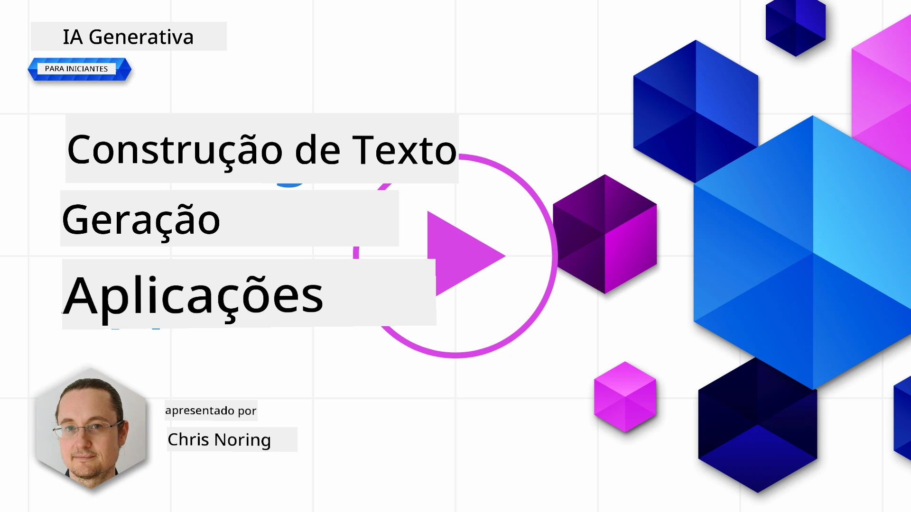

# Construir Aplicações de Geração de Texto

[](https://youtu.be/0Y5Luf5sRQA?si=t_xVg0clnAI4oUFZ)

> _(Clique na imagem acima para ver o vídeo desta lição)_

Viste até agora ao longo deste currículo que existem conceitos base como prompts e até uma disciplina inteira chamada "engenharia de prompts". Muitas ferramentas com as quais podes interagir, como o ChatGPT, Office 365, Microsoft Power Platform e outras, suportam o uso de prompts para realizar algo.

Para adicionares essa experiência a uma aplicação, precisas de entender conceitos como prompts, completações e escolher uma biblioteca para trabalhar. É exatamente isso que vais aprender neste capítulo.

## Introdução

Neste capítulo, vais:

- Aprender sobre a biblioteca openai e os seus conceitos principais.
- Construir uma aplicação de geração de texto usando openai.
- Compreender como usar conceitos como prompt, temperatura e tokens para construir uma aplicação de geração de texto.

## Objetivos de aprendizagem

No final desta lição, serás capaz de:

- Explicar o que é uma aplicação de geração de texto.
- Construir uma aplicação de geração de texto usando openai.
- Configurar a tua aplicação para usar mais ou menos tokens e também alterar a temperatura, para um resultado variado.

## O que é uma aplicação de geração de texto?

Normalmente, quando constróis uma aplicação, ela possui algum tipo de interface, como a seguinte:

- Baseada em comandos. Aplicações de consola são típicas aplicações onde escreves um comando e realizam uma tarefa. Por exemplo, `git` é uma aplicação baseada em comandos.
- Interface de utilizador (UI). Algumas aplicações têm interfaces gráficas (GUIs) onde clicas em botões, inseres texto, selecionas opções e mais.

### Aplicações de consola e UI são limitadas

Compara com uma aplicação baseada em comandos onde escreves um comando:

- **É limitada**. Não podes simplesmente escrever qualquer comando, apenas aqueles que a aplicação suporta.
- **Específica para linguagem**. Algumas aplicações suportam muitas linguagens, mas por padrão a aplicação é construída para uma linguagem específica, mesmo que possas adicionar mais suporte a linguagens.

### Benefícios das aplicações de geração de texto

Então, como é que uma aplicação de geração de texto é diferente?

Numa aplicação de geração de texto, tens mais flexibilidade, não estás limitado a um conjunto de comandos ou a uma linguagem específica de entrada. Em vez disso, podes usar linguagem natural para interagir com a aplicação. Outro benefício é que já estás a interagir com uma fonte de dados que foi treinada num vasto corpus de informação, enquanto uma aplicação tradicional pode estar limitada ao que está numa base de dados.

### O que posso construir com uma aplicação de geração de texto?

Existem muitas coisas que podes construir. Por exemplo:

- **Um chatbot**. Um chatbot a responder a perguntas sobre tópicos, como a tua empresa e os seus produtos, pode ser uma boa opção.
- **Assistente**. Os LLMs são ótimos para coisas como resumir texto, obter insights de texto, produzir textos como currículos e mais.
- **Assistente de código**. Dependendo do modelo de linguagem que usas, podes construir um assistente de código que ajuda a escrever código. Por exemplo, podes usar um produto como o GitHub Copilot assim como o ChatGPT para ajudar a escrever código.

## Como posso começar?

Bem, precisas encontrar uma forma de integrar com um LLM, o que normalmente implica as duas abordagens seguintes:

- Usar uma API. Aqui estás a construir pedidos web com o teu prompt e recebes o texto gerado de volta.
- Usar uma biblioteca. As bibliotecas ajudam a encapsular as chamadas de API e facilitam o seu uso.

## Bibliotecas/SDKs

Existem algumas bibliotecas bem conhecidas para trabalhar com LLMs, como:

- **openai**, esta biblioteca facilita a conexão ao teu modelo e o envio de prompts.

Depois, existem bibliotecas que operam a um nível superior, como:

- **Langchain**. Langchain é bem conhecido e suporta Python.
- **Semantic Kernel**. Semantic Kernel é uma biblioteca da Microsoft que suporta as linguagens C#, Python e Java.

## Primeira aplicação usando openai

Vamos ver como podemos construir a nossa primeira aplicação, quais bibliotecas precisamos, o quanto é necessário e assim por diante.

### Instalar openai

Existem muitas bibliotecas por aí para interagir com OpenAI ou Azure OpenAI. É possível usar diversas linguagens de programação também, como C#, Python, JavaScript, Java e mais. Escolhemos usar a biblioteca Python `openai`, por isso vamos usar o `pip` para a instalar.

```bash
pip install openai
```

### Criar um recurso

Precisas de realizar os seguintes passos:

- Criar uma conta na Azure [https://azure.microsoft.com/free/](https://azure.microsoft.com/free/?WT.mc_id=academic-105485-koreyst).
- Obter acesso ao Azure OpenAI. Vai a [https://learn.microsoft.com/azure/ai-services/openai/overview#how-do-i-get-access-to-azure-openai](https://learn.microsoft.com/azure/ai-services/openai/overview#how-do-i-get-access-to-azure-openai?WT.mc_id=academic-105485-koreyst) e pede acesso.

  > [!NOTE]
  > No momento da escrita, precisas de aplicar para obter acesso ao Azure OpenAI.

- Instalar Python <https://www.python.org/>
- Criar um recurso de Serviço Azure OpenAI. Consulta este guia para saber como [criar um recurso](https://learn.microsoft.com/azure/ai-services/openai/how-to/create-resource?pivots=web-portal?WT.mc_id=academic-105485-koreyst).

### Localizar chave da API e endpoint

Neste momento, precisas de dizer à tua biblioteca `openai` que chave da API usar. Para encontrares a tua chave da API, vai à secção "Chaves e Endpoint" do teu recurso Azure OpenAI e copia o valor da "Chave 1".


Agora que tens essa informação copiada, vamos instruir as bibliotecas a usá-la.

> [!NOTE]
> Vale a pena separar a tua chave API do código. Podes fazer isso usando variáveis de ambiente.
>
> - Define a variável de ambiente `OPENAI_API_KEY` com a tua chave API.
>   `export OPENAI_API_KEY='sk-...'`

### Configurar configuração Azure

Se estiveres a usar Azure OpenAI (agora parte do Microsoft Foundry), aqui está como configurar. Usamos o cliente padrão `OpenAI` apontado ao endpoint do Azure OpenAI `/openai/v1/`, que funciona com a API Responses e não precisa de `api_version`:

```python
import os
from openai import OpenAI

client = OpenAI(
    api_key=os.environ["AZURE_OPENAI_API_KEY"],
    base_url=f"{os.environ['AZURE_OPENAI_ENDPOINT'].rstrip('/')}/openai/v1/",
)
```

Acima estamos a definir o seguinte:

- `api_key`, esta é a tua chave API encontrada no Azure Portal ou portal Microsoft Foundry.
- `base_url`, este é o endpoint do teu recurso Foundry com `/openai/v1/` acrescentado. O endpoint estável v1 funciona tanto com OpenAI como Azure OpenAI sem necessidade de gerir `api_version`.

> [!NOTE] > `os.environ` lê variáveis de ambiente. Podes usá-lo para ler variáveis como `AZURE_OPENAI_API_KEY` e `AZURE_OPENAI_ENDPOINT`. Define estas variáveis de ambiente no terminal ou usando uma biblioteca como `dotenv`.

## Gerar texto

A forma de gerar texto é usar a API Responses via o método `responses.create`. Eis um exemplo:

```python
prompt = "Complete the following: Once upon a time there was a"

response = client.responses.create(
    model="gpt-4o-mini",  # este é o nome do seu deployment do modelo
    input=prompt,
    store=False,
)
print(response.output_text)
```

No código acima, criamos uma resposta e passamos o modelo que queremos usar e o prompt. Depois imprimimos o texto gerado via `response.output_text`.

### Conversas multi-turno

A API Responses é bem adequada tanto para geração de texto de um único turno como para chatbots multi-turno – forneces uma lista de mensagens em `input` para construir uma conversa:

```python
from openai import OpenAI

client = OpenAI(api_key="sk-...")

response = client.responses.create(model="gpt-4o-mini", input="Hello world", store=False)
print(response.output_text)
```

Mais sobre esta funcionalidade num capítulo futuro.

## Exercício - a tua primeira aplicação de geração de texto

Agora que aprendemos como configurar e configurar openai, é tempo de construir a tua primeira aplicação de geração de texto. Para construir a tua aplicação, segue estes passos:

1. Cria um ambiente virtual e instala openai:

   ```bash
   python -m venv venv
   source venv/bin/activate
   pip install openai
   ```

   > [!NOTE]
   > Se estiveres a usar Windows escreve `venv\Scripts\activate` em vez de `source venv/bin/activate`.

   > [!NOTE]
   > Encontra a tua chave Azure OpenAI indo a [https://portal.azure.com/](https://portal.azure.com/?WT.mc_id=academic-105485-koreyst) e procura por `Open AI`, seleciona o `Recurso Open AI` e depois seleciona `Chaves e Endpoint` e copia o valor de `Chave 1`.

1. Cria um ficheiro _app.py_ e coloca o seguinte código:

   ```python
   import os
   from openai import OpenAI

   client = OpenAI(
       api_key="<replace this value with your Azure OpenAI key>",
       base_url="<endpoint found in Azure Portal>/openai/v1/",
   )
   deployment_name = "<deployment name>"

   # adicione o seu código de conclusão
   prompt = "Complete the following: Once upon a time there was a"

   # faça um pedido usando a API de Respostas
   response = client.responses.create(model=deployment_name, input=prompt, store=False)

   # imprima a resposta
   print(response.output_text)
   ```

   > [!NOTE]
   > Se estiveres a usar OpenAI puro (não Azure), usa `client = OpenAI(api_key="<substitui este valor pela tua chave OpenAI>")` (sem `base_url`) e passa um nome de modelo como `gpt-4o-mini` em vez de um nome de deployment.

   Deverás ver uma saída semelhante à seguinte:

   ```output
    very unhappy _____.

   Once upon a time there was a very unhappy mermaid.
   ```

## Diferentes tipos de prompts, para diferentes coisas

Agora viste como gerar texto usando um prompt. Tens até um programa a correr que podes modificar e alterar para gerar diferentes tipos de texto.

Prompts podem ser usados para todo o tipo de tarefas. Por exemplo:

- **Gerar um tipo de texto**. Por exemplo, podes gerar um poema, perguntas para um quiz, etc.
- **Pesquisar informação**. Podes usar prompts para procurar informação como no exemplo: 'O que significa CORS no desenvolvimento web?'.
- **Gerar código**. Podes usar prompts para gerar código, por exemplo desenvolver uma expressão regular para validar emails ou porque não gerar um programa inteiro, como uma aplicação web?

## Um caso de uso mais prático: um gerador de receitas

Imagina que tens ingredientes em casa e queres cozinhar algo. Para isso, precisas de uma receita. Uma forma de encontrar receitas é usar um motor de busca ou podes usar um LLM para o fazer.

Podes escrever um prompt assim:

> "Mostra-me 5 receitas para um prato com os seguintes ingredientes: frango, batatas, e cenouras. Para cada receita, lista todos os ingredientes usados"

Dado o prompt acima, podes receber uma resposta semelhante a:

```output
1. Roasted Chicken and Vegetables:
Ingredients:
- 4 chicken thighs
- 2 potatoes, cut into cubes
- 2 carrots, cut into cubes
- 2 tablespoons olive oil
- 2 cloves garlic, minced
- 1 teaspoon dried thyme
- 1 teaspoon dried oregano
- Salt and pepper, to taste

2. Chicken and Potato Stew:
Ingredients:
- 2 tablespoons olive oil
- 1 onion, diced
- 2 cloves garlic, minced
- 2 chicken breasts, cut into cubes
- 2 potatoes, cut into cubes
- 2 carrots, cut into cubes
- 1 teaspoon dried oregano
- 1 teaspoon dried thyme
- 1 cup chicken broth
- Salt and pepper, to taste

3. Chicken and Potato Bake:
Ingredients:
- 2 tablespoons olive oil
- 2 chicken breasts, cut into cubes
- 2 potatoes, cut into cubes
- 2 carrots, cut into cubes
- 1 onion, diced
- 2 cloves garlic, minced
- 1 teaspoon dried oregano
- 1 teaspoon dried thyme
- 1 cup chicken broth
- Salt and pepper, to taste

4. Chicken and Potato Soup:
Ingredients:
- 2 tablespoons olive oil
- 1 onion, diced
- 2 cloves garlic, minced
- 2 chicken breasts, cut into cubes
- 2 potatoes, cut into cubes
- 2 carrots, cut into cubes
- 1 teaspoon dried oregano
- 1 teaspoon dried thyme
- 4 cups chicken broth
- Salt and pepper, to taste

5. Chicken and Potato Hash:
Ingredients:
- 2 tablespoons olive oil
- 2 chicken breasts, cut into cubes
- 2 potatoes, cut into cubes
- 2 carrots, cut into cubes
- 1 onion, diced
- 2 cloves garlic, minced
- 1 teaspoon dried oregano
```

Este resultado é ótimo, sei o que cozinhar. Neste ponto, melhorias úteis poderiam ser:

- Filtrar ingredientes que não gosto ou sou alérgico.
- Produzir uma lista de compras, caso não tenha todos os ingredientes em casa.

Para os casos acima, vamos adicionar um prompt adicional:

> "Por favor, remove receitas com alho pois sou alérgico e substitui por outro ingrediente. Além disso, por favor produz uma lista de compras para as receitas, considerando que já tenho frango, batatas e cenouras em casa."

Agora tens um novo resultado, nomeadamente:

```output
1. Roasted Chicken and Vegetables:
Ingredients:
- 4 chicken thighs
- 2 potatoes, cut into cubes
- 2 carrots, cut into cubes
- 2 tablespoons olive oil
- 1 teaspoon dried thyme
- 1 teaspoon dried oregano
- Salt and pepper, to taste

2. Chicken and Potato Stew:
Ingredients:
- 2 tablespoons olive oil
- 1 onion, diced
- 2 chicken breasts, cut into cubes
- 2 potatoes, cut into cubes
- 2 carrots, cut into cubes
- 1 teaspoon dried oregano
- 1 teaspoon dried thyme
- 1 cup chicken broth
- Salt and pepper, to taste

3. Chicken and Potato Bake:
Ingredients:
- 2 tablespoons olive oil
- 2 chicken breasts, cut into cubes
- 2 potatoes, cut into cubes
- 2 carrots, cut into cubes
- 1 onion, diced
- 1 teaspoon dried oregano
- 1 teaspoon dried thyme
- 1 cup chicken broth
- Salt and pepper, to taste

4. Chicken and Potato Soup:
Ingredients:
- 2 tablespoons olive oil
- 1 onion, diced
- 2 chicken breasts, cut into cubes
- 2 potatoes, cut into cubes
- 2 carrots, cut into cubes
- 1 teaspoon dried oregano
- 1 teaspoon dried thyme
- 4 cups chicken broth
- Salt and pepper, to taste

5. Chicken and Potato Hash:
Ingredients:
- 2 tablespoons olive oil
- 2 chicken breasts, cut into cubes
- 2 potatoes, cut into cubes
- 2 carrots, cut into cubes
- 1 onion, diced
- 1 teaspoon dried oregano

Shopping List:
- Olive oil
- Onion
- Thyme
- Oregano
- Salt
- Pepper
```

São as tuas cinco receitas, sem alho mencionado e também tens uma lista de compras considerando o que já tens em casa.

## Exercício - construir um gerador de receitas

Agora que encenámos um cenário, vamos escrever código para corresponder ao cenário demonstrado. Para isso, segue estes passos:

1. Usa o ficheiro _app.py_ existente como ponto de partida
1. Localiza a variável `prompt` e muda o seu código para o seguinte:

   ```python
   prompt = "Show me 5 recipes for a dish with the following ingredients: chicken, potatoes, and carrots. Per recipe, list all the ingredients used"
   ```

   Se agora executares o código, deverás ver uma saída semelhante a:

   ```output
   -Chicken Stew with Potatoes and Carrots: 3 tablespoons oil, 1 onion, chopped, 2 cloves garlic, minced, 1 carrot, peeled and chopped, 1 potato, peeled and chopped, 1 bay leaf, 1 thyme sprig, 1/2 teaspoon salt, 1/4 teaspoon black pepper, 1 1/2 cups chicken broth, 1/2 cup dry white wine, 2 tablespoons chopped fresh parsley, 2 tablespoons unsalted butter, 1 1/2 pounds boneless, skinless chicken thighs, cut into 1-inch pieces
   -Oven-Roasted Chicken with Potatoes and Carrots: 3 tablespoons extra-virgin olive oil, 1 tablespoon Dijon mustard, 1 tablespoon chopped fresh rosemary, 1 tablespoon chopped fresh thyme, 4 cloves garlic, minced, 1 1/2 pounds small red potatoes, quartered, 1 1/2 pounds carrots, quartered lengthwise, 1/2 teaspoon salt, 1/4 teaspoon black pepper, 1 (4-pound) whole chicken
   -Chicken, Potato, and Carrot Casserole: cooking spray, 1 large onion, chopped, 2 cloves garlic, minced, 1 carrot, peeled and shredded, 1 potato, peeled and shredded, 1/2 teaspoon dried thyme leaves, 1/4 teaspoon salt, 1/4 teaspoon black pepper, 2 cups fat-free, low-sodium chicken broth, 1 cup frozen peas, 1/4 cup all-purpose flour, 1 cup 2% reduced-fat milk, 1/4 cup grated Parmesan cheese

   -One Pot Chicken and Potato Dinner: 2 tablespoons olive oil, 1 pound boneless, skinless chicken thighs, cut into 1-inch pieces, 1 large onion, chopped, 3 cloves garlic, minced, 1 carrot, peeled and chopped, 1 potato, peeled and chopped, 1 bay leaf, 1 thyme sprig, 1/2 teaspoon salt, 1/4 teaspoon black pepper, 2 cups chicken broth, 1/2 cup dry white wine

   -Chicken, Potato, and Carrot Curry: 1 tablespoon vegetable oil, 1 large onion, chopped, 2 cloves garlic, minced, 1 carrot, peeled and chopped, 1 potato, peeled and chopped, 1 teaspoon ground coriander, 1 teaspoon ground cumin, 1/2 teaspoon ground turmeric, 1/2 teaspoon ground ginger, 1/4 teaspoon cayenne pepper, 2 cups chicken broth, 1/2 cup dry white wine, 1 (15-ounce) can chickpeas, drained and rinsed, 1/2 cup raisins, 1/2 cup chopped fresh cilantro
   ```

   > NOTA, o teu LLM é não determinístico, por isso podes obter resultados diferentes cada vez que executas o programa.

   Ótimo, vamos ver como podemos melhorar as coisas. Para melhorar, queremos garantir que o código seja flexível, para que os ingredientes e o número de receitas possam ser alterados e aprimorados.

1. Vamos mudar o código da seguinte forma:

   ```python
   no_recipes = input("No of recipes (for example, 5): ")

   ingredients = input("List of ingredients (for example, chicken, potatoes, and carrots): ")

   # interpolar o número de receitas no prompt e nos ingredientes
   prompt = f"Show me {no_recipes} recipes for a dish with the following ingredients: {ingredients}. Per recipe, list all the ingredients used"
   ```

   Executar o código para um teste pode ficar assim:

   ```output
   No of recipes (for example, 5): 3
   List of ingredients (for example, chicken, potatoes, and carrots): milk,strawberries

   -Strawberry milk shake: milk, strawberries, sugar, vanilla extract, ice cubes
   -Strawberry shortcake: milk, flour, baking powder, sugar, salt, unsalted butter, strawberries, whipped cream
   -Strawberry milk: milk, strawberries, sugar, vanilla extract
   ```

### Melhorar adicionando filtro e lista de compras

Agora temos uma aplicação funcional capaz de produzir receitas e é flexível pois depende dos inputs do utilizador, tanto no número de receitas como nos ingredientes usados.

Para a melhorar ainda mais, queremos adicionar o seguinte:

- **Filtrar ingredientes**. Queremos poder filtrar ingredientes que não gostamos ou que somos alérgicos. Para esta mudança, podemos editar o nosso prompt existente e adicionar uma condição de filtro no final, assim:

  ```python
  filter = input("Filter (for example, vegetarian, vegan, or gluten-free): ")

  prompt = f"Show me {no_recipes} recipes for a dish with the following ingredients: {ingredients}. Per recipe, list all the ingredients used, no {filter}"
  ```

  Acima, adicionamos `{filter}` ao final do prompt e também capturamos o valor do filtro do utilizador.

  Um exemplo de input ao executar o programa pode agora parecer assim:

  ```output
  No of recipes (for example, 5): 3
  List of ingredients (for example, chicken, potatoes, and carrots): onion,milk
  Filter (for example, vegetarian, vegan, or gluten-free): no milk

  1. French Onion Soup

  Ingredients:

  -1 large onion, sliced
  -3 cups beef broth
  -1 cup milk
  -6 slices french bread
  -1/4 cup shredded Parmesan cheese
  -1 tablespoon butter
  -1 teaspoon dried thyme
  -1/4 teaspoon salt
  -1/4 teaspoon black pepper

  Instructions:

  1. In a large pot, sauté onions in butter until golden brown.
  2. Add beef broth, milk, thyme, salt, and pepper. Bring to a boil.
  3. Reduce heat and simmer for 10 minutes.
  4. Place french bread slices on soup bowls.
  5. Ladle soup over bread.
  6. Sprinkle with Parmesan cheese.

  2. Onion and Potato Soup

  Ingredients:

  -1 large onion, chopped
  -2 cups potatoes, diced
  -3 cups vegetable broth
  -1 cup milk
  -1/4 teaspoon black pepper

  Instructions:

  1. In a large pot, sauté onions in butter until golden brown.
  2. Add potatoes, vegetable broth, milk, and pepper. Bring to a boil.
  3. Reduce heat and simmer for 10 minutes.
  4. Serve hot.

  3. Creamy Onion Soup

  Ingredients:

  -1 large onion, chopped
  -3 cups vegetable broth
  -1 cup milk
  -1/4 teaspoon black pepper
  -1/4 cup all-purpose flour
  -1/2 cup shredded Parmesan cheese

  Instructions:

  1. In a large pot, sauté onions in butter until golden brown.
  2. Add vegetable broth, milk, and pepper. Bring to a boil.
  3. Reduce heat and simmer for 10 minutes.
  4. In a small bowl, whisk together flour and Parmesan cheese until smooth.
  5. Add to soup and simmer for an additional 5 minutes, or until soup has thickened.
  ```

  Como podes ver, receitas com leite foram filtradas. Mas, se fores intolerante à lactose, talvez queiras filtrar receitas com queijo também, por isso é preciso ser claro.


- **Produzir uma lista de compras**. Queremos produzir uma lista de compras, tendo em conta o que já temos em casa.

  Para esta funcionalidade, podemos tentar resolver tudo num único prompt ou podemos dividi-lo em dois prompts. Vamos tentar a segunda abordagem. Aqui estamos a sugerir adicionar um prompt adicional, mas para isso funcionar, precisamos de adicionar o resultado do primeiro prompt como contexto para o segundo prompt.

  Localize a parte no código que imprime o resultado do primeiro prompt e adicione o seguinte código abaixo:

  ```python
  old_prompt_result = response.output_text
  prompt = "Produce a shopping list for the generated recipes and please don't include ingredients that I already have."

  new_prompt = f"{old_prompt_result} {prompt}"
  response = client.responses.create(model=deployment_name, input=new_prompt, max_output_tokens=1200, store=False)

  # imprimir resposta
  print("Shopping list:")
  print(response.output_text)
  ```

  Note o seguinte:

  1. Estamos a construir um novo prompt adicionando o resultado do primeiro prompt ao novo prompt:

     ```python
     new_prompt = f"{old_prompt_result} {prompt}"
     ```

  1. Fazemos uma nova requisição, mas também considerando o número de tokens que pedimos no primeiro prompt, por isso desta vez dizemos que `max_output_tokens` é 1200.

     ```python
     response = client.responses.create(model=deployment_name, input=new_prompt, max_output_tokens=1200, store=False)
     ```

     Testando este código, agora obtemos a seguinte saída:

     ```output
     No of recipes (for example, 5): 2
     List of ingredients (for example, chicken, potatoes, and carrots): apple,flour
     Filter (for example, vegetarian, vegan, or gluten-free): sugar


     -Apple and flour pancakes: 1 cup flour, 1/2 tsp baking powder, 1/2 tsp baking soda, 1/4 tsp salt, 1 tbsp sugar, 1 egg, 1 cup buttermilk or sour milk, 1/4 cup melted butter, 1 Granny Smith apple, peeled and grated
     -Apple fritters: 1-1/2 cups flour, 1 tsp baking powder, 1/4 tsp salt, 1/4 tsp baking soda, 1/4 tsp nutmeg, 1/4 tsp cinnamon, 1/4 tsp allspice, 1/4 cup sugar, 1/4 cup vegetable shortening, 1/4 cup milk, 1 egg, 2 cups shredded, peeled apples
     Shopping list:
     -Flour, baking powder, baking soda, salt, sugar, egg, buttermilk, butter, apple, nutmeg, cinnamon, allspice
     ```

## Melhore a sua configuração

O que temos até agora é um código que funciona, mas há alguns ajustes que deveríamos fazer para melhorar ainda mais. Algumas coisas que devemos fazer são:

- **Separar segredos do código**, como a chave da API. Segredos não pertencem ao código e devem ser armazenados num local seguro. Para separar segredos do código, podemos usar variáveis de ambiente e bibliotecas como `python-dotenv` para as carregar a partir de um ficheiro. Aqui está como isso ficaria em código:

  1. Crie um ficheiro `.env` com o seguinte conteúdo:

     ```bash
     OPENAI_API_KEY=sk-...
     ```

     > Nota, para Azure OpenAI no Microsoft Foundry, precisa de definir as seguintes variáveis de ambiente em vez disso:

     ```bash
     AZURE_OPENAI_API_KEY=<replace>
     AZURE_OPENAI_ENDPOINT=<replace>
     AZURE_OPENAI_API_VERSION=2024-10-21
     ```

     Em código, carregaria as variáveis de ambiente assim:

     ```python
     import os
     from dotenv import load_dotenv
     from openai import OpenAI

     load_dotenv()

     client = OpenAI(api_key=os.environ["OPENAI_API_KEY"])
     ```

- **Uma palavra sobre o comprimento dos tokens**. Devemos considerar quantos tokens precisamos para gerar o texto que queremos. Tokens custam dinheiro, por isso, sempre que for possível, devemos tentar ser económicos com o número de tokens que usamos. Por exemplo, podemos formular o prompt para usarmos menos tokens?

  Para alterar os tokens utilizados, pode usar o parâmetro `max_output_tokens`. Por exemplo, se quiser usar 100 tokens, faria:

  ```python
  response = client.responses.create(model=deployment, input=prompt, max_output_tokens=100, store=False)
  ```

- **Experimentar com a temperatura**. A temperatura é algo que ainda não mencionámos, mas é um contexto importante para o desempenho do nosso programa. Quanto maior o valor da temperatura, mais aleatória será a saída. Por outro lado, quanto menor o valor da temperatura, mais previsível será a saída. Considere se quer variação na sua saída ou não.

  Para alterar a temperatura, pode usar o parâmetro `temperature`. Por exemplo, se quiser usar uma temperatura de 0.5, faria:

  ```python
  response = client.responses.create(model=deployment, input=prompt, temperature=0.5, store=False)
  ```

  > Nota, quanto mais perto de 1.0, mais variada será a saída.

## Tarefa

Para esta tarefa, pode escolher o que construir.

Aqui estão algumas sugestões:

- Ajuste a aplicação geradora de receitas para a melhorar ainda mais. Experimente valores de temperatura e os prompts para ver o que consegue criar.
- Construa um "amigo de estudo". Esta aplicação deve ser capaz de responder a perguntas sobre um tópico, por exemplo Python, poderá ter prompts como "O que é um certo tópico em Python?", ou poderá ter um prompt que diz, mostre-me código para um certo tópico, etc.
- Bot de História, faça a história ganhar vida, instrua o bot a interpretar uma personagem histórica e faça-lhe perguntas sobre a sua vida e época.

## Solução

### Amigo de estudo

Abaixo está um prompt inicial, veja como o pode usar e ajustar ao seu gosto.

```text
- "You're an expert on the Python language

    Suggest a beginner lesson for Python in the following format:

    Format:
    - concepts:
    - brief explanation of the lesson:
    - exercise in code with solutions"
```

### Bot de História

Aqui estão alguns prompts que poderia usar:

```text
- "You are Abe Lincoln, tell me about yourself in 3 sentences, and respond using grammar and words like Abe would have used"
- "You are Abe Lincoln, respond using grammar and words like Abe would have used:

   Tell me about your greatest accomplishments, in 300 words"
```

## Verificação de conhecimento

O que faz o conceito de temperatura?

1. Controla o quão aleatória é a saída.
1. Controla o tamanho da resposta.
1. Controla quantos tokens são usados.

## 🚀 Desafio

Quando trabalhar na tarefa, tente variar a temperatura, experimente defini-la para 0, 0.5 e 1. Lembre-se que 0 é o menos variado e 1 é o mais. Qual valor funciona melhor para a sua aplicação?

## Excelente trabalho! Continue a sua aprendizagem

Depois de completar esta lição, explore a nossa [coleção de aprendizagem de IA Generativa](https://aka.ms/genai-collection?WT.mc_id=academic-105485-koreyst) para continuar a aumentar os seus conhecimentos em IA Generativa!

Dirija-se à Lição 7 onde vamos ver como [construir aplicações de chat](../07-building-chat-applications/README.md?WT.mc_id=academic-105485-koreyst)!

---

<!-- CO-OP TRANSLATOR DISCLAIMER START -->
**Aviso Legal**:
Este documento foi traduzido utilizando o serviço de tradução automática [Co-op Translator](https://github.com/Azure/co-op-translator). Embora nos esforcemos pela precisão, esteja ciente de que traduções automáticas podem conter erros ou imprecisões. O documento original na sua língua nativa deve ser considerado a fonte autorizada. Para informações críticas, recomenda-se tradução profissional humana. Não nos responsabilizamos por quaisquer mal-entendidos ou interpretações incorretas resultantes da utilização desta tradução.
<!-- CO-OP TRANSLATOR DISCLAIMER END -->