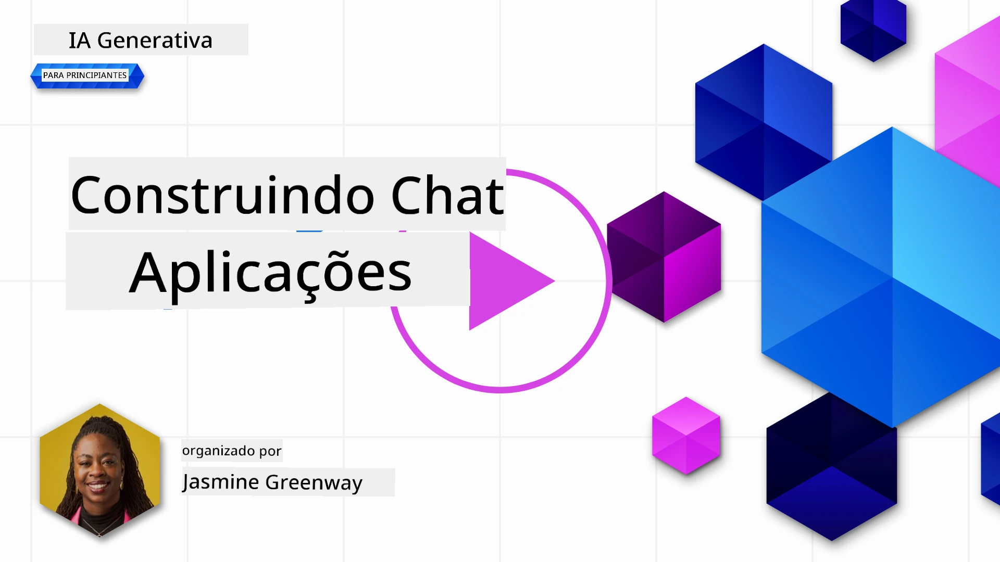
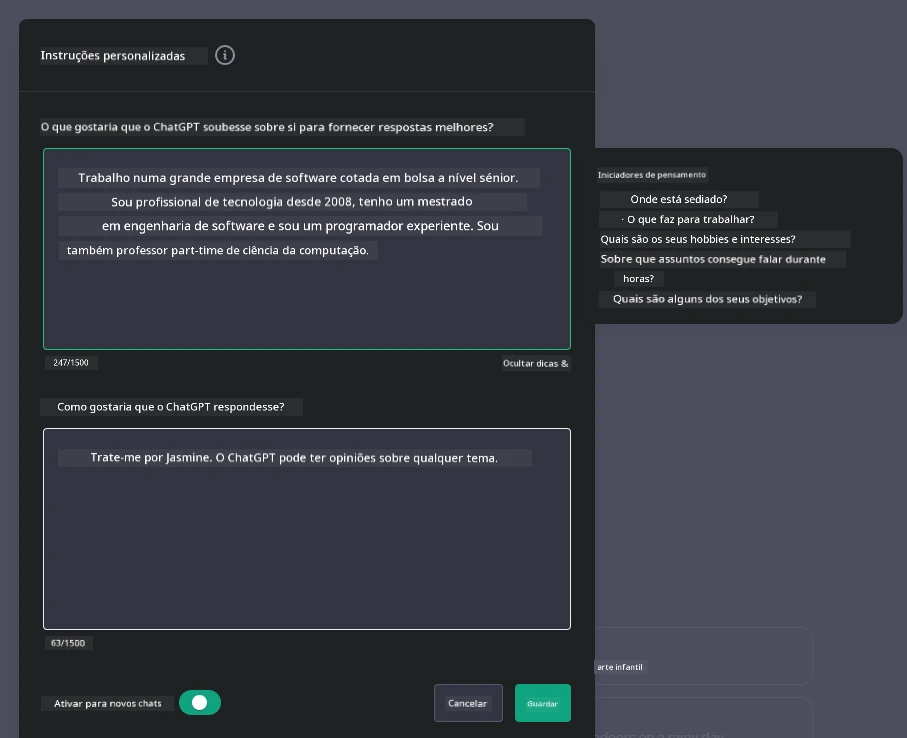

# Construir Aplicações de Chat Alimentadas por IA Generativa

[](https://youtu.be/R9V0ZY1BEQo?si=IHuU-fS9YWT8s4sA)

> _(Clique na imagem acima para ver o vídeo desta lição)_

Agora que vimos como podemos construir aplicações de geração de texto, vamos focar nas aplicações de chat.

As aplicações de chat tornaram-se integradas nas nossas vidas diárias, oferecendo mais do que apenas um meio para conversas casuais. São partes integrantes do serviço ao cliente, suporte técnico e até sistemas de aconselhamento sofisticados. É provável que tenha recebido ajuda de uma aplicação de chat recentemente. À medida que integramos tecnologias avançadas como a IA generativa nestas plataformas, a complexidade aumenta, bem como os desafios.

Algumas perguntas que precisam ser respondidas são:

- **Construção da aplicação**. Como construir e integrar eficazmente estas aplicações alimentadas por IA para casos de uso específicos?
- **Monitorização**. Uma vez implementadas, como podemos monitorizar e garantir que as aplicações operam ao mais alto nível de qualidade, tanto em termos de funcionalidade como na adesão aos [seis princípios de IA responsável](https://www.microsoft.com/ai/responsible-ai?WT.mc_id=academic-105485-koreyst)?

À medida que avançamos para uma era definida pela automação e interações humanas-máquina sem falhas, compreender como a IA generativa transforma o âmbito, profundidade e adaptabilidade das aplicações de chat torna-se essencial. Esta lição irá investigar os aspetos da arquitetura que suportam estes sistemas complexos, explorar as metodologias para ajustá-los para tarefas específicas do domínio e avaliar as métricas e considerações relevantes para garantir a implementação responsável da IA.

## Introdução

Esta lição cobre:

- Técnicas para construir e integrar aplicações de chat de forma eficiente.
- Como aplicar personalização e ajustes finos às aplicações.
- Estratégias e considerações para monitorizar eficazmente aplicações de chat.

## Objetivos de Aprendizagem

No final desta lição, será capaz de:

- Descrever as considerações para construir e integrar aplicações de chat em sistemas existentes.
- Personalizar aplicações de chat para casos de uso específicos.
- Identificar métricas e considerações chave para monitorizar e manter eficazmente a qualidade das aplicações de chat alimentadas por IA.
- Garantir que as aplicações de chat utilizam IA de forma responsável.

## Integrar IA Generativa em Aplicações de Chat

Elevar as aplicações de chat através da IA generativa não se centra apenas em torná-las mais inteligentes; é sobre otimizar a sua arquitetura, desempenho e interface do utilizador para oferecer uma experiência de qualidade. Isto envolve investigar as bases arquitetónicas, integrações de API e considerações de interface do utilizador. Esta secção visa oferecer-lhe um roadmap abrangente para navegar por estes cenários complexos, seja integrando-os em sistemas existentes ou construindo-os como plataformas autónomas.

No final desta secção, estará equipado com a expertise necessária para construir e incorporar aplicações de chat de forma eficiente.

### Chatbot ou Aplicação de Chat?

Antes de mergulharmos na construção de aplicações de chat, vamos comparar 'chatbots' com 'aplicações de chat alimentadas por IA', que servem papéis e funcionalidades distintas. O principal objetivo de um chatbot é automatizar tarefas conversacionais específicas, como responder a perguntas frequentes ou rastrear uma encomenda. É tipicamente governado por lógica baseada em regras ou algoritmos complexos de IA. Em contraste, uma aplicação de chat alimentada por IA é um ambiente muito mais expansivo, projetado para facilitar várias formas de comunicação digital, como chats de texto, voz e vídeo entre utilizadores humanos. A sua característica definidora é a integração de um modelo de IA generativa que simula conversas nuançadas, semelhantes às humanas, gerando respostas baseadas numa grande variedade de entradas e indícios contextuais. Uma aplicação de chat alimentada por IA generativa pode participar em discussões de domínio aberto, adaptar-se a contextos conversacionais em evolução e até produzir diálogos criativos ou complexos.

A tabela abaixo apresenta as principais diferenças e semelhanças para nos ajudar a compreender os seus papéis únicos na comunicação digital.

| Chatbot                               | Aplicação de Chat Alimentada por IA Generativa |
| ------------------------------------- | ---------------------------------------------- |
| Focada em tarefas e baseada em regras | Sensível ao contexto                            |
| Frequentemente integrada em sistemas maiores | Pode hospedar um ou vários chatbots           |
| Limitada a funções programadas         | Incorpora modelos de IA generativa              |
| Interações especializadas e estruturadas | Capaz de discussões de domínio aberto           |

### Aproveitar funcionalidades pré-construídas com SDKs e APIs

Ao construir uma aplicação de chat, um ótimo primeiro passo é avaliar o que já existe no mercado. Utilizar SDKs e APIs para construir aplicações de chat é uma estratégia vantajosa por várias razões. Ao integrar SDKs e APIs bem documentados, estará a posicionar estrategicamente a sua aplicação para o sucesso a longo prazo, tratando das preocupações de escalabilidade e manutenção.

- **Agiliza o processo de desenvolvimento e reduz custos**: Confiar em funcionalidades pré-construídas em vez do processo dispendioso de as construir você mesmo permite que se concentre noutras partes da aplicação que considere ser mais importantes, como a lógica de negócio.
- **Melhor desempenho**: Ao construir funcionalidades do zero, acabará por perguntar "Como isto escala? Será que esta aplicação consegue lidar com um súbito aumento de utilizadores?" SDKs e APIs bem mantidas frequentemente têm soluções integradas para estas preocupações.
- **Manutenção facilitada**: Atualizações e melhorias são mais fáceis de gerir, uma vez que a maioria das APIs e SDKs requerem simplesmente a atualização de uma biblioteca quando é lançada uma versão nova.
- **Acesso à tecnologia de ponta**: Aproveitar modelos que foram ajustados e treinados em extensos conjuntos de dados fornece à sua aplicação capacidades de linguagem natural.

Aceder a funcionalidades de um SDK ou API normalmente envolve obter permissão para usar os serviços fornecidos, frequentemente através do uso de uma chave única ou token de autenticação. Utilizaremos a Biblioteca OpenAI para Python para explorar como isto funciona. Pode também experimentar por si próprio nos seguintes [notebooks para OpenAI](./python/oai-assignment.ipynb?WT.mc_id=academic-105485-koreyst) ou [notebook para Azure OpenAI Services](./python/aoai-assignment.ipynb?WT.mc_id=academic-105485-koreys) para esta lição.

```python
import os
from openai import OpenAI

API_KEY = os.getenv("OPENAI_API_KEY","")

client = OpenAI(
    api_key=API_KEY
    )

response = client.responses.create(model="gpt-4o-mini", input="Suggest two titles for an instructional lesson on chat applications for generative AI.", store=False)
print(response.output_text)
```

O exemplo acima utiliza o modelo GPT-4o mini com a API Responses para completar o prompt, mas repare que a chave API é definida antes disso. Receberia um erro se não definiu a chave.

## Experiência do Utilizador (UX)

Princípios gerais de UX aplicam-se a aplicações de chat, mas aqui estão algumas considerações adicionais que se tornam particularmente importantes devido aos componentes de machine learning envolvidos.

- **Mecanismo para abordar ambiguidades**: Modelos de IA generativos ocasionalmente geram respostas ambíguas. Uma funcionalidade que permita aos utilizadores pedir esclarecimentos pode ser útil caso encontrem este problema.
- **Retenção de contexto**: Modelos avançados de IA generativa têm a capacidade de lembrar o contexto dentro de uma conversa, o que pode ser um recurso necessário para a experiência do utilizador. Permitir que os utilizadores controlem e geram o contexto melhora a experiência, mas introduz o risco de reter informações sensíveis. Considerações sobre o tempo de armazenamento dessas informações, como introduzir uma política de retenção, podem equilibrar a necessidade de contexto com a privacidade.
- **Personalização**: Com a capacidade de aprender e adaptar-se, os modelos de IA oferecem uma experiência personalizada para o utilizador. Adaptar a experiência do utilizador através de funcionalidades como perfis não só faz o utilizador sentir-se compreendido, mas também ajuda na procura de respostas específicas, criando uma interação mais eficiente e satisfatória.

Um exemplo de personalização são as opções "Instruções personalizadas" no ChatGPT da OpenAI. Permite fornecer informações sobre si que podem ser importantes para o contexto dos seus prompts. Aqui está um exemplo de uma instrução personalizada.



Este "perfil" leva o ChatGPT a criar um plano de aula sobre listas ligadas. Note que o ChatGPT considera que o utilizador poderá querer um plano de aula mais detalhado com base na sua experiência.


### Framework de Mensagem de Sistema da Microsoft para Grandes Modelos de Linguagem

[A Microsoft forneceu orientações](https://learn.microsoft.com/azure/ai-services/openai/concepts/system-message#define-the-models-output-format?WT.mc_id=academic-105485-koreyst) para escrever mensagens de sistema eficazes ao gerar respostas de LLMs, divididas em 4 áreas:

1. Definir para quem o modelo é destinado, bem como as suas capacidades e limitações.
2. Definir o formato de saída do modelo.
3. Fornecer exemplos específicos que demonstrem o comportamento pretendido do modelo.
4. Fornecer guardrails comportamentais adicionais.

### Acessibilidade

Quer um utilizador tenha deficiências visuais, auditivas, motoras ou cognitivas, uma aplicação de chat bem projetada deve ser utilizável por todos. A lista seguinte detalha funcionalidades específicas destinadas a melhorar a acessibilidade para várias deficiências.

- **Funcionalidades para Deficiência Visual**: Temas de alto contraste e texto redimensionável, compatibilidade com leitores de ecrã.
- **Funcionalidades para Deficiência Auditiva**: Funções de texto para voz e voz para texto, indicadores visuais para notificações áudio.
- **Funcionalidades para Deficiência Motora**: Suporte para navegação por teclado, comandos de voz.
- **Funcionalidades para Deficiência Cognitiva**: Opções de linguagem simplificada.

## Personalização e Ajuste Fino para Modelos de Linguagem Específicos de Domínio

Imagine uma aplicação de chat que compreende o jargão da sua empresa e antecipa as questões específicas que a sua base de utilizadores frequentemente tem. Existem algumas abordagens dignas de menção:

- **Aproveitar modelos DSL**. DSL significa linguagem específica de domínio. Pode aproveitar um modelo chamado DSL treinado num domínio específico para entender os seus conceitos e cenários.
- **Aplicar ajuste fino**. O ajuste fino é o processo de treinar ainda mais o seu modelo com dados específicos.

## Personalização: Usar um DSL

Aproveitar modelos de linguagem específicos de domínio (Modelos DSL) pode aumentar o envolvimento do utilizador ao fornecer interações especializadas e contextualmente relevantes. É um modelo treinado ou ajustado para entender e gerar texto relacionado com um campo, indústria ou assunto específicos. As opções para usar um modelo DSL podem variar desde o treino do zero até o uso de modelos pré-existentes através de SDKs e APIs. Outra opção é o ajuste fino, que envolve pegar num modelo pré-treinado existente e adaptá-lo para um domínio específico.

## Personalização: Aplicar ajuste fino

O ajuste fino é frequentemente considerado quando um modelo pré-treinado não é suficiente para um domínio especializado ou tarefa específica.

Por exemplo, perguntas médicas são complexas e requerem muito contexto. Quando um profissional médico diagnostica um paciente, baseia-se numa variedade de fatores como estilo de vida ou condições pré-existentes, e pode até depender de jornais médicos recentes para validar o diagnóstico. Em cenários tão nuançados, uma aplicação de chat AI de uso geral não pode ser uma fonte fiável.

### Cenário: uma aplicação médica

Imagine uma aplicação de chat desenhada para auxiliar profissionais médicos fornecendo referências rápidas a diretrizes de tratamento, interações medicamentosas ou descobertas de pesquisas recentes.

Um modelo de uso geral pode ser adequado para responder a perguntas médicas básicas ou oferecer conselhos gerais, mas pode ter dificuldades nos seguintes casos:

- **Casos altamente específicos ou complexos**. Por exemplo, um neurologista pode perguntar à aplicação, "Quais são as melhores práticas atuais para gerir epilepsia resistente a medicamentos em pacientes pediátricos?"
- **Falta de avanços recentes**. Um modelo de uso geral pode ter dificuldades em fornecer uma resposta atual que incorpore os avanços mais recentes em neurologia e farmacologia.

Em casos assim, o ajuste fino do modelo com um conjunto de dados médicos especializado pode melhorar significativamente a sua habilidade para lidar com estas perguntas médicas complexas de forma mais precisa e fiável. Isto requer acesso a um grande conjunto de dados relevante que represente os desafios e questões específicas do domínio.

## Considerações para uma Experiência de Chat Alimentada por IA de Alta Qualidade

Esta secção descreve os critérios para aplicações de chat "de alta qualidade", que incluem a captação de métricas acionáveis e a adesão a um quadro que utiliza a tecnologia IA de forma responsável.

### Métricas Chave

Para manter o desempenho de alta qualidade de uma aplicação, é essencial acompanhar métricas e considerações chave. Estas medições não só garantem a funcionalidade da aplicação, mas também avaliam a qualidade do modelo de IA e a experiência do utilizador. Abaixo está uma lista que cobre métricas básicas, de IA e de experiência do utilizador a considerar.

| Métrica                       | Definição                                                                                                              | Considerações para o Desenvolvedor de Chat                                |
| ----------------------------- | --------------------------------------------------------------------------------------------------------------------- | ------------------------------------------------------------------------  |
| **Tempo de Atividade (Uptime)** | Mede o tempo em que a aplicação está operacional e acessível aos utilizadores.                                        | Como irá minimizar o tempo de inatividade?                                |
| **Tempo de Resposta**          | O tempo que a aplicação demora a responder a uma consulta do utilizador.                                              | Como pode otimizar o processamento para melhorar o tempo de resposta?     |
| **Precisão**                  | A relação entre as previsões verdadeiras positivas e o total de previsões positivas.                                   | Como irá validar a precisão do seu modelo?                                |
| **Revocação (Sensibilidade)** | A relação entre as previsões verdadeiras positivas e o número real de positivos.                                      | Como irá medir e melhorar a revocação?                                    |
| **Pontuação F1**              | A média harmónica entre precisão e revocação, que equilibra o compromisso entre ambas.                                 | Qual é a sua pontuação F1 alvo? Como irá equilibrar precisão e revocação? |
| **Perplexidade**              | Mede o quão bem a distribuição de probabilidade prevista pelo modelo alinha-se com a distribuição real dos dados.     | Como irá minimizar a perplexidade?                                        |
| **Métricas de Satisfação do Utilizador** | Mede a perceção do utilizador sobre a aplicação. Frequentemente capturada através de inquéritos.                      | Com que frequência irá recolher feedback dos utilizadores? Como irá adaptar-se com base nele? |
| **Taxa de Erro**              | A taxa com que o modelo comete erros na compreensão ou na saída.                                                      | Que estratégias tem para reduzir as taxas de erro?                        |
| **Ciclos de Retreinamento**  | A frequência com que o modelo é atualizado para incorporar novos dados e insights.                                    | Com que frequência irá retreinar o modelo? O que desencadeia um ciclo de retreinamento? |

| **Deteção de Anomalias**         | Ferramentas e técnicas para identificar padrões invulgares que não se conformam ao comportamento esperado.                        | Como irá responder a anomalias?                                        |

### Implementação de Práticas de IA Responsável em Aplicações de Chat

A abordagem da Microsoft para IA Responsável identificou seis princípios que devem guiar o desenvolvimento e uso da IA. Abaixo estão os princípios, a sua definição, e coisas que um desenvolvedor de chat deve considerar e por que deve levá-las a sério.

| Princípios             | Definição da Microsoft                                | Considerações para Desenvolvedores de Chat                                      | Por Que É Importante                                                                     |
| ---------------------- | ----------------------------------------------------- | ------------------------------------------------------------------------------ | -------------------------------------------------------------------------------------- |
| Equidade               | Os sistemas de IA devem tratar todas as pessoas de forma justa.            | Garantir que a aplicação de chat não discrimine com base nos dados do utilizador.  | Para construir confiança e inclusão entre os utilizadores; evita implicações legais.                |
| Fiabilidade e Segurança | Os sistemas de IA devem funcionar com fiabilidade e segurança.        | Implementar testes e mecanismos de segurança para minimizar erros e riscos.         | Assegura a satisfação do utilizador e previne potenciais danos.                                 |
| Privacidade e Segurança   | Os sistemas de IA devem ser seguros e respeitar a privacidade.      | Implementar medidas de encriptação forte e proteção de dados.              | Para proteger dados sensíveis dos utilizadores e cumprir as leis de privacidade.                         |
| Inclusividade          | Os sistemas de IA devem capacitar e envolver todas as pessoas. | Projetar UI/UX acessível e fácil de usar para públicos diversos. | Assegura que uma diversidade maior de pessoas possa usar a aplicação eficazmente.                   |
| Transparência           | Os sistemas de IA devem ser compreensíveis.                  | Fornecer documentação clara e justificação para as respostas da IA.            | Os utilizadores tendem a confiar mais num sistema se puderem entender como são tomadas as decisões. |
| Responsabilização         | As pessoas devem ser responsabilizadas pelos sistemas de IA.          | Estabelecer um processo claro para auditar e melhorar as decisões da IA.     | Permite melhoria contínua e medidas corretivas em caso de erros.               |

## Tarefa

Veja [assignment](../../../07-building-chat-applications/python). Levará através de uma série de exercícios desde executar as suas primeiras mensagens de chat, a classificar e resumir texto e mais. Repare que as tarefas estão disponíveis em diferentes linguagens de programação!

## Excelente Trabalho! Continue a Jornada

Depois de completar esta lição, consulte a nossa [coleção de Aprendizagem de IA Generativa](https://aka.ms/genai-collection?WT.mc_id=academic-105485-koreyst) para continuar a aumentar o seu conhecimento em IA Generativa!

Vá para a Lição 8 para ver como pode começar a [construir aplicações de pesquisa](../08-building-search-applications/README.md?WT.mc_id=academic-105485-koreyst)!

---

<!-- CO-OP TRANSLATOR DISCLAIMER START -->
**Aviso Legal**:
Este documento foi traduzido utilizando o serviço de tradução automática [Co-op Translator](https://github.com/Azure/co-op-translator). Embora nos esforcemos pela precisão, esteja ciente de que traduções automáticas podem conter erros ou imprecisões. O documento original na sua língua nativa deve ser considerado a fonte autorizada. Para informações críticas, recomenda-se tradução profissional humana. Não nos responsabilizamos por quaisquer mal-entendidos ou interpretações incorretas resultantes da utilização desta tradução.
<!-- CO-OP TRANSLATOR DISCLAIMER END -->