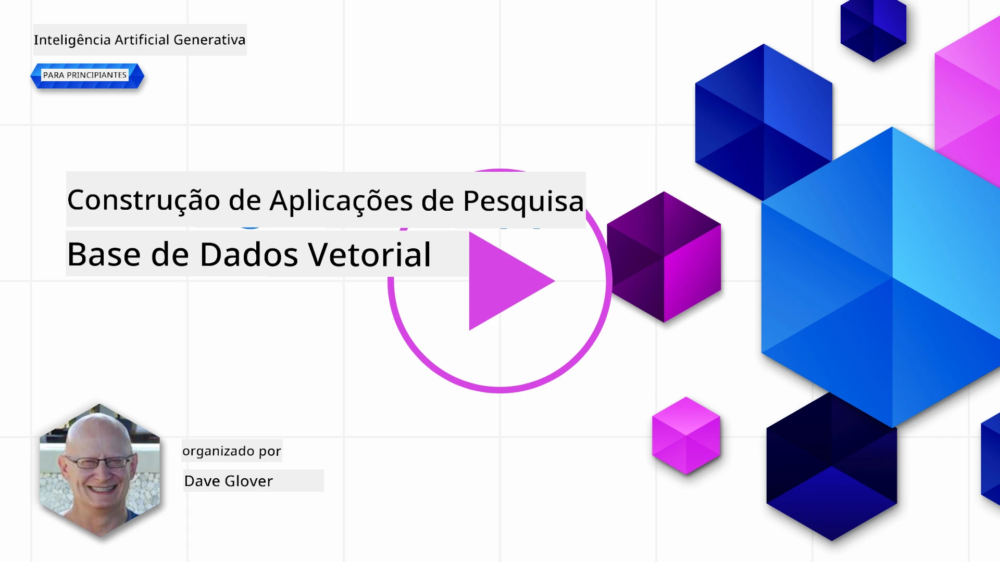
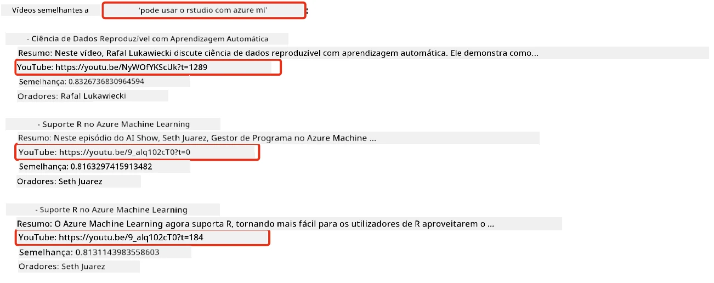
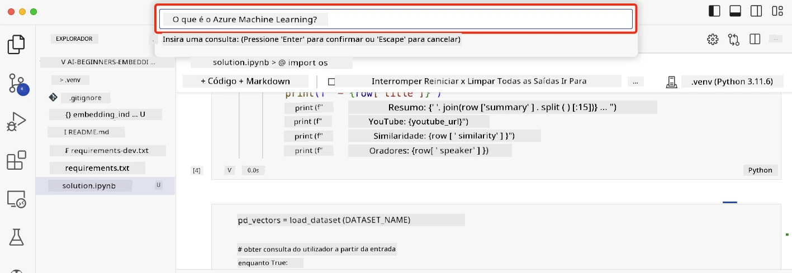

# Construir Aplicações de Pesquisa

[](https://youtu.be/W0-nzXjOjr0?si=GcsqiTTvd7RKbo7V)

> > _Clique na imagem acima para ver o vídeo desta aula_

Os LLMs vão além dos chatbots e da geração de texto. Também é possível criar aplicações de pesquisa usando Embeddings. Embeddings são representações numéricas de dados também conhecidas como vetores, e podem ser usadas para pesquisa semântica de dados.

Nesta aula, vai construir uma aplicação de pesquisa para a nossa startup de educação. A nossa startup é uma organização sem fins lucrativos que fornece educação gratuita a estudantes em países em desenvolvimento. A nossa startup tem muitos vídeos no YouTube que os estudantes podem usar para aprender sobre IA. A nossa startup deseja construir uma aplicação de pesquisa que permita aos estudantes pesquisar um vídeo do YouTube digitando uma pergunta.

Por exemplo, um estudante pode digitar 'O que são Jupyter Notebooks?' ou 'O que é Azure ML' e a aplicação de pesquisa irá devolver uma lista de vídeos do YouTube que são relevantes para a pergunta, e melhor ainda, a aplicação de pesquisa irá devolver um link para o local no vídeo onde a resposta à pergunta está localizada.

## Introdução

Nesta aula, vamos abordar:

- Pesquisa semântica vs pesquisa por palavra-chave.
- O que são Text Embeddings.
- Criar um Índice de Text Embeddings.
- Pesquisar num Índice de Text Embeddings.

## Objetivos de Aprendizagem

Após completar esta aula, será capaz de:

- Distinguir entre pesquisa semântica e por palavra-chave.
- Explicar o que são Text Embeddings.
- Criar uma aplicação utilizando Embeddings para pesquisar dados.

## Porquê construir uma aplicação de pesquisa?

Construir uma aplicação de pesquisa ajudará a compreender como usar Embeddings para pesquisar dados. Também irá aprender como construir uma aplicação de pesquisa que pode ser usada pelos estudantes para encontrar informação rapidamente.

A aula inclui um Índice de Embeddings das transcrições do YouTube do canal [AI Show](https://www.youtube.com/playlist?list=PLlrxD0HtieHi0mwteKBOfEeOYf0LJU4O1) da Microsoft. O AI Show é um canal do YouTube que ensina sobre IA e aprendizagem automática. O Índice de Embeddings contém os Embeddings para cada uma das transcrições do YouTube até outubro de 2023. Vai usar o Índice de Embeddings para construir uma aplicação de pesquisa para a nossa startup. A aplicação de pesquisa retorna um link para o local no vídeo onde a resposta à pergunta está localizada. Esta é uma ótima forma para os estudantes encontrarem rapidamente a informação que precisam.

A seguir está um exemplo de uma consulta semântica para a pergunta 'podes usar rstudio com azure ml?'. Veja a URL do YouTube, verá que a URL contém um carimbo de tempo que o leva ao local do vídeo onde a resposta está localizada.



## O que é pesquisa semântica?

Agora pode perguntar, o que é pesquisa semântica? Pesquisa semântica é uma técnica de pesquisa que usa a semântica, ou significado, das palavras numa consulta para devolver resultados relevantes.

Aqui está um exemplo de uma pesquisa semântica. Suponha que está a procurar comprar um carro, pode pesquisar por 'o meu carro de sonho', a pesquisa semântica entende que não está a `sonhar` com um carro, mas sim a procurar comprar o seu carro `ideal`. A pesquisa semântica entende a sua intenção e devolve resultados relevantes. A alternativa é `pesquisa por palavra-chave` que procuraria literalmente por sonhos sobre carros e frequentemente devolve resultados irrelevantes.

## O que são Text Embeddings?

[Text embeddings](https://en.wikipedia.org/wiki/Word_embedding?WT.mc_id=academic-105485-koreyst) são uma técnica de representação de texto usada em [processamento de linguagem natural](https://en.wikipedia.org/wiki/Natural_language_processing?WT.mc_id=academic-105485-koreyst). Text embeddings são representações numéricas semânticas do texto. Embeddings são usados para representar dados de uma forma que seja fácil para uma máquina entender. Existem muitos modelos para construir text embeddings, nesta aula vamos focar em gerar embeddings usando o Modelo de Embeddings da OpenAI.

Aqui está um exemplo, imagine que o seguinte texto está numa transcrição de um dos episódios do canal AI Show no YouTube:

```text
Today we are going to learn about Azure Machine Learning.
```

Passaríamos o texto à API de Embeddings da OpenAI e esta devolveria o embedding seguinte que consiste em 1536 números também conhecido como vetor. Cada número no vetor representa um aspeto diferente do texto. Para brevidade, aqui estão os primeiros 10 números do vetor.

```python
[-0.006655829958617687, 0.0026128944009542465, 0.008792596869170666, -0.02446001023054123, -0.008540431968867779, 0.022071078419685364, -0.010703742504119873, 0.003311325330287218, -0.011632772162556648, -0.02187200076878071, ...]
```

## Como é criado o índice de Embeddings?

O índice de Embeddings para esta aula foi criado com uma série de scripts Python. Vai encontrar os scripts juntamente com instruções no [README](./scripts/README.md?WT.mc_id=academic-105485-koreyst) na pasta 'scripts' desta aula. Não precisa de executar estes scripts para completar esta aula, pois o Índice de Embeddings é fornecido para si.

Os scripts realizam as seguintes operações:

1. A transcrição de cada vídeo do YouTube da playlist [AI Show](https://www.youtube.com/playlist?list=PLlrxD0HtieHi0mwteKBOfEeOYf0LJU4O1) é descarregada.
2. Usando [OpenAI Functions](https://learn.microsoft.com/azure/ai-foundry/openai/how-to/function-calling?WT.mc_id=academic-105485-koreyst), é feita uma tentativa de extrair o nome do orador dos primeiros 3 minutos da transcrição do YouTube. O nome do orador para cada vídeo é guardado no índice de Embeddings chamado `embedding_index_3m.json`.
3. O texto da transcrição é depois parti em **segmentos de texto de 3 minutos**. O segmento inclui cerca de 20 palavras sobrepostas do segmento seguinte para garantir que o Embedding para o segmento não seja cortado e para fornecer melhor contexto de pesquisa.
4. Cada segmento de texto é depois enviado para a API de Chat da OpenAI para resumir o texto em 60 palavras. O resumo também é armazenado no índice de Embeddings `embedding_index_3m.json`.
5. Finalmente, o texto do segmento é passado para a API de Embeddings da OpenAI. A API de Embeddings devolve um vetor de 1536 números que representam o significado semântico do segmento. O segmento juntamente com o vetor de Embeddings da OpenAI é armazenado no índice de Embeddings `embedding_index_3m.json`.

### Bases de Dados Vetoriais

Para simplificar a aula, o índice de Embeddings está armazenado num ficheiro JSON chamado `embedding_index_3m.json` e carregado num DataFrame do Pandas. No entanto, em produção, o índice de Embeddings seria armazenado numa base de dados vetorial como [Azure Cognitive Search](https://learn.microsoft.com/training/modules/improve-search-results-vector-search?WT.mc_id=academic-105485-koreyst), [Redis](https://cookbook.openai.com/examples/vector_databases/redis/readme?WT.mc_id=academic-105485-koreyst), [Pinecone](https://cookbook.openai.com/examples/vector_databases/pinecone/readme?WT.mc_id=academic-105485-koreyst), [Weaviate](https://cookbook.openai.com/examples/vector_databases/weaviate/readme?WT.mc_id=academic-105485-koreyst), entre outros.

## Compreender a similaridade do cosseno

Já aprendemos sobre text embeddings, o próximo passo é aprender como usar text embeddings para pesquisar dados e, em particular, encontrar os embeddings mais semelhantes a uma consulta dada usando a similaridade do cosseno.

### O que é similaridade do cosseno?

A similaridade do cosseno é uma medida de similitude entre dois vetores, também poderá ouvir isto referido como `pesquisa do vizinho mais próximo`. Para realizar uma pesquisa por similaridade do cosseno precisa de _vetorizar_ o texto da _consulta_ usando a API de Embeddings da OpenAI. Depois calcular a _similaridade do cosseno_ entre o vetor da consulta e cada vetor no Índice de Embeddings. Lembre-se, o Índice de Embeddings tem um vetor para cada segmento de texto da transcrição do YouTube. Por fim, ordene os resultados por similaridade do cosseno e os segmentos de texto com maior similaridade do cosseno são os mais semelhantes à consulta.

Do ponto de vista matemático, a similaridade do cosseno mede o cosseno do ângulo entre dois vetores projetados num espaço multidimensional. Esta medição é benéfica, porque se dois documentos estiverem distantes pela distância Euclidiana devido ao tamanho, podem ainda ter um ângulo menor entre eles e, consequentemente, maior similaridade do cosseno. Para mais informações sobre as equações da similaridade do cosseno, veja [Similaridade do cosseno](https://en.wikipedia.org/wiki/Cosine_similarity?WT.mc_id=academic-105485-koreyst).

## Construir a sua primeira aplicação de pesquisa

De seguida, vamos aprender como construir uma aplicação de pesquisa usando Embeddings. A aplicação de pesquisa permitirá que os estudantes pesquisem por um vídeo digitando uma pergunta. A aplicação de pesquisa devolverá uma lista de vídeos que são relevantes para a pergunta. A aplicação de pesquisa também devolverá um link para o local no vídeo onde a resposta à pergunta está localizada.

Esta solução foi construída e testada no Windows 11, macOS, e Ubuntu 22.04 usando Python 3.10 ou superior. Pode descarregar o Python a partir de [python.org](https://www.python.org/downloads/?WT.mc_id=academic-105485-koreyst).

## Exercício - construir uma aplicação de pesquisa para capacitar os estudantes

Introduzimos a nossa startup no início desta aula. Agora é tempo de capacitar os estudantes a construir uma aplicação de pesquisa para as suas avaliações.

Neste exercício, vai criar os Serviços Azure OpenAI que serão usados para construir a aplicação de pesquisa. Vai criar os seguintes Serviços Azure OpenAI. Vai precisar de uma subscrição Azure para completar este exercício.

### Iniciar o Azure Cloud Shell

1. Inicie sessão no [portal Azure](https://portal.azure.com/?WT.mc_id=academic-105485-koreyst).
2. Selecione o ícone Cloud Shell no canto superior direito do portal Azure.
3. Selecione **Bash** para o tipo de ambiente.

#### Criar um grupo de recursos

> Para estas instruções, estamos a usar o grupo de recursos chamado "semantic-video-search" na região East US.
> Pode alterar o nome do grupo de recursos, mas ao mudar a localização dos recursos,
> consulte a [tabela de disponibilidade dos modelos](https://aka.ms/oai/models?WT.mc_id=academic-105485-koreyst).

```shell
az group create --name semantic-video-search --location eastus
```

#### Criar um recurso de Serviço Azure OpenAI

No Azure Cloud Shell, execute o seguinte comando para criar um recurso de Serviço Azure OpenAI.

```shell
az cognitiveservices account create --name semantic-video-openai --resource-group semantic-video-search \
    --location eastus --kind OpenAI --sku s0
```

#### Obter o endpoint e as chaves para uso nesta aplicação

No Azure Cloud Shell, execute os seguintes comandos para obter o endpoint e as chaves para o recurso do Serviço Azure OpenAI.

```shell
az cognitiveservices account show --name semantic-video-openai \
   --resource-group  semantic-video-search | jq -r .properties.endpoint
az cognitiveservices account keys list --name semantic-video-openai \
   --resource-group semantic-video-search | jq -r .key1
```

#### Desdobrar o modelo de Embeddings OpenAI

No Azure Cloud Shell, execute o seguinte comando para desdobrar o modelo de Embeddings da OpenAI.

```shell
az cognitiveservices account deployment create \
    --name semantic-video-openai \
    --resource-group  semantic-video-search \
    --deployment-name text-embedding-ada-002 \
    --model-name text-embedding-ada-002 \
    --model-version "2"  \
    --model-format OpenAI \
    --sku-capacity 100 --sku-name "Standard"
```

## Solução

Abra o [notebook da solução](./python/aoai-solution.ipynb?WT.mc_id=academic-105485-koreyst) no GitHub Codespaces e siga as instruções no Jupyter Notebook.

Quando executar o notebook, será solicitado a inserir uma consulta. A caixa de entrada será semelhante a esta:



## Excelente trabalho! Continue a sua aprendizagem

Depois de completar esta aula, consulte a nossa [coleção de Aprendizagem de IA Generativa](https://aka.ms/genai-collection?WT.mc_id=academic-105485-koreyst) para continuar a elevar o seu conhecimento em IA Generativa!

Dirija-se à Aula 9 onde iremos ver como [construir aplicações de geração de imagens](../09-building-image-applications/README.md?WT.mc_id=academic-105485-koreyst)!

---

<!-- CO-OP TRANSLATOR DISCLAIMER START -->
**Aviso Legal**:
Este documento foi traduzido utilizando o serviço de tradução automática [Co-op Translator](https://github.com/Azure/co-op-translator). Embora nos esforcemos pela precisão, esteja ciente de que traduções automáticas podem conter erros ou imprecisões. O documento original na sua língua nativa deve ser considerado a fonte autorizada. Para informações críticas, recomenda-se tradução profissional humana. Não nos responsabilizamos por quaisquer mal-entendidos ou interpretações incorretas resultantes da utilização desta tradução.
<!-- CO-OP TRANSLATOR DISCLAIMER END -->