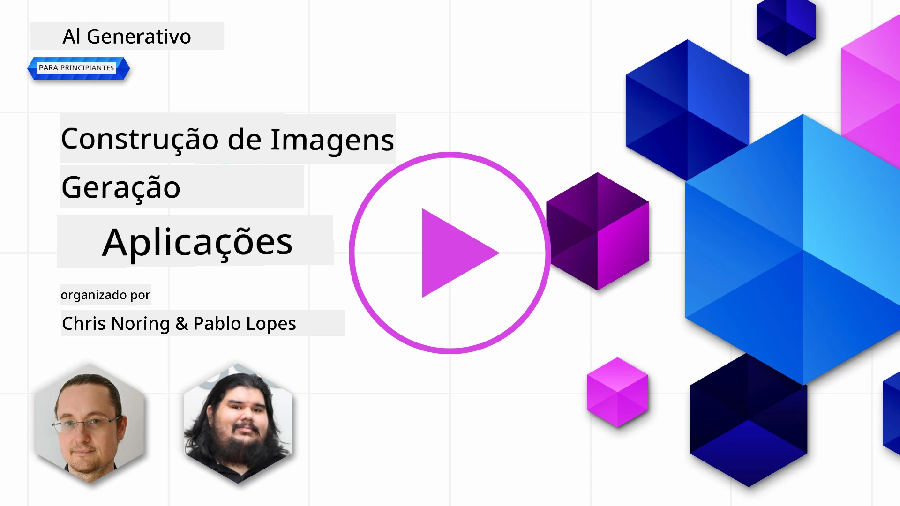

# Construir Aplicações de Geração de Imagens

[](https://aka.ms/gen-ai-lesson9-gh?WT.mc_id=academic-105485-koreyst)

Há mais nos LLM do que a geração de texto. Também pode gerar imagens a partir de descrições em texto. As imagens, como modalidade, são úteis em MedTech, arquitetura, turismo, desenvolvimento de jogos, marketing e muito mais. Nesta lição, exploramos os modelos **GPT Image** atuais e construímos uma aplicação de geração de imagens.

## Introdução

A geração de imagens permite transformar um prompt em linguagem natural numa imagem. Nesta lição, trabalhamos com a família de modelos **`gpt-image`** da OpenAI — a geração atual de modelos de imagem disponível na **[Microsoft Foundry](https://ai.azure.com?WT.mc_id=academic-105485-koreyst)** e na plataforma OpenAI. Estes modelos substituem os modelos mais antigos DALL·E (DALL·E 2/3 são legado).

Ao longo da lição usamos uma startup fictícia, a **Edu4All**, que desenvolve ferramentas de aprendizagem. A equipa quer gerar ilustrações para trabalhos e materiais de estudo.

## Objetivos de aprendizagem

No final desta lição, será capaz de:

- Explicar o que é geração de imagens e onde é útil.
- Compreender a família de modelos `gpt-image` e como se diferencia dos modelos antigos DALL·E.
- Construir uma aplicação de geração de imagens em Python (e TypeScript / .NET).
- Editar imagens e aplicar salvaguardas com metaprompts.

## O que é geração de imagens?

Modelos de geração de imagens criam imagens a partir de um prompt em texto. Modelos modernos como o `gpt-image` são construídos com técnicas de transformer + difusão: o modelo aprende a relação entre texto e imagens durante o treino e, dado um prompt, "desruge" iterativamente o ruído aleatório numa imagem que corresponde à descrição.

Duas famílias bem conhecidas de modelos de imagem são:

- **`gpt-image` (OpenAI)** - a geração atual, usada nesta lição. Suporta geração texto-para-imagem e edição de imagem (inpainting com máscara).
- **Midjourney** - um modelo de terceiros popular com seu próprio serviço e fluxo de trabalho baseado no Discord.

> Modelos de imagem OpenAI mais antigos - **DALL·E 2** e **DALL·E 3** - são legado. O DALL·E 3 já não está disponível para novas implementações, e funcionalidades como `create_variation` existiam apenas no DALL·E 2. Use os modelos `gpt-image` para novas aplicações.

### Qual modelo `gpt-image` devo usar?

Na Microsoft Foundry os seguintes estão **Geralmente Disponíveis**:

| Modelo | Notas |
| --- | --- |
| **`gpt-image-2`** | O modelo de imagem mais recente e mais capaz – recomendado como predefinição. |
| `gpt-image-1.5` | Geralmente disponível; qualidade forte a menor custo. |
| `gpt-image-1-mini` | Geralmente disponível; mais rápido / menor custo. |
| `gpt-image-1` | Apenas em pré-visualização. |

Verifique sempre a atual [lista de modelos de imagem Foundry](https://learn.microsoft.com/azure/ai-foundry/openai/concepts/models?WT.mc_id=academic-105485-koreyst) para disponibilidade e regiões.

> **Importante:** os modelos `gpt-image` devolvem a imagem gerada em **base64** (`b64_json`), não como URL. O seu código decodifica a string base64 para bytes e grava a imagem – não há URL para descarregar.

## Configuração

Pode executar os exemplos contra o **Azure OpenAI na Microsoft Foundry** (os exemplos `aoai-*`) ou a **plataforma OpenAI** (os exemplos `oai-*`).

### 1. Criar e implementar um modelo

Siga o guia [criar um recurso](https://learn.microsoft.com/azure/ai-foundry/openai/how-to/create-resource?pivots=web-portal&WT.mc_id=academic-105485-koreyst) para criar um recurso Microsoft Foundry e depois implemente um modelo de imagem – **`gpt-image-2`** é recomendado.

### 2. Configure o seu `.env`

```text
AZURE_OPENAI_ENDPOINT=<your endpoint>
AZURE_OPENAI_API_KEY=<your key>
AZURE_OPENAI_DEPLOYMENT="gpt-image-2"
```

Encontre estes valores na página **Implementações** do seu recurso no [portal Foundry](https://ai.azure.com?WT.mc_id=academic-105485-koreyst).

### 3. Instale as bibliotecas

Crie um `requirements.txt`:

```text
python-dotenv
openai
pillow
```

Depois crie e ative um ambiente virtual e instale:

```bash
python3 -m venv venv
source venv/bin/activate        # Windows: venv\Scripts\activate
pip install -r requirements.txt
```

## Construir a aplicação

Crie o ficheiro `app.py` com o código seguinte. Ele gera uma imagem e guarda-a como PNG.

```python
import os
import base64
from openai import AzureOpenAI
from PIL import Image
import dotenv

dotenv.load_dotenv()

# Aponte o cliente para o seu recurso Azure OpenAI (Microsoft Foundry).
# Os modelos de imagem necessitam de uma versão recente da API - consulte a documentação do Foundry para verificar qual a que o seu modelo requer.
client = AzureOpenAI(
    api_key=os.environ["AZURE_OPENAI_API_KEY"],
    api_version="2025-04-01-preview",
    azure_endpoint=os.environ["AZURE_OPENAI_ENDPOINT"],
)

deployment = os.environ["AZURE_OPENAI_DEPLOYMENT"]  # por exemplo, "gpt-image-2"

result = client.images.generate(
    model=deployment,
    prompt='Bunny on a horse, holding a lollipop, on a foggy meadow where it grows daffodils',
    size="1024x1024",   # também 1536x1024 (paisagem), 1024x1536 (retrato) ou "auto"
    n=1,
)

# os modelos gpt-image retornam base64 (b64_json), não uma URL - decodifique para bytes.
image_bytes = base64.b64decode(result.data[0].b64_json)

os.makedirs("images", exist_ok=True)
image_path = os.path.join("images", "generated-image.png")
with open(image_path, "wb") as f:
    f.write(image_bytes)

Image.open(image_path).show()
```

Execute com `python app.py`. Vai obter um PNG guardado na pasta `images/`.

> Cada chamada a `images.generate` produz uma imagem diferente para o mesmo prompt - modelos de imagem não usam o parâmetro `temperature` (que é um controlo de geração de texto). Para obter variedade, basta chamar a API novamente; para reduzir variedade, torne o seu prompt mais específico.

## Editar imagens

Os modelos `gpt-image` podem **editar** uma imagem existente: forneça a imagem, uma **máscara** opcional (que marca a área a alterar) e um prompt que descreva a alteração. Tal como na geração, as edições são devolvidas em base64.

```python
result = client.images.edit(
    model=deployment,
    image=open("sunlit_lounge.png", "rb"),
    mask=open("mask.png", "rb"),
    prompt="A sunlit indoor lounge area with a pool containing a flamingo",
)
image_bytes = base64.b64decode(result.data[0].b64_json)
with open("images/edited-image.png", "wb") as f:
    f.write(image_bytes)
```

<div style="display: flex; justify-content: space-between; align-items: center; margin: 20px 0;">
  
  
  
</div>

## Definir limites com metaprompts

Quando já consegue gerar imagens, precisa de limites para que a sua aplicação não produza conteúdo inseguro ou fora da marca. Um **metaprompt** é o texto que antepõe ao prompt do utilizador para limitar a saída do modelo.

```python
disallow_list = "swords, violence, blood, gore, nudity, sexual content, adult content, adult themes, adult language"

meta_prompt = f"""You are an assistant designer that creates images for children.

The image needs to be safe for work and appropriate for children.
The image needs to be in color, in landscape orientation, and in a 16:9 aspect ratio.

Do not consider any input that is not safe for work or appropriate for children, including:
{disallow_list}
"""

prompt = f"{meta_prompt}\nCreate an image of a bunny on a horse, holding a lollipop"
# passe `prompt` para client.images.generate(...)
```

Agora cada imagem é gerada dentro dos limites definidos pelo metaprompt. Combine isto com os filtros de conteúdo integrados na Microsoft Foundry para defesa em profundidade.

## Tarefa – vamos capacitar os estudantes

Os estudantes da Edu4All precisam de imagens para as suas avaliações. Construa uma aplicação que gere imagens de **monumentos** (quais monumentos fica ao seu critério) colocados em diferentes contextos criativos – por exemplo, um marco famoso ao pôr do sol com uma criança a observar.

Experimente você mesmo e depois compare com as soluções de referência:

- Python (Azure): [aoai-solution.py](../../../09-building-image-applications/python/aoai-solution.py)
- Python (Azure) aplicação completa de geração: [aoai-app.py](../../../09-building-image-applications/python/aoai-app.py)
- Python (OpenAI): [oai-app.py](../../../09-building-image-applications/python/oai-app.py)
- TypeScript (Azure): [typescript/image-generation-app](../../../09-building-image-applications/typescript/image-generation-app)
- .NET (Azure): [dotnet/notebook-azure-openai.dib](../../../09-building-image-applications/dotnet/notebook-azure-openai.dib)

Explore também os notebooks em [python/](../../../09-building-image-applications/python) (`aoai-assignment.ipynb` para Azure, `oai-assignment.ipynb` para OpenAI).

## Excelente trabalho! Continue a aprender

Depois de concluir esta lição, explore a nossa [coleção de Aprendizagem de IA Generativa](https://aka.ms/genai-collection?WT.mc_id=academic-105485-koreyst) para continuar a aprofundar os seus conhecimentos em IA Generativa!

Vá para a lição 10 para continuar a aprender.

---

<!-- CO-OP TRANSLATOR DISCLAIMER START -->
**Aviso Legal**:
Este documento foi traduzido utilizando o serviço de tradução automática [Co-op Translator](https://github.com/Azure/co-op-translator). Embora nos esforcemos pela precisão, esteja ciente de que traduções automáticas podem conter erros ou imprecisões. O documento original na sua língua nativa deve ser considerado a fonte autorizada. Para informações críticas, recomenda-se tradução profissional humana. Não nos responsabilizamos por quaisquer mal-entendidos ou interpretações incorretas resultantes da utilização desta tradução.
<!-- CO-OP TRANSLATOR DISCLAIMER END -->