# Construindo Aplicações de IA Low Code

[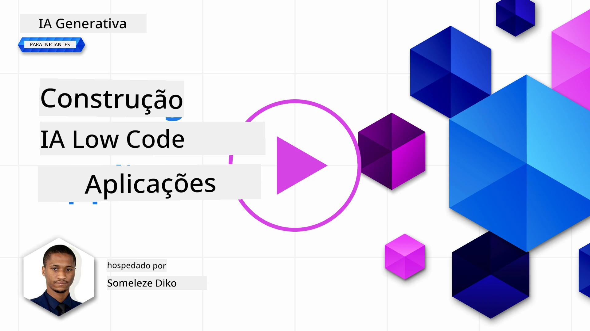](https://youtu.be/1vzq3Nd8GBA?si=h6LHWJXdmqf6mhDg)

> _(Clique na imagem acima para ver o vídeo desta lição)_

## Introdução

Agora que aprendemos a construir aplicações geradoras de imagens, vamos falar sobre low code. A IA generativa pode ser utilizada em várias áreas, incluindo low code, mas o que é low code e como podemos adicionar IA a isso?

Construir aplicações e soluções tornou-se mais fácil para programadores tradicionais e não programadores através do uso de Plataformas de Desenvolvimento Low Code. As Plataformas de Desenvolvimento Low Code permitem construir aplicações e soluções com pouco ou nenhum código. Isto é conseguido ao fornecer um ambiente de desenvolvimento visual que permite arrastar e largar componentes para construir aplicações e soluções. Isto permite construir aplicações e soluções mais rapidamente e com menos recursos. Nesta lição, exploramos em profundidade como usar Low Code e como melhorar o desenvolvimento low code com IA usando o Power Platform.

O Power Platform oferece às organizações a oportunidade de capacitar as suas equipas para construírem as suas próprias soluções através de um ambiente intuitivo de low-code ou no-code. Este ambiente ajuda a simplificar o processo de construção de soluções. Com o Power Platform, as soluções podem ser construídas em dias ou semanas em vez de meses ou anos. O Power Platform consiste em cinco produtos principais: Power Apps, Power Automate, Power BI, Power Pages e Copilot Studio.

Esta lição cobre:

- Introdução à IA Generativa no Power Platform
- Introdução ao Copilot e como usá-lo
- Usar a IA Generativa para construir aplicações e fluxos no Power Platform
- Compreender os Modelos de IA no Power Platform com o AI Builder
- Construir agentes inteligentes com o Microsoft Copilot Studio

## Objetivos de Aprendizagem

No final desta lição, será capaz de:

- Compreender como o Copilot funciona no Power Platform.

- Construir uma aplicação de rastreamento de tarefas estudantis para a nossa startup educativa.

- Construir um fluxo de processamento de faturas que utiliza IA para extrair informações das faturas.

- Aplicar as melhores práticas ao usar o Modelo de IA Criar Texto com GPT.

- Compreender o que é o Microsoft Copilot Studio e como construir agentes inteligentes com ele.

As ferramentas e tecnologias que vai usar nesta lição são:

- **Power Apps**, para a aplicação de rastreamento de tarefas estudantis, que fornece um ambiente de desenvolvimento low-code para construir aplicações para rastrear, gerir e interagir com dados.

- **Dataverse**, para armazenar os dados da aplicação de rastreamento de tarefas estudantis onde o Dataverse fornecerá uma plataforma de dados low-code para armazenar os dados da aplicação.

- **Power Automate**, para o fluxo de processamento de faturas onde terá um ambiente de desenvolvimento low-code para construir fluxos de trabalho para automatizar o processo de processamento de faturas.

- **AI Builder**, para o Modelo de IA de Processamento de Faturas onde vai usar modelos de IA pré-construídos para processar as faturas da nossa startup.

## IA Generativa no Power Platform

Melhorar o desenvolvimento low-code e a aplicação com IA generativa é uma área-chave de foco para o Power Platform. O objetivo é permitir que todos construam aplicações, sites, painéis e automatizem processos alimentados por IA, _sem exigir qualquer especialização em ciência de dados_. Este objetivo é alcançado através da integração da IA generativa na experiência de desenvolvimento low-code no Power Platform na forma de Copilot e AI Builder.

### Como funciona isso?

O Copilot é um assistente de IA que permite construir soluções no Power Platform descrevendo os seus requisitos numa série de passos conversacionais usando linguagem natural. Por exemplo, pode instruir o seu assistente de IA a indicar quais os campos que a sua aplicação vai usar e ele criará tanto a aplicação como o modelo de dados subjacente, ou pode especificar como configurar um fluxo no Power Automate.

Pode usar funcionalidades dirigidas pelo Copilot como uma funcionalidade nas suas telas de aplicação para permitir que os utilizadores descubram insights através de interações conversacionais.

O AI Builder é uma capacidade de IA low-code disponível no Power Platform que permite usar Modelos de IA para ajudar a automatizar processos e prever resultados. Com o AI Builder pode trazer IA para as suas aplicações e fluxos que se conectam aos seus dados no Dataverse ou em várias fontes de dados na cloud, como SharePoint, OneDrive ou Azure.

O Copilot está disponível em todos os produtos do Power Platform: Power Apps, Power Automate, Power BI, Power Pages e Copilot Studio (antigo Power Virtual Agents). O AI Builder está disponível no Power Apps e Power Automate. Nesta lição, vamos focar-nos em como usar Copilot e AI Builder no Power Apps e Power Automate para construir uma solução para a nossa startup educativa.

### Copilot no Power Apps

Como parte do Power Platform, o Power Apps fornece um ambiente de desenvolvimento low-code para construir aplicações para rastrear, gerir e interagir com dados. É um conjunto de serviços de desenvolvimento de aplicações com uma plataforma de dados escalável e a capacidade de se conectar a serviços na cloud e dados locais. O Power Apps permite construir aplicações que funcionam em navegadores, tablets e telemóveis, e que podem ser partilhadas com colegas. O Power Apps facilita o desenvolvimento de aplicações a utilizadores com uma interface simples, para que qualquer utilizador empresarial ou programador profissional possa construir aplicações personalizadas. A experiência de desenvolvimento da aplicação é também melhorada com IA Generativa através do Copilot.

A funcionalidade de assistente de IA Copilot no Power Apps permite-lhe descrever que tipo de aplicação precisa e que informações quer que a sua aplicação rastreie, recolha ou mostre. O Copilot gera então uma aplicação Canvas responsiva com base na sua descrição. Pode depois personalizar a aplicação para satisfazer as suas necessidades. O assistente de IA Copilot também gera e sugere uma Tabela Dataverse com os campos necessários para armazenar os dados que quer rastrear e alguns dados de amostra. Mais adiante nesta lição vamos ver o que é o Dataverse e como pode usá-lo no Power Apps. Pode então personalizar a tabela para satisfazer as suas necessidades usando a funcionalidade assistente AI Copilot através de passos conversacionais. Esta funcionalidade está prontamente disponível na tela inicial do Power Apps.

### Copilot no Power Automate

Como parte do Power Platform, o Power Automate permite aos utilizadores criar fluxos de trabalho automatizados entre aplicações e serviços. Ajuda a automatizar processos comerciais repetitivos, como comunicação, recolha de dados e aprovações de decisões. A sua interface simples permite que utilizadores de todas as competências técnicas (desde iniciantes a programadores experientes) automatizem tarefas de trabalho. A experiência de desenvolvimento de fluxos é também melhorada com IA Generativa através do Copilot.

A funcionalidade de assistente de IA Copilot no Power Automate permite-lhe descrever que tipo de fluxo precisa e que ações quer que o seu fluxo execute. O Copilot gera então um fluxo com base na sua descrição. Pode depois personalizar o fluxo para satisfazer as suas necessidades. O assistente de IA Copilot também gera e sugere as ações necessárias para realizar a tarefa que deseja automatizar. Mais adiante nesta lição vamos ver o que são fluxos e como pode usá-los no Power Automate. Pode então personalizar as ações para satisfazer as suas necessidades usando a funcionalidade assistente AI Copilot através de passos conversacionais. Esta funcionalidade está prontamente disponível na tela inicial do Power Automate.

## Construindo Agentes Inteligentes com o Microsoft Copilot Studio

[Microsoft Copilot Studio](https://learn.microsoft.com/microsoft-copilot-studio/fundamentals-what-is-copilot-studio?WT.mc_id=academic-105485-koreyst) (antigo Power Virtual Agents) é o membro low-code do Power Platform para construir **agentes de IA** — copilotos conversacionais que podem responder a perguntas, tomar ações e automatizar tarefas em nome dos seus utilizadores. Tal como o resto do Power Platform, constrói estes agentes numa experiência visual orientada por linguagem natural: descreve o que quer que o agente faça, e o Copilot Studio ajuda a estruturar as suas instruções, conhecimento e ações.

Para a nossa startup educativa, poderia construir um agente que responde a perguntas dos estudantes sobre cursos, verifica prazos de tarefas e até envia emails a um instrutor — tudo sem escrever código.

Aqui estão algumas das capacidades mais recentes que tornam o Copilot Studio poderoso:

- **Respostas generativas baseadas no seu conhecimento**. Em vez de redigir manualmente todas as conversas, pode conectar **fontes de conhecimento** — sites públicos, SharePoint, OneDrive, Dataverse, ficheiros carregados, ou dados empresariais através de conectores — e o agente gera respostas fundamentadas a partir delas.

- **Orquestração generativa**. Em vez de depender de frases rígidas de ativação, o agente usa IA para compreender um pedido e decidir dinamicamente quais conhecimentos, tópicos e ações combinar para o cumprir, incluindo encadear vários passos.

- **Ações e conectores**. Os agentes podem *fazer* coisas, não só conversar. Pode dar a um agente ações suportadas pelos mais de 1.500 conectores pré-construídos do Power Platform, fluxos do Power Automate, APIs REST personalizadas, prompts, ou servidores **Model Context Protocol (MCP)**.

- **Agentes autónomos**. Os agentes não estão limitados a responder numa janela de chat. Pode construir **agentes autónomos** que são ativados por eventos — como um email novo, um registo novo no Dataverse, ou um ficheiro a ser carregado — e então atuam em segundo plano para completar uma tarefa.

- **Orquestração multi-agente**. Os agentes podem chamar outros agentes. Um agente do Copilot Studio pode entregar a, ou ser estendido por, outros agentes, incluindo agentes publicados no Microsoft 365 Copilot e agentes construídos no Microsoft Foundry.

- **Escolha de modelos**. Para além dos modelos incorporados, pode trazer modelos do catálogo Microsoft Foundry para personalizar como o seu agente raciocina e responde.

- **Publicar em qualquer lugar**. Depois de construído, um agente pode ser publicado em múltiplos canais — Microsoft Teams, Microsoft 365 Copilot, um website ou aplicação personalizada, e mais — com segurança, autenticação e análise geridas através da experiência de administração do Power Platform.

Pode começar a construir o seu primeiro agente em [copilotstudio.microsoft.com](https://copilotstudio.microsoft.com?WT.mc_id=academic-105485-koreyst) e aprender mais na [documentação Microsoft Copilot Studio](https://learn.microsoft.com/microsoft-copilot-studio/?WT.mc_id=academic-105485-koreyst).

## Tarefa: Gerir tarefas e faturas de estudantes para a nossa startup, usando Copilot

A nossa startup oferece cursos online a estudantes. A startup cresceu rapidamente e agora tem dificuldades em acompanhar a procura pelos seus cursos. A startup contratou-o como programador Power Platform para os ajudar a construir uma solução low code para ajudar a gerir as tarefas e faturas dos estudantes. A solução deve ser capaz de ajudar a rastrear e gerir as tarefas dos estudantes através de uma aplicação e automatizar o processo de processamento de faturas através de um fluxo de trabalho. Foi-lhe pedido que usasse IA Generativa para desenvolver a solução.

Quando começar a usar o Copilot, pode usar a [Biblioteca de Prompts do Power Platform Copilot](https://github.com/pnp/powerplatform-prompts?WT.mc_id=academic-109639-somelezediko) para iniciar com os prompts. Esta biblioteca contém uma lista de prompts que pode usar para construir aplicações e fluxos com o Copilot. Também pode usar os prompts da biblioteca para ter uma ideia de como descrever os seus requisitos ao Copilot.

### Construir uma Aplicação de Rastreamento de Tarefas para a Nossa Startup

Os educadores da nossa startup têm tido dificuldades em acompanhar as tarefas dos estudantes. Eles têm usado uma folha de cálculo para acompanhar as tarefas, mas isso tornou-se difícil de gerir à medida que o número de estudantes aumentou. Pediram-lhe que construísse uma aplicação que os ajude a rastrear e gerir as tarefas dos estudantes. A aplicação deve permitir-lhes adicionar novas tarefas, visualizar tarefas, atualizar tarefas e eliminar tarefas. A aplicação deve também permitir que educadores e estudantes visualizem as tarefas que foram avaliadas e as que não foram avaliadas.

Vai construir a aplicação usando o Copilot no Power Apps seguindo os passos abaixo:

1. Navegue até à tela inicial do [Power Apps](https://make.powerapps.com?WT.mc_id=academic-105485-koreyst).

1. Use a área de texto na tela inicial para descrever a aplicação que quer construir. Por exemplo, **_Quero construir uma aplicação para rastrear e gerir tarefas dos estudantes_**. Clique no botão **Enviar** para enviar o prompt ao AI Copilot.

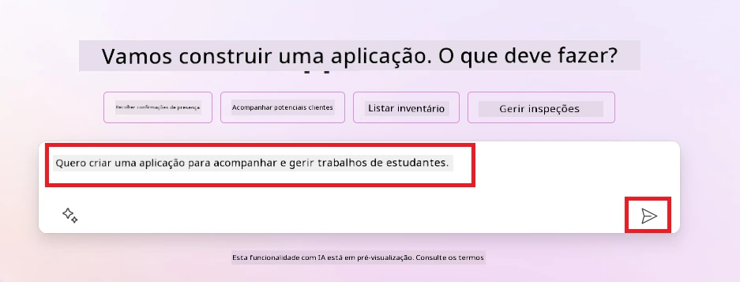

1. O AI Copilot irá sugerir uma Tabela Dataverse com os campos necessários para armazenar os dados que quer rastrear e alguns dados de amostra. Pode então personalizar a tabela para satisfazer as suas necessidades usando a funcionalidade assistente AI Copilot através de passos conversacionais.

   > **Importante**: O Dataverse é a plataforma de dados subjacente para o Power Platform. É uma plataforma de dados low-code para armazenar os dados da aplicação. É um serviço totalmente gerido que armazena dados de forma segura na Microsoft Cloud e é provisionado dentro do seu ambiente Power Platform. Vem com capacidades integradas de governação de dados, como classificação de dados, linhagem de dados, controlo de acesso fino e mais. Pode aprender mais sobre o Dataverse [aqui](https://learn.microsoft.com/power-apps/maker/data-platform/data-platform-intro?WT.mc_id=academic-109639-somelezediko).

   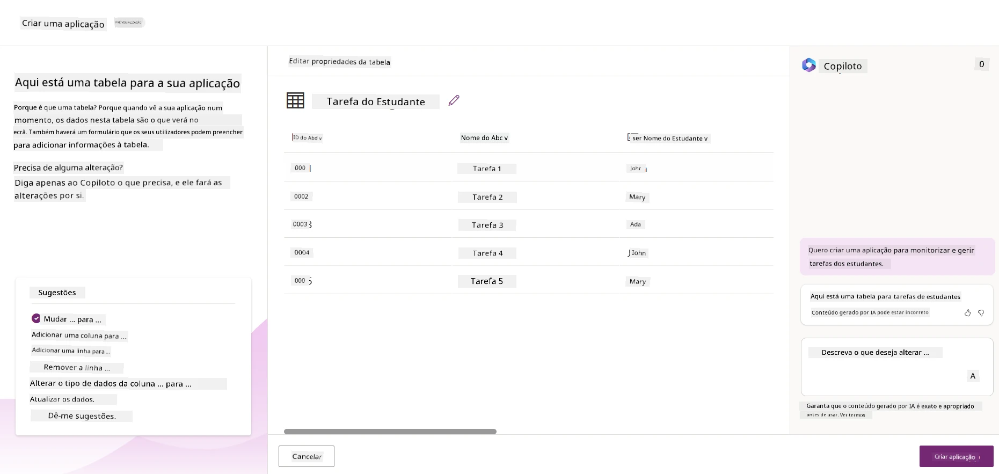

1. Os educadores querem enviar emails aos estudantes que entregaram as suas tarefas para os manter atualizados sobre o progresso das suas tarefas. Pode usar o Copilot para adicionar um novo campo à tabela para armazenar o email do estudante. Por exemplo, pode usar o seguinte prompt para adicionar uma nova coluna à tabela: **_Quero adicionar uma coluna para armazenar email do estudante_**. Clique no botão **Enviar** para enviar o prompt ao AI Copilot.

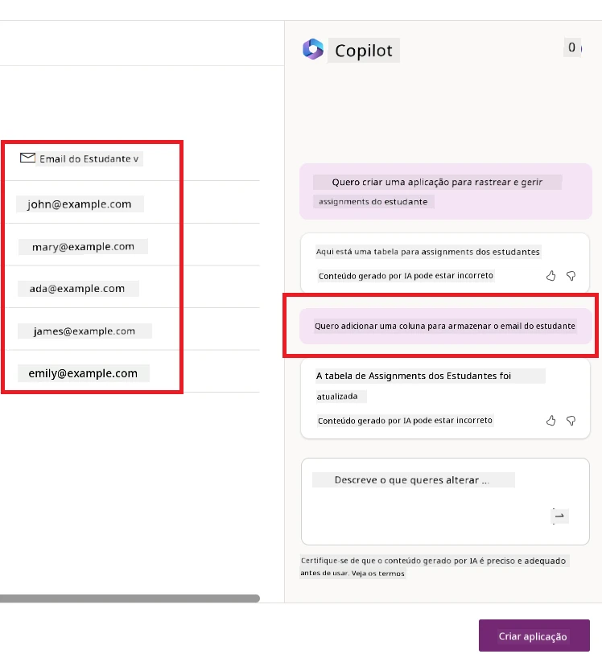

1. O AI Copilot irá gerar um novo campo e pode depois personalizar o campo para satisfazer as suas necessidades.

1. Depois de concluir a tabela, clique no botão **Criar aplicação** para criar a aplicação.

1. O AI Copilot irá gerar uma aplicação Canvas responsiva com base na sua descrição. Pode depois personalizar a aplicação para satisfazer as suas necessidades.

1. Para educadores enviarem emails aos estudantes, pode usar o Copilot para adicionar um novo ecrã à aplicação. Por exemplo, pode usar o seguinte prompt para adicionar um novo ecrã à aplicação: **_Quero adicionar um ecrã para enviar emails aos estudantes_**. Clique no botão **Enviar** para enviar o prompt ao AI Copilot.

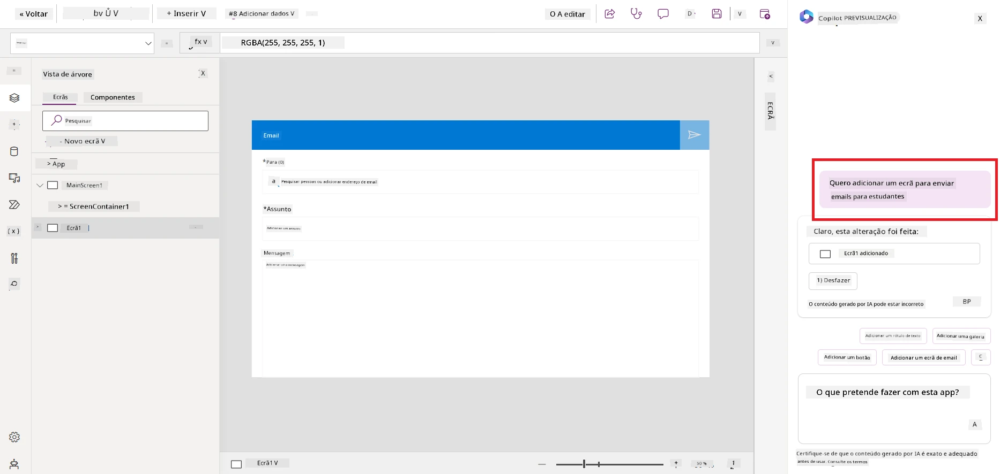

1. O AI Copilot irá gerar um novo ecrã e pode depois personalizar o ecrã para satisfazer as suas necessidades.

1. Depois de concluir a aplicação, clique no botão **Guardar** para guardar a aplicação.

1. Para partilhar a aplicação com os educadores, clique no botão **Partilhar** e depois clique novamente no botão **Partilhar**. Pode então partilhar a aplicação com os educadores inserindo os seus endereços de email.

> **O seu trabalho de casa**: A aplicação que acabou de construir é um bom começo, mas pode ser melhorada. Com a funcionalidade de email, os educadores só podem enviar emails manualmente aos estudantes, tendo que digitar os seus emails. Consegue usar o Copilot para construir uma automação que permita aos educadores enviar emails automaticamente aos estudantes quando estes entregam os seus trabalhos? A dica é que com o prompt correto pode usar o Copilot no Power Automate para construir isto.

### Construir uma Tabela de Informação de Faturas para a Nossa Startup

A equipa financeira da nossa startup tem tido dificuldades em acompanhar as faturas. Eles têm usado uma folha de cálculo para rastrear as faturas, mas isto tornou-se difícil de gerir à medida que o número de faturas aumentou. Pediram-lhe para construir uma tabela que os ajude a armazenar, rastrear e gerir a informação das faturas que receberam. A tabela deverá ser usada para construir uma automação que extraia toda a informação da fatura e a guarde na tabela. A tabela deverá também permitir à equipa financeira ver as faturas que foram pagas e as que não foram.

A Power Platform tem uma plataforma de dados subjacente chamada Dataverse que lhe permite armazenar os dados para as suas aplicações e soluções. O Dataverse oferece uma plataforma de dados low-code para armazenar os dados da aplicação. É um serviço totalmente gerido que armazena dados de forma segura na Microsoft Cloud e é providenciado dentro do seu ambiente Power Platform. Vem com capacidades incorporadas de governação de dados, tais como classificação de dados, origem dos dados, controlo de acesso detalhado, e mais. Pode saber mais [sobre o Dataverse aqui](https://learn.microsoft.com/power-apps/maker/data-platform/data-platform-intro?WT.mc_id=academic-109639-somelezediko).

Porque devemos usar o Dataverse para a nossa startup? As tabelas padrão e personalizadas dentro do Dataverse oferecem uma opção de armazenamento segura e baseada na nuvem para os seus dados. As tabelas permitem-lhe armazenar diferentes tipos de dados, de forma semelhante a como pode usar várias folhas num único livro do Excel. Pode usar tabelas para armazenar dados específicos às necessidades da sua organização ou negócios. Alguns dos benefícios que a nossa startup terá ao usar o Dataverse incluem, mas não se limitam a:

- **Fácil de gerir**: Tanto a metainformação como os dados são armazenados na nuvem, por isso não precisa preocupar-se com os detalhes de como são armazenados ou geridos. Pode focar-se em construir as suas aplicações e soluções.

- **Seguro**: O Dataverse oferece uma opção segura e baseada na nuvem para armazenar os seus dados. Pode controlar quem tem acesso aos dados nas suas tabelas e como podem aceder a eles usando segurança baseada em funções.

- **Metainformação rica**: Tipos de dados e relações são usados diretamente dentro do Power Apps

- **Lógica e validação**: Pode usar regras de negócio, campos calculados e regras de validação para reforçar a lógica de negócio e manter a precisão dos dados.

Agora que sabe o que é o Dataverse e porque deve usá-lo, vejamos como pode usar o Copilot para criar uma tabela no Dataverse que satisfaça os requisitos da nossa equipa financeira.

> **Nota** : Usará esta tabela na próxima secção para construir uma automação que extraia toda a informação das faturas e a armazene na tabela.

Para criar uma tabela no Dataverse usando o Copilot, siga os passos abaixo:

1. Navegue até ao ecrã inicial do [Power Apps](https://make.powerapps.com?WT.mc_id=academic-105485-koreyst).

2. Na barra de navegação à esquerda, selecione **Tabelas** e depois clique em **Descrever a nova Tabela**.

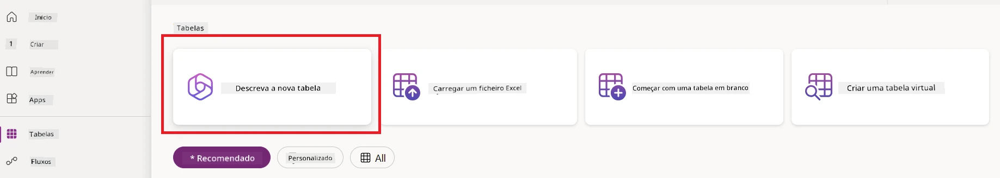

1. No ecrã **Descrever a nova Tabela**, use a área de texto para descrever a tabela que quer criar. Por exemplo, **_Quero criar uma tabela para armazenar informação de faturas_**. Clique no botão **Enviar** para enviar o prompt ao AI Copilot.

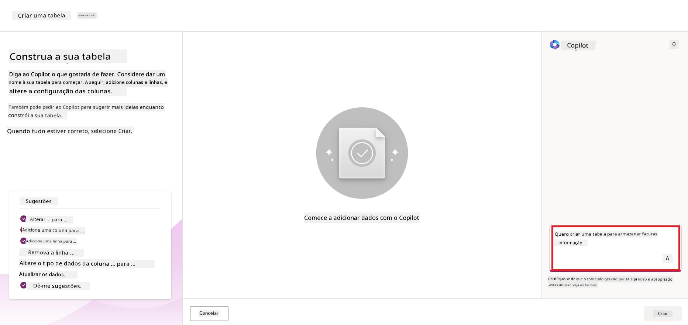

1. O AI Copilot sugerirá uma Tabela Dataverse com os campos de que precisa para armazenar os dados que quer rastrear e alguns dados de exemplo. Pode depois personalizar a tabela para satisfazer as suas necessidades usando a funcionalidade de assistente AI Copilot através de passos conversacionais.

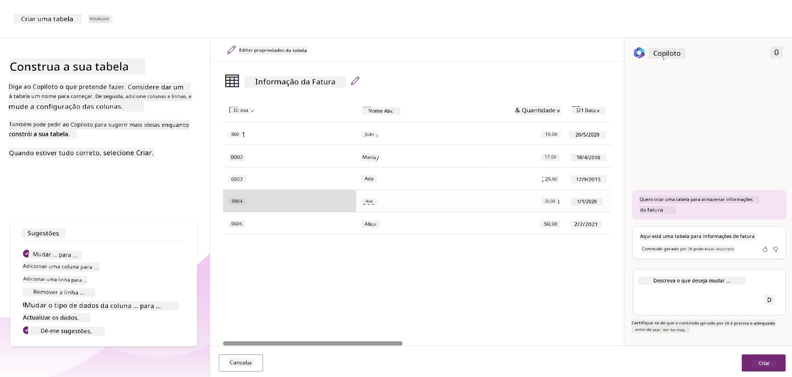

1. A equipa financeira quer enviar um email ao fornecedor para o atualizar com o estado atual da sua fatura. Pode usar o Copilot para adicionar um novo campo à tabela para armazenar o email do fornecedor. Por exemplo, pode usar o seguinte prompt para adicionar uma nova coluna à tabela: **_Quero adicionar uma coluna para armazenar o email do fornecedor_**. Clique no botão **Enviar** para enviar o prompt ao AI Copilot.

1. O AI Copilot irá gerar um novo campo e pode depois personalizar o campo para satisfazer as suas necessidades.

1. Depois de concluir a tabela, clique no botão **Criar** para criar a tabela.

## Modelos de IA na Power Platform com AI Builder

O AI Builder é uma capacidade de IA low-code disponível na Power Platform que lhe permite usar Modelos de IA para ajudar a automatizar processos e prever resultados. Com o AI Builder pode trazer IA para as suas aplicações e fluxos que se ligam aos seus dados no Dataverse ou em várias fontes de dados na nuvem, como SharePoint, OneDrive ou Azure.

## Modelos de IA pré-construídos vs Modelos de IA personalizados

O AI Builder disponibiliza dois tipos de Modelos de IA: Modelos de IA pré-construídos e Modelos de IA personalizados. Os Modelos de IA pré-construídos são modelos prontos a usar, treinados pela Microsoft e disponíveis na Power Platform. Estes ajudam-no a adicionar inteligência às suas aplicações e fluxos sem ter que recolher dados e depois construir, treinar e publicar os seus próprios modelos. Pode usar estes modelos para automatizar processos e prever resultados.

Alguns dos Modelos de IA pré-construídos disponíveis na Power Platform incluem:

- **Extração de Frases-Chave**: Este modelo extrai frases-chave de texto.
- **Deteção de Língua**: Este modelo deteta a língua de um texto.
- **Análise de Sentimento**: Este modelo deteta sentimento positivo, negativo, neutro ou misto no texto.
- **Leitor de Cartões de Visita**: Este modelo extrai informação de cartões de visita.
- **Reconhecimento de Texto**: Este modelo extrai texto de imagens.
- **Deteção de Objetos**: Este modelo deteta e extrai objetos de imagens.
- **Processamento de Documentos**: Este modelo extrai informação de formulários.
- **Processamento de Faturas**: Este modelo extrai informação de faturas.

Com Modelos de IA personalizados pode trazer o seu próprio modelo para o AI Builder para que funcione como qualquer modelo personalizado do AI Builder, permitindo treinar o modelo com os seus próprios dados. Pode usar estes modelos para automatizar processos e prever resultados tanto no Power Apps como no Power Automate. Ao usar o seu próprio modelo, aplicam-se algumas limitações. Leia mais sobre estas [limitações](https://learn.microsoft.com/ai-builder/byo-model#limitations?WT.mc_id=academic-105485-koreyst).

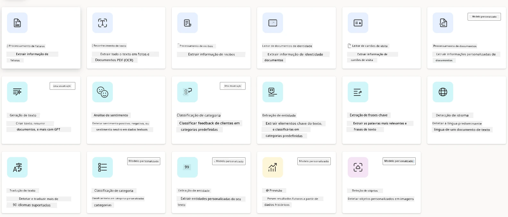

## Exercício #2 - Construir um Fluxo de Processamento de Faturas para a Nossa Startup

A equipa financeira tem tido dificuldades em processar faturas. Eles têm usado uma folha de cálculo para rastrear as faturas, mas isto tornou-se difícil de gerir à medida que o número de faturas aumentou. Pediram-lhe para construir um fluxo de trabalho que os ajude a processar faturas usando IA. O fluxo de trabalho deverá permitir-lhes extrair informação das faturas e armazenar essa informação numa tabela Dataverse. O fluxo de trabalho deverá também permitir-lhes enviar um email à equipa financeira com a informação extraída.

Agora que sabe o que é o AI Builder e porque deve usá-lo, vejamos como pode usar o Modelo de IA de Processamento de Faturas no AI Builder, que vimos anteriormente, para construir um fluxo que ajude a equipa financeira a processar faturas.

Para construir um fluxo que ajude a equipa financeira a processar faturas usando o Modelo de IA de Processamento de Faturas no AI Builder, siga os passos abaixo:

1. Navegue até ao ecrã inicial do [Power Automate](https://make.powerautomate.com?WT.mc_id=academic-105485-koreyst).

2. Use a área de texto no ecrã inicial para descrever o fluxo que pretende construir. Por exemplo, **_Processar uma fatura quando esta chegar à minha caixa de entrada_**. Clique no botão **Enviar** para enviar o prompt ao AI Copilot.

   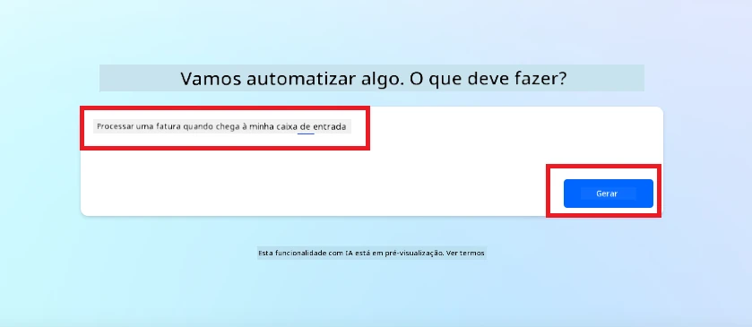

3. O AI Copilot sugerirá as ações necessárias para realizar a tarefa que quer automatizar. Pode clicar no botão **Seguinte** para avançar para os próximos passos.

4. Na etapa seguinte, o Power Automate vai solicitar que configure as ligações necessárias para o fluxo. Depois de terminar, clique no botão **Criar fluxo** para criar o fluxo.

5. O AI Copilot irá gerar um fluxo e pode depois personalizar o fluxo para satisfazer as suas necessidades.

6. Atualize o gatilho do fluxo e defina a **Pasta** para a pasta onde as faturas serão armazenadas. Por exemplo, pode definir a pasta para **Caixa de Entrada**. Clique em **Mostrar opções avançadas** e defina **Apenas com anexos** para **Sim**. Isto garantirá que o fluxo só corre quando um email com anexo for recebido na pasta.

7. Remova as seguintes ações do fluxo: **HTML para texto**, **Compor**, **Compor 2**, **Compor 3** e **Compor 4** porque não as irá usar.

8. Remova a ação **Condição** do fluxo porque não a irá usar. O aspeto deverá ser como no seguinte screenshot:

   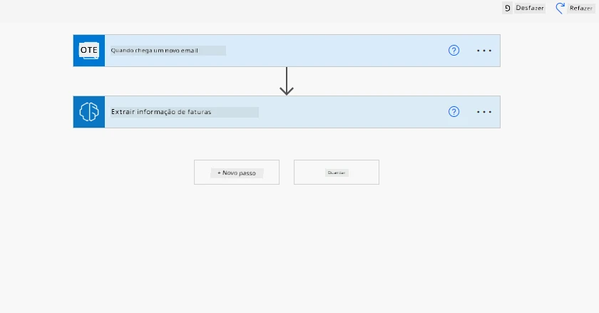

9. Clique no botão **Adicionar uma ação** e pesquise por **Dataverse**. Selecione a ação **Adicionar uma nova linha**.

10. Na ação **Extrair Informação das faturas**, atualize o **Ficheiro da Fatura** para apontar para o **Conteúdo do Anexo** do email. Isto garantirá que o fluxo extraia informação do anexo da fatura.

11. Selecione a **Tabela** que criou anteriormente. Por exemplo, pode selecionar a tabela **Informação de Fatura**. Escolha o conteúdo dinâmico da ação anterior para preencher os seguintes campos:

    - ID
    - Montante
    - Data
    - Nome
    - Estado - Defina o **Estado** para **Pendente**.
    - Email do Fornecedor - Use o conteúdo dinâmico **De** do gatilho **Quando chega um novo email**.

    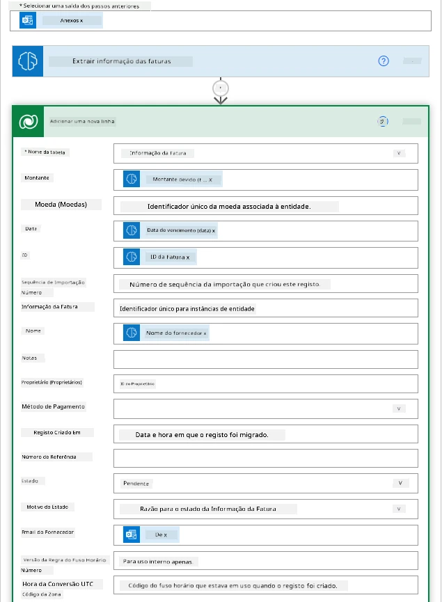

12. Depois de terminar o fluxo, clique no botão **Guardar** para guardar o fluxo. Pode então testar o fluxo enviando um email com uma fatura para a pasta que especificou no gatilho.

> **O seu trabalho de casa**: O fluxo que acabou de construir é um bom começo, agora precisa de pensar em como pode construir uma automação que permita à nossa equipa financeira enviar um email ao fornecedor para o atualizar com o estado atual da sua fatura. A sua dica: o fluxo deve funcionar quando o estado da fatura mudar.

## Usar um Modelo de IA de Geração de Texto no Power Automate

O Modelo de IA Criar Texto com GPT no AI Builder permite gerar texto com base num prompt e é alimentado pelo Microsoft Azure OpenAI Service. Com esta capacidade, pode incorporar a tecnologia GPT (Transformador Generativo Pré-Treinado) nas suas aplicações e fluxos para construir uma variedade de fluxos automatizados e aplicações perspicazes.

Os modelos GPT passam por um extenso treino com grandes quantidades de dados, permitindo-lhes produzir texto que se assemelha muito à linguagem humana quando lhes é dado um prompt. Quando integrados com a automação de fluxos de trabalho, modelos de IA como o GPT podem ser usados para simplificar e automatizar uma vasta gama de tarefas.

Por exemplo, pode construir fluxos para gerar automaticamente texto para várias situações, como: rascunhos de emails, descrições de produtos, e mais. Também pode usar o modelo para gerar texto para várias aplicações, como chatbots e aplicações de serviço ao cliente que permitem aos agentes responder eficaz e eficientemente às perguntas dos clientes.

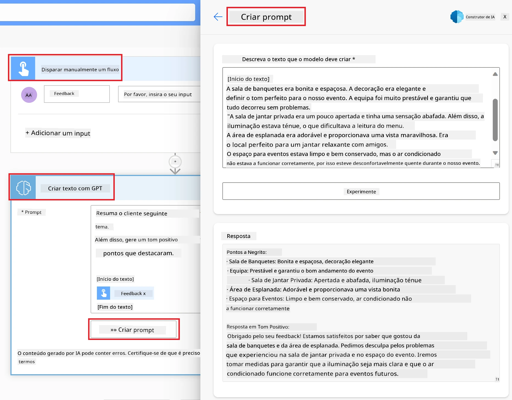

Para aprender como usar este Modelo de IA no Power Automate, consulte o módulo [Adicionar inteligência com AI Builder e GPT](https://learn.microsoft.com/training/modules/ai-builder-text-generation/?WT.mc_id=academic-109639-somelezediko).

## Excelente Trabalho! Continue a Sua Aprendizagem

Depois de concluir esta lição, explore a nossa [coleção de Aprendizagem de IA Generativa](https://aka.ms/genai-collection?WT.mc_id=academic-105485-koreyst) para continuar a aprofundar o seu conhecimento sobre IA Generativa!

Quer personalizar e tirar mais proveito do Copilot? Explore [Awesome Copilot](https://github.com/github/awesome-copilot?WT.mc_id=academic-105485-koreyst) — uma coleção contribuída pela comunidade com instruções, agentes, habilidades e configurações para o ajudar a aproveitar ao máximo o GitHub Copilot.

Vá para a Lição 11 onde veremos como [integrar IA Generativa com Chamada de Função](../11-integrating-with-function-calling/README.md?WT.mc_id=academic-105485-koreyst)!

---

<!-- CO-OP TRANSLATOR DISCLAIMER START -->
**Aviso Legal**:
Este documento foi traduzido utilizando o serviço de tradução automática [Co-op Translator](https://github.com/Azure/co-op-translator). Embora nos esforcemos pela precisão, esteja ciente de que traduções automáticas podem conter erros ou imprecisões. O documento original na sua língua nativa deve ser considerado a fonte autorizada. Para informações críticas, recomenda-se tradução profissional humana. Não nos responsabilizamos por quaisquer mal-entendidos ou interpretações incorretas resultantes da utilização desta tradução.
<!-- CO-OP TRANSLATOR DISCLAIMER END -->