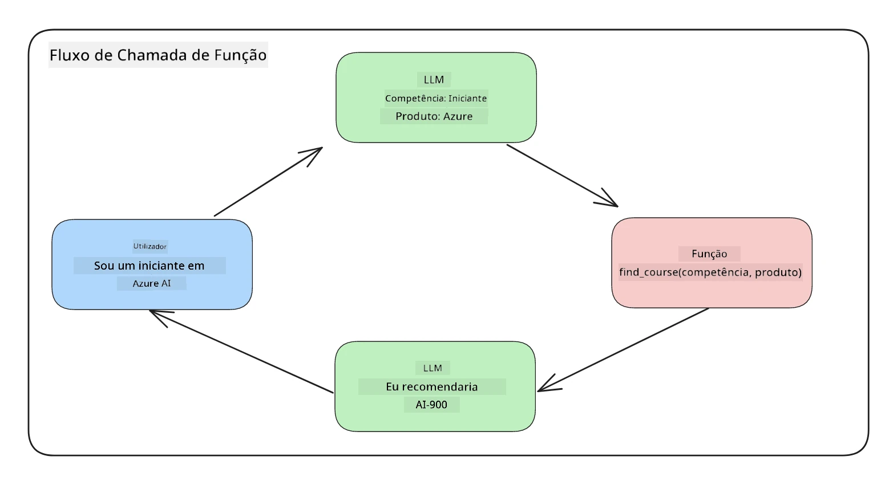
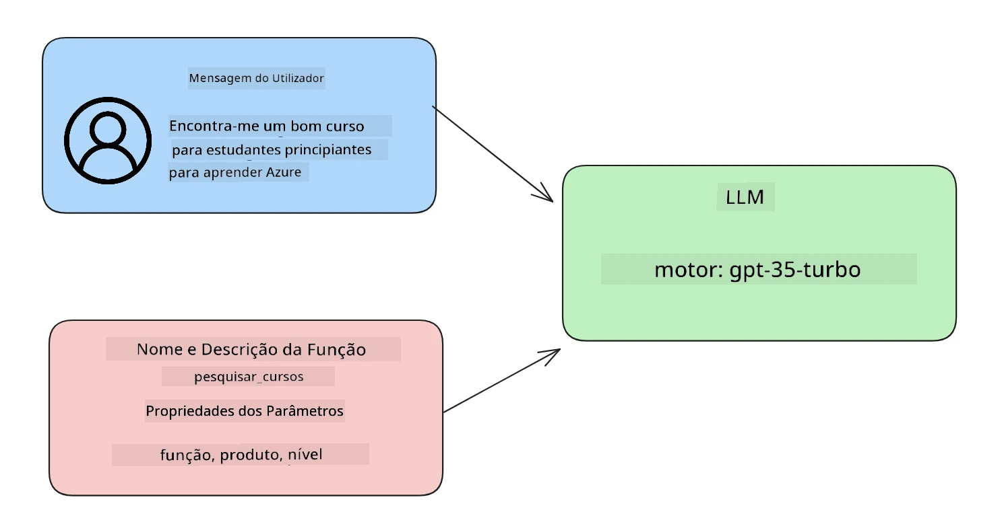

# Integração com chamadas de função

[](https://youtu.be/DgUdCLX8qYQ?si=f1ouQU5HQx6F8Gl2)

Já aprendeu bastante até agora nas lições anteriores. No entanto, podemos melhorar ainda mais. Algumas coisas que podemos abordar são como obter um formato de resposta mais consistente para facilitar o trabalho com a resposta a jusante. Além disso, podemos querer adicionar dados de outras fontes para enriquecer ainda mais a nossa aplicação.

Os problemas acima mencionados são o que este capítulo procura resolver.

## Introdução

Esta lição irá cobrir:

- Explicar o que é a chamada de função e os seus casos de uso.
- Criar uma chamada de função usando Azure OpenAI.
- Como integrar uma chamada de função numa aplicação.

## Objetivos de aprendizagem

No final desta lição, será capaz de:

- Explicar o propósito de usar chamadas de função.
- Configurar uma Chamada de Função usando o serviço Azure OpenAI.
- Projetar chamadas de função eficazes para o caso de uso da sua aplicação.

## Cenário: Melhorar o nosso chatbot com funções

Para esta lição, queremos construir uma funcionalidade para a nossa startup de educação que permita aos utilizadores usar um chatbot para encontrar cursos técnicos. Recomendaremos cursos que se adequem ao seu nível de competência, função atual e tecnologia de interesse.

Para completar este cenário, vamos usar uma combinação de:

- `Azure OpenAI` para criar uma experiência de chat para o utilizador.
- `Microsoft Learn Catalog API` para ajudar os utilizadores a encontrar cursos baseados no pedido do utilizador.
- `Function Calling` para pegar na consulta do utilizador e enviá-la para uma função para fazer o pedido à API.

Para começar, vejamos porque gostaríamos de usar chamadas de função em primeiro lugar:

## Porquê a Chamada de Função

Antes da chamada de função, as respostas de um LLM eram não estruturadas e inconsistentes. Os programadores eram obrigados a escrever código complexo de validação para se certificarem de que conseguiam lidar com cada variação de resposta. Os utilizadores não conseguiam obter respostas a perguntas como "Qual é o tempo atual em Estocolmo?". Isto deve-se ao facto dos modelos estarem limitados à época em que os dados foram treinados.

A Chamada de Função é uma funcionalidade do Serviço Azure OpenAI para ultrapassar as seguintes limitações:

- **Formato de resposta consistente**. Se conseguirmos controlar melhor o formato da resposta, podemos integrar a resposta com mais facilidade a jusante com outros sistemas.
- **Dados externos**. Capacidade de usar dados de outras fontes de uma aplicação num contexto de chat.

## Ilustrando o problema através de um cenário

> Recomendamos que utilize o [caderno incluído](./python/aoai-assignment.ipynb?WT.mc_id=academic-105485-koreyst) se quiser executar o cenário abaixo. Pode também simplesmente ler, pois estamos a tentar ilustrar um problema onde as funções podem ajudar a resolver o problema.

Vejamos o exemplo que ilustra o problema do formato de resposta:

Digamos que queremos criar uma base de dados de dados de estudantes para que possamos sugerir o curso certo para eles. Abaixo temos duas descrições de estudantes que são muito semelhantes nos dados que contêm.

1. Crie uma ligação ao nosso recurso Azure OpenAI:

   ```python
   import os
   import json
   from openai import OpenAI
   from dotenv import load_dotenv
   load_dotenv()

   # A API de Respostas é servida a partir do Azure OpenAI (Microsoft Foundry) v1
   # endpoint, por isso direcionamos o cliente OpenAI para <seu-endpoint>/openai/v1/.
   endpoint = os.environ['AZURE_OPENAI_ENDPOINT']
   client = OpenAI(
   api_key=os.environ['AZURE_OPENAI_API_KEY'],
   base_url=f"{endpoint.rstrip('/')}/openai/v1/",
   )

   deployment=os.environ['AZURE_OPENAI_DEPLOYMENT']
   ```

   Abaixo está algum código Python para configurar a nossa ligação ao Azure OpenAI. Porque usamos o endpoint v1, só precisamos de definir o `api_key` e o `base_url` (não é necessário `api_version`).

1. Criar duas descrições de estudante usando as variáveis `student_1_description` e `student_2_description`.

   ```python
   student_1_description="Emily Johnson is a sophomore majoring in computer science at Duke University. She has a 3.7 GPA. Emily is an active member of the university's Chess Club and Debate Team. She hopes to pursue a career in software engineering after graduating."

   student_2_description = "Michael Lee is a sophomore majoring in computer science at Stanford University. He has a 3.8 GPA. Michael is known for his programming skills and is an active member of the university's Robotics Club. He hopes to pursue a career in artificial intelligence after finishing his studies."
   ```

   Queremos enviar as descrições dos estudantes acima para um LLM para analisar os dados. Estes dados podem depois ser usados na nossa aplicação e enviados para uma API ou armazenados numa base de dados.

1. Vamos criar dois prompts idênticos onde instruímos o LLM sobre a informação em que estamos interessados:

   ```python
   prompt1 = f'''
   Please extract the following information from the given text and return it as a JSON object:

   name
   major
   school
   grades
   club

   This is the body of text to extract the information from:
   {student_1_description}
   '''

   prompt2 = f'''
   Please extract the following information from the given text and return it as a JSON object:

   name
   major
   school
   grades
   club

   This is the body of text to extract the information from:
   {student_2_description}
   '''
   ```

   Os prompts acima instruem o LLM a extrair informações e devolver a resposta em formato JSON.

1. Depois de configurar os prompts e a ligação ao Azure OpenAI, agora vamos enviar os prompts ao LLM usando `client.responses.create`. Guardamos o prompt na variável `input` e atribuímos o papel a `user`. Isto é para imitar uma mensagem de um utilizador a ser escrita para um chatbot.

   ```python
   # resposta do prompt um
   openai_response1 = client.responses.create(
   model=deployment,
   input = [{'role': 'user', 'content': prompt1}],
   store=False,
   )
   openai_response1.output_text

   # resposta do prompt dois
   openai_response2 = client.responses.create(
   model=deployment,
   input = [{'role': 'user', 'content': prompt2}],
   store=False,
   )
   openai_response2.output_text
   ```

Agora podemos enviar ambos os pedidos para o LLM e examinar a resposta que recebemos encontrando-a assim `openai_response1.output_text`.

1. Por fim, podemos converter a resposta para formato JSON chamando `json.loads`:

   ```python
   # A carregar a resposta como um objeto JSON
   json_response1 = json.loads(openai_response1.output_text)
   json_response1
   ```

   Resposta 1:

   ```json
   {
     "name": "Emily Johnson",
     "major": "computer science",
     "school": "Duke University",
     "grades": "3.7",
     "club": "Chess Club"
   }
   ```

   Resposta 2:

   ```json
   {
     "name": "Michael Lee",
     "major": "computer science",
     "school": "Stanford University",
     "grades": "3.8 GPA",
     "club": "Robotics Club"
   }
   ```

   Apesar dos prompts serem iguais e as descrições similares, vemos valores da propriedade `Grades` formatados de forma diferente, pois por vezes podemos obter o formato `3.7` ou `3.7 GPA`, por exemplo.

   Este resultado acontece porque o LLM recebe dados não estruturados na forma do prompt escrito e devolve também dados não estruturados. Precisamos de ter um formato estruturado para sabermos o que esperar ao armazenar ou usar estes dados.

Então, como resolvemos o problema de formatação? Usando chamadas funcionais, podemos garantir que recebemos dados estruturados de volta. Ao usar chamadas de função, o LLM na realidade não chama nem executa funções. Em vez disso, criamos uma estrutura para o LLM seguir nas suas respostas. Usamos então essas respostas estruturadas para saber qual função executar nas nossas aplicações.



Podemos então pegar no que é devolvido pela função e enviar isso de volta ao LLM. O LLM irá depois responder usando linguagem natural para responder à questão do utilizador.

## Casos de Uso para usar chamadas de função

Existem muitos casos de uso diferentes onde chamadas de função podem melhorar a sua aplicação, como:

- **Chamar Ferramentas Externas**. Os chatbots são excelentes para fornecer respostas às perguntas dos utilizadores. Ao usar chamadas de função, os chatbots podem usar mensagens dos utilizadores para completar determinadas tarefas. Por exemplo, um estudante pode pedir ao chatbot para "Enviar um email ao meu instrutor a dizer que preciso de mais ajuda com esta matéria". Isto pode fazer uma chamada de função para `send_email(to: string, body: string)`

- **Criar Consultas a API ou Base de Dados**. Os utilizadores podem encontrar informação usando linguagem natural que é convertida numa consulta formatada ou pedido a uma API. Um exemplo disto poderia ser um professor que pede "Quem são os estudantes que completaram o último trabalho" que poderia chamar uma função chamada `get_completed(student_name: string, assignment: int, current_status: string)`

- **Criar Dados Estruturados**. Os utilizadores podem pegar num bloco de texto ou CSV e usar o LLM para extrair informações importantes. Por exemplo, um estudante pode converter um artigo da Wikipedia sobre acordos de paz para criar flashcards de IA. Isto pode ser feito usando uma função chamada `get_important_facts(agreement_name: string, date_signed: string, parties_involved: list)`

## Criando a sua Primeira Chamada de Função

O processo de criar uma chamada de função inclui 3 passos principais:

1. **Chamar** a API de Respostas com uma lista das suas funções (ferramentas) e uma mensagem de utilizador.
2. **Ler** a resposta do modelo para executar uma ação, por exemplo executar uma função ou um pedido a uma API.
3. **Fazer** outra chamada à API de Respostas com a resposta da sua função para usar essa informação para criar uma resposta para o utilizador.



### Passo 1 - criar mensagens

O primeiro passo é criar uma mensagem de utilizador. Isto pode ser atribuído dinamicamente pegando no valor de um input de texto ou pode atribuir um valor aqui. Se esta for a sua primeira vez a trabalhar com a API de Respostas, precisamos definir o `role` e o `content` da mensagem.

O `role` pode ser `system` (criando regras), `assistant` (o modelo) ou `user` (o utilizador final). Para chamadas de função, vamos atribuí-lo como `user` e uma pergunta de exemplo.

```python
messages= [ {"role": "user", "content": "Find me a good course for a beginner student to learn Azure."} ]
```

Ao atribuir diferentes papéis, fica claro para o LLM se é o sistema a dizer algo ou o utilizador, o que ajuda a construir um histórico de conversa sobre o qual o LLM pode desenvolver-se.

### Passo 2 - criar funções

A seguir, vamos definir uma função e os parâmetros dessa função. Usaremos apenas uma função aqui chamada `search_courses`, mas pode criar múltiplas funções.

> **Importante** : As funções são incluídas na mensagem do sistema para o LLM e serão incluídas na quantidade de tokens disponíveis que tem.

Abaixo, criamos as funções como um array de itens. Cada item é uma ferramenta no formato plano da API de Respostas, com propriedades `type`, `name`, `description` e `parameters`:

```python
functions = [
   {
      "type":"function",
      "name":"search_courses",
      "description":"Retrieves courses from the search index based on the parameters provided",
      "parameters":{
         "type":"object",
         "properties":{
            "role":{
               "type":"string",
               "description":"The role of the learner (i.e. developer, data scientist, student, etc.)"
            },
            "product":{
               "type":"string",
               "description":"The product that the lesson is covering (i.e. Azure, Power BI, etc.)"
            },
            "level":{
               "type":"string",
               "description":"The level of experience the learner has prior to taking the course (i.e. beginner, intermediate, advanced)"
            }
         },
         "required":[
            "role"
         ]
      }
   }
]
```

Vamos descrever cada instância de função mais em detalhe abaixo:

- `name` - O nome da função que queremos que seja chamada.
- `description` - Esta é a descrição de como a função funciona. Aqui é importante ser específico e claro.
- `parameters` - Uma lista de valores e formato que quer que o modelo produza na sua resposta. O array de parâmetros consiste em itens onde os itens têm as seguintes propriedades:
  1.  `type` - O tipo de dados onde as propriedades serão guardadas.
  1.  `properties` - Lista dos valores específicos que o modelo usará na sua resposta
      1. `name` - A chave é o nome da propriedade que o modelo usará na sua resposta formatada, por exemplo, `product`.
      1. `type` - O tipo de dados desta propriedade, por exemplo, `string`.
      1. `description` - Descrição da propriedade específica.

Há também uma propriedade opcional `required` - propriedade obrigatória para a chamada da função ser completada.

### Passo 3 - Fazer a chamada da função

Depois de definir uma função, agora precisamos incluí-la na chamada à API de Respostas. Fazemo-lo adicionando `tools` ao pedido. Neste caso `tools=functions`.

Há também uma opção para definir `tool_choice` para `auto`. Isto significa que deixamos o LLM decidir qual função deve ser chamada com base na mensagem do utilizador em vez de a atribuirmos nós mesmos.

Aqui está algum código abaixo onde chamamos `client.responses.create`, repare como definimos `tools=functions` e `tool_choice="auto"` e assim dando ao LLM a escolha de quando chamar as funções que lhe fornecemos:

```python
response = client.responses.create(model=deployment,
                                        input=messages,
                                        tools=functions,
                                        tool_choice="auto",
                                        store=False)

print(response.output)
```

A resposta agora inclui um item `function_call` em `response.output` que se parece com isto:

```json
{
  "type": "function_call",
  "name": "search_courses",
  "call_id": "call_abc123",
  "arguments": "{\n  \"role\": \"student\",\n  \"product\": \"Azure\",\n  \"level\": \"beginner\"\n}"
}
```

Aqui podemos ver como a função `search_courses` foi chamada e com que argumentos, conforme listado na propriedade `arguments` na resposta JSON.

A conclusão é que o LLM foi capaz de encontrar os dados para se encaixar nos argumentos da função, pois estava a extrair do valor fornecido no parâmetro `input` na chamada à API de Respostas. Abaixo está um lembrete do valor `messages`:

```python
messages= [ {"role": "user", "content": "Find me a good course for a beginner student to learn Azure."} ]
```

Como pode ver, `student`, `Azure` e `beginner` foram extraídos de `messages` e definidos como input para a função. Usar funções desta forma é uma ótima maneira de extrair informações de um prompt, mas também de fornecer estrutura ao LLM e ter funcionalidades reutilizáveis.

Seguidamente, precisamos de ver como podemos usar isto na nossa aplicação.

## Integrando Chamadas de Função numa Aplicação

Depois de termos testado a resposta formatada do LLM, podemos agora integrá-la numa aplicação.

### Gerindo o fluxo

Para integrar isto na nossa aplicação, vamos tomar os seguintes passos:

1. Primeiro, vamos fazer a chamada aos serviços OpenAI e extrair os itens de chamada de função da resposta `output`.

   ```python
   response_items = response.output
   tool_calls = [item for item in response_items if item.type == "function_call"]
   ```

1. Agora vamos definir a função que irá chamar a API Microsoft Learn para obter uma lista de cursos:

   ```python
   import requests

   def search_courses(role, product, level):
     url = "https://learn.microsoft.com/api/catalog/"
     params = {
        "role": role,
        "product": product,
        "level": level
     }
     response = requests.get(url, params=params)
     modules = response.json()["modules"]
     results = []
     for module in modules[:5]:
        title = module["title"]
        url = module["url"]
        results.append({"title": title, "url": url})
     return str(results)
   ```

   Repare como agora criamos uma função Python real que corresponde aos nomes das funções introduzidos na variável `functions`. Também estamos a fazer chamadas reais a APIs externas para obter os dados que precisamos. Neste caso, vamos contra a API Microsoft Learn para procurar módulos de formação.

Ok, criámos a variável `functions` e uma função Python correspondente, como dizemos ao LLM como mapear ambos para que a nossa função Python seja chamada?

1. Para ver se precisamos de chamar uma função Python, precisamos de olhar para a resposta do LLM e ver se um item `function_call` faz parte dela e chamar a função indicada. Aqui está como pode fazer a verificação mencionada abaixo:

   ```python
   # Verificar se o modelo quer chamar uma função
   if tool_calls:
    for tool_call in tool_calls:
     print("Recommended Function call:")
     print(tool_call.name)
     print()

     # Efetuar a chamada da função.
     function_name = tool_call.name

     available_functions = {
             "search_courses": search_courses,
     }
     function_to_call = available_functions[function_name]

     function_args = json.loads(tool_call.arguments)
     function_response = function_to_call(**function_args)

     print("Output of function call:")
     print(function_response)
     print(type(function_response))

     # Adicionar a chamada da função e o seu resultado de volta à conversa.
     # O item function_call do modelo deve ser acrescentado antes da sua saída.
     messages.append(tool_call)  # o item function_call do assistente
     messages.append( # o resultado da função
         {
             "type": "function_call_output",
             "call_id": tool_call.call_id,
             "output": function_response,
         }
     )
   ```

   Estas três linhas garantem que extraímos o nome da função, os argumentos e fazemos a chamada:

   ```python
   function_to_call = available_functions[function_name]

   function_args = json.loads(tool_call.arguments)
   function_response = function_to_call(**function_args)
   ```

   Abaixo está a saída ao correr o nosso código:

   **Saída**

   ```Recommended Function call:
   {
     "name": "search_courses",
     "arguments": "{\n  \"role\": \"student\",\n  \"product\": \"Azure\",\n  \"level\": \"beginner\"\n}"
   }

   Output of function call:
   [{'title': 'Describe concepts of cryptography', 'url': 'https://learn.microsoft.com/training/modules/describe-concepts-of-cryptography/?
   WT.mc_id=api_CatalogApi'}, {'title': 'Introduction to audio classification with TensorFlow', 'url': 'https://learn.microsoft.com/en-
   us/training/modules/intro-audio-classification-tensorflow/?WT.mc_id=api_CatalogApi'}, {'title': 'Design a Performant Data Model in Azure SQL
   Database with Azure Data Studio', 'url': 'https://learn.microsoft.com/training/modules/design-a-data-model-with-ads/?
   WT.mc_id=api_CatalogApi'}, {'title': 'Getting started with the Microsoft Cloud Adoption Framework for Azure', 'url':
   'https://learn.microsoft.com/training/modules/cloud-adoption-framework-getting-started/?WT.mc_id=api_CatalogApi'}, {'title': 'Set up the
   Rust development environment', 'url': 'https://learn.microsoft.com/training/modules/rust-set-up-environment/?WT.mc_id=api_CatalogApi'}]
   <class 'str'>
   ```

1. Agora vamos enviar a mensagem atualizada, `messages` para o LLM para que possamos receber uma resposta em linguagem natural em vez de uma resposta formatada em JSON da API.

   ```python
   print("Messages in next request:")
   print(messages)
   print()

   second_response = client.responses.create(
      input=messages,
      model=deployment,
      tool_choice="auto",
      tools=functions,
      temperature=0,
      store=False,
         )  # obter uma nova resposta do modelo onde ele pode ver a resposta da função


   print(second_response.output_text)
   ```

   **Saída**

   ```text
   I found some good courses for beginner students to learn Azure:

   1. [Describe concepts of cryptography](https://learn.microsoft.com/training/modules/describe-concepts-of-cryptography/?WT.mc_id=api_CatalogApi)
   2. [Introduction to audio classification with TensorFlow](https://learn.microsoft.com/training/modules/intro-audio-classification-tensorflow/?WT.mc_id=api_CatalogApi)
   3. [Design a Performant Data Model in Azure SQL Database with Azure Data Studio](https://learn.microsoft.com/training/modules/design-a-data-model-with-ads/?WT.mc_id=api_CatalogApi)
   4. [Getting started with the Microsoft Cloud Adoption Framework for Azure](https://learn.microsoft.com/training/modules/cloud-adoption-framework-getting-started/?WT.mc_id=api_CatalogApi)
   5. [Set up the Rust development environment](https://learn.microsoft.com/training/modules/rust-set-up-environment/?WT.mc_id=api_CatalogApi)

   You can click on the links to access the courses.
   ```

## Exercício

Para continuar a sua aprendizagem de Azure OpenAI Chamada de Função pode construir:

- Mais parâmetros da função que possam ajudar os aprendentes a encontrar mais cursos.

- Crie outra chamada de função que recolha mais informações do aprendiz, como a sua língua nativa
- Crie um tratamento de erros quando a chamada da função e/ou chamada de API não retornar cursos adequados

Dica: Siga a página da [documentação de referência da API Learn](https://learn.microsoft.com/training/support/catalog-api-developer-reference?WT.mc_id=academic-105485-koreyst) para ver como e onde estes dados estão disponíveis.

## Excelente trabalho! Continue a jornada

Depois de concluir esta lição, consulte a nossa [coleção de Aprendizagem de IA Generativa](https://aka.ms/genai-collection?WT.mc_id=academic-105485-koreyst) para continuar a aumentar os seus conhecimentos em IA Generativa!

Vá para a Lição 12, onde iremos ver como [desenhar UX para aplicações de IA](../12-designing-ux-for-ai-applications/README.md?WT.mc_id=academic-105485-koreyst)!

---

<!-- CO-OP TRANSLATOR DISCLAIMER START -->
**Aviso Legal**:
Este documento foi traduzido utilizando o serviço de tradução automática [Co-op Translator](https://github.com/Azure/co-op-translator). Embora nos esforcemos pela precisão, esteja ciente de que traduções automáticas podem conter erros ou imprecisões. O documento original na sua língua nativa deve ser considerado a fonte autorizada. Para informações críticas, recomenda-se tradução profissional humana. Não nos responsabilizamos por quaisquer mal-entendidos ou interpretações incorretas resultantes da utilização desta tradução.
<!-- CO-OP TRANSLATOR DISCLAIMER END -->