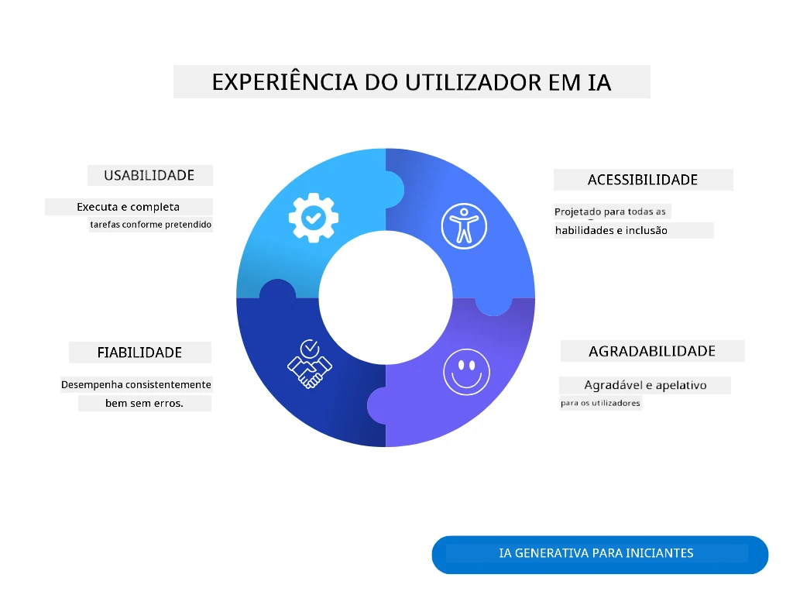
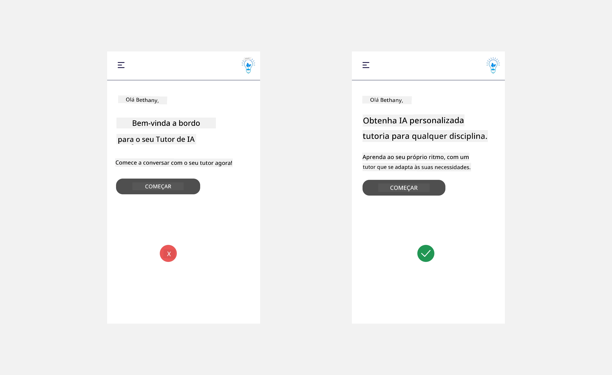
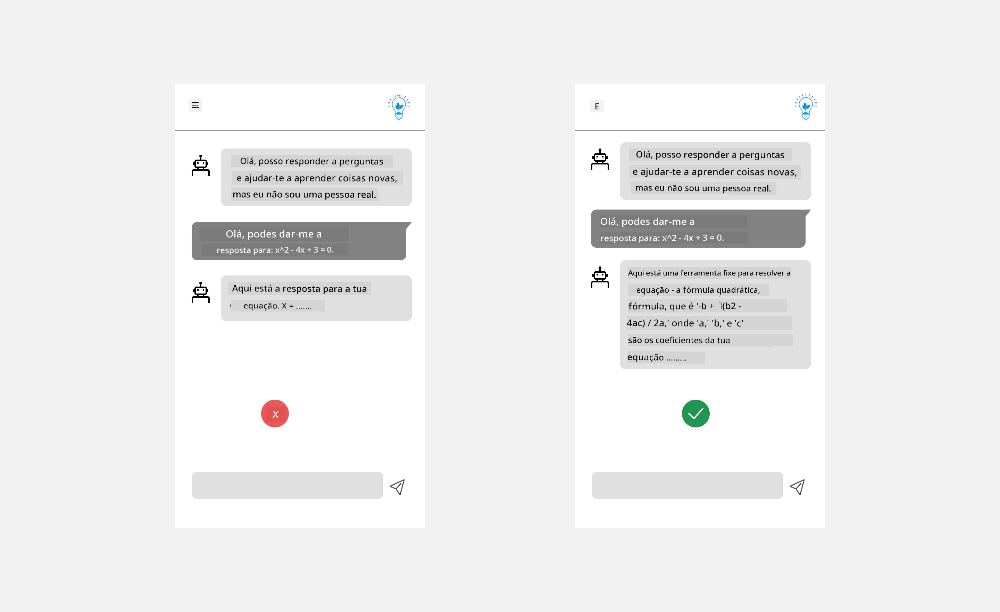
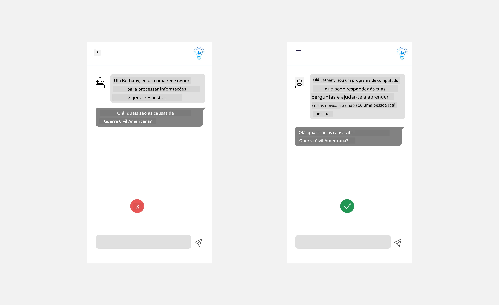
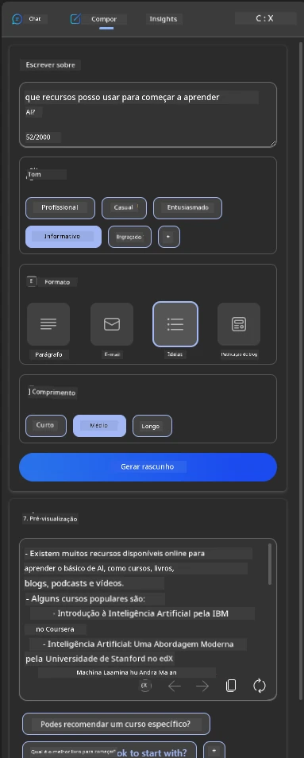
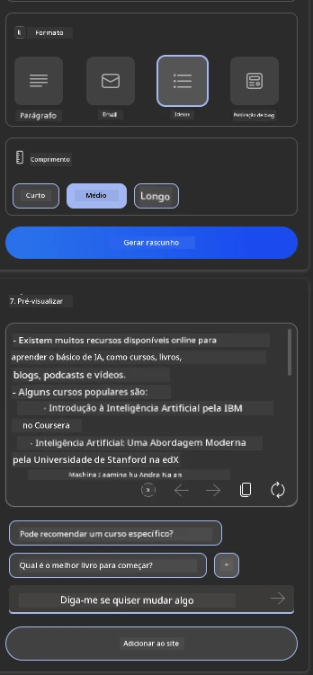
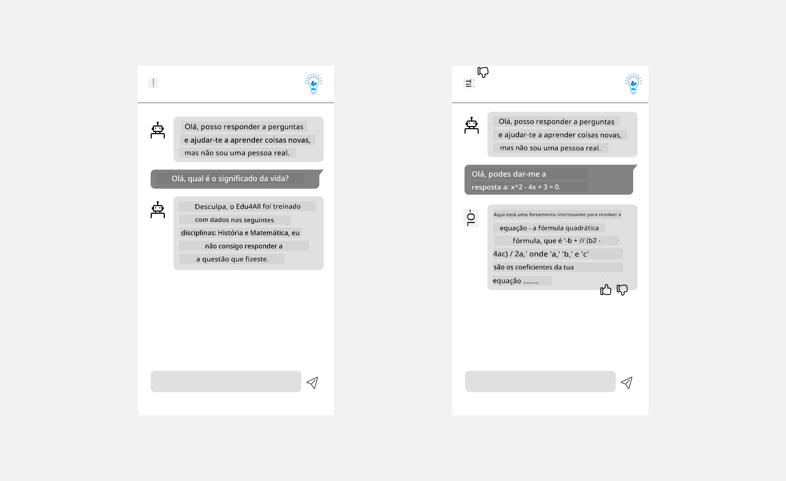

# Projetar UX para Aplicações de IA

> _(Clique na imagem acima para ver o vídeo desta lição)_

A experiência do utilizador é um aspeto muito importante na construção de aplicações. Os utilizadores precisam de conseguir usar a sua aplicação de forma eficiente para realizar tarefas. Ser eficiente é uma coisa, mas também precisa de projetar aplicações para que possam ser usadas por todos, tornando-as _acessíveis_. Este capítulo irá focar-se nesta área para que, esperamos, acabe a projetar uma aplicação que as pessoas consigam e queiram usar.

## Introdução

A experiência do utilizador é como um utilizador interage e usa um produto ou serviço específico, seja um sistema, ferramenta ou design. Ao desenvolver aplicações de IA, os desenvolvedores não se focam apenas em garantir que a experiência do utilizador seja eficaz, mas também ética. Nesta lição, abordamos como construir aplicações de Inteligência Artificial (IA) que respondam às necessidades dos utilizadores.

A lição irá cobrir as seguintes áreas:

- Introdução à Experiência do Utilizador e Compreensão das Necessidades do Utilizador
- Projetar Aplicações de IA para Confiança e Transparência
- Projetar Aplicações de IA para Colaboração e Feedback

## Objetivos de Aprendizagem

Depois de fazer esta lição, será capaz de:

- Compreender como construir aplicações de IA que respondam às necessidades do utilizador.
- Projetar aplicações de IA que promovam a confiança e a colaboração.

### Pré-requisito

Reserve algum tempo para ler mais sobre [experiência do utilizador e design thinking.](https://learn.microsoft.com/training/modules/ux-design?WT.mc_id=academic-105485-koreyst)

## Introdução à Experiência do Utilizador e Compreensão das Necessidades do Utilizador

Na nossa startup fictícia de educação, temos dois utilizadores principais, professores e estudantes. Cada um dos dois utilizadores tem necessidades únicas. Um design centrado no utilizador prioriza o utilizador garantindo que os produtos são relevantes e benéficos para aqueles a quem se destinam.

A aplicação deve ser **útil, fiável, acessível e agradável** para proporcionar uma boa experiência ao utilizador.

### Usabilidade

Ser útil significa que a aplicação tem funcionalidades que correspondem ao seu propósito pretendido, como automatizar o processo de avaliação ou gerar flashcards para revisão. Uma aplicação que automatiza o processo de avaliação deve ser capaz de atribuir pontuações com precisão e eficiência ao trabalho dos estudantes com base em critérios pré-definidos. De igual forma, uma aplicação que gera flashcards para revisão deve conseguir criar questões relevantes e diversificadas baseadas nos seus dados.

### Fiabilidade

Ser fiável significa que a aplicação consegue desempenhar a sua tarefa de forma consistente e sem erros. Contudo, a IA, tal como os humanos, não é perfeita e pode estar sujeita a erros. As aplicações podem encontrar erros ou situações inesperadas que requerem intervenção ou correção humana. Como lida com os erros? Na última secção desta lição, abordaremos como os sistemas e aplicações de IA são projetados para colaboração e feedback.

### Acessibilidade

Ser acessível significa estender a experiência do utilizador a utilizadores com diversas capacidades, incluindo aqueles com deficiências, garantindo que ninguém é excluído. Seguindo as diretrizes e os princípios de acessibilidade, as soluções de IA tornam-se mais inclusivas, utilizáveis e benéficas para todos os utilizadores.

### Agrádavel

Ser agradável significa que a aplicação é agradável de usar. Uma experiência de utilizador apelativa pode ter um impacto positivo no utilizador, encorajando-o a regressar à aplicação e aumentando as receitas.

Nem todos os desafios podem ser resolvidos com IA. A IA surge para aumentar a sua experiência do utilizador, seja automatizando tarefas manuais ou personalizando experiências de utilizador.

## Projetar Aplicações de IA para Confiança e Transparência

Construir confiança é crítico ao projetar aplicações de IA. A confiança garante que um utilizador está confiante de que a aplicação realizará o trabalho, entregará resultados consistentemente e os resultados são o que o utilizador precisa. Um risco nesta área é a desconfiança e a confiança excessiva. A desconfiança ocorre quando um utilizador tem pouca ou nenhuma confiança num sistema de IA, o que leva ao utilizador rejeitar a sua aplicação. A confiança excessiva ocorre quando um utilizador superestima a capacidade de um sistema de IA, levando os utilizadores a confiar demasiado no sistema de IA. Por exemplo, um sistema automático de avaliação no caso de confiança excessiva pode levar o professor a não rever alguns dos trabalhos para garantir que o sistema de avaliação funciona bem. Isto poderia resultar em notas injustas ou incorretas para os estudantes, ou oportunidades perdidas de feedback e melhoria.

Duas formas de garantir que a confiança está no centro do design são a explicabilidade e o controlo.

### Explicabilidade

Quando a IA ajuda a informar decisões como transmitir conhecimento às gerações futuras, é crucial para os professores e pais entenderem como as decisões de IA são tomadas. Isto é explicabilidade - compreender como as aplicações de IA tomam decisões. Projetar para explicabilidade inclui adicionar detalhes que destacam como a IA chegou à saída. O público deve estar ciente de que a saída é gerada pela IA e não por um humano. Por exemplo, em vez de dizer "Comece a conversar com o seu tutor agora", diga "Use um tutor de IA que se adapta às suas necessidades e ajuda-o a aprender ao seu ritmo."

Outro exemplo é como a IA usa dados do utilizador e pessoais. Por exemplo, um utilizador com a persona estudante pode ter limitações baseadas na sua persona. A IA pode não conseguir revelar as respostas às perguntas, mas pode ajudar a guiar o utilizador a pensar em como pode resolver um problema.

Uma última parte chave da explicabilidade é a simplificação das explicações. Estudantes e professores podem não ser especialistas em IA, portanto as explicações sobre o que a aplicação pode ou não pode fazer devem ser simplificadas e fáceis de entender.

### Controlo

A IA generativa cria uma colaboração entre a IA e o utilizador, onde, por exemplo, um utilizador pode modificar os prompts para diferentes resultados. Além disso, uma vez que uma saída é gerada, os utilizadores devem ser capazes de modificar os resultados, dando-lhes uma sensação de controlo. Por exemplo, ao usar o Microsoft Copilot (anteriormente Bing Chat), pode adaptar o seu prompt com base no formato, tom e comprimento. Além disso, pode adicionar alterações à sua saída e modificar a saída, como mostrado abaixo:

Outra funcionalidade no Microsoft Copilot que permite ao utilizador ter controlo sobre a aplicação é a capacidade de optar por dar ou não dados que a IA utiliza. Para uma aplicação escolar, um estudante pode querer usar as suas notas bem como os recursos dos professores como material de revisão.

> Ao projetar aplicações de IA, a intencionalidade é fundamental para garantir que os utilizadores não confiem em excesso, definindo expectativas irreais sobre as suas capacidades. Uma forma de fazer isto é criando atrito entre os prompts e os resultados. Recordando ao utilizador que isto é IA e não um ser humano.

## Projetar Aplicações de IA para Colaboração e Feedback

Como já referido, a IA generativa cria uma colaboração entre o utilizador e a IA. A maioria das interações é com um utilizador a inserir um prompt e a IA a gerar uma saída. E se a saída estiver errada? Como a aplicação lida com erros se eles ocorrerem? A IA culpa o utilizador ou toma tempo para explicar o erro?

As aplicações de IA devem ser construídas para receber e dar feedback. Isto não só ajuda o sistema de IA a melhorar, mas também constrói confiança com os utilizadores. Um ciclo de feedback deve ser incluído no design, um exemplo pode ser um simples polegar para cima ou para baixo na saída.

Outra forma de lidar com isto é comunicar claramente as capacidades e limitações do sistema. Quando um utilizador comete um erro pedindo algo além das capacidades da IA, também deve haver uma forma de lidar com isso, como mostrado abaixo.

Erros no sistema são comuns em aplicações onde o utilizador pode precisar de ajuda com informações fora do âmbito da IA ou a aplicação pode ter um limite sobre quantas perguntas/tópicos um utilizador pode gerar resumos. Por exemplo, uma aplicação de IA treinada com dados em tópicos limitados, por exemplo, História e Matemática, pode não conseguir lidar com perguntas sobre Geografia. Para mitigar isto, o sistema de IA pode dar uma resposta como: "Desculpe, o nosso produto foi treinado com dados nos seguintes temas....., não consigo responder à pergunta que fez."

Aplicações de IA não são perfeitas, portanto, estão destinadas a cometer erros. Ao projetar as suas aplicações, deve garantir que cria espaço para feedback dos utilizadores e para tratamento de erros de forma simples e facilmente explicável.

## Tarefa

Pegue em quaisquer aplicações de IA que tenha construído até agora e considere implementar os passos abaixo na sua aplicação:

- **Agradável:** Considere como pode tornar a sua aplicação mais agradável. Está a adicionar explicações em todos os lados? Está a encorajar o utilizador a explorar? Como está a formular as suas mensagens de erro?

- **Usabilidade:** A desenvolver uma aplicação web. Certifique-se que a sua aplicação é navegável tanto com rato como com teclado.

- **Confiança e transparência:** Não confie completamente na IA e nas suas saídas, considere como adicionaria um humano ao processo para verificar a saída. Além disso, considere e implemente outras formas de alcançar confiança e transparência.

- **Controlo:** Dê ao utilizador controlo sobre os dados que fornece à aplicação. Implemente uma forma de o utilizador poder optar por receber ou não a recolha de dados na aplicação de IA.

<!-- ## [Post-lecture quiz](../../../12-designing-ux-for-ai-applications/quiz-url) -->

## Continue a Aprender!

Depois de completar esta lição, confira a nossa [coleção de Aprendizagem de IA Generativa](https://aka.ms/genai-collection?WT.mc_id=academic-105485-koreyst) para continuar a aumentar o seu conhecimento em IA Generativa!

Vá para a Lição 13, onde veremos como [proteger aplicações de IA](../13-securing-ai-applications/README.md?WT.mc_id=academic-105485-koreyst)!

---

<!-- CO-OP TRANSLATOR DISCLAIMER START -->
**Aviso Legal**:
Este documento foi traduzido utilizando o serviço de tradução automática [Co-op Translator](https://github.com/Azure/co-op-translator). Embora nos esforcemos pela precisão, esteja ciente de que traduções automáticas podem conter erros ou imprecisões. O documento original na sua língua nativa deve ser considerado a fonte autorizada. Para informações críticas, recomenda-se tradução profissional humana. Não nos responsabilizamos por quaisquer mal-entendidos ou interpretações incorretas resultantes da utilização desta tradução.
<!-- CO-OP TRANSLATOR DISCLAIMER END -->