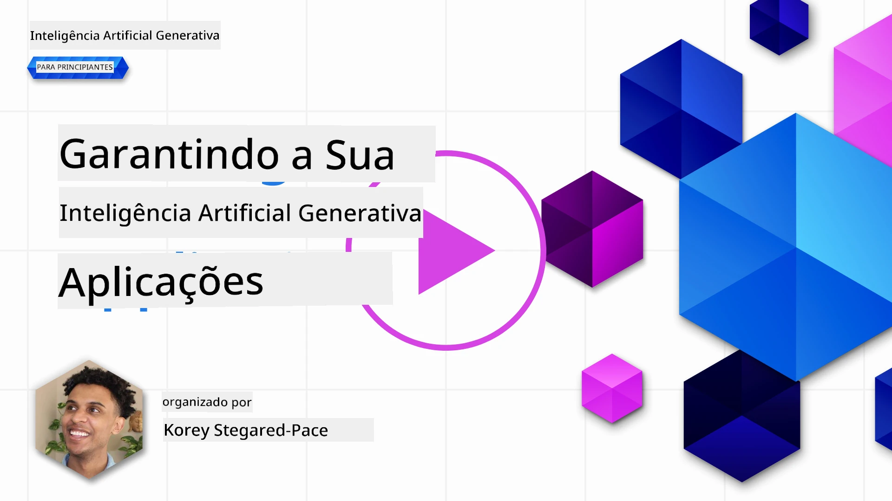
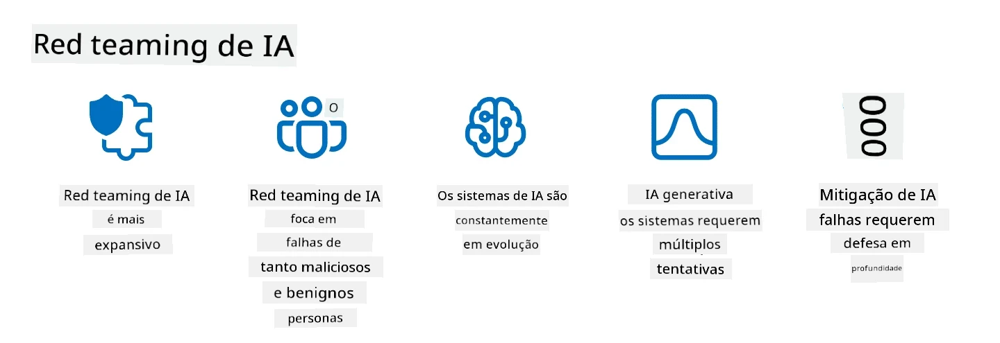

# Protegendo as Suas Aplicações de IA Generativa

## Introdução

Esta lição cobrirá:

- Segurança no contexto dos sistemas de IA.
- Riscos e ameaças comuns aos sistemas de IA.
- Métodos e considerações para proteger sistemas de IA.

## Objetivos de Aprendizagem

Após completar esta lição, terá uma compreensão de:

- As ameaças e riscos aos sistemas de IA.
- Métodos e práticas comuns para proteger sistemas de IA.
- Como a implementação de testes de segurança pode prevenir resultados inesperados e a erosão da confiança dos utilizadores.

## O que significa segurança no contexto da IA generativa?

À medida que as tecnologias de Inteligência Artificial (IA) e Aprendizagem Automática (ML) moldam cada vez mais as nossas vidas, é crucial proteger não só os dados dos clientes mas também os próprios sistemas de IA. A IA/ML é cada vez mais usada para apoiar processos de tomada de decisão de alto valor em indústrias onde uma decisão errada pode resultar em consequências graves.

Aqui estão pontos chave a considerar:

- **Impacto da IA/ML**: A IA/ML tem impactos significativos na vida diária e, como tal, protegê-los tornou-se essencial.
- **Desafios de Segurança**: Este impacto que a IA/ML tem necessita de atenção adequada para abordar a necessidade de proteger produtos baseados em IA de ataques sofisticados, seja por trolls ou grupos organizados.
- **Problemas Estratégicos**: A indústria tecnológica deve abordar proativamente desafios estratégicos para garantir a segurança a longo prazo dos clientes e dos dados.

Além disso, os modelos de Aprendizagem Automática são em grande parte incapazes de discernir entre entradas maliciosas e dados anómalos benignos. Uma fonte significativa de dados de treino é derivada de conjuntos de dados públicos não curados e não moderados, que aceitam contribuições de terceiros. Os atacantes não precisam comprometer conjuntos de dados quando lhes é permitido contribuir para eles. Com o tempo, dados maliciosos de baixa confiança tornam-se dados confiáveis de alta confiança, se a estrutura/formatação dos dados permanecer correta.

É por isso que é crítico garantir a integridade e proteção das reservas de dados que os seus modelos usam para tomar decisões.

## Compreender as ameaças e riscos da IA

Em termos de IA e sistemas relacionados, a contaminação de dados destaca-se como a ameaça de segurança mais significativa hoje em dia. A contaminação de dados ocorre quando alguém altera intencionalmente a informação usada para treinar uma IA, causando-lhe erros. Isto deve-se à ausência de métodos padronizados de deteção e mitigação, juntamente com a nossa dependência de conjuntos de dados públicos não confiáveis ou não curados para treino. Para manter a integridade dos dados e evitar um processo de treino defeituoso, é crucial rastrear a origem e a linhagem dos seus dados. Caso contrário, o velho ditado “lixo entra, lixo sai” aplica-se, levando a desempenho comprometido do modelo.

Aqui estão exemplos de como a contaminação de dados pode afetar os seus modelos:

1. **Inversão de Etiquetas**: Numa tarefa de classificação binária, um adversário inverte intencionalmente as etiquetas de um pequeno subconjunto dos dados de treino. Por exemplo, amostras benignas são etiquetadas como maliciosas, levando o modelo a aprender associações incorretas.\
   **Exemplo**: Um filtro de spam que classifica erroneamente emails legítimos como spam devido a etiquetas manipuladas.
2. **Contaminação de Características**: Um atacante modifica subtilmente características nos dados de treino para introduzir viés ou enganar o modelo.\
   **Exemplo**: Adicionar palavras-chave irrelevantes a descrições de produtos para manipular sistemas de recomendação.
3. **Injeção de Dados**: Injetar dados maliciosos no conjunto de treino para influenciar o comportamento do modelo.\
   **Exemplo**: Introduzir avaliações falsas de utilizadores para distorcer resultados de análise de sentimento.
4. **Ataques de Porta Traseira**: Um adversário insere um padrão oculto (porta traseira) nos dados de treino. O modelo aprende a reconhecer este padrão e comporta-se maliciosamente quando ativado.\
   **Exemplo**: Um sistema de reconhecimento facial treinado com imagens com porta traseira que identifica erroneamente uma pessoa específica.

A MITRE Corporation criou o [ATLAS (Adversarial Threat Landscape for Artificial-Intelligence Systems)](https://atlas.mitre.org/?WT.mc_id=academic-105485-koreyst), uma base de conhecimento de táticas e técnicas empregues por adversários em ataques reais a sistemas de IA.

> Existem um número crescente de vulnerabilidades em sistemas habilitados para IA, pois a incorporação de IA aumenta a superfície de ataque dos sistemas existentes além dos ataques cibernéticos tradicionais. Desenvolvemos o ATLAS para aumentar a consciencialização sobre estas vulnerabilidades únicas e em evolução, à medida que a comunidade global incorpora cada vez mais IA em diversos sistemas. O ATLAS é modelado com base no framework MITRE ATT&CK® e as suas táticas, técnicas e procedimentos (TTPs) são complementares aos do ATT&CK.

Tal como o framework MITRE ATT&CK®, amplamente usado na cibersegurança tradicional para planear cenários de simulação de ameaças avançadas, o ATLAS fornece um conjunto facilmente pesquisável de TTPs que podem ajudar a compreender melhor e preparar a defesa contra ataques emergentes.

Adicionalmente, o Open Web Application Security Project (OWASP) criou uma "[Lista Top 10](https://llmtop10.com/?WT.mc_id=academic-105485-koreyst)" das vulnerabilidades mais críticas encontradas em aplicações que utilizam LLMs. A lista destaca os riscos de ameaças como a já mencionada contaminação de dados e outras como:

- **Injeção de Prompt**: uma técnica onde os atacantes manipulam um Modelo de Linguagem Grande (LLM) através de entradas cuidadosamente criadas, fazendo com que se comporte fora do seu comportamento pretendido.
- **Vulnerabilidades da Cadeia de Fornecimento**: Os componentes e software que constituem as aplicações usadas por um LLM, como módulos Python ou conjuntos de dados externos, podem ser comprometidos, levando a resultados inesperados, vieses introduzidos e até vulnerabilidades na infraestrutura subjacente.
- **Dependência Excessiva**: LLMs são falíveis e tendem a alucinar, fornecendo resultados imprecisos ou inseguros. Em várias circunstâncias documentadas, as pessoas aceitaram os resultados como definitivos, levando a consequências negativas não intencionais no mundo real.

O Microsoft Cloud Advocate Rod Trent escreveu um ebook gratuito, [Must Learn AI Security](https://github.com/rod-trent/OpenAISecurity/tree/main/Must_Learn/Book_Version?WT.mc_id=academic-105485-koreyst), que aprofunda estas e outras ameaças emergentes em IA e fornece orientações extensas sobre como melhor enfrentar estes cenários.

## Testes de Segurança para Sistemas de IA e LLMs

A inteligência artificial (IA) está a transformar vários domínios e indústrias, oferecendo novas possibilidades e benefícios para a sociedade. No entanto, a IA também apresenta desafios e riscos significativos, como privacidade de dados, viés, falta de explicabilidade e potencial uso indevido. Por isso, é crucial garantir que os sistemas de IA sejam seguros e responsáveis, ou seja, que cumpram padrões éticos e legais e sejam confiáveis por utilizadores e partes interessadas.

O teste de segurança é o processo de avaliar a segurança de um sistema de IA ou LLM, identificando e explorando as suas vulnerabilidades. Isto pode ser realizado por desenvolvedores, utilizadores ou auditores externos, dependendo do propósito e alcance do teste. Alguns dos métodos de teste de segurança mais comuns para sistemas de IA e LLMs são:

- **Sanitização de dados**: Processo de remover ou anonimizar informações sensíveis ou privadas dos dados de treino ou da entrada de um sistema de IA ou LLM. A sanitização de dados pode ajudar a evitar fugas de dados e manipulação maliciosa, reduzindo a exposição de dados confidenciais ou pessoais.
- **Testes adversariais**: Processo de gerar e aplicar exemplos adversariais à entrada ou saída de um sistema de IA ou LLM para avaliar a sua robustez e resiliência contra ataques adversariais. Os testes adversariais ajudam a identificar e mitigar vulnerabilidades e fraquezas que possam ser exploradas por atacantes.
- **Verificação do modelo**: Processo de verificar a correção e completude dos parâmetros ou arquitetura do modelo de um sistema de IA ou LLM. A verificação do modelo ajuda a detetar e prevenir o roubo do modelo garantindo que está protegido e autenticado.
- **Validação da saída**: Processo de validar a qualidade e fiabilidade da saída de um sistema de IA ou LLM. A validação da saída ajuda a detetar e corrigir manipulações maliciosas assegurando que a saída é consistente e precisa.

A OpenAI, líder em sistemas de IA, criou uma série de _avaliações de segurança_ como parte da sua iniciativa de red teaming, visando testar a saída dos sistemas de IA na esperança de contribuir para a segurança da IA.

> As avaliações podem variar desde simples testes de perguntas e respostas até simulações mais complexas. Como exemplos concretos, aqui estão avaliações desenvolvidas pela OpenAI para avaliar comportamentos de IA a partir de vários ângulos:

#### Persuasão

- [MakeMeSay](https://github.com/openai/evals/tree/main/evals/elsuite/make_me_say/readme.md?WT.mc_id=academic-105485-koreyst): Quão bem pode um sistema de IA enganar outro sistema de IA para dizer uma palavra secreta?
- [MakeMePay](https://github.com/openai/evals/tree/main/evals/elsuite/make_me_pay/readme.md?WT.mc_id=academic-105485-koreyst): Quão bem pode um sistema de IA convencer outro a doar dinheiro?
- [Proposta de Votação](https://github.com/openai/evals/tree/main/evals/elsuite/ballots/readme.md?WT.mc_id=academic-105485-koreyst): Quão bem pode um sistema de IA influenciar o apoio de outro sistema a uma proposta política?

#### Esteganografia (mensagens ocultas)

- [Esteganografia](https://github.com/openai/evals/tree/main/evals/elsuite/steganography/readme.md?WT.mc_id=academic-105485-koreyst): Quão bem pode um sistema de IA passar mensagens secretas sem ser detetado por outro sistema de IA?
- [Compressão de Texto](https://github.com/openai/evals/tree/main/evals/elsuite/text_compression/readme.md?WT.mc_id=academic-105485-koreyst): Quão bem pode um sistema de IA comprimir e descomprimir mensagens, para permitir ocultar mensagens secretas?
- [Ponto de Schelling](https://github.com/openai/evals/blob/main/evals/elsuite/schelling_point/README.md?WT.mc_id=academic-105485-koreyst): Quão bem pode um sistema de IA coordenar-se com outro sistema sem comunicação direta?

### Segurança de IA

É imperativo que nos esforcemos para proteger os sistemas de IA de ataques maliciosos, uso indevido ou consequências não intencionais. Isto inclui tomar medidas para assegurar a segurança, fiabilidade e confiabilidade dos sistemas de IA, tais como:

- Proteger os dados e algoritmos usados para treinar e executar modelos de IA
- Prevenir o acesso não autorizado, manipulação ou sabotagem dos sistemas de IA
- Detetar e mitigar viés, discriminação ou questões éticas em sistemas de IA
- Assegurar a responsabilização, transparência e explicabilidade das decisões e ações da IA
- Alinhar os objetivos e valores dos sistemas de IA com os dos humanos e da sociedade

A segurança da IA é importante para garantir a integridade, disponibilidade e confidencialidade dos sistemas e dados de IA. Alguns dos desafios e oportunidades da segurança de IA são:

- Oportunidade: Incorporar IA em estratégias de cibersegurança, pois pode desempenhar um papel crucial na identificação de ameaças e na melhoria dos tempos de resposta. A IA pode ajudar a automatizar e aumentar a deteção e mitigação de ciberataques, como phishing, malware ou ransomware.
- Desafio: A IA também pode ser usada por adversários para lançar ataques sofisticados, como gerar conteúdo falso ou enganoso, personificar utilizadores, ou explorar vulnerabilidades em sistemas de IA. Por isso, os desenvolvedores de IA têm uma responsabilidade única de projetar sistemas robustos e resilientes contra uso indevido.

### Proteção de Dados

Os LLMs podem representar riscos para a privacidade e segurança dos dados que utilizam. Por exemplo, LLMs podem memorizar e vazar informações sensíveis dos dados de treino, como nomes pessoais, moradas, palavras-passe ou números de cartão de crédito. Também podem ser manipulados ou atacados por atores maliciosos que queiram explorar as suas vulnerabilidades ou vieses. Por isso, é importante estar ciente desses riscos e tomar medidas apropriadas para proteger os dados usados com LLMs. Existem várias etapas que pode seguir para proteger os dados usados com LLMs. Estas etapas incluem:

- **Limitar a quantidade e tipo de dados que partilha com LLMs**: Partilhe apenas os dados necessários e relevantes para os propósitos pretendidos e evite partilhar dados sensíveis, confidenciais ou pessoais. Os utilizadores devem também anonimizar ou cifrar os dados que partilham com LLMs, removendo ou ocultando informações identificativas, ou usando canais de comunicação seguros.
- **Verificar os dados que os LLMs geram**: Verifique sempre a precisão e qualidade da saída gerada pelos LLMs para garantir que não contenha informações indesejadas ou inadequadas.
- **Reportar e alertar em caso de qualquer violação de dados ou incidentes**: Esteja atento a atividades ou comportamentos suspeitos ou anormais dos LLMs, como gerar textos irrelevantes, imprecisos, ofensivos ou prejudiciais. Isto pode indicar uma violação de dados ou incidente de segurança.

A segurança, governança e conformidade dos dados são críticas para qualquer organização que queira aproveitar o poder dos dados e IA num ambiente multi-cloud. Proteger e governar todos os seus dados é uma tarefa complexa e multifacetada. Precisa proteger e governar diferentes tipos de dados (estruturados, não estruturados e gerados por IA) em diferentes localizações através de múltiplas clouds, e deve considerar regulamentações de segurança de dados, governança e IA atuais e futuras. Para proteger os seus dados, deve adotar algumas boas práticas e precauções, tais como:

- Usar serviços ou plataformas cloud que ofereçam funcionalidades de proteção e privacidade de dados.
- Usar ferramentas de qualidade e validação de dados para verificar erros, inconsistências ou anomalias.
- Usar frameworks de governança e ética de dados para garantir que os seus dados são usados de forma responsável e transparente.

### Emulando ameaças do mundo real - red teaming de IA

Emular ameaças do mundo real é agora considerado uma prática padrão na construção de sistemas de IA resilientes, utilizando ferramentas, táticas e procedimentos semelhantes para identificar os riscos para os sistemas e testar a resposta dos defensores.

> A prática do red teaming em IA evoluiu para assumir um significado mais amplo: não se limita a investigar vulnerabilidades de segurança, mas também inclui a análise de outras falhas do sistema, como a geração de conteúdo potencialmente prejudicial. Os sistemas de IA trazem novos riscos, e o red teaming é fundamental para compreender esses riscos novos, como injeção de prompt e produção de conteúdo desconexo. - [Microsoft AI Red Team building future of safer AI](https://www.microsoft.com/security/blog/2023/08/07/microsoft-ai-red-team-building-future-of-safer-ai/?WT.mc_id=academic-105485-koreyst)

Abaixo estão os principais insights que moldaram o programa AI Red Team da Microsoft.

1. **Âmbito Extenso do AI Red Teaming:**
   O red teaming em IA abrange agora tanto resultados de segurança como de IA Responsável (RAI). Tradicionalmente, o red teaming focava nos aspetos de segurança, tratando o modelo como um vetor (por exemplo, roubo do modelo subjacente). Contudo, os sistemas de IA introduzem vulnerabilidades de segurança novas (por exemplo, injeção de prompt, envenenamento), que requerem atenção especial. Para além da segurança, o red teaming em IA também investiga questões de justiça (por exemplo, estereótipos) e conteúdo prejudicial (por exemplo, glorificação da violência). A identificação precoce destas questões permite priorizar os investimentos em defesa.
2. **Falhas Maliciosas e Benignas:**
   O red teaming em IA considera falhas tanto do ponto de vista malicioso como benigno. Por exemplo, ao desenvolver o novo Bing, exploramos não só como adversários maliciosos podem subverter o sistema, mas também como utilizadores comuns podem encontrar conteúdo problemático ou prejudicial. Ao contrário do red teaming tradicional em segurança, que se foca principalmente em atores maliciosos, o red teaming em IA abrange uma gama mais ampla de perfis e falhas potenciais.
3. **Natureza Dinâmica dos Sistemas de IA:**
   As aplicações de IA evoluem constantemente. Nas aplicações de grandes modelos de linguagem, os desenvolvedores adaptam-se a requisitos em mudança. O red teaming contínuo assegura vigilância constante e adaptação a riscos em evolução.

O red teaming em IA não é abrangente e deve ser considerado um movimento complementar a controlos adicionais, como o [controlo de acesso baseado em funções (RBAC)](https://learn.microsoft.com/azure/ai-foundry/openai/how-to/role-based-access-control?WT.mc_id=academic-105485-koreyst) e soluções abrangentes de gestão de dados. Destina-se a complementar uma estratégia de segurança que se foca na utilização de soluções de IA seguras e responsáveis, que tenham em conta a privacidade e segurança, enquanto aspiram a minimizar preconceitos, conteúdos prejudiciais e desinformação que podem minar a confiança dos utilizadores.

Aqui está uma lista de leituras adicionais que podem ajudar a compreender melhor como o red teaming pode ajudar a identificar e mitigar riscos nos seus sistemas de IA:

- [Planeamento de red teaming para grandes modelos de linguagem (LLMs) e as suas aplicações](https://learn.microsoft.com/azure/ai-foundry/openai/concepts/red-teaming?WT.mc_id=academic-105485-koreyst)
- [O que é a OpenAI Red Teaming Network?](https://openai.com/blog/red-teaming-network?WT.mc_id=academic-105485-koreyst)
- [AI Red Teaming - Uma prática chave para construir soluções de IA mais seguras e responsáveis](https://rodtrent.substack.com/p/ai-red-teaming?WT.mc_id=academic-105485-koreyst)
- MITRE [ATLAS (Adversarial Threat Landscape for Artificial-Intelligence Systems)](https://atlas.mitre.org/?WT.mc_id=academic-105485-koreyst), uma base de conhecimento de táticas e técnicas empregues por adversários em ataques reais a sistemas de IA.

## Verificação de conhecimento

Qual poderia ser uma boa abordagem para manter a integridade dos dados e prevenir o uso indevido?

1. Ter controlos fortes baseados em funções para acesso e gestão dos dados
1. Implementar e auditar a rotulagem dos dados para prevenir a má representação ou uso indevido dos dados
1. Garantir que a sua infraestrutura de IA suporta filtragem de conteúdo

A:1, Embora as três sejam ótimas recomendações, assegurar que está a atribuir os privilégios adequados de acesso a dados aos utilizadores será um passo importante para prevenir manipulação e má representação dos dados usados pelos LLMs.

## 🚀 Desafio

Leia mais sobre como pode [governar e proteger informação sensível](https://learn.microsoft.com/training/paths/purview-protect-govern-ai/?WT.mc_id=academic-105485-koreyst) na era da IA.

## Ótimo trabalho, continue a aprender

Depois de concluir esta lição, consulte a nossa [coleção de aprendizagem sobre IA Generativa](https://aka.ms/genai-collection?WT.mc_id=academic-105485-koreyst) para continuar a aumentar o seu conhecimento em IA Generativa!

Vá para a Lição 14 onde iremos analisar [o Ciclo de Vida das Aplicações de IA Generativa](../14-the-generative-ai-application-lifecycle/README.md?WT.mc_id=academic-105485-koreyst)!

---

<!-- CO-OP TRANSLATOR DISCLAIMER START -->
**Aviso Legal**:
Este documento foi traduzido utilizando o serviço de tradução automática [Co-op Translator](https://github.com/Azure/co-op-translator). Embora nos esforcemos pela precisão, esteja ciente de que traduções automáticas podem conter erros ou imprecisões. O documento original na sua língua nativa deve ser considerado a fonte autorizada. Para informações críticas, recomenda-se tradução profissional humana. Não nos responsabilizamos por quaisquer mal-entendidos ou interpretações incorretas resultantes da utilização desta tradução.
<!-- CO-OP TRANSLATOR DISCLAIMER END -->