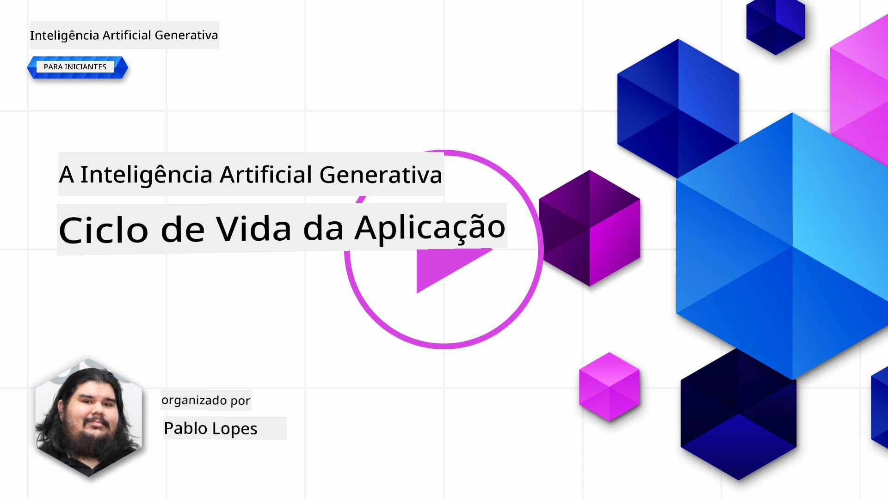
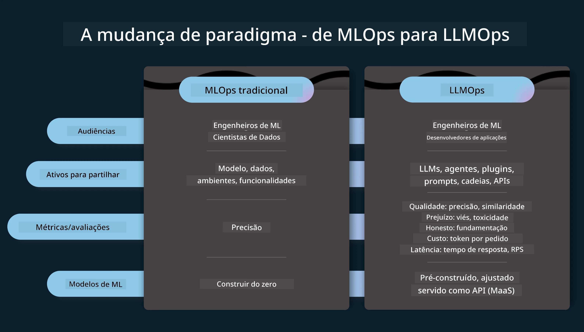
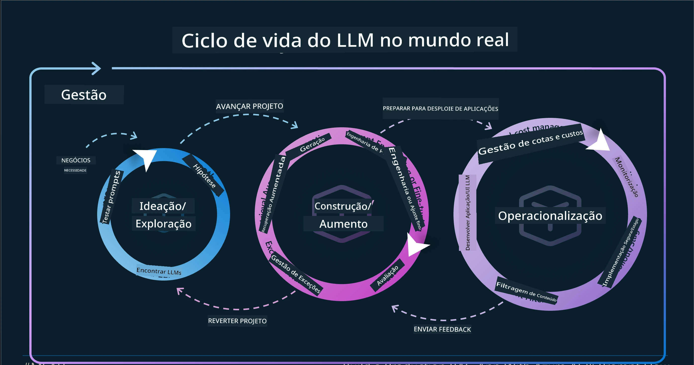
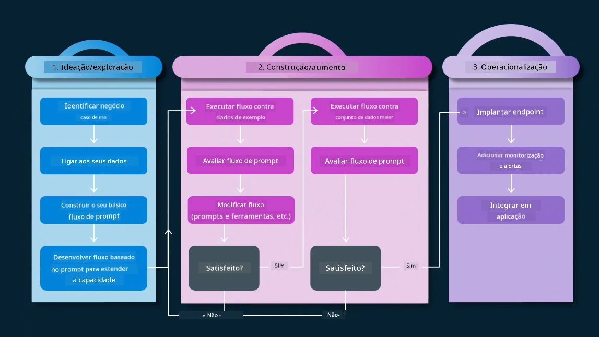
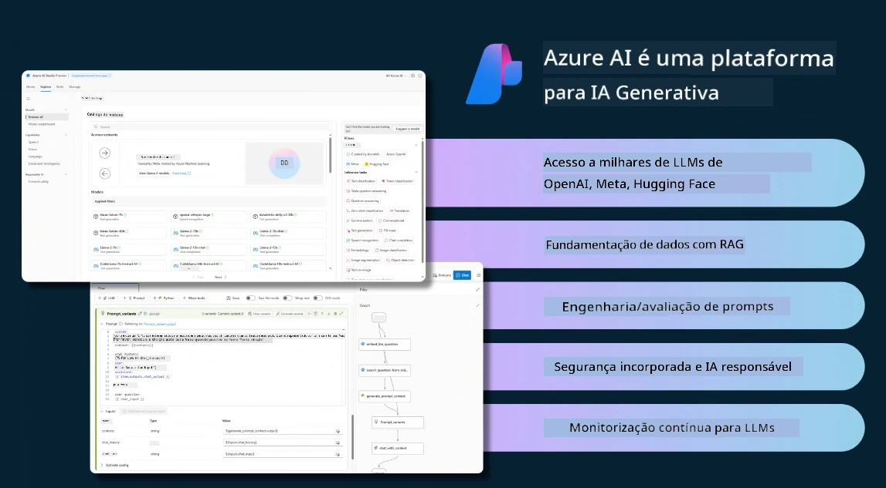
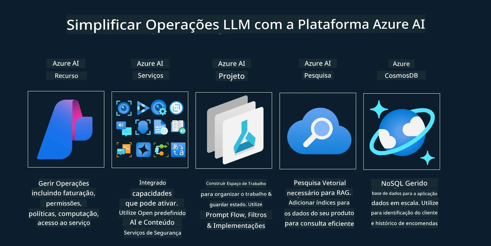
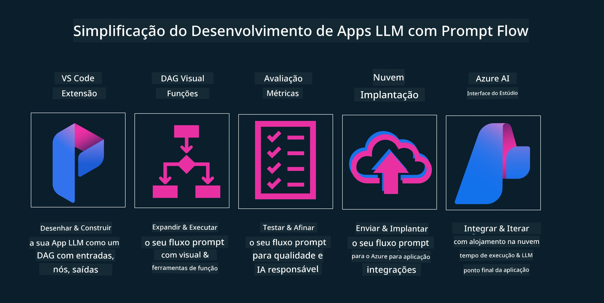

# O Ciclo de Vida da Aplicação de IA Generativa

Uma questão importante para todas as aplicações de IA é a relevância das funcionalidades de IA, pois a IA é um campo que evolui rapidamente; para garantir que a sua aplicação se mantém relevante, fiável e robusta, precisa monitorizar, avaliar e melhorar continuamente. É aqui que entra o ciclo de vida da IA generativa.

O ciclo de vida da IA generativa é uma estrutura que o orienta pelas fases de desenvolvimento, implementação e manutenção de uma aplicação de IA generativa. Ajuda-o a definir os seus objetivos, medir o seu desempenho, identificar os seus desafios e implementar as suas soluções. Também ajuda a alinhar a sua aplicação com os padrões éticos e legais do seu domínio e das suas partes interessadas. Ao seguir o ciclo de vida da IA generativa, pode garantir que a sua aplicação entrega sempre valor e satisfaz os seus utilizadores.

## Introdução

Neste capítulo, irá:

- Compreender a Mudança de Paradigma de MLOps para LLMOps
- O Ciclo de Vida dos LLM
- Ferramentas para o Ciclo de Vida
- Métricas e Avaliação do Ciclo de Vida

## Compreender a Mudança de Paradigma de MLOps para LLMOps

Os LLMs são uma nova ferramenta no arsenal da Inteligência Artificial; são incrivelmente poderosos em tarefas de análise e geração para aplicações, no entanto, este poder tem algumas consequências na forma como simplificamos as tarefas de IA e de Aprendizagem Automática Clássica.

Com isto, precisamos de um novo paradigma para adaptar esta ferramenta de forma dinâmica, com os incentivos corretos. Podemos categorizar aplicações de IA mais antigas como "Aplicações ML" e aplicações de IA mais recentes como "Aplicações GenAI" ou simplesmente "Aplicações AI", refletindo a tecnologia e técnicas predominantes da altura. Isto altera a nossa narrativa de várias formas; veja a seguinte comparação.

Note que no LLMOps, estamos mais focados nos Desenvolvedores de Aplicações, usando integrações como ponto central, utilizando "Modelos como Serviço" e considerando os seguintes pontos para métricas.

- Qualidade: Qualidade da resposta
- Perigo: IA responsável
- Honestidade: Fundamentação da resposta (Faz sentido? Está correta?)
- Custo: Orçamento da solução
- Latência: Tempo médio para resposta do token

## O Ciclo de Vida dos LLM

Primeiro, para compreender o ciclo de vida e as alterações, veja o seguinte infográfico.

Como pode notar, isto é diferente dos ciclos de vida habituais do MLOps. Os LLMs têm muitos novos requisitos, como o Prompting, diferentes técnicas para melhorar a qualidade (Fine-Tuning, RAG, Meta-Prompts), diferentes avaliações e responsabilidade com a IA responsável, finalmente, novas métricas de avaliação (Qualidade, Perigo, Honestidade, Custo e Latência).

Por exemplo, veja como fazemos a ideação. Utilizando engenharia de prompts para experimentar vários LLMs e explorar possibilidades para testar se a sua hipótese pode estar correta.

Note que isto não é linear, mas sim ciclos integrados, iterativos e com um ciclo global abrangente.

Como poderíamos explorar esses passos? Vamos analisar em detalhe como construir um ciclo de vida.

Isto pode parecer um pouco complicado, vamos focar-nos primeiro nos três grandes passos.

1. Ideação/Exploração: Exploração, aqui podemos explorar conforme as necessidades do nosso negócio. Prototipação, criar um [PromptFlow](https://microsoft.github.io/promptflow/index.html?WT.mc_id=academic-105485-koreyst) e testar se é suficientemente eficaz para a nossa hipótese.
1. Construção/Aumento: Implementação, agora começamos a avaliar conjuntos de dados maiores, implementar técnicas, como Fine-tuning e RAG, para verificar a robustez da nossa solução. Se não funcionar, reimplementar, adicionar novos passos no fluxo ou reestruturar os dados pode ajudar. Depois de testar o nosso fluxo e escala, se funcionar e as métricas estiverem dentro do esperado, está pronto para o próximo passo.
1. Operacionalização: Integração, agora adicionamos sistemas de monitorização e alertas ao nosso sistema, implementação e integração da aplicação na nossa aplicação.

Depois, temos o ciclo global de Gestão, focando na segurança, conformidade e governação.

Parabéns, agora tem a sua aplicação de IA pronta e operacional. Para uma experiência prática, veja a [Demonstração do Contoso Chat.](https://nitya.github.io/contoso-chat/?WT.mc_id=academic-105485-koreyst)

Agora, que ferramentas poderíamos usar?

## Ferramentas para o Ciclo de Vida

Em termos de ferramentas, a Microsoft fornece a [Plataforma Azure AI](https://azure.microsoft.com/solutions/ai/?WT.mc_id=academic-105485-koreyst) e o [PromptFlow](https://microsoft.github.io/promptflow/index.html?WT.mc_id=academic-105485-koreyst) que facilitam e tornam o seu ciclo fácil de implementar e pronto a usar.

A [Plataforma Azure AI](https://azure.microsoft.com/solutions/ai/?WT.mc_id=academic-105485-koreyst) permite-lhe usar o [AI Studio](https://ai.azure.com/?WT.mc_id=academic-105485-koreyst). O AI Studio é um portal web que lhe permite explorar modelos, exemplos e ferramentas. Gerir os seus recursos, fluxos de desenvolvimento UI e opções SDK/CLI para desenvolvimento Code-First.

O Azure AI permite-lhe usar múltiplos recursos, para gerir as suas operações, serviços, projetos, pesquisa vetorial e necessidades de bases de dados.

Construa, desde a Prova de Conceito (POC) até aplicações em grande escala com PromptFlow:

- Projetar e construir aplicações a partir do VS Code, com ferramentas visuais e funcionais
- Testar e afinar as suas aplicações para uma IA de qualidade, com facilidade.
- Usar o Azure AI Studio para integrar e iterar com a cloud, empurrar e implementar para uma integração rápida.

## Excelente! Continue a sua Aprendizagem!

Incrível, agora aprenda mais sobre como estruturamos uma aplicação para usar os conceitos com a [Aplicação Contoso Chat](https://nitya.github.io/contoso-chat/?WT.mc_id=academic-105485-koreyst), para ver como o Cloud Advocacy aplica esses conceitos em demonstrações. Para mais conteúdos, veja a nossa [sessão breakout do Ignite!
](https://www.youtube.com/watch?v=DdOylyrTOWg)

Agora, veja a Aula 15, para compreender como a [Geração Aumentada por Pesquisa (Retrieval Augmented Generation) e Bases de Dados Vetoriais](../15-rag-and-vector-databases/README.md?WT.mc_id=academic-105485-koreyst) impactam a IA Generativa e para criar aplicações mais envolventes!

---

<!-- CO-OP TRANSLATOR DISCLAIMER START -->
**Aviso Legal**:
Este documento foi traduzido utilizando o serviço de tradução automática [Co-op Translator](https://github.com/Azure/co-op-translator). Embora nos esforcemos para garantir a precisão, esteja ciente de que traduções automáticas podem conter erros ou imprecisões. O documento original na sua língua nativa deve ser considerado a fonte autoritativa. Para informações críticas, recomenda-se a tradução profissional humana. Não nos responsabilizamos por quaisquer mal-entendidos ou interpretações incorretas decorrentes do uso desta tradução.
<!-- CO-OP TRANSLATOR DISCLAIMER END -->