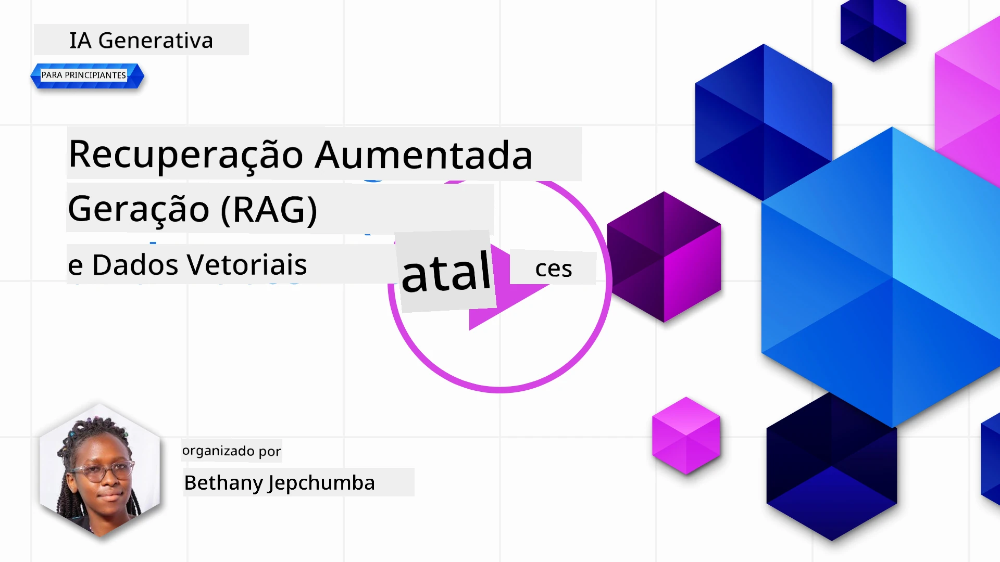
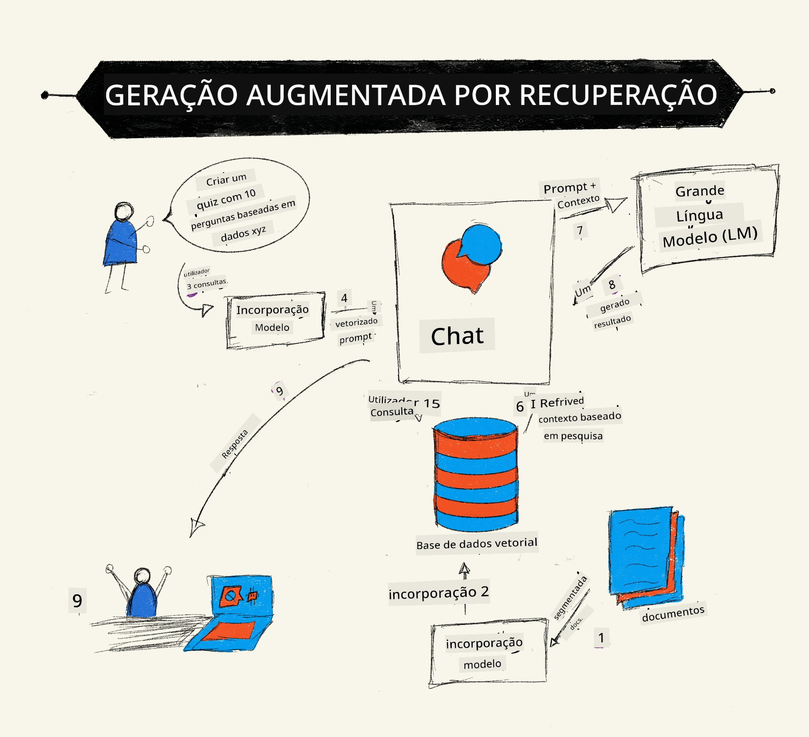
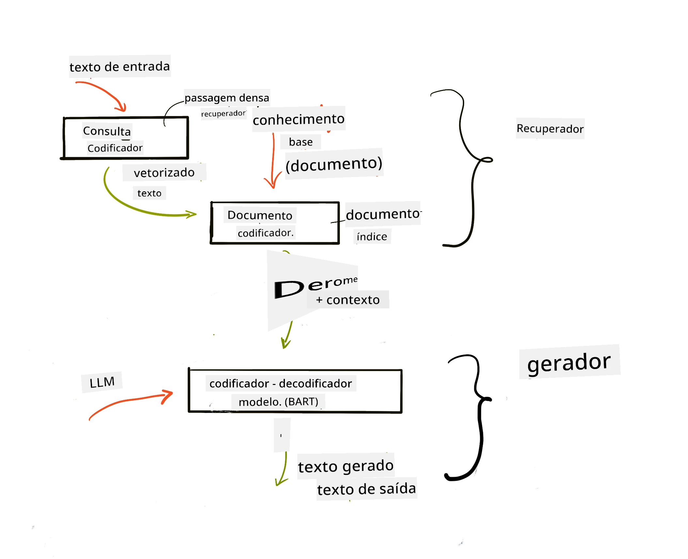

# Geração Aumentada por Recuperação (RAG) e Bases de Dados Vetoriais

[](https://youtu.be/4l8zhHUBeyI?si=BmvDmL1fnHtgQYkL)

Na lição de aplicações de pesquisa, aprendemos brevemente como integrar os seus próprios dados em Modelos de Linguagem de Grande Escala (LLMs). Nesta lição, iremos aprofundar os conceitos de fundamentar os seus dados na sua aplicação LLM, a mecânica do processo e os métodos de armazenamento de dados, incluindo tanto embeddings como texto.

> **Vídeo em breve**

## Introdução

Nesta lição vamos cobrir o seguinte:

- Uma introdução ao RAG: o que é e porque é usado em IA (inteligência artificial).

- Compreender o que são bases de dados vetoriais e criar uma para a nossa aplicação.

- Um exemplo prático de como integrar RAG numa aplicação.

## Objetivos de Aprendizagem

Após completar esta lição, será capaz de:

- Explicar a importância do RAG na recuperação e processamento de dados.

- Configurar uma aplicação RAG e fundamentar os seus dados a um LLM.

- Integração eficaz de RAG e Bases de Dados Vetoriais em Aplicações LLM.

## O Nosso Cenário: melhorar os nossos LLMs com os nossos próprios dados

Para esta lição, queremos adicionar as nossas próprias notas na startup educativa, o que permite ao chatbot obter mais informações sobre os diferentes assuntos. Usando as notas que temos, os aprendizes poderão estudar melhor e compreender os diferentes tópicos, facilitando a revisão para os seus exames. Para criar o nosso cenário, iremos usar:

- `Azure OpenAI:` o LLM que iremos usar para criar o nosso chatbot

- `Lição de AI para iniciantes sobre Redes Neuronais:` estes serão os dados em que iremos fundamentar o nosso LLM

- `Azure AI Search` e `Azure Cosmos DB:` base de dados vetorial para armazenar os nossos dados e criar um índice de pesquisa

Os utilizadores poderão criar questionários práticos a partir das suas notas, cartões de revisão e resumir para visões concisas. Para começar, vejamos o que é RAG e como funciona:

## Geração Aumentada por Recuperação (RAG)

Um chatbot alimentado por um LLM processa os prompts dos utilizadores para gerar respostas. É projetado para ser interativo e envolve os utilizadores numa vasta gama de tópicos. No entanto, as suas respostas são limitadas ao contexto fornecido e aos seus dados de treino base. Por exemplo, o conhecimento do GPT-4 está atualizado até setembro de 2021, o que significa que desconhece eventos ocorridos após este período. Além disso, os dados usados para treinar os LLMs excluem informações confidenciais, como notas pessoais ou manuais de produtos de empresas.

### Como funcionam os RAGs (Geração Aumentada por Recuperação)



Suponha que quer implementar um chatbot que cria questionários a partir das suas notas, irá necessitar de uma ligação à base de conhecimento. É aqui que o RAG intervém. Os RAGs operam da seguinte forma:

- **Base de conhecimento:** Antes da recuperação, estes documentos precisam ser ingeridos e pré-processados, normalmente dividindo documentos grandes em pequenos fragmentos, transformando-os em embeddings textuais e armazenando-os numa base de dados.

- **Pergunta do utilizador:** o utilizador coloca uma pergunta

- **Recuperação:** Quando um utilizador faz uma pergunta, o modelo de embeddings recupera informação relevante da nossa base de conhecimento para fornecer mais contexto que será incorporado no prompt.

- **Geração Aumentada:** o LLM melhora a sua resposta com base nos dados recuperados. Isto permite que a resposta gerada não seja apenas baseada em dados pré-treinados mas também em informação relevante do contexto adicional. Os dados recuperados são usados para aumentar as respostas do LLM. O LLM então devolve uma resposta à pergunta do utilizador.



A arquitetura dos RAGs é implementada utilizando transformers consistindo em duas partes: um codificador e um decodificador. Por exemplo, quando um utilizador faz uma pergunta, o texto de entrada é 'codificado' em vetores que capturam o significado das palavras e os vetores são 'decodificados' no nosso índice de documentos, gerando novo texto com base na pergunta do utilizador. O LLM usa um modelo de codificador-decodificador para gerar a saída.

Duas abordagens na implementação do RAG, de acordo com o artigo proposto: [Retrieval-Augmented Generation for Knowledge intensive NLP Tasks](https://arxiv.org/pdf/2005.11401.pdf?WT.mc_id=academic-105485-koreyst) são:

- **_RAG-Sequence_** usando documentos recuperados para prever a melhor resposta possível a uma pergunta do utilizador

- **RAG-Token** usando documentos para gerar o próximo token, depois recupera-os para responder à pergunta do utilizador

### Porque usar RAGs?

- **Riqueza de informação:** garante que as respostas em texto estão atualizadas e atuais. Por isso, melhora o desempenho em tarefas específicas de dominio ao aceder à base de conhecimento interna.

- Reduz a fabricação usando **dados verificáveis** na base de conhecimento para fornecer contexto às perguntas dos utilizadores.

- É **rentável**, pois são mais económicos comparados com afinar (fine-tune) um LLM.

## Criar uma base de conhecimento

A nossa aplicação baseia-se nos nossos dados pessoais, ou seja, a lição de Redes Neuronais no currículo AI for Beginners.

### Bases de Dados Vetoriais

Uma base de dados vetorial, ao contrário das tradicionais, é especializada para armazenar, gerir e pesquisar vetores embutidos. Armazena representações numéricas dos documentos. Dividir dados em embeddings numéricos facilita a compreensão e processamento dos dados pelo nosso sistema de IA.

Guardamos os nossos embeddings em bases de dados vetoriais pois os LLMs têm um limite do número de tokens que aceitam como entrada. Como não pode passar os embeddings inteiros a um LLM, precisamos de os dividir em pedaços e, quando um utilizador fizer uma pergunta, os embeddings mais próximos da pergunta serão retornados junto com o prompt. Dividir (chunking) também reduz custos do número de tokens passados a um LLM.

Algumas bases de dados vetoriais populares incluem Azure Cosmos DB, Clarifyai, Pinecone, Chromadb, ScaNN, Qdrant e DeepLake. Pode criar um modelo Azure Cosmos DB usando o Azure CLI com o comando seguinte:

```bash
az login
az group create -n <resource-group-name> -l <location>
az cosmosdb create -n <cosmos-db-name> -r <resource-group-name>
az cosmosdb list-keys -n <cosmos-db-name> -g <resource-group-name>
```

### De texto para embeddings

Antes de armazenar os nossos dados, precisamos convertê-los em embeddings vetoriais antes de serem guardados na base de dados. Se estiver a trabalhar com documentos grandes ou textos longos, pode dividi-los com base nas consultas que espera. Pode dividir à nível de frase, ou de parágrafo. Como a divisão deriva significado das palavras à volta, pode adicionar algum outro contexto a um fragmento, por exemplo, adicionando o título do documento ou incluindo algum texto antes ou depois do fragmento. Pode dividir os dados assim:

```python
def split_text(text, max_length, min_length):
    words = text.split()
    chunks = []
    current_chunk = []

    for word in words:
        current_chunk.append(word)
        if len(' '.join(current_chunk)) < max_length and len(' '.join(current_chunk)) > min_length:
            chunks.append(' '.join(current_chunk))
            current_chunk = []

    # Se o último bloco não atingiu o comprimento mínimo, adicione-o na mesma
    if current_chunk:
        chunks.append(' '.join(current_chunk))

    return chunks
```

Depois de dividido, podemos então embutir o nosso texto usando diferentes modelos de embeddings. Alguns modelos que pode usar incluem: word2vec, ada-002 da OpenAI, Azure Computer Vision e muitos mais. A escolha do modelo dependerá das línguas usadas, do tipo de conteúdo codificado (texto/imagens/áudio), do tamanho da entrada que pode codificar e do comprimento da saída do embedding.

Um exemplo de texto embutido usando o modelo `text-embedding-ada-002` da OpenAI é:


## Recuperação e Pesquisa Vetorial

Quando um utilizador faz uma pergunta, o recuperador transforma-a num vetor usando o codificador de consultas, depois pesquisa através do nosso índice de pesquisa de documentos para vetores relevantes no documento relacionados com a entrada. Depois converte tanto o vetor de entrada como os vetores dos documentos em texto e passa-os pelo LLM.

### Recuperação

A recuperação ocorre quando o sistema tenta rapidamente encontrar documentos do índice que satisfazem os critérios de pesquisa. O objetivo do recuperador é obter documentos usados para fornecer contexto e fundamentar o LLM nos seus dados.

Existem várias formas de realizar pesquisa na nossa base de dados, como:

- **Pesquisa por palavra-chave** - usado para pesquisas baseadas em texto

- **Pesquisa vetorial** - converte documentos de texto para representações vetoriais usando modelos de embeddings, permitindo uma **pesquisa semântica** usando o significado das palavras. A recuperação é feita consultando os documentos cujas representações vetoriais são mais próximas da pergunta do utilizador.

- **Híbrida** - uma combinação de pesquisa por palavra-chave e vetorial.

Um desafio na recuperação surge quando não há uma resposta semelhante à consulta na base de dados, o sistema então retorna a melhor informação possível, no entanto, pode usar táticas como definir a distância máxima para relevância ou usar pesquisa híbrida que combina palavra-chave e vetorial. Nesta lição usaremos pesquisa híbrida, uma combinação de pesquisa vetorial e por palavra-chave. Armazenaremos os nossos dados num dataframe com colunas contendo os fragmentos assim como os embeddings.

### Similaridade Vetorial

O recuperador irá pesquisar na base de conhecimento por embeddings próximos, o vizinho mais próximo, pois são textos semelhantes. No cenário, quando o utilizador faz uma pergunta, esta é embutida e depois comparada com embeddings semelhantes. A medida comum usada para encontrar quão semelhantes diferentes vetores são é a similaridade do cosseno, baseada no ângulo entre dois vetores.

Podemos medir similaridade usando outras alternativas como distância Euclidiana que é a linha reta entre extremos vetoriais e produto escalar que mede a soma dos produtos dos elementos correspondentes de dois vetores.

### Índice de Pesquisa

Ao fazer a recuperação, precisamos construir um índice de pesquisa para a nossa base de conhecimento antes de realizar a pesquisa. Um índice armazenará os nossos embeddings e poderá recuperar rapidamente os fragmentos mais semelhantes mesmo numa base de dados grande. Podemos criar o nosso índice localmente usando:

```python
from sklearn.neighbors import NearestNeighbors

embeddings = flattened_df['embeddings'].to_list()

# Criar o índice de pesquisa
nbrs = NearestNeighbors(n_neighbors=5, algorithm='ball_tree').fit(embeddings)

# Para consultar o índice, pode usar o método kneighbors
distances, indices = nbrs.kneighbors(embeddings)
```

### Reordenação

Depois de consultar a base de dados, poderá ser necessário ordenar os resultados do mais relevante para o menos relevante. Um LLM de reordenação usa Aprendizagem Automática para melhorar a relevância dos resultados da pesquisa ordenando-os do mais para o menos relevante. Usando Azure AI Search, a reordenação é feita automaticamente para si usando um semântic reranker. Um exemplo de como funciona a reordenação usando os vizinhos mais próximos:

```python
# Encontrar os documentos mais semelhantes
distances, indices = nbrs.kneighbors([query_vector])

index = []
# Imprimir os documentos mais semelhantes
for i in range(3):
    index = indices[0][i]
    for index in indices[0]:
        print(flattened_df['chunks'].iloc[index])
        print(flattened_df['path'].iloc[index])
        print(flattened_df['distances'].iloc[index])
    else:
        print(f"Index {index} not found in DataFrame")
```

## Colocando tudo junto

O último passo é adicionar o nosso LLM à mistura para poder obter respostas fundamentadas nos nossos dados. Podemos implementá-lo da seguinte forma:

```python
user_input = "what is a perceptron?"

def chatbot(user_input):
    # Converter a pergunta num vetor de consulta
    query_vector = create_embeddings(user_input)

    # Encontrar os documentos mais semelhantes
    distances, indices = nbrs.kneighbors([query_vector])

    # adicionar documentos à consulta para fornecer contexto
    history = []
    for index in indices[0]:
        history.append(flattened_df['chunks'].iloc[index])

    # combinar o histórico e a entrada do utilizador
    history.append(user_input)

    # criar um objeto de mensagem
    messages=[
        {"role": "system", "content": "You are an AI assistant that helps with AI questions."},
        {"role": "user", "content": "\n\n".join(history) }
    ]

    # usar a API de Respostas para gerar uma resposta
    response = client.responses.create(
        model="gpt-4o-mini",
        temperature=0.7,
        max_output_tokens=800,
        input=messages,
        store=False,
    )

    return response.output_text

chatbot(user_input)
```

## Avaliar a nossa aplicação

### Métricas de Avaliação

- Qualidade das respostas fornecidas, garantindo que soa natural, fluente e semelhante a humano

- Fundamentação dos dados: avaliar se a resposta veio dos documentos fornecidos

- Relevância: avaliar se a resposta corresponde e está relacionada com a pergunta colocada

- Fluência - se a resposta faz sentido gramaticalmente

## Casos de Uso para usar RAG (Geração Aumentada por Recuperação) e bases de dados vetoriais

Existem muitos casos de uso onde chamadas a funções podem melhorar a sua aplicação, tais como:

- Perguntas e Respostas: fundamentar os dados da sua empresa para um chat que pode ser usado por colaboradores para fazer perguntas.

- Sistemas de Recomendação: onde pode criar um sistema que corresponde aos valores mais semelhantes, exemplo: filmes, restaurantes e muitos mais.

- Serviços de Chatbot: pode armazenar histórico de chat e personalizar a conversa com base nos dados do utilizador.

- Pesquisa de imagem baseada em embeddings vetoriais, útil para reconhecimento de imagem e deteção de anomalias.

## Resumo

Cobrimos as áreas fundamentais dos RAG desde adicionar os nossos dados à aplicação, a consulta do utilizador e a saída. Para simplificar a criação de RAG, pode usar frameworks como Semantic Kernel, Langchain ou Autogen.

## Exercício

Para continuar a aprendizagem de Geração Aumentada por Recuperação (RAG), pode construir:

- Construir um front-end para a aplicação usando o framework da sua escolha

- Utilizar um framework, quer LangChain quer Semantic Kernel, e recriar a sua aplicação.

Parabéns por completar a lição 👏.

## A aprendizagem não termina aqui, continue a jornada

Depois de completar esta lição, confira a nossa [coleção de Aprendizagem de IA Generativa](https://aka.ms/genai-collection?WT.mc_id=academic-105485-koreyst) para continuar a aumentar o seu conhecimento em IA Generativa!

---

<!-- CO-OP TRANSLATOR DISCLAIMER START -->
**Aviso Legal**:
Este documento foi traduzido utilizando o serviço de tradução automática [Co-op Translator](https://github.com/Azure/co-op-translator). Embora nos esforcemos pela precisão, esteja ciente de que traduções automáticas podem conter erros ou imprecisões. O documento original na sua língua nativa deve ser considerado a fonte autorizada. Para informações críticas, recomenda-se tradução profissional humana. Não nos responsabilizamos por quaisquer mal-entendidos ou interpretações incorretas resultantes da utilização desta tradução.
<!-- CO-OP TRANSLATOR DISCLAIMER END -->