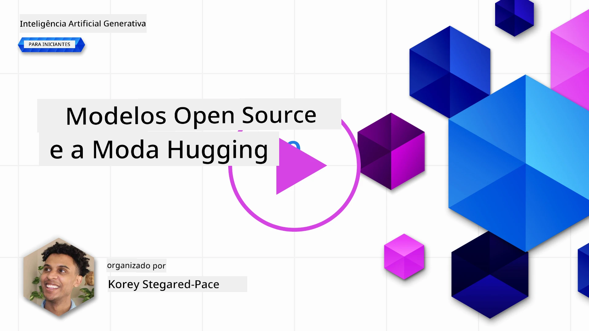
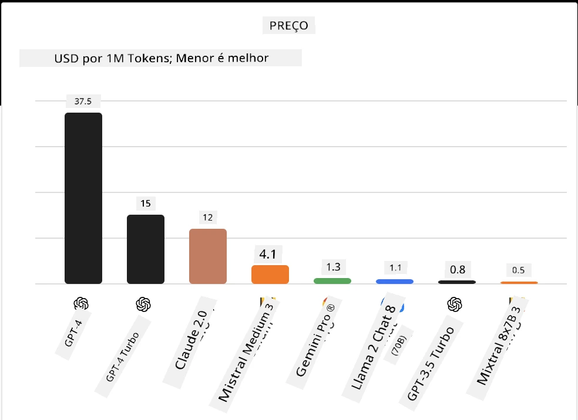
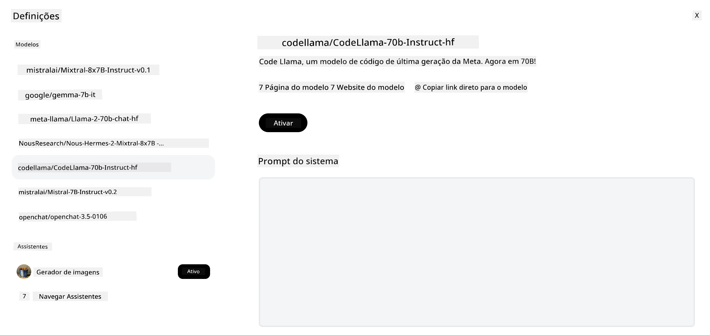

## Introdução

O mundo dos LLMs open source é empolgante e está em constante evolução. Esta lição tem como objetivo fornecer uma visão aprofundada sobre os modelos open source. Se procura informações sobre como os modelos proprietários se comparam aos modelos open source, dirija-se à [Lição "Explorando e Comparando Diferentes LLMs"](../02-exploring-and-comparing-different-llms/README.md?WT.mc_id=academic-105485-koreyst). Esta lição também abordará o tema do fine-tuning, mas uma explicação mais detalhada pode ser encontrada na [Lição "Fine-Tuning LLMs"](../18-fine-tuning/README.md?WT.mc_id=academic-105485-koreyst).

## Objetivos de Aprendizagem

- Obter uma compreensão dos modelos open source
- Compreender os benefícios de trabalhar com modelos open source
- Explorar os modelos disponíveis na Hugging Face e no catálogo de modelos do Microsoft Foundry

## O que são Modelos Open Source?

O software open source desempenhou um papel crucial no crescimento da tecnologia em vários campos. A Open Source Initiative (OSI) definiu [10 critérios para software](https://web.archive.org/web/20241126001143/https://opensource.org/osd?WT.mc_id=academic-105485-koreyst) serem classificados como open source. O código-fonte deve ser partilhado abertamente sob uma licença aprovada pela OSI.

Embora o desenvolvimento de LLMs tenha elementos semelhantes ao desenvolvimento de software, o processo não é exatamente o mesmo. Isto tem gerado muita discussão na comunidade sobre a definição de open source no contexto dos LLMs. Para que um modelo esteja alinhado com a definição tradicional de open source, a seguinte informação deve estar publicamente disponível:

- Conjuntos de dados usados para treinar o modelo.
- Pesos completos do modelo como parte do treino.
- O código de avaliação.
- O código do fine-tuning.
- Pesos completos do modelo e métricas de treino.

Atualmente, existem apenas alguns modelos que cumprem estes critérios. O [modelo OLMo criado pelo Allen Institute for Artificial Intelligence (AllenAI)](https://huggingface.co/allenai/OLMo-7B?WT.mc_id=academic-105485-koreyst) é um que se encaixa nesta categoria.

Para esta lição, vamos referir-nos aos modelos como "modelos abertos" daqui em diante, pois podem não corresponder aos critérios acima no momento da escrita.

## Benefícios dos Modelos Abertos

**Altamente Personalizáveis** - Como os modelos abertos são lançados com informações detalhadas de treino, investigadores e desenvolvedores podem modificar o interior do modelo. Isto possibilita a criação de modelos altamente especializados, ajustados especificamente para uma tarefa ou área de estudo. Alguns exemplos são geração de código, operações matemáticas e biologia.

**Custo** - O custo por token para usar e implementar estes modelos é menor do que o dos modelos proprietários. Ao construir aplicações de IA Generativa, deve-se analisar a relação desempenho vs preço ao trabalhar com estes modelos no seu caso de uso.

Fonte: Artificial Analysis

**Flexibilidade** - Trabalhar com modelos abertos permite-lhe ser flexível na utilização de diferentes modelos ou na sua combinação. Um exemplo disso são os [Assistentes HuggingChat](https://huggingface.co/chat?WT.mc_id=academic-105485-koreyst) onde o utilizador pode selecionar o modelo a ser usado diretamente na interface:

## Explorando Diferentes Modelos Abertos

### Llama 2

[LLama2](https://huggingface.co/meta-llama?WT.mc_id=academic-105485-koreyst), desenvolvido pela Meta, é um modelo aberto otimizado para aplicações baseadas em chat. Isto deve-se ao seu método de fine-tuning, que incluiu uma grande quantidade de diálogo e feedback humano. Com este método, o modelo produz resultados mais alinhados com as expectativas humanas, proporcionando uma melhor experiência ao utilizador.

Alguns exemplos de versões fine-tuned do Llama incluem [Llama Japonês](https://huggingface.co/elyza/ELYZA-japanese-Llama-2-7b?WT.mc_id=academic-105485-koreyst), que se especializa em Japonês, e [Llama Pro](https://huggingface.co/TencentARC/LLaMA-Pro-8B?WT.mc_id=academic-105485-koreyst), que é uma versão melhorada do modelo base.

### Mistral

[Mistral](https://huggingface.co/mistralai?WT.mc_id=academic-105485-koreyst) é um modelo aberto com forte foco em alto desempenho e eficiência. Usa a abordagem Mixture-of-Experts que combina um grupo de modelos especializados de peritos num único sistema onde, dependendo da entrada, certos modelos são selecionados para serem usados. Isto torna a computação mais eficaz, pois os modelos tratam apenas das entradas para as quais são especializados.

Alguns exemplos de versões fine-tuned do Mistral incluem [BioMistral](https://huggingface.co/BioMistral/BioMistral-7B?text=Mon+nom+est+Thomas+et+mon+principal?WT.mc_id=academic-105485-koreyst), focado no domínio médico, e [OpenMath Mistral](https://huggingface.co/nvidia/OpenMath-Mistral-7B-v0.1-hf?WT.mc_id=academic-105485-koreyst), que realiza computação matemática.

### Falcon

[Falcon](https://huggingface.co/tiiuae?WT.mc_id=academic-105485-koreyst) é um LLM criado pelo Technology Innovation Institute (**TII**). O Falcon-40B foi treinado com 40 mil milhões de parâmetros e demonstrou desempenho superior ao do GPT-3 com menos orçamento de computação. Isto deve-se à utilização do algoritmo FlashAttention e à atenção multiquery que permite reduzir os requisitos de memória no tempo de inferência. Com este tempo de inferência reduzido, o Falcon-40B é adequado para aplicações de chat.

Alguns exemplos de versões fine-tuned do Falcon são o [OpenAssistant](https://huggingface.co/OpenAssistant/falcon-40b-sft-top1-560?WT.mc_id=academic-105485-koreyst), um assistente construído em modelos abertos, e o [GPT4ALL](https://huggingface.co/nomic-ai/gpt4all-falcon?WT.mc_id=academic-105485-koreyst), que oferece desempenho superior ao modelo base.

## Como Escolher

Não há uma resposta única para escolher um modelo aberto. Um bom ponto de partida é usar o filtro por tarefa do catálogo de modelos Microsoft Foundry. Isso ajudará a entender que tipos de tarefas o modelo foi treinado para realizar. A Hugging Face mantém também um LLM Leaderboard que mostra os modelos com melhor desempenho com base em certas métricas.

Ao procurar comparar LLMs entre os diferentes tipos, [Artificial Analysis](https://artificialanalysis.ai/?WT.mc_id=academic-105485-koreyst) é outro ótimo recurso:

Fonte: Artificial Analysis

Se estiver a trabalhar num caso de uso específico, procurar versões fine-tuned focadas na mesma área pode ser eficaz. Experimentar múltiplos modelos abertos para ver como eles desempenham segundo as suas expectativas e as dos seus utilizadores é outra boa prática.

## Próximos Passos

A melhor parte dos modelos abertos é que pode começar a trabalhar com eles rapidamente. Veja o [catálogo de modelos Microsoft Foundry](https://ai.azure.com?WT.mc_id=academic-105485-koreyst), que inclui uma coleção específica da Hugging Face com estes modelos que discutimos aqui.

## A aprendizagem não termina aqui, continue a jornada

Após completar esta lição, descubra a nossa [coleção de Aprendizagem de IA Generativa](https://aka.ms/genai-collection?WT.mc_id=academic-105485-koreyst) para continuar a aprimorar o seu conhecimento em IA Generativa!

---

<!-- CO-OP TRANSLATOR DISCLAIMER START -->
**Aviso Legal**:
Este documento foi traduzido utilizando o serviço de tradução automática [Co-op Translator](https://github.com/Azure/co-op-translator). Embora nos esforcemos pela precisão, esteja ciente de que traduções automáticas podem conter erros ou imprecisões. O documento original na sua língua nativa deve ser considerado a fonte autorizada. Para informações críticas, recomenda-se tradução profissional humana. Não nos responsabilizamos por quaisquer mal-entendidos ou interpretações incorretas resultantes da utilização desta tradução.
<!-- CO-OP TRANSLATOR DISCLAIMER END -->