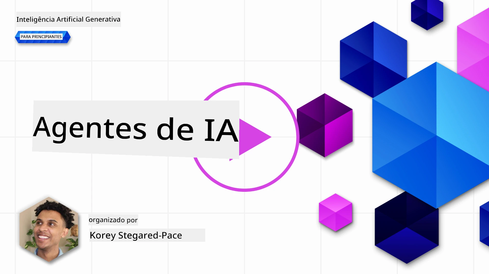
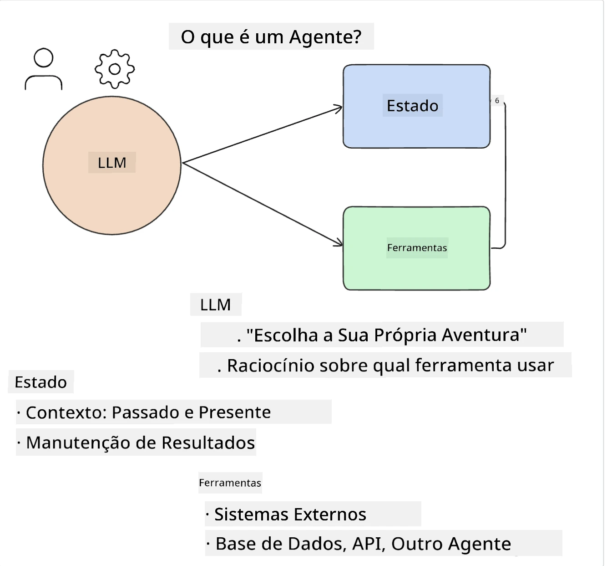
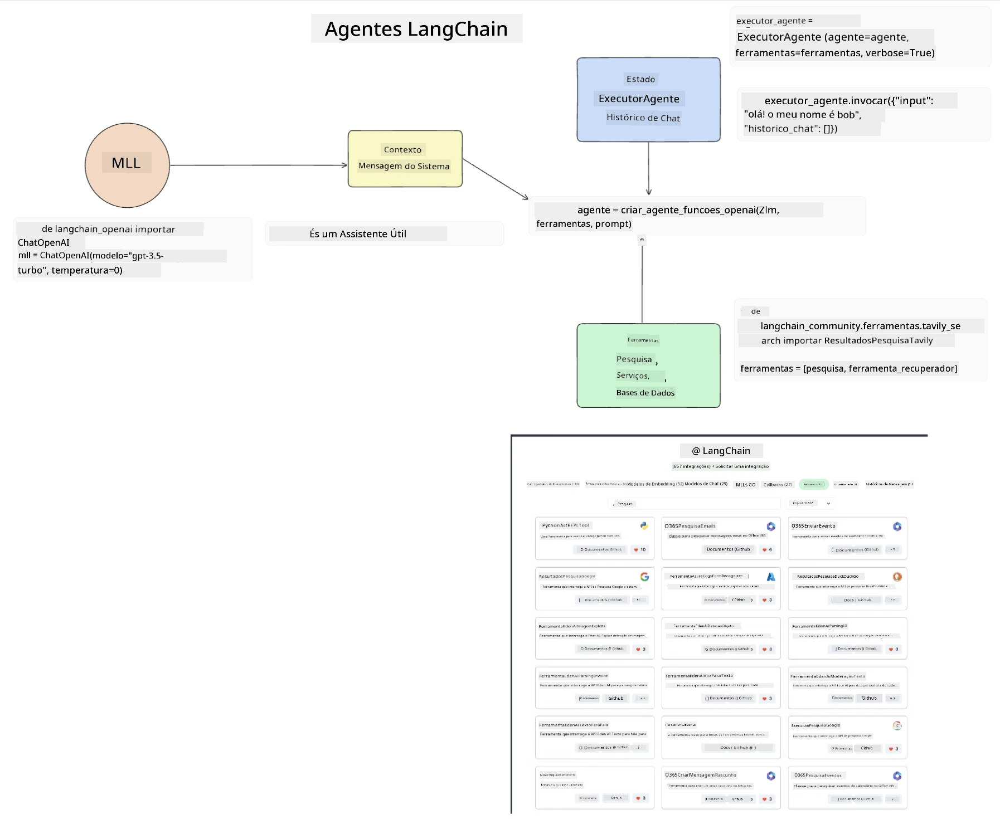
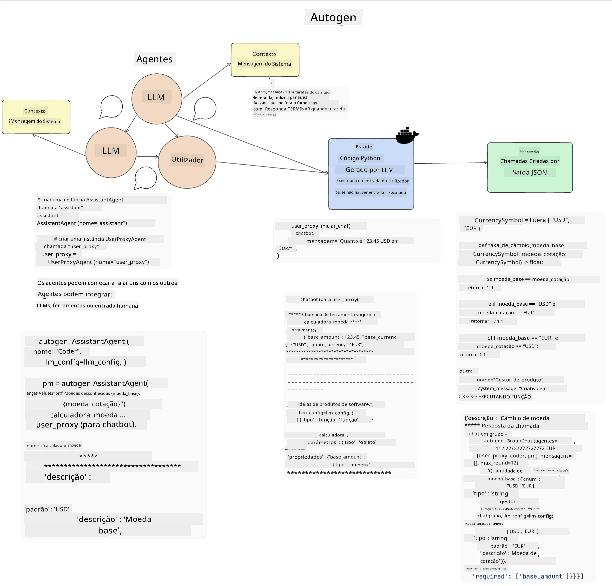
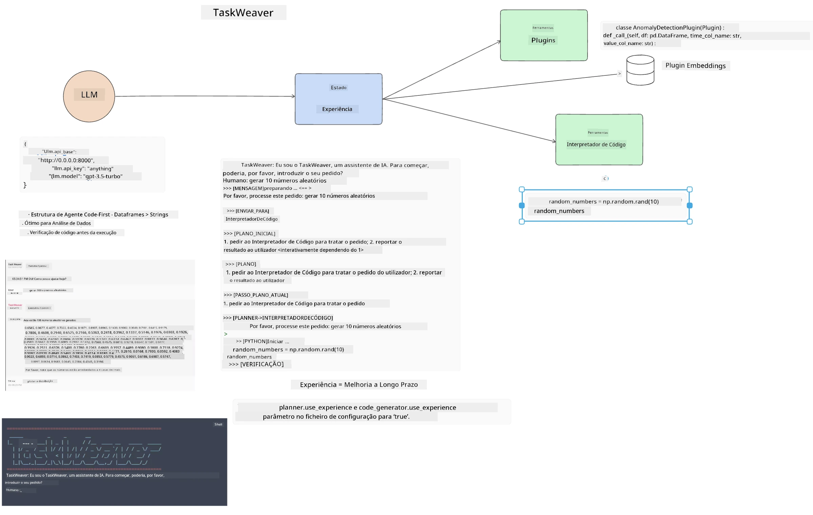
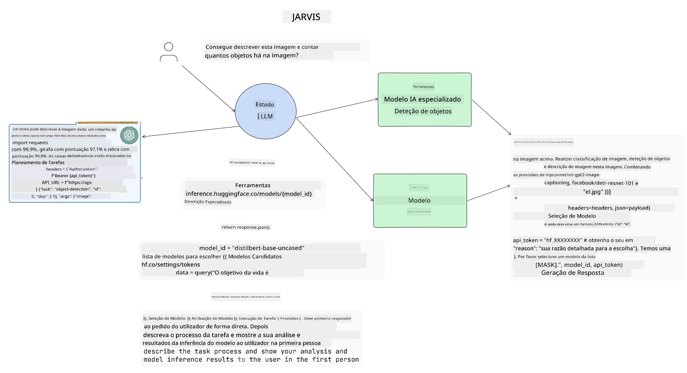

[](https://youtu.be/yAXVW-lUINc?si=bOtW9nL6jc3XJgOM)

## Introdução

Agentes de IA representam um desenvolvimento empolgante na IA Generativa, permitindo que os Grandes Modelos de Linguagem (LLMs) evoluam de assistentes para agentes capazes de tomar ações. Frameworks de agentes de IA permitem que os desenvolvedores criem aplicações que dão aos LLMs acesso a ferramentas e gestão de estado. Esses frameworks também aumentam a visibilidade, permitindo que usuários e desenvolvedores monitorem as ações planejadas pelos LLMs, melhorando assim a gestão da experiência.

A lição cobrirá as seguintes áreas:

- Compreender o que é um Agente de IA - O que é exatamente um Agente de IA?
- Explorar quatro diferentes frameworks de Agentes de IA - O que os torna únicos?
- Aplicar esses agentes de IA em diferentes casos de uso - Quando devemos usar Agentes de IA?

## Objetivos de aprendizagem

Após completar esta lição, você será capaz de:

- Explicar o que são Agentes de IA e como podem ser usados.
- Ter uma compreensão das diferenças entre alguns dos frameworks populares de Agentes de IA e como eles diferem.
- Entender como os Agentes de IA funcionam para construir aplicações com eles.

## O que são Agentes de IA?

Agentes de IA são um campo muito emocionante no mundo da IA Generativa. Com essa empolgação surge por vezes uma confusão de termos e sua aplicação. Para manter as coisas simples e incluir a maioria das ferramentas que se referem a Agentes de IA, vamos utilizar esta definição:

Agentes de IA permitem que Grandes Modelos de Linguagem (LLMs) realizem tarefas dando-lhes acesso a um **estado** e **ferramentas**.



Vamos definir estes termos:

**Grandes Modelos de Linguagem** - São os modelos mencionados ao longo deste curso, tais como GPT-3.5, GPT-4, Llama-2, etc.

**Estado** - Refere-se ao contexto em que o LLM está a trabalhar. O LLM utiliza o contexto das suas ações passadas e o contexto atual, orientando a sua tomada de decisão para ações subsequentes. Frameworks de Agentes de IA permitem aos desenvolvedores manter este contexto mais facilmente.

**Ferramentas** - Para completar a tarefa que o usuário solicitou e que o LLM planeou, o LLM necessita de acesso a ferramentas. Alguns exemplos de ferramentas podem ser uma base de dados, uma API, uma aplicação externa ou até outro LLM!

Estas definições deverão dar-lhe uma boa base para avançarmos enquanto exploramos como eles são implementados. Vamos explorar alguns diferentes frameworks de Agentes de IA:

## LangChain Agents

[LangChain Agents](https://python.langchain.com/docs/how_to/#agents?WT.mc_id=academic-105485-koreyst) é uma implementação das definições que fornecemos acima.

Para gerir o **estado**, utiliza uma função incorporada chamada `AgentExecutor`. Esta aceita o `agent` definido e as `tools` disponíveis para ele.

O `Agent Executor` também armazena o histórico do chat para fornecer o contexto da conversa.



A LangChain oferece um [catálogo de ferramentas](https://integrations.langchain.com/tools?WT.mc_id=academic-105485-koreyst) que pode ser importado para sua aplicação, às quais o LLM pode aceder. Estas são feitas pela comunidade e pela equipa LangChain.

Você pode então definir essas ferramentas e passá-las ao `Agent Executor`.

Visibilidade é outro aspeto importante ao falar de Agentes de IA. É importante para os desenvolvedores entender qual ferramenta o LLM está a usar e porquê. Para isso, a equipa da LangChain desenvolveu o LangSmith.

## AutoGen

O próximo framework de Agentes de IA que vamos discutir é o [AutoGen](https://microsoft.github.io/autogen/?WT.mc_id=academic-105485-koreyst). O foco principal do AutoGen são conversas. Os agentes são tanto **conversáveis** como **personalizáveis**.

**Conversável -** LLMs podem iniciar e continuar uma conversa com outro LLM para completar uma tarefa. Isto é feito criando `AssistantAgents` e dando-lhes uma mensagem de sistema específica.

```python

autogen.AssistantAgent( name="Coder", llm_config=llm_config, ) pm = autogen.AssistantAgent( name="Product_manager", system_message="Creative in software product ideas.", llm_config=llm_config, )

```

**Personalizável** - Agentes podem ser definidos não só como LLMs mas também como um utilizador ou uma ferramenta. Como desenvolvedor, pode definir um `UserProxyAgent` que é responsável por interagir com o usuário para obter feedback na conclusão de uma tarefa. Este feedback pode continuar a execução da tarefa ou pará-la.

```python
user_proxy = UserProxyAgent(name="user_proxy")
```

### Estado e Ferramentas

Para alterar e gerir o estado, um agente assistente gera código Python para completar a tarefa.

Aqui está um exemplo do processo:



#### LLM definido com uma Mensagem de Sistema

```python
system_message="For weather related tasks, only use the functions you have been provided with. Reply TERMINATE when the task is done."
```

Esta mensagem de sistema direciona este LLM específico para quais funções são relevantes para a sua tarefa. Lembre-se que, com AutoGen, pode ter múltiplos AssistantAgents definidos com diferentes mensagens de sistema.

#### O chat é iniciado pelo usuário

```python
user_proxy.initiate_chat( chatbot, message="I am planning a trip to NYC next week, can you help me pick out what to wear? ", )

```

Esta mensagem do user_proxy (Humano) é o que irá iniciar o processo para o agente explorar as possíveis funções que deve executar.

#### Função é executada

```bash
chatbot (to user_proxy):

***** Suggested tool Call: get_weather ***** Arguments: {"location":"New York City, NY","time_periond:"7","temperature_unit":"Celsius"} ******************************************************** --------------------------------------------------------------------------------

>>>>>>>> EXECUTING FUNCTION get_weather... user_proxy (to chatbot): ***** Response from calling function "get_weather" ***** 112.22727272727272 EUR ****************************************************************

```

Uma vez processado o chat inicial, o agente enviará a ferramenta sugerida para chamar. Neste caso, é uma função chamada `get_weather`. Dependendo da sua configuração, esta função pode ser executada automaticamente e lida pelo agente ou pode ser executada com base na entrada do usuário.

Pode encontrar uma lista de [exemplos de código AutoGen](https://microsoft.github.io/autogen/docs/Examples/?WT.mc_id=academic-105485-koreyst) para explorar como começar a construir.

## Taskweaver

O próximo framework de agente que vamos explorar é o [Taskweaver](https://microsoft.github.io/TaskWeaver/?WT.mc_id=academic-105485-koreyst). É conhecido como um agente “code-first” porque, em vez de trabalhar estritamente com `strings`, pode trabalhar com DataFrames em Python. Isto torna-se extremamente útil para tarefas de análise e geração de dados. Isto pode incluir criar gráficos e tabelas ou gerar números aleatórios.

### Estado e Ferramentas

Para gerir o estado da conversa, o TaskWeaver usa o conceito de um `Planner`. O `Planner` é um LLM que recebe o pedido dos usuários e delimita as tarefas que precisam ser completadas para cumprir esse pedido.

Para completar as tarefas, o `Planner` tem acesso a uma coleção de ferramentas chamadas `Plugins`. Estes podem ser classes Python ou um interpretador geral de código. Estes plugins são armazenados como embeddings para que o LLM possa procurar melhor o plugin correto.



Aqui está um exemplo de um plugin para tratamento de deteção de anomalias:

```python
class AnomalyDetectionPlugin(Plugin): def __call__(self, df: pd.DataFrame, time_col_name: str, value_col_name: str):
```

O código é verificado antes da execução. Outra funcionalidade para gerir o contexto no Taskweaver é a `experiência`. A experiência permite que o contexto de uma conversa seja armazenado a longo prazo num ficheiro YAML. Isto pode ser configurado para que o LLM melhore ao longo do tempo em certas tarefas desde que esteja exposto a conversas anteriores.

## JARVIS

O último framework de agente que vamos explorar é o [JARVIS](https://github.com/microsoft/JARVIS?tab=readme-ov-file&WT.mc_id=academic-105485-koreyst). O que torna o JARVIS único é que ele usa um LLM para gerir o `estado` da conversa e as `ferramentas` são outros modelos de IA. Cada um dos modelos de IA são modelos especializados que realizam certas tarefas como deteção de objetos, transcrição ou descrição de imagens.



O LLM, sendo um modelo de uso geral, recebe o pedido do usuário e identifica a tarefa específica e quaisquer argumentos/dados necessários para completar a tarefa.

```python
[{"task": "object-detection", "id": 0, "dep": [-1], "args": {"image": "e1.jpg" }}]
```

O LLM então formata o pedido numa forma que o modelo de IA especializado possa interpretar, como JSON. Uma vez que o modelo de IA tenha devolvido a sua previsão com base na tarefa, o LLM recebe a resposta.

Se forem necessários múltiplos modelos para completar a tarefa, também interpretará a resposta desses modelos antes de juntá-las para gerar a resposta ao usuário.

O exemplo abaixo mostra como isto funcionaria quando um usuário solicita uma descrição e contagem dos objetos numa imagem:

## Exercício

Para continuar o seu aprendizado sobre Agentes de IA, pode construir com AutoGen:

- Uma aplicação que simula uma reunião de negócios com diferentes departamentos de uma startup de educação.
- Criar mensagens de sistema que guiem os LLMs a entender diferentes personas e prioridades, e permitir que o usuário apresente uma nova ideia de produto.
- O LLM deve então gerar perguntas de seguimento de cada departamento para refinar e melhorar a apresentação e a ideia do produto.

## O aprendizado não termina aqui, continue a tua jornada

Após completar esta lição, confira a nossa [coleção de Aprendizagem em IA Generativa](https://aka.ms/genai-collection?WT.mc_id=academic-105485-koreyst) para continuar a aprimorar seu conhecimento em IA Generativa!

---

<!-- CO-OP TRANSLATOR DISCLAIMER START -->
**Aviso Legal**:
Este documento foi traduzido utilizando o serviço de tradução automática [Co-op Translator](https://github.com/Azure/co-op-translator). Embora nos esforcemos para garantir a precisão, por favor tenha em atenção que traduções automáticas podem conter erros ou imprecisões. O documento original no seu idioma nativo deve ser considerado a fonte autorizada. Para informações críticas, recomenda-se a tradução profissional humana. Não nos responsabilizamos por quaisquer mal-entendidos ou interpretações erradas decorrentes da utilização desta tradução.
<!-- CO-OP TRANSLATOR DISCLAIMER END -->