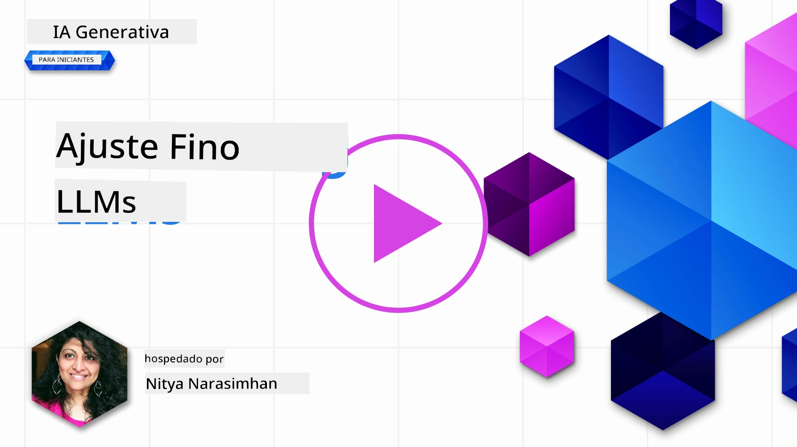
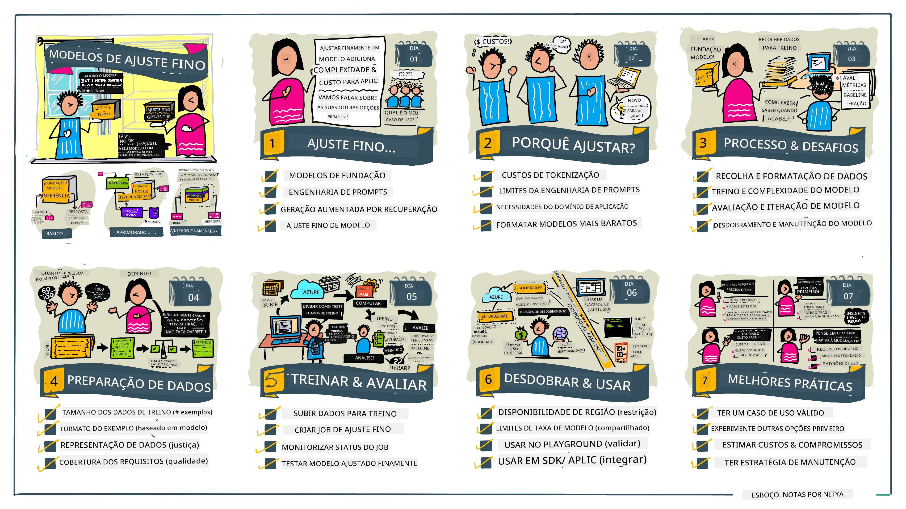

# Ajuste Fino do Seu LLM

Usar modelos linguísticos grandes para construir aplicações de IA generativa traz novos desafios. Uma questão fundamental é garantir a qualidade da resposta (precisão e relevância) no conteúdo gerado pelo modelo para um dado pedido do utilizador. Nas aulas anteriores, discutimos técnicas como engenharia de prompts e geração aumentada por recuperação que tentam resolver o problema ao _modificar a entrada do prompt_ no modelo existente.

Na aula de hoje, discutimos uma terceira técnica, o **ajuste fino**, que tenta abordar o desafio _re-treinando o próprio modelo_ com dados adicionais. Vamos aprofundar-nos nos detalhes.

## Objetivos de Aprendizagem

Esta aula introduz o conceito de ajuste fino para modelos linguísticos pré-treinados, explora os benefícios e desafios desta abordagem, e fornece orientações sobre quando e como usar o ajuste fino para melhorar o desempenho dos seus modelos de IA generativa.

No final desta aula, deverá ser capaz de responder às seguintes perguntas:

- O que é ajuste fino para modelos linguísticos?
- Quando e porquê o ajuste fino é útil?
- Como posso ajustar fino um modelo pré-treinado?
- Quais são as limitações do ajuste fino?

Pronto? Vamos começar.

## Guia Ilustrado

Quer ter uma visão geral do que vamos cobrir antes de começarmos? Veja este guia ilustrado que descreve a jornada de aprendizagem para esta aula — desde aprender os conceitos básicos e a motivação para o ajuste fino, até compreender o processo e as melhores práticas para executar a tarefa de ajuste fino. Este é um tópico fascinante para explorar, por isso não se esqueça de consultar a página de [Recursos](./RESOURCES.md?WT.mc_id=academic-105485-koreyst) para links adicionais que apoiem a sua aprendizagem autónoma!

## O que é ajuste fino para modelos linguísticos?

Por definição, os modelos linguísticos grandes são _pré-treinados_ com grandes quantidades de texto proveniente de fontes diversas, incluindo a internet. Como aprendemos nas aulas anteriores, precisamos de técnicas como _engenharia de prompts_ e _geração aumentada por recuperação_ para melhorar a qualidade das respostas do modelo às perguntas do utilizador ("prompts").

Uma técnica popular de engenharia de prompts envolve dar ao modelo mais orientação sobre o que se espera na resposta, seja através de _instruções_ (orientação explícita) ou _dando-lhe alguns exemplos_ (orientação implícita). Isto é referido como _few-shot learning_ mas tem duas limitações:

- Os limites de tokens do modelo podem restringir o número de exemplos que pode fornecer e limitar a eficácia.
- O custo dos tokens do modelo pode tornar dispendioso adicionar exemplos a cada prompt, limitando a flexibilidade.

O ajuste fino é uma prática comum em sistemas de machine learning onde pegamos num modelo pré-treinado e o re-treinamos com novos dados para melhorar o seu desempenho numa tarefa específica. No contexto de modelos linguísticos, podemos ajustar fino o modelo pré-treinado _com um conjunto seleto de exemplos para uma dada tarefa ou domínio de aplicação_ para criar um **modelo personalizado** que pode ser mais preciso e relevante para essa tarefa ou domínio específico. Um benefício adicional do ajuste fino é que pode também reduzir o número de exemplos necessários para zero ou few-shot learning - reduzindo o uso de tokens e os custos associados.

## Quando e porquê devemos ajustar fino os modelos?

Neste _contexto_, quando falamos de ajuste fino, estamos a referir-nos ao ajuste fino **supervisionado**, onde o re-treinamento é feito adicionando **novos dados** que não faziam parte do conjunto de treino original. Isto é diferente de uma abordagem de ajuste fino não supervisionada onde o modelo é re-treinado nos dados originais, mas com hiperparâmetros diferentes.

O principal a lembrar é que o ajuste fino é uma técnica avançada que requer um certo nível de especialização para obter os resultados desejados. Se feito incorretamente, pode não trazer as melhorias esperadas, e pode até degradar o desempenho do modelo para o domínio que pretende usar.

Assim, antes de aprender "como" ajustar fino modelos linguísticos, precisa saber "porquê" deve seguir este caminho, e "quando" iniciar o processo de ajuste fino. Comece por se perguntar:

- **Caso de Uso**: Qual é o seu _caso de uso_ para ajuste fino? Que aspeto do modelo pré-treinado atual quer melhorar?
- **Alternativas**: Já experimentou _outras técnicas_ para atingir os resultados desejados? Use-as para criar uma referência para comparação.
  - Engenharia de prompts: Experimente técnicas como few-shot prompting com exemplos de respostas de prompt relevantes. Avalie a qualidade das respostas.
  - Geração Aumentada por Recuperação: Experimente aumentar prompts com resultados de queries recuperados ao pesquisar os seus dados. Avalie a qualidade das respostas.
- **Custos**: Identificou os custos para ajuste fino?
  - Ajustabilidade - o modelo pré-treinado está disponível para ajuste fino?
  - Esforço - para preparar dados de treino, avaliar e refinar o modelo.
  - Computação - para executar as tarefas de ajuste fino, e para implantar o modelo ajustado
  - Dados - acesso a exemplos de qualidade suficiente para impacto no ajuste fino
- **Benefícios**: Confirmou os benefícios do ajuste fino?
  - Qualidade - o modelo ajustado superou a referência?
  - Custo - reduz o uso de tokens simplificando prompts?
  - Extensibilidade - pode reutilizar o modelo base para novos domínios?

Respondendo a estas questões, deverá ser capaz de decidir se o ajuste fino é o caminho certo para o seu caso de uso. Idealmente, a abordagem é válida apenas se os benefícios superarem os custos. Quando decidir avançar, é altura de pensar _como_ pode ajustar fino o modelo pré-treinado.

Quer obter mais insights sobre o processo de decisão? Veja [Ajustar fino ou não ajustar fino](https://www.youtube.com/watch?v=0Jo-z-MFxJs)

## Como podemos ajustar fino um modelo pré-treinado?

Para ajustar fino um modelo pré-treinado, precisa de ter:

- um modelo pré-treinado para ajustar fino
- um conjunto de dados para usar no ajuste fino
- um ambiente de treino para executar a tarefa de ajuste fino
- um ambiente de alojamento para implantar o modelo ajustado

## Ajuste Fino em Ação

Os recursos seguintes fornecem tutoriais passo a passo para o guiar através de um exemplo real usando um modelo selecionado com um conjunto de dados selecionado. Para seguir estes tutoriais, precisa de uma conta no respetivo fornecedor, juntamente com acesso ao modelo e conjuntos de dados relevantes.

| Fornecedor   | Tutorial                                                                                                                                                                     | Descrição                                                                                                                                                                                                                                                                                                                                                                                                                        |
| ------------ | ---------------------------------------------------------------------------------------------------------------------------------------------------------------------------- | -------------------------------------------------------------------------------------------------------------------------------------------------------------------------------------------------------------------------------------------------------------------------------------------------------------------------------------------------------------------------------------------------------------------------------- |
| OpenAI       | [Como ajustar fino modelos de chat](https://github.com/openai/openai-cookbook/blob/main/examples/How_to_finetune_chat_models.ipynb?WT.mc_id=academic-105485-koreyst)          | Aprenda a ajustar fino um `gpt-35-turbo` para um domínio específico ("assistente de receitas") preparando dados de treino, executando a tarefa de ajuste fino, e usando o modelo ajustado para inferência.                                                                                                                                                                                                                        |
| Azure OpenAI | [Tutorial de ajuste fino GPT 3.5 Turbo](https://learn.microsoft.com/azure/ai-services/openai/tutorials/fine-tune?tabs=python-new%2Ccommand-line&WT.mc_id=academic-105485-koreyst) | Aprenda a ajustar fino um modelo `gpt-35-turbo-0613` **na Azure** dando passos para criar e carregar dados de treino, executar a tarefa de ajuste fino. Implante e use o novo modelo.                                                                                                                                                                                                                                           |
| Hugging Face | [Ajuste fino de LLMs com Hugging Face](https://www.philschmid.de/fine-tune-llms-in-2024-with-trl?WT.mc_id=academic-105485-koreyst)                                           | Este artigo do blog guia-o no ajuste fino de um _LLM aberto_ (ex: `CodeLlama 7B`) usando a biblioteca [transformers](https://huggingface.co/docs/transformers/index?WT.mc_id=academic-105485-koreyst) & [Transformer Reinforcement Learning (TRL)](https://huggingface.co/docs/trl/index?WT.mc_id=academic-105485-koreyst) com [datasets](https://huggingface.co/docs/datasets/index?WT.mc_id=academic-105485-koreyst) abertos na Hugging Face.                   |
|              |                                                                                                                                                                              |                                                                                                                                                                                                                                                                                                                                                                                                                                  |
| 🤗 AutoTrain | [Ajuste fino de LLMs com AutoTrain](https://github.com/huggingface/autotrain-advanced/?WT.mc_id=academic-105485-koreyst)                                                     | AutoTrain (ou AutoTrain Advanced) é uma biblioteca python desenvolvida pela Hugging Face que permite ajuste fino para muitas tarefas diferentes incluindo ajuste fino de LLMs. AutoTrain é uma solução sem código e o ajuste fino pode ser feito na sua própria cloud, nos Hugging Face Spaces ou localmente. Suporta interface web GUI, CLI e treino via ficheiros de configuração yaml.                                                                                                 |
|              |                                                                                                                                                                              |                                                                                                                                                                                                                                                                                                                                                                                                                                  |
| 🦥 Unsloth   | [Ajuste fino de LLMs com Unsloth](https://github.com/unslothai/unsloth)                                                                                                     | Unsloth é um framework open-source que suporta ajuste fino de LLMs e aprendizagem por reforço (RL). Unsloth simplifica treino local, avaliação e deployment com [notebooks](https://github.com/unslothai/notebooks) prontos a usar. Suporta também text-to-speech (TTS), BERT e modelos multimodais. Para começar, leia o seu passo a passo no [Guia de Ajuste Fino de LLMs](https://docs.unsloth.ai/get-started/fine-tuning-llms-guide).                                               |
|              |                                                                                                                                                                              |                                                                                                                                                                                                                                                                                                                                                                                                                                  |
## Trabalho de Casa

Selecione um dos tutoriais acima e siga-o. _Podemos replicar uma versão destes tutoriais num Jupyter Notebooks neste repositório apenas para referência. Utilize por favor as fontes originais diretamente para obter as versões mais recentes_.

## Excelente Trabalho! Continue a Aprender.

Depois de completar esta aula, dê uma vista de olhos na nossa [coleção de Aprendizagem de IA Generativa](https://aka.ms/genai-collection?WT.mc_id=academic-105485-koreyst) para continuar a aprofundar os seus conhecimentos em IA Generativa!

Parabéns!! Concluiu a última aula da série v2 deste curso! Não pare de aprender e de construir. \*\*Consulte a página de [RECURSOS](RESOURCES.md?WT.mc_id=academic-105485-koreyst) para uma lista de sugestões adicionais só sobre este tema.

A nossa série de aulas v1 também foi atualizada com mais trabalhos e conceitos. Reserve um minuto para refrescar os seus conhecimentos – e por favor [partilhe as suas perguntas e feedback](https://github.com/microsoft/generative-ai-for-beginners/issues?WT.mc_id=academic-105485-koreyst) para nos ajudar a melhorar estas aulas para a comunidade.

---

<!-- CO-OP TRANSLATOR DISCLAIMER START -->
**Aviso Legal**:
Este documento foi traduzido utilizando o serviço de tradução automática [Co-op Translator](https://github.com/Azure/co-op-translator). Embora nos esforcemos pela precisão, esteja ciente de que traduções automáticas podem conter erros ou imprecisões. O documento original no seu idioma nativo deve ser considerado a fonte autorizada. Para informações críticas, recomenda-se a tradução profissional humana. Não nos responsabilizamos por quaisquer mal-entendidos ou interpretações incorretas decorrentes do uso desta tradução.
<!-- CO-OP TRANSLATOR DISCLAIMER END -->