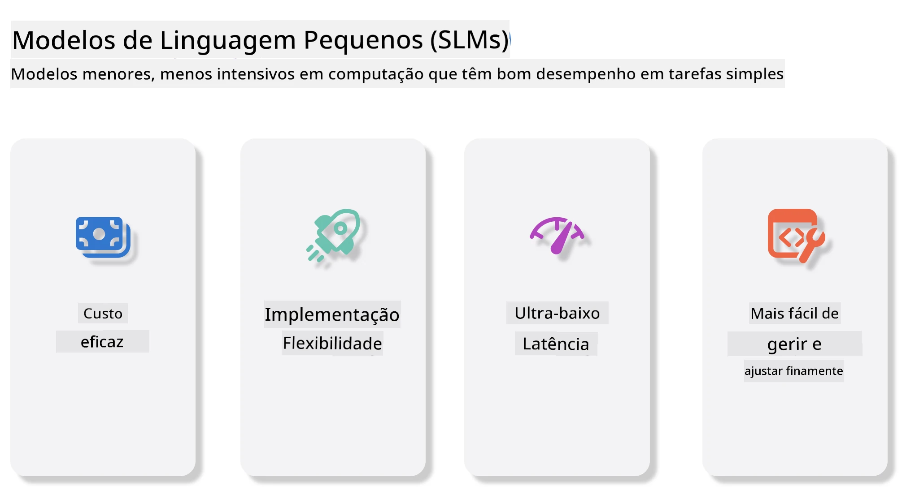
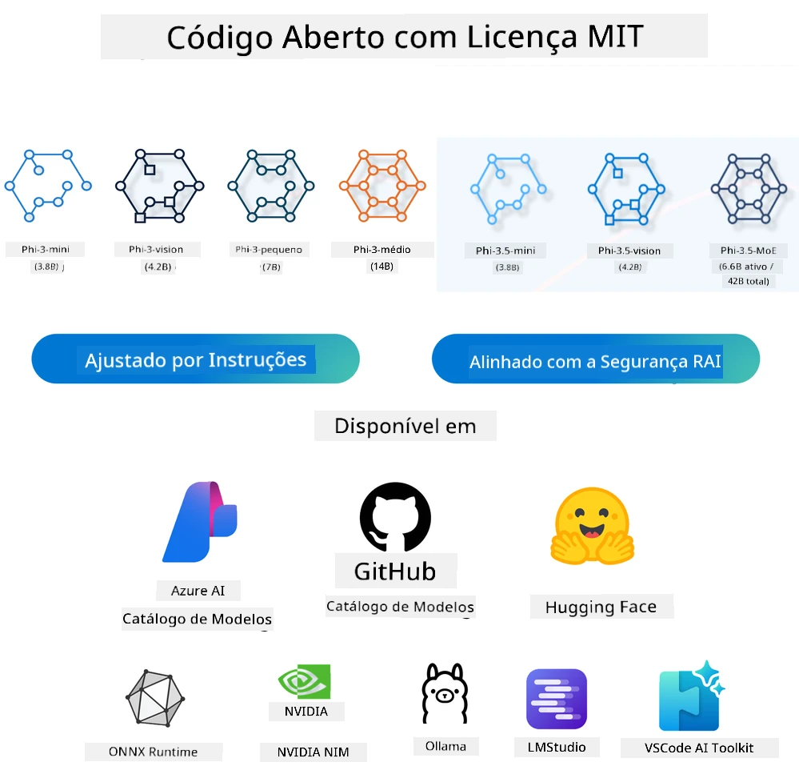
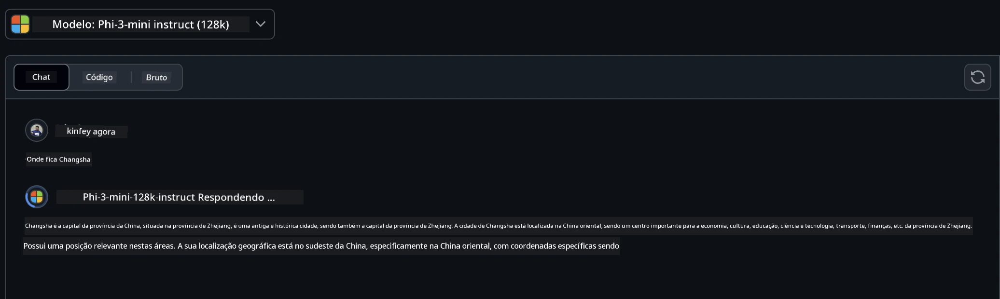
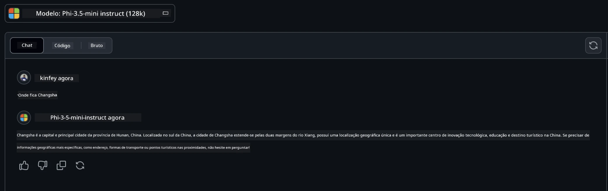

# Introdução aos Pequenos Modelos de Linguagem para IA Generativa para Iniciantes
A IA generativa é um campo fascinante da inteligência artificial que se foca na criação de sistemas capazes de gerar novo conteúdo. Esse conteúdo pode ir desde texto e imagens a música e até ambientes virtuais completos. Uma das aplicações mais empolgantes da IA generativa encontra-se no domínio dos modelos de linguagem.

## O que são Pequenos Modelos de Linguagem?

Um Pequeno Modelo de Linguagem (PML) representa uma variante reduzida de um grande modelo de linguagem (GML), aproveitando muitos dos princípios arquitetónicos e técnicas dos GMLs, enquanto apresenta uma pegada computacional significativamente reduzida. 

Os PMLs são um subconjunto de modelos de linguagem projetados para gerar texto semelhante ao humano. Ao contrário dos seus homólogos maiores, como o GPT-4, os PMLs são mais compactos e eficientes, tornando-os ideais para aplicações onde os recursos computacionais são limitados. Apesar do seu tamanho menor, ainda podem executar uma variedade de tarefas. Tipicamente, os PMLs são construídos através da compressão ou destilação de GMLs, com o objetivo de reter uma porção substancial da funcionalidade original e das capacidades linguísticas do modelo original. Esta redução no tamanho do modelo diminui a complexidade global, tornando os PMLs mais eficientes em termos de uso de memória e requisitos computacionais. Apesar destas otimizações, os PMLs podem ainda executar uma ampla gama de tarefas de processamento de linguagem natural (PLN):

- Geração de Texto: Criar frases ou parágrafos coerentes e contextualmente relevantes.
- Completamento de Texto: Prever e completar frases com base num prompt dado.
- Tradução: Converter texto de uma língua para outra.
- Resumo: Condensar longos textos em resumos mais curtos e digeríveis.

Apesar de algumas trocas em desempenho ou profundidade de compreensão em comparação com os seus homólogos maiores. 

## Como Funcionam os Pequenos Modelos de Linguagem?
Os PMLs são treinados com grandes quantidades de dados textuais. Durante o treino, aprendem os padrões e estruturas da linguagem, permitindo-lhes gerar texto que é gramaticalmente correto e contextualmente apropriado. O processo de treino envolve:

- Recolha de Dados: Agrupar grandes conjuntos de dados de texto de várias fontes.
- Pré-processamento: Limpar e organizar os dados para torná-los adequados para treino.
- Treino: Usar algoritmos de aprendizagem automática para ensinar o modelo a compreender e gerar texto.
- Ajuste Fino: Ajustar o modelo para melhorar o seu desempenho em tarefas específicas.

O desenvolvimento dos PMLs alinha-se com a crescente necessidade de modelos que possam ser implementados em ambientes com recursos limitados, como dispositivos móveis ou plataformas de computação de borda, onde os GMLs em grande escala podem ser impraticáveis devido às suas exigências elevadas de recursos. Ao focar na eficiência, os PMLs equilibram desempenho com acessibilidade, permitindo uma aplicação mais ampla em vários domínios.



## Objetivos de Aprendizagem

Nesta lição, esperamos introduzir o conhecimento dos PMLs e combiná-lo com o Microsoft Phi-3 para aprender diferentes cenários em conteúdo textual, visão e MoE.

No final desta lição, deverá ser capaz de responder às seguintes perguntas:

- O que é um PML?
- Qual é a diferença entre um PML e um GML?
- O que é a Família Microsoft Phi-3/3.5?
- Como executar inferência com a Família Microsoft Phi-3/3.5?

Pronto? Vamos começar.

## As Distinções entre Grandes Modelos de Linguagem (GMLs) e Pequenos Modelos de Linguagem (PMLs)

Tanto os GMLs como os PMLs são construídos com base em princípios fundamentais da aprendizagem automática probabilística, seguindo abordagens semelhantes no seu design arquitetónico, metodologias de treino, processos de geração de dados e técnicas de avaliação de modelos. No entanto, vários fatores chave diferenciam estes dois tipos de modelos.

## Aplicações dos Pequenos Modelos de Linguagem

Os PMLs têm uma vasta gama de aplicações, incluindo:

- Chatbots: Fornecer suporte ao cliente e interagir com utilizadores de forma conversacional.
- Criação de Conteúdo: Ajudar escritores a gerar ideias ou até redigir artigos completos.
- Educação: Auxiliar estudantes com trabalhos escritos ou aprendizagem de novas línguas.
- Acessibilidade: Criar ferramentas para indivíduos com deficiências, como sistemas de voz para texto.

**Tamanho**
  
Uma distinção principal entre GMLs e PMLs reside na escala dos modelos. GMLs, como o ChatGPT (GPT-4), podem ter cerca de 1,76 triliões de parâmetros, enquanto PMLs open-source como o Mistral 7B são projetados com significativamente menos parâmetros — aproximadamente 7 mil milhões. Esta disparidade deve-se principalmente às diferenças na arquitetura do modelo e processos de treino. Por exemplo, o ChatGPT utiliza um mecanismo de autoatenção dentro de uma arquitetura codificador-decodificador, enquanto o Mistral 7B usa atenção de janela deslizante, o que permite um treino mais eficiente dentro de um modelo apenas de decodificador. Esta variação arquitetónica tem implicações profundas para a complexidade e desempenho destes modelos.

**Compreensão**

Os PMLs são tipicamente otimizados para desempenho em domínios específicos, o que os torna altamente especializados, mas potencialmente limitados na sua capacidade para fornecer uma compreensão contextual ampla através de múltiplos campos do conhecimento. Em contraste, os GMLs visam simular inteligência semelhante à humana num nível mais abrangente. Treinados em grandes conjuntos de dados diversos, os GMLs são projetados para funcionar bem numa variedade de domínios, oferecendo maior versatilidade e adaptabilidade. Consequentemente, os GMLs são mais adequados para uma gama mais vasta de tarefas posteriores, como o processamento de linguagem natural e programação.

**Computação**

O treino e implementação dos GMLs são processos intensivos em recursos, frequentemente requerendo infraestrutura computacional significativa, incluindo clusters de GPU em larga escala. Por exemplo, o treino de um modelo como o ChatGPT do zero pode exigir milhares de GPUs durante períodos prolongados. Em contraste, os PMLs, com contagens mais reduzidas de parâmetros, são mais acessíveis em termos de recursos computacionais. Modelos como o Mistral 7B podem ser treinados e executados em máquinas locais equipadas com capacidades moderadas de GPU, embora o treino ainda demande várias horas em múltiplas GPUs.

**Viés**

O viés é uma questão conhecida nos GMLs, principalmente devido à natureza dos dados de treino. Estes modelos frequentemente dependem de dados brutos e abertamente disponíveis da internet, que podem sub-representar ou representar incorretamente certos grupos, introduzir rotulagem errada ou refletir vieses linguísticos influenciados por dialetos, variações geográficas e regras gramaticais. Além disso, a complexidade das arquiteturas dos GMLs pode inadvertidamente exacerbar o viés, que pode passar despercebido sem um ajuste fino cuidadoso. Por outro lado, os PMLs, sendo treinados em conjuntos de dados mais restritos e específicos de domínios, são inerentemente menos suscetíveis a tais vieses, embora não sejam imunes a eles.

**Inferência**

O tamanho reduzido dos PMLs oferece uma vantagem significativa em termos de velocidade de inferência, permitindo-lhes gerar saídas de forma eficiente em hardware local sem necessidade de processamento paralelo extenso. Em contraste, os GMLs, devido ao seu tamanho e complexidade, frequentemente requerem recursos computacionais paralelos substanciais para alcançar tempos de inferência aceitáveis. A existência de múltiplos utilizadores simultâneos desacelera ainda mais o tempo de resposta dos GMLs, especialmente quando implementados em escala.

Em resumo, embora tanto os GMLs como os PMLs partilhem uma base fundamental na aprendizagem automática, diferem significativamente em termos de tamanho do modelo, requisitos de recursos, compreensão contextual, suscetibilidade a viés e velocidade de inferência. Estas distinções refletem a sua adequada aplicabilidade a diferentes casos de uso, sendo os GMLs mais versáteis mas com elevado consumo de recursos e os PMLs oferecendo eficiência mais específica por domínio com menores exigências computacionais.

***Nota: Nesta lição, iremos apresentar os PMLs usando o Microsoft Phi-3 / 3.5 como exemplo.***

## Introdução à Família Phi-3 / Phi-3.5

A Família Phi-3 / 3.5 direciona-se principalmente a cenários de aplicação em texto, visão e Agente (MoE):

### Phi-3 / 3.5 Instruct

Destina-se principalmente à geração de texto, completamento de chat e extração de informação de conteúdo, entre outros.

**Phi-3-mini**

O modelo de linguagem de 3.8B está disponível no Microsoft Azure AI Studio, Hugging Face e Ollama. Os modelos Phi-3 superam significativamente modelos de linguagem de tamanho igual ou superior em benchmarks principais (veja os números dos benchmarks abaixo, números mais altos são melhores). O Phi-3-mini supera modelos duas vezes o seu tamanho, enquanto o Phi-3-small e Phi-3-medium superam modelos maiores, incluindo o GPT-3.5.

**Phi-3-small e medium**

Com apenas 7B parâmetros, o Phi-3-small supera o GPT-3.5T numa variedade de benchmarks de linguagem, raciocínio, programação e matemática.

O Phi-3-medium com 14B parâmetros continua esta tendência e supera o Gemini 1.0 Pro.

**Phi-3.5-mini**

Podemos vê-lo como uma atualização do Phi-3-mini. Embora os parâmetros permaneçam inalterados, melhora a capacidade de suportar múltiplas línguas (suporta mais de 20 línguas: Árabe, Chinês, Checo, Dinamarquês, Holandês, Inglês, Finlandês, Francês, Alemão, Hebraico, Húngaro, Italiano, Japonês, Coreano, Norueguês, Polaco, Português, Russo, Espanhol, Sueco, Tailandês, Turco, Ucraniano) e adiciona suporte mais forte para contexto longo.

O Phi-3.5-mini com 3.8B parâmetros supera modelos de linguagem do mesmo tamanho e está ao nível de modelos duas vezes maiores.

### Phi-3 / 3.5 Vision

Podemos pensar no modelo Instruct do Phi-3/3.5 como a capacidade do Phi para entender, e a Visão é o que dá ao Phi olhos para compreender o mundo.

**Phi-3-Vision**

O Phi-3-vision, com apenas 4.2B parâmetros, continua esta tendência e supera modelos maiores como Claude-3 Haiku e Gemini 1.0 Pro V em tarefas gerais de raciocínio visual, OCR e compreensão de tabelas e diagramas.

**Phi-3.5-Vision**

O Phi-3.5-Vision é também uma atualização do Phi-3-Vision, adicionando suporte para múltiplas imagens. Pode vê-lo como uma melhoria na visão: não só consegue ver imagens, como também vídeos.

O Phi-3.5-vision supera modelos maiores como Claude-3.5 Sonnet e Gemini 1.5 Flash em tarefas de OCR, compreensão de tabelas e gráficos, e está ao nível nos raciocínios sobre conhecimento visual geral. Suporta entrada multi-frame, ou seja, pode raciocinar sobre múltiplas imagens de entrada.

### Phi-3.5-MoE

***Mixture of Experts (MoE)*** permite que os modelos sejam pré-treinados com muito menos computação, o que significa que pode escalar dramaticamente o tamanho do modelo ou do conjunto de dados com o mesmo orçamento computacional de um modelo denso. Em particular, um modelo MoE deve alcançar a mesma qualidade que o seu equivalente denso muito mais rapidamente durante o pré-treino.

O Phi-3.5-MoE é composto por 16 módulos de especialistas de 3.8B cada. O Phi-3.5-MoE, com apenas 6.6B parâmetros ativos, alcança um nível semelhante de raciocínio, compreensão linguística e matemática que modelos muito maiores.

Podemos usar o modelo da Família Phi-3/3.5 baseado em diferentes cenários. Ao contrário dos GMLs, pode implementar o Phi-3/3.5-mini ou Phi-3/3.5-Vision em dispositivos de borda.

## Como usar os modelos da Família Phi-3/3.5

Pretendemos usar o Phi-3/3.5 em diferentes cenários. De seguida, iremos utilizar Phi-3/3.5 com base em diferentes cenários.



### Inferência via APIs na Cloud

**GitHub Models**

Os GitHub Models são a forma mais direta. Pode aceder rapidamente ao modelo Phi-3/3.5-Instruct através do GitHub Models. Combinado com o Azure AI Inference SDK / OpenAI SDK, pode aceder à API através de código para completar a chamada Phi-3/3.5-Instruct. Pode também testar diferentes efeitos através do Playground.

- Demo: Comparação dos efeitos do Phi-3-mini e Phi-3.5-mini em cenários em chinês






**Azure AI Studio**

Ou se quiser usar os modelos de visão e MoE, pode usar o Azure AI Studio para completar a chamada. Se estiver interessado, pode ler o Phi-3 Cookbook para aprender como chamar o Phi-3/3.5 Instruct, Vision, MoE através do Azure AI Studio [Clique neste link](https://github.com/microsoft/Phi-3CookBook/blob/main/md/02.QuickStart/AzureAIStudio_QuickStart.md?WT.mc_id=academic-105485-koreyst)


**NVIDIA NIM**

Além das soluções de catálogo de modelos baseadas na cloud fornecidas pela Azure e GitHub, pode também usar [NVIDIA NIM](https://developer.nvidia.com/nim?WT.mc_id=academic-105485-koreyst) para completar chamadas relacionadas. Pode visitar o NVIDIA NIM para realizar chamadas API da Família Phi-3/3.5. NVIDIA NIM (NVIDIA Inference Microservices) é um conjunto de microserviços de inferência acelerada concebidos para ajudar os desenvolvedores a implementar modelos de IA de forma eficiente em vários ambientes, incluindo clouds, data centers e estações de trabalho.

Aqui estão algumas características chave do NVIDIA NIM:
- **Facilidade de Implementação:** NIM permite a implementação de modelos de IA com um único comando, tornando simples a integração em fluxos de trabalho existentes.
- **Desempenho Otimizado:** Aproveita os motores de inferência pré-otimizados da NVIDIA, como TensorRT e TensorRT-LLM, para garantir baixa latência e alto rendimento.
- **Escalabilidade:** O NIM suporta autoscaling no Kubernetes, permitindo lidar eficazmente com cargas de trabalho variáveis.
- **Segurança e Controlo:** As organizações podem manter o controlo sobre os seus dados e aplicações ao hospedar os microserviços NIM na sua própria infraestrutura gerida.
- **APIs Standard:** O NIM fornece APIs padrão da indústria, facilitando a criação e integração de aplicações de IA como chatbots, assistentes de IA e mais.

O NIM faz parte do NVIDIA AI Enterprise, que tem como objetivo simplificar a implementação e operacionalização de modelos de IA, garantindo que funcionem eficientemente nas GPUs da NVIDIA.

- Demo: Usar o NVIDIA NIM para chamar o Phi-3.5-Vision-API  [[Clique neste link](./python/Phi-3-Vision-Nividia-NIM.ipynb?WT.mc_id=academic-105485-koreyst)]


### Executar Phi-3/3.5 Localmente
Inferência em relação ao Phi-3, ou qualquer modelo de linguagem como o GPT-3, refere-se ao processo de gerar respostas ou previsões com base na entrada que recebe. Quando fornece um prompt ou pergunta ao Phi-3, ele utiliza a sua rede neural treinada para inferir a resposta mais provável e relevante, analisando padrões e relações nos dados em que foi treinado.

**Hugging Face Transformer**
O Hugging Face Transformers é uma biblioteca poderosa projetada para processamento de linguagem natural (NLP) e outras tarefas de aprendizagem automática. Aqui estão alguns pontos chave sobre ela:

1. **Modelos Pré-treinados:** Fornece milhares de modelos pré-treinados que podem ser usados para várias tarefas, como classificação de texto, reconhecimento de entidades nomeadas, resposta a perguntas, sumarização, tradução e geração de texto.

2. **Interoperabilidade de Frameworks:** A biblioteca suporta múltiplos frameworks de aprendizagem profunda, incluindo PyTorch, TensorFlow e JAX. Isso permite treinar um modelo num framework e usá-lo noutro.

3. **Capacidades Multimodais:** Além do NLP, o Hugging Face Transformers também suporta tarefas em visão computacional (ex.: classificação de imagens, deteção de objetos) e processamento de áudio (ex.: reconhecimento de voz, classificação de áudio).

4. **Facilidade de Uso:** A biblioteca oferece APIs e ferramentas para descarregar e ajustar modelos facilmente, tornando-a acessível tanto para iniciantes como para especialistas.

5. **Comunidade e Recursos:** O Hugging Face tem uma comunidade vibrante e documentação extensa, tutoriais e guias para ajudar os utilizadores a começar e tirar o máximo proveito da biblioteca.
[documentação oficial](https://huggingface.co/docs/transformers/index?WT.mc_id=academic-105485-koreyst) ou o seu [repositório no GitHub](https://github.com/huggingface/transformers?WT.mc_id=academic-105485-koreyst).

Este é o método mais utilizado, mas também requer aceleração por GPU. Afinal, cenários como Visão e MoE requerem muitos cálculos, que serão muito lentos na CPU se não forem quantizados.


- Demo: Usar Transformer para chamar o Phi-3.5-Instruct [Clique neste link](./python/phi35-instruct-demo.ipynb?WT.mc_id=academic-105485-koreyst)

- Demo: Usar Transformer para chamar o Phi-3.5-Vision [Clique neste link](./python/phi35-vision-demo.ipynb?WT.mc_id=academic-105485-koreyst)

- Demo: Usar Transformer para chamar o Phi-3.5-MoE [Clique neste link](./python/phi35_moe_demo.ipynb?WT.mc_id=academic-105485-koreyst)

**Ollama**
[Ollama](https://ollama.com/?WT.mc_id=academic-105485-koreyst) é uma plataforma projetada para facilitar a execução de modelos de linguagem grandes (LLMs) localmente na sua máquina. Suporta vários modelos como Llama 3.1, Phi 3, Mistral e Gemma 2, entre outros. A plataforma simplifica o processo ao agrupar pesos do modelo, configuração e dados num único pacote, tornando mais acessível para os utilizadores personalizar e criar os seus próprios modelos. Ollama está disponível para macOS, Linux e Windows. É uma ótima ferramenta se quiser experimentar ou implementar LLMs sem depender de serviços cloud. Ollama é o método mais direto, só precisa de executar o seguinte comando.


```bash

ollama run phi3.5

```


**ONNX Runtime para GenAI**

[ONNX Runtime](https://github.com/microsoft/onnxruntime-genai?WT.mc_id=academic-105485-koreyst) é um acelerador de aprendizagem automática para inferência e treino multiplataforma. O ONNX Runtime para Inteligência Artificial Generativa (GENAI) é uma ferramenta poderosa que ajuda a executar modelos de IA generativa de forma eficiente em várias plataformas. 

## O que é ONNX Runtime?
O ONNX Runtime é um projeto open-source que permite inferência de alto desempenho de modelos de aprendizagem automática. Suporta modelos no formato Open Neural Network Exchange (ONNX), que é um padrão para representar modelos de aprendizagem automática. A inferência ONNX Runtime pode permitir experiências de cliente mais rápidas e custos mais baixos, suportando modelos dos frameworks de deep learning como PyTorch e TensorFlow/Keras, assim como bibliotecas clássicas de aprendizagem automática como scikit-learn, LightGBM, XGBoost, etc. O ONNX Runtime é compatível com diferentes hardware, drivers e sistemas operativos, e oferece desempenho ótimo ao aproveitar aceleradores de hardware onde aplicável, juntamente com otimizações e transformações de grafo.

## O que é Inteligência Artificial Generativa?
A IA Generativa refere-se a sistemas de IA que podem gerar novos conteúdos, como texto, imagens ou música, com base nos dados nos quais foram treinados. Exemplos incluem modelos de linguagem como GPT-3 e modelos de geração de imagem como Stable Diffusion. A biblioteca ONNX Runtime para GenAI fornece o loop de IA generativa para modelos ONNX, incluindo inferência com ONNX Runtime, processamento de logits, procura e amostragem, e gestão de cache KV.

## ONNX Runtime para GENAI
O ONNX Runtime para GENAI expande as capacidades do ONNX Runtime para suportar modelos de IA generativa. Aqui estão algumas características principais:

- **Suporte Amplo a Plataformas:** Funciona numa variedade de plataformas, incluindo Windows, Linux, macOS, Android, e iOS.
- **Suporte a Modelos:** Suporta muitos modelos populares de IA generativa, como LLaMA, GPT-Neo, BLOOM e outros.
- **Otimização de Desempenho:** Inclui otimizações para diferentes aceleradores de hardware como GPUs NVIDIA, GPUs AMD e mais2.
- **Facilidade de Uso:** Fornece APIs para fácil integração em aplicações, permitindo gerar texto, imagens e outros conteúdos com código mínimo.
- Os utilizadores podem chamar um método de alto nível generate(), ou executar cada iteração do modelo num ciclo, gerando um token de cada vez, e opcionalmente atualizando os parâmetros de geração dentro do ciclo.
- O runtime ONNX também suporta procura gulosa/beam search e amostragem TopP, TopK para gerar sequências de tokens e processamento de logits incorporado como penalizações de repetição. Pode também facilmente adicionar scoring personalizado.

## Começar
Para começar com o ONNX Runtime para GENAI, pode seguir estes passos:

### Instalar ONNX Runtime:
```Python
pip install onnxruntime
```
### Instalar as Extensões de IA Generativa:
```Python
pip install onnxruntime-genai
```

### Executar um Modelo: Aqui está um exemplo simples em Python:
```Python
import onnxruntime_genai as og

model = og.Model('path_to_your_model.onnx')

tokenizer = og.Tokenizer(model)

input_text = "Hello, how are you?"

input_tokens = tokenizer.encode(input_text)

output_tokens = model.generate(input_tokens)

output_text = tokenizer.decode(output_tokens)

print(output_text) 
```
### Demo: Usar ONNX Runtime GenAI para chamar Phi-3.5-Vision


```python

import onnxruntime_genai as og

model_path = './Your Phi-3.5-vision-instruct ONNX Path'

img_path = './Your Image Path'

model = og.Model(model_path)

processor = model.create_multimodal_processor()

tokenizer_stream = processor.create_stream()

text = "Your Prompt"

prompt = "<|user|>\n"

prompt += "<|image_1|>\n"

prompt += f"{text}<|end|>\n"

prompt += "<|assistant|>\n"

image = og.Images.open(img_path)

inputs = processor(prompt, images=image)

params = og.GeneratorParams(model)

params.set_inputs(inputs)

params.set_search_options(max_length=3072)

generator = og.Generator(model, params)

while not generator.is_done():

    generator.compute_logits()
    
    generator.generate_next_token()

    new_token = generator.get_next_tokens()[0]
    
    output = tokenizer_stream.decode(new_token)
    
    print(tokenizer_stream.decode(new_token), end='', flush=True)

```


**Outros**

Para além dos métodos de referência ONNX Runtime e Ollama, também podemos completar a referência de modelos quantitativos baseados nos métodos de referência de modelos fornecidos por diferentes fabricantes. Como o framework Apple MLX com Apple Metal, Qualcomm QNN com NPU, Intel OpenVINO com CPU/GPU, etc. Pode também obter mais conteúdo do [Phi-3 Cookbook](https://github.com/microsoft/phi-3cookbook?WT.mc_id=academic-105485-koreyst)


## Mais

Aprendemos o básico da família Phi-3/3.5, mas para conhecer mais sobre SLM precisamos de mais conhecimento. Pode encontrar as respostas no Phi-3 Cookbook. Se quiser aprender mais, visite o [Phi-3 Cookbook](https://github.com/microsoft/phi-3cookbook?WT.mc_id=academic-105485-koreyst).

---

<!-- CO-OP TRANSLATOR DISCLAIMER START -->
**Aviso Legal**:
Este documento foi traduzido utilizando o serviço de tradução automática [Co-op Translator](https://github.com/Azure/co-op-translator). Embora nos esforcemos pela precisão, por favor, tenha em atenção que traduções automatizadas podem conter erros ou imprecisões. O documento original na sua língua nativa deve ser considerado a fonte autoritativa. Para informações críticas, recomenda-se tradução profissional feita por um humano. Não nos responsabilizamos por quaisquer mal-entendidos ou interpretações incorretas decorrentes da utilização desta tradução.
<!-- CO-OP TRANSLATOR DISCLAIMER END -->