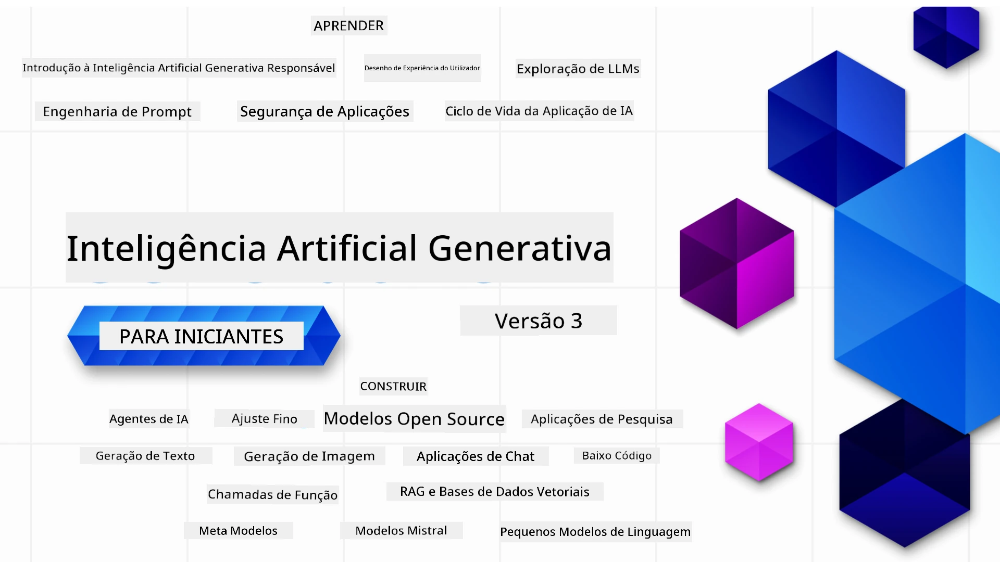

### 21 Lições que ensinam tudo o que precisa de saber para começar a construir aplicações de IA Generativa

[](https://github.com/microsoft/Generative-AI-For-Beginners/blob/master/LICENSE?WT.mc_id=academic-105485-koreyst)
[](https://GitHub.com/microsoft/Generative-AI-For-Beginners/graphs/contributors/?WT.mc_id=academic-105485-koreyst)
[](https://GitHub.com/microsoft/Generative-AI-For-Beginners/issues/?WT.mc_id=academic-105485-koreyst)
[](https://GitHub.com/microsoft/Generative-AI-For-Beginners/pulls/?WT.mc_id=academic-105485-koreyst)
[](http://makeapullrequest.com?WT.mc_id=academic-105485-koreyst)

[](https://GitHub.com/microsoft/Generative-AI-For-Beginners/watchers/?WT.mc_id=academic-105485-koreyst)
[](https://GitHub.com/microsoft/Generative-AI-For-Beginners/network/?WT.mc_id=academic-105485-koreyst)
[](https://GitHub.com/microsoft/Generative-AI-For-Beginners/stargazers/?WT.mc_id=academic-105485-koreyst)

[](https://discord.gg/nTYy5BXMWG)

### 🌐 Suporte Multilíngue

#### Suportado via GitHub Action (Automatizado e Sempre Atualizado)

<!-- CO-OP TRANSLATOR LANGUAGES TABLE START -->
[Árabe](../ar/README.md) | [Bengali](../bn/README.md) | [Búlgaro](../bg/README.md) | [Birmanês (Myanmar)](../my/README.md) | [Chinês (Simplificado)](../zh-CN/README.md) | [Chinês (Tradicional, Hong Kong)](../zh-HK/README.md) | [Chinês (Tradicional, Macau)](../zh-MO/README.md) | [Chinês (Tradicional, Taiwan)](../zh-TW/README.md) | [Croata](../hr/README.md) | [Checo](../cs/README.md) | [Dinamarquês](../da/README.md) | [Holandês](../nl/README.md) | [Estónio](../et/README.md) | [Finlandês](../fi/README.md) | [Francês](../fr/README.md) | [Alemão](../de/README.md) | [Grego](../el/README.md) | [Hebraico](../he/README.md) | [Hindi](../hi/README.md) | [Húngaro](../hu/README.md) | [Indonésio](../id/README.md) | [Italiano](../it/README.md) | [Japonês](../ja/README.md) | [Kannada](../kn/README.md) | [Khmer](../km/README.md) | [Coreano](../ko/README.md) | [Lituano](../lt/README.md) | [Malaio](../ms/README.md) | [Malaiala](../ml/README.md) | [Marata](../mr/README.md) | [Nepali](../ne/README.md) | [Pidgin Nigeriano](../pcm/README.md) | [Norueguês](../no/README.md) | [Persa (Farsi)](../fa/README.md) | [Polaco](../pl/README.md) | [Português (Brasil)](../pt-BR/README.md) | [Português (Portugal)](./README.md) | [Punjabi (Gurmukhi)](../pa/README.md) | [Romeno](../ro/README.md) | [Russo](../ru/README.md) | [Sérvio (Cirílico)](../sr/README.md) | [Eslovaco](../sk/README.md) | [Esloveno](../sl/README.md) | [Espanhol](../es/README.md) | [Suaíli](../sw/README.md) | [Sueco](../sv/README.md) | [Tagalo (Filipino)](../tl/README.md) | [Tamil](../ta/README.md) | [Telugu](../te/README.md) | [Tailandês](../th/README.md) | [Turco](../tr/README.md) | [Ucraniano](../uk/README.md) | [Urdu](../ur/README.md) | [Vietnamita](../vi/README.md)

> **Prefere Clonar Localmente?**
>
> Este repositório inclui traduções em mais de 50 idiomas, o que aumenta significativamente o tamanho do download. Para clonar sem as traduções, use o checkout esparso:
>
> **Bash / macOS / Linux:**
> ```bash
> git clone --filter=blob:none --sparse https://github.com/microsoft/generative-ai-for-beginners.git
> cd generative-ai-for-beginners
> git sparse-checkout set --no-cone '/*' '!translations' '!translated_images'
> ```
>
> **CMD (Windows):**
> ```cmd
> git clone --filter=blob:none --sparse https://github.com/microsoft/generative-ai-for-beginners.git
> cd generative-ai-for-beginners
> git sparse-checkout set --no-cone "/*" "!translations" "!translated_images"
> ```
>
> Isto dá-lhe tudo o que precisa para completar o curso com um download muito mais rápido.
<!-- CO-OP TRANSLATOR LANGUAGES TABLE END -->

# IA Generativa para Iniciantes (Versão 3) - Um Curso

Aprenda os fundamentos da construção de aplicações de IA Generativa com o nosso curso abrangente de 21 lições pela Microsoft Cloud Advocates.

## 🌱 Começando

Este curso tem 21 lições. Cada lição cobre o seu próprio tópico, por isso comece onde quiser!

As lições são classificadas como lições "Learn" que explicam um conceito de IA Generativa ou lições "Build" que explicam um conceito e exemplos de código em **Python** e **TypeScript**, quando possível.

Para Desenvolvedores .NET consulte [IA Generativa para Iniciantes (Edição .NET)](https://github.com/microsoft/Generative-AI-for-beginners-dotnet?WT.mc_id=academic-105485-koreyst)!

Cada lição inclui também uma secção "Keep Learning" com ferramentas adicionais de aprendizagem.

## O Que Precisa
### Para executar o código deste curso, pode usar:
 - [Azure OpenAI Service](https://aka.ms/genai-beginners/azure-open-ai?WT.mc_id=academic-105485-koreyst) - **Lições:** "aoai-assignment"
 - [GitHub Marketplace Model Catalog](https://aka.ms/genai-beginners/gh-models?WT.mc_id=academic-105485-koreyst) - **Lições:** "githubmodels"
 - [OpenAI API](https://aka.ms/genai-beginners/open-ai?WT.mc_id=academic-105485-koreyst) - **Lições:** "oai-assignment" 
   
- Conhecimentos básicos de Python ou TypeScript são úteis - \*Para iniciantes absolutos, veja estes cursos de [Python](https://aka.ms/genai-beginners/python?WT.mc_id=academic-105485-koreyst) e [TypeScript](https://aka.ms/genai-beginners/typescript?WT.mc_id=academic-105485-koreyst)
- Uma conta GitHub para [fazer fork de todo este repositório](https://aka.ms/genai-beginners/github?WT.mc_id=academic-105485-koreyst) para a sua própria conta GitHub

Criámos uma lição **[Configuração do Curso](./00-course-setup/README.md?WT.mc_id=academic-105485-koreyst)** para o ajudar a configurar o seu ambiente de desenvolvimento.

Não se esqueça de [favoritar (🌟) este repositório](https://docs.github.com/en/get-started/exploring-projects-on-github/saving-repositories-with-stars?WT.mc_id=academic-105485-koreyst) para o encontrar mais facilmente depois.

## 🧠 Pronto para Implantar?

Se procura exemplos de código mais avançados, veja a nossa [coleção de Exemplos de Código IA Generativa](https://aka.ms/genai-beg-code?WT.mc_id=academic-105485-koreyst) em **Python** e **TypeScript**.

## 🗣️ Conheça Outros Estudantes, Obtenha Suporte

Junte-se ao nosso [servidor oficial Discord Azure AI Foundry](https://aka.ms/genai-discord?WT.mc_id=academic-105485-koreyst) para conhecer e fazer networking com outros estudantes deste curso e obter suporte.

Coloque perguntas ou partilhe feedback sobre o produto no nosso [Fórum de Desenvolvedores Azure AI Foundry](https://aka.ms/azureaifoundry/forum) no Github.

## 🚀 A Construir uma Startup?

Visite [Microsoft for Startups](https://www.microsoft.com/startups) para saber como começar a construir com créditos Azure hoje.

## 🙏 Quer ajudar?

Tem sugestões ou encontrou erros de ortografia ou código? [Abra uma issue](https://github.com/microsoft/generative-ai-for-beginners/issues?WT.mc_id=academic-105485-koreyst) ou [Crie um pull request](https://github.com/microsoft/generative-ai-for-beginners/pulls?WT.mc_id=academic-105485-koreyst)

## 📂 Cada lição inclui:

- Uma breve introdução em vídeo ao tema
- Uma lição escrita localizada no README
- Exemplos de código Python e TypeScript que suportam Azure OpenAI e API OpenAI
- Links para recursos extra para continuar a sua aprendizagem

## 🗃️ Lições

| #   | **Link da Lição**                                                                                                                              | **Descrição**                                                                                 | **Vídeo**                                                                   | **Aprendizagem Extra**                                                         |
| --- | -------------------------------------------------------------------------------------------------------------------------------------------- | --------------------------------------------------------------------------------------------- | --------------------------------------------------------------------------- | ----------------------------------------------------------------------------- |
| 00  | [Configuração do Curso](./00-course-setup/README.md?WT.mc_id=academic-105485-koreyst)                                                          | **Aprender:** Como Configurar o Seu Ambiente de Desenvolvimento                               | Vídeo Em Breve                                                              | [Saiba Mais](https://aka.ms/genai-collection?WT.mc_id=academic-105485-koreyst) |
| 01  | [Introdução à IA Generativa e LLMs](./01-introduction-to-genai/README.md?WT.mc_id=academic-105485-koreyst)                                     | **Aprender:** Compreender o que é IA Generativa e como os Grandes Modelos de Linguagem (LLMs) funcionam. | [Vídeo](https://aka.ms/gen-ai-lesson-1-gh?WT.mc_id=academic-105485-koreyst) | [Saiba Mais](https://aka.ms/genai-collection?WT.mc_id=academic-105485-koreyst) |
| 02  | [Explorar e comparar diferentes LLMs](./02-exploring-and-comparing-different-llms/README.md?WT.mc_id=academic-105485-koreyst)                   | **Aprender:** Como selecionar o modelo certo para o seu caso de uso                           | [Vídeo](https://aka.ms/gen-ai-lesson2-gh?WT.mc_id=academic-105485-koreyst)  | [Saiba Mais](https://aka.ms/genai-collection?WT.mc_id=academic-105485-koreyst) |
| 03  | [Usar IA Generativa de Forma Responsável](./03-using-generative-ai-responsibly/README.md?WT.mc_id=academic-105485-koreyst)                      | **Aprender:** Como construir Aplicações de IA Generativa de forma responsável                | [Vídeo](https://aka.ms/gen-ai-lesson3-gh?WT.mc_id=academic-105485-koreyst)  | [Saiba Mais](https://aka.ms/genai-collection?WT.mc_id=academic-105485-koreyst) |
| 04  | [Compreender os Fundamentos da Engenharia de Prompts](./04-prompt-engineering-fundamentals/README.md?WT.mc_id=academic-105485-koreyst)       | **Aprenda:** Melhores Práticas de Engenharia de Prompts na prática                              | [Vídeo](https://aka.ms/gen-ai-lesson4-gh?WT.mc_id=academic-105485-koreyst) | [Saber Mais](https://aka.ms/genai-collection?WT.mc_id=academic-105485-koreyst) |
| 05  | [Criar Prompts Avançados](./05-advanced-prompts/README.md?WT.mc_id=academic-105485-koreyst)                                                    | **Aprenda:** Como aplicar técnicas de engenharia de prompts que melhoram o resultado dos seus prompts. | [Vídeo](https://aka.ms/gen-ai-lesson5-gh?WT.mc_id=academic-105485-koreyst) | [Saber Mais](https://aka.ms/genai-collection?WT.mc_id=academic-105485-koreyst) |
| 06  | [Construir Aplicações de Geração de Texto](./06-text-generation-apps/README.md?WT.mc_id=academic-105485-koreyst)                              | **Construa:** Uma aplicação de geração de texto usando Azure OpenAI / OpenAI API                | [Vídeo](https://aka.ms/gen-ai-lesson6-gh?WT.mc_id=academic-105485-koreyst) | [Saber Mais](https://aka.ms/genai-collection?WT.mc_id=academic-105485-koreyst) |
| 07  | [Construir Aplicações de Chat](./07-building-chat-applications/README.md?WT.mc_id=academic-105485-koreyst)                                    | **Construa:** Técnicas para construir e integrar eficazmente aplicações de chat.               | [Vídeo](https://aka.ms/gen-ai-lessons7-gh?WT.mc_id=academic-105485-koreyst) | [Saber Mais](https://aka.ms/genai-collection?WT.mc_id=academic-105485-koreyst) |
| 08  | [Construir Aplicações de Pesquisa com Bases de Dados Vetoriais](./08-building-search-applications/README.md?WT.mc_id=academic-105485-koreyst)  | **Construa:** Uma aplicação de pesquisa que utiliza Embeddings para procurar dados.            | [Vídeo](https://aka.ms/gen-ai-lesson8-gh?WT.mc_id=academic-105485-koreyst) | [Saber Mais](https://aka.ms/genai-collection?WT.mc_id=academic-105485-koreyst) |
| 09  | [Construir Aplicações de Geração de Imagens](./09-building-image-applications/README.md?WT.mc_id=academic-105485-koreyst)                      | **Construa:** Uma aplicação de geração de imagens                                               | [Vídeo](https://aka.ms/gen-ai-lesson9-gh?WT.mc_id=academic-105485-koreyst) | [Saber Mais](https://aka.ms/genai-collection?WT.mc_id=academic-105485-koreyst) |
| 10  | [Construir Aplicações IA Low Code](./10-building-low-code-ai-applications/README.md?WT.mc_id=academic-105485-koreyst)                          | **Construa:** Uma aplicação de AI Generativa usando ferramentas Low Code                        | [Vídeo](https://aka.ms/gen-ai-lesson10-gh?WT.mc_id=academic-105485-koreyst) | [Saber Mais](https://aka.ms/genai-collection?WT.mc_id=academic-105485-koreyst) |
| 11  | [Integrar Aplicações Externas com Function Calling](./11-integrating-with-function-calling/README.md?WT.mc_id=academic-105485-koreyst)          | **Construa:** O que é function calling e os seus casos de uso para aplicações                  | [Vídeo](https://aka.ms/gen-ai-lesson11-gh?WT.mc_id=academic-105485-koreyst) | [Saber Mais](https://aka.ms/genai-collection?WT.mc_id=academic-105485-koreyst) |
| 12  | [Design de UX para Aplicações de IA](./12-designing-ux-for-ai-applications/README.md?WT.mc_id=academic-105485-koreyst)                          | **Aprenda:** Como aplicar princípios de design UX ao desenvolver Aplicações de AI Generativa   | [Vídeo](https://aka.ms/gen-ai-lesson12-gh?WT.mc_id=academic-105485-koreyst) | [Saber Mais](https://aka.ms/genai-collection?WT.mc_id=academic-105485-koreyst) |
| 13  | [Segurança das Suas Aplicações de IA Generativa](./13-securing-ai-applications/README.md?WT.mc_id=academic-105485-koreyst)                      | **Aprenda:** As ameaças e riscos para sistemas de IA e métodos para garantir a segurança desses sistemas. | [Vídeo](https://aka.ms/gen-ai-lesson13-gh?WT.mc_id=academic-105485-koreyst) | [Saber Mais](https://aka.ms/genai-collection?WT.mc_id=academic-105485-koreyst) |
| 14  | [O Ciclo de Vida da Aplicação de IA Generativa](./14-the-generative-ai-application-lifecycle/README.md?WT.mc_id=academic-105485-koreyst)        | **Aprenda:** As ferramentas e métricas para gerir o Ciclo de Vida LLM e LLMOps                  | [Vídeo](https://aka.ms/gen-ai-lesson14-gh?WT.mc_id=academic-105485-koreyst) | [Saber Mais](https://aka.ms/genai-collection?WT.mc_id=academic-105485-koreyst) |
| 15  | [Retrieval Augmented Generation (RAG) e Bases de Dados Vetoriais](./15-rag-and-vector-databases/README.md?WT.mc_id=academic-105485-koreyst)      | **Construa:** Uma aplicação usando um Framework RAG para recuperar embeddings de Bases de Dados Vetoriais | [Vídeo](https://aka.ms/gen-ai-lesson15-gh?WT.mc_id=academic-105485-koreyst) | [Saber Mais](https://aka.ms/genai-collection?WT.mc_id=academic-105485-koreyst) |
| 16  | [Modelos Open Source e Hugging Face](./16-open-source-models/README.md?WT.mc_id=academic-105485-koreyst)                                        | **Construa:** Uma aplicação usando modelos open source disponíveis no Hugging Face             | [Vídeo](https://aka.ms/gen-ai-lesson16-gh?WT.mc_id=academic-105485-koreyst) | [Saber Mais](https://aka.ms/genai-collection?WT.mc_id=academic-105485-koreyst) |
| 17  | [Agentes de IA](./17-ai-agents/README.md?WT.mc_id=academic-105485-koreyst)                                                                     | **Construa:** Uma aplicação usando o Framework de Agentes de IA                                | [Vídeo](https://aka.ms/gen-ai-lesson17-gh?WT.mc_id=academic-105485-koreyst) | [Saber Mais](https://aka.ms/genai-collection?WT.mc_id=academic-105485-koreyst) |
| 18  | [Ajuste Fino de LLMs](./18-fine-tuning/README.md?WT.mc_id=academic-105485-koreyst)                                                            | **Aprenda:** O que, porquê e como fazer fine-tuning de LLMs                                   | [Vídeo](https://aka.ms/gen-ai-lesson18-gh?WT.mc_id=academic-105485-koreyst) | [Saber Mais](https://aka.ms/genai-collection?WT.mc_id=academic-105485-koreyst) |
| 19  | [Construir com SLMs](./19-slm/README.md?WT.mc_id=academic-105485-koreyst)                                                                      | **Aprenda:** Os benefícios de construir com Small Language Models                              | Vídeo Em Breve | [Saber Mais](https://aka.ms/genai-collection?WT.mc_id=academic-105485-koreyst) |
| 20  | [Construir com Modelos Mistral](./20-mistral/README.md?WT.mc_id=academic-105485-koreyst)                                                       | **Aprenda:** As características e diferenças dos Modelos da Família Mistral                   | Vídeo Em Breve | [Saber Mais](https://aka.ms/genai-collection?WT.mc_id=academic-105485-koreyst) |
| 21  | [Construir com Modelos Meta](./21-meta/README.md?WT.mc_id=academic-105485-koreyst)                                                             | **Aprenda:** As características e diferenças dos Modelos da Família Meta                      | Vídeo Em Breve | [Saber Mais](https://aka.ms/genai-collection?WT.mc_id=academic-105485-koreyst) |

### 🌟 Agradecimentos especiais

Agradecimentos especiais a [**John Aziz**](https://www.linkedin.com/in/john0isaac/) por criar todas as GitHub Actions e workflows

[**Bernhard Merkle**](https://www.linkedin.com/in/bernhard-merkle-738b73/) por contribuir significativamente em cada lição para melhorar a experiência do aprendiz e do código.

## 🎒 Outros Cursos

A nossa equipa produz outros cursos! Veja:

<!-- CO-OP TRANSLATOR OTHER COURSES START -->
### LangChain
[](https://aka.ms/langchain4j-for-beginners)
[](https://aka.ms/langchainjs-for-beginners?WT.mc_id=m365-94501-dwahlin)
[](https://github.com/microsoft/langchain-for-beginners?WT.mc_id=m365-94501-dwahlin)
---

### Azure / Edge / MCP / Agentes
[](https://github.com/microsoft/AZD-for-beginners?WT.mc_id=academic-105485-koreyst)
[](https://github.com/microsoft/edgeai-for-beginners?WT.mc_id=academic-105485-koreyst)
[](https://github.com/microsoft/mcp-for-beginners?WT.mc_id=academic-105485-koreyst)
[](https://github.com/microsoft/ai-agents-for-beginners?WT.mc_id=academic-105485-koreyst)

---
 
### Série de IA Generativa
[](https://github.com/microsoft/generative-ai-for-beginners?WT.mc_id=academic-105485-koreyst)
[-9333EA?style=for-the-badge&labelColor=E5E7EB&color=9333EA)](https://github.com/microsoft/Generative-AI-for-beginners-dotnet?WT.mc_id=academic-105485-koreyst)
[-C084FC?style=for-the-badge&labelColor=E5E7EB&color=C084FC)](https://github.com/microsoft/generative-ai-for-beginners-java?WT.mc_id=academic-105485-koreyst)
[-E879F9?style=for-the-badge&labelColor=E5E7EB&color=E879F9)](https://github.com/microsoft/generative-ai-with-javascript?WT.mc_id=academic-105485-koreyst)

---
 
### Aprendizagem Principal
[](https://aka.ms/ml-beginners?WT.mc_id=academic-105485-koreyst)
[](https://aka.ms/datascience-beginners?WT.mc_id=academic-105485-koreyst)
[](https://aka.ms/ai-beginners?WT.mc_id=academic-105485-koreyst)
[](https://github.com/microsoft/Security-101?WT.mc_id=academic-96948-sayoung)
[](https://aka.ms/webdev-beginners?WT.mc_id=academic-105485-koreyst)
[](https://aka.ms/iot-beginners?WT.mc_id=academic-105485-koreyst)
[](https://github.com/microsoft/xr-development-for-beginners?WT.mc_id=academic-105485-koreyst)

---
 
### Série Copilot
[](https://aka.ms/GitHubCopilotAI?WT.mc_id=academic-105485-koreyst)
[](https://github.com/microsoft/mastering-github-copilot-for-dotnet-csharp-developers?WT.mc_id=academic-105485-koreyst)
[](https://github.com/microsoft/CopilotAdventures?WT.mc_id=academic-105485-koreyst)
<!-- CO-OP TRANSLATOR OTHER COURSES END -->

## Obter Ajuda

Se ficar preso ou tiver alguma dúvida sobre como construir apps de IA. Junte-se a outros aprendizes e desenvolvedores experientes em discussões sobre MCP. É uma comunidade de apoio onde as perguntas são bem-vindas e o conhecimento é partilhado livremente.

[](https://discord.gg/nTYy5BXMWG)

Se tiver feedback sobre o produto ou erros durante a construção, visite:

[](https://aka.ms/foundry/forum)

---

<!-- CO-OP TRANSLATOR DISCLAIMER START -->
**Aviso Legal**:
Este documento foi traduzido utilizando o serviço de tradução por IA [Co-op Translator](https://github.com/Azure/co-op-translator). Embora nos esforcemos por garantir a precisão, tenha em atenção que traduções automáticas podem conter erros ou imprecisões. O documento original na sua língua nativa deve ser considerado a fonte oficial. Para informação crítica, recomenda-se a tradução profissional por humanos. Não nos responsabilizamos por quaisquer mal-entendidos ou interpretações incorretas decorrentes do uso desta tradução.
<!-- CO-OP TRANSLATOR DISCLAIMER END -->