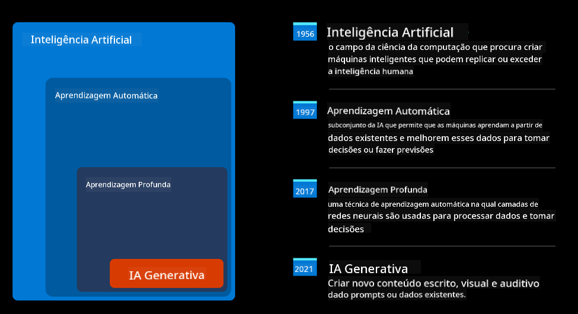
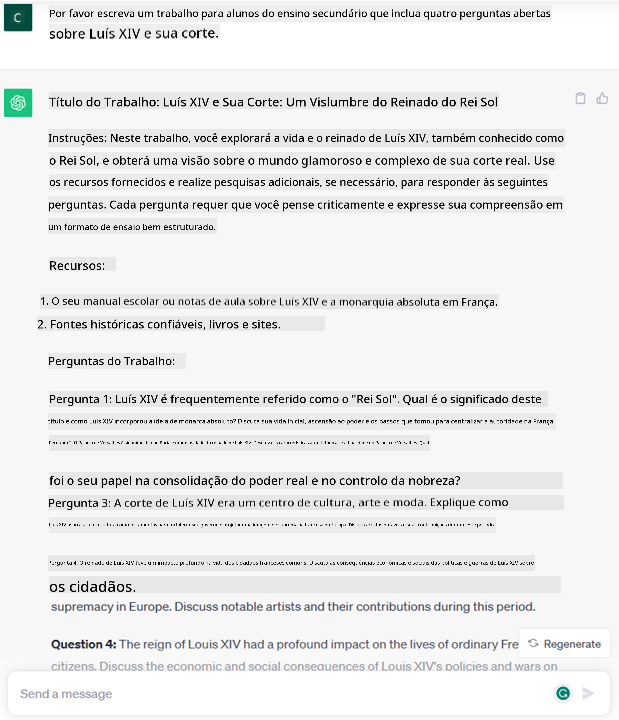
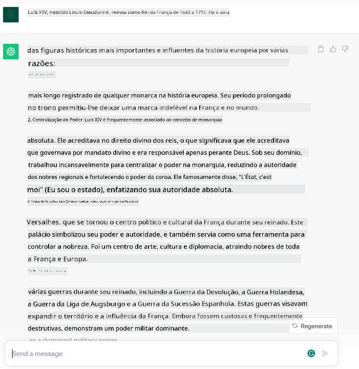
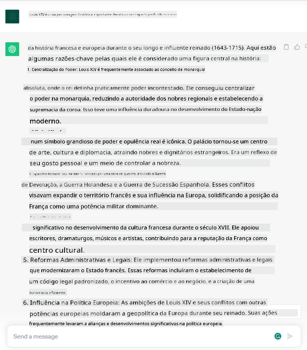
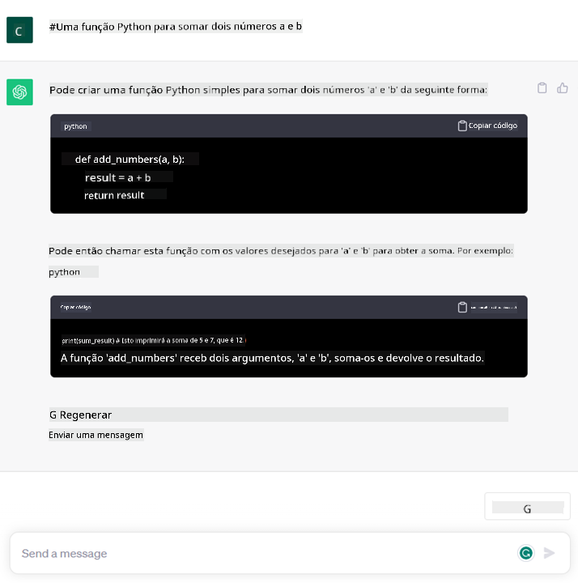

<!--
CO_OP_TRANSLATOR_METADATA:
{
  "original_hash": "f53ba0fa49164f9323043f1c6b11f2b1",
  "translation_date": "2025-05-19T13:12:00+00:00",
  "source_file": "01-introduction-to-genai/README.md",
  "language_code": "pt"
}
-->
# Introdução à IA Generativa e Modelos de Linguagem de Grande Porte

_(Clique na imagem acima para assistir ao vídeo desta lição)_

IA generativa é uma inteligência artificial capaz de gerar texto, imagens e outros tipos de conteúdo. O que a torna uma tecnologia fantástica é que democratiza a IA, qualquer pessoa pode usá-la com apenas um prompt de texto, uma frase escrita em linguagem natural. Não é necessário aprender uma linguagem como Java ou SQL para realizar algo valioso, basta usar sua língua, declarar o que deseja e obter uma sugestão de um modelo de IA. As aplicações e o impacto disso são enormes, você escreve ou entende relatórios, cria aplicativos e muito mais, tudo em segundos.

Neste currículo, exploraremos como nossa startup utiliza IA generativa para desbloquear novos cenários no mundo educacional e como enfrentamos os desafios inevitáveis associados às implicações sociais de sua aplicação e às limitações tecnológicas.

## Introdução

Esta lição abordará:

- Introdução ao cenário de negócios: nossa ideia de startup e missão.
- IA generativa e como chegamos ao panorama tecnológico atual.
- Funcionamento interno de um modelo de linguagem de grande porte.
- Principais capacidades e casos de uso práticos de Modelos de Linguagem de Grande Porte.

## Objetivos de Aprendizagem

Após completar esta lição, você entenderá:

- O que é IA generativa e como funcionam os Modelos de Linguagem de Grande Porte.
- Como você pode utilizar modelos de linguagem de grande porte para diferentes casos de uso, com foco em cenários educacionais.

## Cenário: nossa startup educacional

Inteligência Artificial (IA) Generativa representa o auge da tecnologia de IA, ultrapassando os limites do que antes se pensava impossível. Os modelos de IA generativa têm várias capacidades e aplicações, mas para este currículo exploraremos como ela está revolucionando a educação através de uma startup fictícia. Nos referiremos a essa startup como _nossa startup_. Nossa startup atua no domínio educacional com a ambiciosa missão de

> _melhorar a acessibilidade na aprendizagem, em escala global, garantindo acesso equitativo à educação e proporcionando experiências de aprendizagem personalizadas para cada aluno, de acordo com suas necessidades_.

Nossa equipe de startup está ciente de que não conseguiremos alcançar esse objetivo sem aproveitar uma das ferramentas mais poderosas dos tempos modernos – Modelos de Linguagem de Grande Porte (LLMs).

Espera-se que a IA generativa revolucione a maneira como aprendemos e ensinamos hoje, com alunos tendo à sua disposição professores virtuais 24 horas por dia, que fornecem grandes quantidades de informações e exemplos, e professores capazes de utilizar ferramentas inovadoras para avaliar seus alunos e dar feedback.

Para começar, vamos definir alguns conceitos básicos e terminologia que usaremos ao longo do currículo.

## Como conseguimos a IA Generativa?

Apesar do extraordinário _hype_ criado recentemente pelo anúncio de modelos de IA generativa, essa tecnologia está em desenvolvimento há décadas, com os primeiros esforços de pesquisa datando dos anos 60. Estamos agora em um ponto em que a IA tem capacidades cognitivas humanas, como conversa, como mostrado, por exemplo, pelo [OpenAI ChatGPT](https://openai.com/chatgpt) ou [Bing Chat](https://www.microsoft.com/edge/features/bing-chat?WT.mc_id=academic-105485-koreyst), que também usa um modelo GPT para as conversas de pesquisa na web Bing.

Voltando um pouco, os primeiros protótipos de IA consistiam em chatbots digitados, baseados em uma base de conhecimento extraída de um grupo de especialistas e representada em um computador. As respostas na base de conhecimento eram acionadas por palavras-chave que apareciam no texto de entrada. No entanto, logo ficou claro que essa abordagem, usando chatbots digitados, não escalava bem.

### Uma abordagem estatística para IA: Aprendizado de Máquina

Um ponto de virada chegou durante os anos 90, com a aplicação de uma abordagem estatística à análise de texto. Isso levou ao desenvolvimento de novos algoritmos – conhecidos como aprendizado de máquina – capazes de aprender padrões a partir de dados sem serem programados explicitamente. Essa abordagem permite que máquinas simulem a compreensão da linguagem humana: um modelo estatístico é treinado em pares de texto e rótulo, permitindo que o modelo classifique texto de entrada desconhecido com um rótulo pré-definido que representa a intenção da mensagem.

### Redes neurais e assistentes virtuais modernos

Nos últimos anos, a evolução tecnológica do hardware, capaz de lidar com grandes quantidades de dados e cálculos mais complexos, incentivou a pesquisa em IA, levando ao desenvolvimento de algoritmos avançados de aprendizado de máquina conhecidos como redes neurais ou algoritmos de aprendizado profundo.

Redes neurais (e em particular Redes Neurais Recorrentes – RNNs) melhoraram significativamente o processamento de linguagem natural, permitindo a representação do significado do texto de uma maneira mais significativa, valorizando o contexto de uma palavra em uma frase.

Essa é a tecnologia que alimentou os assistentes virtuais nascidos na primeira década do novo século, muito proficientes em interpretar a linguagem humana, identificar uma necessidade e realizar uma ação para satisfazê-la – como responder com um script pré-definido ou consumir um serviço de terceiros.

### Presente, IA Generativa

Assim chegamos à IA Generativa hoje, que pode ser vista como um subconjunto do aprendizado profundo.

Após décadas de pesquisa no campo da IA, uma nova arquitetura de modelo – chamada _Transformer_ – superou os limites das RNNs, sendo capaz de receber sequências de texto muito mais longas como entrada. Transformers são baseados no mecanismo de atenção, permitindo que o modelo dê diferentes pesos às entradas que recebe, 'prestando mais atenção' onde as informações mais relevantes estão concentradas, independentemente de sua ordem na sequência de texto.

A maioria dos modelos recentes de IA generativa – também conhecidos como Modelos de Linguagem de Grande Porte (LLMs), uma vez que trabalham com entradas e saídas textuais – são de fato baseados nesta arquitetura. O que é interessante sobre esses modelos – treinados em uma enorme quantidade de dados não rotulados de fontes diversas como livros, artigos e sites – é que eles podem ser adaptados a uma ampla variedade de tarefas e gerar texto gramaticalmente correto com uma aparência de criatividade. Então, não apenas melhoraram incrivelmente a capacidade de uma máquina de 'entender' um texto de entrada, mas também habilitaram sua capacidade de gerar uma resposta original em linguagem humana.

## Como funcionam os modelos de linguagem de grande porte?

No próximo capítulo, vamos explorar diferentes tipos de modelos de IA generativa, mas por enquanto vamos dar uma olhada em como funcionam os modelos de linguagem de grande porte, com foco nos modelos GPT (Generative Pre-trained Transformer) da OpenAI.

- **Tokenizer, texto para números**: Modelos de Linguagem de Grande Porte recebem um texto como entrada e geram um texto como saída. No entanto, sendo modelos estatísticos, eles trabalham muito melhor com números do que sequências de texto. É por isso que cada entrada no modelo é processada por um tokenizer, antes de ser usada pelo modelo principal. Um token é um pedaço de texto – consistindo em um número variável de caracteres, então a principal tarefa do tokenizer é dividir a entrada em um array de tokens. Em seguida, cada token é mapeado com um índice de token, que é a codificação inteira do pedaço de texto original.

- **Predição de tokens de saída**: Dado n tokens como entrada (com max n variando de um modelo para outro), o modelo é capaz de prever um token como saída. Este token é então incorporado na entrada da próxima iteração, em um padrão de janela expansiva, permitindo uma melhor experiência do usuário ao receber uma (ou várias) frases como resposta. Isso explica por que, se você já brincou com o ChatGPT, pode ter notado que às vezes parece que ele para no meio de uma frase.

- **Processo de seleção, distribuição de probabilidade**: O token de saída é escolhido pelo modelo de acordo com sua probabilidade de ocorrer após a sequência de texto atual. Isso ocorre porque o modelo prevê uma distribuição de probabilidade sobre todos os possíveis 'próximos tokens', calculada com base em seu treinamento. No entanto, nem sempre o token com a maior probabilidade é escolhido na distribuição resultante. Um grau de aleatoriedade é adicionado a essa escolha, de forma que o modelo aja de maneira não determinística - não obtemos a mesma saída exata para a mesma entrada. Esse grau de aleatoriedade é adicionado para simular o processo de pensamento criativo e pode ser ajustado usando um parâmetro de modelo chamado temperatura.

## Como nossa startup pode utilizar Modelos de Linguagem de Grande Porte?

Agora que temos uma melhor compreensão do funcionamento interno de um modelo de linguagem de grande porte, vamos ver alguns exemplos práticos das tarefas mais comuns que eles podem realizar muito bem, com um olhar para nosso cenário de negócios. Dissemos que a principal capacidade de um Modelo de Linguagem de Grande Porte é _gerar um texto do zero, a partir de uma entrada textual, escrita em linguagem natural_.

Mas que tipo de entrada e saída textual?
A entrada de um modelo de linguagem de grande porte é conhecida como prompt, enquanto a saída é conhecida como completion, termo que se refere ao mecanismo do modelo de gerar o próximo token para completar a entrada atual. Vamos nos aprofundar no que é um prompt e como projetá-lo de forma a obter o máximo do nosso modelo. Mas por enquanto, vamos apenas dizer que um prompt pode incluir:

- Uma **instrução** especificando o tipo de saída que esperamos do modelo. Esta instrução às vezes pode incorporar alguns exemplos ou alguns dados adicionais.

  1. Resumo de um artigo, livro, avaliações de produtos e mais, junto com extração de insights de dados não estruturados.
    
    
  
  2. Ideação criativa e design de um artigo, ensaio, tarefa ou mais.
      
     

- Uma **pergunta**, feita na forma de uma conversa com um agente.
  
  

- Um pedaço de **texto para completar**, que implicitamente é um pedido de assistência de escrita.
  
  

- Um pedaço de **código** juntamente com o pedido de explicá-lo e documentá-lo, ou um comentário pedindo para gerar um trecho de código que execute uma tarefa específica.
  
  

Os exemplos acima são bastante simples e não têm a intenção de ser uma demonstração exaustiva das capacidades dos Modelos de Linguagem de Grande Porte. Eles são destinados a mostrar o potencial de usar IA generativa, em particular mas não limitado a contextos educacionais.

Além disso, a saída de um modelo de IA generativa não é perfeita e às vezes a criatividade do modelo pode trabalhar contra ele, resultando em uma saída que é uma combinação de palavras que o usuário humano pode interpretar como uma mistificação da realidade, ou pode ser ofensiva. IA generativa não é inteligente - pelo menos na definição mais abrangente de inteligência, incluindo raciocínio crítico e criativo ou inteligência emocional; não é determinística, e não é confiável, já que fabricações, como referências errôneas, conteúdo e declarações, podem ser combinadas com informações corretas e apresentadas de maneira persuasiva e confiante. Nas próximas lições, lidaremos com todas essas limitações e veremos o que podemos fazer para mitigá-las.

## Tarefa

Sua tarefa é ler mais sobre [IA generativa](https://en.wikipedia.org/wiki/Generative_artificial_intelligence?WT.mc_id=academic-105485-koreyst) e tentar identificar uma área onde você adicionaria IA generativa hoje que não a possui. Como o impacto seria diferente de fazer isso da "maneira antiga", você pode fazer algo que não podia antes, ou é mais rápido? Escreva um resumo de 300 palavras sobre como seria sua startup de IA dos sonhos e inclua cabeçalhos como "Problema", "Como eu usaria IA", "Impacto" e opcionalmente um plano de negócios.

Se você fez esta tarefa, pode até estar pronto para se candidatar ao incubador da Microsoft, [Microsoft for Startups Founders Hub](https://www.microsoft.com/startups?WT.mc_id=academic-105485-koreyst) oferecemos créditos para Azure, OpenAI, mentoria e muito mais, confira!

## Verificação de Conhecimento

O que é verdade sobre modelos de linguagem de grande porte?

1. Você recebe a mesma resposta exata toda vez.
2. Faz as coisas perfeitamente, ótimo em adicionar números, produzir código funcional etc.
3. A resposta pode variar apesar de usar o mesmo prompt. Também é ótimo para lhe dar um primeiro rascunho de algo, seja texto ou código. Mas você precisa melhorar os resultados.

A: 3, um LLM é não determinístico, a resposta varia, no entanto, você pode controlar sua variância por meio de uma configuração de temperatura. Você também não deve esperar que ele faça as coisas perfeitamente, ele está aqui para fazer o trabalho pesado para você, o que muitas vezes significa que você obtém uma boa primeira tentativa de algo que precisa melhorar gradualmente.

## Ótimo Trabalho! Continue a Jornada

Após completar esta lição, confira nossa [coleção de aprendizado de IA Generativa](https://aka.ms/genai-collection?WT.mc_id=academic-105485-koreyst) para continuar aprimorando seu conhecimento sobre IA Generativa!

Dirija-se à Lição 2, onde vamos explorar e comparar diferentes tipos de LLMs!

**Aviso Legal**:  
Este documento foi traduzido usando o serviço de tradução por IA [Co-op Translator](https://github.com/Azure/co-op-translator). Embora nos esforcemos para garantir a precisão, esteja ciente de que traduções automáticas podem conter erros ou imprecisões. O documento original em seu idioma nativo deve ser considerado a fonte autorizada. Para informações críticas, recomenda-se a tradução humana profissional. Não nos responsabilizamos por quaisquer mal-entendidos ou interpretações errôneas decorrentes do uso desta tradução.