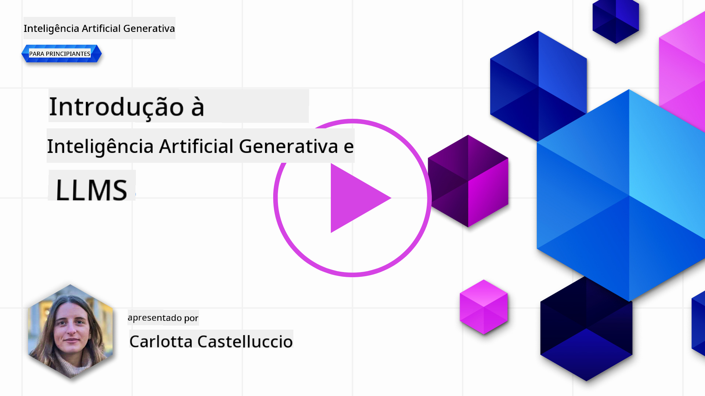
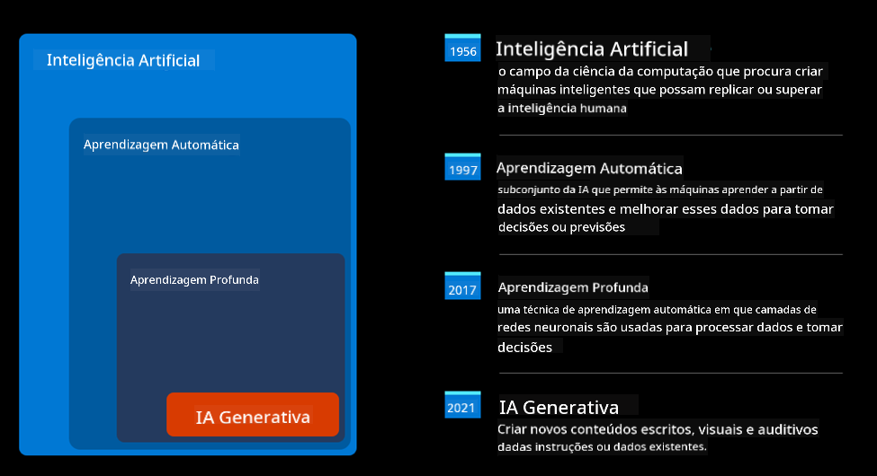
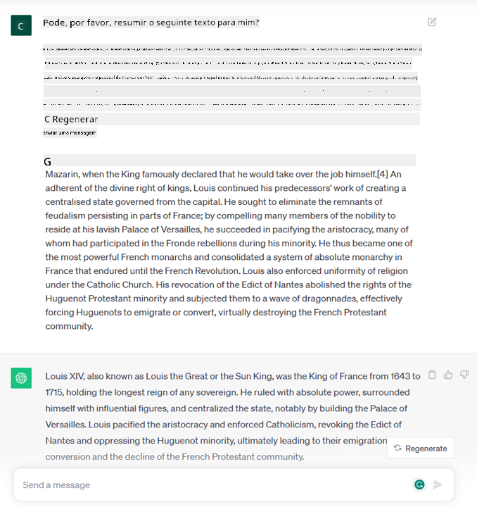
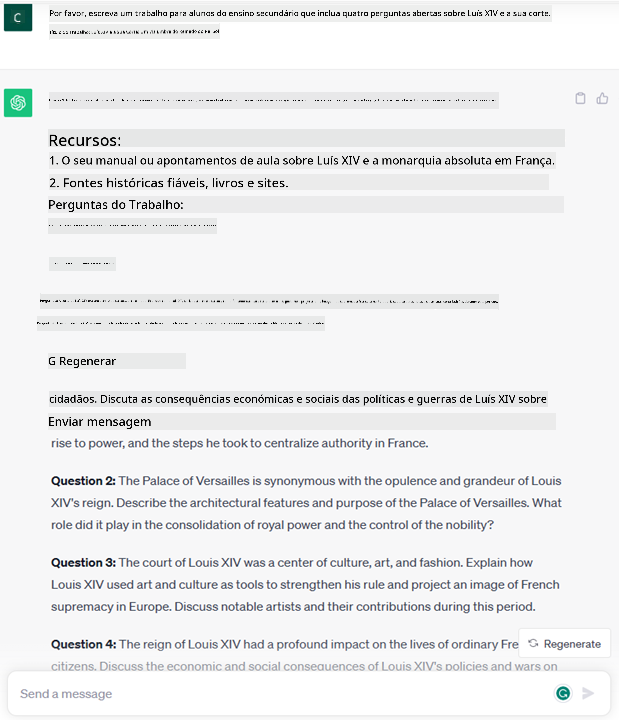
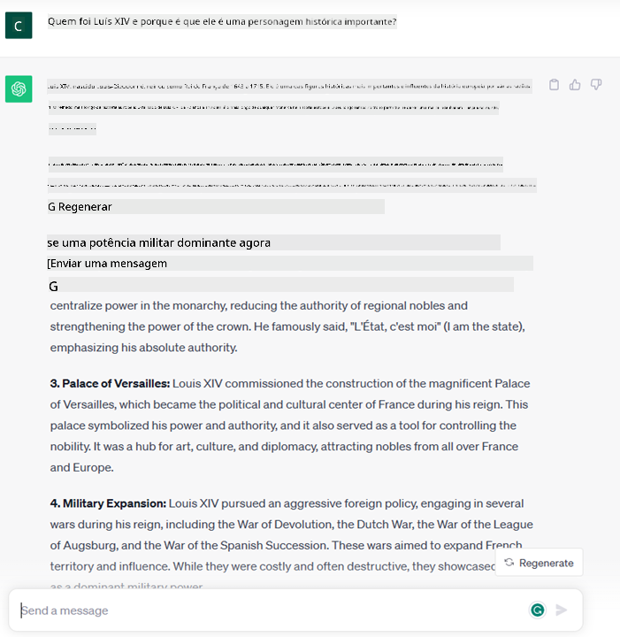
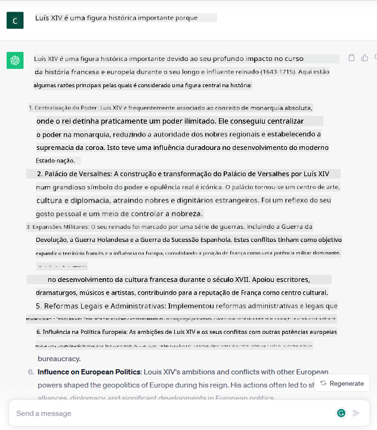

<!--
CO_OP_TRANSLATOR_METADATA:
{
  "original_hash": "f53ba0fa49164f9323043f1c6b11f2b1",
  "translation_date": "2025-07-09T07:50:28+00:00",
  "source_file": "01-introduction-to-genai/README.md",
  "language_code": "pt"
}
-->
# Introdução à IA Generativa e Grandes Modelos de Linguagem

_(Clique na imagem acima para ver o vídeo desta aula)_

A IA generativa é uma inteligência artificial capaz de gerar texto, imagens e outros tipos de conteúdo. O que a torna uma tecnologia fantástica é que democratiza a IA, qualquer pessoa pode usá-la com apenas um prompt de texto, uma frase escrita numa linguagem natural. Não é necessário aprender linguagens como Java ou SQL para realizar algo útil, basta usar a sua linguagem, dizer o que quer e surge uma sugestão de um modelo de IA. As aplicações e o impacto disto são enormes: pode escrever ou compreender relatórios, criar aplicações e muito mais, tudo em segundos.

Neste currículo, vamos explorar como a nossa startup utiliza a IA generativa para desbloquear novos cenários no mundo da educação e como enfrentamos os desafios inevitáveis associados às implicações sociais da sua aplicação e às limitações tecnológicas.

## Introdução

Esta aula irá abordar:

- Introdução ao cenário de negócio: a ideia e missão da nossa startup.
- IA generativa e como chegámos ao panorama tecnológico atual.
- Funcionamento interno de um grande modelo de linguagem.
- Principais capacidades e casos práticos de utilização dos Grandes Modelos de Linguagem.

## Objetivos de Aprendizagem

Após completar esta aula, irá compreender:

- O que é a IA generativa e como funcionam os Grandes Modelos de Linguagem.
- Como pode aproveitar os grandes modelos de linguagem para diferentes casos de uso, com foco em cenários educativos.

## Cenário: a nossa startup educativa

A Inteligência Artificial Generativa representa o auge da tecnologia de IA, ultrapassando os limites do que antes se considerava impossível. Os modelos de IA generativa têm várias capacidades e aplicações, mas neste currículo vamos explorar como estão a revolucionar a educação através de uma startup fictícia. Vamos chamar a esta startup _a nossa startup_. A nossa startup atua no domínio da educação com a ambiciosa missão de

> _melhorar a acessibilidade na aprendizagem, a nível global, garantindo acesso equitativo à educação e proporcionando experiências de aprendizagem personalizadas a cada aluno, de acordo com as suas necessidades_.

A equipa da nossa startup sabe que não conseguiremos alcançar este objetivo sem tirar partido de uma das ferramentas mais poderosas dos tempos modernos – os Grandes Modelos de Linguagem (LLMs).

Espera-se que a IA generativa revolucione a forma como aprendemos e ensinamos hoje, com estudantes a terem ao seu dispor professores virtuais 24 horas por dia que fornecem vastas quantidades de informação e exemplos, e professores capazes de usar ferramentas inovadoras para avaliar os seus alunos e dar feedback.

Para começar, vamos definir alguns conceitos básicos e terminologia que iremos usar ao longo do currículo.

## Como chegámos à IA Generativa?

Apesar do extraordinário _hype_ criado recentemente pelo anúncio dos modelos de IA generativa, esta tecnologia tem décadas de desenvolvimento, com os primeiros esforços de investigação a remontar aos anos 60. Estamos agora num ponto em que a IA possui capacidades cognitivas humanas, como a conversação, demonstrado por exemplo pelo [OpenAI ChatGPT](https://openai.com/chatgpt) ou [Bing Chat](https://www.microsoft.com/edge/features/bing-chat?WT.mc_id=academic-105485-koreyst), que também usa um modelo GPT para as conversas de pesquisa web do Bing.

Recapitulando, os primeiros protótipos de IA consistiam em chatbots baseados em texto, que dependiam de uma base de conhecimento extraída de um grupo de especialistas e representada num computador. As respostas na base de conhecimento eram acionadas por palavras-chave presentes no texto de entrada.  
No entanto, rapidamente se percebeu que esta abordagem, usando chatbots baseados em texto, não escalava bem.

### Uma abordagem estatística à IA: Aprendizagem Automática

Um ponto de viragem ocorreu durante os anos 90, com a aplicação de uma abordagem estatística à análise de texto. Isto levou ao desenvolvimento de novos algoritmos – conhecidos como aprendizagem automática – capazes de aprender padrões a partir dos dados sem serem explicitamente programados. Esta abordagem permite que as máquinas simulem a compreensão da linguagem humana: um modelo estatístico é treinado com pares texto-etiqueta, permitindo ao modelo classificar texto desconhecido com uma etiqueta pré-definida que representa a intenção da mensagem.

### Redes neurais e assistentes virtuais modernos

Nos últimos anos, a evolução tecnológica do hardware, capaz de lidar com maiores quantidades de dados e cálculos mais complexos, incentivou a investigação em IA, levando ao desenvolvimento de algoritmos avançados de aprendizagem automática conhecidos como redes neurais ou algoritmos de deep learning.

As redes neurais (e em particular as Redes Neurais Recorrentes – RNNs) melhoraram significativamente o processamento de linguagem natural, permitindo representar o significado do texto de forma mais significativa, valorizando o contexto de uma palavra numa frase.

Esta é a tecnologia que alimentou os assistentes virtuais nascidos na primeira década do novo século, muito proficientes em interpretar a linguagem humana, identificar uma necessidade e executar uma ação para a satisfazer – como responder com um script pré-definido ou consumir um serviço de terceiros.

### Atualmente, IA Generativa

Foi assim que chegámos à IA Generativa de hoje, que pode ser vista como um subconjunto do deep learning.

Após décadas de investigação na área da IA, uma nova arquitetura de modelo – chamada _Transformer_ – superou os limites das RNNs, sendo capaz de processar sequências de texto muito mais longas como entrada. Os Transformers baseiam-se no mecanismo de atenção, permitindo ao modelo atribuir diferentes pesos às entradas que recebe, ‘prestando mais atenção’ onde a informação mais relevante está concentrada, independentemente da sua ordem na sequência de texto.

A maioria dos modelos recentes de IA generativa – também conhecidos como Grandes Modelos de Linguagem (LLMs), uma vez que trabalham com entradas e saídas textuais – baseiam-se nesta arquitetura. O que é interessante nestes modelos – treinados com uma enorme quantidade de dados não rotulados de fontes diversas como livros, artigos e websites – é que podem ser adaptados a uma grande variedade de tarefas e gerar texto gramaticalmente correto com uma aparência de criatividade. Assim, não só melhoraram incrivelmente a capacidade de uma máquina ‘compreender’ um texto de entrada, como também a sua capacidade de gerar uma resposta original em linguagem humana.

## Como funcionam os grandes modelos de linguagem?

No próximo capítulo vamos explorar diferentes tipos de modelos de IA generativa, mas por agora vamos ver como funcionam os grandes modelos de linguagem, com foco nos modelos OpenAI GPT (Generative Pre-trained Transformer).

- **Tokenizer, texto para números**: Os Grandes Modelos de Linguagem recebem um texto como entrada e geram um texto como saída. No entanto, sendo modelos estatísticos, funcionam muito melhor com números do que com sequências de texto. Por isso, cada entrada para o modelo é processada por um tokenizer, antes de ser usada pelo modelo principal. Um token é um pedaço de texto – composto por um número variável de caracteres, pelo que a principal tarefa do tokenizer é dividir a entrada numa matriz de tokens. Depois, cada token é mapeado com um índice de token, que é a codificação inteira do pedaço de texto original.

- **Previsão dos tokens de saída**: Dado n tokens como entrada (com o máximo n a variar de modelo para modelo), o modelo é capaz de prever um token como saída. Este token é então incorporado na entrada da próxima iteração, num padrão de janela expansiva, permitindo uma melhor experiência ao utilizador ao obter uma (ou várias) frases como resposta. Isto explica porque, se alguma vez brincou com o ChatGPT, pode ter notado que às vezes parece parar no meio de uma frase.

- **Processo de seleção, distribuição de probabilidade**: O token de saída é escolhido pelo modelo de acordo com a sua probabilidade de ocorrer após a sequência de texto atual. Isto porque o modelo prevê uma distribuição de probabilidade sobre todos os possíveis ‘tokens seguintes’, calculada com base no seu treino. No entanto, nem sempre o token com maior probabilidade é escolhido da distribuição resultante. É adicionada uma dose de aleatoriedade a esta escolha, de forma a que o modelo atue de forma não determinística – não obtemos exatamente a mesma saída para a mesma entrada. Esta dose de aleatoriedade é adicionada para simular o processo de pensamento criativo e pode ser ajustada usando um parâmetro do modelo chamado temperatura.

## Como pode a nossa startup tirar partido dos Grandes Modelos de Linguagem?

Agora que temos uma melhor compreensão do funcionamento interno de um grande modelo de linguagem, vamos ver alguns exemplos práticos das tarefas mais comuns que eles conseguem realizar muito bem, com foco no nosso cenário de negócio.  
Dissemos que a principal capacidade de um Grande Modelo de Linguagem é _gerar texto do zero, a partir de uma entrada textual, escrita em linguagem natural_.

Mas que tipo de entrada e saída textual?  
A entrada de um grande modelo de linguagem é conhecida como prompt, enquanto a saída é conhecida como completion, termo que se refere ao mecanismo do modelo de gerar o próximo token para completar a entrada atual. Vamos aprofundar o que é um prompt e como o desenhar para tirar o máximo proveito do nosso modelo. Por agora, basta dizer que um prompt pode incluir:

- Uma **instrução** que especifica o tipo de saída que esperamos do modelo. Esta instrução pode por vezes incluir alguns exemplos ou dados adicionais.

  1. Resumo de um artigo, livro, avaliações de produtos e mais, juntamente com extração de insights a partir de dados não estruturados.
    
    
  
  2. Ideação criativa e elaboração de um artigo, ensaio, trabalho ou mais.
      
     

- Uma **pergunta**, feita na forma de uma conversa com um agente.
  
  

- Um pedaço de **texto para completar**, que implicitamente é um pedido de ajuda na escrita.
  
  

- Um pedaço de **código** juntamente com o pedido de explicação e documentação, ou um comentário a pedir para gerar um código que realize uma tarefa específica.
  
  

Os exemplos acima são bastante simples e não pretendem ser uma demonstração exaustiva das capacidades dos Grandes Modelos de Linguagem. Servem para mostrar o potencial do uso da IA generativa, em particular, mas não exclusivamente, em contextos educativos.

Além disso, a saída de um modelo de IA generativa não é perfeita e por vezes a criatividade do modelo pode jogar contra ele, resultando numa saída que é uma combinação de palavras que o utilizador humano pode interpretar como uma distorção da realidade, ou pode ser ofensiva. A IA generativa não é inteligente – pelo menos na definição mais abrangente de inteligência, que inclui raciocínio crítico e criativo ou inteligência emocional; não é determinística, e não é confiável, pois podem ser combinadas informações fabricadas, como referências erradas, conteúdos e afirmações, com informação correta, apresentadas de forma persuasiva e confiante. Nas próximas aulas, vamos abordar todas estas limitações e ver o que podemos fazer para as mitigar.

## Tarefa

A sua tarefa é pesquisar mais sobre [IA generativa](https://en.wikipedia.org/wiki/Generative_artificial_intelligence?WT.mc_id=academic-105485-koreyst) e tentar identificar uma área onde adicionaria IA generativa hoje que ainda não a tenha. Como seria o impacto diferente de o fazer à “velha maneira”? Pode fazer algo que antes não conseguia, ou é mais rápido? Escreva um resumo de 300 palavras sobre como seria a sua startup de IA ideal e inclua cabeçalhos como "Problema", "Como usaria IA", "Impacto" e, opcionalmente, um plano de negócios.

Se fizer esta tarefa, pode até estar pronto para se candidatar ao incubador da Microsoft, o [Microsoft for Startups Founders Hub](https://www.microsoft.com/startups?WT.mc_id=academic-105485-koreyst) onde oferecemos créditos para Azure, OpenAI, mentoria e muito mais, dê uma vista de olhos!

## Verificação de Conhecimentos

O que é verdade sobre os grandes modelos de linguagem?

1. Obtém a mesma resposta exata todas as vezes.  
1. Faz as coisas perfeitamente, é ótimo a somar números, produzir código funcional, etc.  
1. A resposta pode variar apesar de usar o mesmo prompt. Também é ótimo para dar um primeiro rascunho de algo, seja texto ou código. Mas precisa de melhorar os resultados.

Resposta: 3, um LLM é não determinístico, a resposta varia, no entanto, pode controlar essa variação através do parâmetro temperatura. Também não deve esperar que faça tudo perfeitamente, está aqui para fazer o trabalho pesado por si, o que muitas vezes significa que obtém uma boa primeira tentativa que precisa de ir melhorando gradualmente.

## Excelente trabalho! Continue a jornada

Após completar esta aula, consulte a nossa [coleção de Aprendizagem em IA Generativa](https://aka.ms/genai-collection?WT.mc_id=academic-105485-koreyst) para continuar a aprofundar os seus conhecimentos em IA Generativa!
Siga para a Aula 2 onde vamos ver como [explorar e comparar diferentes tipos de LLM](../02-exploring-and-comparing-different-llms/README.md?WT.mc_id=academic-105485-koreyst)!

**Aviso Legal**:  
Este documento foi traduzido utilizando o serviço de tradução automática [Co-op Translator](https://github.com/Azure/co-op-translator). Embora nos esforcemos pela precisão, por favor tenha em conta que traduções automáticas podem conter erros ou imprecisões. O documento original na sua língua nativa deve ser considerado a fonte autorizada. Para informações críticas, recomenda-se tradução profissional humana. Não nos responsabilizamos por quaisquer mal-entendidos ou interpretações incorretas decorrentes da utilização desta tradução.