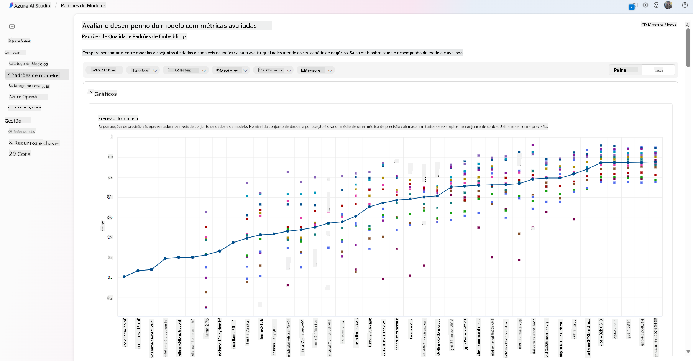
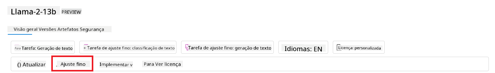
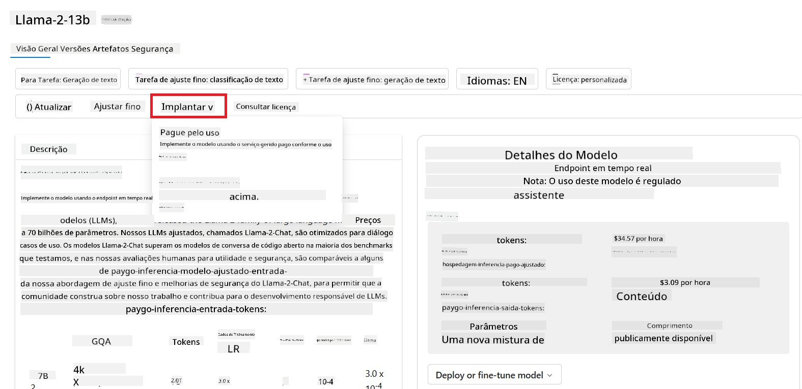

<!--
CO_OP_TRANSLATOR_METADATA:
{
  "original_hash": "e2f686f2eb794941761252ac5e8e090b",
  "translation_date": "2025-05-19T13:56:58+00:00",
  "source_file": "02-exploring-and-comparing-different-llms/README.md",
  "language_code": "pt"
}
-->
# Explorando e comparando diferentes LLMs

> _Clique na imagem acima para ver o vídeo desta lição_

Na lição anterior, vimos como a IA Generativa está mudando o cenário tecnológico, como os Modelos de Linguagem de Grande Porte (LLMs) funcionam e como um negócio - como nossa startup - pode aplicá-los aos seus casos de uso e crescer! Neste capítulo, vamos comparar e contrastar diferentes tipos de modelos de linguagem de grande porte (LLMs) para entender seus prós e contras.

O próximo passo na jornada da nossa startup é explorar o cenário atual dos LLMs e entender quais são adequados para nosso caso de uso.

## Introdução

Esta lição irá abordar:

- Diferentes tipos de LLMs no cenário atual.
- Testar, iterar e comparar diferentes modelos para seu caso de uso no Azure.
- Como implantar um LLM.

## Objetivos de Aprendizagem

Após completar esta lição, você será capaz de:

- Selecionar o modelo certo para seu caso de uso.
- Entender como testar, iterar e melhorar o desempenho do seu modelo.
- Saber como as empresas implantam modelos.

## Entender diferentes tipos de LLMs

LLMs podem ter múltiplas categorizações baseadas em sua arquitetura, dados de treinamento e caso de uso. Entender essas diferenças ajudará nossa startup a selecionar o modelo certo para o cenário e entender como testar, iterar e melhorar o desempenho.

Existem muitos tipos diferentes de modelos LLM, sua escolha de modelo depende do que você pretende usar, seus dados, quanto está disposto a pagar e mais.

Dependendo se você pretende usar os modelos para texto, áudio, vídeo, geração de imagens e assim por diante, você pode optar por um tipo diferente de modelo.

- **Reconhecimento de áudio e fala**. Para este propósito, modelos do tipo Whisper são uma ótima escolha, pois são de uso geral e voltados para reconhecimento de fala. São treinados em áudio diversificado e podem realizar reconhecimento de fala multilíngue. Saiba mais sobre [modelos do tipo Whisper aqui](https://platform.openai.com/docs/models/whisper?WT.mc_id=academic-105485-koreyst).

- **Geração de imagens**. Para geração de imagens, DALL-E e Midjourney são duas escolhas bem conhecidas. DALL-E é oferecido pelo Azure OpenAI. [Leia mais sobre DALL-E aqui](https://platform.openai.com/docs/models/dall-e?WT.mc_id=academic-105485-koreyst) e também no Capítulo 9 deste currículo.

- **Geração de texto**. A maioria dos modelos são treinados para geração de texto e você tem uma grande variedade de escolhas, desde GPT-3.5 até GPT-4. Eles vêm com diferentes custos, sendo o GPT-4 o mais caro. Vale a pena conferir o [Azure OpenAI playground](https://oai.azure.com/portal/playground?WT.mc_id=academic-105485-koreyst) para avaliar quais modelos melhor atendem suas necessidades em termos de capacidade e custo.

- **Multi-modalidade**. Se você está procurando lidar com múltiplos tipos de dados na entrada e saída, pode querer explorar modelos como [gpt-4 turbo com visão ou gpt-4o](https://learn.microsoft.com/azure/ai-services/openai/concepts/models#gpt-4-and-gpt-4-turbo-models?WT.mc_id=academic-105485-koreyst) - os lançamentos mais recentes de modelos da OpenAI - que são capazes de combinar processamento de linguagem natural com entendimento visual, permitindo interações através de interfaces multimodais.

Selecionar um modelo significa que você obtém algumas capacidades básicas, que podem não ser suficientes, no entanto. Muitas vezes você tem dados específicos da empresa que precisa de alguma forma informar ao LLM. Existem algumas escolhas diferentes sobre como abordar isso, mais sobre isso nas próximas seções.

### Modelos de Fundação versus LLMs

O termo Modelo de Fundação foi [cunhado por pesquisadores de Stanford](https://arxiv.org/abs/2108.07258?WT.mc_id=academic-105485-koreyst) e definido como um modelo de IA que segue alguns critérios, como:

- **Eles são treinados usando aprendizado não supervisionado ou auto-supervisionado**, o que significa que são treinados em dados multimodais não rotulados e não requerem anotação ou rotulagem humana dos dados para seu processo de treinamento.
- **Eles são modelos muito grandes**, baseados em redes neurais muito profundas treinadas em bilhões de parâmetros.
- **Eles são normalmente destinados a servir como uma 'fundação' para outros modelos**, o que significa que podem ser usados como ponto de partida para outros modelos a serem construídos sobre eles, o que pode ser feito por ajuste fino.

Para esclarecer ainda mais essa distinção, vamos pegar o ChatGPT como exemplo. Para construir a primeira versão do ChatGPT, um modelo chamado GPT-3.5 serviu como modelo de fundação. Isso significa que a OpenAI usou alguns dados específicos de chat para criar uma versão ajustada do GPT-3.5 que foi especializada em desempenhar bem em cenários de conversação, como chatbots.

### Modelos de Código Aberto versus Proprietários

Outra maneira de categorizar LLMs é se eles são de código aberto ou proprietários.

Modelos de código aberto são modelos que são disponibilizados ao público e podem ser usados por qualquer pessoa. Eles são frequentemente disponibilizados pela empresa que os criou ou pela comunidade de pesquisa. Esses modelos podem ser inspecionados, modificados e personalizados para os diversos casos de uso em LLMs. No entanto, eles nem sempre são otimizados para uso em produção e podem não ser tão performantes quanto modelos proprietários. Além disso, o financiamento para modelos de código aberto pode ser limitado e eles podem não ser mantidos a longo prazo ou podem não ser atualizados com as pesquisas mais recentes. Exemplos de modelos de código aberto populares incluem [Alpaca](https://crfm.stanford.edu/2023/03/13/alpaca.html?WT.mc_id=academic-105485-koreyst), [Bloom](https://huggingface.co/bigscience/bloom) e [LLaMA](https://llama.meta.com).

Modelos proprietários são modelos que são propriedade de uma empresa e não são disponibilizados ao público. Esses modelos são frequentemente otimizados para uso em produção. No entanto, eles não podem ser inspecionados, modificados ou personalizados para diferentes casos de uso. Além disso, eles nem sempre estão disponíveis gratuitamente e podem exigir uma assinatura ou pagamento para uso. Além disso, os usuários não têm controle sobre os dados usados para treinar o modelo, o que significa que devem confiar no proprietário do modelo para garantir o compromisso com a privacidade dos dados e o uso responsável da IA. Exemplos de modelos proprietários populares incluem [modelos da OpenAI](https://platform.openai.com/docs/models/overview?WT.mc_id=academic-105485-koreyst), [Google Bard](https://sapling.ai/llm/bard?WT.mc_id=academic-105485-koreyst) ou [Claude 2](https://www.anthropic.com/index/claude-2?WT.mc_id=academic-105485-koreyst).

### Embedding versus Geração de Imagem versus Geração de Texto e Código

LLMs também podem ser categorizados pelo tipo de saída que geram.

Embeddings são um conjunto de modelos que podem converter texto em uma forma numérica, chamada embedding, que é uma representação numérica do texto de entrada. Embeddings facilitam para máquinas entenderem as relações entre palavras ou frases e podem ser consumidos como entradas por outros modelos, como modelos de classificação ou modelos de agrupamento que têm melhor desempenho em dados numéricos. Modelos de embedding são frequentemente usados para aprendizado por transferência, onde um modelo é construído para uma tarefa substituta para a qual há uma abundância de dados, e então os pesos do modelo (embeddings) são reutilizados para outras tarefas subsequentes. Um exemplo desta categoria é [OpenAI embeddings](https://platform.openai.com/docs/models/embeddings?WT.mc_id=academic-105485-koreyst).

Modelos de geração de imagens são modelos que geram imagens. Esses modelos são frequentemente usados para edição de imagens, síntese de imagens e tradução de imagens. Modelos de geração de imagens são frequentemente treinados em grandes conjuntos de dados de imagens, como [LAION-5B](https://laion.ai/blog/laion-5b/?WT.mc_id=academic-105485-koreyst), e podem ser usados para gerar novas imagens ou editar imagens existentes com técnicas de inpainting, super-resolução e colorização. Exemplos incluem [DALL-E-3](https://openai.com/dall-e-3?WT.mc_id=academic-105485-koreyst) e [modelos Stable Diffusion](https://github.com/Stability-AI/StableDiffusion?WT.mc_id=academic-105485-koreyst).

Modelos de geração de texto e código são modelos que geram texto ou código. Esses modelos são frequentemente usados para sumarização de texto, tradução e resposta a perguntas. Modelos de geração de texto são frequentemente treinados em grandes conjuntos de dados de texto, como [BookCorpus](https://www.cv-foundation.org/openaccess/content_iccv_2015/html/Zhu_Aligning_Books_and_ICCV_2015_paper.html?WT.mc_id=academic-105485-koreyst), e podem ser usados para gerar novo texto ou responder a perguntas. Modelos de geração de código, como [CodeParrot](https://huggingface.co/codeparrot?WT.mc_id=academic-105485-koreyst), são frequentemente treinados em grandes conjuntos de dados de código, como GitHub, e podem ser usados para gerar novo código ou corrigir bugs em código existente.

### Encoder-Decoder versus Apenas Decoder

Para falar sobre os diferentes tipos de arquiteturas de LLMs, vamos usar uma analogia.

Imagine que seu gerente lhe deu uma tarefa para escrever um quiz para os alunos. Você tem dois colegas; um é responsável por criar o conteúdo e o outro por revisá-lo.

O criador de conteúdo é como um modelo Apenas Decoder, ele pode olhar para o tópico e ver o que você já escreveu e então ele pode escrever um curso com base nisso. Eles são muito bons em escrever conteúdo envolvente e informativo, mas não são muito bons em entender o tópico e os objetivos de aprendizado. Alguns exemplos de modelos Decoder são modelos da família GPT, como GPT-3.

O revisor é como um modelo Apenas Encoder, ele olha para o curso escrito e as respostas, percebendo a relação entre eles e entendendo o contexto, mas não é bom em gerar conteúdo. Um exemplo de modelo Apenas Encoder seria o BERT.

Imagine que podemos ter alguém também que poderia criar e revisar o quiz, este é um modelo Encoder-Decoder. Alguns exemplos seriam BART e T5.

### Serviço versus Modelo

Agora, vamos falar sobre a diferença entre um serviço e um modelo. Um serviço é um produto oferecido por um Provedor de Serviços em Nuvem e é frequentemente uma combinação de modelos, dados e outros componentes. Um modelo é o componente central de um serviço e é frequentemente um modelo de fundação, como um LLM.

Serviços são frequentemente otimizados para uso em produção e são frequentemente mais fáceis de usar do que modelos, via uma interface gráfica. No entanto, serviços nem sempre estão disponíveis gratuitamente e podem exigir uma assinatura ou pagamento para uso, em troca de aproveitar os equipamentos e recursos do proprietário do serviço, otimizando despesas e escalando facilmente. Um exemplo de serviço é [Azure OpenAI Service](https://learn.microsoft.com/azure/ai-services/openai/overview?WT.mc_id=academic-105485-koreyst), que oferece um plano de taxa conforme o uso, significando que os usuários são cobrados proporcionalmente ao quanto usam o serviço. Além disso, o Azure OpenAI Service oferece segurança de nível empresarial e um framework de IA responsável em cima das capacidades dos modelos.

Modelos são apenas a Rede Neural, com os parâmetros, pesos e outros. Permitindo que empresas executem localmente, no entanto, precisariam comprar equipamentos, construir uma estrutura para escalar e comprar uma licença ou usar um modelo de código aberto. Um modelo como o LLaMA está disponível para ser usado, exigindo poder computacional para executar o modelo.

## Como testar e iterar com diferentes modelos para entender o desempenho no Azure

Uma vez que nossa equipe explorou o cenário atual de LLMs e identificou alguns bons candidatos para seus cenários, o próximo passo é testá-los em seus dados e em sua carga de trabalho. Este é um processo iterativo, feito por experimentos e medidas. A maioria dos modelos que mencionamos nos parágrafos anteriores (modelos da OpenAI, modelos de código aberto como Llama2 e transformadores do Hugging Face) estão disponíveis no [Catálogo de Modelos](https://learn.microsoft.com/azure/ai-studio/how-to/model-catalog-overview?WT.mc_id=academic-105485-koreyst) no [Azure AI Studio](https://ai.azure.com/?WT.mc_id=academic-105485-koreyst).

[Azure AI Studio](https://learn.microsoft.com/azure/ai-studio/what-is-ai-studio?WT.mc_id=academic-105485-koreyst) é uma Plataforma em Nuvem projetada para desenvolvedores construírem aplicações de IA generativa e gerenciarem todo o ciclo de desenvolvimento - desde experimentação até avaliação - combinando todos os serviços de IA do Azure em um único hub com uma interface gráfica prática. O Catálogo de Modelos no Azure AI Studio permite ao usuário:

- Encontrar o Modelo de Fundação de interesse no catálogo - seja proprietário ou de código aberto, filtrando por tarefa, licença ou nome. Para melhorar a pesquisa, os modelos são organizados em coleções, como coleção Azure OpenAI, coleção Hugging Face e mais.

- Revisar o cartão do modelo, incluindo uma descrição detalhada do uso pretendido e dados de treinamento, exemplos de código e resultados de avaliação na biblioteca de avaliações internas.
- Compare benchmarks entre modelos e conjuntos de dados disponíveis no mercado para avaliar qual atende ao cenário de negócios, através do painel [Model Benchmarks](https://learn.microsoft.com/azure/ai-studio/how-to/model-benchmarks?WT.mc_id=academic-105485-koreyst).

- Ajuste fino do modelo em dados de treinamento personalizados para melhorar o desempenho do modelo em uma carga de trabalho específica, aproveitando as capacidades de experimentação e rastreamento do Azure AI Studio.

- Implante o modelo pré-treinado original ou a versão ajustada para uma inferência em tempo real remota - computação gerenciada - ou endpoint de API sem servidor - [pague conforme o uso](https://learn.microsoft.com/azure/ai-studio/how-to/model-catalog-overview#model-deployment-managed-compute-and-serverless-api-pay-as-you-go?WT.mc_id=academic-105485-koreyst) - para permitir que aplicativos o consumam.

> [!NOTE]
> Nem todos os modelos no catálogo estão atualmente disponíveis para ajuste fino e/ou implantação no modo pague conforme o uso. Verifique o cartão do modelo para detalhes sobre as capacidades e limitações do modelo.

## Melhorando os resultados de LLM

Exploramos com nossa equipe de startup diferentes tipos de LLMs e uma plataforma em nuvem (Azure Machine Learning) que nos permite comparar diferentes modelos, avaliá-los em dados de teste, melhorar o desempenho e implantá-los em endpoints de inferência.

Mas quando devem considerar ajustar um modelo em vez de usar um pré-treinado? Existem outras abordagens para melhorar o desempenho do modelo em cargas de trabalho específicas?

Existem várias abordagens que uma empresa pode usar para obter os resultados que precisa de um LLM. Você pode selecionar diferentes tipos de modelos com diferentes graus de treinamento ao implantar um LLM em produção, com diferentes níveis de complexidade, custo e qualidade. Aqui estão algumas abordagens diferentes:

- **Engenharia de prompt com contexto**. A ideia é fornecer contexto suficiente ao fazer o prompt para garantir que você obtenha as respostas de que precisa.

- **Geração Aumentada por Recuperação, RAG**. Seus dados podem existir em um banco de dados ou endpoint web, por exemplo, para garantir que esses dados, ou um subconjunto deles, sejam incluídos no momento do prompt, você pode buscar os dados relevantes e torná-los parte do prompt do usuário.

- **Modelo ajustado**. Aqui, você treinou o modelo mais a fundo com seus próprios dados, o que levou o modelo a ser mais exato e responsivo às suas necessidades, mas pode ser caro.

Fonte da imagem: [Four Ways that Enterprises Deploy LLMs | Fiddler AI Blog](https://www.fiddler.ai/blog/four-ways-that-enterprises-deploy-llms?WT.mc_id=academic-105485-koreyst)

### Engenharia de Prompt com Contexto

LLMs pré-treinados funcionam muito bem em tarefas de linguagem natural generalizadas, mesmo chamando-os com um prompt curto, como uma frase para completar ou uma pergunta – o chamado aprendizado “zero-shot”.

No entanto, quanto mais o usuário puder estruturar sua consulta, com um pedido detalhado e exemplos – o Contexto – mais precisa e próxima das expectativas do usuário será a resposta. Neste caso, falamos de aprendizado “one-shot” se o prompt incluir apenas um exemplo e “few-shot learning” se incluir vários exemplos. A engenharia de prompt com contexto é a abordagem mais econômica para começar.

### Geração Aumentada por Recuperação (RAG)

LLMs têm a limitação de que só podem usar os dados que foram usados durante seu treinamento para gerar uma resposta. Isso significa que eles não sabem nada sobre os fatos que aconteceram após o processo de treinamento, e não podem acessar informações não públicas (como dados da empresa). Isso pode ser superado através do RAG, uma técnica que aumenta o prompt com dados externos na forma de pedaços de documentos, considerando os limites de comprimento do prompt. Isso é suportado por ferramentas de banco de dados de vetor (como [Azure Vector Search](https://learn.microsoft.com/azure/search/vector-search-overview?WT.mc_id=academic-105485-koreyst)) que recuperam os pedaços úteis de várias fontes de dados pré-definidas e os adicionam ao Contexto do prompt.

Esta técnica é muito útil quando uma empresa não tem dados suficientes, tempo suficiente ou recursos para ajustar um LLM, mas ainda deseja melhorar o desempenho em uma carga de trabalho específica e reduzir os riscos de falsificações, ou seja, mistificação da realidade ou conteúdo prejudicial.

### Modelo ajustado

O ajuste fino é um processo que aproveita o aprendizado de transferência para ‘adaptar’ o modelo a uma tarefa a jusante ou para resolver um problema específico. Diferentemente do few-shot learning e do RAG, resulta em um novo modelo sendo gerado, com pesos e viés atualizados. Requer um conjunto de exemplos de treinamento consistindo de uma única entrada (o prompt) e sua saída associada (a conclusão). Esta seria a abordagem preferida se:

- **Usando modelos ajustados**. Uma empresa gostaria de usar modelos ajustados menos capazes (como modelos de incorporação) em vez de modelos de alto desempenho, resultando em uma solução mais econômica e rápida.

- **Considerando a latência**. A latência é importante para um caso de uso específico, portanto, não é possível usar prompts muito longos ou o número de exemplos que devem ser aprendidos pelo modelo não cabe no limite de comprimento do prompt.

- **Mantendo-se atualizado**. Uma empresa possui muitos dados de alta qualidade e rótulos de verdade fundamental e os recursos necessários para manter esses dados atualizados ao longo do tempo.

### Modelo treinado

Treinar um LLM do zero é sem dúvida a abordagem mais difícil e complexa de adotar, exigindo quantidades massivas de dados, recursos qualificados e poder computacional adequado. Esta opção deve ser considerada apenas em um cenário onde uma empresa possui um caso de uso específico de domínio e uma grande quantidade de dados centrados no domínio.

## Verificação de conhecimento

Qual poderia ser uma boa abordagem para melhorar os resultados de conclusão do LLM?

1. Engenharia de prompt com contexto
1. RAG
1. Modelo ajustado

A:3, se você tiver tempo e recursos e dados de alta qualidade, o ajuste fino é a melhor opção para se manter atualizado. No entanto, se você estiver procurando melhorar as coisas e estiver com pouco tempo, vale a pena considerar o RAG primeiro.

## 🚀 Desafio

Leia mais sobre como você pode [usar RAG](https://learn.microsoft.com/azure/search/retrieval-augmented-generation-overview?WT.mc_id=academic-105485-koreyst) para o seu negócio.

## Ótimo Trabalho, Continue Aprendendo

Após concluir esta lição, confira nossa [coleção de aprendizado de IA Generativa](https://aka.ms/genai-collection?WT.mc_id=academic-105485-koreyst) para continuar aprimorando seu conhecimento em IA Generativa!

Vá para a Lição 3, onde veremos como [construir com IA Generativa de forma responsável](../03-using-generative-ai-responsibly/README.md?WT.mc_id=academic-105485-koreyst)!

**Aviso Legal**:  
Este documento foi traduzido usando o serviço de tradução por IA [Co-op Translator](https://github.com/Azure/co-op-translator). Embora nos esforcemos para garantir a precisão, esteja ciente de que traduções automáticas podem conter erros ou imprecisões. O documento original em seu idioma nativo deve ser considerado a fonte autorizada. Para informações críticas, recomenda-se a tradução humana profissional. Não nos responsabilizamos por quaisquer mal-entendidos ou interpretações errôneas decorrentes do uso desta tradução.