<!--
CO_OP_TRANSLATOR_METADATA:
{
  "original_hash": "e2f686f2eb794941761252ac5e8e090b",
  "translation_date": "2025-07-09T08:22:28+00:00",
  "source_file": "02-exploring-and-comparing-different-llms/README.md",
  "language_code": "pt"
}
-->
# Explorar e comparar diferentes LLMs

[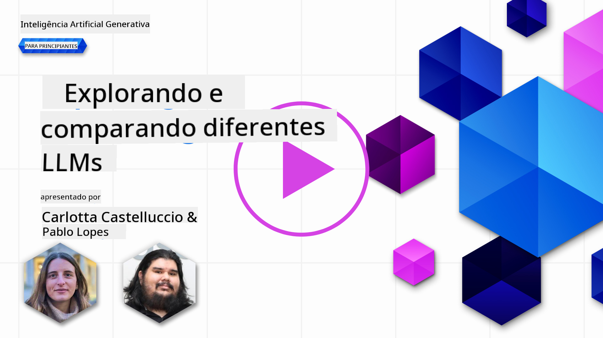](https://aka.ms/gen-ai-lesson2-gh?WT.mc_id=academic-105485-koreyst)

> _Clique na imagem acima para ver o vídeo desta lição_

Na lição anterior, vimos como a IA Generativa está a transformar o panorama tecnológico, como funcionam os Large Language Models (LLMs) e como uma empresa – como a nossa startup – pode aplicá-los nos seus casos de uso e crescer! Neste capítulo, vamos comparar e contrastar diferentes tipos de grandes modelos de linguagem (LLMs) para compreender as suas vantagens e desvantagens.

O próximo passo na jornada da nossa startup é explorar o panorama atual dos LLMs e perceber quais são adequados para o nosso caso de uso.

## Introdução

Esta lição irá abordar:

- Diferentes tipos de LLMs no panorama atual.
- Testar, iterar e comparar diferentes modelos para o seu caso de uso no Azure.
- Como implementar um LLM.

## Objetivos de Aprendizagem

Após completar esta lição, será capaz de:

- Selecionar o modelo certo para o seu caso de uso.
- Compreender como testar, iterar e melhorar o desempenho do seu modelo.
- Saber como as empresas implementam modelos.

## Compreender os diferentes tipos de LLMs

Os LLMs podem ser categorizados de várias formas, consoante a sua arquitetura, dados de treino e caso de uso. Compreender estas diferenças ajudará a nossa startup a escolher o modelo certo para o cenário e a perceber como testar, iterar e melhorar o desempenho.

Existem muitos tipos diferentes de modelos LLM; a sua escolha depende do que pretende fazer com eles, dos seus dados, do orçamento disponível e outros fatores.

Consoante pretenda usar os modelos para texto, áudio, vídeo, geração de imagens, entre outros, poderá optar por um tipo diferente de modelo.

- **Reconhecimento de áudio e voz**. Para este propósito, os modelos do tipo Whisper são uma excelente escolha, pois são de uso geral e focados no reconhecimento de voz. São treinados com áudio diversificado e conseguem realizar reconhecimento de voz multilingue. Saiba mais sobre [modelos do tipo Whisper aqui](https://platform.openai.com/docs/models/whisper?WT.mc_id=academic-105485-koreyst).

- **Geração de imagens**. Para geração de imagens, DALL-E e Midjourney são duas escolhas muito conhecidas. O DALL-E é disponibilizado pelo Azure OpenAI. [Leia mais sobre DALL-E aqui](https://platform.openai.com/docs/models/dall-e?WT.mc_id=academic-105485-koreyst) e também no Capítulo 9 deste currículo.

- **Geração de texto**. A maioria dos modelos é treinada para geração de texto e tem uma grande variedade de opções, desde GPT-3.5 até GPT-4. Estes modelos têm custos diferentes, sendo o GPT-4 o mais caro. Vale a pena explorar o [playground do Azure OpenAI](https://oai.azure.com/portal/playground?WT.mc_id=academic-105485-koreyst) para avaliar quais os modelos que melhor se adequam às suas necessidades em termos de capacidade e custo.

- **Multi-modalidade**. Se pretende lidar com vários tipos de dados na entrada e saída, poderá querer explorar modelos como [gpt-4 turbo com visão ou gpt-4o](https://learn.microsoft.com/azure/ai-services/openai/concepts/models#gpt-4-and-gpt-4-turbo-models?WT.mc_id=academic-105485-koreyst) – as últimas versões dos modelos OpenAI – que combinam processamento de linguagem natural com compreensão visual, permitindo interações através de interfaces multimodais.

Selecionar um modelo significa obter algumas capacidades básicas, que por vezes podem não ser suficientes. Muitas vezes, tem dados específicos da empresa que precisa de comunicar ao LLM. Existem algumas opções para abordar isso, que serão explicadas nas próximas secções.

### Foundation Models versus LLMs

O termo Foundation Model foi [criado por investigadores de Stanford](https://arxiv.org/abs/2108.07258?WT.mc_id=academic-105485-koreyst) e definido como um modelo de IA que cumpre certos critérios, tais como:

- **São treinados usando aprendizagem não supervisionada ou auto-supervisionada**, ou seja, são treinados com dados multimodais não rotulados, sem necessidade de anotação humana para o processo de treino.
- **São modelos muito grandes**, baseados em redes neurais profundas treinadas com milhares de milhões de parâmetros.
- **Destinam-se normalmente a servir como ‘fundação’ para outros modelos**, podendo ser usados como ponto de partida para construir outros modelos, através de fine-tuning.

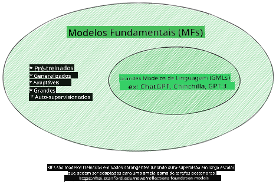

Fonte da imagem: [Essential Guide to Foundation Models and Large Language Models | por Babar M Bhatti | Medium](https://thebabar.medium.com/essential-guide-to-foundation-models-and-large-language-models-27dab58f7404)

Para clarificar esta distinção, tomemos o ChatGPT como exemplo. Para construir a primeira versão do ChatGPT, um modelo chamado GPT-3.5 serviu como foundation model. Isto significa que a OpenAI usou dados específicos de conversação para criar uma versão ajustada do GPT-3.5, especializada em ter bom desempenho em cenários de conversação, como chatbots.

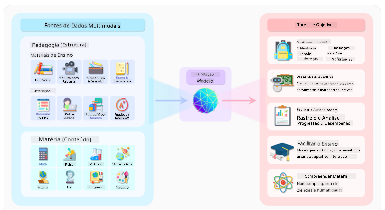

Fonte da imagem: [2108.07258.pdf (arxiv.org)](https://arxiv.org/pdf/2108.07258.pdf?WT.mc_id=academic-105485-koreyst)

### Modelos Open Source versus Proprietários

Outra forma de categorizar os LLMs é se são open source ou proprietários.

Modelos open source são disponibilizados ao público e podem ser usados por qualquer pessoa. São frequentemente disponibilizados pela empresa que os criou ou pela comunidade de investigação. Estes modelos podem ser inspecionados, modificados e personalizados para diferentes casos de uso. No entanto, nem sempre estão otimizados para uso em produção, podendo não ter o mesmo desempenho que modelos proprietários. Além disso, o financiamento para modelos open source pode ser limitado, podendo não ser mantidos a longo prazo ou atualizados com as últimas pesquisas. Exemplos populares de modelos open source incluem [Alpaca](https://crfm.stanford.edu/2023/03/13/alpaca.html?WT.mc_id=academic-105485-koreyst), [Bloom](https://huggingface.co/bigscience/bloom) e [LLaMA](https://llama.meta.com).

Modelos proprietários são propriedade de uma empresa e não são disponibilizados ao público. Estes modelos são frequentemente otimizados para uso em produção. No entanto, não podem ser inspecionados, modificados ou personalizados para diferentes casos de uso. Além disso, nem sempre estão disponíveis gratuitamente, podendo exigir subscrição ou pagamento para uso. Os utilizadores também não têm controlo sobre os dados usados para treinar o modelo, pelo que devem confiar no proprietário do modelo para garantir o compromisso com a privacidade dos dados e o uso responsável da IA. Exemplos populares de modelos proprietários incluem [modelos OpenAI](https://platform.openai.com/docs/models/overview?WT.mc_id=academic-105485-koreyst), [Google Bard](https://sapling.ai/llm/bard?WT.mc_id=academic-105485-koreyst) ou [Claude 2](https://www.anthropic.com/index/claude-2?WT.mc_id=academic-105485-koreyst).

### Embedding versus Geração de Imagens versus Geração de Texto e Código

Os LLMs também podem ser categorizados pelo tipo de saída que geram.

Embeddings são um conjunto de modelos que convertem texto numa forma numérica, chamada embedding, que é uma representação numérica do texto de entrada. Os embeddings facilitam a compreensão das relações entre palavras ou frases pelas máquinas e podem ser usados como entrada para outros modelos, como modelos de classificação ou de clustering, que têm melhor desempenho com dados numéricos. Os modelos de embedding são frequentemente usados para transfer learning, onde um modelo é construído para uma tarefa substituta com abundância de dados, e depois os pesos do modelo (embeddings) são reutilizados para outras tarefas. Um exemplo desta categoria são os [OpenAI embeddings](https://platform.openai.com/docs/models/embeddings?WT.mc_id=academic-105485-koreyst).

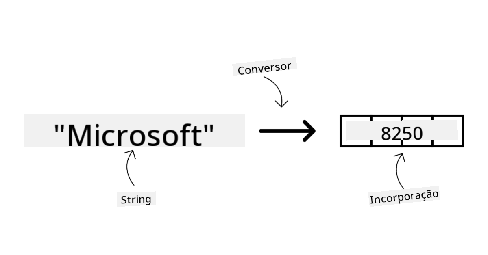

Modelos de geração de imagens são modelos que criam imagens. São frequentemente usados para edição, síntese e tradução de imagens. Estes modelos são treinados em grandes conjuntos de dados de imagens, como [LAION-5B](https://laion.ai/blog/laion-5b/?WT.mc_id=academic-105485-koreyst), e podem ser usados para gerar novas imagens ou editar imagens existentes com técnicas de inpainting, super-resolução e coloração. Exemplos incluem [DALL-E-3](https://openai.com/dall-e-3?WT.mc_id=academic-105485-koreyst) e [modelos Stable Diffusion](https://github.com/Stability-AI/StableDiffusion?WT.mc_id=academic-105485-koreyst).

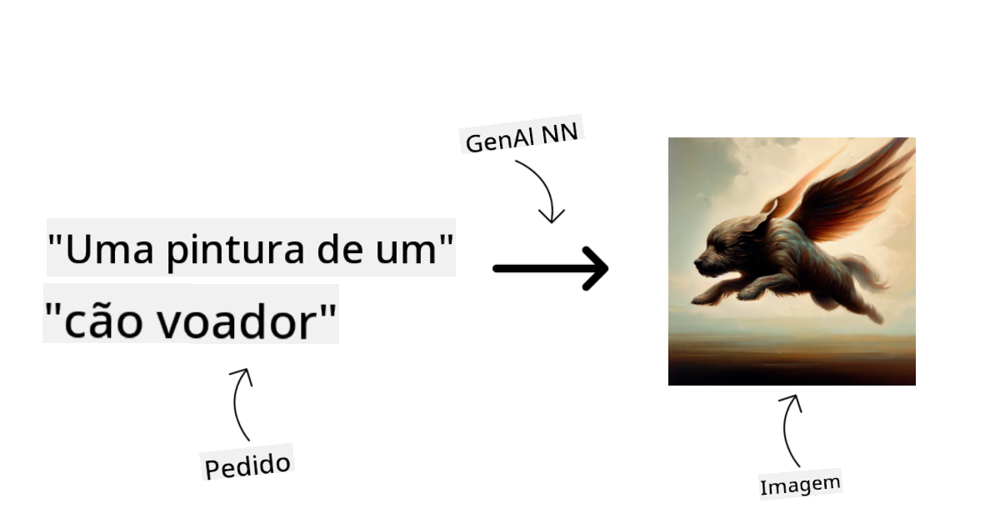

Modelos de geração de texto e código são modelos que geram texto ou código. São usados para sumarização, tradução e resposta a perguntas. Os modelos de geração de texto são treinados em grandes conjuntos de dados de texto, como [BookCorpus](https://www.cv-foundation.org/openaccess/content_iccv_2015/html/Zhu_Aligning_Books_and_ICCV_2015_paper.html?WT.mc_id=academic-105485-koreyst), e podem gerar texto novo ou responder a perguntas. Modelos de geração de código, como [CodeParrot](https://huggingface.co/codeparrot?WT.mc_id=academic-105485-koreyst), são treinados em grandes conjuntos de dados de código, como GitHub, e podem gerar código novo ou corrigir bugs em código existente.

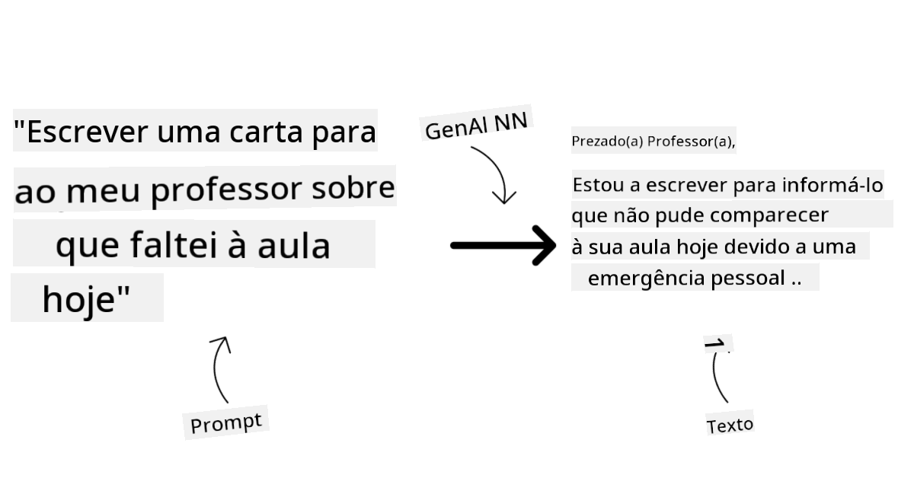

### Encoder-Decoder versus Decoder-only

Para falar sobre os diferentes tipos de arquiteturas dos LLMs, vamos usar uma analogia.

Imagine que o seu gestor lhe deu a tarefa de criar um quiz para os alunos. Tem dois colegas; um é responsável por criar o conteúdo e o outro por o rever.

O criador de conteúdo é como um modelo Decoder only, que pode olhar para o tema e ver o que já escreveu, e depois escrever um curso com base nisso. São muito bons a escrever conteúdos envolventes e informativos, mas não são muito bons a compreender o tema e os objetivos de aprendizagem. Alguns exemplos de modelos Decoder são os da família GPT, como o GPT-3.

O revisor é como um modelo Encoder only, que olha para o curso escrito e as respostas, notando a relação entre eles e compreendendo o contexto, mas não é bom a gerar conteúdo. Um exemplo de modelo Encoder only seria o BERT.

Imagine que pudéssemos ter alguém que criasse e revisasse o quiz, este seria um modelo Encoder-Decoder. Alguns exemplos seriam BART e T5.

### Serviço versus Modelo

Agora, vamos falar sobre a diferença entre um serviço e um modelo. Um serviço é um produto oferecido por um Provedor de Serviços Cloud, e é frequentemente uma combinação de modelos, dados e outros componentes. Um modelo é o componente central de um serviço, e é frequentemente um foundation model, como um LLM.

Os serviços são frequentemente otimizados para uso em produção e são geralmente mais fáceis de usar do que os modelos, através de uma interface gráfica. No entanto, os serviços nem sempre são gratuitos, podendo exigir subscrição ou pagamento, em troca de aproveitar o equipamento e recursos do proprietário do serviço, otimizando custos e facilitando a escalabilidade. Um exemplo de serviço é o [Azure OpenAI Service](https://learn.microsoft.com/azure/ai-services/openai/overview?WT.mc_id=academic-105485-koreyst), que oferece um plano pay-as-you-go, ou seja, os utilizadores são cobrados proporcionalmente ao uso do serviço. Além disso, o Azure OpenAI Service oferece segurança ao nível empresarial e um framework de IA responsável, para além das capacidades dos modelos.

Os modelos são apenas a Rede Neural, com os parâmetros, pesos e outros. Permitem que as empresas os executem localmente, mas para isso precisam de comprar equipamento, construir uma infraestrutura para escalar e adquirir uma licença ou usar um modelo open source. Um modelo como o LLaMA está disponível para uso, exigindo poder computacional para executar o modelo.

## Como testar e iterar com diferentes modelos para compreender o desempenho no Azure

Depois de a nossa equipa explorar o panorama atual dos LLMs e identificar alguns bons candidatos para os seus cenários, o próximo passo é testá-los com os seus dados e carga de trabalho. Este é um processo iterativo, feito através de experiências e medições.
A maioria dos modelos que mencionámos nos parágrafos anteriores (modelos OpenAI, modelos open source como o Llama2 e transformers da Hugging Face) estão disponíveis no [Catálogo de Modelos](https://learn.microsoft.com/azure/ai-studio/how-to/model-catalog-overview?WT.mc_id=academic-105485-koreyst) no [Azure AI Studio](https://ai.azure.com/?WT.mc_id=academic-105485-koreyst).

[Azure AI Studio](https://learn.microsoft.com/azure/ai-studio/what-is-ai-studio?WT.mc_id=academic-105485-koreyst) é uma plataforma na Cloud concebida para desenvolvedores criarem aplicações de IA generativa e gerirem todo o ciclo de vida do desenvolvimento – desde a experimentação até à avaliação – combinando todos os serviços Azure AI num único hub com uma interface gráfica prática. O Catálogo de Modelos no Azure AI Studio permite ao utilizador:

- Encontrar o Foundation Model de interesse no catálogo – seja proprietário ou open source, filtrando por tarefa, licença ou nome. Para melhorar a pesquisa, os modelos estão organizados em coleções, como a coleção Azure OpenAI, coleção Hugging Face, entre outras.

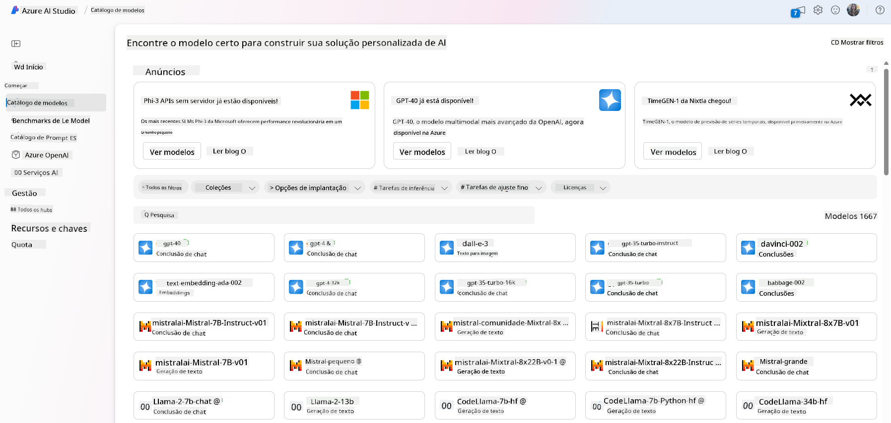

- Consultar a ficha do modelo, incluindo uma descrição detalhada do uso pretendido e dos dados de treino, exemplos de código e resultados de avaliação na biblioteca interna de avaliações.

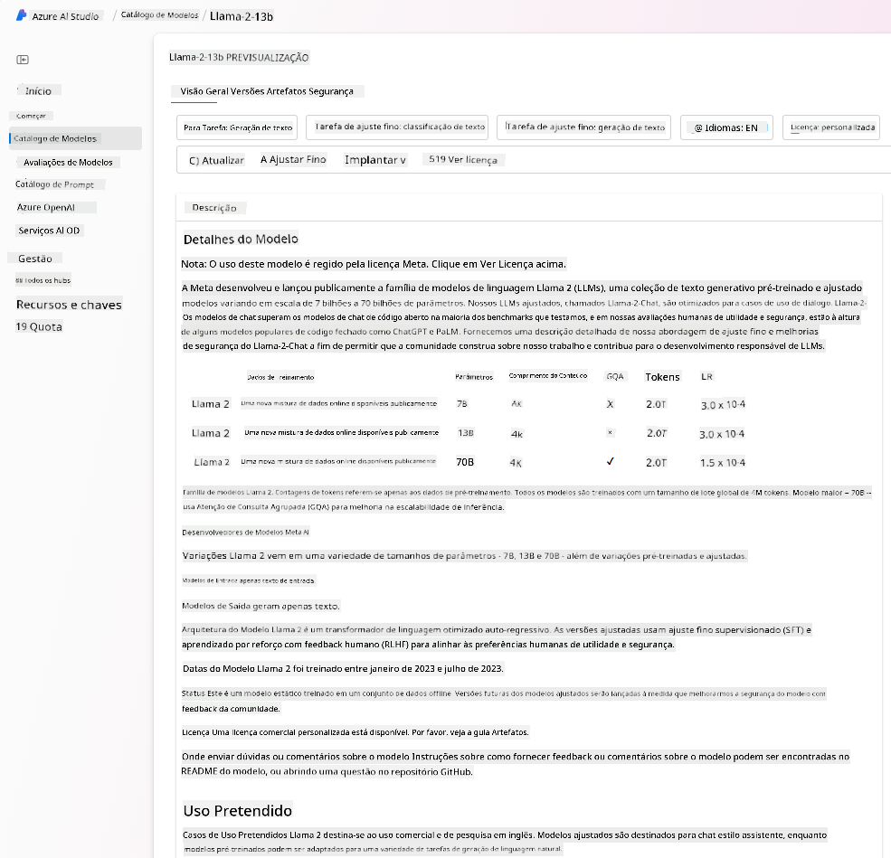

- Comparar benchmarks entre modelos e conjuntos de dados disponíveis na indústria para avaliar qual deles se adequa ao cenário de negócio, através do painel [Model Benchmarks](https://learn.microsoft.com/azure/ai-studio/how-to/model-benchmarks?WT.mc_id=academic-105485-koreyst).

- Ajustar o modelo com dados de treino personalizados para melhorar o desempenho do modelo numa carga de trabalho específica, aproveitando as capacidades de experimentação e monitorização do Azure AI Studio.

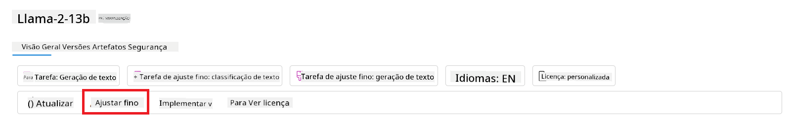

- Implementar o modelo pré-treinado original ou a versão ajustada num endpoint remoto de inferência em tempo real – computação gerida – ou num endpoint API serverless – [pay-as-you-go](https://learn.microsoft.com/azure/ai-studio/how-to/model-catalog-overview#model-deployment-managed-compute-and-serverless-api-pay-as-you-go?WT.mc_id=academic-105485-koreyst) – para permitir que as aplicações o consumam.

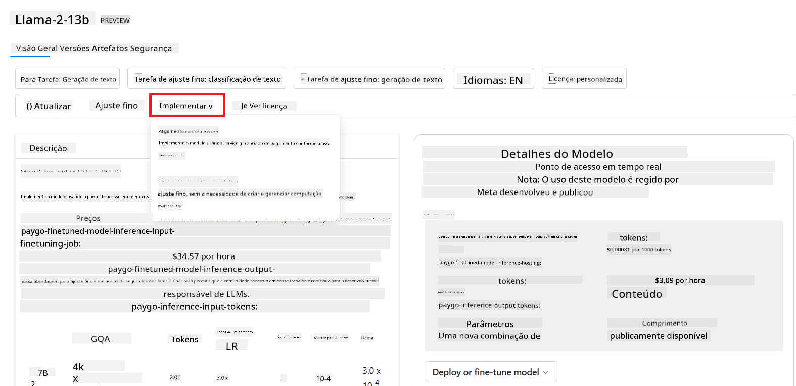

> [!NOTE]
> Nem todos os modelos no catálogo estão atualmente disponíveis para fine-tuning e/ou implementação pay-as-you-go. Consulte a ficha do modelo para detalhes sobre as capacidades e limitações do modelo.

## Melhorar os resultados dos LLM

Explorámos com a nossa equipa startup diferentes tipos de LLMs e uma plataforma Cloud (Azure Machine Learning) que nos permite comparar diferentes modelos, avaliá-los com dados de teste, melhorar o desempenho e implementá-los em endpoints de inferência.

Mas quando devem considerar ajustar um modelo em vez de usar um pré-treinado? Existem outras abordagens para melhorar o desempenho do modelo em cargas de trabalho específicas?

Existem várias abordagens que uma empresa pode usar para obter os resultados desejados de um LLM. Pode escolher diferentes tipos de modelos com diferentes graus de treino ao implementar um LLM em produção, com diferentes níveis de complexidade, custo e qualidade. Aqui estão algumas abordagens diferentes:

- **Prompt engineering com contexto**. A ideia é fornecer contexto suficiente quando se faz o prompt para garantir que se obtêm as respostas necessárias.

- **Retrieval Augmented Generation, RAG**. Os seus dados podem existir numa base de dados ou endpoint web, por exemplo, para garantir que esses dados, ou um subconjunto deles, são incluídos no momento do prompt, pode buscar os dados relevantes e torná-los parte do prompt do utilizador.

- **Modelo ajustado (fine-tuned)**. Aqui, treinou-se o modelo adicionalmente com os seus próprios dados, o que torna o modelo mais exato e responsivo às suas necessidades, mas pode ser dispendioso.

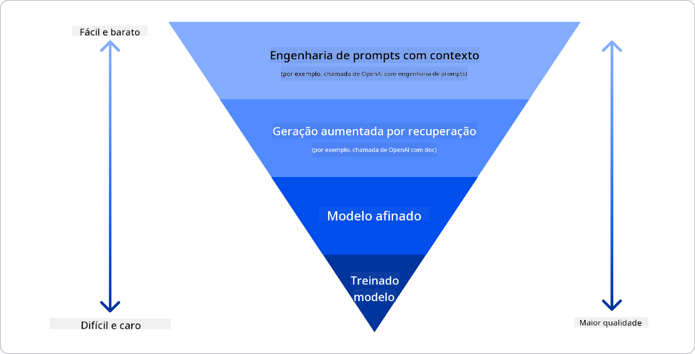

Fonte da imagem: [Four Ways that Enterprises Deploy LLMs | Fiddler AI Blog](https://www.fiddler.ai/blog/four-ways-that-enterprises-deploy-llms?WT.mc_id=academic-105485-koreyst)

### Prompt Engineering com Contexto

LLMs pré-treinados funcionam muito bem em tarefas generalizadas de linguagem natural, mesmo quando chamados com um prompt curto, como uma frase a completar ou uma pergunta – o chamado “zero-shot” learning.

No entanto, quanto mais o utilizador conseguir enquadrar a sua consulta, com um pedido detalhado e exemplos – o Contexto – mais precisa e próxima das expectativas do utilizador será a resposta. Neste caso, falamos em “one-shot” learning se o prompt incluir apenas um exemplo e “few-shot learning” se incluir vários exemplos.  
Prompt engineering com contexto é a abordagem mais económica para começar.

### Retrieval Augmented Generation (RAG)

Os LLMs têm a limitação de só poderem usar os dados que foram utilizados durante o seu treino para gerar uma resposta. Isto significa que não sabem nada sobre factos que aconteceram após o seu processo de treino, e não podem aceder a informação não pública (como dados da empresa).  
Isto pode ser ultrapassado através do RAG, uma técnica que aumenta o prompt com dados externos na forma de fragmentos de documentos, considerando os limites de comprimento do prompt. Isto é suportado por ferramentas de bases de dados vetoriais (como o [Azure Vector Search](https://learn.microsoft.com/azure/search/vector-search-overview?WT.mc_id=academic-105485-koreyst)) que recuperam os fragmentos úteis de várias fontes de dados pré-definidas e adicionam-nos ao Contexto do prompt.

Esta técnica é muito útil quando uma empresa não tem dados suficientes, tempo suficiente ou recursos para ajustar um LLM, mas ainda assim deseja melhorar o desempenho numa carga de trabalho específica e reduzir riscos de invenções, ou seja, distorção da realidade ou conteúdo prejudicial.

### Modelo ajustado (fine-tuned)

O fine-tuning é um processo que aproveita o transfer learning para ‘adaptar’ o modelo a uma tarefa específica ou para resolver um problema concreto. Diferentemente do few-shot learning e do RAG, resulta na geração de um novo modelo, com pesos e biases atualizados. Requer um conjunto de exemplos de treino consistindo num único input (o prompt) e o output associado (a conclusão).  
Esta seria a abordagem preferida se:

- **Usar modelos ajustados**. Uma empresa gostaria de usar modelos ajustados menos potentes (como modelos de embedding) em vez de modelos de alto desempenho, resultando numa solução mais económica e rápida.

- **Considerar a latência**. A latência é importante para um caso de uso específico, pelo que não é possível usar prompts muito longos ou o número de exemplos que o modelo deve aprender não se enquadra no limite de comprimento do prompt.

- **Manter-se atualizado**. Uma empresa tem muitos dados de alta qualidade e etiquetas de ground truth e os recursos necessários para manter esses dados atualizados ao longo do tempo.

### Modelo treinado

Treinar um LLM do zero é, sem dúvida, a abordagem mais difícil e complexa de adotar, exigindo enormes quantidades de dados, recursos especializados e poder computacional adequado. Esta opção deve ser considerada apenas num cenário em que uma empresa tenha um caso de uso específico de domínio e uma grande quantidade de dados centrados nesse domínio.

## Verificação de conhecimento

Qual poderia ser uma boa abordagem para melhorar os resultados de conclusão de um LLM?

1. Prompt engineering com contexto  
1. RAG  
1. Modelo ajustado

R:3, se tiver tempo, recursos e dados de alta qualidade, o fine-tuning é a melhor opção para se manter atualizado. No entanto, se pretende melhorar as coisas e não tem tempo, vale a pena considerar primeiro o RAG.

## 🚀 Desafio

Leia mais sobre como pode [usar o RAG](https://learn.microsoft.com/azure/search/retrieval-augmented-generation-overview?WT.mc_id=academic-105485-koreyst) para o seu negócio.

## Excelente trabalho, continue a aprender

Depois de concluir esta lição, consulte a nossa [coleção de Aprendizagem de IA Generativa](https://aka.ms/genai-collection?WT.mc_id=academic-105485-koreyst) para continuar a aprimorar os seus conhecimentos em IA Generativa!

Siga para a Lição 3 onde veremos como [construir com IA Generativa de forma responsável](../03-using-generative-ai-responsibly/README.md?WT.mc_id=academic-105485-koreyst)!

**Aviso Legal**:  
Este documento foi traduzido utilizando o serviço de tradução automática [Co-op Translator](https://github.com/Azure/co-op-translator). Embora nos esforcemos pela precisão, por favor tenha em conta que traduções automáticas podem conter erros ou imprecisões. O documento original na sua língua nativa deve ser considerado a fonte autorizada. Para informações críticas, recomenda-se tradução profissional humana. Não nos responsabilizamos por quaisquer mal-entendidos ou interpretações erradas decorrentes da utilização desta tradução.