<!--
CO_OP_TRANSLATOR_METADATA:
{
  "original_hash": "e2f686f2eb794941761252ac5e8e090b",
  "translation_date": "2025-06-25T10:35:18+00:00",
  "source_file": "02-exploring-and-comparing-different-llms/README.md",
  "language_code": "pt"
}
-->
# Explorar e comparar diferentes LLMs

[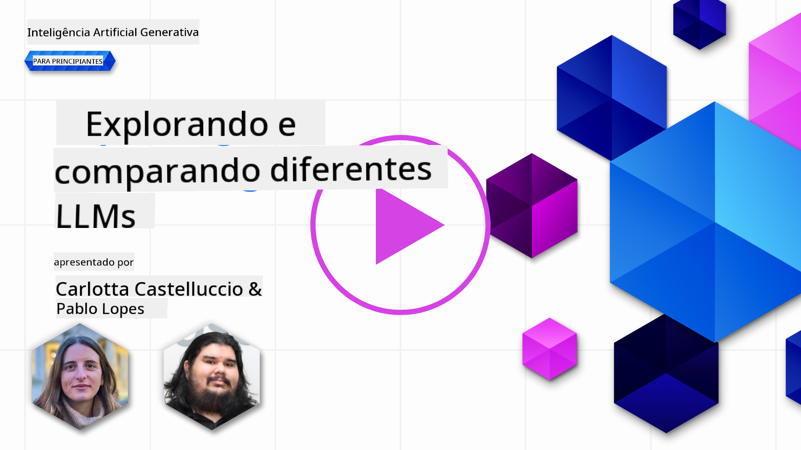](https://aka.ms/gen-ai-lesson2-gh?WT.mc_id=academic-105485-koreyst)

> _Clique na imagem acima para ver o vídeo desta lição_

Na lição anterior, vimos como a IA Generativa está a mudar o panorama tecnológico, como funcionam os Modelos de Linguagem de Grande Escala (LLMs) e como uma empresa - como a nossa startup - pode aplicá-los aos seus casos de uso e crescer! Neste capítulo, vamos comparar e contrastar diferentes tipos de modelos de linguagem de grande escala (LLMs) para entender as suas vantagens e desvantagens.

O próximo passo na jornada da nossa startup é explorar o atual panorama dos LLMs e entender quais são adequados para o nosso caso de uso.

## Introdução

Esta lição irá cobrir:

- Diferentes tipos de LLMs no panorama atual.
- Testar, iterar e comparar diferentes modelos para o seu caso de uso no Azure.
- Como implementar um LLM.

## Objetivos de Aprendizagem

Após completar esta lição, será capaz de:

- Selecionar o modelo certo para o seu caso de uso.
- Compreender como testar, iterar e melhorar o desempenho do seu modelo.
- Saber como as empresas implementam modelos.

## Compreender diferentes tipos de LLMs

Os LLMs podem ter várias categorizações com base na sua arquitetura, dados de treino e caso de uso. Compreender estas diferenças ajudará a nossa startup a selecionar o modelo certo para o cenário e a entender como testar, iterar e melhorar o desempenho.

Existem muitos tipos diferentes de modelos LLM, a sua escolha de modelo depende do que pretende usar, dos seus dados, do quanto está disposto a pagar e mais.

Dependendo se pretende usar os modelos para texto, áudio, vídeo, geração de imagens e assim por diante, poderá optar por um tipo diferente de modelo.

- **Reconhecimento de áudio e fala**. Para este propósito, os modelos do tipo Whisper são uma ótima escolha, pois são de uso geral e visam o reconhecimento de fala. São treinados em áudio diversificado e podem realizar reconhecimento de fala multilingue. Saiba mais sobre [modelos do tipo Whisper aqui](https://platform.openai.com/docs/models/whisper?WT.mc_id=academic-105485-koreyst).

- **Geração de imagens**. Para geração de imagens, DALL-E e Midjourney são duas escolhas muito conhecidas. DALL-E é oferecido pelo Azure OpenAI. [Leia mais sobre DALL-E aqui](https://platform.openai.com/docs/models/dall-e?WT.mc_id=academic-105485-koreyst) e também no Capítulo 9 deste currículo.

- **Geração de texto**. A maioria dos modelos são treinados para geração de texto e há uma grande variedade de escolhas desde o GPT-3.5 até o GPT-4. Eles têm custos diferentes, sendo o GPT-4 o mais caro. Vale a pena explorar o [playground do Azure OpenAI](https://oai.azure.com/portal/playground?WT.mc_id=academic-105485-koreyst) para avaliar quais modelos melhor se adequam às suas necessidades em termos de capacidade e custo.

- **Multi-modalidade**. Se procura lidar com múltiplos tipos de dados na entrada e saída, poderá querer explorar modelos como [gpt-4 turbo com visão ou gpt-4o](https://learn.microsoft.com/azure/ai-services/openai/concepts/models#gpt-4-and-gpt-4-turbo-models?WT.mc_id=academic-105485-koreyst) - as últimas versões dos modelos OpenAI - que são capazes de combinar processamento de linguagem natural com compreensão visual, permitindo interações através de interfaces multimodais.

Selecionar um modelo significa que obtém algumas capacidades básicas, que podem não ser suficientes, no entanto. Muitas vezes tem dados específicos da empresa que de alguma forma precisa comunicar ao LLM. Há algumas escolhas diferentes sobre como abordar isso, mais sobre isso nas próximas seções.

### Modelos de Fundação versus LLMs

O termo Modelo de Fundação foi [criado por pesquisadores de Stanford](https://arxiv.org/abs/2108.07258?WT.mc_id=academic-105485-koreyst) e definido como um modelo de IA que segue alguns critérios, como:

- **Eles são treinados usando aprendizagem não supervisionada ou aprendizagem auto-supervisionada**, o que significa que são treinados em dados multimodais não rotulados e não requerem anotação ou rotulagem humana dos dados para o seu processo de treino.
- **Eles são modelos muito grandes**, baseados em redes neurais muito profundas treinadas em bilhões de parâmetros.
- **Eles são normalmente destinados a servir como uma 'fundação' para outros modelos**, o que significa que podem ser usados como ponto de partida para outros modelos serem construídos sobre eles, o que pode ser feito por ajuste fino.

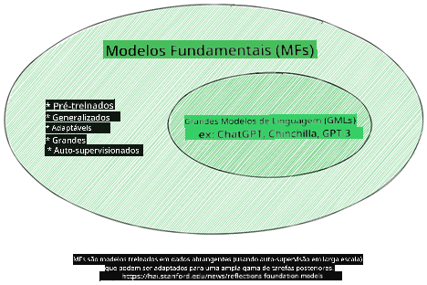

Fonte da imagem: [Guia Essencial para Modelos de Fundação e Modelos de Linguagem de Grande Escala | por Babar M Bhatti | Medium
](https://thebabar.medium.com/essential-guide-to-foundation-models-and-large-language-models-27dab58f7404)

Para esclarecer ainda mais esta distinção, vamos pegar o ChatGPT como exemplo. Para construir a primeira versão do ChatGPT, um modelo chamado GPT-3.5 serviu como modelo de fundação. Isso significa que a OpenAI usou alguns dados específicos de chat para criar uma versão ajustada do GPT-3.5 que foi especializada em desempenhar bem em cenários conversacionais, como chatbots.

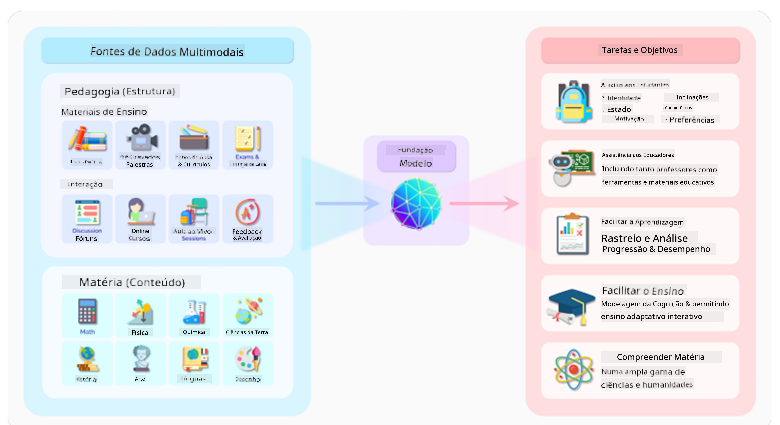

Fonte da imagem: [2108.07258.pdf (arxiv.org)](https://arxiv.org/pdf/2108.07258.pdf?WT.mc_id=academic-105485-koreyst)

### Modelos Open Source versus Proprietários

Outra forma de categorizar os LLMs é se são open source ou proprietários.

Modelos open source são modelos que são disponibilizados ao público e podem ser usados por qualquer pessoa. Muitas vezes são disponibilizados pela empresa que os criou ou pela comunidade de pesquisa. Estes modelos podem ser inspecionados, modificados e personalizados para os vários casos de uso nos LLMs. No entanto, nem sempre são otimizados para uso em produção e podem não ser tão performantes quanto os modelos proprietários. Além disso, o financiamento para modelos open source pode ser limitado e podem não ser mantidos a longo prazo ou não serem atualizados com as últimas pesquisas. Exemplos de modelos open source populares incluem [Alpaca](https://crfm.stanford.edu/2023/03/13/alpaca.html?WT.mc_id=academic-105485-koreyst), [Bloom](https://huggingface.co/bigscience/bloom) e [LLaMA](https://llama.meta.com).

Modelos proprietários são modelos que são propriedade de uma empresa e não são disponibilizados ao público. Estes modelos são frequentemente otimizados para uso em produção. No entanto, não podem ser inspecionados, modificados ou personalizados para diferentes casos de uso. Além disso, nem sempre estão disponíveis gratuitamente e podem exigir uma assinatura ou pagamento para uso. Também, os utilizadores não têm controle sobre os dados que são usados para treinar o modelo, o que significa que devem confiar ao proprietário do modelo o compromisso com a privacidade dos dados e o uso responsável da IA. Exemplos de modelos proprietários populares incluem [modelos OpenAI](https://platform.openai.com/docs/models/overview?WT.mc_id=academic-105485-koreyst), [Google Bard](https://sapling.ai/llm/bard?WT.mc_id=academic-105485-koreyst) ou [Claude 2](https://www.anthropic.com/index/claude-2?WT.mc_id=academic-105485-koreyst).

### Embedding versus Geração de Imagens versus Geração de Texto e Código

Os LLMs também podem ser categorizados pelo output que geram.

Embeddings são um conjunto de modelos que podem converter texto numa forma numérica, chamada embedding, que é uma representação numérica do texto de entrada. Embeddings tornam mais fácil para as máquinas entenderem as relações entre palavras ou frases e podem ser consumidos como inputs por outros modelos, como modelos de classificação, ou modelos de clustering que têm melhor desempenho em dados numéricos. Modelos de embedding são frequentemente usados para aprendizagem por transferência, onde um modelo é construído para uma tarefa substituta para a qual há uma abundância de dados, e depois os pesos do modelo (embeddings) são reutilizados para outras tarefas posteriores. Um exemplo desta categoria é [OpenAI embeddings](https://platform.openai.com/docs/models/embeddings?WT.mc_id=academic-105485-koreyst).

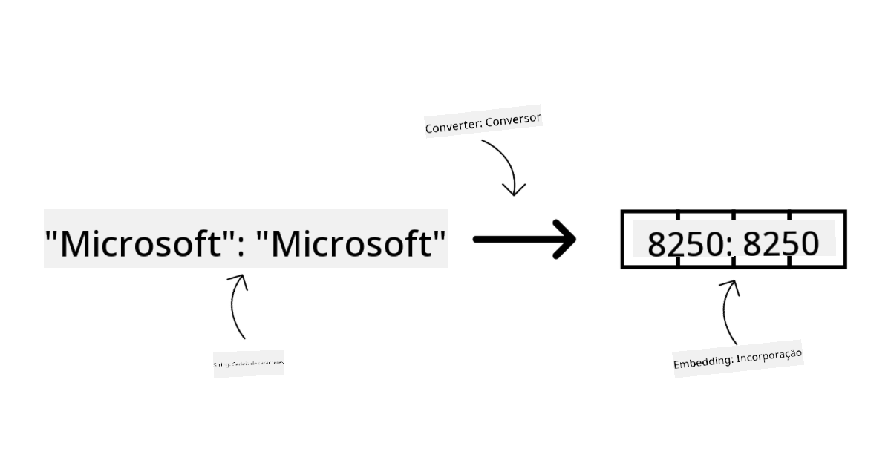

Modelos de geração de imagens são modelos que geram imagens. Estes modelos são frequentemente usados para edição de imagens, síntese de imagens e tradução de imagens. Modelos de geração de imagens são frequentemente treinados em grandes conjuntos de dados de imagens, como [LAION-5B](https://laion.ai/blog/laion-5b/?WT.mc_id=academic-105485-koreyst), e podem ser usados para gerar novas imagens ou para editar imagens existentes com técnicas de inpainting, super-resolução e colorização. Exemplos incluem [DALL-E-3](https://openai.com/dall-e-3?WT.mc_id=academic-105485-koreyst) e [modelos de Stable Diffusion](https://github.com/Stability-AI/StableDiffusion?WT.mc_id=academic-105485-koreyst).

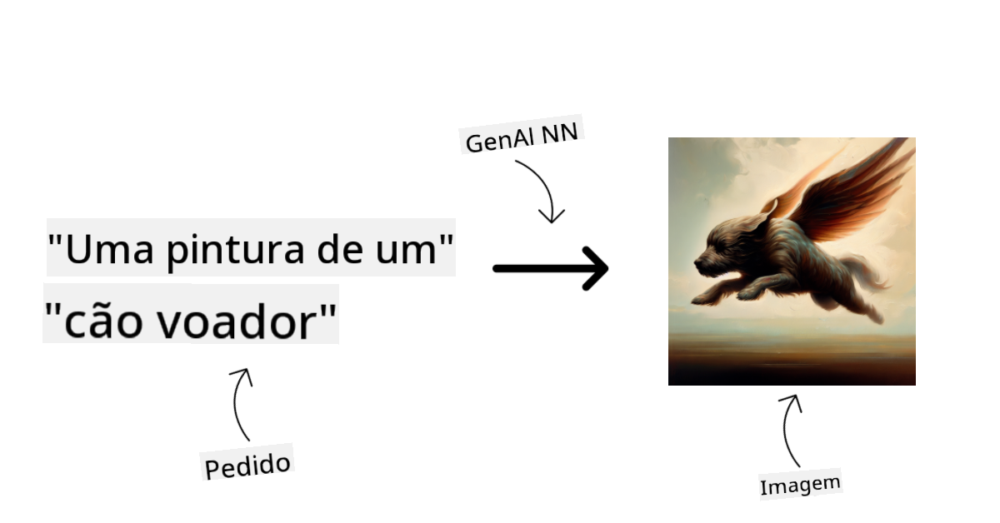

Modelos de geração de texto e código são modelos que geram texto ou código. Estes modelos são frequentemente usados para sumarização de texto, tradução e resposta a perguntas. Modelos de geração de texto são frequentemente treinados em grandes conjuntos de dados de texto, como [BookCorpus](https://www.cv-foundation.org/openaccess/content_iccv_2015/html/Zhu_Aligning_Books_and_ICCV_2015_paper.html?WT.mc_id=academic-105485-koreyst), e podem ser usados para gerar novo texto ou para responder a perguntas. Modelos de geração de código, como [CodeParrot](https://huggingface.co/codeparrot?WT.mc_id=academic-105485-koreyst), são frequentemente treinados em grandes conjuntos de dados de código, como GitHub, e podem ser usados para gerar novo código ou para corrigir bugs em código existente.

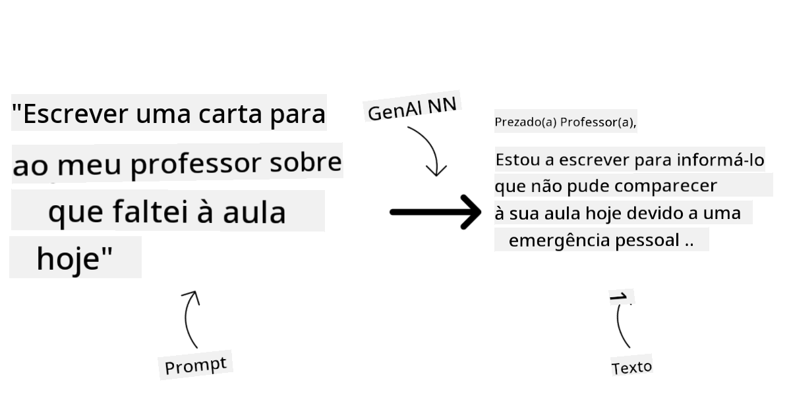

### Encoder-Decoder versus Apenas Decoder

Para falar sobre os diferentes tipos de arquiteturas de LLMs, vamos usar uma analogia.

Imagine que o seu gerente lhe deu uma tarefa para escrever um questionário para os alunos. Você tem dois colegas; um é responsável por criar o conteúdo e o outro por revisá-lo.

O criador de conteúdo é como um modelo Apenas Decoder, ele pode olhar para o tópico e ver o que você já escreveu e então pode escrever um curso com base nisso. Eles são muito bons em escrever conteúdo envolvente e informativo, mas não são muito bons em entender o tópico e os objetivos de aprendizagem. Alguns exemplos de modelos Decoder são modelos da família GPT, como o GPT-3.

O revisor é como um modelo Apenas Encoder, ele olha para o curso escrito e as respostas, notando a relação entre eles e entendendo o contexto, mas não é bom em gerar conteúdo. Um exemplo de modelo Apenas Encoder seria o BERT.

Imagine que podemos ter alguém também que poderia criar e revisar o questionário, este é um modelo Encoder-Decoder. Alguns exemplos seriam BART e T5.

### Serviço versus Modelo

Agora, vamos falar sobre a diferença entre um serviço e um modelo. Um serviço é um produto oferecido por um Provedor de Serviços em Nuvem, e é frequentemente uma combinação de modelos, dados e outros componentes. Um modelo é o componente central de um serviço e é frequentemente um modelo de fundação, como um LLM.

Os serviços são frequentemente otimizados para uso em produção e são frequentemente mais fáceis de usar do que os modelos, através de uma interface gráfica de usuário. No entanto, os serviços nem sempre estão disponíveis gratuitamente e podem exigir uma assinatura ou pagamento para uso, em troca de aproveitar o equipamento e recursos do proprietário do serviço, otimizando despesas e escalando facilmente. Um exemplo de serviço é o [Azure OpenAI Service](https://learn.microsoft.com/azure/ai-services/openai/overview?WT.mc_id=academic-105485-koreyst), que oferece um plano de tarifas pay-as-you-go, significando que os usuários são cobrados proporcionalmente ao quanto usam o serviço. Além disso, o Azure OpenAI Service oferece segurança de nível empresarial e um quadro de IA responsável além das capacidades dos modelos.

Os modelos são apenas a Rede Neural, com os parâmetros, pesos e outros. Permitindo que as empresas operem localmente, no entanto, precisariam comprar equipamento, construir uma estrutura para escalar e comprar uma licença ou usar um modelo open-source. Um modelo como o LLaMA está disponível para ser usado, exigindo poder computacional para executar o modelo.

## Como testar e iterar com diferentes modelos para entender o desempenho no Azure

Uma vez que a nossa equipa tenha explorado o atual panorama dos LLMs e identificado alguns bons candidatos para os seus cenários, o próximo passo é testá-los nos seus dados e na sua carga de trabalho. Este é um processo iterativo, feito por experiências e medidas. A maioria dos modelos que mencionamos nos parágrafos anteriores (modelos OpenAI, modelos open source como Llama2 e transformers Hugging Face) estão disponíveis no [Catálogo de Modelos](https://learn.microsoft.com/azure/ai-studio/how-to/model-catalog-overview?WT.mc_id=academic-105485-koreyst) no [Azure AI Studio](https://ai.azure.com/?WT.mc_id=academic-105485-koreyst).

[Azure AI Studio](https://learn.microsoft.com/azure/ai-studio/what-is-ai-studio?WT.mc_id=academic-105485-koreyst) é uma Plataforma em Nuvem projetada para desenvolvedores construírem aplicações de IA generativa e gerirem todo o ciclo de desenvolvimento - desde a experimentação até a avaliação - combinando todos os serviços de IA do Azure num único hub com uma interface gráfica de usuário prática. O Catálogo de Modelos no Azure AI Studio permite ao usuário:

- Encontrar o Modelo de Fundação de interesse no catálogo - seja proprietário ou open source, filtrando por tarefa, licença ou nome. Para melhorar a pesquisa, os modelos são organizados em coleções, como a coleção Azure OpenAI, coleção Hugging Face, e mais.

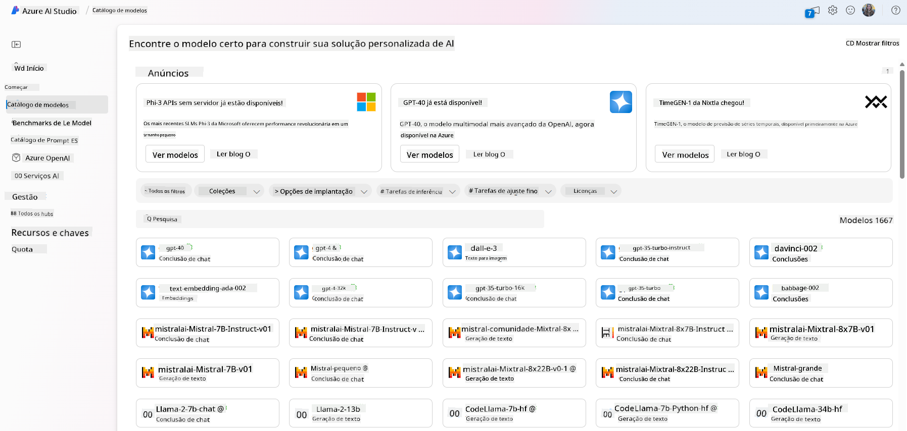

- Revisar o cartão do modelo, incluindo uma descrição detalhada do uso pretendido e dados de treino, exemplos de código e resultados de avaliação na biblioteca de avaliações internas.

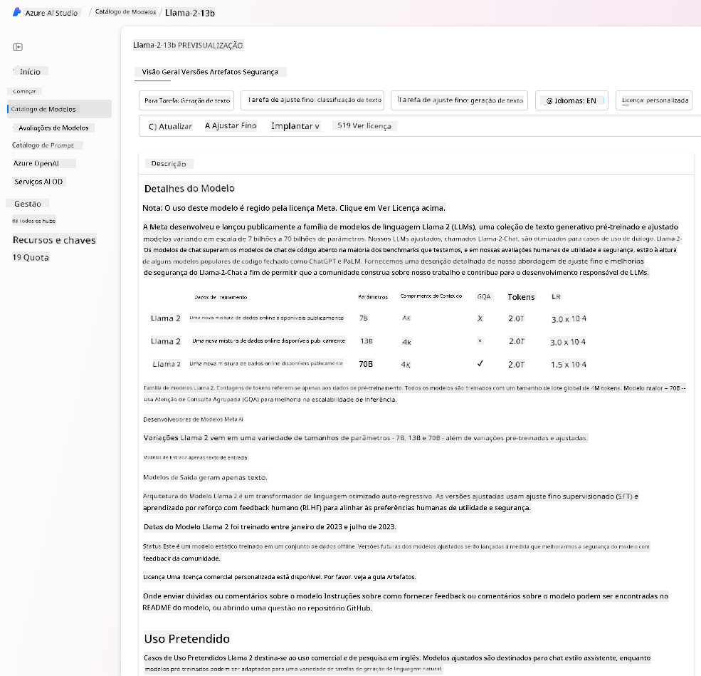
- Compare benchmarks entre modelos e conjuntos de dados disponíveis na indústria para avaliar qual atende ao cenário de negócios, através do painel [Model Benchmarks](https://learn.microsoft.com/azure/ai-studio/how-to/model-benchmarks?WT.mc_id=academic-105485-koreyst).

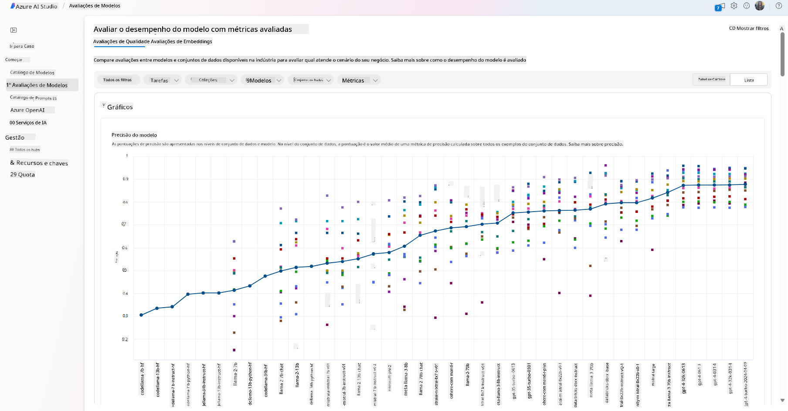

- Ajuste fino do modelo em dados de treinamento personalizados para melhorar o desempenho do modelo em uma carga de trabalho específica, aproveitando as capacidades de experimentação e rastreamento do Azure AI Studio.

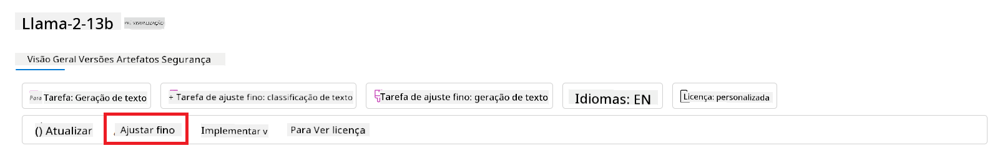

- Implemente o modelo pré-treinado original ou a versão ajustada para uma inferência remota em tempo real - computação gerida - ou endpoint de API sem servidor - [pagamento conforme o uso](https://learn.microsoft.com/azure/ai-studio/how-to/model-catalog-overview#model-deployment-managed-compute-and-serverless-api-pay-as-you-go?WT.mc_id=academic-105485-koreyst) - para permitir que as aplicações o consumam.

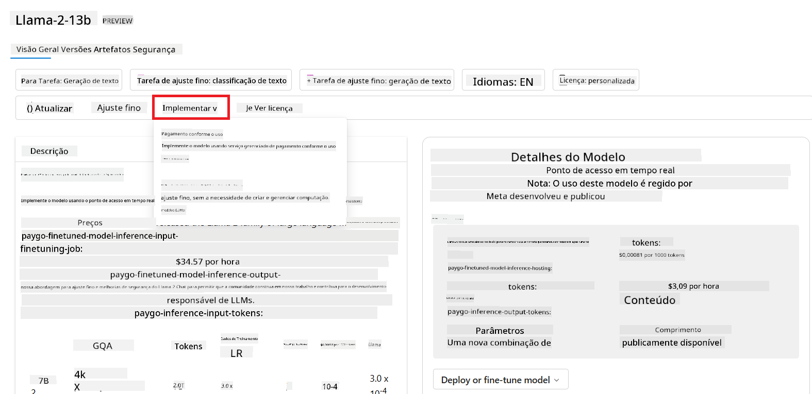

> [!NOTE]
> Nem todos os modelos no catálogo estão atualmente disponíveis para ajuste fino e/ou implementação por pagamento conforme o uso. Verifique o cartão do modelo para detalhes sobre as capacidades e limitações do modelo.

## Melhorando os resultados de LLM

Explorámos com a nossa equipa de startup diferentes tipos de LLMs e uma plataforma de Cloud (Azure Machine Learning) que nos permite comparar diferentes modelos, avaliá-los em dados de teste, melhorar o desempenho e implementá-los em endpoints de inferência.

Mas quando devem considerar ajustar um modelo em vez de usar um pré-treinado? Existem outras abordagens para melhorar o desempenho do modelo em cargas de trabalho específicas?

Existem várias abordagens que uma empresa pode usar para obter os resultados que precisa de um LLM. Pode selecionar diferentes tipos de modelos com diferentes graus de treinamento ao implementar um LLM em produção, com diferentes níveis de complexidade, custo e qualidade. Aqui estão algumas abordagens diferentes:

- **Engenharia de prompts com contexto**. A ideia é fornecer contexto suficiente quando se faz um prompt para garantir que se obtenha as respostas necessárias.

- **Geração aumentada por recuperação, RAG**. Os seus dados podem existir numa base de dados ou endpoint web, por exemplo, para garantir que esses dados, ou um subconjunto deles, sejam incluídos no momento do prompt, pode-se buscar os dados relevantes e fazer disso parte do prompt do usuário.

- **Modelo ajustado**. Aqui, treina-se o modelo ainda mais nos seus próprios dados, o que leva o modelo a ser mais exato e responsivo às suas necessidades, mas pode ser dispendioso.

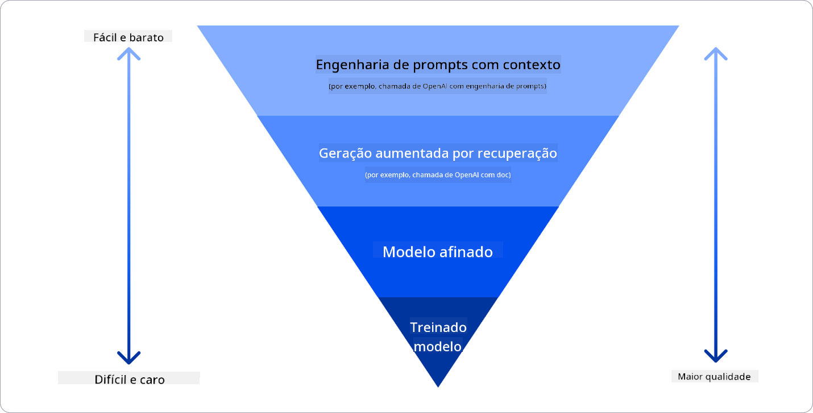

Fonte da imagem: [Quatro maneiras que as empresas implementam LLMs | Blog Fiddler AI](https://www.fiddler.ai/blog/four-ways-that-enterprises-deploy-llms?WT.mc_id=academic-105485-koreyst)

### Engenharia de Prompts com Contexto

LLMs pré-treinados funcionam muito bem em tarefas gerais de linguagem natural, mesmo ao chamá-los com um prompt curto, como uma frase para completar ou uma pergunta – o chamado aprendizado "zero-shot".

No entanto, quanto mais o usuário puder enquadrar sua consulta, com um pedido detalhado e exemplos – o Contexto – mais precisa e próxima das expectativas do usuário será a resposta. Neste caso, falamos de aprendizado "one-shot" se o prompt incluir apenas um exemplo e "few-shot learning" se incluir múltiplos exemplos. Engenharia de prompts com contexto é a abordagem mais económica para começar.

### Geração Aumentada por Recuperação (RAG)

LLMs têm a limitação de que podem usar apenas os dados que foram usados durante seu treinamento para gerar uma resposta. Isso significa que eles não sabem nada sobre os fatos que aconteceram após seu processo de treinamento e não podem acessar informações não públicas (como dados de empresa). Isso pode ser superado através do RAG, uma técnica que aumenta o prompt com dados externos na forma de pedaços de documentos, considerando limites de comprimento do prompt. Isso é suportado por ferramentas de base de dados vetorial (como [Azure Vector Search](https://learn.microsoft.com/azure/search/vector-search-overview?WT.mc_id=academic-105485-koreyst)) que recuperam os pedaços úteis de várias fontes de dados predefinidas e os adicionam ao Contexto do prompt.

Esta técnica é muito útil quando uma empresa não tem dados suficientes, tempo suficiente ou recursos para ajustar um LLM, mas ainda deseja melhorar o desempenho em uma carga de trabalho específica e reduzir os riscos de fabricações, ou seja, mistificação da realidade ou conteúdo prejudicial.

### Modelo Ajustado

O ajuste fino é um processo que aproveita o aprendizado por transferência para ‘adaptar’ o modelo a uma tarefa a jusante ou para resolver um problema específico. Diferentemente do aprendizado few-shot e do RAG, resulta em um novo modelo sendo gerado, com pesos e vieses atualizados. Requer um conjunto de exemplos de treinamento consistindo em uma única entrada (o prompt) e sua saída associada (a conclusão). Esta seria a abordagem preferida se:

- **Usando modelos ajustados**. Uma empresa gostaria de usar modelos ajustados menos capazes (como modelos de embedding) em vez de modelos de alto desempenho, resultando em uma solução mais económica e rápida.

- **Considerando latência**. A latência é importante para um caso de uso específico, então não é possível usar prompts muito longos ou o número de exemplos que devem ser aprendidos pelo modelo não cabe no limite de comprimento do prompt.

- **Mantendo-se atualizado**. Uma empresa tem muitos dados de alta qualidade e rótulos de verdade básica e os recursos necessários para manter esses dados atualizados ao longo do tempo.

### Modelo Treinado

Treinar um LLM do zero é sem dúvida a abordagem mais difícil e complexa de adotar, exigindo quantidades massivas de dados, recursos qualificados e poder computacional apropriado. Esta opção deve ser considerada apenas em um cenário onde uma empresa tem um caso de uso específico de domínio e uma grande quantidade de dados centrados no domínio.

## Verificação de Conhecimento

Qual poderia ser uma boa abordagem para melhorar os resultados de conclusão de LLM?

1. Engenharia de prompts com contexto
1. RAG
1. Modelo ajustado

A:3, se tiver tempo e recursos e dados de alta qualidade, o ajuste fino é a melhor opção para se manter atualizado. No entanto, se está a tentar melhorar as coisas e está com falta de tempo, vale a pena considerar o RAG primeiro.

## 🚀 Desafio

Leia mais sobre como pode [usar RAG](https://learn.microsoft.com/azure/search/retrieval-augmented-generation-overview?WT.mc_id=academic-105485-koreyst) para o seu negócio.

## Bom Trabalho, Continue a Aprender

Após completar esta lição, veja a nossa [coleção de Aprendizagem de IA Generativa](https://aka.ms/genai-collection?WT.mc_id=academic-105485-koreyst) para continuar a elevar o seu conhecimento de IA Generativa!

Dirija-se à Lição 3 onde veremos como [construir com IA Generativa Responsavelmente](../03-using-generative-ai-responsibly/README.md?WT.mc_id=academic-105485-koreyst)!

**Aviso Legal**:  
Este documento foi traduzido utilizando o serviço de tradução por IA [Co-op Translator](https://github.com/Azure/co-op-translator). Embora nos esforcemos para garantir a precisão, esteja ciente de que traduções automáticas podem conter erros ou imprecisões. O documento original na sua língua nativa deve ser considerado a fonte autorizada. Para informações críticas, recomenda-se a tradução profissional por humanos. Não nos responsabilizamos por quaisquer mal-entendidos ou interpretações erradas decorrentes do uso desta tradução.