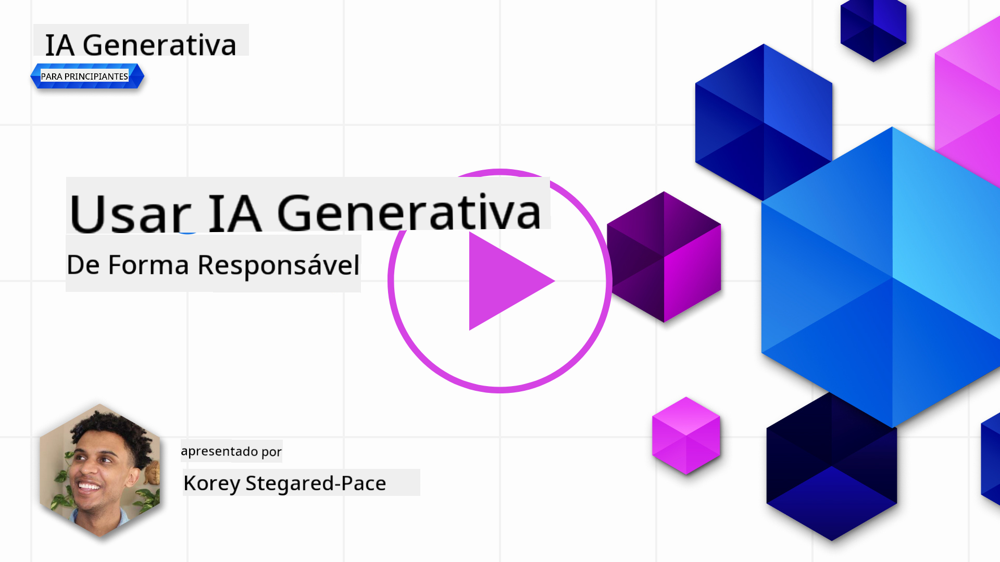
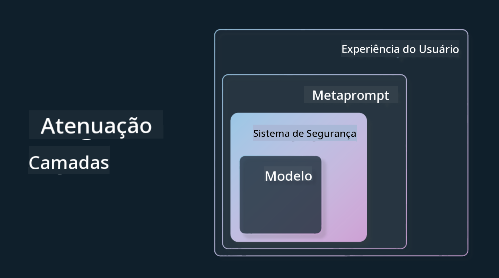

<!--
CO_OP_TRANSLATOR_METADATA:
{
  "original_hash": "7f8f4c11f8c1cb6e1794442dead414ea",
  "translation_date": "2025-07-09T08:54:09+00:00",
  "source_file": "03-using-generative-ai-responsibly/README.md",
  "language_code": "pt"
}
-->
# Usar a IA Generativa de Forma Responsável

> _Clique na imagem acima para ver o vídeo desta lição_

É fácil ficar fascinado com a IA e, em particular, com a IA generativa, mas é importante pensar em como a usar de forma responsável. Deve considerar aspetos como garantir que o resultado é justo, não prejudicial e muito mais. Este capítulo pretende fornecer o contexto mencionado, o que deve ter em conta e como tomar medidas ativas para melhorar a sua utilização da IA.

## Introdução

Esta lição irá abordar:

- Por que deve priorizar a IA Responsável ao construir aplicações de IA Generativa.
- Princípios fundamentais da IA Responsável e como se relacionam com a IA Generativa.
- Como colocar estes princípios de IA Responsável em prática através de estratégias e ferramentas.

## Objetivos de Aprendizagem

Após completar esta lição, saberá:

- A importância da IA Responsável ao construir aplicações de IA Generativa.
- Quando pensar e aplicar os princípios fundamentais da IA Responsável ao desenvolver aplicações de IA Generativa.
- Que ferramentas e estratégias tem disponíveis para colocar o conceito de IA Responsável em prática.

## Princípios da IA Responsável

O entusiasmo em torno da IA Generativa nunca foi tão grande. Este entusiasmo trouxe muitos novos desenvolvedores, atenção e financiamento para esta área. Embora isto seja muito positivo para quem quer criar produtos e empresas usando IA Generativa, é igualmente importante avançar de forma responsável.

Ao longo deste curso, estamos focados em construir a nossa startup e o nosso produto educativo de IA. Vamos usar os princípios da IA Responsável: Justiça, Inclusividade, Fiabilidade/Segurança, Segurança & Privacidade, Transparência e Responsabilização. Com estes princípios, exploraremos como eles se relacionam com o uso da IA Generativa nos nossos produtos.

## Por Que Deve Priorizar a IA Responsável

Ao construir um produto, adotar uma abordagem centrada no ser humano, tendo em mente o melhor interesse do utilizador, leva aos melhores resultados.

A singularidade da IA Generativa está no seu poder de criar respostas úteis, informação, orientação e conteúdo para os utilizadores. Isto pode ser feito sem muitos passos manuais, o que pode levar a resultados muito impressionantes. Sem um planeamento e estratégias adequadas, infelizmente, também pode resultar em consequências prejudiciais para os seus utilizadores, para o seu produto e para a sociedade em geral.

Vamos ver alguns (mas não todos) destes possíveis resultados prejudiciais:

### Alucinações

Alucinações é um termo usado para descrever quando um LLM produz conteúdo que é completamente sem sentido ou algo que sabemos ser factualmente incorreto com base noutras fontes de informação.

Por exemplo, imaginemos que criamos uma funcionalidade para a nossa startup que permite aos estudantes fazer perguntas históricas a um modelo. Um estudante pergunta: `Quem foi o único sobrevivente do Titanic?`

O modelo produz uma resposta como a seguinte:

> _(Fonte: [Flying bisons](https://flyingbisons.com?WT.mc_id=academic-105485-koreyst))_

Esta é uma resposta muito confiante e detalhada. Infelizmente, está incorreta. Mesmo com uma pesquisa mínima, descobrir-se-ia que houve mais do que um sobrevivente do desastre do Titanic. Para um estudante que está a começar a investigar este tema, esta resposta pode ser suficientemente persuasiva para não ser questionada e ser tratada como um facto. As consequências disto podem tornar o sistema de IA pouco fiável e afetar negativamente a reputação da nossa startup.

Com cada iteração de qualquer LLM, temos visto melhorias no desempenho para minimizar as alucinações. Mesmo com esta melhoria, nós, enquanto construtores de aplicações e utilizadores, devemos continuar conscientes destas limitações.

### Conteúdo Prejudicial

Na secção anterior, falámos sobre quando um LLM produz respostas incorretas ou sem sentido. Outro risco que devemos ter em conta é quando um modelo responde com conteúdo prejudicial.

Conteúdo prejudicial pode ser definido como:

- Fornecer instruções ou incentivar o auto-prejuízo ou o prejuízo a determinados grupos.
- Conteúdo odioso ou depreciativo.
- Orientar o planeamento de qualquer tipo de ataque ou atos violentos.
- Fornecer instruções sobre como encontrar conteúdo ilegal ou cometer atos ilegais.
- Exibir conteúdo sexualmente explícito.

Para a nossa startup, queremos garantir que temos as ferramentas e estratégias certas para evitar que este tipo de conteúdo seja visto pelos estudantes.

### Falta de Justiça

Justiça é definida como “garantir que um sistema de IA está livre de preconceitos e discriminação e que trata todos de forma justa e igualitária.” No mundo da IA Generativa, queremos assegurar que visões de mundo exclusivas e marginalizadoras não sejam reforçadas pela saída do modelo.

Este tipo de resultados não só prejudica a criação de experiências positivas para os nossos utilizadores, como também causa danos sociais adicionais. Como construtores de aplicações, devemos sempre ter em mente uma base de utilizadores ampla e diversa ao criar soluções com IA Generativa.

## Como Usar a IA Generativa de Forma Responsável

Agora que identificámos a importância da IA Generativa Responsável, vejamos 4 passos que podemos seguir para construir as nossas soluções de IA de forma responsável:

### Medir os Potenciais Danos

No teste de software, testamos as ações esperadas de um utilizador numa aplicação. De forma semelhante, testar um conjunto diversificado de prompts que os utilizadores provavelmente irão usar é uma boa forma de medir potenciais danos.

Como a nossa startup está a construir um produto educativo, seria útil preparar uma lista de prompts relacionados com a educação. Isto pode cobrir uma determinada disciplina, factos históricos e prompts sobre a vida estudantil.

### Mitigar os Potenciais Danos

É agora altura de encontrar formas de prevenir ou limitar os potenciais danos causados pelo modelo e pelas suas respostas. Podemos olhar para isto em 4 camadas diferentes:

- **Modelo**. Escolher o modelo certo para o caso de uso adequado. Modelos maiores e mais complexos como o GPT-4 podem representar um maior risco de conteúdo prejudicial quando aplicados a casos de uso mais pequenos e específicos. Usar os seus dados de treino para ajustar o modelo também reduz o risco de conteúdo prejudicial.

- **Sistema de Segurança**. Um sistema de segurança é um conjunto de ferramentas e configurações na plataforma que serve o modelo e que ajudam a mitigar danos. Um exemplo disto é o sistema de filtragem de conteúdo no serviço Azure OpenAI. Os sistemas também devem detetar ataques de jailbreak e atividades indesejadas, como pedidos de bots.

- **Metaprompt**. Metaprompts e grounding são formas de direcionar ou limitar o modelo com base em certos comportamentos e informações. Isto pode ser feito usando inputs do sistema para definir certos limites do modelo. Além disso, fornecer saídas que sejam mais relevantes para o âmbito ou domínio do sistema.

Também pode incluir técnicas como Retrieval Augmented Generation (RAG) para que o modelo apenas retire informação de uma seleção de fontes confiáveis. Há uma lição mais à frente neste curso sobre [construção de aplicações de pesquisa](../08-building-search-applications/README.md?WT.mc_id=academic-105485-koreyst).

- **Experiência do Utilizador**. A camada final é onde o utilizador interage diretamente com o modelo através da interface da nossa aplicação. Desta forma, podemos desenhar o UI/UX para limitar o tipo de inputs que o utilizador pode enviar ao modelo, bem como o texto ou imagens exibidas ao utilizador. Ao lançar a aplicação de IA, também devemos ser transparentes sobre o que a nossa aplicação de IA Generativa pode e não pode fazer.

Temos uma lição inteira dedicada a [Desenhar UX para Aplicações de IA](../12-designing-ux-for-ai-applications/README.md?WT.mc_id=academic-105485-koreyst).

- **Avaliar o modelo**. Trabalhar com LLMs pode ser desafiante porque nem sempre temos controlo sobre os dados com que o modelo foi treinado. Independentemente disso, devemos sempre avaliar o desempenho e as saídas do modelo. É importante medir a precisão, similaridade, fundamentação e relevância da saída do modelo. Isto ajuda a proporcionar transparência e confiança aos stakeholders e utilizadores.

### Operar uma Solução de IA Generativa Responsável

Construir uma prática operacional em torno das suas aplicações de IA é a etapa final. Isto inclui colaborar com outras áreas da nossa startup, como Jurídico e Segurança, para garantir que estamos em conformidade com todas as políticas regulatórias. Antes do lançamento, também queremos criar planos para a entrega, gestão de incidentes e rollback para evitar que qualquer dano aos nossos utilizadores aumente.

## Ferramentas

Embora o trabalho de desenvolver soluções de IA Responsável possa parecer muito, é um esforço que vale a pena. À medida que a área da IA Generativa cresce, mais ferramentas para ajudar os desenvolvedores a integrar a responsabilidade de forma eficiente nos seus fluxos de trabalho irão amadurecer. Por exemplo, o [Azure AI Content Safety](https://learn.microsoft.com/azure/ai-services/content-safety/overview?WT.mc_id=academic-105485-koreyst) pode ajudar a detetar conteúdo e imagens prejudiciais através de um pedido API.

## Verificação de Conhecimento

Quais são algumas das coisas de que precisa de se preocupar para garantir o uso responsável da IA?

1. Que a resposta esteja correta.  
1. Uso prejudicial, que a IA não seja usada para fins criminosos.  
1. Garantir que a IA está livre de preconceitos e discriminação.

R: 2 e 3 estão corretos. A IA Responsável ajuda a considerar como mitigar efeitos prejudiciais, preconceitos e muito mais.

## 🚀 Desafio

Leia sobre o [Azure AI Content Safety](https://learn.microsoft.com/azure/ai-services/content-safety/overview?WT.mc_id=academic-105485-koreyst) e veja o que pode adotar para o seu uso.

## Excelente Trabalho, Continue a Aprender

Após completar esta lição, consulte a nossa [coleção de Aprendizagem de IA Generativa](https://aka.ms/genai-collection?WT.mc_id=academic-105485-koreyst) para continuar a aprofundar os seus conhecimentos em IA Generativa!

Siga para a Lição 4, onde iremos abordar os [Fundamentos da Engenharia de Prompts](../04-prompt-engineering-fundamentals/README.md?WT.mc_id=academic-105485-koreyst)!

**Aviso Legal**:  
Este documento foi traduzido utilizando o serviço de tradução automática [Co-op Translator](https://github.com/Azure/co-op-translator). Embora nos esforcemos pela precisão, por favor tenha em conta que traduções automáticas podem conter erros ou imprecisões. O documento original na sua língua nativa deve ser considerado a fonte autorizada. Para informações críticas, recomenda-se tradução profissional humana. Não nos responsabilizamos por quaisquer mal-entendidos ou interpretações incorretas decorrentes da utilização desta tradução.