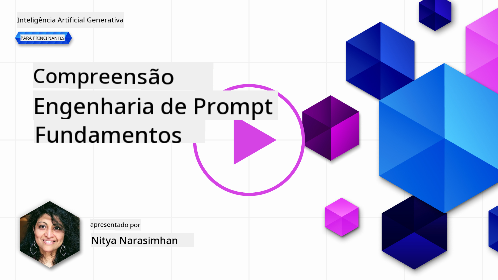
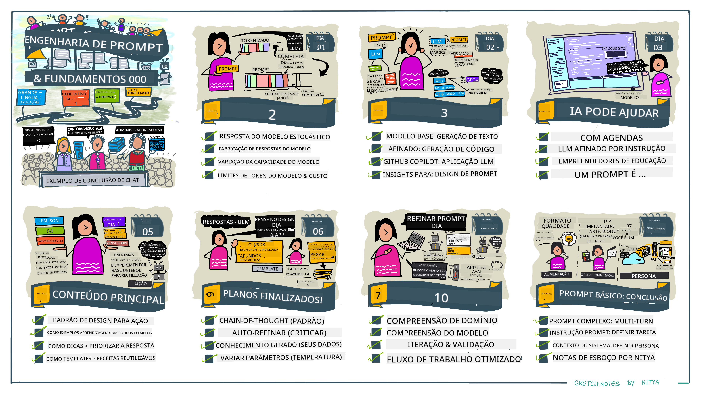
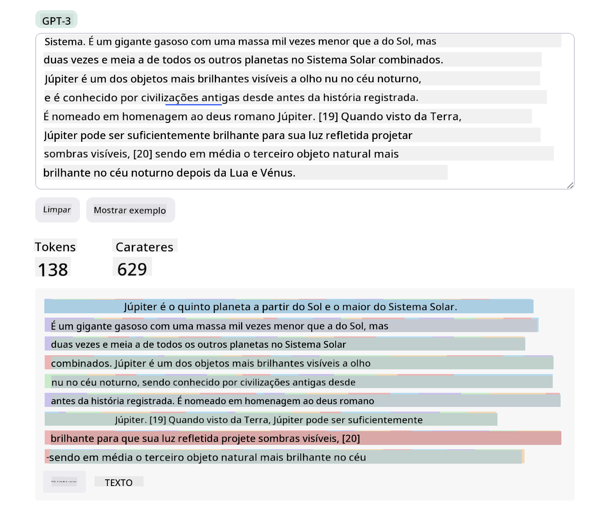
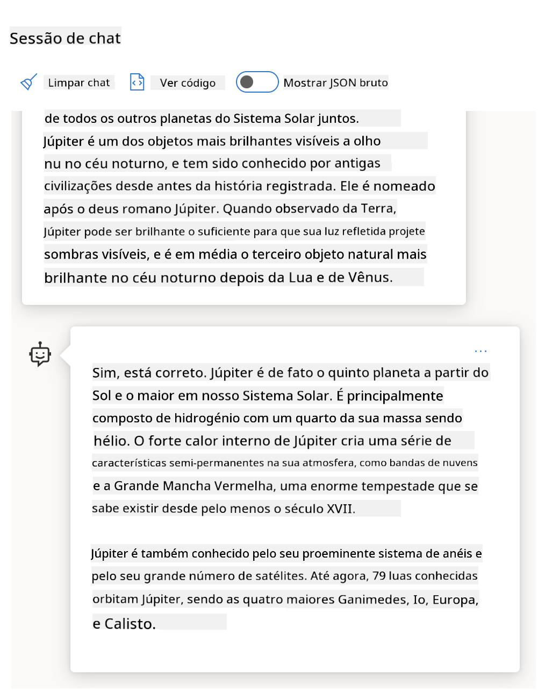
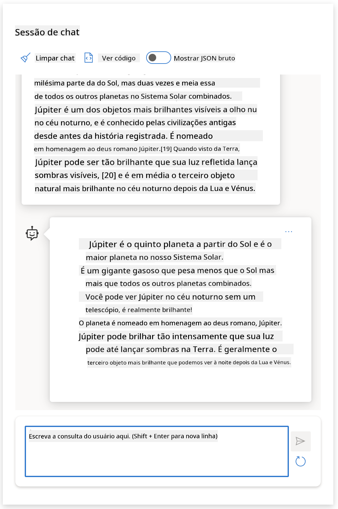
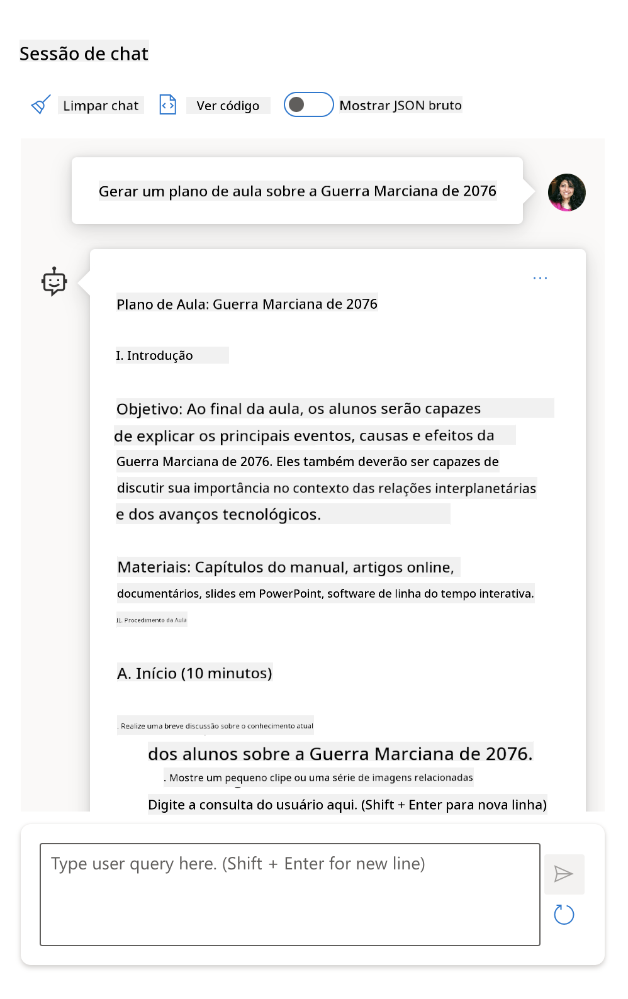
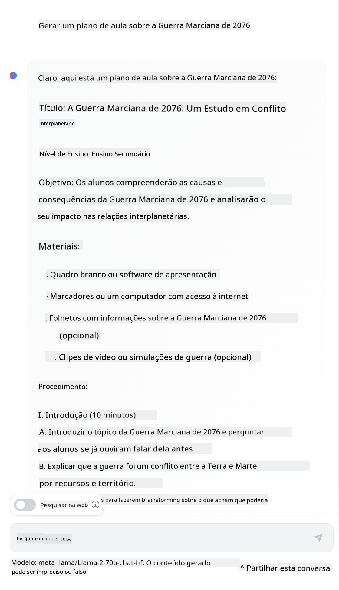

<!--
CO_OP_TRANSLATOR_METADATA:
{
  "original_hash": "a45c318dc6ebc2604f35b8b829f93af2",
  "translation_date": "2025-07-09T10:02:34+00:00",
  "source_file": "04-prompt-engineering-fundamentals/README.md",
  "language_code": "pt"
}
-->
# Fundamentos de Engenharia de Prompts

[](https://aka.ms/gen-ai-lesson4-gh?WT.mc_id=academic-105485-koreyst)

## Introdução  
Este módulo aborda conceitos e técnicas essenciais para criar prompts eficazes em modelos de IA generativa. A forma como escreve o seu prompt para um LLM também é importante. Um prompt cuidadosamente elaborado pode alcançar uma melhor qualidade de resposta. Mas o que significam exatamente termos como _prompt_ e _engenharia de prompts_? E como posso melhorar o _input_ do prompt que envio para o LLM? Estas são as questões que tentaremos responder neste capítulo e no seguinte.

_A IA generativa_ é capaz de criar novo conteúdo (por exemplo, texto, imagens, áudio, código, etc.) em resposta a pedidos dos utilizadores. Isto é conseguido através de _Modelos de Linguagem de Grande Escala_ como a série GPT da OpenAI ("Generative Pre-trained Transformer"), que são treinados para usar linguagem natural e código.

Os utilizadores podem agora interagir com estes modelos usando paradigmas familiares como o chat, sem necessidade de conhecimentos técnicos ou formação. Os modelos são _baseados em prompts_ – os utilizadores enviam um texto (prompt) e recebem a resposta da IA (completação). Podem depois "conversar com a IA" de forma iterativa, em conversas de múltiplas interações, refinando o prompt até que a resposta corresponda às suas expectativas.

Os "prompts" tornam-se assim a principal _interface de programação_ para aplicações de IA generativa, dizendo aos modelos o que fazer e influenciando a qualidade das respostas devolvidas. A "Engenharia de Prompts" é um campo em rápido crescimento que se foca no _design e otimização_ dos prompts para fornecer respostas consistentes e de qualidade em larga escala.

## Objetivos de Aprendizagem

Nesta lição, vamos aprender o que é Engenharia de Prompts, por que é importante e como podemos criar prompts mais eficazes para um dado modelo e objetivo de aplicação. Vamos compreender os conceitos fundamentais e as melhores práticas para engenharia de prompts – e conhecer um ambiente interativo em Jupyter Notebooks onde podemos ver estes conceitos aplicados a exemplos reais.

No final desta lição seremos capazes de:

1. Explicar o que é engenharia de prompts e por que é importante.  
2. Descrever os componentes de um prompt e como são usados.  
3. Aprender as melhores práticas e técnicas para engenharia de prompts.  
4. Aplicar as técnicas aprendidas a exemplos reais, usando um endpoint OpenAI.

## Termos-Chave

Engenharia de Prompts: A prática de desenhar e refinar inputs para guiar modelos de IA a produzir as saídas desejadas.  
Tokenização: O processo de converter texto em unidades menores, chamadas tokens, que um modelo consegue entender e processar.  
LLMs Ajustados por Instruções: Modelos de Linguagem de Grande Escala (LLMs) que foram ajustados com instruções específicas para melhorar a precisão e relevância das suas respostas.

## Ambiente de Aprendizagem

A engenharia de prompts é atualmente mais uma arte do que uma ciência. A melhor forma de melhorar a nossa intuição é _praticar mais_ e adotar uma abordagem de tentativa e erro que combine conhecimento do domínio da aplicação com técnicas recomendadas e otimizações específicas do modelo.

O Jupyter Notebook que acompanha esta lição oferece um ambiente _sandbox_ onde pode experimentar o que aprende – à medida que avança ou como parte do desafio de código no final. Para executar os exercícios, vai precisar de:

1. **Uma chave API Azure OpenAI** – o endpoint do serviço para um LLM implementado.  
2. **Um ambiente Python** – onde o Notebook pode ser executado.  
3. **Variáveis de Ambiente Locais** – _complete agora os passos do [SETUP](./../00-course-setup/SETUP.md?WT.mc_id=academic-105485-koreyst) para estar preparado_.

O notebook inclui exercícios _inicializadores_ – mas é encorajado a adicionar as suas próprias secções de _Markdown_ (descrição) e _Código_ (pedidos de prompt) para experimentar mais exemplos ou ideias – e desenvolver a sua intuição para o design de prompts.

## Guia Ilustrado

Quer ter uma visão geral do que esta lição cobre antes de começar? Veja este guia ilustrado, que lhe dá uma ideia dos principais tópicos abordados e dos pontos-chave para refletir em cada um. O roteiro da lição leva-o desde a compreensão dos conceitos e desafios centrais até à sua resolução com técnicas relevantes de engenharia de prompts e melhores práticas. Note que a secção "Técnicas Avançadas" neste guia refere-se a conteúdos abordados no _próximo_ capítulo deste currículo.



## A Nossa Startup

Agora, vamos falar sobre como _este tema_ se relaciona com a missão da nossa startup de [trazer inovação em IA para a educação](https://educationblog.microsoft.com/2023/06/collaborating-to-bring-ai-innovation-to-education?WT.mc_id=academic-105485-koreyst). Queremos construir aplicações de IA para _aprendizagem personalizada_ – por isso, vamos pensar em como diferentes utilizadores da nossa aplicação podem "desenhar" prompts:

- **Administradores** podem pedir à IA para _analisar dados curriculares e identificar lacunas na cobertura_. A IA pode resumir os resultados ou visualizá-los com código.  
- **Educadores** podem pedir à IA para _gerar um plano de aula para um público-alvo e tema específicos_. A IA pode construir o plano personalizado num formato especificado.  
- **Estudantes** podem pedir à IA para _os ajudar numa disciplina difícil_. A IA pode agora guiar os estudantes com aulas, dicas e exemplos adaptados ao seu nível.

Isto é apenas a ponta do iceberg. Veja [Prompts For Education](https://github.com/microsoft/prompts-for-edu/tree/main?WT.mc_id=academic-105485-koreyst) – uma biblioteca open-source de prompts curada por especialistas em educação – para ter uma noção mais ampla das possibilidades! _Experimente executar alguns desses prompts no sandbox ou no OpenAI Playground para ver o que acontece!_

<!--  
MODELO DE LIÇÃO:  
Esta unidade deve cobrir o conceito central #1.  
Reforce o conceito com exemplos e referências.

CONCEITO #1:  
Engenharia de Prompts.  
Defina e explique por que é necessária.  
-->

## O que é Engenharia de Prompts?

Começámos esta lição definindo **Engenharia de Prompts** como o processo de _desenhar e otimizar_ inputs de texto (prompts) para fornecer respostas consistentes e de qualidade (completações) para um dado objetivo de aplicação e modelo. Podemos pensar nisso como um processo em 2 etapas:

- _desenhar_ o prompt inicial para um dado modelo e objetivo  
- _refinar_ o prompt iterativamente para melhorar a qualidade da resposta

Este é necessariamente um processo de tentativa e erro que requer intuição e esforço do utilizador para obter resultados ótimos. Então, por que é importante? Para responder a essa pergunta, primeiro precisamos entender três conceitos:

- _Tokenização_ = como o modelo "vê" o prompt  
- _LLMs Base_ = como o modelo base "processa" um prompt  
- _LLMs Ajustados por Instruções_ = como o modelo pode agora interpretar "tarefas"

### Tokenização

Um LLM vê os prompts como uma _sequência de tokens_, onde diferentes modelos (ou versões de um modelo) podem tokenizar o mesmo prompt de formas diferentes. Como os LLMs são treinados com tokens (e não com texto bruto), a forma como os prompts são tokenizados tem um impacto direto na qualidade da resposta gerada.

Para ter uma intuição de como a tokenização funciona, experimente ferramentas como o [OpenAI Tokenizer](https://platform.openai.com/tokenizer?WT.mc_id=academic-105485-koreyst) mostrado abaixo. Copie o seu prompt – e veja como ele é convertido em tokens, prestando atenção a como são tratados os espaços em branco e os sinais de pontuação. Note que este exemplo mostra um LLM mais antigo (GPT-3) – por isso, experimentar com um modelo mais recente pode produzir um resultado diferente.



### Conceito: Modelos Base

Depois de um prompt ser tokenizado, a função principal do ["LLM Base"](https://blog.gopenai.com/an-introduction-to-base-and-instruction-tuned-large-language-models-8de102c785a6?WT.mc_id=academic-105485-koreyst) (ou modelo base) é prever o token seguinte nessa sequência. Como os LLMs são treinados com enormes conjuntos de dados textuais, eles têm uma boa noção das relações estatísticas entre tokens e podem fazer essa previsão com alguma confiança. Note que eles não entendem o _significado_ das palavras no prompt ou token; apenas veem um padrão que podem "completar" com a sua próxima previsão. Podem continuar a prever a sequência até serem interrompidos por intervenção do utilizador ou alguma condição predefinida.

Quer ver como funciona a completação baseada em prompt? Insira o prompt acima no Azure OpenAI Studio [_Chat Playground_](https://oai.azure.com/playground?WT.mc_id=academic-105485-koreyst) com as definições padrão. O sistema está configurado para tratar os prompts como pedidos de informação – por isso deverá ver uma resposta que satisfaz este contexto.

Mas e se o utilizador quiser ver algo específico que cumpra certos critérios ou objetivos de tarefa? É aqui que os LLMs _ajustados por instruções_ entram em cena.



### Conceito: LLMs Ajustados por Instruções

Um [LLM Ajustado por Instruções](https://blog.gopenai.com/an-introduction-to-base-and-instruction-tuned-large-language-models-8de102c785a6?WT.mc_id=academic-105485-koreyst) começa com o modelo base e é afinado com exemplos ou pares input/output (por exemplo, "mensagens" de múltiplas interações) que podem conter instruções claras – e a resposta da IA tenta seguir essa instrução.

Isto usa técnicas como Aprendizagem por Reforço com Feedback Humano (RLHF) que podem treinar o modelo para _seguir instruções_ e _aprender com o feedback_, de modo a produzir respostas mais adequadas a aplicações práticas e mais relevantes para os objetivos do utilizador.

Vamos experimentar – volte ao prompt acima, mas agora altere a _mensagem do sistema_ para fornecer a seguinte instrução como contexto:

> _Resuma o conteúdo fornecido para um aluno do segundo ano. Mantenha o resultado num parágrafo com 3-5 pontos principais._

Veja como o resultado está agora ajustado para refletir o objetivo e formato desejados? Um educador pode usar diretamente esta resposta nos seus slides para essa aula.



## Por que precisamos de Engenharia de Prompts?

Agora que sabemos como os prompts são processados pelos LLMs, vamos falar sobre _por que_ precisamos de engenharia de prompts. A resposta está no facto de que os LLMs atuais apresentam vários desafios que tornam mais difícil obter _completações fiáveis e consistentes_ sem esforço na construção e otimização do prompt. Por exemplo:

1. **As respostas dos modelos são estocásticas.** O _mesmo prompt_ provavelmente produzirá respostas diferentes com modelos ou versões diferentes. E pode até produzir resultados diferentes com o _mesmo modelo_ em momentos distintos. _As técnicas de engenharia de prompts podem ajudar a minimizar estas variações, fornecendo melhores limites_.

1. **Os modelos podem inventar respostas.** Os modelos são pré-treinados com conjuntos de dados _grandes mas finitos_, o que significa que não têm conhecimento sobre conceitos fora desse âmbito de treino. Como resultado, podem produzir respostas imprecisas, imaginárias ou diretamente contraditórias a factos conhecidos. _As técnicas de engenharia de prompts ajudam os utilizadores a identificar e mitigar estas invenções, por exemplo, pedindo à IA citações ou raciocínios_.

1. **As capacidades dos modelos variam.** Modelos mais recentes ou gerações novas terão capacidades mais ricas, mas também trazem peculiaridades e compromissos únicos em custo e complexidade. _A engenharia de prompts pode ajudar a desenvolver melhores práticas e fluxos de trabalho que abstraem as diferenças e se adaptam a requisitos específicos do modelo de forma escalável e fluida_.

Vamos ver isto em ação no OpenAI ou Azure OpenAI Playground:

- Use o mesmo prompt com diferentes implementações de LLM (por exemplo, OpenAI, Azure OpenAI, Hugging Face) – notou variações?  
- Use o mesmo prompt repetidamente com a _mesma_ implementação de LLM (por exemplo, Azure OpenAI playground) – como diferiram essas variações?

### Exemplo de Invenções

Neste curso, usamos o termo **"invenção"** para referir o fenómeno em que os LLMs por vezes geram informação factualmente incorreta devido a limitações no seu treino ou outras restrições. Também pode ter ouvido este fenómeno referido como _"alucinações"_ em artigos populares ou trabalhos de investigação. No entanto, recomendamos fortemente usar _"invenção"_ como termo para não antropomorfizar o comportamento, atribuindo uma característica humana a um resultado gerado por máquina. Isto também reforça as [diretrizes de IA responsável](https://www.microsoft.com/ai/responsible-ai?WT.mc_id=academic-105485-koreyst) do ponto de vista terminológico, eliminando termos que podem ser considerados ofensivos ou não inclusivos em alguns contextos.

Quer perceber como funcionam as invenções? Pense num prompt que instrua a IA a gerar conteúdo sobre um tema inexistente (para garantir que não está presente no conjunto de treino). Por exemplo – experimentei este prompt:
# Plano de Aula: A Guerra Marciana de 2076

## Objetivos da Aula
- Compreender as causas e consequências da Guerra Marciana de 2076.
- Analisar os principais eventos e estratégias militares utilizadas durante o conflito.
- Refletir sobre o impacto da guerra na sociedade terrestre e marciana.

## Materiais Necessários
- Slides com cronologia dos eventos
- Vídeos documentais sobre a Guerra Marciana
- Mapas interativos do sistema solar
- Artigos e relatos de testemunhas oculares

## Estrutura da Aula

### 1. Introdução (15 minutos)
- Apresentar o contexto histórico e político que levou à Guerra Marciana.
- Explicar a importância do planeta Marte para a humanidade em 2076.
- Mostrar um breve vídeo introdutório.

### 2. Desenvolvimento (40 minutos)
- Detalhar as principais batalhas e estratégias militares.
- Discutir as tecnologias utilizadas por ambos os lados.
- Analisar as consequências imediatas do conflito para a Terra e Marte.
- Atividade em grupo: debate sobre as decisões tomadas pelos líderes durante a guerra.

### 3. Conclusão (15 minutos)
- Recapitular os pontos-chave da aula.
- Refletir sobre as lições aprendidas com a Guerra Marciana.
- Propor uma atividade de escrita: imaginar um futuro pós-guerra e descrever como seria a vida em Marte.

## Avaliação
- Participação no debate em grupo.
- Trabalho escrito sobre o futuro pós-guerra.
- Questionário de compreensão sobre os eventos da Guerra Marciana.

## Comentários Finais
- Incentivar os alunos a pesquisarem mais sobre a exploração espacial e os desafios da colonização de outros planetas.
- Destacar a importância da diplomacia para evitar conflitos interplanetários no futuro.
Uma pesquisa na web mostrou-me que existiam relatos fictícios (por exemplo, séries de televisão ou livros) sobre guerras em Marte – mas nenhum em 2076. O bom senso também nos diz que 2076 está _no futuro_ e, portanto, não pode estar associado a um evento real.

Então, o que acontece quando executamos este prompt com diferentes fornecedores de LLM?

> **Resposta 1**: OpenAI Playground (GPT-35)


> **Resposta 2**: Azure OpenAI Playground (GPT-35)



> **Resposta 3**: : Hugging Face Chat Playground (LLama-2)



Como esperado, cada modelo (ou versão do modelo) produz respostas ligeiramente diferentes graças ao comportamento estocástico e às variações na capacidade do modelo. Por exemplo, um modelo dirige-se a um público do 8º ano enquanto o outro assume um estudante do ensino secundário. Mas os três modelos geraram respostas que poderiam convencer um utilizador desinformado de que o evento era real.

Técnicas de engenharia de prompts como _metaprompting_ e _configuração de temperatura_ podem reduzir as fabricacões do modelo até certo ponto. Novas _arquiteturas_ de engenharia de prompts também incorporam novas ferramentas e técnicas de forma integrada no fluxo do prompt, para mitigar ou reduzir alguns destes efeitos.

## Estudo de Caso: GitHub Copilot

Vamos terminar esta secção tendo uma ideia de como a engenharia de prompts é usada em soluções do mundo real, olhando para um Estudo de Caso: [GitHub Copilot](https://github.com/features/copilot?WT.mc_id=academic-105485-koreyst).

O GitHub Copilot é o seu "Programador Parceiro de IA" – converte prompts de texto em completamentos de código e está integrado no seu ambiente de desenvolvimento (por exemplo, Visual Studio Code) para uma experiência de utilizador fluida. Conforme documentado na série de blogs abaixo, a versão inicial baseava-se no modelo OpenAI Codex – com os engenheiros a perceberem rapidamente a necessidade de ajustar o modelo e desenvolver melhores técnicas de engenharia de prompts para melhorar a qualidade do código. Em julho, eles [lançaram um modelo de IA melhorado que vai além do Codex](https://github.blog/2023-07-28-smarter-more-efficient-coding-github-copilot-goes-beyond-codex-with-improved-ai-model/?WT.mc_id=academic-105485-koreyst) para sugestões ainda mais rápidas.

Leia os posts por ordem para acompanhar a sua jornada de aprendizagem.

- **Maio 2023** | [O GitHub Copilot está a melhorar na compreensão do seu código](https://github.blog/2023-05-17-how-github-copilot-is-getting-better-at-understanding-your-code/?WT.mc_id=academic-105485-koreyst)
- **Maio 2023** | [Dentro do GitHub: Trabalhar com os LLMs por trás do GitHub Copilot](https://github.blog/2023-05-17-inside-github-working-with-the-llms-behind-github-copilot/?WT.mc_id=academic-105485-koreyst)
- **Junho 2023** | [Como escrever melhores prompts para o GitHub Copilot](https://github.blog/2023-06-20-how-to-write-better-prompts-for-github-copilot/?WT.mc_id=academic-105485-koreyst)
- **Julho 2023** | [.. GitHub Copilot vai além do Codex com modelo de IA melhorado](https://github.blog/2023-07-28-smarter-more-efficient-coding-github-copilot-goes-beyond-codex-with-improved-ai-model/?WT.mc_id=academic-105485-koreyst)
- **Julho 2023** | [Guia do Programador para Engenharia de Prompts e LLMs](https://github.blog/2023-07-17-prompt-engineering-guide-generative-ai-llms/?WT.mc_id=academic-105485-koreyst)
- **Setembro 2023** | [Como construir uma aplicação empresarial com LLM: Lições do GitHub Copilot](https://github.blog/2023-09-06-how-to-build-an-enterprise-llm-application-lessons-from-github-copilot/?WT.mc_id=academic-105485-koreyst)

Pode também explorar o seu [blog de Engenharia](https://github.blog/category/engineering/?WT.mc_id=academic-105485-koreyst) para mais posts como [este](https://github.blog/2023-09-27-how-i-used-github-copilot-chat-to-build-a-reactjs-gallery-prototype/?WT.mc_id=academic-105485-koreyst) que mostra como estes modelos e técnicas são _aplicados_ para impulsionar aplicações do mundo real.

---

<!--
MODELO DE LIÇÃO:
Esta unidade deve cobrir o conceito principal #2.
Reforce o conceito com exemplos e referências.

CONCEITO #2:
Design de Prompt.
Ilustrado com exemplos.
-->

## Construção de Prompt

Já vimos porque a engenharia de prompts é importante – agora vamos entender como os prompts são _construídos_ para podermos avaliar diferentes técnicas para um design de prompt mais eficaz.

### Prompt Básico

Vamos começar com o prompt básico: uma entrada de texto enviada ao modelo sem outro contexto. Aqui está um exemplo – quando enviamos as primeiras palavras do hino nacional dos EUA para a OpenAI [Completion API](https://platform.openai.com/docs/api-reference/completions?WT.mc_id=academic-105485-koreyst) ele instantaneamente _completa_ a resposta com as linhas seguintes, ilustrando o comportamento básico de previsão.

| Prompt (Entrada)     | Completação (Saída)                                                                                                                        |
| :----------------- | :----------------------------------------------------------------------------------------------------------------------------------------- |
| Oh say can you see | Parece que está a começar a letra de "The Star-Spangled Banner", o hino nacional dos Estados Unidos. A letra completa é ... |

### Prompt Complexo

Agora vamos adicionar contexto e instruções a esse prompt básico. A [Chat Completion API](https://learn.microsoft.com/azure/ai-services/openai/how-to/chatgpt?WT.mc_id=academic-105485-koreyst) permite-nos construir um prompt complexo como uma coleção de _mensagens_ com:

- Pares de entrada/saída que refletem a entrada do _utilizador_ e a resposta do _assistente_.
- Mensagem do sistema que define o contexto para o comportamento ou personalidade do assistente.

O pedido está agora na forma abaixo, onde a _tokenização_ captura efetivamente a informação relevante do contexto e da conversa. Agora, mudar o contexto do sistema pode ser tão impactante na qualidade das completions quanto as entradas do utilizador fornecidas.

```python
response = openai.chat.completions.create(
    model="gpt-3.5-turbo",
    messages=[
        {"role": "system", "content": "You are a helpful assistant."},
        {"role": "user", "content": "Who won the world series in 2020?"},
        {"role": "assistant", "content": "The Los Angeles Dodgers won the World Series in 2020."},
        {"role": "user", "content": "Where was it played?"}
    ]
)
```

### Prompt de Instrução

Nos exemplos acima, o prompt do utilizador foi uma simples pergunta de texto que pode ser interpretada como um pedido de informação. Com prompts de _instrução_, podemos usar esse texto para especificar uma tarefa com mais detalhe, fornecendo uma orientação melhor à IA. Aqui está um exemplo:

| Prompt (Entrada)                                                                                                                                                                                                                         | Completação (Saída)                                                                                                        | Tipo de Instrução    |
| :------------------------------------------------------------------------------------------------------------------------------------------------------------------------------------------------------------------------------------- | :------------------------------------------------------------------------------------------------------------------------- | :------------------ |
| Escreve uma descrição da Guerra Civil                                                                                                                                                                                                   | _retornou um parágrafo simples_                                                                                              | Simples              |
| Escreve uma descrição da Guerra Civil. Fornece datas e eventos chave e descreve a sua importância                                                                                                                                     | _retornou um parágrafo seguido de uma lista de datas de eventos chave com descrições_                                             | Complexo             |
| Escreve uma descrição da Guerra Civil em 1 parágrafo. Fornece 3 pontos com datas chave e a sua importância. Fornece mais 3 pontos com figuras históricas importantes e as suas contribuições. Retorna a saída num ficheiro JSON | _retorna detalhes mais extensos numa caixa de texto, formatados como JSON que pode copiar e colar para um ficheiro e validar conforme necessário_ | Complexo. Formatado. |

## Conteúdo Principal

Nos exemplos acima, o prompt ainda era bastante aberto, permitindo ao LLM decidir que parte do seu conjunto de dados pré-treinado era relevante. Com o padrão de design de _conteúdo principal_, o texto de entrada é dividido em duas partes:

- uma instrução (ação)
- conteúdo relevante (que influencia a ação)

Aqui está um exemplo onde a instrução é "resume isto em 2 frases".

| Prompt (Entrada)                                                                                                                                                                                                                                                                                                                                                                                                                                                                                                                                                                                                                                                                                      | Completação (Saída)                                                                                                                                                                                                                                                                             |
| :-------------------------------------------------------------------------------------------------------------------------------------------------------------------------------------------------------------------------------------------------------------------------------------------------------------------------------------------------------------------------------------------------------------------------------------------------------------------------------------------------------------------------------------------------------------------------------------------------------------------------------------------------------------------------------------------------- | :---------------------------------------------------------------------------------------------------------------------------------------------------------------------------------------------------------------------------------------------------------------------------------------------- |
| Júpiter é o quinto planeta a partir do Sol e o maior do Sistema Solar. É um gigante gasoso com uma massa mil vezes menor que a do Sol, mas duas vezes e meia a massa de todos os outros planetas do Sistema Solar juntos. Júpiter é um dos objetos mais brilhantes visíveis a olho nu no céu noturno, e tem sido conhecido por civilizações antigas desde antes da história registada. É nomeado em homenagem ao deus romano Júpiter.[19] Quando visto da Terra, Júpiter pode ser suficientemente brilhante para que a sua luz refletida projete sombras visíveis,[20] e é em média o terceiro objeto natural mais brilhante no céu noturno depois da Lua e Vénus. <br/> **Resume isto em 2 frases curtas** | Júpiter, o quinto planeta a partir do Sol, é o maior do Sistema Solar e é conhecido por ser um dos objetos mais brilhantes no céu noturno. Nomeado em homenagem ao deus romano Júpiter, é um gigante gasoso cuja massa é duas vezes e meia a de todos os outros planetas do Sistema Solar juntos. |

O segmento de conteúdo principal pode ser usado de várias formas para conduzir instruções mais eficazes:

- **Exemplos** – em vez de dizer ao modelo o que fazer com uma instrução explícita, dê-lhe exemplos do que fazer e deixe-o inferir o padrão.
- **Pistas** – siga a instrução com uma "pista" que prepara a completitude, guiando o modelo para respostas mais relevantes.
- **Modelos** – são 'receitas' repetíveis para prompts com espaços reservados (variáveis) que podem ser personalizados com dados para casos de uso específicos.

Vamos explorar estes em ação.

### Usar Exemplos

Esta é uma abordagem onde usa o conteúdo principal para "alimentar o modelo" com alguns exemplos do resultado desejado para uma dada instrução, e deixa-o inferir o padrão para o resultado pretendido. Com base no número de exemplos fornecidos, podemos ter prompting zero-shot, one-shot, few-shot, etc.

O prompt agora consiste em três componentes:

- Uma descrição da tarefa
- Alguns exemplos do resultado desejado
- O início de um novo exemplo (que se torna uma descrição implícita da tarefa)

| Tipo de Aprendizagem | Prompt (Entrada)                                                                                                                                        | Completação (Saída)         |
| :------------ | :---------------------------------------------------------------------------------------------------------------------------------------------------- | :-------------------------- |
| Zero-shot     | "O Sol está a brilhar". Traduz para espanhol                                                                                                            | "El Sol está brillando".    |
| One-shot      | "O Sol está a brilhar" => ""El Sol está brillando". <br> "É um dia frio e ventoso" =>                                                                 | "Es un día frío y ventoso". |
| Few-shot      | O jogador correu as bases => Baseball <br/> O jogador fez um ace => Ténis <br/> O jogador marcou um seis => Críquete <br/> O jogador fez um slam-dunk => | Basquetebol                |
|               |                                                                                                                                                       |                             |

Note como tivemos de fornecer uma instrução explícita ("Traduz para espanhol") no prompting zero-shot, mas esta é inferida no exemplo one-shot. O exemplo few-shot mostra como adicionar mais exemplos permite aos modelos fazer inferências mais precisas sem instruções adicionais.

### Pistas no Prompt

Outra técnica para usar o conteúdo principal é fornecer _pistas_ em vez de exemplos. Neste caso, estamos a dar ao modelo um empurrão na direção certa ao _começar_ com um excerto que reflete o formato de resposta desejado. O modelo então "aproveita a pista" para continuar nesse sentido.

| Número de Pistas | Prompt (Entrada)                                                                                                                                                                                                                                                                                                                                                                                                                                               | Completação (Saída)                                                                                                                                                                                                                                                                                       |
| :------------- | :----------------------------------------------------------------------------------------------------------------------------------------------------------------------------------------------------------------------------------------------------------------------------------------------------------------------------------------------------------------------------------------------------------------------------------------------------------- | :-------------------------------------------------------------------------------------------------------------------------------------------------------------------------------------------------------------------------------------------------------------------------------------------------------- |
| 0              | Júpiter é o quinto planeta a partir do Sol e o maior do Sistema Solar. É um gigante gasoso com uma massa mil vezes menor que a do Sol, mas duas vezes e meia a massa de todos os outros planetas do Sistema Solar juntos. Júpiter é um dos objetos mais brilhantes visíveis a olho nu no céu noturno, e tem sido conhecido por civilizações antigas desde antes da história registada.

**Resumir Isto**                                       | Júpiter é o maior planeta do nosso Sistema Solar e o quinto a contar do Sol. É um gigante gasoso com uma massa equivalente a 1/1000 da do Sol, mas é mais pesado do que todos os outros planetas juntos. Civilizações antigas conhecem Júpiter há muito tempo, e ele é facilmente visível no céu noturno. |
| 1              | Júpiter é o quinto planeta a contar do Sol e o maior do Sistema Solar. É um gigante gasoso com uma massa equivalente a um milésimo da do Sol, mas duas vezes e meia a massa de todos os outros planetas do Sistema Solar juntos. Júpiter é um dos objetos mais brilhantes visíveis a olho nu no céu noturno, e é conhecido por civilizações antigas desde antes da história registada. <br/>**Resumir Isto** <br/> O que aprendemos é que Júpiter | é o quinto planeta a contar do Sol e o maior do Sistema Solar. É um gigante gasoso com uma massa equivalente a um milésimo da do Sol, mas duas vezes e meia a massa de todos os outros planetas juntos. É facilmente visível a olho nu e é conhecido desde a antiguidade.                        |
| 2              | Júpiter é o quinto planeta a contar do Sol e o maior do Sistema Solar. É um gigante gasoso com uma massa equivalente a um milésimo da do Sol, mas duas vezes e meia a massa de todos os outros planetas do Sistema Solar juntos. Júpiter é um dos objetos mais brilhantes visíveis a olho nu no céu noturno, e é conhecido por civilizações antigas desde antes da história registada. <br/>**Resumir Isto** <br/> Top 3 Factos que Aprendemos:         | 1. Júpiter é o quinto planeta a contar do Sol e o maior do Sistema Solar. <br/> 2. É um gigante gasoso com uma massa equivalente a um milésimo da do Sol...<br/> 3. Júpiter tem sido visível a olho nu desde a antiguidade ...                                                                       |
|                |                                                                                                                                                                                                                                                                                                                                                                                                                                                              |                                                                                                                                                                                                                                                                                                           |

### Modelos de Prompt

Um modelo de prompt é uma _receita pré-definida para um prompt_ que pode ser guardada e reutilizada conforme necessário, para proporcionar experiências de utilizador mais consistentes em larga escala. Na sua forma mais simples, é simplesmente uma coleção de exemplos de prompt como [este da OpenAI](https://platform.openai.com/examples?WT.mc_id=academic-105485-koreyst) que fornece tanto os componentes interativos do prompt (mensagens do utilizador e do sistema) como o formato de pedido orientado pela API – para suportar a reutilização.

Na sua forma mais complexa, como [este exemplo da LangChain](https://python.langchain.com/docs/concepts/prompt_templates/?WT.mc_id=academic-105485-koreyst), contém _placeholders_ que podem ser substituídos por dados de várias fontes (entrada do utilizador, contexto do sistema, fontes de dados externas, etc.) para gerar um prompt dinamicamente. Isto permite criar uma biblioteca de prompts reutilizáveis que podem ser usados para proporcionar experiências de utilizador consistentes **programaticamente** em larga escala.

Finalmente, o verdadeiro valor dos modelos está na capacidade de criar e publicar _bibliotecas de prompts_ para domínios de aplicação verticais – onde o modelo de prompt é agora _otimizado_ para refletir contextos ou exemplos específicos da aplicação que tornam as respostas mais relevantes e precisas para o público-alvo. O repositório [Prompts For Edu](https://github.com/microsoft/prompts-for-edu?WT.mc_id=academic-105485-koreyst) é um excelente exemplo desta abordagem, reunindo uma biblioteca de prompts para o domínio da educação com ênfase em objetivos chave como planeamento de aulas, design curricular, tutoria a estudantes, etc.

## Conteúdo de Apoio

Se pensarmos na construção de um prompt como tendo uma instrução (tarefa) e um alvo (conteúdo principal), então o _conteúdo secundário_ é como um contexto adicional que fornecemos para **influenciar a saída de alguma forma**. Pode ser parâmetros de afinação, instruções de formatação, taxonomias de tópicos, etc., que ajudam o modelo a _adaptar_ a sua resposta para corresponder aos objetivos ou expectativas do utilizador.

Por exemplo: Dado um catálogo de cursos com metadados extensos (nome, descrição, nível, etiquetas de metadados, instrutor, etc.) sobre todos os cursos disponíveis no currículo:

- podemos definir uma instrução para "resumir o catálogo de cursos para o Outono de 2023"
- podemos usar o conteúdo principal para fornecer alguns exemplos do resultado desejado
- podemos usar o conteúdo secundário para identificar as 5 principais "etiquetas" de interesse.

Agora, o modelo pode fornecer um resumo no formato mostrado pelos exemplos – mas se um resultado tiver múltiplas etiquetas, pode priorizar as 5 etiquetas identificadas no conteúdo secundário.

---

<!--
MODELO DE AULA:
Esta unidade deve cobrir o conceito principal #1.
Reforce o conceito com exemplos e referências.

CONCEITO #3:
Técnicas de Engenharia de Prompt.
Quais são algumas técnicas básicas para engenharia de prompt?
Ilustre com alguns exercícios.
-->

## Melhores Práticas para Prompting

Agora que sabemos como os prompts podem ser _construídos_, podemos começar a pensar em como _desenhá-los_ para refletir as melhores práticas. Podemos pensar nisso em duas partes – ter a _mentalidade_ certa e aplicar as _técnicas_ corretas.

### Mentalidade de Engenharia de Prompt

A Engenharia de Prompt é um processo de tentativa e erro, por isso tenha em mente três fatores orientadores gerais:

1. **Compreensão do Domínio é Importante.** A precisão e relevância da resposta dependem do _domínio_ em que a aplicação ou utilizador opera. Use a sua intuição e conhecimento do domínio para **personalizar as técnicas**. Por exemplo, defina _personalidades específicas do domínio_ nos seus prompts de sistema, ou use _modelos específicos do domínio_ nos seus prompts de utilizador. Forneça conteúdo secundário que reflita contextos específicos do domínio, ou use _pistas e exemplos específicos do domínio_ para guiar o modelo para padrões de uso familiares.

2. **Compreensão do Modelo é Importante.** Sabemos que os modelos são estocásticos por natureza. Mas as implementações do modelo podem também variar em termos do conjunto de dados de treino que usam (conhecimento pré-treinado), das capacidades que oferecem (por exemplo, via API ou SDK) e do tipo de conteúdo para o qual estão otimizados (por exemplo, código vs imagens vs texto). Compreenda os pontos fortes e limitações do modelo que está a usar, e use esse conhecimento para _priorizar tarefas_ ou construir _modelos personalizados_ otimizados para as capacidades do modelo.

3. **Iteração e Validação são Importantes.** Os modelos estão a evoluir rapidamente, e também as técnicas de engenharia de prompt. Como especialista no domínio, pode ter outro contexto ou critérios para a sua aplicação específica, que podem não se aplicar à comunidade em geral. Use ferramentas e técnicas de engenharia de prompt para "dar o pontapé de saída" na construção do prompt, depois itere e valide os resultados usando a sua própria intuição e conhecimento do domínio. Registe as suas perceções e crie uma **base de conhecimento** (por exemplo, bibliotecas de prompts) que possam ser usadas como nova referência por outros, para iterações mais rápidas no futuro.

## Melhores Práticas

Vamos agora ver algumas melhores práticas comuns recomendadas pelos praticantes da [OpenAI](https://help.openai.com/en/articles/6654000-best-practices-for-prompt-engineering-with-openai-api?WT.mc_id=academic-105485-koreyst) e [Azure OpenAI](https://learn.microsoft.com/azure/ai-services/openai/concepts/prompt-engineering#best-practices?WT.mc_id=academic-105485-koreyst).

| O Quê                             | Porquê                                                                                                                                                                                                                                            |
| :-------------------------------- | :------------------------------------------------------------------------------------------------------------------------------------------------------------------------------------------------------------------------------------------------ |
| Avalie os modelos mais recentes.  | Novas gerações de modelos provavelmente têm funcionalidades e qualidade melhoradas – mas podem também implicar custos mais elevados. Avalie o impacto e depois tome decisões de migração.                                                         |
| Separe instruções e contexto      | Verifique se o seu modelo/fornecedor define _delimitadores_ para distinguir instruções, conteúdo principal e secundário de forma mais clara. Isto pode ajudar os modelos a atribuir pesos mais precisos aos tokens.                              |
| Seja específico e claro           | Dê mais detalhes sobre o contexto desejado, resultado, extensão, formato, estilo, etc. Isto melhora tanto a qualidade como a consistência das respostas. Registe receitas em modelos reutilizáveis.                                               |
| Seja descritivo, use exemplos     | Os modelos podem responder melhor a uma abordagem de "mostrar e contar". Comece com uma abordagem `zero-shot` onde dá uma instrução (mas sem exemplos) e depois experimente `few-shot` como refinamento, fornecendo alguns exemplos do resultado desejado. Use analogias. |
| Use pistas para iniciar respostas | Incentive o modelo para um resultado desejado dando-lhe algumas palavras ou frases iniciais que possa usar como ponto de partida para a resposta.                                                                                                |
| Reforce                         | Por vezes pode ser necessário repetir-se para o modelo. Dê instruções antes e depois do conteúdo principal, use uma instrução e uma pista, etc. Itere e valide para ver o que funciona.                                                          |
| A ordem importa                  | A ordem em que apresenta a informação ao modelo pode influenciar a saída, mesmo nos exemplos de aprendizagem, devido ao viés de recência. Experimente diferentes opções para ver o que funciona melhor.                                           |
| Dê ao modelo uma “saída”         | Dê ao modelo uma resposta de _fallback_ que possa fornecer se não conseguir completar a tarefa por qualquer motivo. Isto pode reduzir a probabilidade de o modelo gerar respostas falsas ou inventadas.                                          |
|                                 |                                                                                                                                                                                                                                                   |

Como em qualquer melhor prática, lembre-se que _os resultados podem variar_ consoante o modelo, a tarefa e o domínio. Use estas recomendações como ponto de partida e itere para encontrar o que funciona melhor para si. Reavalie constantemente o seu processo de engenharia de prompt à medida que novos modelos e ferramentas ficam disponíveis, com foco na escalabilidade do processo e na qualidade da resposta.

<!--
MODELO DE AULA:
Esta unidade deve fornecer um desafio de código, se aplicável

DESAFIO:
Link para um Jupyter Notebook com apenas os comentários de código nas instruções (as secções de código estão vazias).

SOLUÇÃO:
Link para uma cópia desse Notebook com os prompts preenchidos e executados, mostrando um exemplo de resultado.
-->

## Tarefa

Parabéns! Chegou ao fim da lição! É hora de pôr alguns desses conceitos e técnicas à prova com exemplos reais!

Para a nossa tarefa, vamos usar um Jupyter Notebook com exercícios que pode completar interativamente. Pode também expandir o Notebook com as suas próprias células de Markdown e Código para explorar ideias e técnicas por conta própria.

### Para começar, faça um fork do repositório, depois

- (Recomendado) Inicie o GitHub Codespaces
- (Alternativamente) Clone o repositório para o seu dispositivo local e use-o com Docker Desktop
- (Alternativamente) Abra o Notebook com o seu ambiente de runtime preferido.

### A seguir, configure as suas variáveis de ambiente

- Copie o ficheiro `.env.copy` na raiz do repositório para `.env` e preencha os valores `AZURE_OPENAI_API_KEY`, `AZURE_OPENAI_ENDPOINT` e `AZURE_OPENAI_DEPLOYMENT`. Volte à [secção Learning Sandbox](../../../04-prompt-engineering-fundamentals/04-prompt-engineering-fundamentals) para aprender como.

### Depois, abra o Jupyter Notebook

- Selecione o kernel de runtime. Se usar as opções 1 ou 2, basta selecionar o kernel Python 3.10.x padrão fornecido pelo contentor de desenvolvimento.

Está tudo pronto para executar os exercícios. Note que não existem respostas _certas ou erradas_ aqui – apenas explorar opções por tentativa e erro e construir intuição sobre o que funciona para um dado modelo e domínio de aplicação.

_Por esta razão, não existem segmentos de Solução de Código nesta lição. Em vez disso, o Notebook terá células Markdown intituladas "A Minha Solução:" que mostram um exemplo de saída para referência._

 <!--
MODELO DE AULA:
Encerre a secção com um resumo e recursos para aprendizagem autónoma.
-->

## Verificação de Conhecimento

Qual dos seguintes é um bom prompt seguindo algumas práticas recomendadas razoáveis?

1. Mostra-me uma imagem de um carro vermelho  
2. Mostra-me uma imagem de um carro vermelho da marca Volvo e modelo XC90 estacionado junto a um penhasco com o sol a pôr-se  
3. Mostra-me uma imagem de um carro vermelho da marca Volvo e modelo XC90

R: 2, é o melhor prompt pois fornece detalhes sobre o "quê" e entra em pormenores (não é qualquer carro, mas uma marca e modelo específicos) e também descreve o cenário geral. O 3 é o segundo melhor pois também contém muita descrição.

## 🚀 Desafio

Veja se consegue usar a técnica da "pista" com o prompt: Complete a frase "Mostra-me uma imagem de um carro vermelho da marca Volvo e ". O que responde, e como melhoraria?

## Excelente Trabalho! Continue a Aprender

Quer aprender mais sobre diferentes conceitos de Engenharia de Prompt? Vá à [página de aprendizagem contínua](https://aka.ms/genai-collection?WT.mc_id=academic-105485-koreyst) para encontrar outros ótimos recursos sobre este tema.

Siga para a Lição 5 onde vamos explorar [técnicas avançadas de prompting](../05-advanced-prompts/README.md?WT.mc_id=academic-105485-koreyst)!

**Aviso Legal**:  
Este documento foi traduzido utilizando o serviço de tradução automática [Co-op Translator](https://github.com/Azure/co-op-translator). Embora nos esforcemos por garantir a precisão, por favor tenha em conta que traduções automáticas podem conter erros ou imprecisões. O documento original na sua língua nativa deve ser considerado a fonte autorizada. Para informações críticas, recomenda-se a tradução profissional humana. Não nos responsabilizamos por quaisquer mal-entendidos ou interpretações incorretas decorrentes da utilização desta tradução.