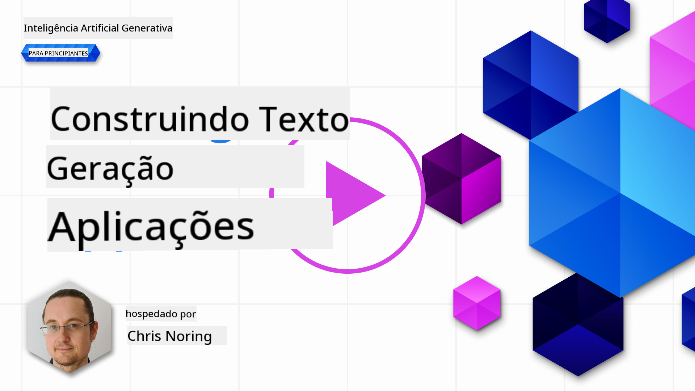

<!--
CO_OP_TRANSLATOR_METADATA:
{
  "original_hash": "5ec6c92b629564538ef397c550adb73e",
  "translation_date": "2025-06-25T14:18:15+00:00",
  "source_file": "06-text-generation-apps/README.md",
  "language_code": "pt"
}
-->
# Construindo Aplicações de Geração de Texto

[](https://aka.ms/gen-ai-lesson6-gh?WT.mc_id=academic-105485-koreyst)

> _(Clique na imagem acima para ver o vídeo desta lição)_

Até agora, você viu através deste currículo que há conceitos centrais como prompts e até mesmo uma disciplina inteira chamada "engenharia de prompts". Muitas ferramentas com as quais você pode interagir, como ChatGPT, Office 365, Microsoft Power Platform e mais, permitem que você use prompts para realizar algo.

Para adicionar tal experiência a um aplicativo, você precisa entender conceitos como prompts, conclusões e escolher uma biblioteca para trabalhar. É exatamente isso que você aprenderá neste capítulo.

## Introdução

Neste capítulo, você irá:

- Aprender sobre a biblioteca openai e seus conceitos principais.
- Construir um aplicativo de geração de texto usando openai.
- Entender como usar conceitos como prompt, temperatura e tokens para construir um aplicativo de geração de texto.

## Objetivos de aprendizagem

Ao final desta lição, você será capaz de:

- Explicar o que é um aplicativo de geração de texto.
- Construir um aplicativo de geração de texto usando openai.
- Configurar seu aplicativo para usar mais ou menos tokens e também alterar a temperatura, para uma saída variada.

## O que é um aplicativo de geração de texto?

Normalmente, quando você constrói um aplicativo, ele possui algum tipo de interface como as seguintes:

- Baseado em comandos. Aplicativos de console são típicos onde você digita um comando e ele executa uma tarefa. Por exemplo, `git` é um aplicativo baseado em comandos.
- Interface de usuário (UI). Alguns aplicativos têm interfaces gráficas de usuário (GUIs) onde você clica em botões, insere texto, seleciona opções e mais.

### Aplicativos de console e UI são limitados

Compare isso a um aplicativo baseado em comandos onde você digita um comando:

- **É limitado**. Você não pode simplesmente digitar qualquer comando, apenas aqueles que o aplicativo suporta.
- **Específico de idioma**. Alguns aplicativos suportam muitos idiomas, mas por padrão o aplicativo é construído para um idioma específico, mesmo que você possa adicionar mais suporte de idioma.

### Benefícios dos aplicativos de geração de texto

Então, como um aplicativo de geração de texto é diferente?

Em um aplicativo de geração de texto, você tem mais flexibilidade, não está limitado a um conjunto de comandos ou um idioma de entrada específico. Em vez disso, você pode usar a linguagem natural para interagir com o aplicativo. Outro benefício é que, como você já está interagindo com uma fonte de dados que foi treinada em um vasto corpus de informações, enquanto um aplicativo tradicional pode ser limitado ao que está em um banco de dados.

### O que posso construir com um aplicativo de geração de texto?

Há muitas coisas que você pode construir. Por exemplo:

- **Um chatbot**. Um chatbot respondendo perguntas sobre tópicos, como sua empresa e seus produtos, pode ser uma boa combinação.
- **Assistente**. LLMs são ótimos em coisas como resumir texto, obter insights de texto, produzir texto como currículos e mais.
- **Assistente de código**. Dependendo do modelo de linguagem que você usa, pode construir um assistente de código que o ajuda a escrever código. Por exemplo, você pode usar um produto como o GitHub Copilot, bem como o ChatGPT, para ajudar a escrever código.

## Como posso começar?

Bem, você precisa encontrar uma maneira de integrar com um LLM, o que geralmente implica as duas abordagens seguintes:

- Usar uma API. Aqui você está construindo solicitações web com seu prompt e obtendo texto gerado de volta.
- Usar uma biblioteca. Bibliotecas ajudam a encapsular as chamadas de API e torná-las mais fáceis de usar.

## Bibliotecas/SDKs

Existem algumas bibliotecas bem conhecidas para trabalhar com LLMs como:

- **openai**, esta biblioteca facilita a conexão com seu modelo e o envio de prompts.

Depois, há bibliotecas que operam em um nível mais alto, como:

- **Langchain**. Langchain é bem conhecida e suporta Python.
- **Semantic Kernel**. Semantic Kernel é uma biblioteca da Microsoft que suporta as linguagens C#, Python e Java.

## Primeiro aplicativo usando openai

Vamos ver como podemos construir nosso primeiro aplicativo, quais bibliotecas precisamos, quanto é necessário e assim por diante.

### Instalar openai

Existem muitas bibliotecas para interagir com OpenAI ou Azure OpenAI. É possível usar várias linguagens de programação como C#, Python, JavaScript, Java e mais. Escolhemos usar a biblioteca `openai` Python, então usaremos `pip` para instalá-la.

```bash
pip install openai
```

### Criar um recurso

Você precisa realizar as seguintes etapas:

- Criar uma conta no Azure [https://azure.microsoft.com/free/](https://azure.microsoft.com/free/?WT.mc_id=academic-105485-koreyst).
- Obter acesso ao Azure OpenAI. Vá para [https://learn.microsoft.com/azure/ai-services/openai/overview#how-do-i-get-access-to-azure-openai](https://learn.microsoft.com/azure/ai-services/openai/overview#how-do-i-get-access-to-azure-openai?WT.mc_id=academic-105485-koreyst) e solicite acesso.

  > [!NOTE]
  > No momento da escrita, você precisa se inscrever para acessar o Azure OpenAI.

- Instalar Python <https://www.python.org/>
- Ter criado um recurso de Serviço Azure OpenAI. Veja este guia sobre como [criar um recurso](https://learn.microsoft.com/azure/ai-services/openai/how-to/create-resource?pivots=web-portal?WT.mc_id=academic-105485-koreyst).

### Localizar chave de API e endpoint

Neste ponto, você precisa informar à sua biblioteca `openai` qual chave de API usar. Para encontrar sua chave de API, vá para a seção "Chaves e Endpoint" do seu recurso Azure OpenAI e copie o valor "Key 1".


Agora que você tem essas informações copiadas, vamos instruir as bibliotecas a usá-las.

> [!NOTE]
> Vale a pena separar sua chave de API do seu código. Você pode fazer isso usando variáveis de ambiente.
>
> - Defina a variável de ambiente `OPENAI_API_KEY` to your API key.
>   `export OPENAI_API_KEY='sk-...'`

### Configuração do Azure

Se você estiver usando Azure OpenAI, veja como configurar:

```python
openai.api_type = 'azure'
openai.api_key = os.environ["OPENAI_API_KEY"]
openai.api_version = '2023-05-15'
openai.api_base = os.getenv("API_BASE")
```

Acima, estamos configurando o seguinte:

- `api_type` to `azure`. This tells the library to use Azure OpenAI and not OpenAI.
- `api_key`, this is your API key found in the Azure Portal.
- `api_version`, this is the version of the API you want to use. At the time of writing, the latest version is `2023-05-15`.
- `api_base`, this is the endpoint of the API. You can find it in the Azure Portal next to your API key.

> [!NOTE] > `os.getenv` is a function that reads environment variables. You can use it to read environment variables like `OPENAI_API_KEY` and `API_BASE`. Set these environment variables in your terminal or by using a library like `dotenv`.

## Generate text

The way to generate text is to use the `Completion` class. Aqui está um exemplo:

```python
prompt = "Complete the following: Once upon a time there was a"

completion = openai.Completion.create(model="davinci-002", prompt=prompt)
print(completion.choices[0].text)
```

No código acima, criamos um objeto de conclusão e passamos o modelo que queremos usar e o prompt. Em seguida, imprimimos o texto gerado.

### Conclusões de chat

Até agora, você viu como estamos usando `Completion` to generate text. But there's another class called `ChatCompletion`, que é mais adequado para chatbots. Aqui está um exemplo de uso:

```python
import openai

openai.api_key = "sk-..."

completion = openai.ChatCompletion.create(model="gpt-3.5-turbo", messages=[{"role": "user", "content": "Hello world"}])
print(completion.choices[0].message.content)
```

Mais sobre essa funcionalidade em um próximo capítulo.

## Exercício - seu primeiro aplicativo de geração de texto

Agora que aprendemos como configurar e configurar openai, é hora de construir seu primeiro aplicativo de geração de texto. Para construir seu aplicativo, siga estas etapas:

1. Crie um ambiente virtual e instale openai:

   ```bash
   python -m venv venv
   source venv/bin/activate
   pip install openai
   ```

   > [!NOTE]
   > Se você estiver usando Windows, digite `venv\Scripts\activate` instead of `source venv/bin/activate`.

   > [!NOTE]
   > Locate your Azure OpenAI key by going to [https://portal.azure.com/](https://portal.azure.com/?WT.mc_id=academic-105485-koreyst) and search for `Open AI` and select the `Open AI resource` and then select `Keys and Endpoint` and copy the `Key 1` value.

1. Crie um arquivo _app.py_ e insira o seguinte código:

   ```python
   import openai

   openai.api_key = "<replace this value with your open ai key or Azure OpenAI key>"

   openai.api_type = 'azure'
   openai.api_version = '2023-05-15'
   openai.api_base = "<endpoint found in Azure Portal where your API key is>"
   deployment_name = "<deployment name>"

   # add your completion code
   prompt = "Complete the following: Once upon a time there was a"
   messages = [{"role": "user", "content": prompt}]

   # make completion
   completion = openai.chat.completions.create(model=deployment_name, messages=messages)

   # print response
   print(completion.choices[0].message.content)
   ```

   > [!NOTE]
   > Se você estiver usando Azure OpenAI, precisa definir o `api_type` to `azure` and set the `api_key` para sua chave Azure OpenAI.

   Você deve ver uma saída semelhante à seguinte:

   ```output
    very unhappy _____.

   Once upon a time there was a very unhappy mermaid.
   ```

## Diferentes tipos de prompts, para diferentes coisas

Agora você viu como gerar texto usando um prompt. Você até tem um programa em execução que pode modificar e alterar para gerar diferentes tipos de texto.

Prompts podem ser usados para todos os tipos de tarefas. Por exemplo:

- **Gerar um tipo de texto**. Por exemplo, você pode gerar um poema, perguntas para um quiz, etc.
- **Procurar informações**. Você pode usar prompts para procurar informações, como no exemplo 'O que significa CORS no desenvolvimento web?'.
- **Gerar código**. Você pode usar prompts para gerar código, por exemplo, desenvolvendo uma expressão regular usada para validar e-mails ou por que não gerar um programa inteiro, como um aplicativo web?

## Um caso de uso mais prático: um gerador de receitas

Imagine que você tem ingredientes em casa e quer cozinhar algo. Para isso, você precisa de uma receita. Uma maneira de encontrar receitas é usar um motor de busca ou você poderia usar um LLM para isso.

Você poderia escrever um prompt assim:

> "Mostre-me 5 receitas para um prato com os seguintes ingredientes: frango, batatas e cenouras. Por receita, liste todos os ingredientes usados"

Dado o prompt acima, você pode obter uma resposta semelhante a:

```output
1. Roasted Chicken and Vegetables:
Ingredients:
- 4 chicken thighs
- 2 potatoes, cut into cubes
- 2 carrots, cut into cubes
- 2 tablespoons olive oil
- 2 cloves garlic, minced
- 1 teaspoon dried thyme
- 1 teaspoon dried oregano
- Salt and pepper, to taste

2. Chicken and Potato Stew:
Ingredients:
- 2 tablespoons olive oil
- 1 onion, diced
- 2 cloves garlic, minced
- 2 chicken breasts, cut into cubes
- 2 potatoes, cut into cubes
- 2 carrots, cut into cubes
- 1 teaspoon dried oregano
- 1 teaspoon dried thyme
- 1 cup chicken broth
- Salt and pepper, to taste

3. Chicken and Potato Bake:
Ingredients:
- 2 tablespoons olive oil
- 2 chicken breasts, cut into cubes
- 2 potatoes, cut into cubes
- 2 carrots, cut into cubes
- 1 onion, diced
- 2 cloves garlic, minced
- 1 teaspoon dried oregano
- 1 teaspoon dried thyme
- 1 cup chicken broth
- Salt and pepper, to taste

4. Chicken and Potato Soup:
Ingredients:
- 2 tablespoons olive oil
- 1 onion, diced
- 2 cloves garlic, minced
- 2 chicken breasts, cut into cubes
- 2 potatoes, cut into cubes
- 2 carrots, cut into cubes
- 1 teaspoon dried oregano
- 1 teaspoon dried thyme
- 4 cups chicken broth
- Salt and pepper, to taste

5. Chicken and Potato Hash:
Ingredients:
- 2 tablespoons olive oil
- 2 chicken breasts, cut into cubes
- 2 potatoes, cut into cubes
- 2 carrots, cut into cubes
- 1 onion, diced
- 2 cloves garlic, minced
- 1 teaspoon dried oregano
```

Esse resultado é ótimo, eu sei o que cozinhar. Neste ponto, o que poderia ser útil são melhorias como:

- Filtrar ingredientes que não gosto ou aos quais sou alérgico.
- Produzir uma lista de compras, caso eu não tenha todos os ingredientes em casa.

Para os casos acima, vamos adicionar um prompt adicional:

> "Por favor, remova receitas com alho, pois sou alérgico e substitua-o por outra coisa. Além disso, produza uma lista de compras para as receitas, considerando que já tenho frango, batatas e cenouras em casa."

Agora você tem um novo resultado, ou seja:

```output
1. Roasted Chicken and Vegetables:
Ingredients:
- 4 chicken thighs
- 2 potatoes, cut into cubes
- 2 carrots, cut into cubes
- 2 tablespoons olive oil
- 1 teaspoon dried thyme
- 1 teaspoon dried oregano
- Salt and pepper, to taste

2. Chicken and Potato Stew:
Ingredients:
- 2 tablespoons olive oil
- 1 onion, diced
- 2 chicken breasts, cut into cubes
- 2 potatoes, cut into cubes
- 2 carrots, cut into cubes
- 1 teaspoon dried oregano
- 1 teaspoon dried thyme
- 1 cup chicken broth
- Salt and pepper, to taste

3. Chicken and Potato Bake:
Ingredients:
- 2 tablespoons olive oil
- 2 chicken breasts, cut into cubes
- 2 potatoes, cut into cubes
- 2 carrots, cut into cubes
- 1 onion, diced
- 1 teaspoon dried oregano
- 1 teaspoon dried thyme
- 1 cup chicken broth
- Salt and pepper, to taste

4. Chicken and Potato Soup:
Ingredients:
- 2 tablespoons olive oil
- 1 onion, diced
- 2 chicken breasts, cut into cubes
- 2 potatoes, cut into cubes
- 2 carrots, cut into cubes
- 1 teaspoon dried oregano
- 1 teaspoon dried thyme
- 4 cups chicken broth
- Salt and pepper, to taste

5. Chicken and Potato Hash:
Ingredients:
- 2 tablespoons olive oil
- 2 chicken breasts, cut into cubes
- 2 potatoes, cut into cubes
- 2 carrots, cut into cubes
- 1 onion, diced
- 1 teaspoon dried oregano

Shopping List:
- Olive oil
- Onion
- Thyme
- Oregano
- Salt
- Pepper
```

Essas são suas cinco receitas, sem alho mencionado e você também tem uma lista de compras considerando o que já tem em casa.

## Exercício - construir um gerador de receitas

Agora que jogamos um cenário, vamos escrever código para corresponder ao cenário demonstrado. Para isso, siga estas etapas:

1. Use o arquivo _app.py_ existente como ponto de partida
1. Localize a variável `prompt` e altere seu código para o seguinte:

   ```python
   prompt = "Show me 5 recipes for a dish with the following ingredients: chicken, potatoes, and carrots. Per recipe, list all the ingredients used"
   ```

   Se você agora executar o código, deverá ver uma saída semelhante a:

   ```output
   -Chicken Stew with Potatoes and Carrots: 3 tablespoons oil, 1 onion, chopped, 2 cloves garlic, minced, 1 carrot, peeled and chopped, 1 potato, peeled and chopped, 1 bay leaf, 1 thyme sprig, 1/2 teaspoon salt, 1/4 teaspoon black pepper, 1 1/2 cups chicken broth, 1/2 cup dry white wine, 2 tablespoons chopped fresh parsley, 2 tablespoons unsalted butter, 1 1/2 pounds boneless, skinless chicken thighs, cut into 1-inch pieces
   -Oven-Roasted Chicken with Potatoes and Carrots: 3 tablespoons extra-virgin olive oil, 1 tablespoon Dijon mustard, 1 tablespoon chopped fresh rosemary, 1 tablespoon chopped fresh thyme, 4 cloves garlic, minced, 1 1/2 pounds small red potatoes, quartered, 1 1/2 pounds carrots, quartered lengthwise, 1/2 teaspoon salt, 1/4 teaspoon black pepper, 1 (4-pound) whole chicken
   -Chicken, Potato, and Carrot Casserole: cooking spray, 1 large onion, chopped, 2 cloves garlic, minced, 1 carrot, peeled and shredded, 1 potato, peeled and shredded, 1/2 teaspoon dried thyme leaves, 1/4 teaspoon salt, 1/4 teaspoon black pepper, 2 cups fat-free, low-sodium chicken broth, 1 cup frozen peas, 1/4 cup all-purpose flour, 1 cup 2% reduced-fat milk, 1/4 cup grated Parmesan cheese

   -One Pot Chicken and Potato Dinner: 2 tablespoons olive oil, 1 pound boneless, skinless chicken thighs, cut into 1-inch pieces, 1 large onion, chopped, 3 cloves garlic, minced, 1 carrot, peeled and chopped, 1 potato, peeled and chopped, 1 bay leaf, 1 thyme sprig, 1/2 teaspoon salt, 1/4 teaspoon black pepper, 2 cups chicken broth, 1/2 cup dry white wine

   -Chicken, Potato, and Carrot Curry: 1 tablespoon vegetable oil, 1 large onion, chopped, 2 cloves garlic, minced, 1 carrot, peeled and chopped, 1 potato, peeled and chopped, 1 teaspoon ground coriander, 1 teaspoon ground cumin, 1/2 teaspoon ground turmeric, 1/2 teaspoon ground ginger, 1/4 teaspoon cayenne pepper, 2 cups chicken broth, 1/2 cup dry white wine, 1 (15-ounce) can chickpeas, drained and rinsed, 1/2 cup raisins, 1/2 cup chopped fresh cilantro
   ```

   > NOTA, seu LLM é não-determinístico, então você pode obter resultados diferentes a cada vez que executa o programa.

   Ótimo, vamos ver como podemos melhorar as coisas. Para melhorar as coisas, queremos garantir que o código seja flexível, para que ingredientes e número de receitas possam ser aprimorados e alterados.

1. Vamos alterar o código da seguinte maneira:

   ```python
   no_recipes = input("No of recipes (for example, 5): ")

   ingredients = input("List of ingredients (for example, chicken, potatoes, and carrots): ")

   # interpolate the number of recipes into the prompt an ingredients
   prompt = f"Show me {no_recipes} recipes for a dish with the following ingredients: {ingredients}. Per recipe, list all the ingredients used"
   ```

   Fazer um teste com o código poderia parecer assim:

   ```output
   No of recipes (for example, 5): 3
   List of ingredients (for example, chicken, potatoes, and carrots): milk,strawberries

   -Strawberry milk shake: milk, strawberries, sugar, vanilla extract, ice cubes
   -Strawberry shortcake: milk, flour, baking powder, sugar, salt, unsalted butter, strawberries, whipped cream
   -Strawberry milk: milk, strawberries, sugar, vanilla extract
   ```

### Melhorar adicionando filtro e lista de compras

Agora temos um aplicativo funcional capaz de produzir receitas e é flexível, pois depende de entradas do usuário, tanto no número de receitas quanto nos ingredientes usados.

Para melhorá-lo ainda mais, queremos adicionar o seguinte:

- **Filtrar ingredientes**. Queremos ser capazes de filtrar ingredientes que não gostamos ou aos quais somos alérgicos. Para realizar essa alteração, podemos editar nosso prompt existente e adicionar uma condição de filtro ao final, assim:

  ```python
  filter = input("Filter (for example, vegetarian, vegan, or gluten-free): ")

  prompt = f"Show me {no_recipes} recipes for a dish with the following ingredients: {ingredients}. Per recipe, list all the ingredients used, no {filter}"
  ```

  Acima, adicionamos `{filter}` ao final do prompt e também capturamos o valor do filtro do usuário.

  Um exemplo de entrada ao executar o programa agora pode parecer assim:

  ```output
  No of recipes (for example, 5): 3
  List of ingredients (for example, chicken, potatoes, and carrots): onion,milk
  Filter (for example, vegetarian, vegan, or gluten-free): no milk

  1. French Onion Soup

  Ingredients:

  -1 large onion, sliced
  -3 cups beef broth
  -1 cup milk
  -6 slices french bread
  -1/4 cup shredded Parmesan cheese
  -1 tablespoon butter
  -1 teaspoon dried thyme
  -1/4 teaspoon salt
  -1/4 teaspoon black pepper

  Instructions:

  1. In a large pot, sauté onions in butter until golden brown.
  2. Add beef broth, milk, thyme, salt, and pepper. Bring to a boil.
  3. Reduce heat and simmer for 10 minutes.
  4. Place french bread slices on soup bowls.
  5. Ladle soup over bread.
  6. Sprinkle with Parmesan cheese.

  2. Onion and Potato Soup

  Ingredients:

  -1 large onion, chopped
  -2 cups potatoes, diced
  -3 cups vegetable broth
  -1 cup milk
  -1/4 teaspoon black pepper

  Instructions:

  1. In a large pot, sauté onions in butter until golden brown.
  2. Add potatoes, vegetable broth, milk, and pepper. Bring to a boil.
  3. Reduce heat and simmer for 10 minutes.
  4. Serve hot.

  3. Creamy Onion Soup

  Ingredients:

  -1 large onion, chopped
  -3 cups vegetable broth
  -1 cup milk
  -1/4 teaspoon black pepper
  -1/4 cup all-purpose flour
  -1/2 cup shredded Parmesan cheese

  Instructions:

  1. In a large pot, sauté onions in butter until golden brown.
  2. Add vegetable broth, milk, and pepper. Bring to a boil.
  3. Reduce heat and simmer for 10 minutes.
  4. In a small bowl, whisk together flour and Parmesan cheese until smooth.
  5. Add to soup and simmer for an additional 5 minutes, or until soup has thickened.
  ```

  Como você pode ver, quaisquer receitas com leite foram filtradas. Mas, se você for intolerante à lactose, pode querer filtrar receitas com queijo também, então há necessidade de ser claro.

- **Produzir uma lista de compras**. Queremos produzir uma lista de compras, considerando o que já temos em casa.

  Para essa funcionalidade, poderíamos tentar resolver tudo em um único prompt ou poderíamos dividi-lo em dois prompts. Vamos tentar a última abordagem. Aqui estamos sugerindo adicionar um prompt adicional, mas para que isso funcione, precisamos adicionar o resultado do primeiro prompt como contexto para o segundo prompt.

  Localize a parte do código que imprime o resultado do primeiro prompt e adicione o seguinte código abaixo:

  ```python
  old_prompt_result = completion.choices[0].message.content
  prompt = "Produce a shopping list for the generated recipes and please don't include ingredients that I already have."

  new_prompt = f"{old_prompt_result} {prompt}"
  messages = [{"role": "user", "content": new_prompt}]
  completion = openai.Completion.create(engine=deployment_name, messages=messages, max_tokens=1200)

  # print response
  print("Shopping list:")
  print(completion.choices[0].message.content)
  ```

  Observe o seguinte:

  1. Estamos construindo um novo prompt adicionando o resultado do primeiro prompt ao novo prompt:

     ```python
     new_prompt = f"{old_prompt_result} {prompt}"
     ```

  1. Fazemos uma nova solicitação, mas também considerando o número de tokens que pedimos no primeiro prompt, então desta vez dizemos que `max_tokens` é 1200.

     ```python
     completion = openai.Completion.create(engine=deployment_name, prompt=new_prompt, max_tokens=1200)
     ```

     Testando este código, agora chegamos à seguinte saída:

     ```output
     No of recipes (for example, 5): 2
     List of ingredients (for example, chicken, potatoes, and carrots): apple,flour
     Filter (for example, vegetarian, vegan, or gluten-free): sugar


     -Apple and flour pancakes: 1 cup flour, 1/2 tsp baking powder, 1/2 tsp baking soda, 1/4 tsp salt, 1 tbsp sugar, 1 egg, 1 cup buttermilk or sour milk, 1/4 cup melted butter, 1 Granny Smith apple, peeled and grated
     -Apple fritters: 1-1/2 cups flour, 1 tsp baking powder, 1/4 tsp salt, 1/4 tsp baking soda, 1/4 tsp nutmeg, 1/4 tsp cinnamon, 1/4 tsp allspice, 1/4 cup sugar, 1/4 cup vegetable shortening, 1/4 cup milk, 1 egg, 2 cups shredded, peeled apples
     Shopping list:
     -Flour, baking powder, baking soda, salt, sugar, egg, buttermilk, butter, apple, nutmeg, cinnamon, allspice
     ```

## Melhore sua configuração

O que temos até agora é um código que funciona, mas há alguns ajustes que devemos fazer para melhorar ainda mais. Algumas coisas que devemos fazer são:

- **Separar segredos do código**, como a chave de API. Segredos não pertencem ao código e devem ser armazenados em um local seguro. Para separar segredos do código, podemos usar variáveis de ambiente e bibliotecas como `python-dotenv` to load them from a file. Here's how that would look like in code:

  1. Create a `.env` file com o seguinte conteúdo:

     ```bash
     OPENAI_API_KEY=sk-...
     ```

     > Nota, para Azure, você precisa definir as seguintes variáveis de ambiente:

     ```bash
     OPENAI_API_TYPE=azure
     OPENAI_API_VERSION=2023-05-15
     OPENAI_API_BASE=<replace>
     ```

     No código, você carregaria as variáveis de ambiente assim:

     ```python
     from dotenv import load_dotenv

     load_dotenv()

     openai.api_key = os.environ["OPENAI_API_KEY"]
     ```

- **Uma palavra sobre o comprimento do token**. Devemos considerar quantos tokens precisamos para gerar o texto que desejamos. Tokens custam dinheiro, então, sempre que possível, devemos tentar ser econômicos com o número de tokens que usamos. Por exemplo, podemos formular o prompt de forma que possamos usar menos tokens?

  Para alterar os tokens usados, você pode usar o parâmetro `max_tokens`. Por exemplo, se quiser usar 100 tokens, você faria:

  ```python
  completion = client.chat.completions.create(model=deployment, messages=messages, max_tokens=100)
  ```

- **Experimentando com temperatura**. Temperatura é algo que não mencionamos até agora, mas é um contexto importante para o desempenho do nosso programa. Quanto maior o valor da temperatura, mais aleatória será a saída. Por outro lado, quanto menor o valor da temperatura, mais previsível será a saída. Considere se você deseja variação na sua saída ou não.

  Para alterar a temperatura, você pode usar o parâmetro `temperature`. Por exemplo, se quiser usar uma temperatura de 0,5, você faria:

  ```python
  completion = client.chat.completions.create(model=deployment, messages=messages, temperature=0.5)
  ```

  > Nota, quanto mais próximo de 1,0, mais variada será a saída.

## Atribuição

Para esta atribuição, você pode escolher o que construir.

Aqui estão algumas sugestões:

- Ajustar o aplicativo gerador de receitas para melhorá-lo ainda mais. Experimente valores de temperatura e os prompts para ver o que você consegue.
- Construir um "companheiro de estudo". Este aplicativo deve ser capaz de responder perguntas sobre um tópico, por exemplo, Python. Você poderia ter prompts como "O que é um determinado tópico em Python?" ou poderia ter um prompt que diga, mostre-me o código para um determinado tópico, etc.
- Bot de história, faça a história ganhar vida, instrua o bot a interpretar um certo personagem histórico e faça perguntas sobre sua vida e tempos.

## Solução

### Companheiro de estudo

Abaixo está um prompt inicial, veja como você pode usá-lo e ajustá-lo ao seu gosto.

```text
- "You're an expert on the Python language

    Suggest a beginner lesson for Python in the following format:

    Format:
    - concepts:
    - brief explanation of the lesson:
    - exercise in code with solutions"
```

### Bot de história

Aqui estão alguns prompts que você poderia usar:

```text
- "You are Abe Lincoln, tell me about yourself in 3 sentences, and respond using grammar and words like Abe would have used"
- "You are Abe Lincoln, respond using grammar and words like Abe would have used:

   Tell me about your greatest accomplishments, in 300 words"
```

## Verificação de conhecimento

O que o conceito de temperatura faz?

1. Controla o quão aleatória é a saída.
1. Controla o quão grande é a resposta.
1. Controla quantos tokens são usados.

## 🚀 Desafio

Ao trabalhar na atribuição, tente variar a temperatura, tente defini-la para 0, 0,5 e 1. Lembre-se de que 0 é o menos variado e 1 é o mais, qual valor funciona melhor para seu aplicativo?

## Ótimo Trabalho! Continue Seu Aprendizado

Após completar esta lição, confira nossa [coleção de Aprendizado em IA Generativa](https://aka.ms/genai-collection?WT.mc_id=academic-105485-koreyst) para continuar aprimorando seu conhecimento em IA Generativa!

Vá para a Lição 7, onde veremos como [construir aplicativos de chat](../07-building-chat-applications/README.md?WT.mc_id=academic-105485-koreyst)!

**Aviso Legal**:  
Este documento foi traduzido utilizando o serviço de tradução por IA [Co-op Translator](https://github.com/Azure/co-op-translator). Embora nos esforcemos para garantir a precisão, esteja ciente de que traduções automáticas podem conter erros ou imprecisões. O documento original na sua língua nativa deve ser considerado a fonte autoritária. Para informações críticas, recomenda-se a tradução profissional humana. Não nos responsabilizamos por quaisquer mal-entendidos ou interpretações erradas decorrentes do uso desta tradução.