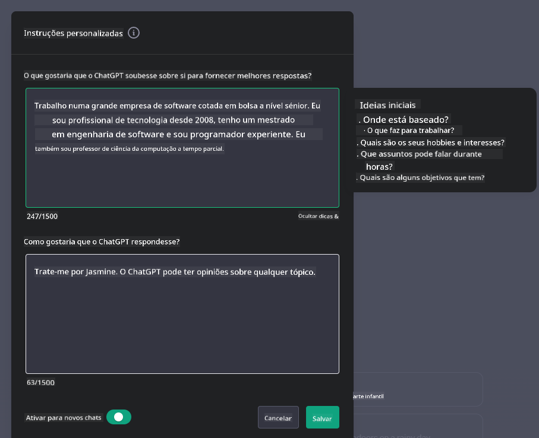

<!--
CO_OP_TRANSLATOR_METADATA:
{
  "original_hash": "ea4bbe640847aafbbba14dae4625e9af",
  "translation_date": "2025-05-19T17:46:52+00:00",
  "source_file": "07-building-chat-applications/README.md",
  "language_code": "pt"
}
-->
# Construindo Aplicações de Chat com IA Generativa

[](https://aka.ms/gen-ai-lessons7-gh?WT.mc_id=academic-105485-koreyst)

> _(Clique na imagem acima para ver o vídeo desta lição)_

Agora que vimos como podemos construir aplicativos de geração de texto, vamos explorar as aplicações de chat.

As aplicações de chat tornaram-se parte integrante de nossas vidas diárias, oferecendo mais do que apenas um meio de conversa casual. Elas são partes essenciais do atendimento ao cliente, suporte técnico e até mesmo sistemas de consultoria sofisticados. É provável que você tenha recebido ajuda de uma aplicação de chat não muito tempo atrás. À medida que integramos tecnologias mais avançadas, como a IA generativa, nessas plataformas, a complexidade aumenta, assim como os desafios.

Algumas perguntas que precisamos responder são:

- **Construindo o aplicativo**. Como podemos construir e integrar eficientemente essas aplicações alimentadas por IA para casos de uso específicos?
- **Monitoramento**. Uma vez implantadas, como podemos monitorar e garantir que as aplicações estejam operando no mais alto nível de qualidade, tanto em termos de funcionalidade quanto de adesão aos [seis princípios da IA responsável](https://www.microsoft.com/ai/responsible-ai?WT.mc_id=academic-105485-koreyst)?

À medida que avançamos para uma era definida pela automação e interações homem-máquina sem interrupções, entender como a IA generativa transforma o escopo, a profundidade e a adaptabilidade das aplicações de chat torna-se essencial. Esta lição investigará os aspectos da arquitetura que sustentam esses sistemas intrincados, explorará as metodologias para ajustá-los para tarefas específicas de domínio e avaliará as métricas e considerações pertinentes para garantir a implantação responsável da IA.

## Introdução

Esta lição cobre:

- Técnicas para construir e integrar eficientemente aplicações de chat.
- Como aplicar personalização e ajuste fino às aplicações.
- Estratégias e considerações para monitorar efetivamente as aplicações de chat.

## Objetivos de Aprendizagem

Ao final desta lição, você será capaz de:

- Descrever considerações para construir e integrar aplicações de chat em sistemas existentes.
- Personalizar aplicações de chat para casos de uso específicos.
- Identificar métricas-chave e considerações para monitorar e manter efetivamente a qualidade das aplicações de chat alimentadas por IA.
- Garantir que as aplicações de chat utilizem a IA de forma responsável.

## Integrando IA Generativa em Aplicações de Chat

Elevar as aplicações de chat através da IA generativa não se concentra apenas em torná-las mais inteligentes; trata-se de otimizar sua arquitetura, desempenho e interface do usuário para oferecer uma experiência de usuário de qualidade. Isso envolve investigar as fundações arquitetônicas, integrações de API e considerações de interface do usuário. Esta seção tem como objetivo oferecer um roteiro abrangente para navegar nesses cenários complexos, seja conectando-os a sistemas existentes ou construindo-os como plataformas independentes.

Ao final desta seção, você estará equipado com a expertise necessária para construir e incorporar eficientemente aplicações de chat.

### Chatbot ou Aplicação de Chat?

Antes de mergulharmos na construção de aplicações de chat, vamos comparar 'chatbots' com 'aplicações de chat alimentadas por IA', que desempenham papéis e funcionalidades distintas. O principal objetivo de um chatbot é automatizar tarefas de conversação específicas, como responder a perguntas frequentes ou rastrear um pacote. Ele é tipicamente regido por lógica baseada em regras ou algoritmos de IA complexos. Em contraste, uma aplicação de chat alimentada por IA é um ambiente muito mais expansivo projetado para facilitar várias formas de comunicação digital, como chats de texto, voz e vídeo entre usuários humanos. Sua característica definidora é a integração de um modelo de IA generativa que simula conversas nuançadas e semelhantes às humanas, gerando respostas com base em uma ampla variedade de entradas e pistas contextuais. Uma aplicação de chat alimentada por IA generativa pode se engajar em discussões de domínio aberto, adaptar-se a contextos de conversação em evolução e até mesmo produzir diálogos criativos ou complexos.

A tabela abaixo descreve as principais diferenças e semelhanças para nos ajudar a entender seus papéis únicos na comunicação digital.

| Chatbot                               | Aplicação de Chat Alimentada por IA Generativa |
| ------------------------------------- | --------------------------------------------- |
| Focado em tarefas e baseado em regras | Ciente do contexto                            |
| Frequentemente integrado em sistemas maiores | Pode hospedar um ou vários chatbots           |
| Limitado a funções programadas        | Incorpora modelos de IA generativa            |
| Interações especializadas e estruturadas | Capaz de discussões de domínio aberto         |

### Aproveitando funcionalidades pré-construídas com SDKs e APIs

Ao construir uma aplicação de chat, um ótimo primeiro passo é avaliar o que já existe. Usar SDKs e APIs para construir aplicações de chat é uma estratégia vantajosa por várias razões. Ao integrar SDKs e APIs bem documentados, você está posicionando estrategicamente sua aplicação para o sucesso a longo prazo, abordando preocupações de escalabilidade e manutenção.

- **Acelera o processo de desenvolvimento e reduz custos**: Confiar em funcionalidades pré-construídas em vez do processo caro de construí-las você mesmo permite que você se concentre em outros aspectos de sua aplicação que você pode achar mais importantes, como a lógica de negócios.
- **Melhor desempenho**: Ao construir funcionalidades do zero, você eventualmente se perguntará "Como isso escala? Esta aplicação é capaz de lidar com um influxo repentino de usuários?" SDKs e APIs bem mantidos frequentemente têm soluções embutidas para essas preocupações.
- **Manutenção mais fácil**: Atualizações e melhorias são mais fáceis de gerenciar, pois a maioria das APIs e SDKs simplesmente requer uma atualização de uma biblioteca quando uma versão mais recente é lançada.
- **Acesso à tecnologia de ponta**: Aproveitar modelos que foram ajustados e treinados em extensos conjuntos de dados fornece à sua aplicação capacidades de linguagem natural.

Acessar a funcionalidade de um SDK ou API geralmente envolve obter permissão para usar os serviços fornecidos, o que é frequentemente feito através do uso de uma chave única ou token de autenticação. Usaremos a Biblioteca Python do OpenAI para explorar como isso se parece. Você também pode experimentá-lo por conta própria no seguinte [notebook para OpenAI](../../../07-building-chat-applications/python/oai-assignment.ipynb) ou [notebook para Azure OpenAI Services](../../../07-building-chat-applications/python/aoai-assignment.ipynb) para esta lição.

```python
import os
from openai import OpenAI

API_KEY = os.getenv("OPENAI_API_KEY","")

client = OpenAI(
    api_key=API_KEY
    )

chat_completion = client.chat.completions.create(model="gpt-3.5-turbo", messages=[{"role": "user", "content": "Suggest two titles for an instructional lesson on chat applications for generative AI."}])
```

O exemplo acima usa o modelo GPT-3.5 Turbo para completar o prompt, mas observe que a chave da API é definida antes de fazê-lo. Você receberia um erro se não definisse a chave.

## Experiência do Usuário (UX)

Princípios gerais de UX se aplicam a aplicações de chat, mas aqui estão algumas considerações adicionais que se tornam particularmente importantes devido aos componentes de aprendizado de máquina envolvidos.

- **Mecanismo para lidar com ambiguidade**: Modelos de IA generativa ocasionalmente geram respostas ambíguas. Um recurso que permite aos usuários pedir esclarecimentos pode ser útil caso encontrem esse problema.
- **Retenção de contexto**: Modelos avançados de IA generativa têm a capacidade de lembrar o contexto dentro de uma conversa, o que pode ser um recurso necessário para a experiência do usuário. Dar aos usuários a capacidade de controlar e gerenciar o contexto melhora a experiência do usuário, mas introduz o risco de reter informações sensíveis do usuário. Considerações sobre quanto tempo essas informações são armazenadas, como a introdução de uma política de retenção, podem equilibrar a necessidade de contexto contra a privacidade.
- **Personalização**: Com a capacidade de aprender e se adaptar, os modelos de IA oferecem uma experiência individualizada para um usuário. Personalizar a experiência do usuário por meio de recursos como perfis de usuário não apenas faz com que o usuário se sinta compreendido, mas também ajuda em sua busca por encontrar respostas específicas, criando uma interação mais eficiente e satisfatória.

Um exemplo de personalização é a configuração de "Instruções Personalizadas" no ChatGPT da OpenAI. Ele permite que você forneça informações sobre si mesmo que podem ser um contexto importante para seus prompts. Aqui está um exemplo de uma instrução personalizada.



Este "perfil" solicita ao ChatGPT que crie um plano de aula sobre listas ligadas. Observe que o ChatGPT leva em consideração que o usuário pode querer um plano de aula mais detalhado com base em sua experiência.


### Estrutura de Mensagem de Sistema da Microsoft para Modelos de Linguagem de Grande Escala

[A Microsoft forneceu orientações](https://learn.microsoft.com/azure/ai-services/openai/concepts/system-message#define-the-models-output-format?WT.mc_id=academic-105485-koreyst) para escrever mensagens de sistema eficazes ao gerar respostas de LLMs divididas em 4 áreas:

1. Definir para quem o modelo é, bem como suas capacidades e limitações.
2. Definir o formato de saída do modelo.
3. Fornecer exemplos específicos que demonstrem o comportamento pretendido do modelo.
4. Fornecer diretrizes comportamentais adicionais.

### Acessibilidade

Seja um usuário com deficiências visuais, auditivas, motoras ou cognitivas, uma aplicação de chat bem projetada deve ser utilizável por todos. A lista a seguir detalha recursos específicos voltados para melhorar a acessibilidade para várias deficiências do usuário.

- **Recursos para Deficiência Visual**: Temas de alto contraste e texto redimensionável, compatibilidade com leitores de tela.
- **Recursos para Deficiência Auditiva**: Funções de texto-para-fala e fala-para-texto, sinais visuais para notificações de áudio.
- **Recursos para Deficiência Motora**: Suporte à navegação por teclado, comandos de voz.
- **Recursos para Deficiência Cognitiva**: Opções de linguagem simplificada.

## Personalização e Ajuste Fino para Modelos de Linguagem Específicos de Domínio

Imagine uma aplicação de chat que entende o jargão da sua empresa e antecipa as consultas específicas que sua base de usuários costuma ter. Existem algumas abordagens que vale a pena mencionar:

- **Aproveitar modelos DSL**. DSL significa linguagem específica de domínio. Você pode aproveitar um chamado modelo DSL treinado em um domínio específico para entender seus conceitos e cenários.
- **Aplicar ajuste fino**. O ajuste fino é o processo de treinamento adicional do seu modelo com dados específicos.

## Personalização: Usando um DSL

Aproveitar modelos de linguagem específicos de domínio (Modelos DSL) pode melhorar o engajamento do usuário, proporcionando interações especializadas e contextualmente relevantes. É um modelo que é treinado ou ajustado para entender e gerar texto relacionado a um campo, indústria ou assunto específico. As opções para usar um modelo DSL podem variar desde treinar um do zero até usar modelos pré-existentes por meio de SDKs e APIs. Outra opção é o ajuste fino, que envolve pegar um modelo pré-treinado existente e adaptá-lo para um domínio específico.

## Personalização: Aplicar ajuste fino

O ajuste fino é frequentemente considerado quando um modelo pré-treinado não atende em um domínio especializado ou tarefa específica.

Por exemplo, consultas médicas são complexas e exigem muito contexto. Quando um profissional médico diagnostica um paciente, isso é baseado em uma variedade de fatores, como estilo de vida ou condições preexistentes, e pode até mesmo depender de jornais médicos recentes para validar seu diagnóstico. Em tais cenários complexos, uma aplicação de chat de IA de propósito geral não pode ser uma fonte confiável.

### Cenário: uma aplicação médica

Considere uma aplicação de chat projetada para auxiliar profissionais médicos, fornecendo referências rápidas a diretrizes de tratamento, interações medicamentosas ou descobertas de pesquisas recentes.

Um modelo de propósito geral pode ser adequado para responder a perguntas médicas básicas ou fornecer conselhos gerais, mas pode ter dificuldades com o seguinte:

- **Casos altamente específicos ou complexos**. Por exemplo, um neurologista pode perguntar à aplicação: "Quais são as melhores práticas atuais para gerenciar epilepsia resistente a medicamentos em pacientes pediátricos?"
- **Falta de avanços recentes**. Um modelo de propósito geral pode ter dificuldades para fornecer uma resposta atual que incorpore os avanços mais recentes em neurologia e farmacologia.

Em casos como esses, ajustar o modelo com um conjunto de dados médicos especializado pode melhorar significativamente sua capacidade de lidar com essas consultas médicas intrincadas de forma mais precisa e confiável. Isso requer acesso a um grande e relevante conjunto de dados que represente os desafios e perguntas específicas do domínio que precisam ser abordados.

## Considerações para uma Experiência de Chat de Alta Qualidade Dirigida por IA

Esta seção descreve os critérios para aplicações de chat de "alta qualidade", que incluem a captura de métricas acionáveis e a adesão a um framework que aproveita a tecnologia de IA de forma responsável.

### Métricas-chave

Para manter o desempenho de alta qualidade de uma aplicação, é essencial acompanhar métricas-chave e considerações. Essas medidas não apenas garantem a funcionalidade da aplicação, mas também avaliam a qualidade do modelo de IA e a experiência do usuário. Abaixo está uma lista que cobre métricas básicas, de IA e de experiência do usuário a serem consideradas.

| Métrica                        | Definição                                                                                                             | Considerações para o Desenvolvedor de Chat                                 |
| ----------------------------- | ---------------------------------------------------------------------------------------------------------------------- | ------------------------------------------------------------------------- |
| **Tempo de Atividade**        | Mede o tempo em que a aplicação está operacional e acessível pelos usuários.                                           | Como você minimizará o tempo de inatividade?                              |
| **Tempo de Resposta**         | O tempo levado pela aplicação para responder à consulta de um usuário.                                                | Como você pode otimizar o processamento de consultas para melhorar o tempo de resposta? |
| **Precisão**                  | A proporção de previsões verdadeiras positivas para o número total de previsões positivas.                            | Como você validará a precisão do seu modelo?                              |
| **Recall (Sensibilidade)**    | A proporção de previsões verdadeiras positivas para o número real de positivos.                                       | Como você medirá e melhorará o recall?                                    |
| **F1 Score**                  | A média harmônica de precisão e recall, que equilibra o trade-off entre ambos.                                        | Qual é o seu F1 Score alvo? Como você equilibrará precisão e recall?      |
| **Perplexidade**              | Mede o quão bem a distribuição de probabilidade prevista pelo modelo se alinha com a distribuição real dos dados.     | Como você minimizará a perplexidade?                                      |
| **Métricas de Satisfação do Usuário** | Mede a percepção do usuário sobre a aplicação. Frequentemente capturada através de pesquisas.                      | Com que frequência você coletará feedback dos usuários? Como você se adaptará com base nisso? |
| **Taxa de Erro**              | A taxa em que o modelo comete erros na compreensão ou saída.                                                           | Que estratégias você tem em prática para reduzir as taxas de erro?        |
| **Ciclos de Re-treinamento**  | A frequência com que o modelo é atualizado para incorporar novos dados e insights.                                    | Com que frequência você re-treinará o modelo? O que desencadeia um ciclo de re-treinamento? |
| **Detecção de Anomalias**     | Ferramentas e técnicas para identificar padrões incomuns que não se conformam ao comportamento esperado.              | Como você responderá a anomalias?                                         |

### Implementando Práticas de IA Responsável em Aplicações de Chat

A abordagem da Microsoft para a IA Responsável identificou seis princípios que devem guiar o desenvolvimento e uso de IA. Abaixo estão os princípios, sua definição e coisas que um desenvolvedor de chat deve considerar e por que eles devem levá-los a sério.

| Princípios               | Definição da Microsoft                              | Considerações para o Desenvolvedor de Chat                                 | Por que é importante                                                                      |
| ------------------------ | --------------------------------------------------- | ------------------------------------------------------------------------- | ----------------------------------------------------------------------------------------- |
| Justiça                  | Os sistemas de IA devem tratar todas as pessoas de forma justa. | Garantir que a aplicação de chat não discrimine com base nos dados do usuário. | Para construir confiança e inclusão entre os usuários; evita ramificações legais.          |
| Confiabilidade e Segurança | Os sistemas de IA devem funcionar de forma confiável e segura. | Implementar testes e medidas de segurança para minimizar erros e riscos. | Garante a satisfação do usuário e previne potenciais danos.                                |
| Privacidade e Segurança  | Os sistemas de IA devem ser seguros e respeitar a privacidade. | Implementar medidas fortes de criptografia e proteção de dados.          | Para proteger dados sensíveis do usuário e cumprir com leis de privacidade.                |
| Inclusão                 | Os sistemas de IA devem capacitar e envolver todas as pessoas. | Projetar UI/UX que seja acessível e fácil de usar para públicos diversos. | Garante que uma gama maior de pessoas possa usar a aplicação de forma eficaz.              |
| Transparência            | Os sistemas de IA devem ser compreensíveis.         | Fornecer documentação clara e justificativas para as respostas de IA.    | Os usuários têm mais probabilidade de confiar em um sistema se puderem entender como as decisões são feitas. |
| Prestação de Contas      | As pessoas devem ser responsáveis pelos sistemas de IA. | Estabelecer um processo claro para auditar e melhorar as decisões de IA. | Permite melhorias contínuas e medidas corretivas em caso de erros.                         |

## Tarefa

Veja [tarefa](../../../07-building-chat-applications/python) que o levará por uma série de exercícios desde executar seus primeiros prompts de chat, até classificar e resumir texto e mais. Note que as tarefas estão disponíveis em diferentes linguagens de programação!

## Ótimo Trabalho! Continue a Jornada

Após completar esta lição, confira nossa [coleção de Aprendizado de IA Generativa](https://aka.ms/genai-collection?WT.mc_id=academic-105485-koreyst) para continuar aprimorando seu conhecimento em IA Generativa!

Vá para a Lição 8 para ver como você pode começar a [construir aplicações de busca](../08-building-search-applications/README.md?WT.mc_id=academic-105485-koreyst)!

**Aviso Legal**:  
Este documento foi traduzido usando o serviço de tradução por IA [Co-op Translator](https://github.com/Azure/co-op-translator). Embora nos esforcemos para garantir a precisão, esteja ciente de que traduções automatizadas podem conter erros ou imprecisões. O documento original em seu idioma nativo deve ser considerado a fonte autorizada. Para informações críticas, recomenda-se a tradução humana profissional. Não nos responsabilizamos por quaisquer mal-entendidos ou interpretações incorretas decorrentes do uso desta tradução.