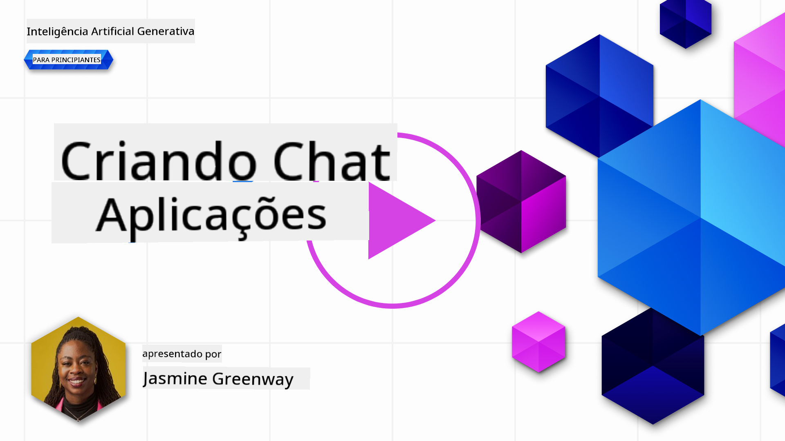
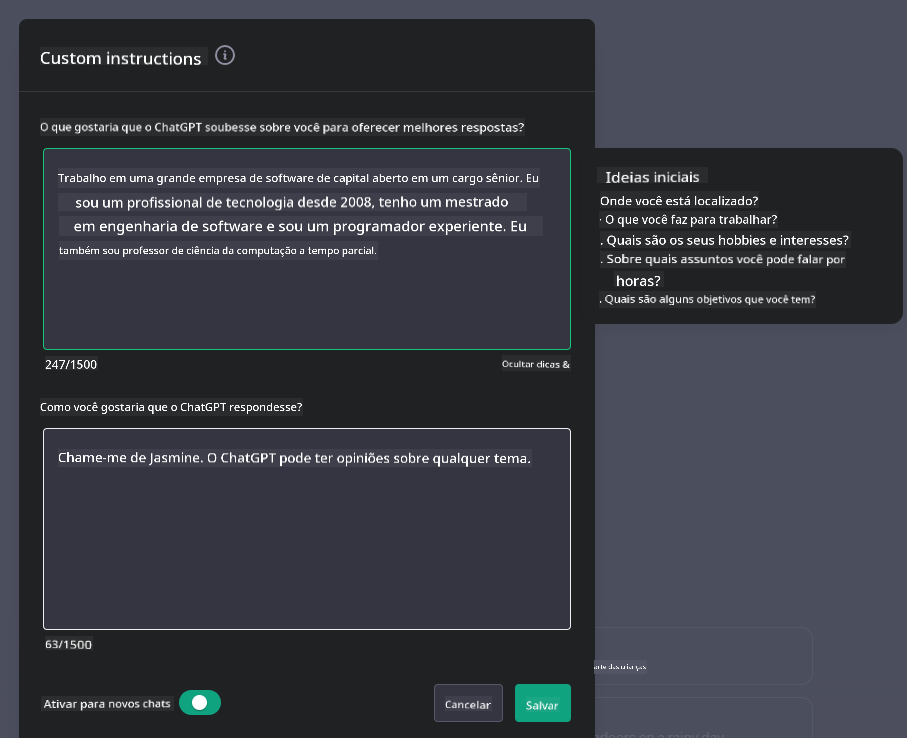

<!--
CO_OP_TRANSLATOR_METADATA:
{
  "original_hash": "ea4bbe640847aafbbba14dae4625e9af",
  "translation_date": "2025-07-09T12:25:28+00:00",
  "source_file": "07-building-chat-applications/README.md",
  "language_code": "pt"
}
-->
# Construir Aplicações de Chat com IA Generativa

[](https://aka.ms/gen-ai-lessons7-gh?WT.mc_id=academic-105485-koreyst)

> _(Clique na imagem acima para ver o vídeo desta lição)_

Agora que vimos como podemos construir aplicações de geração de texto, vamos explorar as aplicações de chat.

As aplicações de chat tornaram-se parte integrante do nosso dia a dia, oferecendo mais do que uma simples forma de conversa casual. São componentes essenciais no atendimento ao cliente, suporte técnico e até em sistemas de aconselhamento sofisticados. É provável que tenha recebido ajuda de uma aplicação de chat há pouco tempo. À medida que integramos tecnologias mais avançadas, como a IA generativa, nestas plataformas, a complexidade aumenta, assim como os desafios.

Algumas perguntas que precisamos responder são:

- **Construção da aplicação**. Como construir e integrar de forma eficiente estas aplicações com IA para casos de uso específicos?
- **Monitorização**. Depois de implementadas, como podemos monitorizar e garantir que as aplicações funcionam com a máxima qualidade, tanto em termos de funcionalidade como de conformidade com os [seis princípios da IA responsável](https://www.microsoft.com/ai/responsible-ai?WT.mc_id=academic-105485-koreyst)?

À medida que avançamos numa era definida pela automação e interações fluídas entre humanos e máquinas, torna-se essencial compreender como a IA generativa transforma o alcance, a profundidade e a adaptabilidade das aplicações de chat. Esta lição vai explorar os aspetos arquitetónicos que suportam estes sistemas complexos, as metodologias para os ajustar a tarefas específicas de domínio e avaliar as métricas e considerações relevantes para garantir uma implementação responsável da IA.

## Introdução

Esta lição aborda:

- Técnicas para construir e integrar aplicações de chat de forma eficiente.
- Como aplicar personalização e ajuste fino às aplicações.
- Estratégias e considerações para monitorizar eficazmente as aplicações de chat.

## Objetivos de Aprendizagem

No final desta lição, será capaz de:

- Descrever as considerações para construir e integrar aplicações de chat em sistemas existentes.
- Personalizar aplicações de chat para casos de uso específicos.
- Identificar métricas e considerações chave para monitorizar e manter a qualidade das aplicações de chat com IA.
- Garantir que as aplicações de chat utilizam a IA de forma responsável.

## Integrar IA Generativa em Aplicações de Chat

Elevar as aplicações de chat através da IA generativa não se resume a torná-las mais inteligentes; trata-se de otimizar a sua arquitetura, desempenho e interface para proporcionar uma experiência de utilizador de qualidade. Isto implica analisar as bases arquitetónicas, integrações de API e considerações de interface. Esta secção pretende oferecer um roteiro abrangente para navegar nestes cenários complexos, quer esteja a integrá-las em sistemas existentes, quer a construir plataformas independentes.

No final desta secção, estará equipado com o conhecimento necessário para construir e incorporar aplicações de chat de forma eficiente.

### Chatbot ou Aplicação de Chat?

Antes de começarmos a construir aplicações de chat, vamos comparar ‘chatbots’ com ‘aplicações de chat com IA’, que têm papéis e funcionalidades distintas. O principal objetivo de um chatbot é automatizar tarefas conversacionais específicas, como responder a perguntas frequentes ou rastrear uma encomenda. Normalmente é regido por lógica baseada em regras ou algoritmos de IA complexos. Em contraste, uma aplicação de chat com IA é um ambiente muito mais amplo, concebido para facilitar várias formas de comunicação digital, como chat de texto, voz e vídeo entre utilizadores humanos. A sua característica definidora é a integração de um modelo de IA generativa que simula conversas humanas nuançadas, gerando respostas com base numa grande variedade de entradas e contextos. Uma aplicação de chat com IA generativa pode participar em discussões de domínio aberto, adaptar-se a contextos conversacionais em evolução e até produzir diálogos criativos ou complexos.

A tabela abaixo destaca as principais diferenças e semelhanças para ajudar a compreender os seus papéis únicos na comunicação digital.

| Chatbot                               | Aplicação de Chat com IA Generativa       |
| ------------------------------------- | ----------------------------------------- |
| Focada em tarefas e baseada em regras | Sensível ao contexto                      |
| Frequentemente integrada em sistemas maiores | Pode hospedar um ou vários chatbots       |
| Limitada a funções programadas         | Incorpora modelos de IA generativa        |
| Interações especializadas e estruturadas | Capaz de discussões de domínio aberto     |

### Aproveitar funcionalidades pré-construídas com SDKs e APIs

Ao construir uma aplicação de chat, um ótimo primeiro passo é avaliar o que já existe. Usar SDKs e APIs para construir aplicações de chat é uma estratégia vantajosa por várias razões. Ao integrar SDKs e APIs bem documentados, está a posicionar estrategicamente a sua aplicação para o sucesso a longo prazo, abordando questões de escalabilidade e manutenção.

- **Acelera o processo de desenvolvimento e reduz a carga**: Confiar em funcionalidades pré-construídas em vez de as desenvolver do zero permite focar noutras áreas da aplicação que considere mais importantes, como a lógica de negócio.
- **Melhor desempenho**: Ao construir funcionalidades do zero, acaba por questionar-se “Como isto escala? Esta aplicação consegue lidar com um aumento súbito de utilizadores?” SDKs e APIs bem mantidos geralmente têm soluções incorporadas para estas preocupações.
- **Manutenção facilitada**: Atualizações e melhorias são mais fáceis de gerir, pois a maioria das APIs e SDKs requer apenas a atualização de uma biblioteca quando uma nova versão é lançada.
- **Acesso a tecnologia de ponta**: Aproveitar modelos que foram ajustados e treinados com grandes conjuntos de dados oferece à sua aplicação capacidades avançadas de linguagem natural.

O acesso às funcionalidades de um SDK ou API normalmente envolve obter permissão para usar os serviços fornecidos, geralmente através de uma chave única ou token de autenticação. Vamos usar a OpenAI Python Library para explorar como isto funciona. Pode também experimentar por si próprio nos seguintes [notebooks para OpenAI](../../../07-building-chat-applications/python/oai-assignment.ipynb) ou [notebook para Azure OpenAI Services](../../../07-building-chat-applications/python/aoai-assignment.ipynb) desta lição.

```python
import os
from openai import OpenAI

API_KEY = os.getenv("OPENAI_API_KEY","")

client = OpenAI(
    api_key=API_KEY
    )

chat_completion = client.chat.completions.create(model="gpt-3.5-turbo", messages=[{"role": "user", "content": "Suggest two titles for an instructional lesson on chat applications for generative AI."}])
```

O exemplo acima usa o modelo GPT-3.5 Turbo para completar o prompt, mas repare que a chave da API é definida antes disso. Receberia um erro se não definisse a chave.

## Experiência do Utilizador (UX)

Princípios gerais de UX aplicam-se às aplicações de chat, mas aqui estão algumas considerações adicionais que se tornam particularmente importantes devido aos componentes de machine learning envolvidos.

- **Mecanismo para resolver ambiguidades**: Modelos de IA generativa por vezes geram respostas ambíguas. Uma funcionalidade que permita aos utilizadores pedir esclarecimentos pode ser útil caso encontrem este problema.
- **Retenção de contexto**: Modelos avançados de IA generativa têm a capacidade de lembrar o contexto dentro de uma conversa, o que pode ser um recurso essencial para a experiência do utilizador. Dar aos utilizadores a capacidade de controlar e gerir o contexto melhora a experiência, mas introduz o risco de reter informação sensível. Considerações sobre o tempo de armazenamento desta informação, como a introdução de uma política de retenção, podem equilibrar a necessidade de contexto com a privacidade.
- **Personalização**: Com a capacidade de aprender e adaptar-se, os modelos de IA oferecem uma experiência individualizada ao utilizador. Personalizar a experiência através de funcionalidades como perfis de utilizador não só faz o utilizador sentir-se compreendido, como também ajuda na procura de respostas específicas, criando uma interação mais eficiente e satisfatória.

Um exemplo de personalização são as definições de "Instruções personalizadas" no ChatGPT da OpenAI. Permite fornecer informações sobre si que podem ser contexto importante para os seus prompts. Aqui está um exemplo de uma instrução personalizada.



Este "perfil" leva o ChatGPT a criar um plano de aula sobre listas ligadas. Repare que o ChatGPT tem em conta que o utilizador pode querer um plano de aula mais aprofundado com base na sua experiência.


### Framework de Mensagens de Sistema da Microsoft para Grandes Modelos de Linguagem

[A Microsoft forneceu orientações](https://learn.microsoft.com/azure/ai-services/openai/concepts/system-message#define-the-models-output-format?WT.mc_id=academic-105485-koreyst) para escrever mensagens de sistema eficazes ao gerar respostas de LLMs, divididas em 4 áreas:

1. Definir para quem é o modelo, bem como as suas capacidades e limitações.
2. Definir o formato de saída do modelo.
3. Fornecer exemplos específicos que demonstrem o comportamento pretendido do modelo.
4. Fornecer guardas comportamentais adicionais.

### Acessibilidade

Quer o utilizador tenha deficiências visuais, auditivas, motoras ou cognitivas, uma aplicação de chat bem desenhada deve ser utilizável por todos. A lista seguinte detalha funcionalidades específicas destinadas a melhorar a acessibilidade para várias deficiências.

- **Funcionalidades para Deficiência Visual**: Temas de alto contraste e texto redimensionável, compatibilidade com leitores de ecrã.
- **Funcionalidades para Deficiência Auditiva**: Funções de texto para fala e fala para texto, sinais visuais para notificações áudio.
- **Funcionalidades para Deficiência Motora**: Suporte à navegação por teclado, comandos de voz.
- **Funcionalidades para Deficiência Cognitiva**: Opções de linguagem simplificada.

## Personalização e Ajuste Fino para Modelos de Linguagem Específicos de Domínio

Imagine uma aplicação de chat que compreende a linguagem técnica da sua empresa e antecipa as perguntas específicas que os seus utilizadores costumam fazer. Existem algumas abordagens a destacar:

- **Aproveitar modelos DSL**. DSL significa domain specific language (linguagem específica de domínio). Pode usar um modelo DSL treinado num domínio específico para compreender os seus conceitos e cenários.
- **Aplicar ajuste fino**. Ajuste fino é o processo de treinar adicionalmente o seu modelo com dados específicos.

## Personalização: Usar um DSL

Aproveitar modelos de linguagem específicos de domínio (Modelos DSL) pode aumentar o envolvimento do utilizador ao fornecer interações especializadas e contextualmente relevantes. É um modelo treinado ou ajustado para compreender e gerar texto relacionado com um campo, indústria ou assunto específico. As opções para usar um modelo DSL podem variar desde treinar um do zero até usar modelos pré-existentes através de SDKs e APIs. Outra opção é o ajuste fino, que envolve pegar num modelo pré-treinado existente e adaptá-lo para um domínio específico.

## Personalização: Aplicar ajuste fino

O ajuste fino é frequentemente considerado quando um modelo pré-treinado não é suficiente para um domínio especializado ou tarefa específica.

Por exemplo, questões médicas são complexas e requerem muito contexto. Quando um profissional de saúde diagnostica um paciente, baseia-se numa variedade de fatores como estilo de vida ou condições pré-existentes, podendo até recorrer a artigos médicos recentes para validar o diagnóstico. Em cenários tão complexos, uma aplicação de chat de IA de uso geral não pode ser uma fonte fiável.

### Cenário: uma aplicação médica

Considere uma aplicação de chat concebida para ajudar profissionais de saúde, fornecendo referências rápidas a diretrizes de tratamento, interações medicamentosas ou descobertas recentes de investigação.

Um modelo de uso geral pode ser adequado para responder a perguntas médicas básicas ou fornecer conselhos gerais, mas pode ter dificuldades com o seguinte:

- **Casos altamente específicos ou complexos**. Por exemplo, um neurologista pode perguntar à aplicação: "Quais são as melhores práticas atuais para gerir epilepsia resistente a medicamentos em pacientes pediátricos?"
- **Falta de avanços recentes**. Um modelo de uso geral pode ter dificuldade em fornecer uma resposta atual que incorpore os avanços mais recentes em neurologia e farmacologia.

Nesses casos, ajustar o modelo com um conjunto de dados médicos especializado pode melhorar significativamente a sua capacidade de lidar com estas questões médicas complexas de forma mais precisa e fiável. Isto requer acesso a um conjunto de dados grande e relevante que represente os desafios e perguntas específicas do domínio.

## Considerações para uma Experiência de Chat com IA de Alta Qualidade

Esta secção descreve os critérios para aplicações de chat "de alta qualidade", que incluem a recolha de métricas acionáveis e a adesão a um quadro que utiliza a tecnologia de IA de forma responsável.

### Métricas Chave

Para manter o desempenho de alta qualidade de uma aplicação, é essencial acompanhar métricas e considerações chave. Estas medições não só garantem a funcionalidade da aplicação, como também avaliam a qualidade do modelo de IA e a experiência do utilizador. Abaixo está uma lista que cobre métricas básicas, de IA e de experiência do utilizador a considerar.

| Métrica                       | Definição                                                                                                             | Considerações para o Desenvolvedor de Chat                              |
| ----------------------------- | ---------------------------------------------------------------------------------------------------------------------- | ----------------------------------------------------------------------- |
| **Tempo de atividade (Uptime)** | Mede o tempo em que a aplicação está operacional e acessível aos utilizadores.                                         | Como minimizará o tempo de inatividade?                                |
| **Tempo de resposta**          | O tempo que a aplicação demora a responder a uma consulta do utilizador.                                               | Como otimizará o processamento das consultas para melhorar o tempo de resposta? |
| **Precisão**                  | A proporção de previsões verdadeiramente positivas em relação ao total de previsões positivas.                         | Como validará a precisão do seu modelo?                                |
| **Recall (Sensibilidade)**    | A proporção de previsões verdadeiramente positivas em relação ao número real de positivos.                             | Como medirá e melhorará o recall?                                      |
| **F1 Score**                  | A média harmónica entre precisão e recall, que equilibra o compromisso entre ambos.                                    | Qual é o seu objetivo para o F1 Score? Como equilibrará precisão e recall? |
| **Perplexidade**              | Mede quão bem a distribuição de probabilidade prevista pelo modelo se alinha com a distribuição real dos dados.       | Como minimizará a perplexidade?                                        |
| **Métricas de Satisfação do Utilizador** | Mede a perceção do utilizador sobre a aplicação. Frequentemente recolhida através de inquéritos.                      | Com que frequência recolherá feedback dos utilizadores? Como se adaptará a ele? |
| **Taxa de Erro**              | A taxa com que o modelo comete erros na compreensão ou na saída.                                                      | Que estratégias tem para reduzir as taxas de erro?                     |
| **Ciclos de Re-treinamento** | A frequência com que o modelo é atualizado para incorporar novos dados e insights.                                    | Com que frequência re-treiná o modelo? O que desencadeia um ciclo de re-treinamento? |
| **Deteção de Anomalias**     | Ferramentas e técnicas para identificar padrões invulgares que não correspondem ao comportamento esperado.               | Como irá responder às anomalias?                                           |

### Implementação de Práticas de IA Responsável em Aplicações de Chat

A abordagem da Microsoft para a IA Responsável identificou seis princípios que devem orientar o desenvolvimento e uso da IA. Abaixo estão os princípios, a sua definição, e aspetos que um desenvolvedor de chat deve considerar e por que deve levá-los a sério.

| Princípios             | Definição da Microsoft                                | Considerações para o Desenvolvedor de Chat                              | Por Que é Importante                                                                   |
| ---------------------- | ----------------------------------------------------- | ---------------------------------------------------------------------- | -------------------------------------------------------------------------------------- |
| Equidade               | Os sistemas de IA devem tratar todas as pessoas de forma justa. | Garantir que a aplicação de chat não discrimine com base nos dados dos utilizadores. | Para criar confiança e inclusão entre os utilizadores; evita implicações legais.       |
| Fiabilidade e Segurança| Os sistemas de IA devem funcionar de forma fiável e segura. | Implementar testes e mecanismos de segurança para minimizar erros e riscos. | Garante a satisfação do utilizador e previne potenciais danos.                         |
| Privacidade e Segurança| Os sistemas de IA devem ser seguros e respeitar a privacidade. | Implementar encriptação forte e medidas de proteção de dados.          | Para proteger dados sensíveis dos utilizadores e cumprir as leis de privacidade.       |
| Inclusividade          | Os sistemas de IA devem capacitar todos e envolver as pessoas. | Projetar UI/UX acessível e fácil de usar para públicos diversos.       | Garante que um maior número de pessoas possa usar a aplicação de forma eficaz.         |
| Transparência          | Os sistemas de IA devem ser compreensíveis.           | Fornecer documentação clara e explicações para as respostas da IA.     | Os utilizadores tendem a confiar mais num sistema se perceberem como as decisões são tomadas. |
| Responsabilização      | As pessoas devem ser responsáveis pelos sistemas de IA. | Estabelecer um processo claro para auditar e melhorar as decisões da IA. | Permite melhorias contínuas e medidas corretivas em caso de erros.                     |

## Tarefa

Consulte [assignment](../../../07-building-chat-applications/python) que o guiará por uma série de exercícios, desde executar os seus primeiros prompts de chat, a classificar e resumir texto, entre outros. Note que as tarefas estão disponíveis em diferentes linguagens de programação!

## Excelente Trabalho! Continue a Jornada

Depois de concluir esta lição, explore a nossa [coleção de Aprendizagem de IA Generativa](https://aka.ms/genai-collection?WT.mc_id=academic-105485-koreyst) para continuar a aprofundar os seus conhecimentos em IA Generativa!

Siga para a Lição 8 para ver como pode começar a [construir aplicações de pesquisa](../08-building-search-applications/README.md?WT.mc_id=academic-105485-koreyst)!

**Aviso Legal**:  
Este documento foi traduzido utilizando o serviço de tradução automática [Co-op Translator](https://github.com/Azure/co-op-translator). Embora nos esforcemos pela precisão, por favor tenha em conta que traduções automáticas podem conter erros ou imprecisões. O documento original na sua língua nativa deve ser considerado a fonte autorizada. Para informações críticas, recomenda-se tradução profissional humana. Não nos responsabilizamos por quaisquer mal-entendidos ou interpretações incorretas decorrentes da utilização desta tradução.