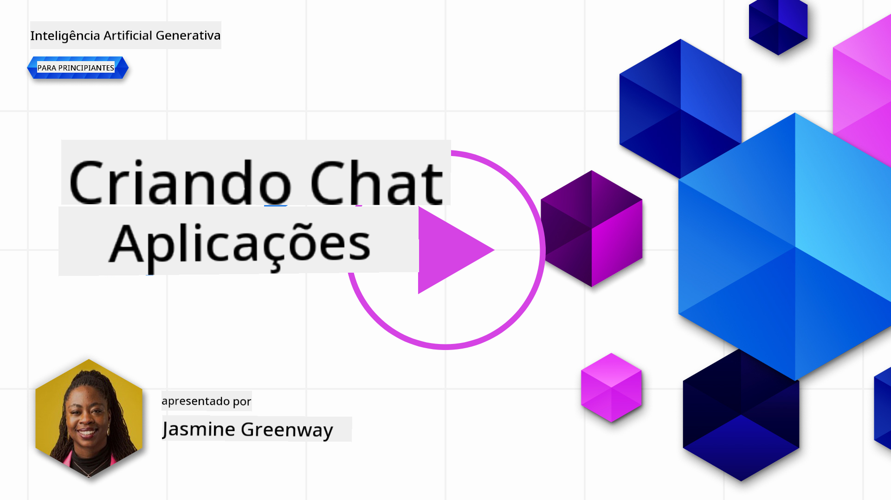
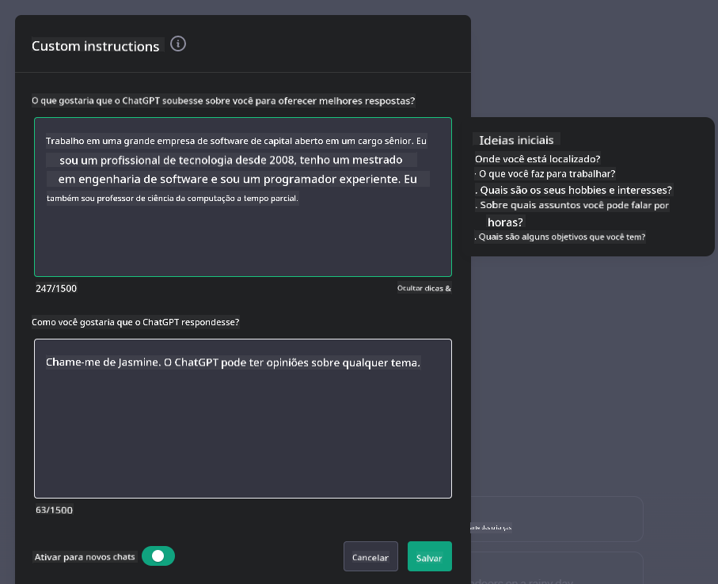

<!--
CO_OP_TRANSLATOR_METADATA:
{
  "original_hash": "ea4bbe640847aafbbba14dae4625e9af",
  "translation_date": "2025-06-25T15:26:39+00:00",
  "source_file": "07-building-chat-applications/README.md",
  "language_code": "pt"
}
-->
# Construindo Aplicações de Chat com IA Generativa

[](https://aka.ms/gen-ai-lessons7-gh?WT.mc_id=academic-105485-koreyst)

> _(Clique na imagem acima para ver o vídeo desta lição)_

Agora que vimos como podemos construir aplicativos de geração de texto, vamos explorar as aplicações de chat.

As aplicações de chat tornaram-se parte integrante das nossas vidas diárias, oferecendo mais do que apenas um meio de conversa casual. Elas são partes essenciais do atendimento ao cliente, suporte técnico e até mesmo sistemas de aconselhamento sofisticados. É provável que você tenha recebido alguma ajuda de uma aplicação de chat recentemente. À medida que integramos tecnologias mais avançadas como IA generativa nessas plataformas, a complexidade aumenta, assim como os desafios.

Algumas perguntas que precisamos responder são:

- **Construindo o aplicativo**. Como construímos de forma eficiente e integramos perfeitamente essas aplicações alimentadas por IA para casos de uso específicos?
- **Monitoramento**. Uma vez implantadas, como podemos monitorar e garantir que as aplicações estejam operando no mais alto nível de qualidade, tanto em termos de funcionalidade quanto de adesão aos [seis princípios de IA responsável](https://www.microsoft.com/ai/responsible-ai?WT.mc_id=academic-105485-koreyst)?

À medida que avançamos para uma era definida pela automação e interações homem-máquina contínuas, compreender como a IA generativa transforma o escopo, profundidade e adaptabilidade das aplicações de chat torna-se essencial. Esta lição investigará os aspectos da arquitetura que suportam esses sistemas intrincados, mergulhará nas metodologias para ajustá-los para tarefas específicas de domínio e avaliará as métricas e considerações pertinentes para garantir a implantação responsável da IA.

## Introdução

Esta lição abrange:

- Técnicas para construir e integrar eficientemente aplicações de chat.
- Como aplicar personalização e ajuste fino às aplicações.
- Estratégias e considerações para monitorar eficazmente as aplicações de chat.

## Objetivos de Aprendizagem

Ao final desta lição, você será capaz de:

- Descrever considerações para construir e integrar aplicações de chat em sistemas existentes.
- Personalizar aplicações de chat para casos de uso específicos.
- Identificar métricas chave e considerações para monitorar e manter eficazmente a qualidade das aplicações de chat alimentadas por IA.
- Garantir que as aplicações de chat utilizem IA de forma responsável.

## Integrando IA Generativa em Aplicações de Chat

Elevar as aplicações de chat através da IA generativa não se concentra apenas em torná-las mais inteligentes; trata-se de otimizar sua arquitetura, desempenho e interface do usuário para oferecer uma experiência de qualidade ao usuário. Isso envolve investigar as fundações arquitetônicas, integrações de API e considerações de interface do usuário. Esta seção visa oferecer a você um roteiro abrangente para navegar nesses cenários complexos, seja conectando-os a sistemas existentes ou construindo-os como plataformas autônomas.

Ao final desta seção, você estará equipado com a expertise necessária para construir e incorporar eficientemente aplicações de chat.

### Chatbot ou Aplicação de Chat?

Antes de mergulharmos na construção de aplicações de chat, vamos comparar 'chatbots' com 'aplicações de chat alimentadas por IA', que desempenham papéis e funcionalidades distintas. O principal objetivo de um chatbot é automatizar tarefas conversacionais específicas, como responder perguntas frequentes ou rastrear um pacote. É tipicamente governado por lógica baseada em regras ou algoritmos de IA complexos. Em contraste, uma aplicação de chat alimentada por IA é um ambiente muito mais expansivo projetado para facilitar várias formas de comunicação digital, como chats de texto, voz e vídeo entre usuários humanos. Sua característica definidora é a integração de um modelo de IA generativa que simula conversas nuançadas, semelhantes às humanas, gerando respostas com base em uma ampla variedade de entradas e pistas contextuais. Uma aplicação de chat alimentada por IA generativa pode engajar-se em discussões de domínio aberto, adaptar-se a contextos conversacionais em evolução e até mesmo produzir diálogos criativos ou complexos.

A tabela abaixo descreve as principais diferenças e semelhanças para nos ajudar a entender seus papéis únicos na comunicação digital.

| Chatbot                               | Aplicação de Chat Alimentada por IA Generativa |
| ------------------------------------- | --------------------------------------------- |
| Focado em tarefas e baseado em regras | Consciente do contexto                         |
| Frequentemente integrado em sistemas maiores | Pode hospedar um ou múltiplos chatbots          |
| Limitado a funções programadas        | Incorpora modelos de IA generativa             |
| Interações especializadas e estruturadas | Capaz de discussões de domínio aberto          |

### Aproveitando funcionalidades pré-construídas com SDKs e APIs

Ao construir uma aplicação de chat, um ótimo primeiro passo é avaliar o que já existe. Usar SDKs e APIs para construir aplicações de chat é uma estratégia vantajosa por vários motivos. Ao integrar SDKs e APIs bem documentados, você está posicionando estrategicamente sua aplicação para o sucesso a longo prazo, abordando preocupações de escalabilidade e manutenção.

- **Acelera o processo de desenvolvimento e reduz despesas gerais**: Confiar em funcionalidades pré-construídas em vez do processo caro de construí-las você mesmo permite que você se concentre em outros aspectos de sua aplicação que você pode achar mais importantes, como a lógica de negócios.
- **Melhor desempenho**: Ao construir funcionalidades do zero, você eventualmente se perguntará "Como isso escala? Esta aplicação é capaz de lidar com um influxo repentino de usuários?" SDKs e APIs bem mantidos frequentemente têm soluções embutidas para essas preocupações.
- **Manutenção mais fácil**: Atualizações e melhorias são mais fáceis de gerenciar, pois a maioria das APIs e SDKs simplesmente requer uma atualização para uma biblioteca quando uma versão mais recente é lançada.
- **Acesso à tecnologia de ponta**: Aproveitar modelos que foram ajustados e treinados em extensos conjuntos de dados proporciona à sua aplicação capacidades de linguagem natural.

Acessar a funcionalidade de um SDK ou API geralmente envolve obter permissão para usar os serviços fornecidos, o que muitas vezes é feito através do uso de uma chave única ou token de autenticação. Usaremos a Biblioteca Python do OpenAI para explorar como isso se parece. Você também pode experimentá-lo por conta própria no seguinte [notebook para OpenAI](../../../07-building-chat-applications/python/oai-assignment.ipynb) ou [notebook para Azure OpenAI Services](../../../07-building-chat-applications/python/aoai-assignment.ipynb) para esta lição.

```python
import os
from openai import OpenAI

API_KEY = os.getenv("OPENAI_API_KEY","")

client = OpenAI(
    api_key=API_KEY
    )

chat_completion = client.chat.completions.create(model="gpt-3.5-turbo", messages=[{"role": "user", "content": "Suggest two titles for an instructional lesson on chat applications for generative AI."}])
```

O exemplo acima usa o modelo GPT-3.5 Turbo para completar o prompt, mas observe que a chave da API é definida antes de fazê-lo. Você receberia um erro se não definisse a chave.

## Experiência do Usuário (UX)

Princípios gerais de UX se aplicam a aplicações de chat, mas aqui estão algumas considerações adicionais que se tornam particularmente importantes devido aos componentes de aprendizado de máquina envolvidos.

- **Mecanismo para abordar ambiguidade**: Modelos de IA generativa ocasionalmente geram respostas ambíguas. Um recurso que permite aos usuários pedir esclarecimentos pode ser útil caso se deparem com esse problema.
- **Retenção de contexto**: Modelos avançados de IA generativa têm a capacidade de lembrar o contexto dentro de uma conversa, o que pode ser um ativo necessário para a experiência do usuário. Dar aos usuários a capacidade de controlar e gerenciar o contexto melhora a experiência do usuário, mas introduz o risco de reter informações sensíveis do usuário. Considerações sobre quanto tempo essa informação é armazenada, como a introdução de uma política de retenção, podem equilibrar a necessidade de contexto contra a privacidade.
- **Personalização**: Com a capacidade de aprender e se adaptar, os modelos de IA oferecem uma experiência individualizada para um usuário. Personalizar a experiência do usuário através de recursos como perfis de usuário não apenas faz o usuário se sentir compreendido, mas também ajuda em sua busca por encontrar respostas específicas, criando uma interação mais eficiente e satisfatória.

Um exemplo de personalização é a configuração "Instruções Personalizadas" no ChatGPT da OpenAI. Permite que você forneça informações sobre você que podem ser um contexto importante para seus prompts. Aqui está um exemplo de uma instrução personalizada.



Este "perfil" orienta o ChatGPT a criar um plano de aula sobre listas ligadas. Observe que o ChatGPT leva em conta que o usuário pode querer um plano de aula mais aprofundado com base em sua experiência.


### Estrutura de Mensagem de Sistema da Microsoft para Modelos de Linguagem de Grande Escala

[A Microsoft forneceu orientações](https://learn.microsoft.com/azure/ai-services/openai/concepts/system-message#define-the-models-output-format?WT.mc_id=academic-105485-koreyst) para escrever mensagens de sistema eficazes ao gerar respostas de LLMs divididas em 4 áreas:

1. Definindo para quem é o modelo, bem como suas capacidades e limitações.
2. Definindo o formato de saída do modelo.
3. Fornecendo exemplos específicos que demonstrem o comportamento pretendido do modelo.
4. Fornecendo diretrizes comportamentais adicionais.

### Acessibilidade

Seja um usuário com deficiência visual, auditiva, motora ou cognitiva, uma aplicação de chat bem projetada deve ser utilizável por todos. A lista a seguir descreve recursos específicos destinados a melhorar a acessibilidade para várias deficiências de usuários.

- **Recursos para Deficiência Visual**: Temas de alto contraste e texto redimensionável, compatibilidade com leitores de tela.
- **Recursos para Deficiência Auditiva**: Funções de texto-para-fala e fala-para-texto, sinais visuais para notificações de áudio.
- **Recursos para Deficiência Motora**: Suporte à navegação por teclado, comandos de voz.
- **Recursos para Deficiência Cognitiva**: Opções de linguagem simplificada.

## Personalização e Ajuste Fino para Modelos de Linguagem Específicos de Domínio

Imagine uma aplicação de chat que entende o jargão da sua empresa e antecipa as consultas específicas que sua base de usuários geralmente tem. Existem algumas abordagens que vale a pena mencionar:

- **Aproveitando modelos DSL**. DSL significa linguagem específica de domínio. Você pode aproveitar um modelo DSL treinado em um domínio específico para entender seus conceitos e cenários.
- **Aplicar ajuste fino**. O ajuste fino é o processo de treinar ainda mais seu modelo com dados específicos.

## Personalização: Usando um DSL

Aproveitar modelos de linguagem específicos de domínio (Modelos DSL) pode melhorar o engajamento do usuário, proporcionando interações especializadas e contextualmente relevantes. É um modelo que é treinado ou ajustado para entender e gerar texto relacionado a um campo, indústria ou assunto específico. As opções para usar um modelo DSL podem variar desde treinar um do zero até usar modelos pré-existentes através de SDKs e APIs. Outra opção é o ajuste fino, que envolve pegar um modelo pré-treinado existente e adaptá-lo para um domínio específico.

## Personalização: Aplicar ajuste fino

O ajuste fino é frequentemente considerado quando um modelo pré-treinado não atende em um domínio especializado ou tarefa específica.

Por exemplo, consultas médicas são complexas e exigem muito contexto. Quando um profissional médico diagnostica um paciente, é baseado em uma variedade de fatores, como estilo de vida ou condições preexistentes, e pode até depender de revistas médicas recentes para validar seu diagnóstico. Em cenários tão complexos, uma aplicação de chat de IA de propósito geral não pode ser uma fonte confiável.

### Cenário: uma aplicação médica

Considere uma aplicação de chat projetada para ajudar profissionais médicos, fornecendo referências rápidas a diretrizes de tratamento, interações medicamentosas ou descobertas de pesquisas recentes.

Um modelo de propósito geral pode ser adequado para responder a perguntas médicas básicas ou fornecer conselhos gerais, mas pode ter dificuldades com o seguinte:

- **Casos altamente específicos ou complexos**. Por exemplo, um neurologista pode perguntar à aplicação: "Quais são as melhores práticas atuais para gerenciar epilepsia resistente a medicamentos em pacientes pediátricos?"
- **Falta de avanços recentes**. Um modelo de propósito geral pode ter dificuldade em fornecer uma resposta atual que incorpore os avanços mais recentes em neurologia e farmacologia.

Em casos como esses, ajustar o modelo com um conjunto de dados médicos especializado pode melhorar significativamente sua capacidade de lidar com essas consultas médicas complexas de maneira mais precisa e confiável. Isso requer acesso a um conjunto de dados grande e relevante que represente os desafios e questões específicas do domínio que precisam ser abordados.

## Considerações para uma Experiência de Chat de Alta Qualidade Dirigida por IA

Esta seção descreve os critérios para aplicações de chat "de alta qualidade", que incluem a captura de métricas acionáveis e a adesão a um framework que utiliza a tecnologia de IA de forma responsável.

### Métricas Chave

Para manter o desempenho de alta qualidade de uma aplicação, é essencial acompanhar métricas chave e considerações. Essas medições não apenas garantem a funcionalidade da aplicação, mas também avaliam a qualidade do modelo de IA e a experiência do usuário. Abaixo está uma lista que cobre métricas básicas, de IA e de experiência do usuário a serem consideradas.

| Métrica                        | Definição                                                                                                             | Considerações para o Desenvolvedor de Chat                                |
| ----------------------------- | ---------------------------------------------------------------------------------------------------------------------- | ------------------------------------------------------------------------- |
| **Tempo de Atividade**        | Mede o tempo em que a aplicação está operacional e acessível pelos usuários.                                           | Como você minimizará o tempo de inatividade?                              |
| **Tempo de Resposta**         | O tempo que a aplicação leva para responder a uma consulta do usuário.                                                 | Como você pode otimizar o processamento de consultas para melhorar o tempo de resposta? |
| **Precisão**                  | A proporção de previsões verdadeiramente positivas em relação ao número total de previsões positivas                    | Como você validará a precisão do seu modelo?                              |
| **Recall (Sensibilidade)**    | A proporção de previsões verdadeiramente positivas em relação ao número real de positivos                              | Como você medirá e melhorará o recall?                                    |
| **Pontuação F1**              | A média harmônica de precisão e recall, que equilibra a troca entre ambos.                                             | Qual é a sua pontuação F1 alvo? Como você equilibrará precisão e recall?  |
| **Perplexidade**              | Mede o quão bem a distribuição de probabilidade prevista pelo modelo se alinha com a distribuição real dos dados.       | Como você minimizará a perplexidade?                                      |
| **Métricas de Satisfação do Usuário** | Mede a percepção do usuário sobre a aplicação. Frequentemente capturada através de pesquisas.                     | Com que frequência você coletará feedback do usuário? Como você se adaptará com base nele? |
| **Taxa de Erro**              | A taxa na qual o modelo comete erros na compreensão ou saída.                                                           | Quais estratégias você tem para reduzir as taxas de erro?                 |
| **Ciclos de Re-treinamento**  | A frequência com que o modelo é atualizado para incorporar novos dados e insights.                                     | Com que frequência você re-treinará o modelo? O que desencadeia um ciclo de re-treinamento? |
| **Detecção de Anomalias**     | Ferramentas e técnicas para identificar padrões incomuns que não se conformam ao comportamento esperado.               | Como você responderá a anomalias?                                         |

### Implementando Práticas de IA Responsável em Aplicações de Chat

A abordagem da Microsoft para IA Responsável identificou seis princípios que devem guiar o desenvolvimento e uso de IA. Abaixo estão os princípios, sua definição e coisas que um desenvolvedor de chat deve considerar e por que devem levá-los a sério.

| Princípios             | Definição da Microsoft                                | Considerações para o Desenvolvedor de Chat                               | Por que é Importante                                                                      |
| ---------------------- | ----------------------------------------------------- | ------------------------------------------------------------------------ | ----------------------------------------------------------------------------------------- |
| Justiça                | Sistemas de IA devem tratar todas as pessoas de forma justa. | Garantir que a aplicação de chat não discrimine com base em dados do usuário. | Para construir confiança e inclusão entre os usuários; evita repercussões legais.         |
| Confiabilidade e Segurança | Sistemas de IA devem desempenhar de forma confiável e segura. | Implementar testes e mecanismos de segurança para minimizar erros e riscos. | Garante a satisfação do usuário e previne possíveis danos.                                |
| Privacidade e Segurança   | Sistemas de IA devem ser seguros e respeitar a privacidade. | Implementar forte criptografia e medidas de proteção de dados.           | Para proteger dados sensíveis do usuário e cumprir com leis de privacidade.               |
| Inclusão                | Sistemas de IA devem capacitar todos e envolver pessoas. | Projetar UI/UX que seja acessível e fácil de usar para públicos diversos. | Garante que uma gama mais ampla de pessoas possa usar a aplicação de forma eficaz.         |
| Transparência           | Sistemas de IA devem ser compreensíveis.              | Fornecer documentação clara e justificativas para as respostas da IA.    | Usuários são mais propensos a confiar em um sistema se puderem entender como decisões são tomadas. |
| Responsabilidade        | Pessoas devem ser responsáveis por sistemas de IA.   | Estabelecer um processo claro para auditar e melhorar decisões da IA.    | Permite melhorias contínuas e medidas corretivas em caso de erros.                        |

## Tarefa

Veja [tarefa](../../../07-building-chat-applications/python), ela o guiará por uma série de exercícios desde executar seus primeiros prompts de chat, até classificar e resumir texto e mais. Observe que as tarefas estão disponíveis em diferentes linguagens de programação!

## Bom Trabalho! Continue a Jornada

Após completar esta lição, confira nossa [coleção de Aprendizado de IA Generativa](https://aka.ms/genai-collection?WT.mc_id=academic-105485-koreyst) para continuar aprimorando seu conhecimento em IA Generativa!

Vá para a Lição 8 para ver como você pode começar [construindo aplicações de busca](../08-building-search-applications/README.md?WT.mc_id=academic-105485-koreyst)!

**Aviso Legal**:  
Este documento foi traduzido utilizando o serviço de tradução por IA [Co-op Translator](https://github.com/Azure/co-op-translator). Embora nos esforcemos para garantir a precisão, esteja ciente de que traduções automáticas podem conter erros ou imprecisões. O documento original na sua língua nativa deve ser considerado a fonte autoritativa. Para informações críticas, recomenda-se uma tradução profissional humana. Não nos responsabilizamos por quaisquer mal-entendidos ou interpretações erróneas decorrentes do uso desta tradução.