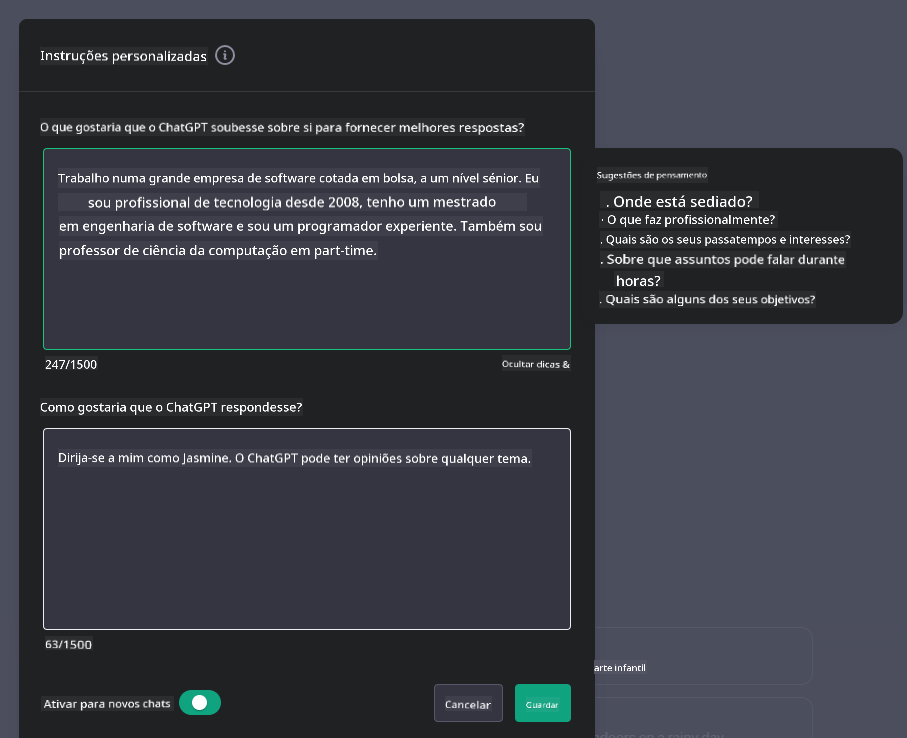

<!--
CO_OP_TRANSLATOR_METADATA:
{
  "original_hash": "a5308963a56cfbad2d73b0fa99fe84b3",
  "translation_date": "2025-10-18T00:42:10+00:00",
  "source_file": "07-building-chat-applications/README.md",
  "language_code": "pt"
}
-->
# Construção de Aplicações de Chat com IA Generativa

[](https://youtu.be/R9V0ZY1BEQo?si=IHuU-fS9YWT8s4sA)

> _(Clique na imagem acima para assistir ao vídeo desta lição)_

Agora que vimos como podemos construir aplicações de geração de texto, vamos explorar as aplicações de chat.

As aplicações de chat tornaram-se parte integrante das nossas vidas diárias, oferecendo mais do que apenas um meio de conversa casual. Elas são partes essenciais do atendimento ao cliente, suporte técnico e até mesmo de sistemas de aconselhamento sofisticados. É provável que tenha recebido ajuda de uma aplicação de chat recentemente. À medida que integramos tecnologias mais avançadas, como a IA generativa, nessas plataformas, a complexidade aumenta, assim como os desafios.

Algumas perguntas que precisamos responder são:

- **Construção da aplicação**. Como podemos construir e integrar de forma eficiente essas aplicações baseadas em IA para casos de uso específicos?
- **Monitorização**. Uma vez implementadas, como podemos monitorizar e garantir que as aplicações estão a operar no mais alto nível de qualidade, tanto em termos de funcionalidade quanto de conformidade com os [seis princípios de IA responsável](https://www.microsoft.com/ai/responsible-ai?WT.mc_id=academic-105485-koreyst)?

À medida que avançamos para uma era definida pela automação e interações fluídas entre humanos e máquinas, compreender como a IA generativa transforma o alcance, a profundidade e a adaptabilidade das aplicações de chat torna-se essencial. Esta lição investigará os aspetos da arquitetura que suportam esses sistemas complexos, explorará as metodologias para ajustá-los a tarefas específicas de domínio e avaliará as métricas e considerações pertinentes para garantir a implementação responsável da IA.

## Introdução

Esta lição aborda:

- Técnicas para construir e integrar aplicações de chat de forma eficiente.
- Como aplicar personalização e ajuste fino às aplicações.
- Estratégias e considerações para monitorizar eficazmente as aplicações de chat.

## Objetivos de Aprendizagem

No final desta lição, será capaz de:

- Descrever considerações para construir e integrar aplicações de chat em sistemas existentes.
- Personalizar aplicações de chat para casos de uso específicos.
- Identificar métricas-chave e considerações para monitorizar e manter a qualidade das aplicações de chat baseadas em IA.
- Garantir que as aplicações de chat utilizam a IA de forma responsável.

## Integração de IA Generativa em Aplicações de Chat

Elevar as aplicações de chat através da IA generativa não se trata apenas de as tornar mais inteligentes; é também sobre otimizar a sua arquitetura, desempenho e interface de utilizador para oferecer uma experiência de qualidade. Isso envolve investigar as fundações arquitetónicas, integrações de API e considerações de interface de utilizador. Esta secção tem como objetivo oferecer um roteiro abrangente para navegar por esses cenários complexos, seja integrando-as em sistemas existentes ou construindo-as como plataformas independentes.

No final desta secção, estará equipado com o conhecimento necessário para construir e incorporar aplicações de chat de forma eficiente.

### Chatbot ou Aplicação de Chat?

Antes de mergulharmos na construção de aplicações de chat, vamos comparar 'chatbots' com 'aplicações de chat baseadas em IA', que desempenham papéis e funcionalidades distintos. O principal objetivo de um chatbot é automatizar tarefas conversacionais específicas, como responder a perguntas frequentes ou rastrear uma encomenda. Normalmente, é governado por lógica baseada em regras ou algoritmos de IA complexos. Em contraste, uma aplicação de chat baseada em IA é um ambiente muito mais amplo, projetado para facilitar várias formas de comunicação digital, como texto, voz e vídeo entre utilizadores humanos. A sua característica definidora é a integração de um modelo de IA generativa que simula conversas humanas detalhadas, gerando respostas com base numa ampla variedade de entradas e pistas contextuais. Uma aplicação de chat com IA generativa pode envolver-se em discussões de domínio aberto, adaptar-se a contextos conversacionais em evolução e até produzir diálogos criativos ou complexos.

A tabela abaixo descreve as principais diferenças e semelhanças para nos ajudar a entender os seus papéis únicos na comunicação digital.

| Chatbot                               | Aplicação de Chat com IA Generativa    |
| ------------------------------------- | -------------------------------------- |
| Focado em tarefas e baseado em regras | Consciente do contexto                 |
| Frequentemente integrado em sistemas maiores | Pode hospedar um ou vários chatbots    |
| Limitado a funções programadas        | Incorpora modelos de IA generativa     |
| Interações especializadas e estruturadas | Capaz de discussões de domínio aberto  |

### Aproveitar funcionalidades pré-construídas com SDKs e APIs

Ao construir uma aplicação de chat, um ótimo primeiro passo é avaliar o que já está disponível. Usar SDKs e APIs para construir aplicações de chat é uma estratégia vantajosa por várias razões. Ao integrar SDKs e APIs bem documentados, está a posicionar estrategicamente a sua aplicação para o sucesso a longo prazo, abordando preocupações de escalabilidade e manutenção.

- **Acelera o processo de desenvolvimento e reduz custos**: Confiar em funcionalidades pré-construídas, em vez de passar pelo processo dispendioso de construí-las do zero, permite que se concentre em outros aspetos da sua aplicação que possam ser mais importantes, como a lógica de negócios.
- **Melhor desempenho**: Ao construir funcionalidades do zero, eventualmente perguntará a si mesmo: "Como isso escala? Esta aplicação é capaz de lidar com um aumento repentino de utilizadores?" SDKs e APIs bem mantidos frequentemente têm soluções integradas para essas preocupações.
- **Manutenção mais fácil**: Atualizações e melhorias são mais fáceis de gerir, pois a maioria das APIs e SDKs simplesmente requer uma atualização da biblioteca quando uma nova versão é lançada.
- **Acesso à tecnologia de ponta**: Aproveitar modelos que foram ajustados e treinados em conjuntos de dados extensos fornece à sua aplicação capacidades de linguagem natural.

O acesso à funcionalidade de um SDK ou API geralmente envolve obter permissão para usar os serviços fornecidos, o que frequentemente é feito através do uso de uma chave única ou token de autenticação. Usaremos a Biblioteca Python do OpenAI para explorar como isso funciona. Também pode experimentar por si mesmo no seguinte [notebook para OpenAI](./python/oai-assignment.ipynb?WT.mc_id=academic-105485-koreyst) ou [notebook para Azure OpenAI Services](./python/aoai-assignment.ipynb?WT.mc_id=academic-105485-koreys) para esta lição.

```python
import os
from openai import OpenAI

API_KEY = os.getenv("OPENAI_API_KEY","")

client = OpenAI(
    api_key=API_KEY
    )

chat_completion = client.chat.completions.create(model="gpt-3.5-turbo", messages=[{"role": "user", "content": "Suggest two titles for an instructional lesson on chat applications for generative AI."}])
```

O exemplo acima utiliza o modelo GPT-3.5 Turbo para completar o prompt, mas repare que a chave da API é configurada antes de o fazer. Receberá um erro se não configurar a chave.

## Experiência do Utilizador (UX)

Os princípios gerais de UX aplicam-se às aplicações de chat, mas aqui estão algumas considerações adicionais que se tornam particularmente importantes devido aos componentes de aprendizagem automática envolvidos.

- **Mecanismo para lidar com ambiguidades**: Os modelos de IA generativa ocasionalmente geram respostas ambíguas. Uma funcionalidade que permita aos utilizadores pedir esclarecimentos pode ser útil caso se deparem com este problema.
- **Retenção de contexto**: Modelos avançados de IA generativa têm a capacidade de lembrar o contexto dentro de uma conversa, o que pode ser um recurso necessário para a experiência do utilizador. Dar aos utilizadores a capacidade de controlar e gerir o contexto melhora a experiência, mas introduz o risco de reter informações sensíveis dos utilizadores. Considerações sobre o tempo de armazenamento dessas informações, como a introdução de uma política de retenção, podem equilibrar a necessidade de contexto com a privacidade.
- **Personalização**: Com a capacidade de aprender e adaptar-se, os modelos de IA oferecem uma experiência individualizada para o utilizador. Personalizar a experiência do utilizador através de recursos como perfis de utilizador não só faz com que o utilizador se sinta compreendido, mas também ajuda na busca por respostas específicas, criando uma interação mais eficiente e satisfatória.

Um exemplo de personalização é a configuração de "Instruções Personalizadas" no ChatGPT da OpenAI. Permite fornecer informações sobre si mesmo que podem ser um contexto importante para os seus prompts. Aqui está um exemplo de uma instrução personalizada.



Este "perfil" solicita ao ChatGPT que crie um plano de aula sobre listas ligadas. Note que o ChatGPT leva em consideração que o utilizador pode querer um plano de aula mais detalhado com base na sua experiência.


### Estrutura de Mensagens do Sistema da Microsoft para Modelos de Linguagem Extensa

[A Microsoft forneceu orientações](https://learn.microsoft.com/azure/ai-services/openai/concepts/system-message#define-the-models-output-format?WT.mc_id=academic-105485-koreyst) para escrever mensagens de sistema eficazes ao gerar respostas de LLMs, divididas em 4 áreas:

1. Definir para quem é o modelo, bem como as suas capacidades e limitações.
2. Definir o formato de saída do modelo.
3. Fornecer exemplos específicos que demonstrem o comportamento pretendido do modelo.
4. Fornecer diretrizes adicionais de comportamento.

### Acessibilidade

Quer um utilizador tenha deficiências visuais, auditivas, motoras ou cognitivas, uma aplicação de chat bem projetada deve ser utilizável por todos. A lista a seguir detalha recursos específicos destinados a melhorar a acessibilidade para vários tipos de deficiências.

- **Recursos para Deficiência Visual**: Temas de alto contraste e texto redimensionável, compatibilidade com leitores de ecrã.
- **Recursos para Deficiência Auditiva**: Funções de texto-para-voz e voz-para-texto, sinais visuais para notificações de áudio.
- **Recursos para Deficiência Motora**: Suporte para navegação por teclado, comandos de voz.
- **Recursos para Deficiência Cognitiva**: Opções de linguagem simplificada.

## Personalização e Ajuste Fino para Modelos de Linguagem Específicos de Domínio

Imagine uma aplicação de chat que compreenda o jargão da sua empresa e antecipe as perguntas específicas que os seus utilizadores geralmente têm. Existem algumas abordagens que valem a pena mencionar:

- **Aproveitar modelos DSL**. DSL significa linguagem específica de domínio. Pode aproveitar um modelo DSL treinado num domínio específico para entender os seus conceitos e cenários.
- **Aplicar ajuste fino**. O ajuste fino é o processo de treinar ainda mais o seu modelo com dados específicos.

## Personalização: Usar um DSL

Aproveitar modelos de linguagem específicos de domínio (Modelos DSL) pode melhorar o envolvimento do utilizador, proporcionando interações especializadas e contextualmente relevantes. É um modelo que é treinado ou ajustado para entender e gerar texto relacionado a um campo, indústria ou assunto específico. As opções para usar um modelo DSL podem variar desde treinar um do zero até usar modelos pré-existentes através de SDKs e APIs. Outra opção é o ajuste fino, que envolve pegar num modelo pré-treinado existente e adaptá-lo para um domínio específico.

## Personalização: Aplicar ajuste fino

O ajuste fino é frequentemente considerado quando um modelo pré-treinado não é suficiente para um domínio especializado ou tarefa específica.

Por exemplo, questões médicas são complexas e requerem muito contexto. Quando um profissional médico diagnostica um paciente, baseia-se numa variedade de fatores, como estilo de vida ou condições pré-existentes, e pode até depender de revistas médicas recentes para validar o seu diagnóstico. Em cenários tão complexos, uma aplicação de chat de IA de uso geral não pode ser uma fonte confiável.

### Cenário: uma aplicação médica

Considere uma aplicação de chat projetada para ajudar profissionais médicos, fornecendo referências rápidas a diretrizes de tratamento, interações medicamentosas ou descobertas de pesquisas recentes.

Um modelo de uso geral pode ser adequado para responder a perguntas médicas básicas ou fornecer conselhos gerais, mas pode ter dificuldades com o seguinte:

- **Casos altamente específicos ou complexos**. Por exemplo, um neurologista pode perguntar à aplicação: "Quais são as melhores práticas atuais para gerir epilepsia resistente a medicamentos em pacientes pediátricos?"
- **Falta de avanços recentes**. Um modelo de uso geral pode ter dificuldades em fornecer uma resposta atualizada que incorpore os avanços mais recentes em neurologia e farmacologia.

Em casos como estes, ajustar o modelo com um conjunto de dados médicos especializado pode melhorar significativamente a sua capacidade de lidar com essas consultas médicas complexas de forma mais precisa e confiável. Isso requer acesso a um conjunto de dados grande e relevante que represente os desafios e questões específicas do domínio que precisam ser abordados.

## Considerações para uma Experiência de Chat de Alta Qualidade com IA

Esta secção descreve os critérios para aplicações de chat de "alta qualidade", que incluem a captura de métricas acionáveis e a adesão a uma estrutura que utiliza a tecnologia de IA de forma responsável.

### Métricas-Chave

Para manter o desempenho de alta qualidade de uma aplicação, é essencial monitorizar métricas-chave e considerações. Essas medições não apenas garantem a funcionalidade da aplicação, mas também avaliam a qualidade do modelo de IA e da experiência do utilizador. Abaixo está uma lista que cobre métricas básicas, de IA e de experiência do utilizador a considerar.

| Métrica                      | Definição                                                                                  | Considerações para o Desenvolvedor de Chat                                |
| ---------------------------- | ----------------------------------------------------------------------------------------- | ------------------------------------------------------------------------- |
| **Tempo de Atividade**       | Mede o tempo em que a aplicação está operacional e acessível aos utilizadores.            | Como minimizará o tempo de inatividade?                                  |
| **Tempo de Resposta**        | O tempo que a aplicação leva para responder à consulta de um utilizador.                  | Como pode otimizar o processamento de consultas para melhorar o tempo de resposta? |
| **Precisão**                 | A proporção de previsões verdadeiras positivas em relação ao número total de previsões positivas. | Como validará a precisão do seu modelo?                                  |
| **Recall (Sensibilidade)**   | A proporção de previsões verdadeiras positivas em relação ao número real de positivos.     | Como medirá e melhorará o recall?                                        |
| **Pontuação F1**             | A média harmónica de precisão e recall, que equilibra o compromisso entre ambos.          | Qual é a sua pontuação F1 alvo? Como equilibrará precisão e recall?      |
| **Perplexidade**             | Mede o quão bem a distribuição de probabilidade prevista pelo modelo se alinha com a distribuição real dos dados. | Como minimizará a perplexidade?                                          |
| **Métricas de Satisfação do Utilizador** | Mede a perceção do utilizador sobre a aplicação. Frequentemente capturada através de inquéritos. | Com que frequência recolherá feedback dos utilizadores? Como se adaptará com base nele? |
| **Taxa de Erro**             | A taxa na qual o modelo comete erros na compreensão ou saída.                             | Que estratégias tem em vigor para reduzir as taxas de erro?              |
| **Ciclos de Re-treinamento** | A frequência com que o modelo é atualizado para incorporar novos dados e insights.        | Com que frequência re-treinará o modelo? O que desencadeia um ciclo de re-treinamento? |
| **Deteção de Anomalias**      | Ferramentas e técnicas para identificar padrões incomuns que não correspondem ao comportamento esperado.                | Como irá responder às anomalias?                                           |

### Implementação de Práticas de IA Responsável em Aplicações de Chat

A abordagem da Microsoft para IA Responsável identificou seis princípios que devem orientar o desenvolvimento e uso da IA. Abaixo estão os princípios, suas definições e o que um desenvolvedor de chat deve considerar, além de por que devem ser levados a sério.

| Princípios             | Definição da Microsoft                                | Considerações para o Desenvolvedor de Chat                              | Por Que É Importante                                                                  |
| ---------------------- | ----------------------------------------------------- | ----------------------------------------------------------------------- | ------------------------------------------------------------------------------------- |
| Justiça                | Os sistemas de IA devem tratar todas as pessoas de forma justa. | Garantir que a aplicação de chat não discrimine com base nos dados dos utilizadores. | Para construir confiança e inclusão entre os utilizadores; evita implicações legais.  |
| Fiabilidade e Segurança| Os sistemas de IA devem funcionar de forma fiável e segura. | Implementar testes e mecanismos de segurança para minimizar erros e riscos. | Garante a satisfação dos utilizadores e previne potenciais danos.                     |
| Privacidade e Segurança| Os sistemas de IA devem ser seguros e respeitar a privacidade. | Implementar medidas fortes de encriptação e proteção de dados.          | Para proteger dados sensíveis dos utilizadores e cumprir as leis de privacidade.       |
| Inclusividade          | Os sistemas de IA devem capacitar todos e envolver as pessoas. | Projetar UI/UX acessível e fácil de usar para públicos diversos.        | Garante que uma gama mais ampla de pessoas possa usar a aplicação de forma eficaz.     |
| Transparência          | Os sistemas de IA devem ser compreensíveis.            | Fornecer documentação clara e explicações para as respostas da IA.      | Os utilizadores têm mais probabilidade de confiar num sistema se entenderem como as decisões são tomadas. |
| Responsabilidade       | As pessoas devem ser responsáveis pelos sistemas de IA. | Estabelecer um processo claro para auditar e melhorar as decisões da IA. | Permite melhorias contínuas e medidas corretivas em caso de erros.                    |

## Tarefa

Veja [tarefa](../../../07-building-chat-applications/python). Ela irá guiá-lo por uma série de exercícios, desde executar os seus primeiros prompts de chat até classificar e resumir texto e muito mais. Note que as tarefas estão disponíveis em diferentes linguagens de programação!

## Excelente Trabalho! Continue a Jornada

Após concluir esta lição, confira a nossa [coleção de Aprendizagem de IA Generativa](https://aka.ms/genai-collection?WT.mc_id=academic-105485-koreyst) para continuar a aprofundar os seus conhecimentos sobre IA Generativa!

Vá para a Lição 8 para ver como pode começar [a construir aplicações de pesquisa](../08-building-search-applications/README.md?WT.mc_id=academic-105485-koreyst)!

---

**Aviso Legal**:  
Este documento foi traduzido utilizando o serviço de tradução por IA [Co-op Translator](https://github.com/Azure/co-op-translator). Embora nos esforcemos pela precisão, esteja ciente de que traduções automáticas podem conter erros ou imprecisões. O documento original na sua língua nativa deve ser considerado a fonte autoritária. Para informações críticas, recomenda-se uma tradução profissional realizada por humanos. Não nos responsabilizamos por quaisquer mal-entendidos ou interpretações incorretas decorrentes do uso desta tradução.