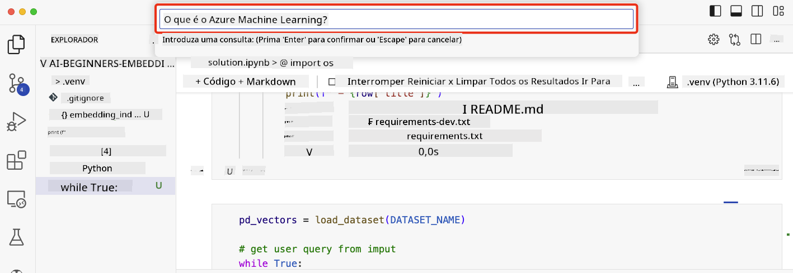

<!--
CO_OP_TRANSLATOR_METADATA:
{
  "original_hash": "58953c08b8ba7073b836d4270ea0fe86",
  "translation_date": "2025-10-18T00:38:01+00:00",
  "source_file": "08-building-search-applications/README.md",
  "language_code": "pt"
}
-->
# Construindo Aplicações de Pesquisa

[](https://youtu.be/W0-nzXjOjr0?si=GcsqiTTvd7RKbo7V)

> > _Clique na imagem acima para assistir ao vídeo desta lição_

Os LLMs vão além de chatbots e geração de texto. Também é possível construir aplicações de pesquisa utilizando Embeddings. Embeddings são representações numéricas de dados, também conhecidas como vetores, e podem ser usadas para busca semântica de dados.

Nesta lição, você vai construir uma aplicação de pesquisa para a nossa startup educacional. Nossa startup é uma organização sem fins lucrativos que oferece educação gratuita para estudantes em países em desenvolvimento. A startup possui um grande número de vídeos no YouTube que os estudantes podem usar para aprender sobre IA. A startup deseja criar uma aplicação de pesquisa que permita aos estudantes buscar um vídeo no YouTube digitando uma pergunta.

Por exemplo, um estudante pode digitar "O que são Jupyter Notebooks?" ou "O que é Azure ML?" e a aplicação de pesquisa retornará uma lista de vídeos no YouTube relevantes para a pergunta. Melhor ainda, a aplicação de pesquisa retornará um link para o ponto exato do vídeo onde a resposta à pergunta está localizada.

## Introdução

Nesta lição, vamos abordar:

- Busca semântica vs busca por palavras-chave.
- O que são Embeddings de Texto.
- Criando um Índice de Embeddings de Texto.
- Pesquisando em um Índice de Embeddings de Texto.

## Objetivos de Aprendizagem

Após concluir esta lição, você será capaz de:

- Diferenciar busca semântica de busca por palavras-chave.
- Explicar o que são Embeddings de Texto.
- Criar uma aplicação usando Embeddings para buscar dados.

## Por que construir uma aplicação de pesquisa?

Criar uma aplicação de pesquisa ajudará você a entender como usar Embeddings para buscar dados. Você também aprenderá a construir uma aplicação de pesquisa que pode ser usada por estudantes para encontrar informações rapidamente.

A lição inclui um Índice de Embeddings das transcrições do YouTube do canal [AI Show](https://www.youtube.com/playlist?list=PLlrxD0HtieHi0mwteKBOfEeOYf0LJU4O1) da Microsoft. O AI Show é um canal no YouTube que ensina sobre IA e aprendizado de máquina. O Índice de Embeddings contém os Embeddings de cada transcrição do YouTube até outubro de 2023. Você usará o Índice de Embeddings para construir uma aplicação de pesquisa para nossa startup. A aplicação de pesquisa retorna um link para o ponto exato do vídeo onde a resposta à pergunta está localizada. Esta é uma ótima maneira para os estudantes encontrarem rapidamente as informações de que precisam.

A seguir, um exemplo de uma consulta semântica para a pergunta "é possível usar rstudio com azure ml?". Confira a URL do YouTube, você verá que ela contém um timestamp que leva ao ponto exato do vídeo onde a resposta à pergunta está localizada.


## O que é busca semântica?

Agora você pode estar se perguntando, o que é busca semântica? Busca semântica é uma técnica de busca que utiliza a semântica, ou o significado, das palavras em uma consulta para retornar resultados relevantes.

Aqui está um exemplo de busca semântica. Digamos que você esteja procurando comprar um carro, você pode buscar por "meu carro dos sonhos". A busca semântica entende que você não está `sonhando` com um carro, mas sim procurando comprar o carro `ideal`. A busca semântica entende sua intenção e retorna resultados relevantes. A alternativa seria a `busca por palavras-chave`, que buscaria literalmente por sonhos sobre carros e frequentemente retornaria resultados irrelevantes.

## O que são Embeddings de Texto?

[Embeddings de texto](https://en.wikipedia.org/wiki/Word_embedding?WT.mc_id=academic-105485-koreyst) são uma técnica de representação de texto usada em [processamento de linguagem natural](https://en.wikipedia.org/wiki/Natural_language_processing?WT.mc_id=academic-105485-koreyst). Embeddings de texto são representações numéricas semânticas de texto. Embeddings são usados para representar dados de uma maneira que seja fácil para uma máquina entender. Existem muitos modelos para construir embeddings de texto, nesta lição, vamos focar em gerar embeddings usando o OpenAI Embedding Model.

Aqui está um exemplo, imagine que o seguinte texto está em uma transcrição de um dos episódios do canal AI Show no YouTube:

```text
Today we are going to learn about Azure Machine Learning.
```

Passaríamos o texto para a API de Embedding da OpenAI e ela retornaria o seguinte embedding composto por 1536 números, também conhecido como vetor. Cada número no vetor representa um aspecto diferente do texto. Para simplificar, aqui estão os primeiros 10 números do vetor.

```python
[-0.006655829958617687, 0.0026128944009542465, 0.008792596869170666, -0.02446001023054123, -0.008540431968867779, 0.022071078419685364, -0.010703742504119873, 0.003311325330287218, -0.011632772162556648, -0.02187200076878071, ...]
```

## Como o Índice de Embeddings é criado?

O Índice de Embeddings para esta lição foi criado com uma série de scripts em Python. Você encontrará os scripts junto com as instruções no [README](./scripts/README.md?WT.mc_id=academic-105485-koreyst) na pasta 'scripts' desta lição. Você não precisa executar esses scripts para concluir esta lição, pois o Índice de Embeddings já está fornecido.

Os scripts realizam as seguintes operações:

1. A transcrição de cada vídeo do YouTube na playlist do [AI Show](https://www.youtube.com/playlist?list=PLlrxD0HtieHi0mwteKBOfEeOYf0LJU4O1) é baixada.
2. Usando [Funções OpenAI](https://learn.microsoft.com/azure/ai-services/openai/how-to/function-calling?WT.mc_id=academic-105485-koreyst), tenta-se extrair o nome do palestrante dos primeiros 3 minutos da transcrição do YouTube. O nome do palestrante de cada vídeo é armazenado no Índice de Embeddings chamado `embedding_index_3m.json`.
3. O texto da transcrição é então dividido em **segmentos de texto de 3 minutos**. O segmento inclui cerca de 20 palavras sobrepostas do próximo segmento para garantir que o Embedding do segmento não seja cortado e para fornecer um melhor contexto de busca.
4. Cada segmento de texto é então passado para a API de Chat da OpenAI para resumir o texto em 60 palavras. O resumo também é armazenado no Índice de Embeddings `embedding_index_3m.json`.
5. Finalmente, o texto do segmento é passado para a API de Embedding da OpenAI. A API de Embedding retorna um vetor de 1536 números que representam o significado semântico do segmento. O segmento junto com o vetor de Embedding da OpenAI é armazenado em um Índice de Embeddings `embedding_index_3m.json`.

### Bancos de Dados de Vetores

Para simplificar a lição, o Índice de Embeddings é armazenado em um arquivo JSON chamado `embedding_index_3m.json` e carregado em um DataFrame do Pandas. No entanto, em produção, o Índice de Embeddings seria armazenado em um banco de dados de vetores como [Azure Cognitive Search](https://learn.microsoft.com/training/modules/improve-search-results-vector-search?WT.mc_id=academic-105485-koreyst), [Redis](https://cookbook.openai.com/examples/vector_databases/redis/readme?WT.mc_id=academic-105485-koreyst), [Pinecone](https://cookbook.openai.com/examples/vector_databases/pinecone/readme?WT.mc_id=academic-105485-koreyst), [Weaviate](https://cookbook.openai.com/examples/vector_databases/weaviate/readme?WT.mc_id=academic-105485-koreyst), entre outros.

## Entendendo a similaridade cosseno

Aprendemos sobre embeddings de texto, o próximo passo é aprender como usar embeddings de texto para buscar dados e, em particular, encontrar os embeddings mais similares a uma consulta usando a similaridade cosseno.

### O que é similaridade cosseno?

Similaridade cosseno é uma medida de similaridade entre dois vetores, também conhecida como `busca de vizinho mais próximo`. Para realizar uma busca de similaridade cosseno, você precisa _vetorizar_ o texto da _consulta_ usando a API de Embedding da OpenAI. Em seguida, calcular a _similaridade cosseno_ entre o vetor da consulta e cada vetor no Índice de Embeddings. Lembre-se, o Índice de Embeddings possui um vetor para cada segmento de texto da transcrição do YouTube. Finalmente, classifique os resultados pela similaridade cosseno e os segmentos de texto com maior similaridade cosseno são os mais similares à consulta.

Do ponto de vista matemático, a similaridade cosseno mede o cosseno do ângulo entre dois vetores projetados em um espaço multidimensional. Essa medida é útil porque, mesmo que dois documentos estejam distantes em distância euclidiana devido ao tamanho, eles ainda podem ter um ângulo menor entre si e, portanto, maior similaridade cosseno. Para mais informações sobre as equações de similaridade cosseno, veja [Similaridade cosseno](https://en.wikipedia.org/wiki/Cosine_similarity?WT.mc_id=academic-105485-koreyst).

## Construindo sua primeira aplicação de pesquisa

A seguir, vamos aprender como construir uma aplicação de pesquisa usando Embeddings. A aplicação de pesquisa permitirá que os estudantes busquem um vídeo digitando uma pergunta. A aplicação de pesquisa retornará uma lista de vídeos relevantes para a pergunta. A aplicação de pesquisa também retornará um link para o ponto exato do vídeo onde a resposta à pergunta está localizada.

Esta solução foi construída e testada no Windows 11, macOS e Ubuntu 22.04 usando Python 3.10 ou superior. Você pode baixar o Python em [python.org](https://www.python.org/downloads/?WT.mc_id=academic-105485-koreyst).

## Tarefa - construindo uma aplicação de pesquisa para capacitar os estudantes

Apresentamos nossa startup no início desta lição. Agora é hora de capacitar os estudantes a construir uma aplicação de pesquisa para suas avaliações.

Nesta tarefa, você criará os Serviços Azure OpenAI que serão usados para construir a aplicação de pesquisa. Você criará os seguintes Serviços Azure OpenAI. Será necessário ter uma assinatura do Azure para concluir esta tarefa.

### Iniciar o Azure Cloud Shell

1. Faça login no [portal do Azure](https://portal.azure.com/?WT.mc_id=academic-105485-koreyst).
2. Selecione o ícone do Cloud Shell no canto superior direito do portal do Azure.
3. Selecione **Bash** como tipo de ambiente.

#### Criar um grupo de recursos

> Para estas instruções, estamos usando o grupo de recursos chamado "semantic-video-search" no Leste dos EUA.
> Você pode alterar o nome do grupo de recursos, mas ao mudar a localização dos recursos,
> verifique a [tabela de disponibilidade de modelos](https://aka.ms/oai/models?WT.mc_id=academic-105485-koreyst).

```shell
az group create --name semantic-video-search --location eastus
```

#### Criar um recurso de Serviço OpenAI do Azure

No Azure Cloud Shell, execute o seguinte comando para criar um recurso de Serviço OpenAI do Azure.

```shell
az cognitiveservices account create --name semantic-video-openai --resource-group semantic-video-search \
    --location eastus --kind OpenAI --sku s0
```

#### Obter o endpoint e as chaves para uso nesta aplicação

No Azure Cloud Shell, execute os seguintes comandos para obter o endpoint e as chaves para o recurso de Serviço OpenAI do Azure.

```shell
az cognitiveservices account show --name semantic-video-openai \
   --resource-group  semantic-video-search | jq -r .properties.endpoint
az cognitiveservices account keys list --name semantic-video-openai \
   --resource-group semantic-video-search | jq -r .key1
```

#### Implantar o modelo de Embedding da OpenAI

No Azure Cloud Shell, execute o seguinte comando para implantar o modelo de Embedding da OpenAI.

```shell
az cognitiveservices account deployment create \
    --name semantic-video-openai \
    --resource-group  semantic-video-search \
    --deployment-name text-embedding-ada-002 \
    --model-name text-embedding-ada-002 \
    --model-version "2"  \
    --model-format OpenAI \
    --sku-capacity 100 --sku-name "Standard"
```

## Solução

Abra o [notebook de solução](./python/aoai-solution.ipynb?WT.mc_id=academic-105485-koreyst) no GitHub Codespaces e siga as instruções no Jupyter Notebook.

Quando você executar o notebook, será solicitado que insira uma consulta. A caixa de entrada será semelhante a esta:



## Excelente Trabalho! Continue Aprendendo

Após concluir esta lição, confira nossa [coleção de aprendizado sobre IA Generativa](https://aka.ms/genai-collection?WT.mc_id=academic-105485-koreyst) para continuar aprimorando seus conhecimentos sobre IA Generativa!

Vá para a Lição 9, onde veremos como [construir aplicações de geração de imagens](../09-building-image-applications/README.md?WT.mc_id=academic-105485-koreyst)!

---

**Aviso Legal**:  
Este documento foi traduzido utilizando o serviço de tradução por IA [Co-op Translator](https://github.com/Azure/co-op-translator). Embora nos esforcemos pela precisão, esteja ciente de que traduções automáticas podem conter erros ou imprecisões. O documento original na sua língua nativa deve ser considerado a fonte autoritária. Para informações críticas, recomenda-se uma tradução profissional humana. Não nos responsabilizamos por quaisquer mal-entendidos ou interpretações incorretas decorrentes do uso desta tradução.