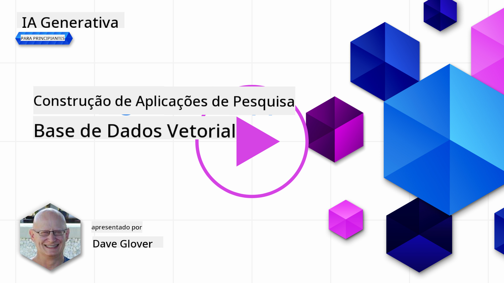

<!--
CO_OP_TRANSLATOR_METADATA:
{
  "original_hash": "d46aad0917a1a342d613e2c13d457da5",
  "translation_date": "2025-07-09T12:53:13+00:00",
  "source_file": "08-building-search-applications/README.md",
  "language_code": "pt"
}
-->
# Construir Aplicações de Pesquisa

[](https://aka.ms/gen-ai-lesson8-gh?WT.mc_id=academic-105485-koreyst)

> > _Clique na imagem acima para ver o vídeo desta lição_

Os LLMs vão além dos chatbots e da geração de texto. Também é possível construir aplicações de pesquisa usando Embeddings. Embeddings são representações numéricas de dados, também conhecidas como vetores, e podem ser usadas para pesquisa semântica de dados.

Nesta lição, vais construir uma aplicação de pesquisa para a nossa startup de educação. A nossa startup é uma organização sem fins lucrativos que oferece educação gratuita a estudantes em países em desenvolvimento. A nossa startup tem um grande número de vídeos no YouTube que os estudantes podem usar para aprender sobre IA. Queremos construir uma aplicação de pesquisa que permita aos estudantes procurar um vídeo do YouTube ao escrever uma pergunta.

Por exemplo, um estudante pode escrever "O que são Jupyter Notebooks?" ou "O que é Azure ML" e a aplicação de pesquisa irá devolver uma lista de vídeos do YouTube relevantes para a pergunta e, melhor ainda, a aplicação irá devolver um link para o ponto do vídeo onde a resposta à pergunta está localizada.

## Introdução

Nesta lição, vamos abordar:

- Pesquisa semântica vs pesquisa por palavras-chave.
- O que são Text Embeddings.
- Criar um Índice de Text Embeddings.
- Pesquisar num Índice de Text Embeddings.

## Objetivos de Aprendizagem

Após completar esta lição, serás capaz de:

- Diferenciar pesquisa semântica de pesquisa por palavras-chave.
- Explicar o que são Text Embeddings.
- Criar uma aplicação usando Embeddings para pesquisar dados.

## Por que construir uma aplicação de pesquisa?

Criar uma aplicação de pesquisa vai ajudar-te a entender como usar Embeddings para pesquisar dados. Também vais aprender a construir uma aplicação de pesquisa que pode ser usada por estudantes para encontrar informação rapidamente.

A lição inclui um Índice de Embeddings das transcrições do YouTube do canal Microsoft [AI Show](https://www.youtube.com/playlist?list=PLlrxD0HtieHi0mwteKBOfEeOYf0LJU4O1). O AI Show é um canal do YouTube que ensina sobre IA e machine learning. O Índice de Embeddings contém os Embeddings para cada uma das transcrições do YouTube até outubro de 2023. Vais usar este Índice para construir a aplicação de pesquisa para a nossa startup. A aplicação de pesquisa devolve um link para o ponto do vídeo onde a resposta à pergunta está localizada. Esta é uma ótima forma para os estudantes encontrarem rapidamente a informação que precisam.

Segue um exemplo de uma consulta semântica para a pergunta "posso usar rstudio com azure ml?". Repara na URL do YouTube, vais ver que contém um timestamp que te leva ao ponto do vídeo onde a resposta está.


## O que é pesquisa semântica?

Agora deves estar a perguntar, o que é pesquisa semântica? Pesquisa semântica é uma técnica de pesquisa que usa a semântica, ou o significado, das palavras numa consulta para devolver resultados relevantes.

Aqui está um exemplo de pesquisa semântica. Imagina que queres comprar um carro, podes pesquisar por "o meu carro de sonho". A pesquisa semântica entende que não estás a `sonhar` com um carro, mas sim que procuras o teu carro `ideal`. A pesquisa semântica percebe a tua intenção e devolve resultados relevantes. A alternativa é a `pesquisa por palavras-chave` que procuraria literalmente por sonhos com carros e muitas vezes devolve resultados irrelevantes.

## O que são Text Embeddings?

[Text embeddings](https://en.wikipedia.org/wiki/Word_embedding?WT.mc_id=academic-105485-koreyst) são uma técnica de representação de texto usada em [processamento de linguagem natural](https://en.wikipedia.org/wiki/Natural_language_processing?WT.mc_id=academic-105485-koreyst). Text embeddings são representações numéricas semânticas do texto. Embeddings são usados para representar dados de uma forma que é fácil para uma máquina entender. Existem muitos modelos para criar text embeddings, nesta lição vamos focar-nos em gerar embeddings usando o Modelo de Embeddings da OpenAI.

Aqui está um exemplo, imagina que o seguinte texto está numa transcrição de um dos episódios do canal AI Show no YouTube:

```text
Today we are going to learn about Azure Machine Learning.
```

Passaríamos o texto para a API de Embeddings da OpenAI e ela devolveria o seguinte embedding composto por 1536 números, também conhecido como vetor. Cada número no vetor representa um aspeto diferente do texto. Para simplificar, aqui estão os primeiros 10 números do vetor.

```python
[-0.006655829958617687, 0.0026128944009542465, 0.008792596869170666, -0.02446001023054123, -0.008540431968867779, 0.022071078419685364, -0.010703742504119873, 0.003311325330287218, -0.011632772162556648, -0.02187200076878071, ...]
```

## Como é criado o índice de Embeddings?

O índice de Embeddings para esta lição foi criado com uma série de scripts em Python. Vais encontrar os scripts juntamente com as instruções no [README](./scripts/README.md?WT.mc_id=academic-105485-koreyst) na pasta 'scripts' desta lição. Não precisas de executar estes scripts para completar a lição, pois o Índice de Embeddings é fornecido.

Os scripts realizam as seguintes operações:

1. A transcrição de cada vídeo do YouTube na playlist [AI Show](https://www.youtube.com/playlist?list=PLlrxD0HtieHi0mwteKBOfEeOYf0LJU4O1) é descarregada.
2. Usando [OpenAI Functions](https://learn.microsoft.com/azure/ai-services/openai/how-to/function-calling?WT.mc_id=academic-105485-koreyst), tenta-se extrair o nome do orador dos primeiros 3 minutos da transcrição do YouTube. O nome do orador para cada vídeo é armazenado no Índice de Embeddings chamado `embedding_index_3m.json`.
3. O texto da transcrição é depois dividido em **segmentos de texto de 3 minutos**. O segmento inclui cerca de 20 palavras sobrepostas do segmento seguinte para garantir que o Embedding do segmento não é cortado e para fornecer melhor contexto de pesquisa.
4. Cada segmento de texto é passado para a API Chat da OpenAI para resumir o texto em 60 palavras. O resumo também é armazenado no Índice de Embeddings `embedding_index_3m.json`.
5. Finalmente, o texto do segmento é passado para a API de Embeddings da OpenAI. A API de Embeddings devolve um vetor de 1536 números que representam o significado semântico do segmento. O segmento juntamente com o vetor de Embeddings da OpenAI é armazenado no Índice de Embeddings `embedding_index_3m.json`.

### Bases de Dados Vetoriais

Para simplificar a lição, o Índice de Embeddings está armazenado num ficheiro JSON chamado `embedding_index_3m.json` e carregado num DataFrame do Pandas. No entanto, em produção, o Índice de Embeddings seria armazenado numa base de dados vetorial como [Azure Cognitive Search](https://learn.microsoft.com/training/modules/improve-search-results-vector-search?WT.mc_id=academic-105485-koreyst), [Redis](https://cookbook.openai.com/examples/vector_databases/redis/readme?WT.mc_id=academic-105485-koreyst), [Pinecone](https://cookbook.openai.com/examples/vector_databases/pinecone/readme?WT.mc_id=academic-105485-koreyst), [Weaviate](https://cookbook.openai.com/examples/vector_databases/weaviate/readme?WT.mc_id=academic-105485-koreyst), entre outras.

## Compreender a similaridade do cosseno

Já aprendemos sobre text embeddings, o próximo passo é aprender a usar text embeddings para pesquisar dados e, em particular, encontrar os embeddings mais semelhantes a uma dada consulta usando similaridade do cosseno.

### O que é similaridade do cosseno?

Similaridade do cosseno é uma medida de semelhança entre dois vetores, também conhecida como `pesquisa do vizinho mais próximo`. Para realizar uma pesquisa por similaridade do cosseno, precisas de _vetorizar_ o texto da _consulta_ usando a API de Embeddings da OpenAI. Depois calculas a _similaridade do cosseno_ entre o vetor da consulta e cada vetor no Índice de Embeddings. Lembra-te, o Índice de Embeddings tem um vetor para cada segmento de texto da transcrição do YouTube. Por fim, ordena os resultados pela similaridade do cosseno e os segmentos de texto com maior similaridade são os mais semelhantes à consulta.

Do ponto de vista matemático, a similaridade do cosseno mede o cosseno do ângulo entre dois vetores projetados num espaço multidimensional. Esta medida é útil porque, se dois documentos estiverem distantes pela distância Euclidiana devido ao tamanho, ainda podem ter um ângulo menor entre eles e, portanto, uma maior similaridade do cosseno. Para mais informações sobre as equações da similaridade do cosseno, vê [Similaridade do cosseno](https://en.wikipedia.org/wiki/Cosine_similarity?WT.mc_id=academic-105485-koreyst).

## Construir a tua primeira aplicação de pesquisa

A seguir, vamos aprender a construir uma aplicação de pesquisa usando Embeddings. A aplicação permitirá que os estudantes procurem um vídeo ao escrever uma pergunta. A aplicação irá devolver uma lista de vídeos relevantes para a pergunta. Também irá devolver um link para o ponto do vídeo onde a resposta está localizada.

Esta solução foi construída e testada no Windows 11, macOS e Ubuntu 22.04 usando Python 3.10 ou superior. Podes descarregar o Python em [python.org](https://www.python.org/downloads/?WT.mc_id=academic-105485-koreyst).

## Tarefa - construir uma aplicação de pesquisa para ajudar os estudantes

Apresentámos a nossa startup no início desta lição. Agora é altura de capacitar os estudantes a construir uma aplicação de pesquisa para as suas avaliações.

Nesta tarefa, vais criar os Serviços Azure OpenAI que serão usados para construir a aplicação de pesquisa. Vais criar os seguintes Serviços Azure OpenAI. Vais precisar de uma subscrição Azure para completar esta tarefa.

### Iniciar o Azure Cloud Shell

1. Inicia sessão no [portal Azure](https://portal.azure.com/?WT.mc_id=academic-105485-koreyst).
2. Seleciona o ícone do Cloud Shell no canto superior direito do portal Azure.
3. Seleciona **Bash** como tipo de ambiente.

#### Criar um grupo de recursos

> Para estas instruções, estamos a usar o grupo de recursos chamado "semantic-video-search" na região East US.
> Podes alterar o nome do grupo de recursos, mas ao mudar a localização dos recursos,
> verifica a [tabela de disponibilidade dos modelos](https://aka.ms/oai/models?WT.mc_id=academic-105485-koreyst).

```shell
az group create --name semantic-video-search --location eastus
```

#### Criar um recurso Azure OpenAI Service

No Azure Cloud Shell, executa o seguinte comando para criar um recurso Azure OpenAI Service.

```shell
az cognitiveservices account create --name semantic-video-openai --resource-group semantic-video-search \
    --location eastus --kind OpenAI --sku s0
```

#### Obter o endpoint e as chaves para uso nesta aplicação

No Azure Cloud Shell, executa os seguintes comandos para obter o endpoint e as chaves do recurso Azure OpenAI Service.

```shell
az cognitiveservices account show --name semantic-video-openai \
   --resource-group  semantic-video-search | jq -r .properties.endpoint
az cognitiveservices account keys list --name semantic-video-openai \
   --resource-group semantic-video-search | jq -r .key1
```

#### Implementar o modelo OpenAI Embedding

No Azure Cloud Shell, executa o seguinte comando para implementar o modelo OpenAI Embedding.

```shell
az cognitiveservices account deployment create \
    --name semantic-video-openai \
    --resource-group  semantic-video-search \
    --deployment-name text-embedding-ada-002 \
    --model-name text-embedding-ada-002 \
    --model-version "2"  \
    --model-format OpenAI \
    --sku-capacity 100 --sku-name "Standard"
```

## Solução

Abre o [notebook da solução](python/aoai-solution.ipynb) no GitHub Codespaces e segue as instruções no Jupyter Notebook.

Quando executares o notebook, serás solicitado a inserir uma consulta. A caixa de entrada será assim:


## Excelente trabalho! Continua a aprender

Depois de completares esta lição, explora a nossa [coleção de Aprendizagem de IA Generativa](https://aka.ms/genai-collection?WT.mc_id=academic-105485-koreyst) para continuares a aprofundar os teus conhecimentos em IA Generativa!

Segue para a Lição 9 onde vamos ver como [construir aplicações de geração de imagens](../09-building-image-applications/README.md?WT.mc_id=academic-105485-koreyst)!

**Aviso Legal**:  
Este documento foi traduzido utilizando o serviço de tradução automática [Co-op Translator](https://github.com/Azure/co-op-translator). Embora nos esforcemos pela precisão, por favor tenha em conta que traduções automáticas podem conter erros ou imprecisões. O documento original na sua língua nativa deve ser considerado a fonte autorizada. Para informações críticas, recomenda-se tradução profissional humana. Não nos responsabilizamos por quaisquer mal-entendidos ou interpretações incorretas decorrentes da utilização desta tradução.