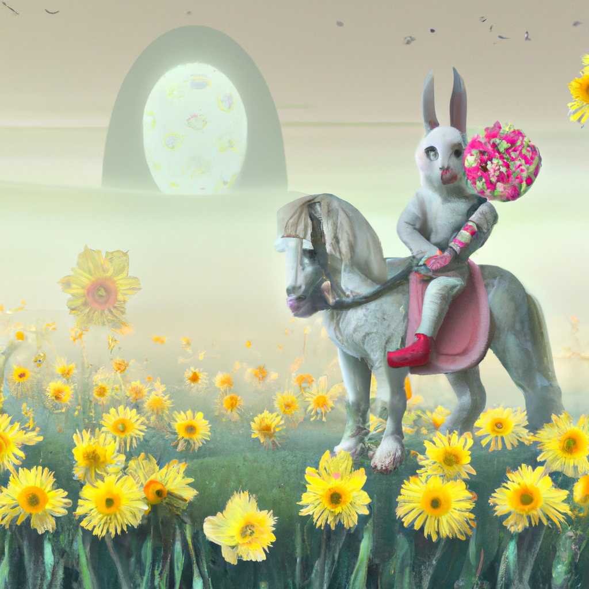

<!--
CO_OP_TRANSLATOR_METADATA:
{
  "original_hash": "ef74ad58fc01f7ad80788f79505f9816",
  "translation_date": "2025-08-26T16:20:49+00:00",
  "source_file": "09-building-image-applications/README.md",
  "language_code": "pt"
}
-->
# Construir Aplicações de Geração de Imagens

[](https://aka.ms/gen-ai-lesson9-gh?WT.mc_id=academic-105485-koreyst)

Os LLMs não servem apenas para gerar texto. Também é possível gerar imagens a partir de descrições em texto. Ter imagens como uma modalidade pode ser extremamente útil em várias áreas, desde MedTech, arquitetura, turismo, desenvolvimento de jogos e muito mais. Neste capítulo, vamos explorar os dois modelos de geração de imagens mais populares, DALL-E e Midjourney.

## Introdução

Nesta lição, vamos abordar:

- Geração de imagens e porque é útil.
- DALL-E e Midjourney, o que são e como funcionam.
- Como construir uma aplicação de geração de imagens.

## Objetivos de Aprendizagem

Depois de concluir esta lição, serás capaz de:

- Construir uma aplicação de geração de imagens.
- Definir limites para a tua aplicação com metaprompts.
- Trabalhar com DALL-E e Midjourney.

## Porque construir uma aplicação de geração de imagens?

As aplicações de geração de imagens são uma excelente forma de explorar as capacidades da IA Generativa. Podem ser usadas, por exemplo, para:

- **Edição e síntese de imagens**. Podes gerar imagens para vários casos de uso, como edição e síntese de imagens.

- **Aplicação em várias indústrias**. Também podem ser usadas para gerar imagens para diferentes sectores como MedTech, Turismo, Desenvolvimento de Jogos e outros.

## Cenário: Edu4All

Como parte desta lição, vamos continuar a trabalhar com a nossa startup, Edu4All. Os alunos vão criar imagens para as suas avaliações, sendo a escolha das imagens ao critério dos alunos, podendo ser ilustrações para o seu próprio conto de fadas, criar uma nova personagem para a sua história ou ajudá-los a visualizar ideias e conceitos.

Por exemplo, se estiverem a trabalhar na aula sobre monumentos, os alunos da Edu4All poderiam gerar algo como:


usando um prompt como

> "Cão ao lado da Torre Eiffel ao nascer do sol"

## O que são o DALL-E e o Midjourney?

[DALL-E](https://openai.com/dall-e-2?WT.mc_id=academic-105485-koreyst) e [Midjourney](https://www.midjourney.com/?WT.mc_id=academic-105485-koreyst) são dois dos modelos de geração de imagens mais populares, permitindo-te usar prompts para gerar imagens.

### DALL-E

Comecemos pelo DALL-E, que é um modelo de IA Generativa que cria imagens a partir de descrições em texto.

> [O DALL-E é uma combinação de dois modelos, CLIP e atenção difusa](https://towardsdatascience.com/openais-dall-e-and-clip-101-a-brief-introduction-3a4367280d4e?WT.mc_id=academic-105485-koreyst).

- **CLIP**, é um modelo que gera embeddings, que são representações numéricas de dados, a partir de imagens e texto.

- **Atenção difusa**, é um modelo que gera imagens a partir de embeddings. O DALL-E é treinado com um conjunto de dados de imagens e texto e pode ser usado para gerar imagens a partir de descrições em texto. Por exemplo, o DALL-E pode ser usado para criar imagens de um gato com um chapéu, ou de um cão com um moicano.

### Midjourney

O Midjourney funciona de forma semelhante ao DALL-E, gerando imagens a partir de prompts em texto. O Midjourney também pode ser usado para criar imagens com prompts como “um gato com um chapéu” ou “um cão com um moicano”.


_Crédito da imagem: Wikipedia, imagem gerada pelo Midjourney_

## Como funcionam o DALL-E e o Midjourney

Primeiro, [DALL-E](https://arxiv.org/pdf/2102.12092.pdf?WT.mc_id=academic-105485-koreyst). O DALL-E é um modelo de IA Generativa baseado na arquitetura transformer com um _transformer autoregressivo_.

Um _transformer autoregressivo_ define como um modelo gera imagens a partir de descrições em texto, criando um pixel de cada vez e usando os pixels já gerados para criar o próximo. O processo passa por várias camadas de uma rede neural até a imagem estar completa.

Com este processo, o DALL-E controla atributos, objetos, características e muito mais na imagem que gera. No entanto, o DALL-E 2 e 3 têm ainda mais controlo sobre a imagem gerada.

## Construir a tua primeira aplicação de geração de imagens

Então, o que é preciso para criar uma aplicação de geração de imagens? Vais precisar das seguintes bibliotecas:

- **python-dotenv**, é altamente recomendado usar esta biblioteca para manter os teus segredos num ficheiro _.env_ separado do código.
- **openai**, esta biblioteca é usada para interagir com a API da OpenAI.
- **pillow**, para trabalhar com imagens em Python.
- **requests**, para ajudar a fazer pedidos HTTP.

## Criar e implementar um modelo Azure OpenAI

Se ainda não o fizeste, segue as instruções na página do [Microsoft Learn](https://learn.microsoft.com/azure/ai-foundry/openai/how-to/create-resource?pivots=web-portal)
para criar um recurso e modelo Azure OpenAI. Seleciona o DALL-E 3 como modelo.  

## Criar a aplicação

1. Cria um ficheiro _.env_ com o seguinte conteúdo:

   ```text
   AZURE_OPENAI_ENDPOINT=<your endpoint>
   AZURE_OPENAI_API_KEY=<your key>
   AZURE_OPENAI_DEPLOYMENT="dall-e-3"
   ```

   Podes encontrar esta informação no Portal Azure OpenAI Foundry para o teu recurso, na secção "Deployments".

1. Junta as bibliotecas acima num ficheiro chamado _requirements.txt_ assim:

   ```text
   python-dotenv
   openai
   pillow
   requests
   ```

1. De seguida, cria um ambiente virtual e instala as bibliotecas:

   ```bash
   python3 -m venv venv
   source venv/bin/activate
   pip install -r requirements.txt
   ```

   No Windows, usa os seguintes comandos para criar e ativar o ambiente virtual:

   ```bash
   python3 -m venv venv
   venv\Scripts\activate.bat
   ```

1. Adiciona o seguinte código num ficheiro chamado _app.py_:

    ```python
    import openai
    import os
    import requests
    from PIL import Image
    import dotenv
    from openai import OpenAI, AzureOpenAI
    
    # import dotenv
    dotenv.load_dotenv()
    
    # configure Azure OpenAI service client 
    client = AzureOpenAI(
      azure_endpoint = os.environ["AZURE_OPENAI_ENDPOINT"],
      api_key=os.environ['AZURE_OPENAI_API_KEY'],
      api_version = "2024-02-01"
      )
    try:
        # Create an image by using the image generation API
        generation_response = client.images.generate(
                                prompt='Bunny on horse, holding a lollipop, on a foggy meadow where it grows daffodils',
                                size='1024x1024', n=1,
                                model=os.environ['AZURE_OPENAI_DEPLOYMENT']
                              )

        # Set the directory for the stored image
        image_dir = os.path.join(os.curdir, 'images')

        # If the directory doesn't exist, create it
        if not os.path.isdir(image_dir):
            os.mkdir(image_dir)

        # Initialize the image path (note the filetype should be png)
        image_path = os.path.join(image_dir, 'generated-image.png')

        # Retrieve the generated image
        image_url = generation_response.data[0].url  # extract image URL from response
        generated_image = requests.get(image_url).content  # download the image
        with open(image_path, "wb") as image_file:
            image_file.write(generated_image)

        # Display the image in the default image viewer
        image = Image.open(image_path)
        image.show()

    # catch exceptions
    except openai.InvalidRequestError as err:
        print(err)
   ```

Vamos explicar este código:

- Primeiro, importamos as bibliotecas necessárias, incluindo a biblioteca OpenAI, dotenv, requests e Pillow.

  ```python
  import openai
  import os
  import requests
  from PIL import Image
  import dotenv
  ```

- Depois, carregamos as variáveis de ambiente do ficheiro _.env_.

  ```python
  # import dotenv
  dotenv.load_dotenv()
  ```

- A seguir, configuramos o cliente do serviço Azure OpenAI 

  ```python
  # Get endpoint and key from environment variables
  client = AzureOpenAI(
      azure_endpoint = os.environ["AZURE_OPENAI_ENDPOINT"],
      api_key=os.environ['AZURE_OPENAI_API_KEY'],
      api_version = "2024-02-01"
      )
  ```

- Depois, geramos a imagem:

  ```python
  # Create an image by using the image generation API
  generation_response = client.images.generate(
                        prompt='Bunny on horse, holding a lollipop, on a foggy meadow where it grows daffodils',
                        size='1024x1024', n=1,
                        model=os.environ['AZURE_OPENAI_DEPLOYMENT']
                      )
  ```

  O código acima responde com um objeto JSON que contém o URL da imagem gerada. Podemos usar esse URL para descarregar a imagem e guardá-la num ficheiro.

- Por fim, abrimos a imagem e usamos o visualizador de imagens padrão para a mostrar:

  ```python
  image = Image.open(image_path)
  image.show()
  ```

### Mais detalhes sobre a geração da imagem

Vamos analisar o código que gera a imagem com mais detalhe:

    ```python
      generation_response = client.images.generate(
                                prompt='Bunny on horse, holding a lollipop, on a foggy meadow where it grows daffodils',
                                size='1024x1024', n=1,
                                model=os.environ['AZURE_OPENAI_DEPLOYMENT']
                            )
    ```

- **prompt**, é o texto usado para gerar a imagem. Neste caso, usamos o prompt "Coelho a cavalo, com um chupa-chupa, num prado com nevoeiro onde crescem narcisos".
- **size**, é o tamanho da imagem gerada. Aqui, estamos a gerar uma imagem de 1024x1024 píxeis.
- **n**, é o número de imagens a gerar. Neste caso, estamos a gerar duas imagens.
- **temperature**, é um parâmetro que controla o grau de aleatoriedade do resultado de um modelo de IA Generativa. O valor vai de 0 a 1, onde 0 significa que o resultado é determinístico e 1 significa que é aleatório. O valor por defeito é 0.7.

Há mais coisas que podes fazer com imagens, que veremos na próxima secção.

## Capacidades adicionais da geração de imagens

Já viste como conseguimos gerar uma imagem com apenas algumas linhas em Python. No entanto, há mais possibilidades.

Também podes:

- **Fazer edições**. Ao fornecer uma imagem existente, uma máscara e um prompt, podes alterar uma imagem. Por exemplo, podes adicionar algo a uma parte da imagem. Imagina a nossa imagem do coelho, podes adicionar um chapéu ao coelho. Para isso, forneces a imagem, uma máscara (identificando a área a alterar) e um prompt em texto a indicar o que deve ser feito. 
> Note: isto não é suportado no DALL-E 3. 
 
Aqui está um exemplo usando GPT Image:

    ```python
    response = client.images.edit(
        model="gpt-image-1",
        image=open("sunlit_lounge.png", "rb"),
        mask=open("mask.png", "rb"),
        prompt="A sunlit indoor lounge area with a pool containing a flamingo"
    )
    image_url = response.data[0].url
    ```

  A imagem base teria apenas o lounge com piscina, mas a imagem final teria um flamingo:

<div style="display: flex; justify-content: space-between; align-items: center; margin: 20px 0;">
  
  
  
</div>


- **Criar variações**. A ideia é pegar numa imagem existente e pedir que sejam criadas variações. Para criar uma variação, forneces uma imagem, um prompt em texto e um código como este:

  ```python
  response = openai.Image.create_variation(
    image=open("bunny-lollipop.png", "rb"),
    n=1,
    size="1024x1024"
  )
  image_url = response['data'][0]['url']
  ```

  > Nota: isto só é suportado na OpenAI

## Temperatura

A temperatura é um parâmetro que controla o grau de aleatoriedade do resultado de um modelo de IA Generativa. O valor vai de 0 a 1, onde 0 significa que o resultado é determinístico e 1 significa que é aleatório. O valor por defeito é 0.7.

Vamos ver um exemplo de como a temperatura funciona, executando este prompt duas vezes:

> Prompt : "Coelho a cavalo, com um chupa-chupa, num prado com nevoeiro onde crescem narcisos"


Agora vamos correr o mesmo prompt para ver que não obtemos a mesma imagem duas vezes:


Como podes ver, as imagens são semelhantes, mas não iguais. Vamos experimentar mudar o valor da temperatura para 0.1 e ver o que acontece:

```python
 generation_response = client.images.create(
        prompt='Bunny on horse, holding a lollipop, on a foggy meadow where it grows daffodils',    # Enter your prompt text here
        size='1024x1024',
        n=2
    )
```

### Alterar a temperatura

Vamos tentar tornar a resposta mais determinística. Observámos nas duas imagens que na primeira há um coelho e na segunda há um cavalo, ou seja, as imagens variam bastante.

Por isso, vamos alterar o nosso código e definir a temperatura para 0, assim:

```python
generation_response = client.images.create(
        prompt='Bunny on horse, holding a lollipop, on a foggy meadow where it grows daffodils',    # Enter your prompt text here
        size='1024x1024',
        n=2,
        temperature=0
    )
```

Agora, ao executar este código, obténs estas duas imagens:

- 
- 

Aqui podes ver claramente como as imagens se assemelham muito mais.

## Como definir limites para a tua aplicação com metaprompts

Com a nossa demo, já conseguimos gerar imagens para os nossos clientes. No entanto, precisamos de criar alguns limites para a aplicação.

Por exemplo, não queremos gerar imagens que não sejam apropriadas para o trabalho ou para crianças.

Podemos fazer isto com _metaprompts_. Metaprompts são prompts em texto usados para controlar o resultado de um modelo de IA Generativa. Por exemplo, podemos usar metaprompts para garantir que as imagens geradas são apropriadas para o trabalho ou para crianças.

### Como funciona?

Então, como funcionam os metaprompts?

Metaprompts são prompts em texto usados para controlar o resultado de um modelo de IA Generativa, são colocados antes do prompt principal e servem para controlar o resultado do modelo, sendo integrados nas aplicações para esse efeito. O prompt do utilizador e o metaprompt são encapsulados num único prompt de texto.

Um exemplo de metaprompt seria o seguinte:

```text
You are an assistant designer that creates images for children.

The image needs to be safe for work and appropriate for children.

The image needs to be in color.

The image needs to be in landscape orientation.

The image needs to be in a 16:9 aspect ratio.

Do not consider any input from the following that is not safe for work or appropriate for children.

(Input)

```

Agora, vejamos como podemos usar metaprompts na nossa demo.

```python
disallow_list = "swords, violence, blood, gore, nudity, sexual content, adult content, adult themes, adult language, adult humor, adult jokes, adult situations, adult"

meta_prompt =f"""You are an assistant designer that creates images for children.

The image needs to be safe for work and appropriate for children.

The image needs to be in color.

The image needs to be in landscape orientation.

The image needs to be in a 16:9 aspect ratio.

Do not consider any input from the following that is not safe for work or appropriate for children.
{disallow_list}
"""

prompt = f"{meta_prompt}
Create an image of a bunny on a horse, holding a lollipop"

# TODO add request to generate image
```

Pelo prompt acima, podes ver como todas as imagens criadas têm em conta o metaprompt.

## Exercício - vamos capacitar os alunos

Apresentámos a Edu4All no início desta lição. Agora é altura de permitir que os alunos gerem imagens para as suas avaliações.

Os alunos vão criar imagens para as suas avaliações com monumentos, sendo a escolha dos monumentos ao critério dos alunos. É pedido aos alunos que usem a sua criatividade para colocar estes monumentos em diferentes contextos.

## Solução

Aqui está uma possível solução:

```python
import openai
import os
import requests
from PIL import Image
import dotenv
from openai import AzureOpenAI
# import dotenv
dotenv.load_dotenv()

# Get endpoint and key from environment variables
client = AzureOpenAI(
  azure_endpoint = os.environ["AZURE_OPENAI_ENDPOINT"],
  api_key=os.environ['AZURE_OPENAI_API_KEY'],
  api_version = "2024-02-01"
  )


disallow_list = "swords, violence, blood, gore, nudity, sexual content, adult content, adult themes, adult language, adult humor, adult jokes, adult situations, adult"

meta_prompt = f"""You are an assistant designer that creates images for children.

The image needs to be safe for work and appropriate for children.

The image needs to be in color.

The image needs to be in landscape orientation.

The image needs to be in a 16:9 aspect ratio.

Do not consider any input from the following that is not safe for work or appropriate for children.
{disallow_list}
"""

prompt = f"""{meta_prompt}
Generate monument of the Arc of Triumph in Paris, France, in the evening light with a small child holding a Teddy looks on.
""""

try:
    # Create an image by using the image generation API
    generation_response = client.images.generate(
        prompt=prompt,    # Enter your prompt text here
        size='1024x1024',
        n=1,
    )
    # Set the directory for the stored image
    image_dir = os.path.join(os.curdir, 'images')

    # If the directory doesn't exist, create it
    if not os.path.isdir(image_dir):
        os.mkdir(image_dir)

    # Initialize the image path (note the filetype should be png)
    image_path = os.path.join(image_dir, 'generated-image.png')

    # Retrieve the generated image
    image_url = generation_response.data[0].url  # extract image URL from response
    generated_image = requests.get(image_url).content  # download the image
    with open(image_path, "wb") as image_file:
        image_file.write(generated_image)

    # Display the image in the default image viewer
    image = Image.open(image_path)
    image.show()

# catch exceptions
except openai.BadRequestError as err:
    print(err)
```

## Excelente trabalho! Continua a aprender
Depois de terminares esta lição, explora a nossa [coleção de aprendizagem sobre IA Generativa](https://aka.ms/genai-collection?WT.mc_id=academic-105485-koreyst) para continuares a aprofundar os teus conhecimentos em IA Generativa!

Segue para a Lição 10, onde vamos ver como [criar aplicações de IA com pouco código](../10-building-low-code-ai-applications/README.md?WT.mc_id=academic-105485-koreyst)

---

**Aviso Legal**:
Este documento foi traduzido utilizando o serviço de tradução por IA [Co-op Translator](https://github.com/Azure/co-op-translator). Embora nos esforcemos pela precisão, esteja ciente de que traduções automáticas podem conter erros ou imprecisões. O documento original na sua língua nativa deve ser considerado a fonte autorizada. Para informações críticas, recomenda-se a tradução profissional humana. Não nos responsabilizamos por quaisquer mal-entendidos ou interpretações incorretas resultantes do uso desta tradução.