<!--
CO_OP_TRANSLATOR_METADATA:
{
  "original_hash": "f5ff3b6204a695a117d6f452403c95f7",
  "translation_date": "2025-06-25T18:31:17+00:00",
  "source_file": "10-building-low-code-ai-applications/README.md",
  "language_code": "pt"
}
-->
# Construção de Aplicações de IA com Baixo Código

[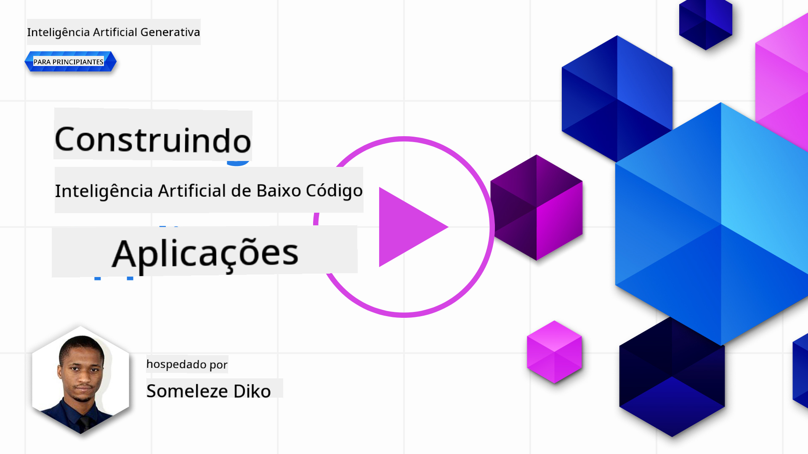](https://aka.ms/gen-ai-lesson10-gh?WT.mc_id=academic-105485-koreyst)

> _(Clique na imagem acima para ver o vídeo desta lição)_

## Introdução

Agora que aprendemos a construir aplicações de geração de imagens, vamos falar sobre baixo código. A IA generativa pode ser usada em várias áreas diferentes, incluindo baixo código, mas o que é baixo código e como podemos adicionar IA a ele?

Construir aplicações e soluções tornou-se mais fácil para desenvolvedores tradicionais e não desenvolvedores através do uso de Plataformas de Desenvolvimento de Baixo Código. Estas plataformas permitem construir aplicações e soluções com pouco ou nenhum código. Isso é alcançado através de um ambiente de desenvolvimento visual que permite arrastar e soltar componentes para construir aplicações e soluções. Isso permite construir aplicações e soluções mais rapidamente e com menos recursos. Nesta lição, vamos explorar como usar baixo código e como melhorar o desenvolvimento de baixo código com IA usando o Power Platform.

O Power Platform oferece às organizações a oportunidade de capacitar suas equipes para construir suas próprias soluções através de um ambiente intuitivo de baixo código ou sem código. Este ambiente ajuda a simplificar o processo de construção de soluções. Com o Power Platform, soluções podem ser construídas em dias ou semanas em vez de meses ou anos. O Power Platform é composto por cinco produtos principais: Power Apps, Power Automate, Power BI, Power Pages e Copilot Studio.

Esta lição aborda:

- Introdução à IA Generativa no Power Platform
- Introdução ao Copilot e como usá-lo
- Usar IA Generativa para construir aplicações e fluxos no Power Platform
- Compreender os Modelos de IA no Power Platform com o AI Builder

## Objetivos de Aprendizagem

Até o final desta lição, você será capaz de:

- Compreender como o Copilot funciona no Power Platform.

- Construir uma Aplicação de Rastreamento de Tarefas de Alunos para nossa startup educacional.

- Construir um Fluxo de Processamento de Faturas que usa IA para extrair informações de faturas.

- Aplicar as melhores práticas ao usar o Modelo de IA Criar Texto com GPT.

As ferramentas e tecnologias que você usará nesta lição são:

- **Power Apps**, para a aplicação de Rastreamento de Tarefas de Alunos, que fornece um ambiente de desenvolvimento de baixo código para construir aplicações para rastrear, gerenciar e interagir com dados.

- **Dataverse**, para armazenar os dados da aplicação de Rastreamento de Tarefas de Alunos, onde o Dataverse fornecerá uma plataforma de dados de baixo código para armazenar os dados da aplicação.

- **Power Automate**, para o fluxo de Processamento de Faturas onde você terá um ambiente de desenvolvimento de baixo código para construir fluxos de trabalho para automatizar o processo de Processamento de Faturas.

- **AI Builder**, para o Modelo de IA de Processamento de Faturas onde você usará Modelos de IA pré-construídos para processar as faturas da nossa startup.

## IA Generativa no Power Platform

Melhorar o desenvolvimento e a aplicação de baixo código com IA generativa é uma área de foco principal para o Power Platform. O objetivo é permitir que todos construam aplicações, sites, painéis e automatizem processos com IA, _sem exigir qualquer expertise em ciência de dados_. Este objetivo é alcançado integrando a IA generativa na experiência de desenvolvimento de baixo código no Power Platform na forma de Copilot e AI Builder.

### Como funciona?

O Copilot é um assistente de IA que permite construir soluções no Power Platform descrevendo seus requisitos em uma série de passos conversacionais usando linguagem natural. Você pode, por exemplo, instruir seu assistente de IA a declarar quais campos sua aplicação usará e ele criará tanto a aplicação quanto o modelo de dados subjacente ou você pode especificar como configurar um fluxo no Power Automate.

Você pode usar funcionalidades impulsionadas pelo Copilot como uma característica nas telas da sua aplicação para permitir que os usuários descubram insights através de interações conversacionais.

O AI Builder é uma capacidade de IA de baixo código disponível no Power Platform que permite usar Modelos de IA para ajudar a automatizar processos e prever resultados. Com o AI Builder, você pode trazer IA para suas aplicações e fluxos que se conectam aos seus dados no Dataverse ou em várias fontes de dados na nuvem, como SharePoint, OneDrive ou Azure.

O Copilot está disponível em todos os produtos do Power Platform: Power Apps, Power Automate, Power BI, Power Pages e Power Virtual Agents. O AI Builder está disponível no Power Apps e no Power Automate. Nesta lição, vamos nos concentrar em como usar o Copilot e o AI Builder no Power Apps e no Power Automate para construir uma solução para nossa startup educacional.

### Copilot no Power Apps

Como parte do Power Platform, o Power Apps fornece um ambiente de desenvolvimento de baixo código para construir aplicações para rastrear, gerenciar e interagir com dados. É um conjunto de serviços de desenvolvimento de aplicações com uma plataforma de dados escalável e a capacidade de se conectar a serviços em nuvem e dados locais. O Power Apps permite construir aplicações que funcionam em navegadores, tablets e telefones, e podem ser compartilhadas com colegas de trabalho. O Power Apps facilita o desenvolvimento de aplicações com uma interface simples, para que qualquer usuário de negócios ou desenvolvedor profissional possa construir aplicações personalizadas. A experiência de desenvolvimento de aplicações também é aprimorada com IA Generativa através do Copilot.

A funcionalidade de assistente de IA copilot no Power Apps permite descrever que tipo de aplicação você precisa e que informações você quer que sua aplicação rastreie, colete ou mostre. O Copilot então gera uma aplicação responsiva em Canvas com base na sua descrição. Você pode então personalizar a aplicação para atender às suas necessidades. O AI Copilot também gera e sugere uma Tabela Dataverse com os campos que você precisa para armazenar os dados que deseja rastrear e alguns dados de exemplo. Vamos ver o que é o Dataverse e como você pode usá-lo no Power Apps nesta lição mais adiante. Você pode então personalizar a tabela para atender às suas necessidades usando a funcionalidade de assistente AI Copilot através de passos conversacionais. Esta funcionalidade está prontamente disponível na tela inicial do Power Apps.

### Copilot no Power Automate

Como parte do Power Platform, o Power Automate permite que os usuários criem fluxos de trabalho automatizados entre aplicações e serviços. Ele ajuda a automatizar processos repetitivos de negócios, como comunicação, coleta de dados e aprovações de decisão. Sua interface simples permite que usuários com qualquer competência técnica (de iniciantes a desenvolvedores experientes) automatizem tarefas de trabalho. A experiência de desenvolvimento de fluxos de trabalho também é aprimorada com IA Generativa através do Copilot.

A funcionalidade de assistente de IA copilot no Power Automate permite descrever que tipo de fluxo você precisa e quais ações você quer que seu fluxo execute. O Copilot então gera um fluxo com base na sua descrição. Você pode então personalizar o fluxo para atender às suas necessidades. O AI Copilot também gera e sugere as ações que você precisa para executar a tarefa que deseja automatizar. Vamos ver o que são fluxos e como você pode usá-los no Power Automate nesta lição mais adiante. Você pode então personalizar as ações para atender às suas necessidades usando a funcionalidade de assistente AI Copilot através de passos conversacionais. Esta funcionalidade está prontamente disponível na tela inicial do Power Automate.

## Tarefa: Gerenciar tarefas de alunos e faturas para nossa startup, usando Copilot

Nossa startup oferece cursos online para alunos. A startup cresceu rapidamente e agora está lutando para acompanhar a demanda por seus cursos. A startup contratou você como desenvolvedor do Power Platform para ajudá-los a construir uma solução de baixo código para ajudá-los a gerenciar suas tarefas de alunos e faturas. A solução deles deve ser capaz de ajudá-los a rastrear e gerenciar tarefas de alunos através de uma aplicação e automatizar o processo de processamento de faturas através de um fluxo de trabalho. Você foi solicitado a usar IA Generativa para desenvolver a solução.

Ao começar a usar o Copilot, você pode usar a [Biblioteca de Prompts do Copilot do Power Platform](https://github.com/pnp/powerplatform-prompts?WT.mc_id=academic-109639-somelezediko) para começar com os prompts. Esta biblioteca contém uma lista de prompts que você pode usar para construir aplicações e fluxos com o Copilot. Você também pode usar os prompts na biblioteca para ter uma ideia de como descrever seus requisitos para o Copilot.

### Construir uma Aplicação de Rastreamento de Tarefas de Alunos para Nossa Startup

Os educadores da nossa startup têm lutado para acompanhar as tarefas dos alunos. Eles têm usado uma planilha para rastrear as tarefas, mas isso se tornou difícil de gerenciar à medida que o número de alunos aumentou. Eles pediram para você construir uma aplicação que os ajude a rastrear e gerenciar tarefas de alunos. A aplicação deve permitir que eles adicionem novas tarefas, visualizem tarefas, atualizem tarefas e excluam tarefas. A aplicação também deve permitir que educadores e alunos visualizem as tarefas que foram avaliadas e as que não foram avaliadas.

Você construirá a aplicação usando o Copilot no Power Apps seguindo os passos abaixo:

1. Navegue até a tela inicial do [Power Apps](https://make.powerapps.com?WT.mc_id=academic-105485-koreyst).

1. Use a área de texto na tela inicial para descrever a aplicação que deseja construir. Por exemplo, **_Quero construir uma aplicação para rastrear e gerenciar tarefas de alunos_**. Clique no botão **Enviar** para enviar o prompt ao AI Copilot.

1. O AI Copilot sugerirá uma Tabela Dataverse com os campos que você precisa para armazenar os dados que deseja rastrear e alguns dados de exemplo. Você pode então personalizar a tabela para atender às suas necessidades usando a funcionalidade de assistente AI Copilot através de passos conversacionais.

   > **Importante**: Dataverse é a plataforma de dados subjacente para o Power Platform. É uma plataforma de dados de baixo código para armazenar os dados da aplicação. É um serviço totalmente gerenciado que armazena dados de forma segura na Nuvem da Microsoft e é provisionado dentro do seu ambiente do Power Platform. Ele vem com capacidades de governança de dados integradas, como classificação de dados, linhagem de dados, controle de acesso detalhado, e mais. Você pode aprender mais sobre o Dataverse [aqui](https://docs.microsoft.com/powerapps/maker/data-platform/data-platform-intro?WT.mc_id=academic-109639-somelezediko).

   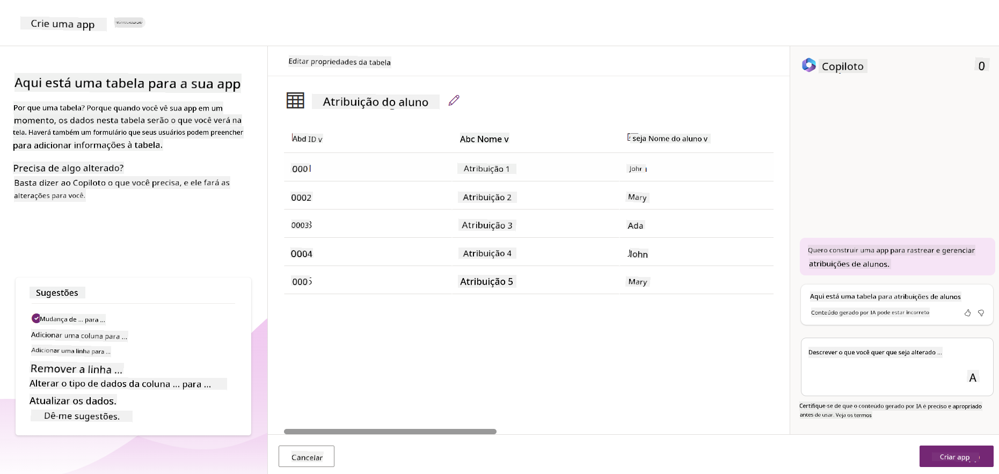

1. Os educadores querem enviar e-mails aos alunos que enviaram suas tarefas para mantê-los atualizados sobre o progresso de suas tarefas. Você pode usar o Copilot para adicionar um novo campo à tabela para armazenar o e-mail do aluno. Por exemplo, você pode usar o seguinte prompt para adicionar um novo campo à tabela: **_Quero adicionar uma coluna para armazenar o e-mail do aluno_**. Clique no botão **Enviar** para enviar o prompt ao AI Copilot.

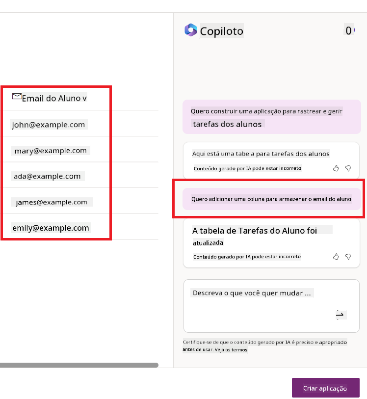

1. O AI Copilot gerará um novo campo e você poderá personalizar o campo para atender às suas necessidades.

1. Uma vez que terminar com a tabela, clique no botão **Criar aplicação** para criar a aplicação.

1. O AI Copilot gerará uma aplicação responsiva em Canvas com base na sua descrição. Você pode então personalizar a aplicação para atender às suas necessidades.

1. Para que os educadores enviem e-mails aos alunos, você pode usar o Copilot para adicionar uma nova tela à aplicação. Por exemplo, você pode usar o seguinte prompt para adicionar uma nova tela à aplicação: **_Quero adicionar uma tela para enviar e-mails aos alunos_**. Clique no botão **Enviar** para enviar o prompt ao AI Copilot.

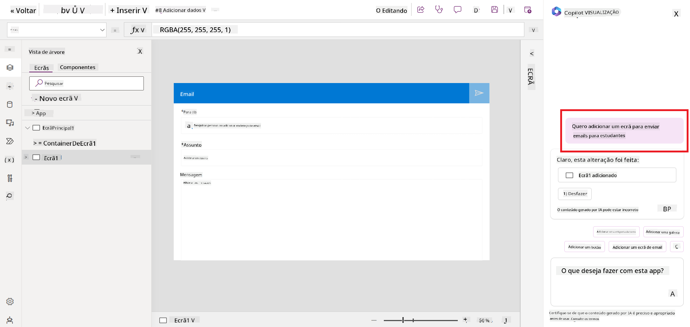

1. O AI Copilot gerará uma nova tela e você poderá personalizar a tela para atender às suas necessidades.

1. Uma vez que terminar com a aplicação, clique no botão **Salvar** para salvar a aplicação.

1. Para compartilhar a aplicação com os educadores, clique no botão **Compartilhar** e, em seguida, clique no botão **Compartilhar** novamente. Você pode então compartilhar a aplicação com os educadores inserindo seus endereços de e-mail.

> **Seu dever de casa**: A aplicação que você acabou de construir é um bom começo, mas pode ser melhorada. Com a funcionalidade de e-mail, os educadores só podem enviar e-mails aos alunos manualmente, tendo que digitar seus e-mails. Você pode usar o Copilot para construir uma automação que permita aos educadores enviar e-mails aos alunos automaticamente quando eles enviarem suas tarefas? Sua dica é que, com o prompt certo, você pode usar o Copilot no Power Automate para construir isso.

### Construir uma Tabela de Informações de Faturas para Nossa Startup

A equipe financeira da nossa startup tem lutado para acompanhar as faturas. Eles têm usado uma planilha para rastrear as faturas, mas isso se tornou difícil de gerenciar à medida que o número de faturas aumentou. Eles pediram para você construir uma tabela que os ajude a armazenar, rastrear e gerenciar as informações das faturas que receberam. A tabela deve ser usada para construir uma automação que extraia todas as informações das faturas e as armazene na tabela. A tabela também deve permitir que a equipe financeira visualize as faturas que foram pagas e as que não foram pagas.

O Power Platform possui uma plataforma de dados subjacente chamada Dataverse que permite armazenar os dados das suas aplicações e soluções. O Dataverse fornece uma plataforma de dados de baixo código para armazenar os dados da aplicação. É um serviço totalmente gerenciado que armazena dados de forma segura na Nuvem da Microsoft e é provisionado dentro do seu ambiente do Power Platform. Ele vem com capacidades de governança de dados integradas, como classificação de dados, linhagem de dados, controle de acesso detalhado, e mais. Você pode aprender mais [sobre o Dataverse aqui](https://docs.microsoft.com/powerapps/maker/data-platform/data-platform-intro?WT.mc_id=academic-109639-somelezediko).

Por que devemos usar o Dataverse para nossa startup? As tabelas padrão e personalizadas dentro do Dataverse oferecem uma opção de armazenamento seguro e baseado na nuvem para seus dados. As tabelas permitem armazenar diferentes tipos de dados, semelhante a como você pode usar várias planilhas em um único livro de Excel. Você pode usar tabelas para armazenar dados que são específicos para suas necessidades organizacionais ou empresariais. Alguns dos benefícios que nossa startup obterá ao usar o Dataverse incluem, mas não se limitam a:

- **Fácil de gerenciar**: Tanto os metadados quanto os dados são armazenados na nuvem, então você não precisa se preocupar com os detalhes de como eles são armazenados ou gerenciados. Você pode se concentrar em construir suas aplicações e soluções.

- **Seguro**: O Dataverse oferece uma opção de armazenamento seguro e baseado na nuvem para seus dados. Você pode controlar quem tem acesso aos dados nas suas tabelas e como eles podem acessá-los usando segurança baseada em funções.

- **Metadados ricos**: Tipos de dados e relacionamentos são usados diretamente dentro do Power Apps.

- **Lógica e validação**: Você pode usar regras de negócios, campos calculados e regras de validação para impor lógica de negócios e manter a precisão dos dados.

Agora que você sabe o que é o Dataverse e por que deve usá-lo, vamos ver como você pode usar o Copilot para criar uma tabela no Dataverse para atender aos requisitos da nossa equipe financeira.

> **Nota**: Você usará esta tabela na próxima seção para construir uma automação que extraia todas as informações das faturas e as armazene na tabela. Para criar uma tabela no Dataverse usando o Copilot, siga os passos abaixo: 1. Navegue até a tela inicial do [Power Apps](https://make.powerapps.com?WT.mc_id=academic-105485-koreyst). 2. Na barra de navegação à esquerda, selecione **Tabelas** e, em seguida, clique em **Descrever a nova Tabela**. 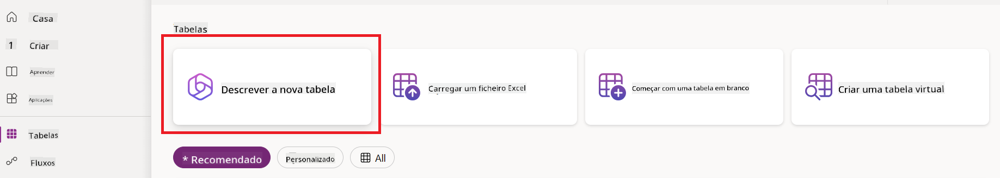 1. Na tela **Descrever a nova Tabela**, use a área de texto para descrever a tabela que deseja criar. Por exemplo, **_Quero criar uma tabela para armazenar informações de faturas_**. Clique no botão **Enviar** para enviar o prompt ao AI Copilot. 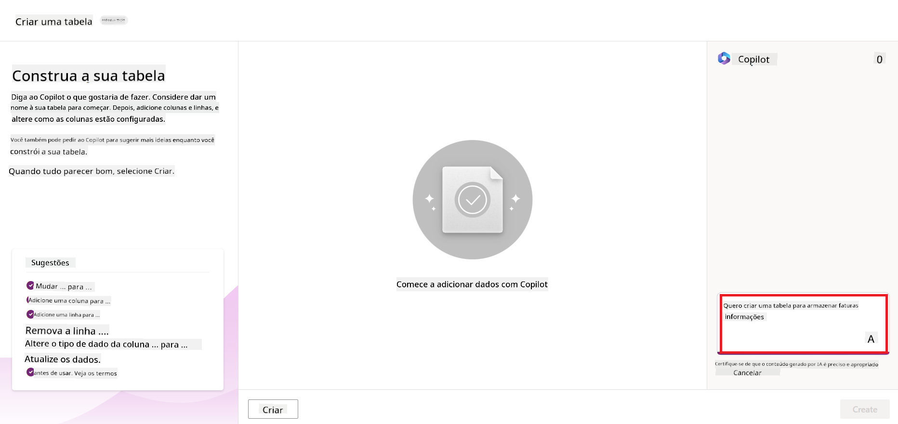 1. O AI Copilot sugerirá uma Tabela Dataverse com os campos que você precisa para armazenar os dados que deseja rastrear e alguns dados de exemplo. Você pode então personalizar a tabela para atender às suas necessidades usando a funcionalidade de assistente AI Copilot através de passos conversacionais. 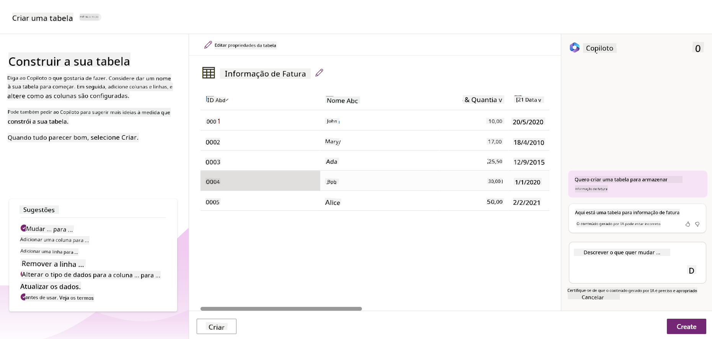 1. A equipe financeira quer enviar um e-mail ao fornecedor para atualizá-lo com o status atual de sua fatura. Você pode usar o Copilot para adicionar um novo campo à tabela para armazenar o e-mail do fornecedor. Por exemplo, você pode usar o seguinte prompt para adicionar um novo campo à tabela: **_Quero adicionar uma coluna para armazenar o e-mail do fornecedor_**. Clique no botão **Enviar** para enviar o prompt ao AI Copilot. 1. O AI Copilot gerará um novo campo e você poderá personalizar o campo para atender às suas necessidades. 1. Uma vez que terminar com a tabela, clique no botão **Criar** para criar a tabela. ## Modelos de IA no Power Platform com AI Builder O AI Builder é uma capacidade de IA de baixo código disponível no Power Platform que permite usar Modelos de IA para ajudar a automatizar processos e prever resultados. Com o AI Builder, você pode trazer IA para suas aplicações e fluxos que se conectam aos seus dados no Dataverse ou em várias fontes de dados na nuvem, como SharePoint, OneDrive ou Azure. ## Modelos de IA Pré-construídos vs Modelos de IA Personalizados O AI Builder fornece
um texto. - **Análise de Sentimentos**: Este modelo deteta sentimentos positivos, negativos, neutros ou mistos em texto. - **Leitor de Cartões de Visita**: Este modelo extrai informações de cartões de visita. - **Reconhecimento de Texto**: Este modelo extrai texto de imagens. - **Deteção de Objetos**: Este modelo deteta e extrai objetos de imagens. - **Processamento de Documentos**: Este modelo extrai informações de formulários. - **Processamento de Faturas**: Este modelo extrai informações de faturas. Com Modelos de IA Personalizados, pode trazer o seu próprio modelo para o AI Builder para que funcione como qualquer modelo personalizado do AI Builder, permitindo-lhe treinar o modelo usando os seus próprios dados. Pode usar estes modelos para automatizar processos e prever resultados tanto no Power Apps como no Power Automate. Ao usar o seu próprio modelo, existem limitações que se aplicam. Leia mais sobre estas [limitações](https://learn.microsoft.com/ai-builder/byo-model#limitations?WT.mc_id=academic-105485-koreyst). 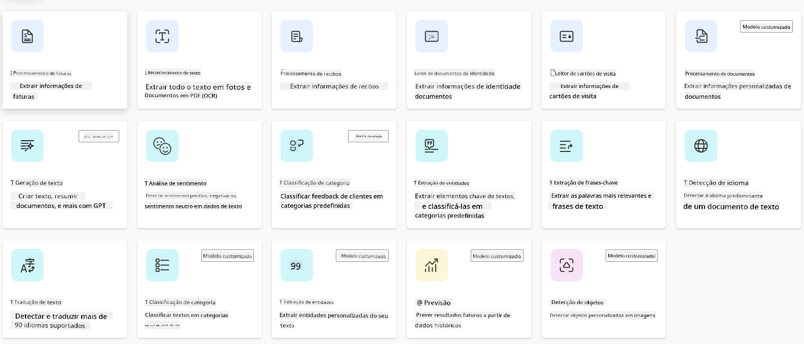

## Tarefa #2 - Construir um Fluxo de Processamento de Faturas para a Nossa Startup

A equipa financeira tem tido dificuldades em processar faturas. Têm usado uma folha de cálculo para acompanhar as faturas, mas isto tornou-se difícil de gerir à medida que o número de faturas aumentou. Pediram-lhe para construir um fluxo de trabalho que os ajude a processar faturas usando IA. O fluxo de trabalho deve permitir-lhes extrair informações das faturas e armazenar as informações numa tabela do Dataverse. O fluxo de trabalho também deve permitir-lhes enviar um email à equipa financeira com as informações extraídas.

Agora que sabe o que é o AI Builder e porque deve usá-lo, vamos ver como pode usar o Modelo de IA de Processamento de Faturas no AI Builder, que abordámos anteriormente, para construir um fluxo de trabalho que ajude a equipa financeira a processar faturas. Para construir um fluxo de trabalho que ajude a equipa financeira a processar faturas usando o Modelo de IA de Processamento de Faturas no AI Builder, siga os passos abaixo:

1. Navegue até ao ecrã inicial do [Power Automate](https://make.powerautomate.com?WT.mc_id=academic-105485-koreyst).
2. Use a área de texto no ecrã inicial para descrever o fluxo de trabalho que deseja construir. Por exemplo, **_Processar uma fatura quando chegar à minha caixa de correio_**. Clique no botão **Enviar** para enviar a sugestão para o AI Copilot. 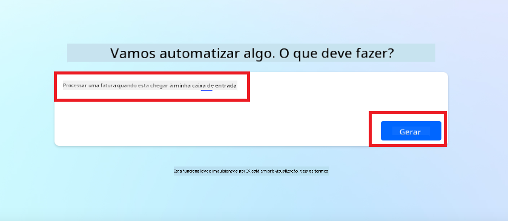
3. O AI Copilot irá sugerir as ações que precisa de realizar para a tarefa que deseja automatizar. Pode clicar no botão **Seguinte** para prosseguir para os próximos passos.
4. No passo seguinte, o Power Automate irá pedir-lhe para configurar as conexões necessárias para o fluxo. Quando terminar, clique no botão **Criar fluxo** para criar o fluxo.
5. O AI Copilot irá gerar um fluxo e poderá então personalizar o fluxo para atender às suas necessidades.
6. Atualize o gatilho do fluxo e defina a **Pasta** para a pasta onde as faturas serão armazenadas. Por exemplo, pode definir a pasta para **Caixa de Entrada**. Clique em **Mostrar opções avançadas** e defina **Apenas com Anexos** para **Sim**. Isto garantirá que o fluxo só é executado quando um email com um anexo é recebido na pasta.
7. Remova as seguintes ações do fluxo: **HTML para texto**, **Compor**, **Compor 2**, **Compor 3** e **Compor 4** porque não as usará.
8. Remova a ação **Condição** do fluxo porque não a usará. Deve ficar como na seguinte captura de ecrã: 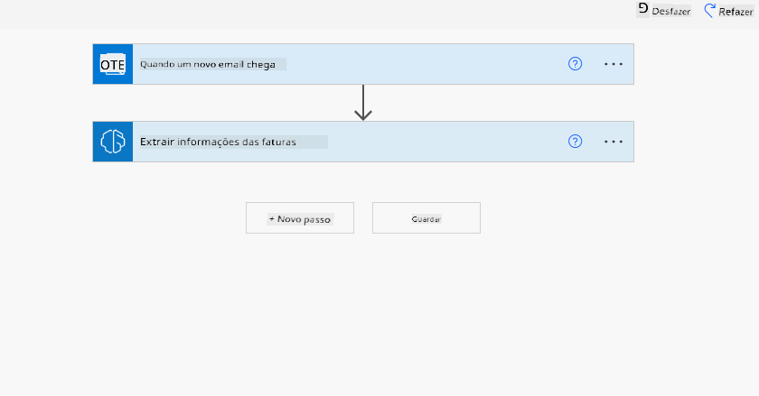
9. Clique no botão **Adicionar uma ação** e procure por **Dataverse**. Selecione a ação **Adicionar uma nova linha**.
10. Na ação **Extrair Informações das faturas**, atualize o **Arquivo da Fatura** para apontar para o **Conteúdo do Anexo** do email. Isto garantirá que o fluxo extrai informações do anexo da fatura.
11. Selecione a **Tabela** que criou anteriormente. Por exemplo, pode selecionar a tabela **Informações da Fatura**. Escolha o conteúdo dinâmico da ação anterior para preencher os seguintes campos:
    - ID
    - Valor
    - Data
    - Nome
    - Estado
    - Defina o **Estado** para **Pendente**.
    - Email do Fornecedor
    - Use o conteúdo dinâmico **De** do gatilho **Quando um novo email chega**. 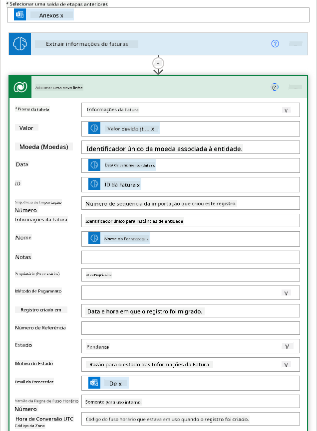
12. Quando terminar o fluxo, clique no botão **Guardar** para guardar o fluxo. Pode então testar o fluxo enviando um email com uma fatura para a pasta que especificou no gatilho.

> **O seu trabalho de casa**: O fluxo que acabou de construir é um bom começo, agora precisa de pensar em como pode construir uma automação que permita à nossa equipa financeira enviar um email ao fornecedor para atualizá-lo com o estado atual da sua fatura. A sua dica: o fluxo deve ser executado quando o estado da fatura mudar.

## Use um Modelo de IA de Geração de Texto no Power Automate

O Modelo de IA Criar Texto com GPT no AI Builder permite-lhe gerar texto com base numa sugestão e é alimentado pelo Microsoft Azure OpenAI Service. Com esta capacidade, pode incorporar a tecnologia GPT (Generative Pre-Trained Transformer) nas suas aplicações e fluxos para construir uma variedade de fluxos automatizados e aplicações perspicazes.

Os modelos GPT passam por um extenso treino em grandes quantidades de dados, permitindo-lhes produzir texto que se assemelha muito à linguagem humana quando fornecidos com uma sugestão. Quando integrados com automação de fluxo de trabalho, modelos de IA como o GPT podem ser aproveitados para simplificar e automatizar uma ampla gama de tarefas.

Por exemplo, pode construir fluxos para gerar automaticamente texto para uma variedade de casos de uso, como: rascunhos de emails, descrições de produtos, e mais. Também pode usar o modelo para gerar texto para uma variedade de aplicações, como chatbots e aplicações de serviço ao cliente que permitem que os agentes de serviço ao cliente respondam de forma eficaz e eficiente às consultas dos clientes.

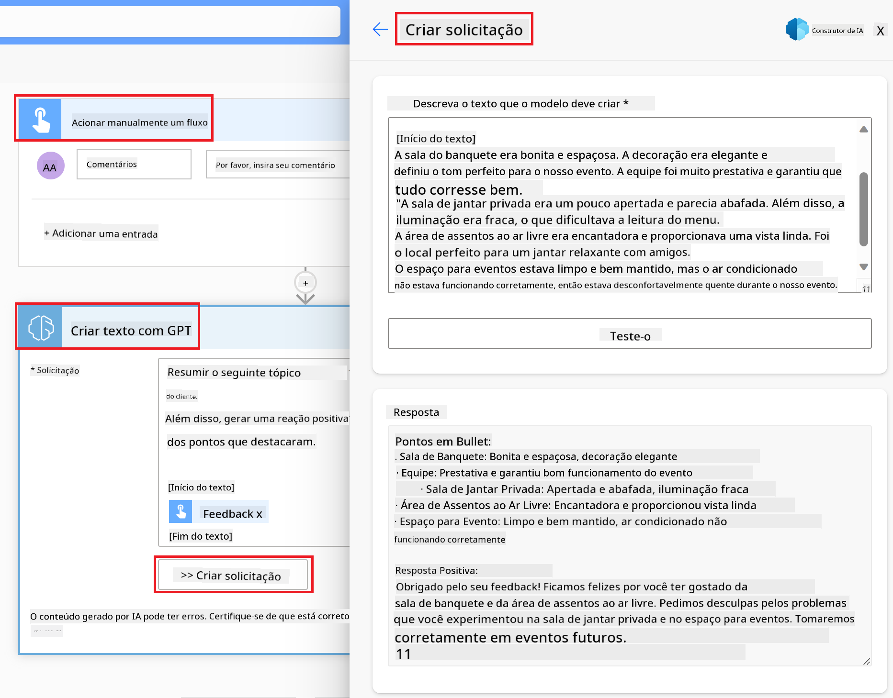

Para aprender como usar este Modelo de IA no Power Automate, consulte o módulo [Adicionar inteligência com AI Builder e GPT](https://learn.microsoft.com/training/modules/ai-builder-text-generation/?WT.mc_id=academic-109639-somelezediko).

## Bom Trabalho! Continue a Aprender

Após completar esta lição, confira a nossa [coleção de Aprendizagem de IA Generativa](https://aka.ms/genai-collection?WT.mc_id=academic-105485-koreyst) para continuar a aprimorar o seu conhecimento sobre IA Generativa!

Dirija-se à Lição 11 onde vamos ver como [integrar IA Generativa com Chamadas de Função](../11-integrating-with-function-calling/README.md?WT.mc_id=academic-105485-koreyst)!

**Aviso Legal**:  
Este documento foi traduzido utilizando o serviço de tradução por IA [Co-op Translator](https://github.com/Azure/co-op-translator). Embora nos esforcemos para garantir a precisão, esteja ciente de que traduções automáticas podem conter erros ou imprecisões. O documento original na sua língua nativa deve ser considerado a fonte autoritária. Para informações críticas, recomenda-se a tradução profissional humana. Não nos responsabilizamos por quaisquer mal-entendidos ou interpretações erradas decorrentes do uso desta tradução.