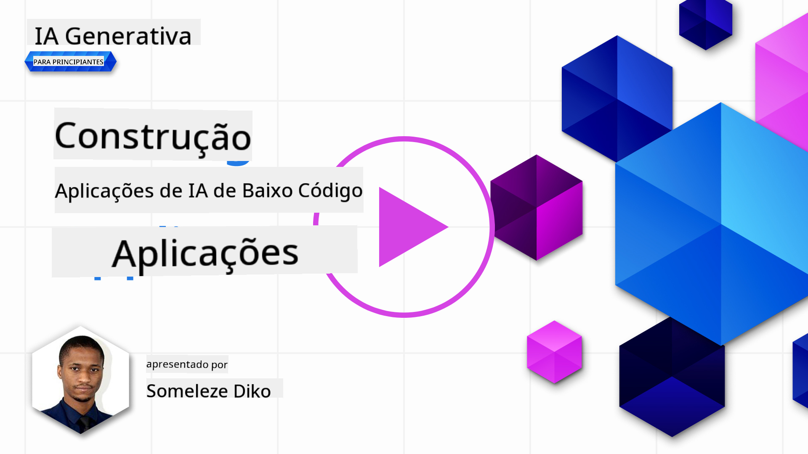
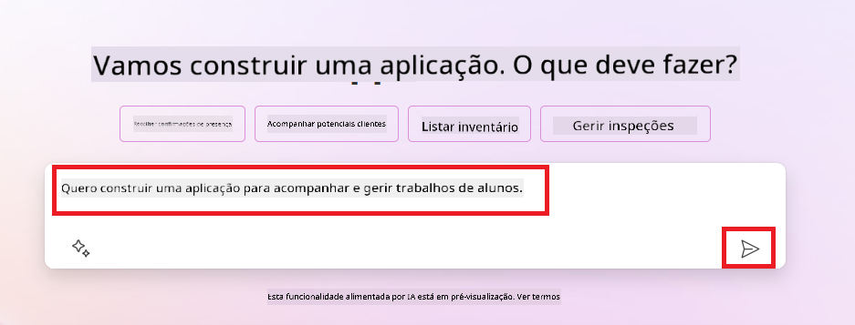
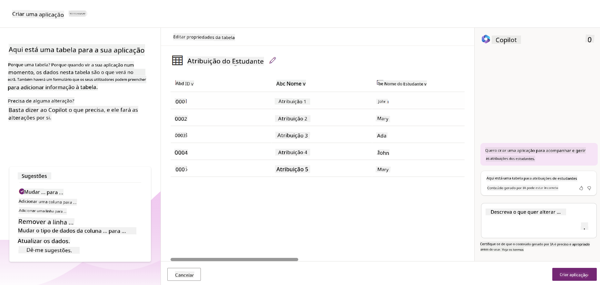
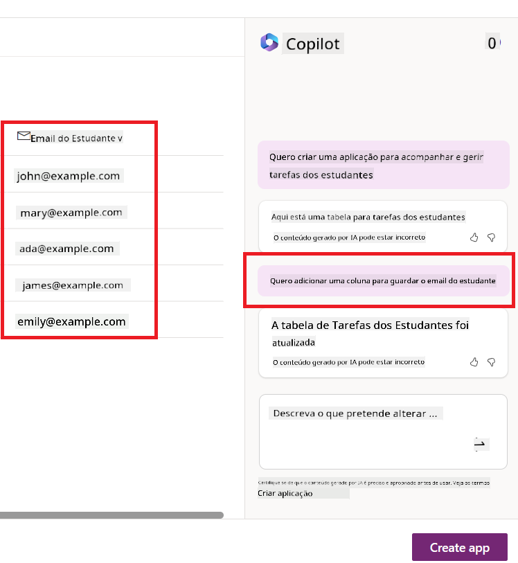
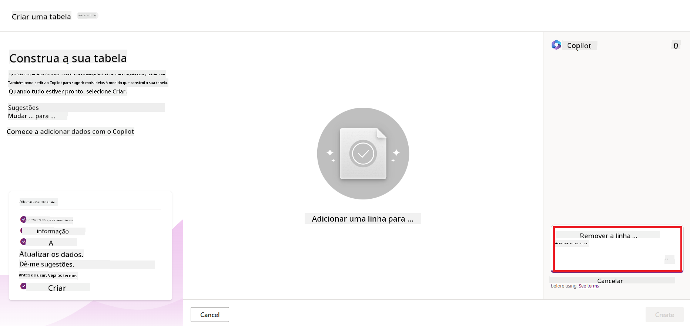
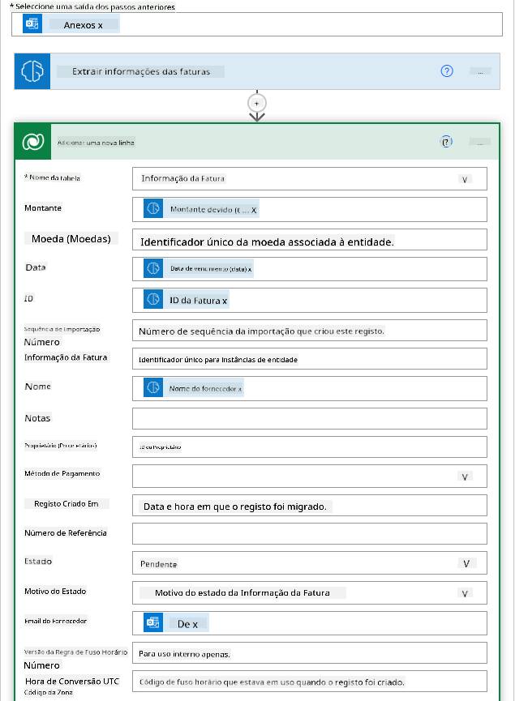
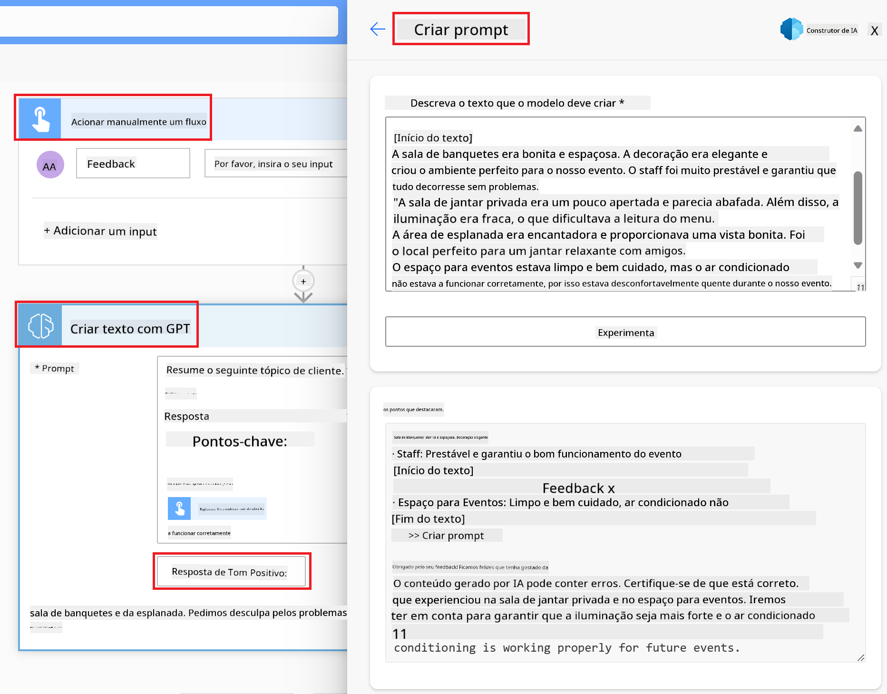

<!--
CO_OP_TRANSLATOR_METADATA:
{
  "original_hash": "f5ff3b6204a695a117d6f452403c95f7",
  "translation_date": "2025-07-09T13:55:19+00:00",
  "source_file": "10-building-low-code-ai-applications/README.md",
  "language_code": "pt"
}
-->
# Construir Aplicações de IA Low Code

> _(Clique na imagem acima para ver o vídeo desta lição)_

## Introdução

Agora que aprendemos a construir aplicações de geração de imagens, vamos falar sobre low code. A IA generativa pode ser usada em várias áreas, incluindo low code, mas o que é low code e como podemos adicionar IA a isso?

Construir aplicações e soluções tornou-se mais fácil para programadores tradicionais e não programadores através do uso de Plataformas de Desenvolvimento Low Code. Estas plataformas permitem criar aplicações e soluções com pouco ou nenhum código. Isto é possível graças a um ambiente de desenvolvimento visual que permite arrastar e largar componentes para construir aplicações e soluções. Isto permite desenvolver aplicações e soluções mais rapidamente e com menos recursos. Nesta lição, vamos aprofundar como usar Low Code e como melhorar o desenvolvimento low code com IA usando o Power Platform.

O Power Platform oferece às organizações a oportunidade de capacitar as suas equipas para construírem as suas próprias soluções através de um ambiente intuitivo low-code ou no-code. Este ambiente ajuda a simplificar o processo de construção de soluções. Com o Power Platform, as soluções podem ser construídas em dias ou semanas, em vez de meses ou anos. O Power Platform é composto por cinco produtos principais: Power Apps, Power Automate, Power BI, Power Pages e Copilot Studio.

Esta lição cobre:

- Introdução à IA Generativa no Power Platform  
- Introdução ao Copilot e como usá-lo  
- Usar IA Generativa para construir aplicações e fluxos no Power Platform  
- Compreender os Modelos de IA no Power Platform com AI Builder  

## Objetivos de Aprendizagem

No final desta lição, será capaz de:

- Compreender como o Copilot funciona no Power Platform.

- Construir uma App de Gestão de Trabalhos de Estudantes para a nossa startup de educação.

- Construir um Fluxo de Processamento de Faturas que usa IA para extrair informação das faturas.

- Aplicar as melhores práticas ao usar o Modelo de IA Create Text with GPT.

As ferramentas e tecnologias que irá usar nesta lição são:

- **Power Apps**, para a app de Gestão de Trabalhos de Estudantes, que oferece um ambiente de desenvolvimento low-code para construir aplicações que acompanham, gerem e interajam com dados.

- **Dataverse**, para armazenar os dados da app de Gestão de Trabalhos de Estudantes, onde o Dataverse fornecerá uma plataforma de dados low-code para armazenar os dados da aplicação.

- **Power Automate**, para o fluxo de Processamento de Faturas, onde terá um ambiente de desenvolvimento low-code para construir fluxos de trabalho que automatizam o processo de processamento de faturas.

- **AI Builder**, para o Modelo de IA de Processamento de Faturas, onde usará modelos de IA pré-construídos para processar as faturas da nossa startup.

## IA Generativa no Power Platform

Melhorar o desenvolvimento low-code e as aplicações com IA generativa é uma área-chave de foco para o Power Platform. O objetivo é permitir que todos construam aplicações, sites, dashboards e automatizem processos com IA, _sem necessidade de conhecimentos em ciência de dados_. Este objetivo é alcançado integrando IA generativa na experiência de desenvolvimento low-code do Power Platform na forma do Copilot e do AI Builder.

### Como funciona?

O Copilot é um assistente de IA que permite construir soluções no Power Platform descrevendo os seus requisitos numa série de passos conversacionais usando linguagem natural. Pode, por exemplo, instruir o seu assistente de IA a indicar quais os campos que a sua app vai usar e ele criará tanto a app como o modelo de dados subjacente, ou pode especificar como configurar um fluxo no Power Automate.

Pode usar funcionalidades impulsionadas pelo Copilot como uma funcionalidade nas suas telas de app para permitir que os utilizadores descubram insights através de interações conversacionais.

O AI Builder é uma capacidade de IA low-code disponível no Power Platform que permite usar Modelos de IA para ajudar a automatizar processos e prever resultados. Com o AI Builder pode trazer IA para as suas apps e fluxos que se ligam aos seus dados no Dataverse ou em várias fontes de dados na cloud, como SharePoint, OneDrive ou Azure.

O Copilot está disponível em todos os produtos do Power Platform: Power Apps, Power Automate, Power BI, Power Pages e Power Virtual Agents. O AI Builder está disponível no Power Apps e Power Automate. Nesta lição, vamos focar-nos em como usar o Copilot e o AI Builder no Power Apps e Power Automate para construir uma solução para a nossa startup de educação.

### Copilot no Power Apps

Como parte do Power Platform, o Power Apps oferece um ambiente de desenvolvimento low-code para construir aplicações que acompanham, gerem e interajam com dados. É um conjunto de serviços de desenvolvimento de aplicações com uma plataforma de dados escalável e a capacidade de se ligar a serviços cloud e dados on-premises. O Power Apps permite construir aplicações que funcionam em browsers, tablets e telemóveis, e podem ser partilhadas com colegas. O Power Apps facilita a entrada dos utilizadores no desenvolvimento de aplicações com uma interface simples, para que qualquer utilizador de negócio ou programador profissional possa construir aplicações personalizadas. A experiência de desenvolvimento de aplicações é também melhorada com IA Generativa através do Copilot.

A funcionalidade do assistente de IA Copilot no Power Apps permite descrever que tipo de app precisa e que informação quer que a sua app acompanhe, recolha ou mostre. O Copilot gera então uma app Canvas responsiva baseada na sua descrição. Pode depois personalizar a app para satisfazer as suas necessidades. O AI Copilot também gera e sugere uma Tabela Dataverse com os campos necessários para armazenar os dados que quer acompanhar e alguns dados de exemplo. Vamos ver o que é o Dataverse e como pode usá-lo no Power Apps mais à frente nesta lição. Pode depois personalizar a tabela para as suas necessidades usando a funcionalidade do assistente AI Copilot através de passos conversacionais. Esta funcionalidade está disponível diretamente a partir do ecrã inicial do Power Apps.

### Copilot no Power Automate

Como parte do Power Platform, o Power Automate permite aos utilizadores criar fluxos de trabalho automatizados entre aplicações e serviços. Ajuda a automatizar processos empresariais repetitivos, como comunicação, recolha de dados e aprovações de decisões. A sua interface simples permite que utilizadores de todos os níveis técnicos (desde iniciantes a programadores experientes) automatizem tarefas de trabalho. A experiência de desenvolvimento de fluxos é também melhorada com IA Generativa através do Copilot.

A funcionalidade do assistente de IA Copilot no Power Automate permite descrever que tipo de fluxo precisa e que ações quer que o seu fluxo execute. O Copilot gera então um fluxo baseado na sua descrição. Pode depois personalizar o fluxo para satisfazer as suas necessidades. O AI Copilot também gera e sugere as ações necessárias para realizar a tarefa que quer automatizar. Vamos ver o que são fluxos e como pode usá-los no Power Automate mais à frente nesta lição. Pode depois personalizar as ações para as suas necessidades usando a funcionalidade do assistente AI Copilot através de passos conversacionais. Esta funcionalidade está disponível diretamente a partir do ecrã inicial do Power Automate.

## Tarefa: Gerir trabalhos de estudantes e faturas para a nossa startup, usando Copilot

A nossa startup oferece cursos online a estudantes. A startup cresceu rapidamente e agora está a ter dificuldades em acompanhar a procura pelos seus cursos. A startup contratou-o como desenvolvedor Power Platform para os ajudar a construir uma solução low code que os ajude a gerir os trabalhos dos estudantes e as faturas. A solução deve permitir acompanhar e gerir os trabalhos dos estudantes através de uma app e automatizar o processo de processamento de faturas através de um fluxo de trabalho. Foi-lhe pedido que usasse IA Generativa para desenvolver a solução.

Quando começar a usar o Copilot, pode usar a [Power Platform Copilot Prompt Library](https://github.com/pnp/powerplatform-prompts?WT.mc_id=academic-109639-somelezediko) para se familiarizar com os prompts. Esta biblioteca contém uma lista de prompts que pode usar para construir apps e fluxos com o Copilot. Pode também usar os prompts da biblioteca para ter uma ideia de como descrever os seus requisitos ao Copilot.

### Construir uma App de Gestão de Trabalhos de Estudantes para a Nossa Startup

Os educadores da nossa startup têm tido dificuldades em acompanhar os trabalhos dos estudantes. Têm usado uma folha de cálculo para acompanhar os trabalhos, mas isso tornou-se difícil de gerir à medida que o número de estudantes aumentou. Pediram-lhe para construir uma app que os ajude a acompanhar e gerir os trabalhos dos estudantes. A app deve permitir adicionar novos trabalhos, ver trabalhos, atualizar trabalhos e eliminar trabalhos. A app deve também permitir que educadores e estudantes vejam os trabalhos que já foram avaliados e os que ainda não foram avaliados.

Vai construir a app usando o Copilot no Power Apps seguindo os passos abaixo:

1. Navegue até ao ecrã inicial do [Power Apps](https://make.powerapps.com?WT.mc_id=academic-105485-koreyst).

1. Use a área de texto no ecrã inicial para descrever a app que quer construir. Por exemplo, **_Quero construir uma app para acompanhar e gerir trabalhos de estudantes_**. Clique no botão **Enviar** para enviar o prompt ao AI Copilot.

1. O AI Copilot irá sugerir uma Tabela Dataverse com os campos necessários para armazenar os dados que quer acompanhar e alguns dados de exemplo. Pode depois personalizar a tabela para as suas necessidades usando a funcionalidade do assistente AI Copilot através de passos conversacionais.

   > **Importante**: O Dataverse é a plataforma de dados subjacente ao Power Platform. É uma plataforma de dados low-code para armazenar os dados da app. É um serviço totalmente gerido que armazena dados de forma segura na Microsoft Cloud e é provisionado dentro do seu ambiente Power Platform. Vem com capacidades integradas de governação de dados, como classificação de dados, linhagem de dados, controlo de acesso detalhado, e mais. Pode saber mais sobre o Dataverse [aqui](https://docs.microsoft.com/powerapps/maker/data-platform/data-platform-intro?WT.mc_id=academic-109639-somelezediko).

   

1. Os educadores querem enviar emails aos estudantes que submeteram os seus trabalhos para os manter atualizados sobre o progresso dos mesmos. Pode usar o Copilot para adicionar um novo campo à tabela para armazenar o email do estudante. Por exemplo, pode usar o seguinte prompt para adicionar um novo campo à tabela: **_Quero adicionar uma coluna para armazenar o email do estudante_**. Clique no botão **Enviar** para enviar o prompt ao AI Copilot.

1. O AI Copilot irá gerar um novo campo e pode depois personalizar o campo para as suas necessidades.

1. Quando terminar com a tabela, clique no botão **Criar app** para criar a app.

1. O AI Copilot irá gerar uma app Canvas responsiva baseada na sua descrição. Pode depois personalizar a app para as suas necessidades.

1. Para os educadores enviarem emails aos estudantes, pode usar o Copilot para adicionar um novo ecrã à app. Por exemplo, pode usar o seguinte prompt para adicionar um novo ecrã à app: **_Quero adicionar um ecrã para enviar emails aos estudantes_**. Clique no botão **Enviar** para enviar o prompt ao AI Copilot.

1. O AI Copilot irá gerar um novo ecrã e pode depois personalizar o ecrã para as suas necessidades.

1. Quando terminar com a app, clique no botão **Guardar** para guardar a app.

1. Para partilhar a app com os educadores, clique no botão **Partilhar** e depois clique novamente no botão **Partilhar**. Pode então partilhar a app com os educadores introduzindo os seus endereços de email.

> **O seu trabalho de casa**: A app que acabou de construir é um bom começo, mas pode ser melhorada. Com a funcionalidade de email, os educadores só podem enviar emails aos estudantes manualmente, tendo de escrever os emails. Consegue usar o Copilot para construir uma automação que permita aos educadores enviar emails automaticamente aos estudantes quando estes submetem os seus trabalhos? A dica é que com o prompt certo pode usar o Copilot no Power Automate para construir isto.

### Construir uma Tabela de Informação de Faturas para a Nossa Startup

A equipa financeira da nossa startup tem tido dificuldades em acompanhar as faturas. Têm usado uma folha de cálculo para acompanhar as faturas, mas isso tornou-se difícil de gerir à medida que o número de faturas aumentou. Pediram-lhe para construir uma tabela que os ajude a armazenar, acompanhar e gerir a informação das faturas que recebem. A tabela deve ser usada para construir uma automação que extraia toda a informação das faturas e a armazene na tabela. A tabela deve também permitir à equipa financeira ver as faturas que já foram pagas e as que ainda não foram pagas.

O Power Platform tem uma plataforma de dados subjacente chamada Dataverse que permite armazenar os dados das suas apps e soluções. O Dataverse fornece uma plataforma de dados low-code para armazenar os dados da app. É um serviço totalmente gerido que armazena dados de forma segura na Microsoft Cloud e é provisionado dentro do seu ambiente Power Platform. Vem com capacidades integradas de governação de dados, como classificação de dados, linhagem de dados, controlo de acesso detalhado, e mais. Pode saber mais [sobre o Dataverse aqui](https://docs.microsoft.com/powerapps/maker/data-platform/data-platform-intro?WT.mc_id=academic-109639-somelezediko).

Porque devemos usar o Dataverse para a nossa startup? As tabelas padrão e personalizadas dentro do Dataverse oferecem uma opção segura e baseada na cloud para armazenar os seus dados. As tabelas permitem armazenar diferentes tipos de dados, de forma semelhante a como usaria várias folhas de cálculo num único livro Excel. Pode usar tabelas para armazenar dados específicos da sua organização ou necessidades de negócio. Alguns dos benefícios que a nossa startup terá ao usar o Dataverse incluem, mas não se limitam a:
- **Fácil de gerir**: Tanto os metadados como os dados são armazenados na cloud, por isso não precisa de se preocupar com os detalhes de como são guardados ou geridos. Pode concentrar-se em construir as suas aplicações e soluções.

- **Seguro**: O Dataverse oferece uma opção de armazenamento segura e baseada na cloud para os seus dados. Pode controlar quem tem acesso aos dados nas suas tabelas e como podem aceder a eles, utilizando segurança baseada em funções.

- **Metadados ricos**: Os tipos de dados e as relações são usados diretamente no Power Apps.

- **Lógica e validação**: Pode usar regras de negócio, campos calculados e regras de validação para aplicar a lógica de negócio e manter a precisão dos dados.

Agora que sabe o que é o Dataverse e por que deve usá-lo, vamos ver como pode usar o Copilot para criar uma tabela no Dataverse que satisfaça os requisitos da nossa equipa financeira.

> **Note** : Vai usar esta tabela na próxima secção para construir uma automação que irá extrair toda a informação das faturas e armazená-la na tabela.

Para criar uma tabela no Dataverse usando o Copilot, siga os passos abaixo:

1. Navegue até ao ecrã inicial do [Power Apps](https://make.powerapps.com?WT.mc_id=academic-105485-koreyst).

2. Na barra de navegação à esquerda, selecione **Tables** e depois clique em **Describe the new Table**.

3. No ecrã **Describe the new Table**, use a área de texto para descrever a tabela que pretende criar. Por exemplo, **_Quero criar uma tabela para armazenar informação de faturas_**. Clique no botão **Send** para enviar o pedido ao AI Copilot.

4. O AI Copilot irá sugerir uma Tabela Dataverse com os campos necessários para armazenar os dados que pretende acompanhar, bem como alguns dados de exemplo. Pode depois personalizar a tabela para satisfazer as suas necessidades usando a funcionalidade de assistente do AI Copilot através de passos conversacionais.

5. A equipa financeira quer enviar um email ao fornecedor para o atualizar sobre o estado atual da sua fatura. Pode usar o Copilot para adicionar um novo campo à tabela para armazenar o email do fornecedor. Por exemplo, pode usar o seguinte pedido para adicionar um novo campo à tabela: **_Quero adicionar uma coluna para armazenar o email do fornecedor_**. Clique no botão **Send** para enviar o pedido ao AI Copilot.

6. O AI Copilot irá gerar um novo campo e pode depois personalizá-lo para satisfazer as suas necessidades.

7. Quando terminar a tabela, clique no botão **Create** para criar a tabela.

## Modelos de IA na Power Platform com AI Builder

O AI Builder é uma funcionalidade de IA low-code disponível na Power Platform que lhe permite usar Modelos de IA para ajudar a automatizar processos e prever resultados. Com o AI Builder pode trazer IA para as suas aplicações e fluxos que se ligam aos seus dados no Dataverse ou em várias fontes de dados na cloud, como SharePoint, OneDrive ou Azure.

## Modelos de IA pré-construídos vs Modelos de IA personalizados

O AI Builder oferece dois tipos de Modelos de IA: Modelos de IA pré-construídos e Modelos de IA personalizados. Os Modelos de IA pré-construídos são modelos prontos a usar, treinados pela Microsoft e disponíveis na Power Platform. Estes ajudam-no a adicionar inteligência às suas aplicações e fluxos sem ter de recolher dados e depois construir, treinar e publicar os seus próprios modelos. Pode usar estes modelos para automatizar processos e prever resultados.

Alguns dos Modelos de IA pré-construídos disponíveis na Power Platform incluem:

- **Extração de Frases-Chave**: Este modelo extrai frases-chave de texto.
- **Deteção de Língua**: Este modelo deteta a língua de um texto.
- **Análise de Sentimento**: Este modelo deteta sentimentos positivos, negativos, neutros ou mistos no texto.
- **Leitor de Cartões de Visita**: Este modelo extrai informação de cartões de visita.
- **Reconhecimento de Texto**: Este modelo extrai texto de imagens.
- **Deteção de Objetos**: Este modelo deteta e extrai objetos de imagens.
- **Processamento de Documentos**: Este modelo extrai informação de formulários.
- **Processamento de Faturas**: Este modelo extrai informação de faturas.

Com os Modelos de IA personalizados pode trazer o seu próprio modelo para o AI Builder para que funcione como qualquer modelo personalizado do AI Builder, permitindo-lhe treinar o modelo usando os seus próprios dados. Pode usar estes modelos para automatizar processos e prever resultados tanto no Power Apps como no Power Automate. Quando usa o seu próprio modelo, aplicam-se algumas limitações. Saiba mais sobre estas [limitações](https://learn.microsoft.com/ai-builder/byo-model#limitations?WT.mc_id=academic-105485-koreyst).

## Tarefa #2 - Criar um Fluxo de Processamento de Faturas para a Nossa Startup

A equipa financeira tem tido dificuldades em processar faturas. Têm usado uma folha de cálculo para acompanhar as faturas, mas isso tornou-se difícil de gerir à medida que o número de faturas aumentou. Pediram-lhe para criar um fluxo de trabalho que os ajude a processar faturas usando IA. O fluxo de trabalho deve permitir-lhes extrair informação das faturas e armazenar essa informação numa tabela do Dataverse. O fluxo de trabalho deve também permitir enviar um email à equipa financeira com a informação extraída.

Agora que sabe o que é o AI Builder e por que deve usá-lo, vamos ver como pode usar o Modelo de IA de Processamento de Faturas no AI Builder, que abordámos anteriormente, para criar um fluxo de trabalho que ajude a equipa financeira a processar faturas.

Para criar um fluxo de trabalho que ajude a equipa financeira a processar faturas usando o Modelo de IA de Processamento de Faturas no AI Builder, siga os passos abaixo:

1. Navegue até ao ecrã inicial do [Power Automate](https://make.powerautomate.com?WT.mc_id=academic-105485-koreyst).

2. Use a área de texto no ecrã inicial para descrever o fluxo de trabalho que pretende criar. Por exemplo, **_Processar uma fatura quando chegar à minha caixa de correio_**. Clique no botão **Send** para enviar o pedido ao AI Copilot.

   

3. O AI Copilot irá sugerir as ações necessárias para realizar a tarefa que pretende automatizar. Pode clicar no botão **Next** para avançar para os passos seguintes.

4. No passo seguinte, o Power Automate irá pedir-lhe para configurar as ligações necessárias para o fluxo. Quando terminar, clique no botão **Create flow** para criar o fluxo.

5. O AI Copilot irá gerar um fluxo e pode depois personalizá-lo para satisfazer as suas necessidades.

6. Atualize o gatilho do fluxo e defina a **Folder** para a pasta onde as faturas serão armazenadas. Por exemplo, pode definir a pasta para **Inbox**. Clique em **Show advanced options** e defina **Only with Attachments** para **Yes**. Isto garantirá que o fluxo só é executado quando um email com anexo for recebido na pasta.

7. Remova as seguintes ações do fluxo: **HTML to text**, **Compose**, **Compose 2**, **Compose 3** e **Compose 4**, porque não as vai usar.

8. Remova a ação **Condition** do fluxo porque não a vai usar. O fluxo deverá ficar semelhante ao seguinte screenshot:

   

9. Clique no botão **Add an action** e pesquise por **Dataverse**. Selecione a ação **Add a new row**.

10. Na ação **Extract Information from invoices**, atualize o campo **Invoice File** para apontar para o **Attachment Content** do email. Isto garantirá que o fluxo extrai informação do anexo da fatura.

11. Selecione a **Table** que criou anteriormente. Por exemplo, pode selecionar a tabela **Invoice Information**. Escolha o conteúdo dinâmico da ação anterior para preencher os seguintes campos:

    - ID
    - Amount
    - Date
    - Name
    - Status - Defina o **Status** para **Pending**.
    - Supplier Email - Use o conteúdo dinâmico **From** do gatilho **When a new email arrives**.

    

12. Quando terminar o fluxo, clique no botão **Save** para guardar o fluxo. Pode depois testar o fluxo enviando um email com uma fatura para a pasta que especificou no gatilho.

> **O seu trabalho de casa**: O fluxo que acabou de criar é um bom começo, agora precisa de pensar em como pode construir uma automação que permita à nossa equipa financeira enviar um email ao fornecedor para o atualizar sobre o estado atual da sua fatura. Uma dica: o fluxo deve ser executado quando o estado da fatura mudar.

## Usar um Modelo de IA de Geração de Texto no Power Automate

O Modelo de IA Create Text with GPT no AI Builder permite-lhe gerar texto com base num pedido e é alimentado pelo Microsoft Azure OpenAI Service. Com esta funcionalidade, pode incorporar a tecnologia GPT (Generative Pre-Trained Transformer) nas suas aplicações e fluxos para criar uma variedade de fluxos automatizados e aplicações informativas.

Os modelos GPT passam por um treino extensivo com grandes quantidades de dados, permitindo-lhes produzir texto que se assemelha muito à linguagem humana quando recebem um pedido. Quando integrados com a automação de fluxos de trabalho, modelos de IA como o GPT podem ser usados para simplificar e automatizar uma vasta gama de tarefas.

Por exemplo, pode criar fluxos para gerar automaticamente texto para vários casos de uso, como: rascunhos de emails, descrições de produtos e muito mais. Pode também usar o modelo para gerar texto para várias aplicações, como chatbots e aplicações de serviço ao cliente que permitem aos agentes responder de forma eficaz e eficiente às perguntas dos clientes.

Para aprender a usar este Modelo de IA no Power Automate, consulte o módulo [Add intelligence with AI Builder and GPT](https://learn.microsoft.com/training/modules/ai-builder-text-generation/?WT.mc_id=academic-109639-somelezediko).

## Excelente trabalho! Continue a sua aprendizagem

Depois de concluir esta lição, consulte a nossa [coleção de aprendizagem sobre IA Generativa](https://aka.ms/genai-collection?WT.mc_id=academic-105485-koreyst) para continuar a aprofundar os seus conhecimentos em IA Generativa!

Siga para a Lição 11, onde veremos como [integrar IA Generativa com Function Calling](../11-integrating-with-function-calling/README.md?WT.mc_id=academic-105485-koreyst)!

**Aviso Legal**:  
Este documento foi traduzido utilizando o serviço de tradução automática [Co-op Translator](https://github.com/Azure/co-op-translator). Embora nos esforcemos pela precisão, por favor tenha em conta que traduções automáticas podem conter erros ou imprecisões. O documento original na sua língua nativa deve ser considerado a fonte autorizada. Para informações críticas, recomenda-se tradução profissional humana. Não nos responsabilizamos por quaisquer mal-entendidos ou interpretações incorretas decorrentes da utilização desta tradução.